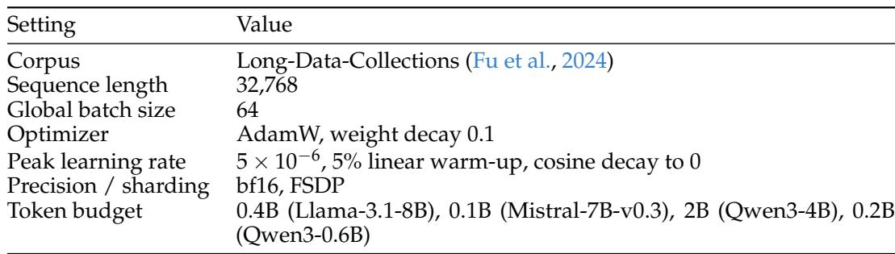
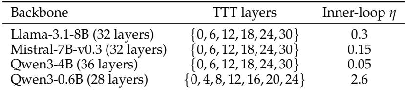
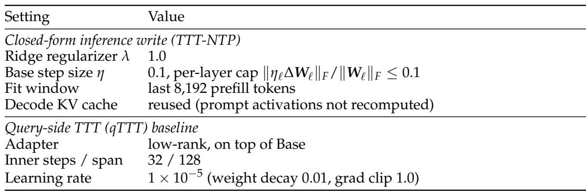

[← 返回 README](../README.md)

# 6. Appendix（附录：超参数与推理配置）

## 📌 预览

附录三个表给出复现所需的全部超参：
- **A / Table 5**：continual pretraining 配方（CPT / In-Place TTT / TTT-NTP 共享）。
- **B / Table 6**：fast-weight 的 placement 和 inner-loop $\eta$（per-backbone）。
- **C / Table 7**：推理时配置（TTT-NTP 闭式 write + qTTT baseline）。

References 部分不单独批注，归入本 section。

---

## A Training Hyperparameters

CPT, the In-Place TTT baseline, and TTT-NTP share the continual-pretraining recipe in table 5; the per-backbone token budget is the only setting that varies across models. Each batch element is a single document of at least 32,768 tokens (no packing), and the outer loss is standard next-token cross-entropy. The Qwen3-0.6B checkpoint is a shared step-100 snapshot used as a smaller-scale consistency check rather than a compute-scaling study.

*Table 5: Continual-pretraining hyperparameters, shared by CPT, In-Place TTT, and TTT-NTP.*

> 💡 **Table 5 批读**（Hao 批注）: 复现要点——语料 Long-Data-Collections，序列长 32768，global batch 64，AdamW（weight decay 0.1），peak lr $5\times10^{-6}$（5% warm-up，cosine 到 0），bf16 + FSDP。**关键控制**：每个 batch element 是单个 ≥32768-token 的完整文档（no packing），outer loss 是标准 NTP 交叉熵。token budget 是唯一跨模型变化的设置——这就是为什么 §4.1 强调「matched compute」时要分别看各 backbone 的 budget。Qwen3-0.6B 用的是 step-100 快照，只作小规模一致性检查，不是 compute-scaling 研究（所以别把它当规模实验读）。

## B Fast-Weight TTT Hyperparameters

Both fast-weight variants (In-Place TTT and TTT-NTP) reuse each adapted layer’s MLP down-projection as the fast weight, $W_{\ell} = W_{\ell}^{\mathrm{down}}$ , with the current gated activation $z_{\ell,t}$ as the key (no extra key projection). They differ only in the value target: TTT-NTP uses the next-position state $h_{\ell,t+1}$ through a learned d×d interface $W_{\ell}^{\mathrm{proj}}.$ , while In-Place TTT uses the published convolutional proxy. Under the inner-product inner loss (eqs. (2) and (5)), η scales the rank-one write directly rather than acting as a gradient step, so its tuned value varies widely across backbones (table 6).

Writes are accumulated chunk-parallel (chunks of 1024; an exclusive prefix sum lets chunk c see only earlier chunks; section 3.3). $W_{\ell}^{\mathrm{proj}}$ is identity-initialized and trained jointly under the standard next-token CPT loss—the only TTT-NTP-specific parameter, adding a negligible $\lvert\mathcal{A}\rvert d^{2}$ weights.

*Table 6: Per-backbone fast-weight placement and inner-loop learning rate $\eta,$ shared by In-Place TTT and TTT-NTP (chunk size 1024 throughout).*

> 💡 **Table 6 批读**（Hao 批注）: 这张表暴露一个容易踩坑的点——$\eta$ 跨 backbone 差异极大（Llama 0.3、Mistral 0.15、Qwen3-4B 0.05、Qwen3-0.6B **2.6**）。
> - **为什么差这么多？** 因为在 inner-product inner loss 下，$\eta$ **不是标准梯度步长，而是直接 scale rank-one write 的幅度**（见 Eq. 5，write = $\eta \cdot v z^\top$）。所以它更像一个「写入强度」旋钮，需按 backbone 的激活尺度单独调。
> - **placement**：大模型每隔 6 层放一个 fast weight（{0,6,12,18,24,30}），Qwen3-0.6B 层数少（28 层）放 7 个（{0,4,...,24}）。这印证 §3.2 说的「只在选定层 $\mathcal{A}$ 放」。
> - **参数开销**：唯一新增参数 $W_{\ell}^{\text{proj}}$（identity 初始化），总量 $\lvert\mathcal{A}\rvert d^2$，可忽略——这支撑「drop-in、几乎不加参数」的卖点。
> - chunk size 全程 1024。

## C Inference-Time Configurations

Table 7 lists the inference-time settings for our closed-form write and for the qTTT baseline; CPT and In-Place TTT add no inference-time adaptation and follow tables 5 and 6. The closed-form write uses one fixed configuration across all context lengths and backbones, and reusing the prompt key–value cache means it affects decode-time computation without recomputing prompt activations under the updated down-projection.

*Table 7: Inference-time configurations: the TTT-NTP closed-form write (top) and the qTTT baseline (bottom).*

> 💡 **Table 7 批读**（Hao 批注）: 推理配置的两个关键点。
> - **闭式 write（TTT-NTP）**：ridge $\lambda=1.0$；base step $\eta=0.1$ 并带 per-layer cap $\lVert\eta_{\ell}\Delta W_{\ell}\rVert_F / \lVert W_{\ell}\rVert_F \le 0.1$（限制单层扰动相对幅度，防止写太狠把 down-projection 打坏——和 §4.6 Mistral 回退现象呼应）；fit window 取最后 8192 个 prefill token；decode 复用 KV cache（不重算 prompt 激活）。**这套配置对所有长度和 backbone 固定不变**，说明方法鲁棒、不需要 per-setting 调参。
> - **qTTT baseline**：low-rank adapter 加在 Base 上，32 inner steps / span 128，lr $1\times10^{-5}$。这是 inference-only 的对照，解释了为什么它「barely moves」——它只在推理时做少量梯度步，没有 TTT-NTP 那种被 CPT 塑造过的 down-projection。

---

## References

（参考文献完整列表见 full.md，此处不逐条批注。关键参照：In-Place TTT = Feng et al. 2026；RULER = Hsieh et al. 2024；LongBench-v2 = Bai et al. 2025；qTTT = Bansal et al. 2025；Titans/test-time memory = Behrouz et al. 2026。）

---

## 🔖 Section 总结

### 复现关键数字速查

| 设置 | 值 |
|------|------|
| 序列长度 / batch | 32768 / global 64（no packing） |
| Optimizer / lr | AdamW (wd 0.1) / peak $5\times10^{-6}$，cosine |
| Token budget | Llama 0.4B，Mistral 0.1B，Qwen3-4B 2B，Qwen3-0.6B 0.2B |
| Chunk size | 1024（全程） |
| Inner-loop $\eta$ | Llama 0.3 / Mistral 0.15 / Qwen3-4B 0.05 / Qwen3-0.6B 2.6 |
| 推理 ridge $\lambda$ | 1.0 |
| 推理 base step $\eta$ | 0.1，per-layer cap 0.1 |
| Fit window | 最后 8192 prefill tokens |
| 新增参数 | $W_{\ell}^{\mathrm{proj}}$，共 $\lvert\mathcal{A}\rvert d^2$（可忽略） |

### 核心洞察

1. **唯一变量是 target**：In-Place TTT 和 TTT-NTP 共享 placement / key / chunk / $\eta$，只差 value target——附录再次坐实主文的归因逻辑。
2. **$\eta$ 是写入强度而非梯度步长**：inner-product loss 下 $\eta$ 直接 scale write，故跨 backbone 差异大（0.05–2.6）。
3. **推理配置固定且带幅度 cap**：一套配置通吃所有长度/backbone，per-layer cap 防止扰动过大——是无副作用的工程保障。
