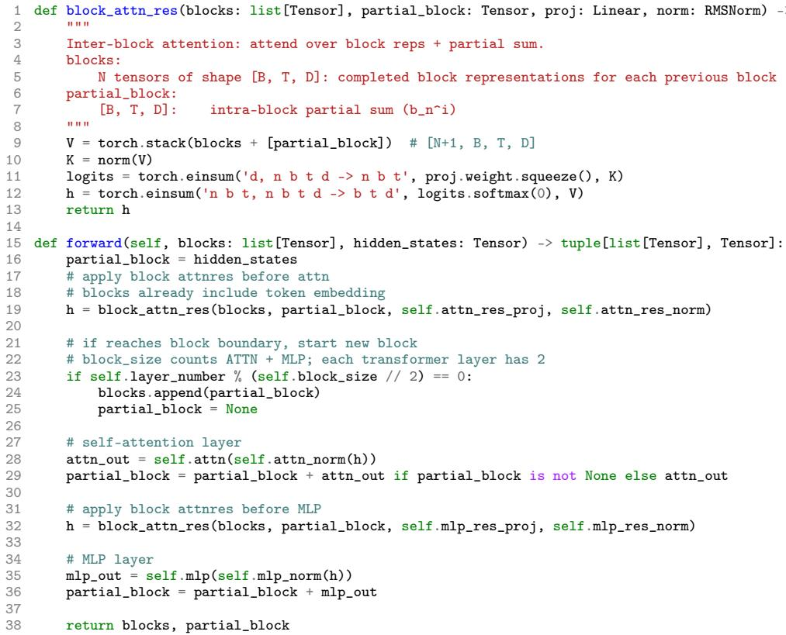

[← 返回 README](../README.md)

# 03. Attention Residuals: A Unified View of Time and Depth

## 原文保留

The limitations discussed above are reminiscent of similar bottlenecks in sequence modeling, suggesting that we seek similar solutions for the depth dimension.

The Duality of Time and Depth. Like RNNs over time, residual connections compress all prior information into a single state $\boldsymbol h_l$ over depth. For sequence modeling, the Transformer improved upon RNNs by replacing recurrence with attention [3, 52], allowing each position to selectively access all previous positions with data-dependent weights. We propose the same methodology for depth:

$$
\boldsymbol h_l=\alpha_{0\to l}\cdot \boldsymbol h_1+\sum_{i=1}^{l-1}\alpha_{i\to l}\cdot f_i(\boldsymbol h_i)
$$

where $\alpha_{i\to l}$ are layer-specific attention weights satisfying $\sum_{i=0}^{l-1}\alpha_{i\to l}=1$. Unlike sequence length, which can reach millions of tokens, network depth is typically modest, making $O(L^2)$ attention over depth computationally feasible. We call this approach Attention Residuals, abbreviated as AttnRes.

> 💡 **time-depth duality**: RNN 在时间维把历史压进一个 state，标准 residual 在深度维把历史层压进一个 state。Transformer 用 attention 解决时间维 recurrence 的瓶颈；AttnRes 用同样思路解决深度维 recurrence。

## 3.1 Full Attention Residuals

The attention weights can be written as $\alpha_{i\to l}=\phi(\boldsymbol q_l,\boldsymbol k_i)$ for a kernel function $\phi:\mathbb R^d\times\mathbb R^d\to\mathbb R_{\geq0}$, where $\boldsymbol q_l$ and $\boldsymbol k_i$ are query and key vectors [23, 70]. Different choices of $\phi$ recover different residual variants (§6.2); we adopt

$$
\phi(\boldsymbol q,\boldsymbol k)=\exp\left(\boldsymbol q^\top\mathrm{RMSNorm}(\boldsymbol k)\right),
$$

yielding softmax attention over depth:

$$
\alpha_{i\to l}=
\frac{\phi(\boldsymbol q_l,\boldsymbol k_i)}
{\sum_{j=0}^{l-1}\phi(\boldsymbol q_l,\boldsymbol k_j)}.
$$

For each layer $l$, we define:

$$
\boldsymbol q_l=\boldsymbol w_l,\qquad
\boldsymbol k_i=\boldsymbol v_i=
\begin{cases}
\boldsymbol h_1, & i=0,\\
f_i(\boldsymbol h_i), & 1\leq i\leq l-1.
\end{cases}
$$

where the query $\boldsymbol q_l=\boldsymbol w_l$ is a layer-specific learnable vector in $\mathbb R^d$. The RMSNorm inside $\phi$ prevents layers with large-magnitude outputs from dominating the attention weights. The input to layer $l$ is then:

$$
\boldsymbol h_l=\sum_{i=0}^{l-1}\alpha_{i\to l}\cdot \boldsymbol v_i.
$$

We call this form full attention residuals. For each token, Full AttnRes requires $O(L^2d)$ arithmetic and $O(Ld)$ memory to store layer outputs. Since depth is far smaller than sequence length, the arithmetic cost is modest.

> 💡 **Full AttnRes 的精髓**: key 与 value 都直接取历史 layer output，embedding 作为 $v_0$ 永远可被访问；每一层的 query 是参数 $\boldsymbol w_l$。因此它不是“当前 token 状态去问历史层”，而是“第 $l$ 层有一个固定查询偏好，和当前样本的历史输出内容相互作用”。

> 💡 **RMSNorm 的位置很重要**: RMSNorm 用在 key 上，目的是不让大幅度 layer output 仅凭 norm 变大就吞掉 softmax 概率。它把“内容相关性”和“幅度膨胀”解耦。

Overhead. The $O(Ld)$ memory overlaps entirely with the activations already retained for backpropagation, so Full AttnRes introduces no additional memory overhead in vanilla training. At scale, however, activation recomputation and pipeline parallelism are widely adopted: layer outputs that would otherwise be freed and recomputed must now be kept alive for all subsequent layers, and under pipeline parallelism each must further be transmitted across stage boundaries. Both the memory and communication overhead then grow as $O(Ld)$.

Blockwise optimization. A deliberate design choice in Full AttnRes is that the pseudo-query $\boldsymbol w_l$ is a learned parameter decoupled from the layer’s forward computation. This independence means that attention weights for any group of layers can be computed in parallel without waiting for their sequential outputs, and in particular permits grouping the $L$ layers into $N$ blocks of $S$ layers each and batching the attention computation within each block, reducing per-layer memory I/O from $O(Ld)$ to $O((S+N)d)$. Under current distributed training regimes, however, the dominant cost is not local memory bandwidth but cross-stage communication under pipeline parallelism: every layer output must still be transmitted between stages, and this $O(Ld)$ communication overhead cannot be alleviated by local batching. This motivates the Block AttnRes variant introduced below, which reduces the number of cross-stage representations from $L$ to $N$. We anticipate that future interconnect improvements will make the full $O(Ld)$ communication practical, fully realizing the potential of Full AttnRes.

> 💡 **为什么 query 要和 forward 解耦**: 如果 query 来自当前 hidden state，就必须等层内计算完成才能知道 query；learned pseudo-query 让一个 block 内多个层的 inter-block attention 可以提前批量计算，这是后面 two-phase inference 的基础。

## 3.2 Block Attention Residuals

We propose Block Attention Residuals, which partitions the $L$ layers into $N$ blocks: within each block, the layer outputs are reduced to a single representation via summation, and across blocks, we apply full attention over only $N$ block-level representations and the token embedding. This reduces both memory and communication overhead from $O(Ld)$ to $O(Nd)$.

Intra-Block Accumulation. Specifically, we divide the $L$ layers into $N$ blocks of $S=L/N$ layers each, assuming $L$ is divisible by $N$; otherwise, the last block contains the remaining $L\bmod N$ layers. Let $B_n$ denote the set of layer indices in block $n$ $(n=1,\ldots,N)$. To form a block, we sum all of its layer outputs:

$$
\boldsymbol b_n=\sum_{j\in B_n}f_j(\boldsymbol h_j).
$$

We further denote $\boldsymbol b_n^i$ as the partial sum over the first $i$ layers in $B_n$, so that $\boldsymbol b_n=\boldsymbol b_n^S$. When $L$ is not divisible by $N$, the final partial sum is taken as the last block’s representation. As in Full AttnRes, the RMSNorm inside $\phi$ prevents magnitude differences between complete blocks and partial sums from biasing the attention weights.

Figure 2: PyTorch-style pseudo code for Block Attention Residuals. `block_attn_res` computes softmax attention over block representations using a learned pseudo-query $\boldsymbol w_l$; `forward` is a single-layer pass that maintains `partial_block` $(\boldsymbol b_n^i)$ and `blocks` $([b_0,\ldots,b_{n-1}])$.

Inter-Block Attention. In Full AttnRes, the input to layer $l$ is computed by attending over all outputs up to $f_{l-1}(h_{l-1})$. The block-wise variant replaces these individual outputs with block representations, defining $\boldsymbol b_0=\boldsymbol h_1$ so that the token embedding is always included as a source. For the $i$-th layer in block $n$, the value matrix is:

$$
\mathbf V=
\begin{cases}
[b_0,b_1,\ldots,b_{n-1}]^\top, & i=1,\\
[b_0,b_1,\ldots,b_{n-1},b_n^{i-1}]^\top, & i\geq2.
\end{cases}
$$

Keys and attention weights follow the same softmax kernel as Full AttnRes. The input of the very first layer of the network is the token embeddings, i.e. $\boldsymbol b_0=\boldsymbol h_1$. In each block, the first layer receives the previous block representations and the token embeddings, and the subsequent layers additionally attend to the partial sum $b_n^{i-1}$. The final output layer aggregates all $N$ block representations. Fig. 2 provides PyTorch-style pseudocode for Block AttnRes.

Efficiency. Since each layer now attends over $N$ block representations rather than $L$ individual outputs, memory reduces from $O(L)$ to $O(N)$ and computation from $O(L^2)$ to $O(N^2)$. The block count $N$ interpolates between two extremes: $N=L$ recovers Full AttnRes, while $N=1$ reduces to standard residual connections with the embedding isolated as $b_0$. Empirically, we find that $N\approx8$ recovers most of the benefit across model scales, requiring only eight stored hidden states per token.

Beyond memory and computation, the block structure also benefits inference latency: block boundaries define the dispatch granularity for the blockwise optimization described in §3, and the fixed block count $N$ bounds the KV cache size. The parallel inter-block results are merged with the sequential intra-block partial sums via online softmax [31], preserving exact equivalence (§4).

## 中文批读

> 💡 **Block 内外分工**: block 内仍然允许普通 residual accumulation，因为局部 $S$ 层的成本可控；block 间才引入 attention，解决长深度范围的选择问题。这是“机制完整性”和“系统成本”的折中。

> 💡 **两个边界情况**: $N=L$ 时每层都是自己的 block，恢复 Full AttnRes；$N=1$ 时只有一个 block，基本退回标准 residual。这个连续谱让 ablation 可以清楚观察 block 粗细对 loss 的影响。

> 💡 **为什么 $N\approx8$ 重要**: 固定约 8 个 block 意味着大模型深度增加时，不一定线性增加历史表示数量；这直接支撑 $O(Nd)$ 的系统承诺。

> 💡 **embedding source**: $b_0=h_1$ 被一直保留，说明模型可以在深层重新访问 token embedding。这在 Fig. 8 的 learned pattern 中也会体现为 embedding sink / persistent source。
