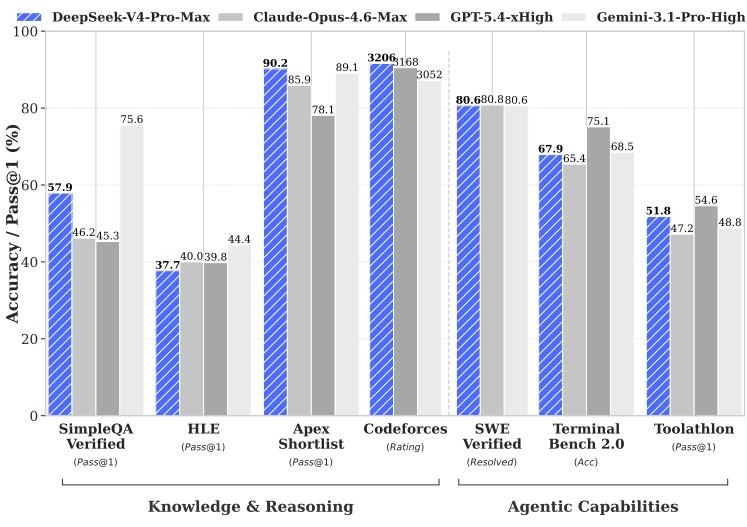
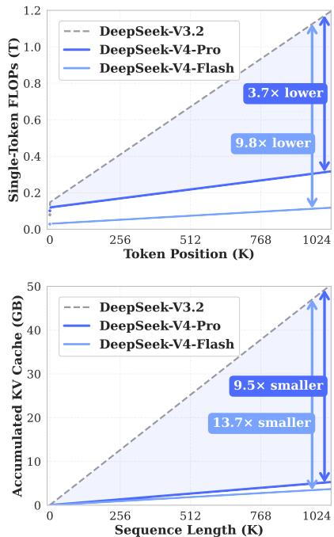

[← 返回 README](../README.md)

# Abstract

## 📌 预览

本节是整份技术报告的压缩版：两档 MoE 模型、三类架构升级、>32T token 预训练、后训练能力解锁，以及 1M context 下相对 DeepSeek-V3.2 的 FLOPs/KV cache 成本下降。

---

We present a preview version of DeepSeek-V4 series, including two strong Mixture-of-Experts (MoE) language models — DeepSeek-V4-Pro with 1.6T parameters (49B activated) and DeepSeek-V4-Flash with 284B parameters (13B activated) — both supporting a context length of one million tokens. DeepSeek-V4 series incorporate several key upgrades in architecture and optimization: (1) a hybrid attention architecture that combines Compressed Sparse Attention (CSA) and Heavily Compressed Attention (HCA) to improve long-context efficiency; (2) Manifold-Constrained Hyper-Connections (mHC) that enhance conventional residual connections; (3) and the Muon optimizer for faster convergence and greater training stability. We pre-train both models on more than 32T diverse and high-quality tokens, followed by a comprehensive post-training pipeline that unlocks and further enhances their capabilities. DeepSeek-V4-Pro-Max, the maximum reasoning effort mode of DeepSeek-V4-Pro, redefines the state-of-the-art for open models, outperforming its predecessors in core tasks. Meanwhile, DeepSeek-V4 series are highly efficient in long-context scenarios. In the one-million-token context setting, DeepSeek-V4-Pro requires only $2 7 \%$ of single-token inference FLOPs and $1 0 \%$ of KV cache compared with DeepSeek-V3.2. This enables us to routinely support one-million-token contexts, thereby making long-horizon tasks and further test-time scaling more feasible. The model checkpoints are available at https://huggingface.co/collections/deepseek-ai/deepseek-v4.

> 💡 **摘要批读**: 这段把 V4 的技术路线拆成“模型规模 + 长上下文架构 + 训练稳定 + 后训练能力 + 部署效率”。最关键的不是 1.6T 参数本身，而是 49B activated 的 sparse MoE 仍能在 1M context 下把 Pro 的单 token 推理 FLOPs 压到 V3.2 的 27%、KV cache 压到 10%。这说明报告的主 claim 是工业可服务性，而不是单纯 benchmark 冲榜。

*Figure 1: Left: benchmark performance of DeepSeek-V4-Pro-Max and its counterparts. Right: inference FLOPs and KV cache size of DeepSeek-V4 series and DeepSeek-V3.2.*

> 💡 **Figure 1 批读**: 这张图承担两个证据角色：左侧说明 Pro-Max 能力达到开放模型 SOTA 区间，右侧说明 1M context 的成本曲线发生结构性下降。读这份报告时要把两者绑定起来看：如果只有左图，它只是能力报告；如果只有右图，它只是长上下文效率报告。V4 的卖点是“在能力不掉队的情况下把长上下文服务成本打下来”。

---

## 🔖 Section 总结

### 关键数字速查

| 指标 | 数值 |
|------|------|
| Pro | 1.6T total / 49B activated |
| Flash | 284B total / 13B activated |
| Context | 1M tokens |
| Pre-training | >32T tokens |
| Pro vs V3.2 at 1M | 27% FLOPs / 10% KV cache |

### 核心洞察

1. 摘要已经给出报告的完整因果链：CSA/HCA 降长上下文成本，mHC/Muon 支撑大规模训练，后训练把 base 能力转成产品可用模式。
2. “1M context”在这里不是孤立功能，而是 test-time scaling、long-horizon agent、shared-prefix reuse 和 online-learning 设想的基础设施前提。

