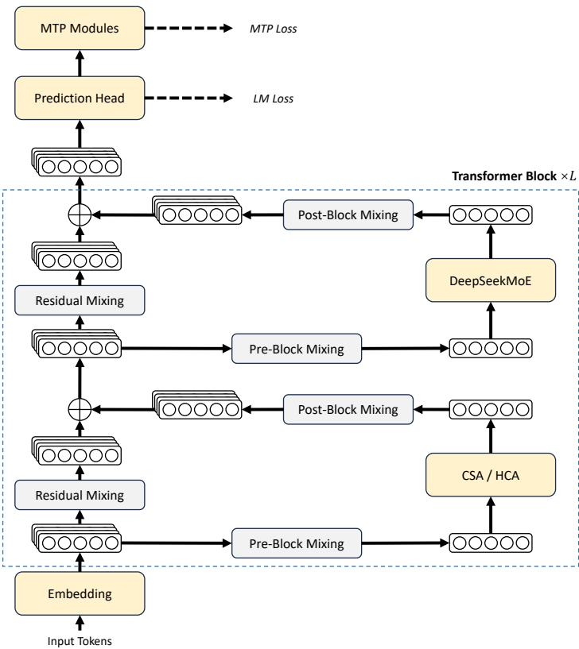

[← 返回 README](../README.md)

# 1. Introduction

## 📌 预览

Introduction 解释为什么 V4 要把长上下文效率作为主线：reasoning models 依赖 test-time scaling，但 vanilla attention 的二次复杂度会在 ultra-long context 和长链 reasoning 上变成瓶颈。作者随后把 V4 的解法铺开到架构、训练/推理 infra、后训练、评测四条线。

---

The emergence of reasoning models (DeepSeek-AI, 2025; OpenAI, 2024c) has established a new paradigm of test-time scaling, driving substantial performance gains for Large Language Models (LLMs). However, this scaling paradigm is fundamentally constrained by the quadratic computational complexity of the vanilla attention mechanism (Vaswani et al., 2017), which creates a prohibitive bottleneck for ultra-long contexts and reasoning processes. Concurrently, the emergence of long-horizon scenarios and tasks — from complex agentic workflows to massive cross-document analysis — has also made efficient support for ultra-long contexts critical for future progress. While recent open-source efforts (Bai et al., $2 0 2 5 \mathsf { a }$ ; DeepSeek-AI, 2024; MiniMax, 2025; Qwen, 2025) have advanced general capabilities, this core architectural inefficiency in handling ultra-long sequences remains a key impediment, limiting further gains from test-time scaling and hindering further exploration into long-horizon scenarios and tasks.

> 💡 **问题动机**: 这里把“长上下文”放在 reasoning scaling 的成本模型里，而不是只作为输入长度特性。推理模型要花更多 test-time compute，agent 要跨多轮工具调用，文档任务要跨 corpus 汇总；这些都会放大 attention 和 KV cache 成本。因此 V4 的目标是解除 scaling 路线上的系统瓶颈。

In order to break the efficiency barrier in ultra-long contexts, we develop the DeepSeek-V4 series, including the preview versions of DeepSeek-V4-Pro with 1.6T parameters (49B activated) and DeepSeek-V4-Flash with 284B parameters (13B activated). Through architectural innovations, DeepSeek-V4 series achieve a dramatic leap in computational efficiency for processing ultra-long sequences. This breakthrough enables efficient support for a context length of one million tokens, ushering in a new era of million-length contexts for next-generation LLMs. We believe our capability to efficiently handle ultra-long sequences unlocks the next frontier of test-time scaling, paves the way for deeper research into long-horizon tasks, and establishes a necessary foundation for exploring future paradigms like online learning.

> 💡 **模型定位**: Pro/Flash 的 activated 参数差距是 49B vs 13B，反映两条产品线：Pro 偏能力上限和知识容量，Flash 偏成本/吞吐。二者都支持 1M context，说明长上下文能力是模型族的底座，而不是 Pro-only feature。

Compared with the DeepSeek-V3 architecture (DeepSeek-AI, 2024), DeepSeek-V4 series retain the DeepSeekMoE framework (Dai et al., 2024) and Multi-Token Prediction (MTP) strategy, while introducing several key innovations in architecture and optimization. To enhance longcontext efficiency, we design a hybrid attention mechanism combining Compressed Sparse Attention (CSA) and Heavily Compressed Attention (HCA). CSA compresses the KV caches along the sequence dimension and then performs DeepSeek Sparse Attention (DSA) (DeepSeek-AI, 2025), whereas HCA applies more aggressive compression to the KV caches but keeps dense attention. To strengthen modeling capability, we incorporate Manifold-Constrained Hyper-Connections (mHC) (Xie et al., 2026) that upgrade conventional residual connections. Additionally, we introduce the Muon (Jordan et al., 2024; Liu et al., 2025) optimizer to the training of DeepSeek-V4 series, leading to faster convergence and improved training stability.

> 💡 **机制总览**: 这一段是后文 Architecture 的索引。CSA 的关键是“压缩后再稀疏选”，HCA 的关键是“更重压缩但仍 dense”，mHC 的关键是“残差流稳定化”，Muon 的关键是“训练优化器”。这四件事分别对应长上下文成本、全局信息保留、深层网络稳定、收敛/训练稳定。

To enable efficient training and inference for DeepSeek-V4 series as well as productive development, we introduce several infrastructure optimizations. First, we design and implement a single fused kernel for MoE modules that fully overlaps computation, communication, and memory access. Second, we employ TileLang (Wang et al., 2026), a Domain-Specific Language (DSL) to balance development productivity and runtime efficiency. Third, we provide efficient batch-invariant and deterministic kernel libraries to ensure bitwise reproducibility across training and inference. Fourth, for the training framework, we extend the autograd framework with tensor-level checkpointing for fine-grained recomputation control; and we enhance training efficiency with a hybrid ZeRO strategy for the Muon optimizer, cost-effective mHC implementations via recomputation and fused kernels, and two-stage contextual parallelism to manage compressed attention. Fifth, for the inference framework, we design a heterogeneous KV cache structure with on-disk storage strategies to enable efficient shared-prefix reuse. In addition, during the post-training stage, we incorporate FP4 quantization-aware training for MoE expert weights and the indexer QK path to reduce memory and computation.

> 💡 **工业基础设施主线**: 这里值得逐项拆：MoE fused kernel 解决 EP 通信/计算 overlap；TileLang 解决大量新算子的开发效率；deterministic kernel 解决训练/推理一致性和 debug；training framework 解决 Muon/mHC/CSA/HCA 的额外内存通信；inference KV 解决 1M context 的服务复用；FP4 QAT 直接打部署成本。

By employing hybrid CSA and HCA, along with precision optimizations on computation and storage, DeepSeek-V4 series achieve significantly lower inference FLOPs and a substantially reduced KV cache size compared with DeepSeek-V3.2, especially in long-context settings. The right part of Figure 1 demonstrates the estimated single-token inference FLOPs and accumulated KV cache size of DeepSeek-V3.2 and DeepSeek-V4 series. In the scenario of 1M-token context, even DeepSeek-V4-Pro, which has a larger number of activated parameters, attains only $2 7 \%$ of the single-token FLOPs (measured in equivalent FP8 FLOPs) and $1 0 \%$ of the KV cache size relative to DeepSeek-V3.2. Furthermore, DeepSeek-V4-Flash, with its smaller number of activated parameters, pushes efficiency even further: in the 1M-token context setting, it achieves only $1 0 \%$ of the single-token FLOPs and $7 \%$ of the KV cache size compared with DeepSeek-V3.2. Additionally, for DeepSeek-V4 series, the routed expert parameters utilize FP4 precision. While the peak FLOPs for $\mathrm { F P 4 } \times \mathrm { F P 8 }$ operations are currently the same as $\mathrm { F P 8 } \times \mathrm { F P 8 }$ on existing hardware, they can theoretically be implemented to be $1 / 3$ more efficient on future hardware, which will further enhance the efficiency of DeepSeek-V4 series.

> 💡 **效率证据链**: 这段给出最重要的对比数值：Pro 在 1M context 下比 V3.2 大但更省，Flash 进一步省。注意作者用的是 equivalent FP8 FLOPs，并提示 FP4 x FP8 未来硬件可能还有理论 1/3 效率空间；所以当前收益主要来自结构压缩与缓存压缩，未来收益还可能来自硬件原生低精度。

During pre-training, we train DeepSeek-V4-Flash on 32T tokens and DeepSeek-V4-Pro on 33T tokens, respectively. After pre-training, these two models can natively and efficiently support 1M-length contexts. In our internal evaluations, DeepSeek-V4-Flash-Base already surpasses DeepSeek-V3.2-Base across a majority of benchmarks with its more parameter-efficient design. DeepSeek-V4-Pro-Base further extends this advantage to set a new performance standard among DeepSeek foundation models, achieving comprehensive superiority across reasoning, coding, long-context, and world knowledge tasks.

> 💡 **预训练读法**: 32T/33T token 是能力底座，1M context 是训练过程中逐步扩展得到的原生能力。这里要避免把所有提升归因于架构：数据质量、长文档数据、训练 curriculum 和稳定性技巧共同参与。

The post-training pipeline of DeepSeek-V4 series features a two-stage paradigm: the independent cultivation of domain-specific experts, followed by unified model consolidation via on-policy distillation (Gu et al., 2024; Lu and Lab, 2025). Initially, for each target domain — such as mathematics, coding, agent, and instruction following — a separate expert model is trained independently. The base model first undergoes Supervised Fine-Tuning (SFT) on high-quality, domain-specific data to establish foundational capabilities. Subsequently, Reinforcement Learning (RL) is applied using Group Relative Policy Optimization (GRPO) (DeepSeek-AI, 2025), which further optimizes the model for domain-aligned behaviors guided by reward models tailored to specific success criteria. This phase yields a diverse set of specialized experts, each excelling in its respective field. Finally, to integrate these distinct proficiencies, a single unified model is trained through on-policy distillation, wherein the unified model acts as the student learning to optimize the reverse KL loss with teacher models.

> 💡 **后训练数据流**: Base model → domain SFT → domain RL specialist → OPD unified student。这个流程避免直接把所有目标混在一个 RL 阶段里拉扯，改成先分专家、再蒸馏合并。关键中间表示不是权重 merge，而是 teacher distribution / logits 对 student 的 reverse KL 约束。

## Summary of Core Evaluation Results

• Knowledge: In assessments of broad world knowledge, DeepSeek-V4-Pro-Max, the maximum reasoning effort mode of DeepSeek-V4-Pro, significantly outperforms leading opensource models on the SimpleQA (OpenAI, 2024d) and Chinese-SimpleQA (He et al., 2024) benchmarks. Regarding educational knowledge — evaluated via MMLU-Pro (Wang et al., 2024b), HLE (Phan et al., 2025), and GPQA (Rein et al., 2023) — DeepSeek-V4-Pro-Max shows a marginal lead over its open-source counterparts. DeepSeek-V4-Pro-Max has significantly closed the gap with the leading proprietary model, Gemini-3.1-Pro, despite still trailing it in these knowledge-based evaluations.

• Reasoning: Through the expansion of reasoning tokens, DeepSeek-V4-Pro-Max demonstrates superior performance relative to GPT-5.2 and Gemini-3.0-Pro on standard reasoning benchmarks. Nevertheless, its performance falls marginally short of GPT-5.4 and Gemini-3.1-Pro, suggesting a developmental trajectory that trails state-of-the-art frontier models by approximately 3 to 6 months. Furthermore, DeepSeek-V4-Flash-Max achieves comparable performance to GPT-5.2 and Gemini-3.0-Pro, establishing itself as a highly cost-effective architecture for complex reasoning tasks.

*Figure 2: Overall architecture of DeepSeek-V4 series. We use hybrid CSA (Compressed Sparse Attention) and HCA (Heavily Compressed Attention) for attention layers, DeepSeekMoE for feed-forward layers, and strengthen conventional residual connections with mHC.*

> 💡 **Figure 2 批读**: 架构图把 report 的三个核心模块放在同一层级：attention 用 CSA/HCA，FFN 用 DeepSeekMoE，block 间残差用 mHC。读后续公式时可以把 token 流想成三路成本控制：FFN 通过 MoE sparse activation 控制参数计算，attention 通过 KV 压缩/稀疏控制长序列成本，residual 通过 mHC 控制深层稳定。

• Agent: On public benchmarks, DeepSeek-V4-Pro-Max is on par with leading open-source models, such as Kimi-K2.6 and GLM-5.1, but slightly worse than frontier closed models. In our internal evaluation, DeepSeek-V4-Pro-Max outperforms Claude Sonnet 4.5 and approaches the level of Opus 4.5.

• Long-Context: DeepSeek-V4-Pro-Max delivers strong results on synthetic and real use cases with a 1-million-token context window, surpassing even Gemini-3.1-Pro on academic benchmarks.

• DeepSeek-V4-Pro v.s. DeepSeek-V4-Flash: DeepSeek-V4-Flash-Max exhibits lower performance in knowledge evaluations due to its smaller parameter scale. However, it achieves comparable results on reasoning tasks when allocated a larger thinking budget. In agent evaluations, while DeepSeek-V4-Flash-Max matches the performance of DeepSeek-V4-Pro-Max on several benchmarks, it still trails its larger counterpart on more complex, high-difficulty tasks.

> 💡 **评估摘要读法**: Knowledge 依赖参数容量，所以 Pro 明显强于 Flash；reasoning 可通过思考预算补偿，所以 Flash-Max 可以接近更大模型；agent 难题则同时吃知识、工具策略、长上下文和代码能力，因此 Flash 在复杂高难场景仍落后。这个分解比单一平均分更有用。

---

## 🔖 Section 总结

### 关键数字速查

| 指标 | 数值 |
|------|------|
| Pro / Flash activated | 49B / 13B |
| Pre-training | Flash 32T；Pro 33T |
| 1M Pro vs V3.2 | 27% FLOPs；10% KV |
| 1M Flash vs V3.2 | 10% FLOPs；7% KV |
| Knowledge gap | Flash 受小参数容量限制；Pro 负责上限 |

### 核心洞察

1. Introduction 已经声明 V4 是“系统工程论文”：任何单模块都不足以解释最终结果。
2. 长上下文效率、reasoning effort、agent 工作流在 V4 中被放入同一条产品化链路。

