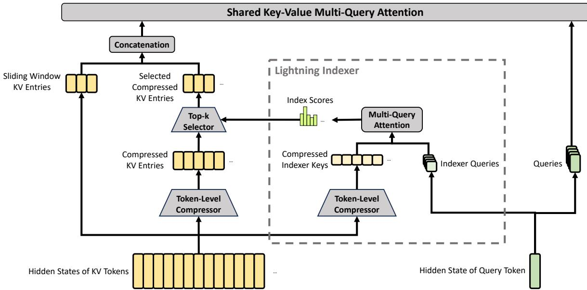
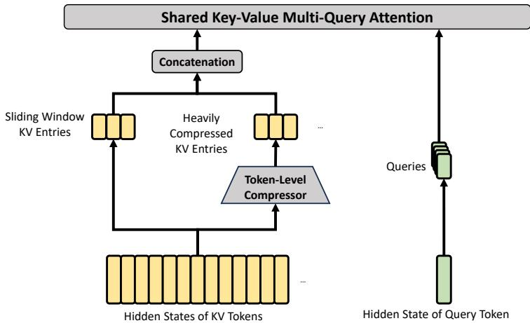
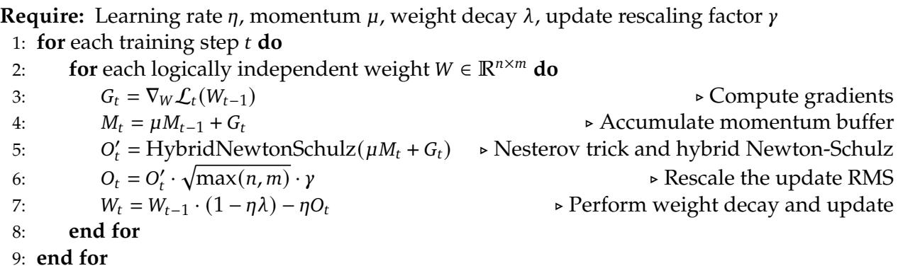

[← 返回 README](../README.md)

# 2. Architecture

## 📌 预览

Architecture 是 V4 的核心机制层：沿用 Transformer、DeepSeekMoE、MTP，但新增 mHC、CSA/HCA 混合注意力与 Muon。可把它理解为三个问题的回答：残差怎么稳定扩展，1M context attention 怎么降成本，trillion-scale 模型怎么收敛。

---

Overall, DeepSeek-V4 series retain the Transformer (Vaswani et al., 2017) architecture and Multi-Token Prediction (MTP) modules (DeepSeek-AI, 2024; Gloeckle et al., 2024), while introducing several key upgrades over DeepSeek-V3: (1) firstly, we introduce the Manifold-Constrained Hyper-Connections (mHC) (Xie et al., 2026) to strengthen conventional residual connections;

(2) secondly, we design a hybrid attention architecture, which greatly improves long-context efficiency through Compressed Sparse Attention and Heavily Compressed Attention. (3) thirdly, we employ Muon (Jordan et al., 2024; Liu et al., 2025) as the optimizer. For the Mixture-of-Experts (MoE) components, we still adopt the DeepSeekMoE (Dai et al., 2024) architecture, with only minor adjustments from DeepSeek-V3. The Multi-Token Prediction (MTP) (DeepSeek-AI, 2024; Gloeckle et al., 2024; Li et al., 2024; Qi et al., 2020) configuration remains identical to that of DeepSeek-V3. All other unspecified details follow the settings established in DeepSeek-V3 (DeepSeek-AI, 2024). Figure 2 illustrates the overall architecture of DeepSeek-V4, and the details are described below.

> 💡 **架构概览**: 这一段明确哪些是继承、哪些是新增。DeepSeekMoE/MTP 是 V3 延续，意味着 FFN sparse activation 与 multi-token prediction 不是 V4 的主要新意；V4 的增量集中在 residual、attention、optimizer 三处。

## 2.1. Designs Inherited from DeepSeek-V3

Mixture-of-Experts. As previous DeepSeek-series models (DeepSeek-AI, 2024; DeepSeek-AI, 2024), DeepSeek-V4 series also adopt the DeepSeekMoE paradigm (Dai et al., 2024) for Feed-Forward Networks (FFNs), which sets fine-grained routed experts and shared experts. Different from DeepSeek-V3, we change the activation function that computes the affinity scores from Sigmoid(·) into Sqrt(Softplus(·)). For load balancing, we also employ the auxiliary-loss-free strategy (DeepSeek-AI, 2024; Wang et al., 2024a), augmented by a slight sequence-wise balance loss that prevents extreme imbalance within individual sequences. For DeepSeek-V4, we remove the constraint on the number of routing target nodes, and carefully redesign the parallelism strategy to maintain training efficiency. Furthermore, compared with DeepSeek-V3, we replace the dense FFN layers in the initial several Transformer blocks with MoE layers that employ Hash routing (Roller et al., 2021). The Hash routing strategy determines the target experts of each token according to a predefined hash function with regard to the input token ID.

> 💡 **MoE 继承与小改动**: 这里的关键不是“还是 MoE”，而是 affinity 从 Sigmoid 改成 Sqrt(Softplus)，并加 sequence-wise balance loss。Hash routing 放在早期 MoE 层，可能是为了降低早期路由的不稳定性和成本，同时保持全网络 MoE 化。

Multi-Token Prediction. As DeepSeek-V3, DeepSeek-V4 series also set MTP modules and objectives. Given that the MTP strategy has been validated in DeepSeek-V3, we adopt the same strategy for DeepSeek-V4 series without modification.

> 💡 **MTP 读法**: MTP 在 V4 中不是新贡献，但它仍是训练效率和表示学习的一部分。报告没有把 MTP 展开，说明它被视为成熟 inherited component。

## 2.2. Manifold-Constrained Hyper-Connections

As shown in Figure 2, DeepSeek-V4 series incorporate Manifold-Constrained Hyper-Connections (mHC) (Xie et al., 2026) to strengthen the conventional residual connections between adjacent Transformer blocks. Compared with naive Hyper-Connections (HC) (Zhu et al., 2025), the core idea of mHC is to constrain the residual mapping onto a specific manifold, and thus enhance the stability of signal propagation across layers while preserving model expressivity. This subsection briefly introduces the standard HC and describes how we design mHC for stable training.

> 💡 **mHC 目标**: HC 的想法是给 residual stream 增加宽度，但简单堆叠可能数值不稳定。mHC 的新增约束是把 residual mapping 限制在特定流形上，核心诉求是“表达力增加但信号不爆”。

Standard Hyper-Connections. The standard HC expands the width of the residual stream by a factor of $n _ { \mathrm { h c } }$ . Specifically, the shape of the residual stream is expanded from $\mathbb { R } ^ { d }$ to $\mathbb { R } ^ { n _ { \mathrm { h c } } \times d }$ , where $d$ is the hidden size of the actual layer input. Let $X _ { l } = [ \mathbf { x } _ { l , 1 } ; \ldots ; \mathbf { x } _ { l , n _ { \mathrm { h c } } } ] ^ { T } \in \mathbb { R } ^ { n _ { \mathrm { h c } } \times d }$ be the residual state before the ??-th layer. HC introduces three linear mappings: an input mapping $A _ { l } \in \mathbb { R } ^ { 1 \times n _ { \mathrm { h c } } }$ , a residual transformation $B _ { l } \in \mathbb { R } ^ { n _ { \mathrm { h c } } \times n _ { \mathrm { h c } } }$ , and an output mapping $\bar { C _ { l } } \bar { \in } \mathbb { R } ^ { n _ { \mathrm { h c } } \times \bar { 1 } }$ . The update of the residual state is then formulated as:

$$
X _ { l + 1 } = B _ { l } X _ { l } + C _ { l } { \mathcal { F } } _ { l } ( A _ { l } X _ { l } ) ,
$$

where $\mathcal { F } _ { l }$ denotes the $l$ -th layer (e.g., an MoE layer), whose input and output shapes are both $\mathbb { R } ^ { d }$ . Note that the actual layer input $A _ { l } X _ { l } \in \mathbb { R } ^ { d }$ is also $d$ -dimensional, so the expanded residual width does not influence the design of the inner layers. HC decouples the residual width from the actual hidden size, offering a complementary scaling axis with minimal computational overhead, as $n _ { \mathrm { h c } }$ is typically much smaller than the hidden size ??. However, even though HC has demonstrated potential in improving model performance, we find that the training will frequently exhibit numerical instability when stacking multiple layers, which hinders the scaling of HC.

> 💡 **公式批读**: `A_l` 把多路 residual 压回单路 layer input，`F_l` 是普通 Transformer/MoE 层，`C_l` 把层输出写回多路 residual，`B_l` 在多路 residual 间传播历史状态。真正危险的是 `B_l` 的连续乘积；如果谱半径失控，深层堆叠会放大信号和梯度。

Manifold-Constrained Residual Mapping. The core innovation of mHC is to constrain the residual mapping matrix $B _ { l }$ to the manifold of doubly stochastic matrices (the Birkhoff polytope) $M _ { ☉ }$ , and thus enhance the stability of signal propagation across layers:

$$
B _ { l } \in { \mathcal { M } } : = \{ M \in \mathbb { R } ^ { n \times n } ~ | ~ M { \bf 1 } _ { n } = { \bf 1 } _ { n } , ~ { \bf 1 } _ { n } ^ { T } M = { \bf 1 } _ { n } ^ { T } , ~ M \geqslant 0 \} .
$$

This constraint ensures that the spectral norm of the mapping matrix $\| B _ { l } \| _ { 2 }$ is bounded by 1, so the residual transformation is non-expansive, which increases the numerical stability during both the forward pass and backpropagation. Besides, the set $\mathcal { M }$ is closed under multiplication, which guarantees stability in the scenarios of deep stacks of mHC. In addition, the input transformation $A _ { l }$ and output transformation $C _ { l }$ are also constrained to be non-negative and bounded via a Sigmoid function to avoid the risk of signal cancellation.

> 💡 **稳定性机制**: 双随机矩阵的行/列和为 1 且非负，直觉上像“质量守恒”的 residual mixing。闭包性质意味着多层 `B_l` 连乘仍在稳定区域内；这是 mHC 比 naive HC 更适合 trillion-scale 深层堆叠的关键。

Dynamic Parameterization. The parameters of three linear mappings are dynamically generated, which are decomposed into a dynamic (input-dependent) component and a static (input-independent) component. Given the input $X _ { l } \in \mathbb { R } ^ { n _ { \mathrm { h c } } \times d } ,$ , it is first flattened and normalized: $\hat { X } _ { l } =  { \mathrm { R M S N o r m } } (  { \mathrm { v e c } } ( X _ { l } ) ) \in \mathbb { R } ^ { 1 \times n _ { \mathrm { h c } } d }$ . Then, we follow the conventional HC to generate the unconstrained raw parameters $\tilde { A } _ { l } \in \mathbb { R } ^ { 1 \times n _ { \mathrm { h c } } }$ , $\tilde { B } _ { l } \in \mathbb { R } ^ { n _ { \mathrm { h c } } \times n _ { \mathrm { h c } } }$ , and $\tilde { C } _ { l } \in \mathbb { R } ^ { n _ { \mathrm { h c } } \times 1 }$ :

$$
\begin{array} { r l } & { \tilde { A } _ { l } = \alpha _ { l } ^ { \mathrm { p r e } } \cdot ( \hat { X } _ { l } W _ { l } ^ { \mathrm { p r e } } ) + S _ { l } ^ { \mathrm { p r e } } , } \\ & { \tilde { B } _ { l } = \alpha _ { l } ^ { \mathrm { r e s } } \cdot \mathrm { M a t } ( \hat { X } _ { l } W _ { l } ^ { \mathrm { r e s } } ) + S _ { l } ^ { \mathrm { r e s } } , } \\ & { \tilde { C } _ { l } = \alpha _ { l } ^ { \mathrm { p o s t } } \cdot ( \hat { X } _ { l } W _ { l } ^ { \mathrm { p o s t } } ) ^ { T } + S _ { l } ^ { \mathrm { p o s t } } , } \end{array}
$$

where $W _ { l } ^ { \mathrm { p r e } } , W _ { l } ^ { \mathrm { p o s t } } \in \mathbb { R } ^ { n _ { \mathrm { h c } } d \times n _ { \mathrm { h c } } }$ and $W _ { l } ^ { \mathrm { r e s } } \in \mathbb { R } ^ { n _ { \mathrm { h c } } d \times n _ { \mathrm { h c } } ^ { 2 } }$ are learnable parameters for generating the $\mathrm { { M a t } ( \cdot ) }$ tor of size are learnab $1 \times n _ { \mathrm { h c } } ^ { 2 }$ into a matrc biases; and $n _ { \mathrm { h c } } \times n _ { \mathrm { h c } } ;$ $S _ { l } ^ { \mathrm { p r e } } \in \mathbb { R } ^ { 1 \times n _ { \mathrm { h c } } } , S _ { l } ^ { \mathrm { p o s t } } \in \mathbb { R } ^ { n _ { \mathrm { h c } } \times 1 } ,$ $S _ { l } ^ { \mathrm { r e s } } \in \mathbb { R } ^ { n _ { \mathrm { h c } } \times n _ { \mathrm { h c } } }$ $\alpha _ { l } ^ { \mathrm { p r e } } , \alpha _ { l } ^ { \mathrm { r e s } } , \alpha _ { l } ^ { \mathrm { p o s t } } \in \mathbb { R }$ are learnable gating factors initialized to small values.

> 💡 **动态参数化批读**: `S_l` 是静态基底，`alpha * f(X_l)` 是输入依赖的动态调节。`alpha` 小初始化意味着训练早期接近稳定静态连接，随后逐渐学习动态 residual routing，降低一开始就把残差映射搞乱的风险。

Applying Parameter Constraints. After obtaining the unconstrained raw parameters $\tilde { A } _ { l } , \tilde { B } _ { l } , \tilde { C } _ { l } ,$ we then apply constraints described earlier to them to enhance the numerical stability. To be specific, for the input and output mappings, we employ a Sigmoid function $\sigma ( \cdot )$ to ensure their non-negativity and boundedness:

$$
\begin{array} { l } { { A _ { l } = \sigma ( \tilde { A } _ { l } ) , } } \\ { { C _ { l } = 2 \sigma ( \tilde { C } _ { l } ) . } } \end{array}
$$

As for the residual mapping ${ \tilde { B } } _ { l } ,$ we project it onto the manifold of doubly stochastic matrices $\mathcal { M }$ . This is achieved by the Sinkhorn-Knopp algorithm, which first applies an exponential function to $\tilde { B } _ { l }$ to ensure positivity, getting $M ^ { ( 0 ) } = \exp ( \tilde { B } _ { l } )$ , and then iteratively performs column and row normalization:

$$
\boldsymbol { M } ^ { ( t ) } = \mathcal { T } ( \mathcal { T } _ { c } ( \boldsymbol { M } ^ { ( t - 1 ) } ) ) ,
$$

where $\mathcal { T } _ { r }$ and $\mathcal { T } _ { c }$ denote row and column normalization, respectively. This iteration converges to a constrained doubly stochastic matrix $B _ { l } = M ^ { ( t _ { \operatorname* { m a x } } ) }$ . We choose $t _ { \mathrm { m a x } } = 2 0$ as a practical value.

> 💡 **约束实现**: Sigmoid 控制 `A_l/C_l` 非负有界，Sinkhorn-Knopp 把 `B_l` 迭代归一到双随机矩阵。报告后面给出 V4 的 `t_max=20`，说明这个约束不是概念性描述，而是实装到每层 mHC 的训练路径中。

*Figure 3: Core architectures of CSA. It compresses the number of KV entries to 1/m times, and then applies DeepSeek Sparse Attention for further acceleration. A small sliding window branch keeps local fine-grained dependencies.*

> 💡 **Figure 3 批读**: Figure 3 属于 CSA。它展示的是两级节省：先把 KV entry 数量按 `m` 压缩，再通过 lightning indexer 只选 top-k compressed KV 参与 core attention。滑窗分支则补回“压缩块内部和最近 token”的局部细节。

## 2.3. Hybrid Attention with CSA and HCA

As the context length reaches extreme scales, the attention mechanism emerges as the dominant computational bottleneck in a model. For DeepSeek-V4, we design two efficient attention architectures — Compressed Sparse Attention (CSA) and Heavily Compressed Attention (HCA) — and employ their interleaved hybrid configuration, which substantially reduces the computational cost of attention in long-text scenarios. CSA integrates both compression and sparse attention strategies: it first compresses the Key-Value (KV) cache of every $m$ tokens into one entry, and then applies DeepSeek Sparse Attention (DSA) (DeepSeek-AI, 2025) where each query token attends to only $k$ compressed KV entries. HCA aims for extreme compression by consolidating the KV cache of every $m ^ { \prime } \left( \gg m \right)$ tokens into a single entry. The hybrid architecture of CSA and HCA remarkably improves the long-context efficiency of DeepSeek-V4 series, making one-million-token context feasible in practice. This subsection describes the core techniques of our hybrid attention architecture, and we also provide an open-source implementation1 to specify more details unambiguously.

> 💡 **CSA/HCA 分工**: CSA = moderate compression + sparse selection；HCA = heavy compression + dense attention。前者强调按 query 找历史重点，后者强调全局记忆的极低成本覆盖。混合配置是在信息保真和计算预算之间做层级折中。

### 2.3.1. Compressed Sparse Attention

The core architecture of CSA is illustrated in Figure 3, which first compresses the KV cache of each $m$ tokens into one entry, and then applies DeepSeek Sparse Attention for further acceleration.

Compressed Key-Value Entries. Let $H \in \mathbb { R } ^ { n \times d }$ be a sequence of input hidden states, where $n$ is the sequence length and $d$ is the hidden size. CSA first computes two series of KV entries $C ^ { a } , C ^ { b } \in \mathbb { R } ^ { \bar { n } \times c }$ and their corresponding compression weights $Z ^ { a } , { \bar { Z } } ^ { b } \in \mathbb { R } ^ { n \times c }$ , where $c$ is the head

dimension:

$$
\begin{array} { l l } { { C ^ { a } = H \cdot W ^ { a K V } , } } & { { C ^ { b } = H \cdot W ^ { b K V } , } } \\ { { { } } } & { { { } } } \\ { { Z ^ { a } = H \cdot W ^ { a Z } , } } & { { Z ^ { b } = H \cdot W ^ { b Z } , } } \end{array}
$$

where $W ^ { a K V } , W ^ { b K V } , W ^ { a Z } , W ^ { b Z } \in \mathbb { R } ^ { d \times c }$ are trainable parameters. Next, each $m$ KV entries in $C ^ { a }$ and $C ^ { b }$ will be compressed into one entry according to their compression weights and learnable positional biases $B ^ { a } , B ^ { b } \in \mathbb { R } ^ { m \times c }$ , producing $C ^ { \mathsf { C o m p } } \in \mathbb { R } ^ { \frac { n } { m } \times c }$ . Each compressed entry $C _ { i } ^ { \mathrm { C o m p } } \in \mathbb { R } ^ { c }$ is computed by

$$
\begin{array} { r l } {  { [ S _ { m i : m ( i + 1 ) - 1 } ^ { a } ; S _ { m ( i - 1 ) : m i - 1 } ^ { b } ] = \operatorname { S o f t m a x } _ { \mathrm { r o w } } ( [ Z _ { m i : m ( i + 1 ) - 1 } ^ { a } + B ^ { a } ; Z _ { m ( i - 1 ) : m i - 1 } ^ { b } + B ^ { b } ] ) , } } \\ & { \qquad C _ { i } ^ { \mathrm { C o m p } } = \sum _ { j = m i } ^ { m ( i + 1 ) - 1 } S _ { j } ^ { a } \odot C _ { j } ^ { a } + \sum _ { j = m ( i - 1 ) } ^ { m i - 1 } S _ { j } ^ { b } \odot C _ { j } ^ { b } , } \end{array}
$$

where $\odot$ denotes the Hadamard product; Softmaxrow(·) denotes the softmax operation along the row dimension, which performs normalization across the total of $2 m$ elements from both $Z ^ { a }$ and $Z ^ { b }$ . When $i = 0$ , $Z _ { m ( i - 1 ) : m i - 1 } ^ { b }$ is padded with negative infinity and $C _ { m ( i - 1 ) : m i - 1 } ^ { b }$ is padded with zeros. Note that each $C _ { i } ^ { \mathrm { C o m p } }$ is derived from $2 m \mathrm { K V }$ entries, but the indexes of $C ^ { b }$ used for $C _ { i } ^ { \mathrm { C o m p } }$ and the indexes of $C ^ { a }$ used for $C _ { i - 1 } ^ { \mathsf { C o m p } }$ are overlapped. Therefore, CSA in fact compresses the sequence length to times.

> 💡 **CSA 压缩批读**: `C^a/C^b` 和 `Z^a/Z^b` 让压缩不是平均池化，而是按 token/head 维度学习权重。overlap 让相邻压缩块共享边界信息，减少硬切块导致的信息断裂。OCR 末尾 “to times” 缺失了具体倍率，但结合设置可知 V4 中 `m=4`。

Lightning Indexer for Sparse Selection. After obtaining the compressed KV entries $C ^ { \mathrm { C o m p } }$ , CSA applies the DSA strategy to select top- $\mathbf { \nabla } \cdot \mathbf { k }$ compressed KV entries for core attention. First, CSA performs the same compression operation used for $C ^ { \mathrm { C o m p } }$ to get compressed indexer keys $K ^ { \mathrm { I C o m i p } } \in \mathbb { R } ^ { \frac { n } { m } \times c ^ { I } } .$ , where $c ^ { I }$ is the indexer head dimension. Then, for a query token $t ,$ we produce the indexer queries $\{ \mathbf { q } _ { t , 1 } ^ { I } ; \mathbf { q } _ { t , 2 } ^ { I } ; . . . ; \mathbf { q } _ { t , n _ { h } ^ { I } } ^ { I } \}$ in a low-rank manner:

$$
\begin{array} { r } { \mathbf { c } _ { t } ^ { Q } = \mathbf { h } _ { t } \cdot W ^ { D Q } , } \\ { [ \mathbf { q } _ { t , 1 } ^ { I } ; \mathbf { q } _ { t , 2 } ^ { I } ; . . . ; \mathbf { q } _ { t , n _ { h } ^ { I } } ^ { I } ] = \mathbf { q } _ { t } ^ { I } = \mathbf { c } _ { t } ^ { Q } \cdot W ^ { I U Q } , } \end{array}
$$

where $\mathbf { h } _ { t } \ \in \ \mathbb { R } ^ { d }$ is the input hidden state of the query token ??; $\mathbf { c } _ { t } ^ { Q } \in \mathbb { R } ^ { d _ { c } }$ is the compressed latent vector for queries; $d _ { c }$ denotes the query compression dimension; $n _ { h } ^ { I }$ denotes the number of indexer query heads; $W ^ { D Q } \in \mathbb { R } ^ { d \times d _ { c } }$ and $W ^ { I U Q } \in \mathbb { R } ^ { d _ { c } \times c ^ { I } n _ { h } ^ { I } }$ are the down-projection and upprojection matrices for indexer queries, respectively. Next, the index score $I _ { t , s } \in \mathbb { R }$ between the query token $t$ and a preceding compressed block $s$ $\textstyle { \bigl ( } s < \operatorname { F l o o r } ( { \frac { t } { m } } ) { \bigr ) }$ is computed by

$$
\begin{array} { r l r } { { \displaystyle [ w _ { t , 1 } ^ { I } ; w _ { t , 2 } ^ { I } ; . . . ; w _ { t , n _ { h } ^ { I } } ^ { I } ] = { \bf w } _ { t } ^ { I } = { \bf h } _ { t } \cdot { \bf W } ^ { w } } } ,  & { { } } & { { } } \\ { { \displaystyle I _ { t , s } = \sum _ { h = 1 } ^ { n _ { h } ^ { I } } w _ { t , h } ^ { I } \cdot \mathrm { R e L U } \left( { \bf q } _ { t , h } ^ { I } \cdot { \bf K } _ { s } ^ { \mathrm { I C o m p } } \right) } , }  \end{array}
$$

where $W ^ { w } \in \mathbb { R } ^ { d \times n _ { h } ^ { I } }$ is a learnable matrix; $\boldsymbol { w _ { t , h } ^ { I } } \in \mathbb { R }$ is the weight of the $h$ -th indexer head. For a query token $t ,$ given its index scores $I _ { t , : \prime }$ we employ a top- $\mathbf { \nabla } \cdot \mathbf { k }$ selector to selectively retain a subset of compressed KV entries $C _ { t } ^ { \mathsf { S p r s C o m p } }$ for subsequent core attention:

$$
C _ { t } ^ { S \mathrm { p r s C o m p } } = \left\{ C _ { s } ^ { \mathrm { C o m p } } \ : \middle | \ : I _ { t , s } \in \mathrm { T o p - k } ( I _ { t , : } ) \right\} .
$$

> 💡 **Lightning Indexer 批读**: indexer 是 CSA 的检索器。query token 先被压到 `c_t^Q`，再生成多个 indexer heads，与 compressed indexer keys 打分，最后只保留 top-k compressed blocks。V4 配置里 Flash top-k=512、Pro top-k=1024；这是精度/成本的重要旋钮。

*Figure 4: Core architectures of HCA. It performs heavier compression, where the KV entries of `m' (>> m)` tokens will be consolidated into one. A small sliding window branch keeps local dependencies.*

> 💡 **Figure 4 批读**: HCA 图里没有 top-k indexer，重点是更高压缩率 `m'=128`。这让它适合承担“低成本全局记忆”的角色，但必须配合 sliding window，避免最近上下文被 128-token 粒度压得太粗。

Shared Key-Value MQA. After selecting the sparse KV entries, CSA then performs core attention in a Multi-Query Attention (MQA) (Shazeer, 2019) manner, where each compressed KV entry in $C _ { t } ^ { \mathsf { S p r s C o m p } }$ serves as both attention key and value. To be specific, for a query token $t ,$ we first produce attention queries $\{ \mathbf { q } _ { t , 1 } ; \mathbf { q } _ { t , 2 } ; . . . ; \mathbf { q } _ { t , n _ { h } } \}$ from the compressed latent vector $\mathbf { c } _ { t } ^ { Q }$ :

$$
[ \mathbf { q } _ { t , 1 } ; \mathbf { q } _ { t , 2 } ; . . . ; \mathbf { q } _ { t , n _ { h } } ] = \mathbf { q } _ { t } = \mathbf { c } _ { t } ^ { Q } \cdot W ^ { U Q } ,
$$

where $n _ { h }$ denotes the number of query heads; $W ^ { U Q } \in \mathbb { R } ^ { d _ { c } \times c n _ { h } }$ is the up-projection matrices for queries. Note that the latent query vector $\mathbf { c } _ { t } ^ { Q }$ is shared with that used for the indexer queries. Next, we perform MQA on {q??,??} and CSprsComp?? :

$$
\mathbf { o } _ { t , i } = \mathrm { C o r eA t t n } \left( \mathtt { q u e r y } \mathbf { = } \mathbf { q } _ { t , i } , \mathtt { k e y } \mathbf { = } C _ { t } ^ { \mathrm { S p r s C o m p } } , \mathtt { v a l u e } = C _ { t } ^ { \mathrm { S p r s C o m p } } \right) ,
$$

where $\mathbf { o } _ { t , i } \in \mathbb { R } ^ { c }$ is the core attention output of the $i$ -th head at the $t$ -th token; CoreAttn $( \cdot )$ denotes the core attention operation.

Grouped Output Projection. In the configuration of DeepSeek-V4, $c n _ { h }$ is quite large. Therefore, directly projecting the outputs of the core attention operation $\left[ \mathbf { o } _ { t , 1 } ; \mathbf { o } _ { t , 2 } ; . . . ; \mathbf { o } _ { t , n _ { h } } \right] = \mathbf { o } _ { t } \in \mathbb { R } ^ { c n _ { h } }$ to a $d$ -dimensional hidden state will impose a substantial computational burden. To mitigate this cost, we design a grouped output projection strategy. To be specific, we first split $n _ { h }$ outputs into $g$ groups, and then for each group of output ${ \bf o } _ { t , i } ^ { G } \in \mathbb { R } ^ { c \frac { n _ { h } } { g } }$ , we project it to a $d _ { g }$ -dimensional intermediate output ′ ′ ′ ${ \bf o } _ { t , i } ^ { G ^ { \prime } } \in \mathbb { R } ^ { d _ { g } }$ , where $d _ { g } \ < \ c \frac { n _ { h } } { g }$ . Finally, we project the intermediate output $[ \mathbf { o } _ { t , 1 } ^ { G ^ { \prime } } ; \mathbf { o } _ { t , 2 } ^ { G ^ { \prime } } ; . . . ; \mathbf { o } _ { t , g } ^ { G ^ { \prime } } ] \in \mathbb { R } ^ { d _ { g } g }$ to the final attention output $\hat { \mathbf { o } } _ { t } \in \mathbb { R } ^ { d }$ .

> 💡 **Core attention 成本控制**: CSA 的 key/value 是共享的 compressed entries，query heads 多但 KV 一份，接近 MQA 思路。grouped output projection 则避免把 `c * n_h` 巨大拼接直接投回 hidden dim，是在输出投影处继续降 FLOPs。

### 2.3.2. Heavily Compressed Attention

The core architecture of HCA is illustrated in Figure 4, which compresses the KV cache in a heavier manner, but does not employ sparse attention.

Compressed Key-Value Entries. By and large, the compression strategy of HCA is similar to that of CSA, but employs a larger compression rate $m ^ { \prime }$ $( \gg m )$ and does not perform overlapped

compression. Let $H \in \mathbb { R } ^ { n \times d }$ be a sequence of input hidden states, HCA first computes the original KV entries $C \in \mathbb { R } ^ { n \times c }$ and their corresponding compression weights $Z \in \mathbb { R } ^ { n \times c }$ :

$$
\begin{array} { l } { { C = H \cdot W ^ { K V } , } } \\ { { { } } } \\ { { Z = H \cdot W ^ { Z } , } } \end{array}
$$

where $W ^ { K V }$ $\mathbf { \mathcal { \cdot } } K V _ { \mathbf { \lambda } , W ^ { Z } } \in \mathbb { R } ^ { d \times c }$ are trainable parameters. Next, each $m ^ { \prime } \mathrm { K V }$ entries in $C$ will be compressed into one according to the compression weights and learnable positional biases $B \in \mathbb { R } ^ { m ^ { \prime } \times c }$ producing $C ^ { \mathsf { C o m p } } \in \mathbb { R } ^ { \frac { n } { m ^ { \prime } } \times c }$ . Each compressed entry $C _ { i } ^ { \mathrm { C o m p } } \in \mathbb { R } ^ { c }$ is computed by

$$
\begin{array} { r l } & { S _ { m ^ { \prime } i : m ^ { \prime } ( i + 1 ) - 1 } = \mathrm { S o f t m a x } _ { \mathrm { r o w } } ( Z _ { m ^ { \prime } i : m ^ { \prime } ( i + 1 ) - 1 } + B ) , } \\ & { \qquad C _ { i } ^ { \mathrm { C o m p } } = \displaystyle \sum _ { j = m ^ { \prime } i } ^ { m ^ { \prime } ( i + 1 ) - 1 } S _ { j } \odot C _ { j } . } \end{array}
$$

Through this compression operation, HCA compresses the sequence length to $\scriptstyle { \frac { 1 } { m ^ { \prime } } }$ times.

> 💡 **HCA 压缩批读**: HCA 的输入输出形态与 CSA 类似，但不 overlap、不 sparse select，核心收益来自 `1/m'` 序列压缩。V4 中 `m'=128`，所以它更像“全局低分辨率记忆通道”。

Shared Key-Value MQA and Grouped Output Projection. HCA also employs the shared KV MQA and grouped output projection strategies as CSA does. After the KV compression, for a query token $t$ , HCA first produces attention queries $\{ \mathbf { q } _ { t , 1 } ; \mathbf { q } _ { t , 2 } ; . . . ; \mathbf { q } _ { t , n _ { h } } \}$ in a low-rank manner:

$$
\begin{array} { r } { \mathbf { c } _ { t } ^ { Q } = \mathbf { h } _ { t } \cdot W ^ { D Q } , } \\ { [ \mathbf { q } _ { t , 1 } ; \mathbf { q } _ { t , 2 } ; . . . ; \mathbf { q } _ { t , n _ { h } } ] = \mathbf { q } _ { t } = \mathbf { c } _ { t } ^ { Q } \cdot W ^ { U Q } , } \end{array}
$$

where $\mathbf h _ { t } \in \mathbb R ^ { d }$ is the input hidden state of the query token $t ; n _ { h }$ denotes the number of query heads; $W ^ { D Q } \in \mathbb { R } ^ { d \times d _ { c } }$ and $W ^ { U Q } \in \mathbb { R } ^ { d _ { c } \times c n _ { h } }$ are the down-projection and up-projection matrices for queries, respectively. Next, we perform MQA on $\{ \mathbf { q } _ { t , i } \}$ and $C ^ { \mathrm { C o m p } }$ :

$$
{ \bf o } _ { t , i } = \mathrm { C o r e A t t n } \left( { \tt q u e r y = { q } } _ { t , i } , \tt k e y = \it C ^ { \mathrm { C o m p } } , \tt v a l u e = \it C ^ { \mathrm { C o m p } } \right) ,
$$

where $\mathbf { o } _ { t , i } \in \mathbb { R } ^ { c }$ is the core attention output of the $i$ -th head at the $t$ -th token. Next, as CSA does, HCA splits $n _ { h }$ outputs into $g$ groups, and for each group of output ${ \bf o } _ { t , i } ^ { G } \in \mathbb { R } ^ { c \frac { n _ { h } } { g } }$ , HCA projects it to a $d _ { g }$ -dimensional intermediate output ??′ ??′ ??′ ${ \bf o } _ { t , i } ^ { G ^ { \prime } } \in \mathbb { R } ^ { d _ { g } }$ , where $d _ { g } < c \frac { n _ { h } } { g }$ . Finally, HCA projects the?? intermediate output $[ \mathbf { o } _ { t , 1 } ^ { G ^ { \prime } } ; \mathbf { o } _ { t , 2 } ^ { G ^ { \prime } } ; . . . ; \mathbf { o } _ { t , g } ^ { G ^ { \prime } } ] \in \mathbb { R } ^ { d _ { g } g }$ to the final attention output .

> 💡 **HCA 与 CSA 共用技巧**: HCA 也复用 low-rank query、shared KV MQA、grouped output projection。也就是说二者的实现差异集中在 KV 压缩粒度和是否稀疏选择，而非完全不同的 attention kernel 生态。

### 2.3.3. Other Details

In addition to the core architectures of CSA and HCA described above, our hybrid attention incorporates several other techniques. For writing clarity, we omit these additional techniques from the above introduction and will briefly describe them in this subsection. Also, this subsection focuses only on the core ideas of them and may omit some tiny details for simplicity. We encourage the readers to refer to our open-source implementation for unambiguous details.

Query and Key-Value Entry Normalization. For both CSA and HCA, we perform an additional RMSNorm operation on each head of the queries and the only head of the compressed KV entries, just before the core attention operation. This normalization avoids exploding attention logits and may improve training stability.

Partial Rotary Positional Embedding. For both CSA and HCA, we partially employ the Rotary Positional Embedding (RoPE) (Su et al., 2024) to the attention queries, KV entries, and the core attention outputs. To be specific, for each query vector and KV entry vector used in CSA and ${ \mathrm { H C A } } ,$ we apply RoPE to its last 64 dimensions. Since the KV entries serve as both attention keys and values, the naive core attention outputs $\left\{ \mathbf { o } _ { t , i } \right\}$ will carry absolute position embeddings, derived from the weighted sum of KV entries. As a countermeasure, we also apply RoPE with position $- i$ on the last 64 dimensions of each $\mathbf { o } _ { t , i }$ . In this way, the output of the core attention will also carry relative position embeddings — the contribution of each KV entry to the core attention outputs will also be related to the distance between the query and the KV entry.

Additional Branch of Sliding Window Attention. In order to strictly preserve causality in CSA and HCA, each query attends to only preceding compressed KV blocks. Consequently, a query cannot access information from other tokens within its own compressed block. Meanwhile, recent tokens usually possess greater relevance to the query token in language modeling. For these reasons, we introduce a supplementary attention branch to both CSA and HCA in a sliding window manner, for better modeling of local dependencies. To be specific, for each query token, we additionally produce $n _ { \mathrm { w i n } }$ uncompressed KV entries corresponding to the recent $n _ { \mathrm { w i n } }$ tokens. In the core attention of CSA and HCA, these KV entries in the sliding window will be used along with the compressed KV entries.

Attention Sink. In the core attention of CSA and HCA, we employ the trick of attention sink (OpenAI, 2025; Xiao et al., 2024). To be specific, we set a series of learnable sink logits $\{ z _ { 1 } ^ { \prime } , z _ { 2 } ^ { \prime } , . . . , z _ { n _ { h } } ^ { \prime } \}$ . For the $h$ -th attention head, $\mathrm { E x p } ( z _ { h } ^ { \prime } )$ will be added to the denominator of the attention score:

$$
s _ { h , i , j } = \frac { \mathrm { E x p } ( z _ { h , i , j } ) } { \sum _ { k } \mathrm { E x p } ( z _ { h , i , k } ) + \mathrm { E x p } ( z _ { h } ^ { \prime } ) } ,
$$

where $s _ { h , i , j } , z _ { h , i , j } \in \mathbb { R }$ denote the attention score and attention logit of the $h$ -th attention head between the $i \cdot$ -th query token and the $j \cdot$ -th preceding token or compressed block. This technique allows each query head to adjust its total attention scores to be not equal to 1, and even to be near 0.

> 💡 **细节组合批读**: RMSNorm 抑制 logit 爆炸；partial RoPE 只放在最后 64 维，降低位置编码开销并校正输出中的绝对位置信息；SWA 分支补局部 causality 缺口；attention sink 允许 query 选择“不强行关注历史”。这些看似小技巧，实际是压缩 attention 能稳定训练和生成的条件。

### 2.3.4. Efficiency Discussion

Due to the employment of hybrid CSA and ${ \mathrm { H C A } } ,$ together with low-precision computation and storage, the attention module of DeepSeek-V4 series achieves remarkable efficiency in both attention FLOPs and KV cache size, especially in long-context scenarios. First, we adopt a mixed storage format for KV entries: BF16 precision is used for the rotary positional embedding (RoPE) dimensions, while FP8 precision is applied to the remaining dimensions. This hybrid representation reduces the KV cache size by nearly half compared with pure BF16 storage. Second, attention computation within the lightning indexer is performed in FP4 precision, which accelerates the attention operation under extremely long contexts. Third, relative to DeepSeek-V3.2, a smaller attention top- $\boldsymbol { \cdot } \mathbf { k }$ is chosen in DeepSeek-V4 series, thereby improving model efficiency on short- and medium-length texts. Finally, and most importantly, compressed attention and hybrid attention techniques substantially reduce both the KV cache size and the computational FLOPs.

Taking BF16 GQA8 (Ainslie et al., 2023) with a head dimension of 128 as the baseline — one of the common configurations of LLM attention — the KV cache size of DeepSeek-V4 series can be dramatically reduced to approximately $2 \%$ times of that baseline in the 1M-context setting.

*Algorithm 1: Muon optimization algorithm as extracted by MinerU.*

> 💡 **效率批读**: Attention 效率来自四层叠加：结构上 CSA/HCA 减少 KV 数量和 attention 范围，存储上 RoPE 维 BF16 / 其他维 FP8，indexer 计算上用 FP4，超参上选择更小 top-k。2% GQA8 KV baseline 是非常强的 cache claim，但它是与 BF16 GQA8 对比，不等同于与 DeepSeek-V3.2 的 10% KV 对比。

Moreover, even when compared with DeepSeek-V3.2 (DeepSeek-AI, 2025) — already an efficient baseline — DeepSeek-V4 series still exhibits substantial advantages in efficiency. A comparison of their inference FLOPs and KV cache size is provided in the right part of Figure 1.

## 2.4. Muon Optimizer

We employ the Muon (Jordan et al., 2024; Liu et al., 2025) optimizer for the majority of modules in DeepSeek-V4 series due to its faster convergence and improved training stability. The full algorithm of our Muon optimization is summarized in Algorithm 1.

Basic Configurations. We maintain the AdamW (Loshchilov and Hutter, 2017) optimizer for the embedding module, the prediction head module, the static biases and gating factors of mHC modules, and the weights of all RMSNorm modules. All other modules are updated with Muon. Following Liu et al. (2025), we also apply weight decay to Muon parameters, use the Nesterov (Jordan et al., 2024; Nesterov, 1983) trick, and rescale the Root Mean Square (RMS) of the update matrix for reutilization of our AdamW hyper-parameters. Different from them, we use hybrid Newton-Schulz iterations for orthogonalization.

> 💡 **Muon/AdamW 分工**: DeepSeek 没有全量替换成 Muon。embedding、prediction head、mHC 静态 bias/gate、RMSNorm 仍用 AdamW，其他大矩阵用 Muon。这说明 Muon 更适合矩阵权重的方向/正交化更新，而一些标量、归一化和输出相关参数仍交给 AdamW。

Hybrid Newton-Schulz Iterations. For a given matrix $M$ , let its Singular Value Decomposition (SVD) be $M = U \Sigma V ^ { T }$ . The Newton-Schulz iterations aim to approximately orthogonalize $M$ to be $U V ^ { T }$ . Usually, $M$ will be first normalized as $M _ { 0 } = M / | | \boldsymbol { M } | | _ { F }$ to ensure its maximum singular value does not exceed 1. Then, each Newton-Schulz iteration performs the following operation:

$$
M _ { k } = a M _ { k - 1 } + b ( M _ { k - 1 } M _ { k - 1 } ^ { T } ) M _ { k - 1 } + c ( M _ { k - 1 } M _ { k - 1 } ^ { T } ) ^ { 2 } M _ { k - 1 } .
$$

Our hybrid Newton-Schulz performs 10 iterations over two distinct stages. During the first 8 steps, we use coefficients $( a , b , c ) = ( 3 . 4 4 4 5 , - 4 . 7 7 5 0 , 2 . 0 3 1 5 )$ to drive rapid convergence, bringing the singular values close to 1. In the final 2 steps, we switch to coefficients $( a , b , c ) = ( 2 , - 1 . 5 , 0 . 5 ) _ { . }$ , which stabilize the singular values precisely at 1.

Avoiding Exploding Attention Logits. The attention architecture of DeepSeek-V4 series allows us to directly apply RMSNorm on the attention queries and KV entries, which effectively prevents attention logits from exploding. Consequently, we do not employ the QK-Clip technique (Liu et al., 2025) in our Muon optimizer.

> 💡 **优化器机制批读**: Hybrid Newton-Schulz 前 8 步追求快收敛，后 2 步追求稳定到奇异值 1。Muon 与 attention 设计还有耦合：因为 CSA/HCA query/KV entry 上可以做 RMSNorm，DeepSeek 不再需要 QK-Clip。这是架构与优化器互相简化的例子。

---

## 🔖 Section 总结

### 关键数字速查

| 指标 | 数值 |
|------|------|
| CSA compression | `m=4` in model setup |
| HCA compression | `m'=128` in model setup |
| CSA top-k | Flash 512；Pro 1024 |
| Sliding window | `n_win=128` |
| mHC | `n_hc=4`, `t_max=20` |
| Muon Newton-Schulz | 10 iterations = 8 fast + 2 stable |

### 核心洞察

1. V4 的长上下文效率不是单一 sparse attention，而是 CSA/HCA/SWA/low precision/grouped projection/KV layout 的组合。
2. mHC 与 Muon 都服务“可训练性”：一个稳定残差信号，一个稳定大矩阵更新。
3. 可追问点：CSA/HCA interleaving pattern、top-k 选择、mHC expansion factor 对能力和成本的独立贡献需要更公开的消融。

