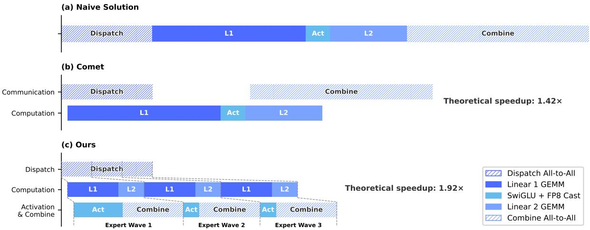
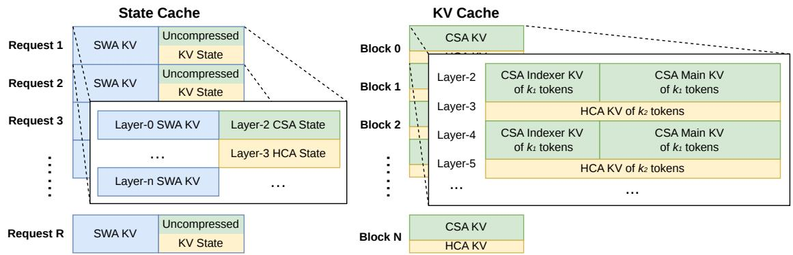

[← 返回 README](../README.md)

# 3. General Infrastructures

## 📌 预览

这一节是 V4 报告最“工业化”的部分：MoE EP mega-kernel、TileLang kernel 开发、batch-invariant/deterministic kernel、训练框架、推理 KV cache。它回答一个实际问题：复杂架构怎样在大规模训练、后训练和线上推理中保持效率、复现性和可维护性。

---

## 3.1. Fine-Grained Communication-Computation Overlap in Expert Parallelism

Mixture-of-Experts (MoE) can be accelerated via Expert Parallelism (EP). However, EP requires complex inter-node communication and imposes substantial demands on interconnect bandwidth and latency. To alleviate the communication bottleneck in EP and achieve higher end-to-end performance under lower interconnection bandwidth requirements, we propose a fine-grained EP scheme that fuses communication and computation into a single pipelined kernel for communication-computation overlapping.

> 💡 **EP 问题动机**: MoE 的 activated 参数少，但 expert 分布在不同设备上会引入 Dispatch/Combine 通信。V4 的目标不是简单堆带宽，而是通过 kernel 级 pipeline 把通信藏在计算下面，从系统层释放 MoE 性价比。

Communication Latency Can Be Hidden. The key insight of our EP scheme is that the communication latency can be effectively hidden beneath computation in MoE layers. As shown in Figure 5, in DeepSeek-V4 series, each MoE layer can be decomposed mainly into four stages: two communication-bound stages, Dispatch and Combine, and two computation-bound stages, Linear-1 and Linear-2. Our profiling reveals that within a single MoE layer, the total time of communication is less than that of the computation. Therefore, after fusing communication and computation into a unified pipeline, computation remains the dominant bottleneck, implying that the system can tolerate lower interconnect bandwidth without degrading end-to-end performance.

*Figure 5: Illustration of the EP scheme. Compared with Comet, V4 splits and schedules experts into waves for finer-grained overlap; theoretical speedup is evaluated under DeepSeek-V4-Flash.*

> 💡 **Figure 5 批读**: Figure 5 的核心是 wave scheduling：不等所有 experts 通信完成才开始算，而是某个 wave 通信完成就立即进入 Linear。稳态下“当前 wave 计算、下一 wave 接收、已完成 wave 发送”同时进行，通信被铺进计算时间轴里。

Fine-Grained EP Scheme. To further lower the interconnect bandwidth requirement and amplify the benefits of overlapping, we introduce a finer-grained expert partitioning scheme. Inspired by many related works (Aimuyo et al., 2025; Zhang et al., 2025b), we split and schedule the experts into waves. Each wave consists of a small portion of experts. As soon as all experts within the wave have completed their communication, computation can commence immediately without waiting for other experts. In steady state, computation of current wave, token transfer for the next wave, and result sending of completed experts all proceed concurrently, as demonstrated in Figure 5. This forms a fine-grained pipeline among experts, keeping both computation and communication continuous throughout the wave. The wave-based scheduling speeds up the performance on extreme cases such as Reinforcement Learning (RL) rollout, which usually encounters long-tail small batches.

Performance and Open-Sourced Mega-Kernel. We validated the fine-grained EP scheme on both NVIDIA GPUs and HUAWEI Ascend NPUs platforms. Compared against strong non-fused baselines, it achieves $1 . 5 0 \sim 1 . 7 3 \times$ speedup for general inference workloads, and up to $1 . 9 6 \times$ for latency-sensitive scenarios such as RL rollouts and high-speed agent serving. We have open-sourced the CUDA-based mega-kernel implementation named MegaMoE2 as a component of DeepGEMM.

> 💡 **性能证据**: 1.50-1.73x general inference speedup 和 up to 1.96x latency-sensitive speedup 说明该 kernel 不只是训练优化，也直接影响后训练 rollout 和 agent serving。长尾小 batch 是 RL/agent 的常态，因此这个优化对后训练吞吐很关键。

Observations and Proposals. We share observations and lessons from kernel development and offer some proposals to hardware vendors, in the hope of aiding efficient hardware design and achieving better software-hardware co-design:

• Computation-Communication Ratio. Full communication-computation overlap hinges on the computation-communication ratio, rather than the bandwidth solely. Denoting peak compute throughput as $C$ and interconnect bandwidth as $B$ , communication can be fully hidden when $C / B \leqslant V _ { \mathrm { c o m p } } / V _ { \mathrm { c o m m } } ,$ where $V _ { \mathrm { c o m p } }$ denotes the computation volume and $V _ { \mathrm { { c o m m } } }$ refers to the communication volume. For DeepSeek-V4-Pro, where each token-expert pair requires 6ℎ?? FLOPs (SwiGLU gate, up, and down projections) but only $3 h$ bytes of communication (FP8 Dispatch $^ +$ BF16 Combine), this simplifies to:

$$
{ \frac { C } { B } } \leqslant 2 d = 6 1 4 4 { \mathrm { ~ F L O P s / B y t e } } .
$$

That is, each GBps of interconnect bandwidth suffices to hide the communication for 6.1 TFLOP/s of compute. Once bandwidth meets this threshold, it ceases to be the bottleneck, and devoting additional silicon area to further bandwidth brings diminishing returns. We encourage future hardware designs to target such balance points rather than scale bandwidth unconditionally.

• Power Budget. Extreme kernel fusion drives compute, memory, and network to high load simultaneously, making power throttling a key performance limiter. We suggest that future hardware designs provide sufficient power headroom for such fully concurrent workloads.

• Communication Primitives. In the dispatch stage, we adopt a pull-based approach where each GPU actively reads activations from remote GPUs, avoiding the high notification latency that fine-grained push entails. Future hardware with lower-latency cross-GPU signaling would make push viable and enable more natural communication patterns.

• Activation Function. We propose replacing SwiGLU with a low-cost element-wise activation that involves no exponential or division operations. This directly reduces the overhead of post-GEMM processing, preventing the GEMM pipeline from being stalled by activation function computation, thereby enhancing overall computational throughput and resource utilization.

> 💡 **硬件协同读法**: 这不是普通论文常见的“更多带宽更好”，而是指出 overlap 后瓶颈变成 compute/communication ratio、power headroom、通信原语延迟、activation 后处理。6144 FLOPs/Byte 是给硬件设计者的平衡点建议。

## 3.2. Flexible and Efficient Kernel Development with TileLang

In practice, our elaborate model architecture would have resulted in hundreds of fine-grained Torch ATen operators. We adopt TileLang (Wang et al., 2026) to develop a set of fused kernels to replace the vast majority of them, delivering optimal performance with minimal effort. It also allows us to quickly prototype operators like attention variants during validation. These kernels play critical roles in model architecture development, large-scale training, and ultimately production deployment of inference services. As a Domain-Specific Language (DSL), TileLang balances development productivity with runtime efficiency, enabling rapid development while supporting deep, iterative optimizations within the same codebase. Additionally, we collaborate closely with the TileLang community to foster a more agile, efficient, and stable kernel development workflow.

> 💡 **TileLang 定位**: V4 架构引入大量非标准算子，若直接堆 PyTorch ATen，会被 kernel launch 和中间张量拖垮。TileLang 的价值是把“快速试验新 attention/mHC 算子”和“最终高性能部署”放在同一开发路径里。

Reducing Invocation Overhead with Host Codegen. As accelerators continue to grow in performance, CPU-side orchestration overhead becomes increasingly prominent. For small, highly optimized kernels, such fixed host overhead can easily cap utilization and throughput. A common source of this overhead is that host-side logic, such as runtime contract checks, is typically written in Python for flexibility and thus incurs a fixed per-invocation cost.

We mitigate this overhead with Host Codegen, which moves most host-side logic into generated host code. Specifically, we first co-generate the device kernel and a lightweight host launcher at the IR (Intermediate Representation) level, embedding the necessary metadata—such as data types, rank/shape constraints, and stride/layout assumptions—parsed from the language frontend. The launcher is then lowered to the host source code built on top of the TVM-FFI (Chen et al., 2018) framework, whose compact calling convention and zero-copy tensor interop together minimize host-side overhead. At runtime, this generated host code performs validation and argument marshaling, shifting all per-invocation checks out of the Python execution path. Our measurements show that CPU-side validation overhead drops from tens or hundreds of microseconds to less than one microsecond per invocation.

> 💡 **Host Codegen 批读**: 当 device kernel 已经很快时，Python-side validation/dispatch 会成为固定税。把 launcher 和 contract checks codegen 到 host 代码后，每次调用的 CPU 开销从几十/几百微秒降到 <1 微秒，这对大量小 fused kernels 很重要。

SMT-Solver-Assisted Formal Integer Analysis. TileLang kernels involve complex tensor index arithmetic that requires strong formal integer analysis. During compilation passes such as layout inference, memory hazard detection, and bound analysis, the compiler must verify whether integer expressions satisfy specific properties to enable the corresponding optimizations. Therefore, stronger formal analysis capabilities can unlock more advanced and complex optimization opportunities.

To this end, we integrate the Z3 SMT solver (De Moura and Bjørner, 2008) into TileLang’s algebraic system, providing formal analysis capability for most integer expressions in tensor programs. We strike a balance between computational overhead and formal expressiveness by translating TileLang’s integer expressions into Z3’s quantifier-free non-linear integer arithmetic (QF_NIA). Based on Integer Linear Programming (ILP) solvers, QF_NIA seamlessly resolves standard linear integer expressions common in kernels. Furthermore, its inherent non-linear reasoning capacity effectively addresses advanced challenges like vectorization over variable tensor shapes. Under reasonable resource limits, Z3 elevates overall optimization performance while restricting compilation time overhead to just a few seconds. The impact is substantial across multiple passes, including vectorization, barrier insertion, and code simplification.

> 💡 **形式化整数分析**: CSA/HCA/mHC 这类 kernel 的索引和 layout 很复杂，错误不是慢一点，而是 silent wrong answer 或 nondeterminism。Z3 辅助证明边界、hazard 和 layout 关系，让 aggressive optimization 更可控。

Numerical Precision and Bitwise Reproducibility. In production settings, numerical correctness and reproducibility are as critical as raw throughput. We therefore prioritize accuracy by default: fast-math optimizations are disabled at the compiler level, and precision-affecting approximations are provided only as explicit, opt-in frontend operators (e.g., T.__exp, T.__log, and T.__sin). Conversely, when strict IEEE-754 semantics are required, TileLang provides

IEEE-compliant intrinsics with explicit rounding modes (e.g., T.ieee_fsqrt, T.ieee_fdiv, and T.ieee_add), enabling developers to precisely specify numerical behavior.

We also target bitwise reproducibility for validating kernels against hand-written CUDA baselines. We align TileLang’s algebraic simplification and lowering rules with mainstream CUDA toolchains (e.g., NVCC) to avoid transformations that introduce unintended bit-level differences. Layout annotations (e.g., T.annotate_layout) further allow users to pin down layout-dependent lowering decisions, keeping evaluation and accumulation order consistent with the reference CUDA implementation and thus enabling bit-identical outputs when desired.

Our evaluation shows that these accuracy- and reproducibility-oriented design choices do not sacrifice performance: under conservative defaults, TileLang kernels remain competitive, while exposing knobs to selectively relax numerical constraints for higher speed.

> 💡 **可复现性读法**: 这里与后面的 deterministic kernel 呼应。V4 把 bitwise reproducibility 当成训练稳定、post-training 对齐、线上一致性的工程前提；不是所有 kernel 都默认 fast-math，而是让近似行为显式 opt-in。

## 3.3. High-Performance Batch-Invariant and Deterministic Kernel Libraries

To enable efficient training and inference, we develop a comprehensive set of high-performance computational kernels. Beyond basic functionalities and maximizing hardware utilization, another pivotal design goal is to ensure training reproducibility and bitwise alignment among pre-training, post-training, and inference pipelines. Therefore, we implement end-to-end, bitwise batch-invariant, and deterministic kernels with minimal performance overhead. These kernels are helpful for debugging, stability analysis, and consistent post-training behavior.

> 💡 **为什么 batch-invariant**: 服务端 batching 会不断变化。如果同一个 token 因 batch 位置不同而产生 bitwise 不同输出，debug、teacher/student 对齐和线上复现都会变难。V4 追求的是 pre-training、post-training、inference 三条链路 bitwise alignment。

Batch Invariance. Batch invariance ensures that the output of any given token remains bitwise identical, regardless of its position within a batch. To implement batch invariance, the primary challenges are listed as follows:

• Attention. To achieve batch invariance, we cannot use the split-KV method (Dao et al., 2023), which distributes the attention computation for a single sequence across multiple Stream Multiprocessors (SMs) to balance the load of SMs. However, abandoning this technique will lead to severe wave-quantization problems3, which can adversely affect GPU utilization. To address this, we develop a dual-kernel strategy for batch-invariant decoding. The first kernel computes the attention output for an entire sequence within a single SM, ensuring high throughput for fully occupied waves. The second kernel, to minimize the latency of the final partially-filled wave and thus alleviate wave-quantization, uses multiple SMs for a single sequence. For the bitwise identity of these two kernels, we carefully design the calculation path of the second kernel to ensure its accumulation order is the same as that of the first kernel. Additionally, the second kernel utilizes distributed shared memory4 within thread-block clusters, enabling high-speed data exchange across SMs. This dual-kernel method effectively confines the overhead of batch-invariant decoding to be negligible.

• Matrix Multiplication. Traditional cuBLAS library (NVIDIA Corporation, 2024) cannot achieve batch invariance. Therefore, we replace it end-to-end with DeepGEMM (Zhao et al., 2025). Furthermore, for very small batch sizes, conventional implementation usually employs split-k (Osama et al., 2023) techniques to improve performance. Unfortunately, split-k techniques cannot guarantee batch invariance, a pivotal feature in DeepSeek-V4.

Therefore, we abandon split-k in most scenarios, which, however, may cause performance degradation. To address this, we introduce a set of optimizations that enable our implementation of matrix multiplication to match or even surpass the performance of standard split- $\mathbf { \nabla } \cdot \mathbf { k }$ in most major scenarios.

> 💡 **batch-invariant 机制**: Attention 不能随意 split-KV，因为浮点累加顺序会变；matmul 不能依赖普通 cuBLAS/split-k，因为 batch 形态变会改变路径。DeepSeek 用 dual-kernel、distributed shared memory、DeepGEMM 来换取“批量怎么拼都 bitwise 一致”。

Determinism. Deterministic training is highly beneficial for debugging hardware or software issues. Moreover, when training exhibits anomalies such as loss spikes, determinism enables researchers to more easily pinpoint numerical causes and further refine the model design. Nondeterminism in training typically stems from non-deterministic accumulation order, often due to the use of atomic addition instructions. This issue primarily occurs during the backward pass, notably at the following parts:

• Attention Backward. In conventional implementations of backward propagation for sparse attention, we use atomicAdd to accumulate gradients for the KV tokens. This introduces non-determinism due to the non-associativity of floating-point addition. To address this problem, we allocate separate accumulation buffers for each SM, followed by a global deterministic summation across all buffers.

• MoE Backward. When multiple SMs from different ranks concurrently write data to the same buffer on a receiving rank, negotiating writing positions also introduces nondeterminism. To resolve this, we design a token order pre-processing mechanism within each single rank, combined with buffer isolation across multiple ranks. This strategy ensures determinism of both the send results of expert parallelism and the accumulation order in the MoE backward pass.

• Matrix Multiplication in mHC. mHC involves a matrix multiplication with an output dimension of only 24. For very small batch sizes, we are compelled to use the split-k (Osama et al., 2023) algorithm, whose naive implementation will cause non-determinism. To overcome this, we output each split part separately and perform a deterministic reduction in a subsequent kernel, thereby preserving both performance and determinism.

> 💡 **determinism 机制**: 三个 nondeterminism 来源分别来自 sparse attention gradient、MoE cross-rank write、mHC small-output matmul。对应解法都是控制累加顺序：分 SM buffer 后 deterministic reduce、token order preprocessing + buffer isolation、split parts 后 deterministic reduction。

## 3.4. Training Framework

Our training framework is built upon the scalable and efficient infrastructure developed for DeepSeek-V3 (DeepSeek-AI, 2024). In training DeepSeek-V4, we inherit this robust foundation while introducing several key innovations to accommodate its novel architectural components — specifically the Muon optimizer, mHC, and the hybrid attention mechanism — while maintaining high training efficiency and stability.

> 💡 **训练框架主线**: 这一段点名 V4 训练新增压力源：Muon 需要完整矩阵更新，mHC 增加激活和 pipeline 通信，CSA/HCA 改变 context parallelism 的形态。

### 3.4.1. Efficient Implementation of Muon

The Muon optimizer requires the full gradient matrix to compute parameter updates, which presents a challenge when combined with the Zero Redundancy Optimizer (ZeRO) (Rajbhandari et al., 2020). Traditional ZeRO is designed for element-wise optimizers like AdamW, where a single parameter matrix can be partitioned and updated across multiple ranks. To address this conflict, we design a hybrid strategy of ZeRO bucket assignment for Muon.

For dense parameters, we limit the maximum size of ZeRO parallelism and employ a knapsack algorithm to assign parameter matrices to these ranks, ensuring each rank manages a roughly balanced load. The bucket on each rank is padded to match the size of the largest bucket across ranks, facilitating efficient reduce-scatter operations. This padding typically incurs less than $1 0 \%$ memory overhead in our setup, where each rank manages no more than five parameter matrices. When the overall size of data parallelism exceeds the limit for ZeRO, we compute the Muon update redundantly across the extra data-parallel groups, trading computation for reduced total bucket memory.

For MoE parameters, we optimize each expert independently. We first flatten all down projection matrices in SwiGLU (Shazeer, 2020) of all experts across all layers, followed by flattened up projection matrices and gate matrices. Then, we pad the flattened vector to ensure we can evenly distribute this vector across all ranks without splitting any logically independent matrix. Given the large number of experts, we do not impose a limit of ZeRO parallelism for MoE parameters, and the padding overhead is also negligible.

Additionally, on each rank, consecutive parameters of identical shape will be automatically merged, enabling batched execution of the Newton-Schulz iterations for better hardware utilization. Furthermore, we observe that the Newton-Schulz iterations in Muon remain stable when computed with BF16 matrix multiplications. Leveraging this, we further quantize, in a stochastic rounding manner, the MoE gradients to be synchronized across data-parallel ranks to the BF16 precision, halving the communication volume. To avoid accumulation errors introduced by low-precision adders, we replace conventional tree- or ring-based reduce-scatter collectives with a two-phase approach. First, an all-to-all operation exchanges local gradients across ranks, and then each rank performs a local sum in FP32. This design maintains numerical robustness.

> 💡 **Muon 工程化**: Muon 与 AdamW 的最大系统差异是“不能随意切矩阵”。Dense 参数用有限 ZeRO + knapsack bucket，MoE 参数按 expert 独立并避免拆逻辑矩阵；同 shape 参数合并让 Newton-Schulz 批处理。BF16 同步减半通信，再用 all-to-all + local FP32 sum 保精度。

### 3.4.2. Cost-Effective and Memory-Efficient Implementation of mHC

The introduction of mHC increases both activation memory consumption and communication volume between pipeline stages, compared with conventional residual connections. To mitigate these costs, we implement several optimization strategies.

Firstly, we carefully design and implement fused kernels of mHC for both training and inference. Secondly, we introduce a recomputation strategy that selectively checkpoints intermediate tensors. Specifically, we recompute most hidden states between layers and all normalized layer inputs, while avoiding recomputation of compute-intensive operations. This achieves a balance between memory saving and computational overhead. Thirdly, we adjust the DualPipe 1F1B overlapping scheme to accommodate the increased pipeline communication and enable concurrent execution of some operations in mHC.

Collectively, these optimizations constrain the wall-time overhead of mHC to only $6 . 7 \%$ of the overlapped 1F1B pipeline stage. More details of the engineering optimization can be found in the dedicated mHC paper (Xie et al., 2026).

> 💡 **mHC 成本控制**: mHC 扩 residual width 会自然增加激活和 pipeline 通信。DeepSeek 的做法是 fused kernel + 选择性 recomputation + 调整 DualPipe overlap，把墙钟开销压到 6.7%。这解释了为什么 mHC 能作为全模型组件而不是研究 demo。

### 3.4.3. Contextual Parallelism for Long-Context Attention

Conventional Context Parallelism (CP) partitions the sequence dimension, with each rank maintaining contiguous ?? tokens. This introduces two challenges to our compressed attention mechanisms (i.e., CSA and HCA). On the one hand, training samples are packed from multiple sequences, and each sequence is compressed independently by a factor of $m$ $\left( \mathrm { o r } m ^ { \prime } \right)$ ), with any trailing tokens fewer than $m$ being discarded. Consequently, the compressed KV lengths are typically less than $\frac { s } { m }$ and vary across ranks. On the other hand, the compression requires $m$ consecutive KV entries, which may straddle the boundary between two neighboring CP ranks.

To address these challenges, we design a two-stage communication approach. In the first stage, each rank ?? sends its last $m$ uncompressed KV entries to rank $i + 1$ . Then, rank $i + 1$ compresses some of these received entries together with its local ?? uncompressed KV entries, producing a fixed length of $\textstyle { \frac { s } { m } } + 1$ compressed entries, in which exist some padding entries. In the second stage, an all-gather operation across all CP ranks collects the locally compressed KV entries. Then, a fused select-and-pad operator reorganizes them into the full set of compressed KV entries with a total length of cp_size $\cdot \ { \frac { s } { m } }$ . Any padding entries are placed at the tail. For HCA and the indexer in CSA, the visible range of compressed KV entries for each query token can be precomputed by rules. For the sparse attention in CSA, the top- $k$ selector explicitly specifies the indices of visible compressed KV entries for each query.

> 💡 **Context Parallelism 批读**: 压缩 attention 与传统 CP 冲突在边界：压缩需要连续 `m` 个 KV，分片后边界可能切断一个压缩块。两阶段通信先传尾部未压缩 KV，保证边界可压缩；再 all-gather compressed KV 并 select/pad 成统一布局。

### 3.4.4. Extended Automatic Differentiation for Flexible Activation Checkpointing

Conventional activation checkpointing implementations operate at the granularity of an entire module, deciding whether to retain or recompute its output activations during the backward pass. This coarse granularity often leads to suboptimal trade-offs between recomputation cost and activation memory footprint. An alternative approach is to manually implement the forward and backward logic of an entire layer, explicitly managing tensor checkpointing states. While enabling fine-grained control, this method loses the convenience of the automatic differentiation framework, substantially increasing development complexity.

To achieve fine-grained control without sacrificing programming efficiency, we implement a tensor-level activation checkpointing mechanism with automatic differentiation support. With this mechanism, developers only need to implement the forward pass and selectively annotate individual tensors for automatic checkpointing and recomputation. Our framework leverages TorchFX (Reed et al., 2022) to trace the full computation graph. For each annotated tensor, it performs a backward traversal to identify the minimal subgraph required for its recomputation. We define these minimal subgraphs as recomputation graphs and insert them into the backward logic just before the corresponding gradient computation.

Compared with the manual implementation, this design introduces no additional overhead during training. Recomputation in this framework is implemented by directly freeing the GPU memory of the annotated tensor and reusing the storage pointer from the recomputed tensor, without any GPU memory copy. Furthermore, since graph tracing executes the model concretely, we can track the underlying storage pointer of each tensor, which enables automatic deduplication of recomputation for tensors that share storage (e.g., the input and output of a reshape operation). This relieves developers from reasoning about low-level memory details when annotating recomputation.

> 💡 **checkpointing 机制**: 这里的关键是 tensor-level，而不是 module-level。开发者标注某些张量，框架用 TorchFX 找最小 recomputation graph，并复用 storage pointer。对于 mHC/CSA/HCA 这种非标准结构，这比手写 backward 更可维护。

## 3.5. Inference Framework

Our inference framework largely inherits from that of DeepSeek-V3, with some differences in KV Cache management.

### 3.5.1. KV Cache Structure and Management

To efficiently manage the heterogeneous KV caches arising from the hybrid attention mechanism in DeepSeek-V4, we design a customized KV cache layout. The layout is illustrated in Figure 6, and we will elaborate on it in detail as follows.

Heterogeneous KV Entries in DeepSeek-V4. The hybrid attention mechanism in DeepSeek-V4 series introduces multiple types of KV entries with different Key-Value (KV) cache sizes and update rules. The lightning indexer for sparse selection introduces additional dimensions into the KV cache that possess embedding sizes distinct from those in the primary attention. The compression techniques employed in CSA and HCA reduce the sequence length by factors of 1 and ${ \frac { 1 } { m ^ { \prime } } } ,$ , respectively, thereby decreasing the overall KV cache size. As a result, KV cache sizes vary across different layers. Furthermore, Sliding Window Attention (SWA) layers also operate with distinct KV cache sizes, as well as separate cache hit and eviction policies. In the compression branch, one KV entry is generated for every $m$ tokens. When the number of remaining tokens is insufficient for compression, all pending tokens and their associated hidden states must be retained in a buffer until the compression operation can be executed. These buffered tokens represent a sequence state determined by positional context and are also managed within the KV cache framework.

*Figure 6: KV cache layout for DeepSeek-V4. It separates classical KV cache for CSA/HCA from state cache for SWA and unready-for-compression tokens.*

> 💡 **Figure 6 批读**: KV cache 被拆成 classical KV cache 和 state cache。classical 部分存已压缩的 CSA/HCA blocks；state cache 存 SWA 最近窗口和还没凑够压缩块的 tail tokens。这个设计是 HCA/CSA/SWA 混合后必须有的缓存抽象。

Challenges in Managing Hybrid Attention KV Cache. The hybrid attention mechanism violates fundamental assumptions behind PagedAttention and its variants. Although recent hybrid KV cache managing algorithms (e.g., Jenga (Zhang et al., 2025a), Hymba (Dong et al., 2025)) target general hybrid attention models or specific structures, two principal obstacles prevent consolidating KV caches across all layers under the PagedAttention framework:

• Diverse cache policies, such as those used in Sliding Window Attention. • Constraints imposed by high-performance attention kernels, including alignment requirements.

For efficient KV cache management of DeepSeek-V4, we design corresponding strategies to overcome these two challenges.

State Cache for SWA and Uncompressed Tail Tokens. To address the first obstacle, we adopt an alternative cache management mechanism. Since SWA is designed to enhance performance under a limited KV cache size, it is reasonable to treat it, along with the uncompressed tail tokens from the compression branch, as a state-space model. The corresponding KV cache can thus be regarded as a sequence-specific state that depends solely on the current position. Accordingly, we pre-allocate a fixed- and limited-size pool of state caches, and dynamically assign it to each sequence.

Sparse Attention Kernel Co-Design. Regarding the second obstacle, conventional highperformance attention kernels typically assume a fixed number $B$ of tokens per block to optimize performance, corresponding to $B \cdot m$ original tokens in CSA and $B \cdot m ^ { \prime }$ in HCA. Through employing a high-performance sparse-attention kernel, different layers can accommodate variable tokens per block without performance degradation. Achieving this requires co-designing the KV cache layout and the sparse attention kernel. For instance, padding blocks to align with cache lines can improve performance. Thus, for CSA with compression ratio $m$ and HCA with ratio $m ^ { \prime }$ , the number of original tokens per block can be any multiple of $\operatorname { l c m } ( m , m ^ { \prime } )$ , the least common multiple of these two compression ratios.

> 💡 **KV cache 管理机制**: PagedAttention 假设比较规则的 cache blocks，而 V4 每层可能有 CSA/HCA/SWA 不同策略和压缩率。用 `lcm(m, m')` 对齐 original-token block，是把压缩比和 sparse-attention kernel 对齐到同一个工程约束。

### 3.5.2. On-Disk KV Cache Storage

When serving DeepSeek-V4, we leverage an on-disk KV cache storage mechanism to eliminate repeated prefilling for shared-prefix requests. For the compressed KV entries in CSA/HCA and the uncompressed KV entries in Sliding Window Attention (SWA), we design separate solutions for storage management.

For CSA and HCA, we simply store all of the compressed KV entries to the disk. When a request hits a stored prefix, we read and reuse the compressed KV entries corresponding to the prefix, until the last complete compression block. Specially, for prefix tokens in the tail incomplete block, we still need to recompute them to restore the uncompressed KV entries, as uncompressed KV entries in CSA and HCA are not stored.

For the SWA KV entries, since they are not compressed and exist in every layer, their volume is approximately 8 times larger than the compressed CSA and HCA KV entries. To handle these large SWA KV entries efficiently, we propose and implement three distinct strategies for managing on-disk SWA KV entries, each offering a different trade-off between storage overhead and computational redundancy:

• Full SWA Caching. This strategy stores the complete SWA KV entries for all tokens, ensuring computational zero-redundancy. Under this strategy, the SWA KV entries of the hitting prefix can be reconstructed by just reading the on-disk cache of the last $n _ { \mathrm { W i n } }$ tokens within that prefix. Despite computational zero-redundancy, this strategy is inefficient for modern SSD-based storage systems — only a small subset of the stored SWA KV cache will be accessed for each hitting request, which leads to an unbalanced write-intensive access pattern.   
• Periodic Checkpointing. This strategy checkpoints SWA KV entries of the last $n _ { \mathrm { w i n } }$ tokens within every $p$ tokens, where $p$ is a tunable parameter. For a hitting prefix, we load the most recent checkpointed state, and then recompute the remaining tail tokens. Through tuning $p$ , this strategy enables an on-demand trade-off between storage and computation.   
• Zero SWA Caching. This strategy does not store any SWA KV entries. For a hitting prefix, we need to perform more recomputation to restore the SWA KV entries. To be specific, in each attention layer, the SWA KV entry of each token depends on the SWA KV entries of only the most recent $n _ { \mathrm { w i n } }$ tokens from the previous layer. Therefore, leveraging cached CSA and HCA KV entries, recomputing the last $n _ { \mathrm { w i n } } \cdot L$ tokens is enough to restore the last $n _ { \mathrm { W i n } }$ SWA KV entries for an $L$ -layer model.

Depending on specific deployment scenarios, we select the most suitable strategy to achieve the desired trade-off between storage and computation.

> 💡 **On-disk KV 批读**: Shared-prefix reuse 对 1M context 服务非常关键。CSA/HCA 压缩 KV 体积小，直接存磁盘；SWA 未压缩且约 8x 大，所以必须在 full caching、periodic checkpointing、zero caching 之间按场景权衡。这个设计把模型结构和线上流量模式连接起来。

---

## 🔖 Section 总结

### 关键数字速查

| 指标 | 数值 |
|------|------|
| EP speedup | 1.50-1.73x general；up to 1.96x latency-sensitive |
| Pro compute/comm threshold | 6144 FLOPs/Byte |
| Host validation overhead | tens/hundreds us → <1 us |
| Muon dense bucket padding | <10% memory overhead |
| mHC wall-time overhead | 6.7% of overlapped 1F1B stage |
| SWA KV volume | 约 compressed CSA/HCA KV 的 8x |

### 核心洞察

1. V4 的复杂架构能落地，依赖一整套 kernel/compiler/cache/rollout 的系统工程。
2. 复现性不是附加项，而是训练稳定分析、post-training 对齐和线上一致服务的核心能力。
3. On-disk KV cache 将长上下文成本从“每次全量 prefill”转成“压缩前缀可复用 + tail 重算”的存算权衡。

