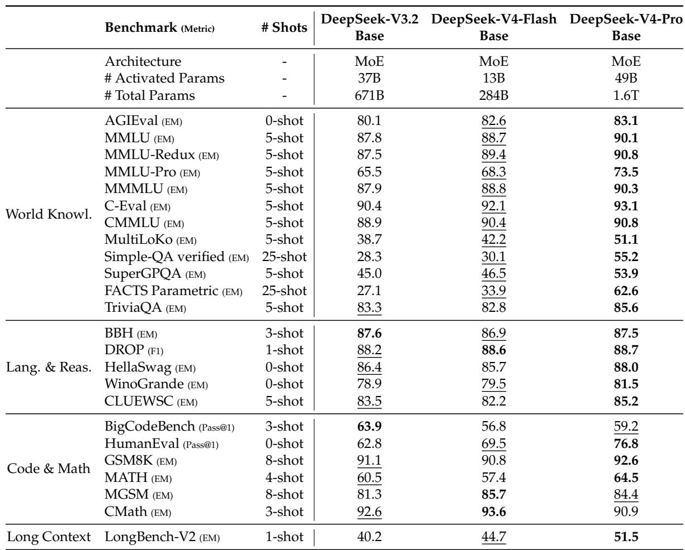

[← 返回 README](../README.md)

# 4. Pre-Training

## 📌 预览

Pre-training 说明 V4 的数据、模型配置、训练日程和 base model 评测。重点数字包括：Flash 32T tokens、Pro 33T tokens；序列长度从 4K 逐步扩到 1M；CSA `m=4`、HCA `m'=128`；Pro 1.6T/49B activated，Flash 284B/13B activated。

---

## 4.1. Data Construction

On top of the pre-training data of DeepSeek-V3, we endeavor to construct a more diverse and higher-quality training corpus with longer effective contexts. We continually refine our data construction pipelines. For web-sourced data, we implement filtering strategies to remove batched auto-generated and templated content, thereby mitigating the risk of model collapse (Zhu et al., 2024). Mathematical and programming corpora still remain core components of our training data, and we further enhance the coding capabilities of DeepSeek-V4 series by incorporating agentic data during the mid-training phase. For multilingual data, we build a larger corpus for DeepSeek-V4, improving its capture of long-tail knowledge across different cultures. For DeepSeek-V4, we place a particular emphasis on long-document data curation, prioritizing scientific papers, technical reports, and other materials that reflect unique academic values. Combining all the above, our pre-training corpus comprises more than 32T tokens, containing mathematical contents, codes, web pages, long documents, and other high-quality categories.

> 💡 **数据构建批读**: 数据侧不只是“更多 tokens”。报告强调移除批量自动生成/模板内容以降低 model collapse 风险，并增加 long-document、scientific papers、technical reports、agentic coding data。对 1M context 模型来说，长文档数据质量直接决定模型是否真的会用长上下文。

For pre-training data, we largely follow the same pre-processing strategies of DeepSeek-V3. For tokenization, on top of the DeepSeek-V3 tokenizer, we introduce a few special tokens for context construction, and still remain the vocabulary size to be 128K. We also inherit the token-splitting (DeepSeek-AI, 2024) and Fill-in-Middle (FIM) (DeepSeek-AI, 2024) strategies from DeepSeek-V3. Inspired by Ding et al. (2024), we pack documents from different sources into appropriate sequences to minimize sample truncation. Different from DeepSeek-V3, we employ sample-level attention masking during pre-training.

> 💡 **预处理机制**: 128K vocab 说明 tokenizer 主体未扩大；新增 special tokens 服务 context construction。document packing + sample-level attention masking 解决长序列训练里多样本拼接后的边界问题，避免 packed sequence 内样本互相泄漏。

## 4.2. Pre-Training Setups

### 4.2.1. Model Setups

DeepSeek-V4-Flash. We set the number of Transformer layers to 43 and the hidden dimension $d$ to 4096. For the first two layers, we use pure sliding window attention. For the subsequent layers, CSA and HCA are used in an interleaved manner. For CSA, we set the compression rate $m$ to 4, the number of indexer query heads $n _ { h } ^ { I }$ to 64, the indexer head dimension $\hat { c ^ { I } }$ to 128, and the number of KV entries selected for sparse attention (i.e., attention top- $\mathbf { \nabla \cdot k }$ ) to 512. For $\mathrm { H C A } ,$ , we set the compression rate $m ^ { \prime }$ to 128. For both CSA and HCA, we set the number of query heads $n _ { h }$ to 64, the head dimension ?? to 512, and the query compression dimension $d _ { c }$ to 1024. The number of output projection groups $g$ is set to 8, and the dimension of each intermediate attention output $d _ { g }$ is set to 1024. For the additional branch of sliding window attention, the window size $n _ { \mathrm { w i n } }$ is set to 128. We employ MoE layers in all Transformer blocks, but use the Hash routing strategy for the first 3 MoE layers. Each MoE layer consists of 1 shared expert and 256 routed experts, where the intermediate hidden dimension of each expert is 2048. Among the routed experts, 6 experts will be activated for each token. The multi-token prediction depth is set to 1. As for mHC, the expansion factor $n _ { \mathrm { h c } }$ is set to 4, and the number of Sinkhorn-Knopp iterations $t _ { \mathrm { m a x } }$ is set to 20. Under this configuration, DeepSeek-V4-Flash comprises 284B total parameters, of which 13B are activated for each token.

> 💡 **Flash 配置读法**: Flash 的成本控制非常明确：43 layers、hidden 4096、256 routed experts、6 activated、13B activated。前两层 pure SWA，后续 CSA/HCA interleave，top-k=512。它是 V4 系列里性价比优先的长上下文模型。

DeepSeek-V4-Pro. We set the number of Transformer layers to 61 and the hidden dimension $d$ to 7168. For the first two layers, we use HCA. For the subsequent layers, CSA and HCA are used in an interleaved manner. For CSA, we set the compression rate $m$ to 4, the number of indexer query heads $n _ { h } ^ { I }$ to 64, the indexer head dimension $c ^ { I }$ to 128, and the number of KV entries selected for sparse attention (i.e., attention top- $\mathbf { \nabla } \cdot \mathbf { k }$ ) to 1024. For HCA, we set the compression rate $m ^ { \prime }$ to 128. For both CSA and HCA, we set the number of query heads $n _ { h }$ to 128, the head dimension $c$ to 512, and the query compression dimension $d _ { c }$ to 1536. The number of output projection groups $g$ is set to 16, and the dimension of each intermediate attention output $d _ { g }$ is set to 1024. For the additional branch of sliding window attention, the window size $n _ { \mathrm { w i n } }$ is set to 128. We employ MoE layers in all Transformer blocks, but use the Hash routing strategy for the first 3 MoE layers. Each MoE layer consists of 1 shared expert and 384 routed experts, where the intermediate hidden dimension of each expert is 3072. Among the routed experts, 6 experts will be activated for each token. The multi-token prediction depth is set to 1. As for mHC, the expansion factor $n _ { \mathrm { h c } }$ is set to 4, and the number of Sinkhorn-Knopp iterations $t _ { \mathrm { m a x } }$ is set to 20. Under this configuration, DeepSeek-V4-Pro comprises 1.6T total parameters, of which 49B are activated for each token.

> 💡 **Pro 配置读法**: Pro 扩在层数、hidden、heads、top-k、experts 和 expert dimension 上：61 layers、hidden 7168、128 query heads、384 routed experts、49B activated。注意 CSA/HCA 的压缩率仍是 `m=4` / `m'=128`，说明 Pro 的更强能力来自容量和更大 attention/query 配置，而不是改变长上下文基本算法。

### 4.2.2. Training Setups

DeepSeek-V4-Flash. We employ the Muon optimizer (Jordan et al., 2024; Liu et al., 2025) for the majority of parameters, but use the AdamW optimizer (Loshchilov and Hutter, 2017) for the embedding module, the prediction head module, and the weights of all RMSNorm modules. For AdamW, we set its hyper-parameters to $\beta _ { 1 } = 0 . 9$ , $\beta _ { 2 } = 0 . 9 5$ , $\stackrel { \sim } { \varepsilon } = 1 0 ^ { - 2 0 }$ , and weight_decay $= 0 . 1$ For Muon, we set the momentum to 0.95 and the weight decay to 0.1, and rescale the RMS of each update matrix to 0.18 for reutilization of the AdamW learning rate. We train DeepSeek-V4-Flash on 32T tokens, and as in DeepSeek-V3, we also employ a batch size scheduling strategy that increases the batch size (in tokens) from a small size to $7 5 . 5 \mathrm { M }$ and then keeps it at 75.5M during most of the training. The learning rate is linearly warmed up in the first 2000 steps, maintained at $2 . 7 \times 1 0 ^ { - 4 }$ for most of the training. Near the end of the training, we finally decay the learning rate to $2 . 7 \times 1 0 ^ { - 5 }$ following a cosine schedule. The training starts with a sequence length of 4K, and we gradually extend the training sequence length to 16K, 64K, and 1M. As for the setups of sparse attention, we first warmup the model with dense attention for the first 1T tokens, and introduce sparse attention at the sequence length of 64K and keep sparse attention during the rest of the training. When introducing attention sparsity, we first set a short stage to warm up the lightning indexer in CSA, and then train the model with sparse attention for most of the training. For auxiliary-loss-free load balancing, we set the bias update speed to 0.001. For the balance loss, we set its loss weight to 0.0001 to avoid extreme imbalance within single sequences. The MTP loss weight is set to 0.3 for most of the training, and to 0.1 upon the start of learning rate decay.

> 💡 **Flash 训练日程**: 训练不是从一开始就 1M + sparse attention。它先 4K dense warmup，再 16K/64K/1M 扩展，并在 64K 引入 sparse attention；CSA indexer 还要短阶段 warmup。这个 curriculum 是让新 attention 结构逐步进入训练，降低不稳定性。

DeepSeek-V4-Pro. Except for specific values of hyper-parameters, the training setup of DeepSeek-V4-Pro is largely consistent with that of DeepSeek-V4-Flash. We employ the Muon optimizer for the majority of parameters, but use the AdamW optimizer for the embedding module, the prediction head module, and the weights of all RMSNorm modules. The hyper-parameters of AdamW and Muon are the same as those of DeepSeek-V4-Flash. We train DeepSeek-V4-Pro on 33T tokens, and also employ a batch size scheduling strategy, with the maximum batch size being $9 4 . 4 \mathrm { M }$ tokens. The learning rate scheduling strategy is largely the same as that of DeepSeek-V4-Flash, but the peak learning rate is set to $2 . 0 \times 1 0 ^ { - 4 }$ and the end learning rate is set to $2 . { \overset { \cdot } { 0 } } \times 1 0 ^ { - 5 }$ . The training also starts with a sequence length of 4K, and the length is gradually extended to 16K, 64K, and 1M. Compared with DeepSeek-V4-Flash, DeepSeek-V4-Pro starts with a longer stage of dense attention, and the strategy of introducing sparse attention is the same as DeepSeek-V4-Flash, following a two-stage training method. For auxiliary-loss-free load balancing, we set the bias update speed to 0.001. For the balance loss, we set its loss weight to 0.0001 to avoid extreme imbalance within single sequences. The MTP loss weight is set to 0.3 for most of the training, and to 0.1 upon the start of learning rate decay.

> 💡 **Pro 训练日程**: Pro 更大，因此 dense attention 阶段更长、peak LR 更低、max batch 更大。这里体现的是大模型稳定性优先：同样的 sparse attention 机制，在 Pro 上更慢引入。

### 4.2.3. Mitigating Training Instability

Training trillion-parameter MoE models presents significant stability challenges, and DeepSeek-V4 series are no exception. We encountered notable instability challenges during training. While simple rollbacks could temporarily restore the training state, they proved inadequate as a long-term solution because they do not prevent the recurrence of loss spikes. Empirically, we identified that the occurrence of spikes is consistently tied to outliers in the MoE layers, and the routing mechanism itself appears to exacerbate the emergence of these outliers. Therefore, we sought to tackle this issue from two dimensions: breaking the vicious cycle induced by routing, and directly suppressing anomalous values. Fortunately, we discovered two practical techniques that effectively maintain training stability. Although a comprehensive theoretical understanding of their underlying mechanisms remains an open question for now, we are sharing them openly to foster further exploration by the community.

> 💡 **稳定性问题定位**: loss spikes 与 MoE outliers 和 routing 机制相关。这里的判断很重要：问题不是单纯学习率过高，而是 routing 会放大异常值并形成恶性循环。因此解法也分别针对 routing 和 activation outliers。

Anticipatory Routing. We found that decoupling the synchronous updates of the backbone network and the routing network significantly improves training stability. Consequently, at step $t ,$ we use the current network parameters $\theta _ { t }$ for feature computation, but the routing indices are computed and applied using the historical network parameters $\theta _ { t - \Delta t }$ . In practice, to circumvent the overhead of loading model parameters twice, we fetch the data for step $t$ in advance at step $t - \Delta t$ . We "anticipatorily" compute and cache the routing indices to be used later at step $t ,$ which is why we name this approach Anticipatory Routing. We also heavily optimized this at the infrastructure level. First, given that pre-computing the routing indices only requires a single forward pass over the data, we carefully orchestrated the pipeline execution and the overlapping of computation with Expert Parallelism (EP) communication, successfully bounding the additional wall-clock time overhead of Anticipatory Routing to approximately $2 0 \%$ . Second, we introduced an automatic detection mechanism that triggers a short rollback and activates Anticipatory Routing exclusively when a loss spike occurs; after operating in this mode for a certain period, the system reverts to standard training. Ultimately, this dynamic application allows us to avert loss spikes with negligible overall additional training overhead, all without compromising model performance.

> 💡 **Anticipatory Routing 批读**: 这相当于给 routing 加“时间滞后”：当前 backbone 特征用 `theta_t`，路由索引用 `theta_{t-Delta t}` 预先算好。它打断 routing 与 backbone 同步追逐 outlier 的循环。虽然单独开启有约 20% wall-clock overhead，但只在检测到 spike 后动态启用，所以总体开销可忽略。

SwiGLU Clamping. In previous literature (Bello et al., 2017; Riviere et al., 2024), clamping has been explicitly utilized to constrain numerical ranges, thereby enhancing training stability. In our actual training runs, we empirically found that applying SwiGLU clamping (OpenAI, 2025) effectively eliminates outliers and substantially aids in stabilizing the training process, without compromising performance. Throughout the training of both DeepSeek-V4-Flash and DeepSeek-V4-Pro, we clamped the linear component of SwiGLU to the range of [−10, 10], while capping the upper bound of the gate component at 10.

> 💡 **SwiGLU Clamping 批读**: 这是直接压 outlier 数值范围：linear component 限制到 [-10, 10]，gate component 上界为 10。报告承认机理未完全解释，但在 trillion-scale MoE 中这是实际有效的稳定性补丁。

## 4.3. Evaluations

### 4.3.1. Evaluation Benchmarks

For the evaluation of the base models, we consider benchmarks spanning four key dimensions: world knowledge, language understanding and reasoning, coding and mathematics, and longcontext processing.

World knowledge benchmarks include AGIEval (Zhong et al., 2023), C-Eval (Huang et al., 2023), CMMLU (Li et al., 2023) MMLU (Hendrycks et al., 2020), MMLU-Redux (Gema et al., 2024), MMLU-Pro (Wang et al., 2024b), MMMLU (OpenAI, 2024a), MultiLoKo (Hupkes and Bogoychev, 2025), Simple-QA verified (Haas et al., 2025), SuperGPQA (Du et al., 2025), FACTS Parametric (Cheng et al., 2025), and TriviaQA (Joshi et al., 2017).

Language understanding and reasoning benchmarks include BigBench Hard (BBH) (Suzgun et al., 2022), DROP (Dua et al., 2019), HellaSwag (Zellers et al., 2019), CLUEWSC (Xu et al., 2020), and WinoGrande (Sakaguchi et al., 2019).

Coding and mathematical benchmarks include BigCodeBench (Zhuo et al., 2025), HumanEval (Chen et al., 2021), GSM8K (Cobbe et al., 2021), MATH (Hendrycks et al., 2021), MGSM (Shi et al., 2023), and CMath (Wei et al., 2023).

Long context benchmarks include LongBench-V2 (Bai et al., 2025b).

> 💡 **Base 评测范围**: 这里还不是 post-training chat/agent 能力，而是 foundation model 的 base eval。四类指标对应 V4 base claim：知识、语言/推理、代码/数学、长上下文。

### 4.3.2. Evaluation Results

In Table 1, we provide a detailed comparison of the base models for DeepSeek-V3.2, DeepSeek-V4-Flash, and DeepSeek-V4-Pro, all evaluated under a unified internal framework with strictly consistent settings.

Comparing DeepSeek-V4-Flash-Base with DeepSeek-V3.2-Base reveals a compelling efficiency story. Despite utilizing a substantially smaller number of both activated and total parameters, DeepSeek-V4-Flash-Base outperforms DeepSeek-V3.2-Base across a wide array of benchmarks. This advantage is especially evident in world knowledge tasks and challenging long-context scenarios. These results underscore that architectural improvements, refined data quality, and training optimizations in DeepSeek-V4-Flash-Base yield superior performance even with a more compact parameter budget, effectively surpassing the larger DeepSeek-V3.2-Base on the majority of evaluations.

Furthermore, DeepSeek-V4-Pro-Base demonstrates a further, decisive leap in capability, establishing near-universal dominance over both DeepSeek-V3.2-Base and DeepSeek-V4-Flash-Base. With improvements across almost all categories, DeepSeek-V4-Pro-Base reaches new performance highs among DeepSeek base models on the most demanding benchmarks. On knowledge-intensive evaluations, it delivers dramatic gains, while also substantially advancing long-context understanding. On most reasoning and code benchmarks, DeepSeek-V4-Pro-Base also exceeds both previous models. This comprehensive uplift confirms DeepSeek-V4-Pro-Base as the strongest foundation model in the DeepSeek series, outperforming its predecessors across the spectrum of knowledge, reasoning, coding, and long-context capabilities.

*Table 1: Comparison among DeepSeek-V3.2-Base, DeepSeek-V4-Flash-Base, and DeepSeek-V4-Pro-Base under the same internal evaluation framework.*

> 💡 **Table 1 批读**: 表格最该看的不是某个单项分数，而是参数效率：V3.2-Base 是 671B total / 37B activated，Flash-Base 是 284B / 13B，却在多数 benchmark 上超过 V3.2；Pro-Base 以 1.6T / 49B 则把知识、长上下文、代码和数学继续拉高。它支撑的是“架构 + 数据 + 训练优化提升参数效率”的 claim。

---

## 🔖 Section 总结

### 关键数字速查

| 指标 | Flash | Pro |
|------|-------|-----|
| Training tokens | 32T | 33T |
| Layers / hidden | 43 / 4096 | 61 / 7168 |
| Total / activated params | 284B / 13B | 1.6T / 49B |
| Routed experts | 256 | 384 |
| Activated experts per token | 6 | 6 |
| CSA top-k | 512 | 1024 |
| Max batch | 75.5M tokens | 94.4M tokens |
| Peak LR | 2.7e-4 | 2.0e-4 |

### 核心洞察

1. V4 的 pre-training 是“数据质量 + 长上下文 curriculum + 新 attention warmup + MoE 稳定技巧”的组合。
2. Flash 的结果是参数效率证据；Pro 的结果是能力上限证据。
3. Anticipatory Routing 和 SwiGLU Clamping 是报告中最值得复用的训练稳定经验，但机制解释仍需要更多公开证据支撑。
