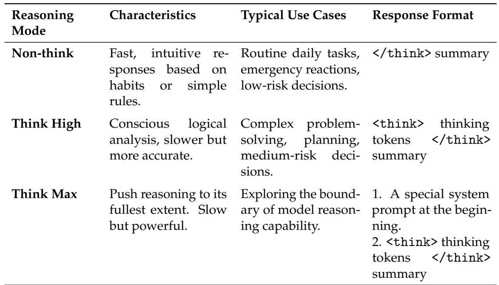
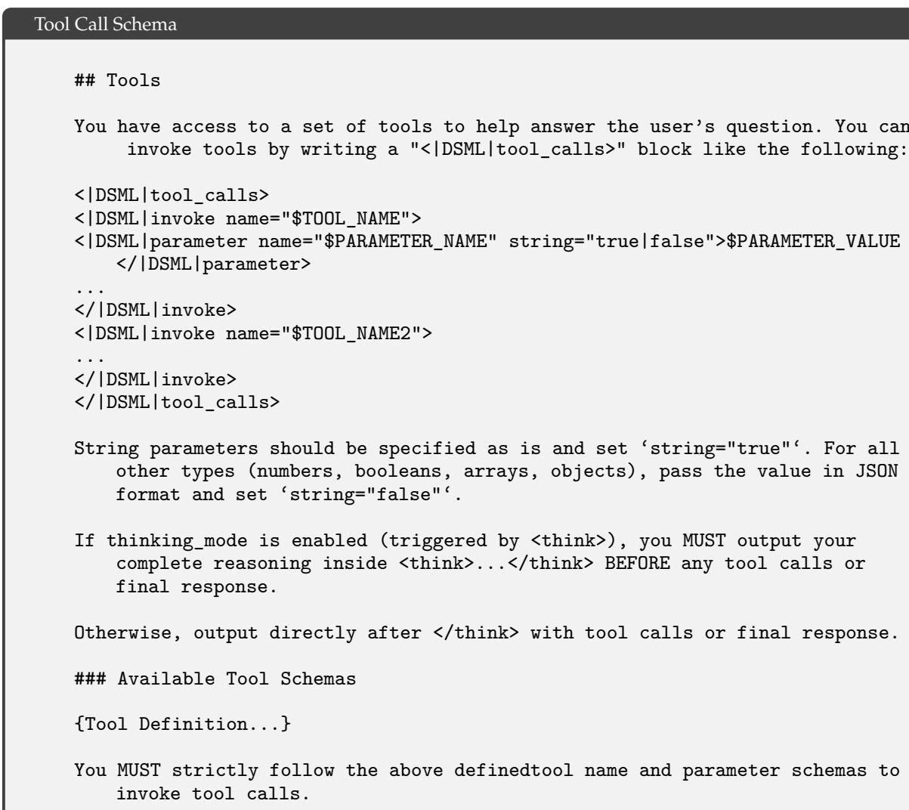
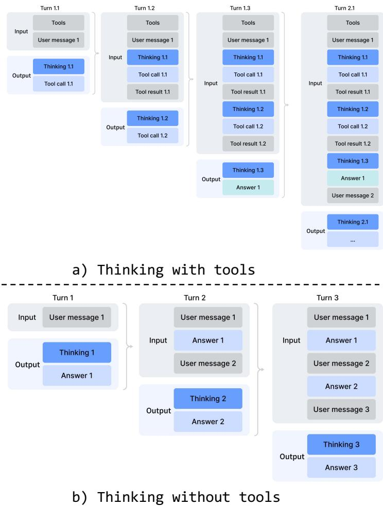
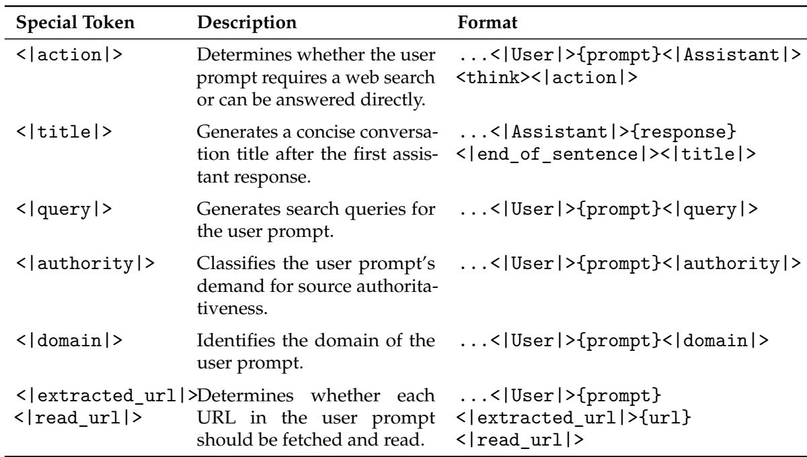

[← 返回 README](../README.md)

# 5. Post-Training

## 📌 预览

Post-training 把 base model 转成产品可用模型。V4 的关键变化是：混合 RL 阶段被 On-Policy Distillation (OPD) 替代；先训练数学、代码、agent、instruction 等 specialists，再用 multi-teacher full-vocabulary reverse KL 统一到一个 student。基础设施侧则引入 FP4 QAT、teacher scheduling、preemptible rollout、million-token RL 数据管线和 DSec sandbox。

---

## 5.1. Post-Training Pipeline

Following pre-training, we conducted a post-training phase to yield the final models of DeepSeek-V4 series. Although the training pipeline largely mirrored that of DeepSeek-V3.2, a critical methodological substitution was made: the mixed Reinforcement Learning (RL) stage was entirely replaced by On-Policy Distillation (OPD; Gu et al., 2024; Lu and Lab, 2025).

> 💡 **管线变化**: “mixed RL → OPD”是本节最重要的方法变化。它意味着最终模型不是把所有能力目标混在一个 RL 目标里，而是先分专家，再用 on-policy student trajectories 做多 teacher 对齐。

### 5.1.1. Specialist Training

The development of domain specialists was conducted by adapting the DeepSeek-V3.2 training pipeline. Specifically, each model was sequentially optimized through an initial fine-tuning phase and subsequent Reinforcement Learning (RL) guided by domain-specific prompts and reward signals. For the RL stage, we implemented the Group Relative Policy Optimization (GRPO) algorithm, maintaining hyper-parameters closely aligned with our prior research (DeepSeek-AI, 2025; DeepSeek-AI, 2025).

> 💡 **Specialist 数据流**: Base model → domain SFT → GRPO RL → specialist。不同 domain 的 reward signal 可以各自设计，避免一个统一 reward 同时承担数学、代码、agent、指令遵循等互相冲突的目标。

Reasoning Efforts. It is widely recognized that a model’s performance on reasoning tasks is fundamentally governed by the computational effort expended. Consequently, we trained distinct specialist models under divergent RL configurations to facilitate the development of models optimized for varying reasoning capacities. As detailed in Table 2, DeepSeek-V4-Pro and DeepSeek-V4-Flash both support three specific reasoning effort modes. For each mode, we apply distinct length penalties and context windows during RL training, which results in varying output token lengths for reasoning. To integrate these distinct reasoning modes, we utilize specialized response formats demarcated by the <think> and </think> tokens. Furthermore, for the "Think Max" mode, we prepend a specific instruction to the beginning of the system prompt to guide the model’s reasoning process, as shown in Table 3.

*Table 2 and Table 3: Comparison of three reasoning modes and the injected instruction for Think Max.*

> 💡 **Reasoning modes 批读**: Non-think、Think High、Think Max 不是推理时随便调温度，而是训练阶段用不同 length penalty 和 context window 得到的模式。Think Max 还通过系统 prompt 强制更彻底分解问题；这把 test-time compute budget 产品化成可选 reasoning effort。

## Injected Instruction

Reasoning Effort: Absolute maximum with no shortcuts permitted.

You MUST be very thorough in your thinking and comprehensively decompose the problem to resolve the root cause, rigorously stress-testing your logic against all potential paths, edge cases, and adversarial scenarios.

Explicitly write out your entire deliberation process, documenting every intermediate step, considered alternative, and rejected hypothesis to ensure absolutely no assumption is left unchecked.

Generative Reward Model. Typically, easy-to-verify tasks can be effectively optimized using simple rule-based verifiers or test cases. In contrast, hard-to-verify tasks traditionally rely on Reinforcement Learning from Human Feedback (RLHF), which necessitates extensive human annotation to train a scalar reward model. In the post-training phase of DeepSeek-V4 series, however, we dispense with these conventional scalar-based reward models. Instead, to address hard-to-verify tasks, we curate rubric-guided RL data and employ a Generative Reward Model (GRM) to evaluate policy trajectories. Crucially, we apply RL optimization directly to the GRM itself. In this paradigm, the actor network natively functions as the GRM, enabling the joint optimization of the model’s evaluative (judging) proficiency alongside its standard generative capabilities. By unifying these roles, the model’s internal reasoning capabilities are inherently fused into its evaluative process, resulting in highly robust scoring. Furthermore, this approach achieves superior performance with only a minimal set of diverse human annotations, as the model leverages its own logic to generalize across complex tasks.

> 💡 **GRM 批读**: 对 hard-to-verify task，传统 scalar reward model 需要大量人工标注。这里让 actor 同时学会生成和评判，用 rubric-guided data 与 GRM 评估 trajectory。它降低标注依赖，但也把“模型自评是否可靠”变成关键风险点。

Table 4 | Tool-call schema for DeepSeek-V4 series.

Tool-Call Schema and Special Token. Consistent with our previous version, we utilize a dedicated <think> $<$ /think> tag to delineate the reasoning path. In DeepSeek-V4 series, we introduce a new tool-call schema that employs a special "|DSML|" token and utilizes an XMLbased format for tool invocations, as demonstrated in Table 4. Our experiments demonstrate that the XML format effectively mitigates escaping failures and reduces tool-call errors, providing a more robust interface for model-tool interactions.

> 💡 **Tool schema 批读**: `|DSML|` + XML tool invocation 是服务 agentic AI 的接口设计。报告强调 XML 可以减少 escaping failures 和 tool-call errors，说明这里关注的是线上工具调用可靠性，而不只是模型文本能力。

*Figure 7: Thinking management of DeepSeek-V4 series.*

> 💡 **Figure 7 批读**: 图里区分 tool-calling 和普通对话。tool-calling 场景保留全部 reasoning history 跨用户轮次流动；普通对话仍在新用户消息到来时清理历史 thinking。1M context 让前者变得可行，但也需要明确上下文管理策略，否则 token 会被旧思考痕迹吞掉。

Interleaved Thinking. DeepSeek-V3.2 introduced a context management strategy that retains reasoning traces across tool-result rounds but discards them upon the arrival of new user messages. While effective, this still caused unnecessary token waste in complex agentic workflows — each new user turn would flush all accumulated reasoning content, forcing the model to reconstruct its problem-solving state from scratch. Leveraging the expanded 1M-token context window of DeepSeek-V4 series, we further refine this mechanism to maximize the effectiveness of interleaved thinking in agentic environments:

• Tool-Calling Scenarios. As illustrated in Figure 7(a), all reasoning content is fully preserved throughout the entire conversation. Unlike DeepSeek-V3.2, which discarded thinking traces upon each new user turn, DeepSeek-V4 series retain the complete reasoning history across all rounds, including across user message boundaries. This allows the model to maintain a coherent, cumulative chain of thought over long-horizon agent tasks. General Conversational Scenarios. As illustrated in Figure 7(b), the original strategy is preserved: reasoning content from previous turns is discarded when a new user message arrives, keeping the context concise for settings where persistent reasoning traces provide limited benefit.

As with DeepSeek-V3.2, agent frameworks that simulate tool interactions via user messages (e.g., Terminus) may not trigger the tool-calling context path and thus may not benefit from enhanced reasoning persistence. We continue to recommend non-think models for such architectures.

> 💡 **Interleaved thinking 边界**: 这段有一个重要 caveat：如果 agent framework 把工具结果伪装成 user messages，系统可能走普通对话路径，无法保留 thinking history。因此 1M context 的收益依赖协议层正确区分 tool calling。

*Table 5: Quick Instruction special tokens for auxiliary tasks.*

Quick Instruction. In chatbot scenarios, a number of auxiliary tasks (e.g., determining whether to trigger a web search, intent recognition, etc.) must be executed before generating the response. Conventionally, these tasks are handled by a separate small model, requiring redundant prefilling since it cannot reuse the existing KV cache. To overcome this limitation, we introduce Quick Instruction. We append a set of dedicated special tokens directly to the input sequence, where each token corresponds to a specific auxiliary task. By directly reusing the already-computed KV cache, this mechanism completely avoids redundant prefilling and allows certain tasks, such as generating search queries and determining authority and domain, to be executed in parallel. Consequently, this approach significantly reduces the user-perceived time-to-first-token (TTFT) and eliminates the engineering overhead of maintaining and iterating an extra small model. The supported Quick Instruction tokens are summarized in Table 5.

> 💡 **Quick Instruction 批读**: 传统做法是小模型先判定 search/query/domain，这会重复 prefill。Quick Instruction 把这些辅助任务变成主模型输入末尾的 special tokens，复用同一份 KV cache，并可并行生成多个辅助判断。它是推理系统设计，不是单纯 prompt trick。

### 5.1.2. On-Policy Distillation

After training multiple domain-specific experts via specialized fine-tuning and reinforcement learning, we employ multi-teacher On-Policy Distillation (OPD; Gu et al. 2024; Lu and Lab 2025) as the primary technique for merging expert capabilities into the final model. OPD has emerged as an effective post-training paradigm for efficiently transferring the knowledge and capabilities of domain experts to a single, unified model. This is achieved by having the student learn from the output distributions of teacher models on its own generated trajectories. Formally, given a set of $N$ expert models $\{ \pi _ { E _ { 1 } } , \pi _ { E _ { 2 } } , \ldots , \pi _ { E _ { N } } \} ,$ , the OPD objective function is defined as:

$$
\mathcal { L } _ { \mathrm { O P D } } ( \boldsymbol { \theta } ) = \sum _ { i = 1 } ^ { N } w _ { i } \cdot \operatorname { D } _ { \mathrm { K L } } \left( \pi _ { \boldsymbol { \theta } } \parallel \pi _ { E _ { i } } \right) .
$$

In this formulation, $w _ { i }$ represents the assigned weight for each expert, typically determined by the relative importance of the expert. Computing the reverse KL loss $\operatorname { D } _ { \mathrm { K L } } \left( \pi _ { \theta } \parallel \pi _ { E _ { i } } \right)$ requires sampling training trajectories from the student $\pi _ { \theta }$ to maintain on-policy learning. The underlying logic ensures that the unified policy $\pi _ { \theta }$ selectively learns from the specialized expert relevant to the current task context (e.g., aligning with the mathematics expert for math reasoning tasks and the coding expert for programming tasks). Through this mechanism, the knowledge from physically distinct expert weights is consolidated into a unified parameter space via logits-level alignment, practically circumventing the performance degradation often encountered in traditional weight-merging or mixed RL techniques. In this stage, more than ten teacher models covering various domains are employed to distill a single student model.

> 💡 **OPD 公式批读**: Student 在自己的 trajectories 上学习多个 expert distribution，目标是 reverse KL 的加权和。相比 weight merging，OPD 合并的是行为分布；相比 mixed RL，它把 domain expert 的能力通过 logits-level alignment 蒸馏到统一参数空间。报告明确 teacher 数量超过 10 个。

In handling the above OPD objective, prior works usually simplify the full-vocabulary KL loss into a token-level KL estimate at each token position, and reuse RL framework by replacing sg - log ???? ( ?? | , <?? )???? ( ???? | ??, ??<?? ) (sg represents the stop gradient operation) as the per-token advantage estimate in the policy loss calculation. Although this approach is resource-efficient, it leads to high variance in gradient estimation and often causes training instability. Therefore, we adopt full-vocabulary logit distillation in our OPD. Preserving the complete logit distribution in calculating reverse KL loss yields more stable gradient estimates and ensures faithful distillation of the teachers’ knowledge. In the following subsection, we describe the engineering efforts that make full-vocabulary OPD feasible at scale.

> 💡 **full-vocabulary OPD 批读**: token-level KL 近似省资源但梯度方差高；V4 选择 full-vocabulary logits，代价是 `|V| > 100K` 的 teacher logits 计算和调度压力。后面的 infrastructure 就是为这个选择买单。

## 5.2. Post-Training Infrastructures

Our post-training infrastructure is built upon the scalable framework developed for DeepSeek-V3.2. Specifically, we integrate the same distributed training stack described in Section 3.4 and the rollout engine introduced earlier for efficient auto-regressive sampling. Building on this foundation, we introduce the following principal enhancements in the present work. These designs enable efficient execution of ultra-long-context RL and OPD merging tasks involving over ten distinct teacher models, thereby substantially accelerating the iteration cycle for model releases.

> 💡 **后训练 infra 主线**: 后训练的瓶颈变成 rollout、teacher forward、full-vocab KL、长上下文数据搬运和 agent sandbox。V4 的 post-training infra 是围绕这些瓶颈设计的。

### 5.2.1. FP4 Quantization-Aware Training

To achieve inference acceleration and reducing memory traffic at deployment, we introduce Quantization-Aware Training (QAT) (Jacob et al., 2018) during the post-training stage, enabling the model, including those of teacher and reference models, to adapt to the precision degradation introduced by quantization. We apply FP4 (MXFP4) quantization (Rouhani et al., 2023) to two components: (1) MoE expert weights, which are a major source of GPU memory occupancy (OpenAI, 2025), and (2) the Query-Key (QK) path in the indexer of CSA, where QK activations are cached, loaded, and multiplied entirely in FP4, accelerating attention score computation in long-context scenarios. In addition, we further quantize the index scores $I _ { \langle , }$ : from FP32 to BF16 during this QAT process. This optimization achieves a $2 \times$ speedup for the top- $\mathbf { \nabla } \cdot \mathbf { k }$ selector, while preserving a $9 9 . 7 \%$ recall rate of KV entries.

> 💡 **FP4 QAT 批读**: FP4 作用点不是全模型，而是 MoE expert weights 和 CSA indexer QK path。前者降专家权重显存/带宽，后者加速长上下文 top-k 检索。2x top-k selector speedup 和 99.7% KV recall 是关键工程指标。

For MoE expert weights, following the common practice of QAT, the FP32 master weights maintained by the optimizer are first quantized to FP4, then dequantized back to FP8 for computation. Notably, our FP4-to-FP8 dequantization is lossless. This is because FP8 (E4M3) has 2 additional exponent bits compared with FP4 (E2M1), offering a larger dynamic range. Consequently, as long as the ratio between the maximum and minimum scale factors of the FP4 sub-blocks ( $\mathrm { 1 } \times 3 2$ tiles) within each FP8 quantization block ( $1 2 8 \times 1 2 8$ tiles) does not exceed a certain threshold, the fine-grained scale information can be fully absorbed by the extended dynamic range of FP8. We empirically verify that current weights satisfy this condition. This allows the entire QAT pipeline to fully reuse the existing FP8 training framework without any modification. In the backward pass, gradients are computed with respect to the same FP8 weights in the forward pass and directly propagated back to the FP32 master weights, equivalent to applying the Straight-Through Estimator (STE) through the quantization operation. This also avoids the need to re-quantize transposed weights.

During the inference and rollout phases of RL training, which do not involve backward passes, we directly use native FP4 quantized weights instead of simulated quantization. This ensures that model behavior during sampling is fully consistent with online deployment, while also reducing kernel memory loading for actual speedup and significantly lowering memory consumption. We process the QK path in the indexer of CSA similarly.

> 💡 **部署一致性**: 训练里模拟 FP4，rollout/inference 直接用 native FP4，这能让采样行为与线上部署一致。对 RL/OPD 来说，rollout 分布如果和线上精度不一致，会污染后训练信号。

### 5.2.2. Efficient Teacher Scheduling for Full-Vocabulary OPD

Our framework supports full-vocabulary On-Policy Distillation (OPD) with an effectively unbounded number of teachers, each potentially comprising trillions of parameters. To enable this, all teacher weights are offloaded to a centralized distributed storage and are loaded on demand during the teacher forward pass with ZeRO-like parameter sharding to alleviate both $\mathrm { I } / \mathrm { O }$ and DRAM pressure. Furthermore, naively materializing logits for a vocabulary size $\vert V \vert > 1 0 0 \mathrm { k }$ across all teachers is prohibitive, even when spooled to disk. We address this by caching only the last-layer teacher hidden states in a centralized buffer during the forward pass. At training time, these cached states are retrieved and passed through the corresponding prediction head module to reconstruct the full logits on the fly. This design incurs negligible recomputation overhead while completely circumventing the memory burden associated with explicit logits materialization. To mitigate the GPU memory footprint of the teacher prediction head, we order training samples by teacher index during data dispatching. This arrangement ensures that each distinct teacher head is loaded only once per mini-batch and that at most one teacher head resides in device memory at any given time. All parameters and hidden state loading/offloading operations proceed asynchronously in the background, without blocking computation on the critical path. Finally, the exact KL divergences between teacher and student logits are computed using a specialized TileLang kernel, which accelerates the computation and curtails dynamic memory allocation.

> 💡 **Teacher scheduling 批读**: full-vocab OPD 的朴素做法会 materialize `>100K vocab * teachers * tokens` logits，无法承受。V4 缓存 teacher last-layer hidden states，而不是 logits；训练时加载对应 prediction head 现算 logits。按 teacher index 排序 mini-batch 保证一次只驻留一个 teacher head。

### 5.2.3. Preemptible and Fault-Tolerant Rollout Service

To maximize GPU resource utilization while enabling rapid hardware provisioning for highpriority tasks, our GPU cluster employs a cluster-wide preemptive task scheduler, where any running task may be preempted at any time. Also, hardware failures are prevalent in large-scale GPU clusters. To this end, we implement a preemptible and fault-tolerant LLM generation service for RL/OPD rollout.

Specifically, we implement a token-granular Write-Ahead Log (WAL) for each generation request. Whenever a new token is generated for a request, we immediately append it to that request’s WAL. During preemption, we pause the inference engine and save the KV cache of unfinished requests. Upon resumption, we use the persisted WALs and saved KV cache to continue decoding. Even when a fatal hardware error occurs, we can re-run the prefill phase using the persisted tokens in WAL to reconstruct the KV cache.

Importantly, it is mathematically incorrect to regenerate unfinished requests from scratch, as this introduces length bias. Because shorter responses are more likely to survive interruption, regenerating from scratch makes the model more prone to producing shorter sequences whenever an interruption occurs. If the inference stack is batch-invariant and deterministic, this correctness issue could also be addressed by regenerating with a consistent seed for the pseudorandom number generator used in the sampler. However, this approach still incurs the extra cost of re-running the decoding phase, making it far less efficient than our token-granular WAL method.

> 💡 **WAL rollout 批读**: 这段非常工程但很关键。中断后从头生成会引入 length bias，因为短答案更容易完整幸存。token-granular WAL + saved KV cache 让 rollout 可恢复且保持分布正确；fatal failure 时用 WAL tokens 重跑 prefill 重建 KV。

### 5.2.4. Scaling RL Framework for Million-Token Context

We introduce targeted optimizations for efficient RL and OPD on million-token sequences. During the rollout phase, we adopt a preemptible and fault-tolerant rollout service, detailed in Section 5.2.3. For the inference and training phase, we decompose the rollout data format into lightweight metadata and heavy per-token fields. During data dispatching, the metadata for the entire rollout data can be loaded to perform global shuffling and packing layout computation. Heavy per-token fields are loaded via a shared-memory data loader to eliminate intra-node data redundancy and are released immediately upon consumption at the mini-batch granularity, substantially reducing both CPU and GPU memory pressure. The number of on-device minibatches is dynamically determined based on workload, allowing an efficient trade-off between computational throughput and I/O overlap.

> 💡 **Million-token RL 批读**: 1M sequence 的 rollout 数据不能当普通样本处理。V4 把 metadata 和 heavy per-token fields 分离：metadata 用于全局 shuffle/packing，per-token fields 通过 shared-memory loader 按 mini-batch 消费后释放，避免 CPU/GPU 内存被 rollout 全量字段撑爆。

### 5.2.5. Sandbox Infrastructure for Agentic AI

To meet the diverse execution demands of agentic AI during post-training and evaluation, we build a production-grade sandbox platform, DeepSeek Elastic Compute (DSec). DSec comprises three Rust components — the API gateway (Apiserver), per-host agent (Edge), and the cluster monitor (Watcher) — that are interconnected by a custom RPC protocol and scale horizontally atop the 3FS distributed filesystem (DeepSeek-AI, 2025). In production, a single DSec cluster manages hundreds of thousands of concurrent sandbox instances.

> 💡 **DSec 定位**: Agent 后训练需要真实执行环境，不只是文本对话。DSec 是为了在训练/评测中大规模执行 function、container、microVM、fullVM 任务，并与 GPU 训练调度联动。

The design of DSec is motivated by four observations: (1) agentic workloads are highly heterogeneous, spanning lightweight function calls to full software-engineering pipelines with diverse OS and security requirements; (2) environment images are numerous and large, yet must load quickly and support iterative customization; (3) high-density deployment demands efficient CPU and memory utilization; (4) sandbox lifecycles must coordinate with GPU training schedules, including preemption and checkpoint-based resumption. Based on these observations, we elaborate on the four core designs of DSec individually in the following.

Four Execution Substrates Behind One Unified Interface. DSec exposes a single Python SDK (libdsec) that abstracts four execution substrates. Function Call dispatches stateless invocations to a pre-warmed container pool, eliminating cold-start overhead. Container is fully Docker-compatible and leverages EROFS (Gao et al., 2019) on-demand loading for efficient image assembly. microVM, built on Firecracker (Agache et al., 2020), adds VM-level isolation for security-sensitive, high-density deployments. fullVM, built on QEMU (Bellard, 2005), supports arbitrary guest operating systems. All four share a common API surface — command execution, file transfer, and TTY access — and switching between them requires only a parameter change.

Fast Image Loading via Layered Storage. DSec reconciles fast startup with a large and growing corpus of environment images through layered, on-demand loading. For containers, base images and filesystem commits are stored as 3FS-backed readonly EROFS layers mounted directly into overlay lowerdirs. We keep file metadata readily available on the local disk at mount time;

meanwhile, data blocks are fetched from 3FS upon request. For microVMs, DSec uses the overlaybd (Li et al., 2020) disk format: the read-only base layer resides on 3FS for crossinstance sharing, while writes go to a local copy-on-write layer. Such snapshots are chainable, facilitating efficient versioning and millisecond-scale resumption.

Density Optimizations Under Massive Concurrency. To accommodate hundreds of thousands of sandboxes per cluster, DSec tackles two resource bottlenecks. First, it mitigates duplicate page-cache footprints in virtualized environments and applies memory reclamation to enable safe overcommitment. Second, it alleviates spinlock contention in the container runtime and therefore, reduces per-sandbox CPU overhead, significantly increasing per-host packing density.

Trajectory Logging and Preemption-Safe Resumption. DSec maintains a globally ordered trajectory log for each sandbox, persistently recording every command invocation and its results. The trajectory serves three purposes: (1) client fast-forwarding — when a training task is preempted, sandbox resources are retained nonetheless; upon resumption, DSec replays cached results for previously completed commands, accelerating task recovery whilst also preventing errors from re-execution of non-idempotent operations; (2) fine-grained provenance — the origin and corresponding outcomes of each state change are traceable; (3) deterministic replay — any historical session can be faithfully reproduced from its trajectory.

> 💡 **Sandbox 数据流**: Agent prompt → DSec SDK → execution substrate → command/file/TTY operations → trajectory log。轨迹日志既用于 preemption-safe recovery，也用于 provenance 和 deterministic replay。对于 coding agent 和白领任务评测，这种可重放执行环境是评测可信度的基础。

---

## 🔖 Section 总结

### 关键数字速查

| 指标 | 数值 |
|------|------|
| Reasoning modes | Non-think / Think High / Think Max |
| OPD teachers | more than ten teacher models |
| Vocab size pressure | `|V| > 100K` logits |
| FP4 QAT targets | MoE expert weights；CSA indexer QK path |
| Top-k selector | 2x speedup；99.7% KV recall |
| DSec scale | hundreds of thousands concurrent sandbox instances |

### 核心洞察

1. V4 的后训练不是单阶段 RL，而是 specialist 能力培养与 OPD 统一合并。
2. 后训练基础设施和模型机制紧密耦合：FP4 用于部署一致 rollout，teacher scheduling 支撑 full-vocab KL，DSec 支撑 agent 任务真实执行。
3. 重要风险点：GRM 自评、interleaved thinking 的协议边界、tool-call schema 安全、sandbox 隔离和 replay 正确性都需要持续验证。

