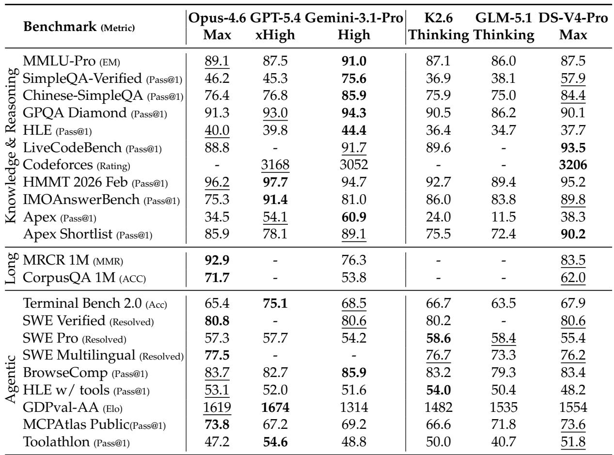
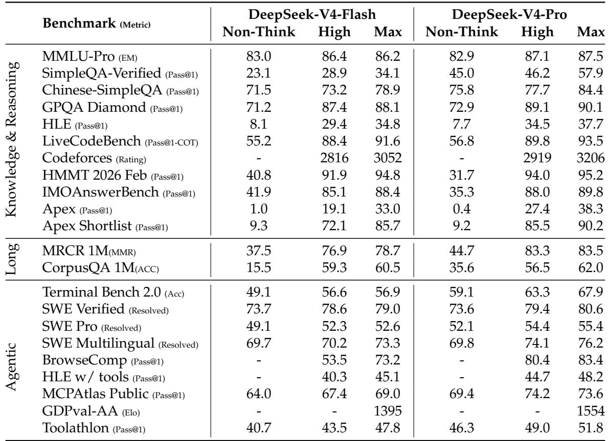
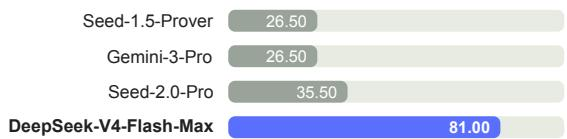
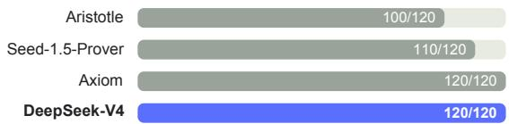
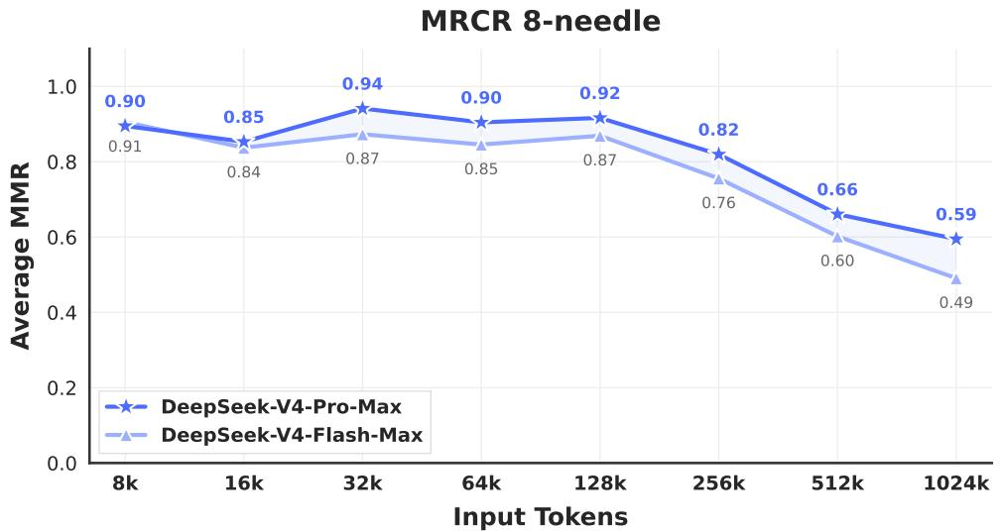
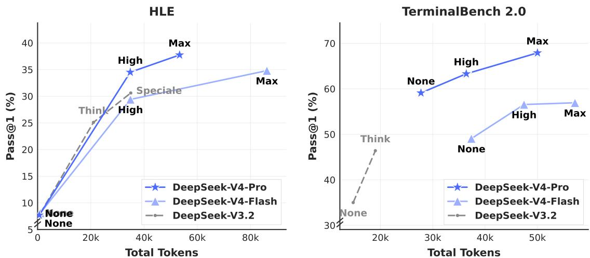
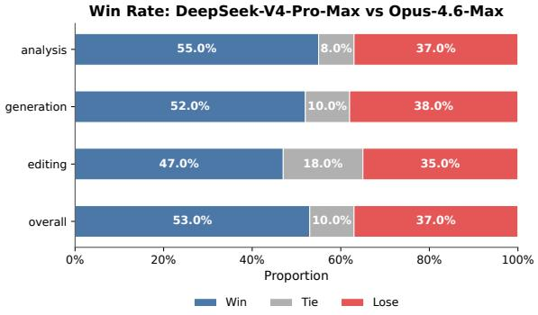
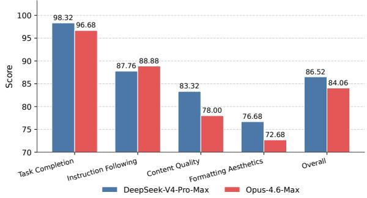
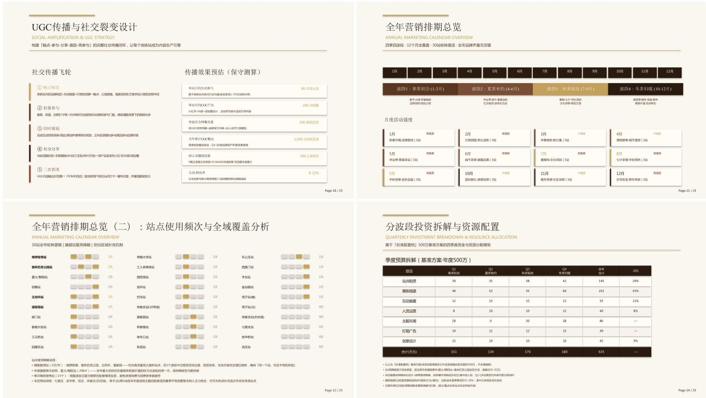
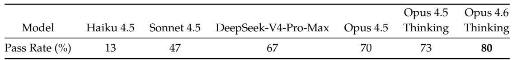

[← 返回 README](../README.md)

# 5.3-5.4 Evaluation and Real-World Tasks

## 📌 预览

这一节把 V4 的能力证据分成两类：标准 benchmark 证明 knowledge/reasoning/agent/1M context 的相对位置，真实任务评测证明 API/Chatbot 主要使用场景中的产品价值。读的时候要区分公开 benchmark、内部 benchmark、人评、真实工作流评测和用户调查。

---

## 5.3. Standard Benchmark Evaluation

### 5.3.1. Evaluation Setup

Knowledge and Reasoning. Knowledge and reasoning datasets include MMLU-Pro (Wang et al., 2024b), GPQA (Rein et al., 2023), Human Last Exam (Phan et al., 2025), Simple-QA Verified (Haas et al., 2025), Chinese-SimpleQA (He et al., 2024), LiveCodeBench-v6 (Jain et al., 2024), CodeForces (Internal Benchmark), HMMT 2026 Feb, Apex (Balunovi´c et al., 2025), Apex Shortlist (Balunovi´c et al., 2025), IMOAnswerBench (Luong et al., 2025), and PutnamBench (Tsoukalas et al., 2024).

For code, we evaluate DeepSeek-V4 series on LiveCodeBench-v6 and an internal Codeforces benchmark. For Codeforces, we collect 14 Codeforces Division 1 contests comprising 114 problems (May 2025 - November 2025). The Elo rating is computed as follows. For each contest, we generate 32 candidate solutions per problem. For each problem independently, we sample 10 of these solutions without replacement and arrange them in a random order to form the submission sequence. Each submission is judged against a test suite constructed by domain experts. The score for a solved problem follows the penalty scheme of OpenAI (2025): the model receives the median score of human participants who solved the same problem with the same number of prior failed attempts. This yields a total contest score for each sampled submission sequence, which is then converted into a contest rank and subsequently into an estimated rating via the standard Codeforces rating system. The contest-level expected rating is defined as the expectation of this estimated rating over all possible random selections and orderings of the 10 submissions per problem. The model’s overall rating is the average of these contest-level expected ratings across all 14 contests.

> 💡 **Codeforces 设置批读**: 这里不是简单 pass@1。每题生成 32 个候选、随机抽 10 个组成提交序列，并按人类失败次数惩罚计分后换算 rating。这个设置更接近竞赛提交策略，但仍是 internal benchmark，外部复验需要题集和测试套件。

For reasoning and knowledge tasks, we set the temperature to 1.0 and the context window to 8K, 128K, and 384K tokens for the Non-think, High, and Max modes, respectively. For math tasks (e.g., HMMT, IMOAnswerBench, Apex, and HLE), we evaluate using the following template: "{question}\nPlease reason step by step, and put your final answer within \boxed{}." For DeepSeek-V4-Pro-Max on math tasks, we use the following template to elicit deeper reasoning: "Solve the following problem. The problem may ask you to prove a statement, or ask for an answer. If finding an answer is required, you should come up with the answer, and your final solution should also be a rigorous proof of that answer being valid.\n\n{question}".

For formal math tasks, we evaluate in an agentic setting on Lean v4.28.0-rc1 (Moura and Ullrich, 2021), with access to the Lean compiler and a semantic tactic search engine, running up to 500 tool calls with max reasoning effort. In addition, we evaluate a more computeintensive pipeline in which candidate natural-language solutions are first generated and filtered by self-verification(Shao et al., 2025), and the retained solutions are then provided as guidance to a formal agent for proving the corresponding Lean statement. This design uses informal reasoning to improve exploration while preserving strict correctness through formal verification. A submission is counted as correct only if the strict verifier Comparator accepts it for both settings.

> 💡 **Reasoning effort 设置**: Non-think/High/Max 不仅输出长度不同，context window 也不同：8K、128K、384K。formal math 的设置还加入 Lean compiler、semantic tactic search、500 tool calls 和 strict verifier，把自然语言探索和形式化验证分开。

We have left some entries blank for K2.6 and GLM-5.1, as their APIs were too busy to return responses to our queries.

1M-Token Context. Since DeepSeek-V4 series supports 1M-token contexts, we evaluate model performance in a long context scenario by selecting OpenAI MRCR (OpenAI, 2024b) and CorpusQA (Lu et al., 2026) as the benchmarks. We re-evaluate Claude Opus 4.6 and Gemini 3.1 Pro on these tasks with the goal of standardizing the configuration across all models. We did not evaluate GPT-5.4 because its API failed to respond to a large portion of our queries.

Agent. Agent datasets include Terminal Bench 2.0 (Merrill et al., 2026), SWE-Verified (OpenAI, 2024e), SWE Multilingual (Yang et al., 2025), SWE-Pro (Deng et al., 2025), BrowseComp (Wei et al., 2025), the public evaluation set of MCPAtlas (Bandi et al., 2026), GDPval-AA (AA, 2025; Patwardhan et al., 2025), and Tool-Decathlon (Li et al., 2025).

For code agent tasks (SWE-Verified, Terminal-Bench, SWE-Pro, SWE Multilingual), we evaluate DeepSeek-V4 series using an internally developed evaluation framework. This framework provides a minimal set of tools — a bash tool and a file-edit tool. The maximum number of interaction steps is set to 500, and the maximum context length is set to 512K tokens. Regarding Terminal-Bench 2.0, we acknowledge the environment-related issues noted by GLM-5.1. Nevertheless, we report our performance on the original Terminal-Bench 2.0 dataset for consistency. On the Terminal-Bench 2.0 Verified subset, DeepSeek-V4-Pro achieves a score of approximately 72.0.

For search agent tasks (BrowseComp, HLE w/ tool), we also use an in-house harness with websearch and Python tool, and set maximum interaction steps to 500 and the maximum context length to 512K tokens. For BrowseComp, we use the same discard-all context management strategy as DeepSeek-V3.2 (DeepSeek-AI, 2025).

> 💡 **Agent 设置批读**: Agent 评测使用 512K context 和最多 500 interaction steps。工具集分两类：code agent 用 bash + file-edit，search agent 用 websearch + Python。这里再次说明 V4 的长上下文能力在 agent 场景中服务的是“更长交互轨迹”，不是只读长文档。

### 5.3.2. Evaluation Results

The comparison of DeepSeek-V4-Pro-Max and other closed/open source models is presented in Table 6. Also, we evaluate different modes of DeepSeek-V4-Flash and DeepSeek-V4-Pro and show the results in Table 7.

*Table 6: Comparison between DeepSeek-V4-Pro-Max and closed/open source models.*

> 💡 **Table 6 批读**: Table 6 是横向定位：Pro-Max 对开放模型强，部分指标接近 closed frontier，但知识类仍落后 Gemini-3.1-Pro。注意表中有 API 忙导致的空白项，不能把空白当作失败。

Knowledge. In the evaluation of general world knowledge, DeepSeek-V4-Pro-Max, the maximum reasoning effort mode of DeepSeek-V4-Pro, establishes a new state-of-the-art among open-source large language models. As demonstrated by the SimpleQA-Verified, DeepSeek-V4- Pro-Max significantly outperforms all existing open-source baselines by a margin of 20 absolute percentage points. Despite these advances, it currently trails the leading proprietary model, Gemini-3.1-Pro. In the domain of educational knowledge and reasoning, DeepSeek-V4-Pro-Max marginally outperforms Kimi and GLM across the MMLU-Pro, GPQA, and HLE benchmarks, although it lags behind leading proprietary models. Broadly, DeepSeek-V4-Pro-Max marks a significant milestone in enhancing the world knowledge capabilities of open-source models.

In addition, a significant performance gap exists between DeepSeek-V4-Flash and DeepSeek-V4-Pro on knowledge-based tasks; this is anticipated, as larger parameter counts facilitate greater knowledge retention during pre-training. Notably, both models demonstrate improved results on knowledge benchmarks when allocated higher reasoning effort.

> 💡 **Knowledge 结论**: 这里给出模型规模与知识容量关系：Flash 由于参数更少，知识任务落后 Pro；提高 reasoning effort 对知识 benchmark 有帮助，但不能完全替代参数容量。

Reasoning. DeepSeek-V4-Pro-Max outperforms all prior open models across reasoning benchmarks, and matches state-of-the-art closed models on many metrics, while the smaller DeepSeek-V4-Flash-Max also surpasses the previous best open-source model, K2.6-Thinking, on code and math reasoning tasks. Meanwhile, DeepSeek-V4-Pro and DeepSeek-V4-Flash excel in coding competitions. According to our evaluation, their performance is comparable to GPT-5.4, making this the first time an open model has matched a closed model on this task. On the Codeforces leaderboard, DeepSeek-V4-Pro-Max currently ranks 23rd among human candidates. DeepSeek-V4 also demonstrates strong performance on formal mathematical task under both agentic and compute-intensive settings. Under an agentic setup, it achieves state-of-the-art results, shown in Figure 8, outperforming prior models such as Seed Prover (Chen et al., 2025). With a more compute-intensive pipeline, performance further improves, surpassing systems including Aristotle(Achim et al., 2025) and matching the best known results under this setting.

*Table 7: Comparison among different sizes and modes of DeepSeek-V4 series.*

> 💡 **Table 7 批读**: 这张表最有价值的是 mode scaling：从 Non-think 到 High/Max，HLE、LiveCodeBench、Codeforces、Apex、MRCR、BrowseComp 等任务明显受益。Flash-Max 在一些推理任务上能接近 Pro，但 Pro-Max 在复杂 agent/knowledge 上仍更强。

Agent. The DeepSeek-V4 series demonstrates strong agent performance in evaluations. For code agent tasks, DeepSeek-V4-Pro achieves results comparable to K2.6 and GLM-5.1, though all these open models still lag behind their closed-source counterparts. DeepSeek-V4-Flash underperforms DeepSeek-V4-Pro on coding tasks, particularly on Terminal Bench 2.0. A similar trend is observed across other agent evaluations. It is worth noting that DeepSeek-V4-Pro performs well on MCPAtlas and Toolathlon—two evaluation test sets that include a wide range of tools and MCP services—indicating that our model has excellent generalization capability and does not perform well only on internal frameworks.

1M-Token Context. DeepSeek-V4-Pro outperforms Gemini-3.1-Pro on the MRCR task, which measures in-context retrieval, but remains behind Claude Opus 4.6. As illustrated in Figure 9, retrieval performance remains highly stable within a 128K context window. While a performance

## Practical Regime

## Frontier Regime

Putnam-200 Pass@8 with minimal tools and bounded sampling.

Putnam-2025 with hybrid formal-informal reasoning and substantial compute scaling.

*Figure 8: Formal reasoning under practical and frontier regimes.*

> 💡 **Figure 8 批读**: 左图是 minimal tools + bounded sampling 的 practical regime，右图是 hybrid formal-informal + substantial compute scaling 的 frontier regime。它说明形式化数学能力不仅取决于模型，还取决于工具、采样和验证 pipeline。

*Figure 9: DeepSeek-V4 series performance on the MRCR task.*

degradation becomes visible beyond the 128K mark, the model’s retrieval capabilities at 1M tokens remain remarkably strong compared to both proprietary and open-source counterparts. Unlike MRCR, CorpusQA is similar to real scenarios. The evaluation results also indicate that DeepSeek-V4-Pro is better than Gemini-3.1-Pro.

> 💡 **1M context 批读**: MRCR 偏 synthetic retrieval，CorpusQA 更接近真实 corpus analysis。报告承认 128K 后性能有退化，但 1M 仍强。这是更可信的表述：1M context 可用，但并非距离无关的完美检索。

Reasoning Effort. As shown in Table 7, the Max mode, which employs longer contexts and reduced length penalties in RL, outperforms the High mode on the most challenging tasks. Figure 10 presents a comparison of performance and cost among DeepSeek-V4-Pro, DeepSeek-V4-Flash, and DeepSeek-V3.2 on representative reasoning and agentic tasks. By scaling test-time compute, DeepSeek-V4 series achieve substantial improvements over the predecessor. Furthermore, on reasoning tasks like HLE, DeepSeek-V4-Pro demonstrates higher token efficiency than DeepSeek-V3.2.

*Figure 10: HLE and Terminal Bench 2.0 performance by reasoning effort.*

> 💡 **Figure 10 批读**: 这张图把“性能”和“成本”放在一起看。V4 的 claim 不是无限加 thinking tokens，而是在相同或更低 token/FLOPs 成本下比 V3.2 更有效地把 reasoning effort 转化为分数。

## 5.4. Performance on Real-World Tasks

Standardized benchmarks often struggle to capture the complexities of diverse, real-world tasks, creating a gap between test results and actual user experience. To bridge this, we have developed proprietary internal metrics that prioritize real-world usage patterns over traditional benchmarks. This approach ensures that our optimizations translate into tangible benefits. Our evaluation framework specifically targets the primary use cases of the DeepSeek API and Chatbot, aligning model performance with practical demands.

> 💡 **真实任务评测定位**: 这里的评价价值在产品贴近性，局限在可复验性。报告把中文写作、搜索、白领任务、code agent 当成 API/Chatbot 主场景，所以这些结果更像产品评测而非学术 benchmark。

### 5.4.1. Chinese Writing

One of the primary use cases for DeepSeek is Chinese writing. We conducted a rigorous evaluation on functional writing and creative writing. Table 12 presents a pairwise comparison between DeepSeek-V4-Pro and Gemini-3.1-Pro on functional writing tasks. These tasks consist of common daily writing queries, where prompts are typically concise and straightforward. Gemini-3.1-Pro was selected as the baseline, as it stands as the top-performing external model for Chinese writing in our evaluations. The results indicate that DeepSeek-V4-Pro outperforms the baseline with an overall win rate of $6 2 . 7 \%$ versus $3 4 . 1 \%$ ; this is primarily because Gemini occasionally allows its inherent stylistic preferences to override the user’s explicit requirements in Chinese writing scenarios.

Table 13 presents the creative writing comparison, which is evaluated along two axes: instruction following and writing quality. Compared with Gemini-3.1-Pro, DeepSeek-V4-Pro achieves a $6 0 . 0 \%$ win rate in instruction following and $7 7 . 5 \%$ in writing quality, demonstrating a marginal improvement in instruction following and a substantial gain in writing quality. Although DeepSeek-V4-Pro yields superior results in aggregate user case analysis, an evaluation restricted to the most challenging prompts — specifically those involving high-complexity constraints or multi-turn scenarios — reveals that Claude Opus 4.5 retains a performance advantage over DeepSeek-V4-Pro. As shown in Table 14, Claude Opus 4.5 achieves a $5 2 . 0 \%$ win rate versus $4 5 . 9 \%$ .

> 💡 **中文写作批读**: V4-Pro 在中文 functional/creative writing 上强，尤其 writing quality；但在高复杂约束和多轮写作上仍输给 Claude Opus 4.5。这个局限与后面白领任务的“Instruction Following / Formatting Aesthetics 仍有空间”一致。

### 5.4.2. Search

Search-augmented question answering is a core capability of the DeepSeek chatbot. On the DeepSeek web and app, the "non-think" mode employs Retrieval-Augmented Search (RAG), whereas the "thinking" mode utilizes agentic search.

Retrieval Augmented Search. We conducted a pairwise evaluation comparing DeepSeek-V4- Pro and DeepSeek-V3.2 across both objective and subjective Q&A categories. As presented in Table 11, DeepSeek-V4-Pro outperforms DeepSeek-V3.2 by a substantial margin, demonstrating a consistent advantage across both categories. The most pronounced gains are observed in single-value search and planning & strategy tasks, suggesting that DeepSeek-V4-Pro excels at locating precise factual answers and synthesizing structured plans from retrieved context. However, DeepSeek-V3.2 remains relatively competitive on comparison and recommendation tasks, indicating potential room for improvement for DeepSeek-V4-Pro in scenarios requiring balanced, multi-perspective reasoning over search results.

Agentic Search. Unlike standard RAG, agentic search empowers the model to iteratively invoke search and fetch tools per query, significantly enhancing overall search performance. For the thinking mode in DeepSeek-Chat, we optimized the agentic search function to maximize response accuracy within a predefined "thinking budget". As shown in Table 9, agentic search consistently outperforms RAG, particularly on complex tasks. Furthermore, its cost remains highly efficient, with agentic search being only marginally more expensive than standard RAG (see Table 10).

> 💡 **Search 模式批读**: Non-think 走 RAG，thinking 走 agentic search。这是产品模式与后训练 reasoning mode 的直接映射：复杂问题用更多 tool calls 和 thinking budget 换准确率，简单问题用 RAG 控成本。

### 5.4.3. White-Collar Task

To rigorously evaluate the model’s utility in sophisticated enterprise productivity scenarios, we constructed a comprehensive suite of 30 advanced Chinese professional tasks. These workflows deliberately encompass high-level cognitive demands, including in-depth information analysis, comprehensive document generation, and nuanced document editing, spanning a diverse spectrum of 13 critical industries (e.g., finance, education, law, and technology). The evaluation was conducted within an in-house agent harness equipped with basic tools, including Bash and web search.

Given the open-ended nature of these tasks, automated metrics usually fall short in capturing the nuances of a high-quality response. Therefore, we conducted human evaluations to compare the performance of DeepSeek-V4-Pro-Max against Opus-4.6-Max. Annotators blindly assessed the model outputs across four dimensions:

• Task Completion: Whether the core problem was successfully resolved.   
• Instruction Following: Adherence to specific constraints and directives.   
• Content Quality: Factual accuracy, logical coherence, and professional tone.   
• Formatting Aesthetics: Layout readability and visual presentation.

As illustrated in Figure 11, DeepSeek-V4-Pro-Max outperforms Opus-4.6-Max on diverse Chinese white-collar tasks, achieving an impressive non-loss rate of $6 3 \%$ , and demonstrating consistent advantages across analysis, generation, and editing tasks. The detailed dimension scores shown in Figure 12 highlight the model’s primary strengths in Task Completion and

Content Quality. Specifically, DeepSeek-V4-Pro-Max proactively anticipates implicit user intents by frequently providing supplementary insights and self-verification steps. It also excels in long-form generation, delivering in-depth, coherent narratives rather than relying on the overly simplistic bullet points frequently produced by Opus-4.6-Max. Additionally, the model strictly conforms to formal professional conventions, such as standardized Chinese hierarchical numbering. However, in terms of Instruction Following, it occasionally overlooks specific formatting constraints and slightly trails Opus. Furthermore, the model is less proficient at condensing extensive text inputs into succinct summaries. Finally, its Formatting Aesthetics still have substantial room for improvement regarding the overall visual design of presentation slides. Figure 13, 14, and 15 present several test cases; due to the extensive length of certain outputs, only partial pages are displayed.

*Figure 11: Win-rate comparison across analysis, generation, editing tasks, and overall performance.*

*Figure 12: Detailed dimension scores including Task Completion, Content Quality, Formatting Aesthetics, and Instruction Following.*

*Figure 13: Example output for a joint marketing proposal task.*

> 💡 **白领任务批读**: 30 个任务、13 个行业、Bash + web search harness、人评四维度。V4-Pro-Max 优势在 Task Completion 和 Content Quality，短板在格式约束、长输入压缩总结和 PPT 视觉美观。这比单一胜率更能指导后续产品优化。

### 5.4.4. Code Agent

To benchmark our coding agent capability, we curate tasks from real internal R&D workloads We collect ${ \sim } 2 0 0$ challenging tasks from $5 0 +$ internal engineers, spanning feature development, bug fixing, refactoring, and diagnostics across diverse technology stacks including PyTorch, CUDA, Rust, and ${ { C + + } }$ . Each task is accompanied by its original repository, the corresponding execution environment, and human-annotated scoring rubrics; after rigorous quality filtering, 30 tasks are retained as the evaluation set. As shown in Table 8, DeepSeek-V4-Pro significantly outperforms Claude Sonnet 4.5 and approaches the level of Claude Opus 4.5.

*Table 8: Comparison on R&D Coding Benchmark.*

> 💡 **Code agent 表格批读**: 这个 benchmark 的强项是任务来自真实内部 R&D，包含原仓库、环境和人工 rubric；弱项是仅 30 个筛选后任务且不可公开复验。67% pass rate 说明 V4-Pro-Max 接近 Opus 4.5，但仍落后 Opus 4.5 Thinking / Opus 4.6 Thinking。

In a survey asking DeepSeek developers and researchers $\left( N = 8 5 \right)$ — all with experience of using DeepSeek-V4-Pro for agentic coding in their daily work — whether DeepSeek-V4-Pro is ready to serve as their default and primary coding model compared to other frontier models, $5 2 \%$ said yes, $3 9 \%$ leaned toward yes, and fewer than $9 \%$ said no. Respondents find DeepSeek-V4-Pro to deliver satisfactory results across most tasks, but note trivial mistakes, misinterpretation of vague prompts, and occasional over-thinking.

> 💡 **用户调查批读**: N=85 内部开发者/研究者的 survey 给出 adoption signal：52% yes、39% lean yes。负面反馈集中在小错误、模糊 prompt 误解和 occasional over-thinking，这与 reasoning effort 管理和指令遵循仍可优化相呼应。

---

## 🔖 Section 总结

### 关键数字速查

| 指标 | 数值 |
|------|------|
| Codeforces internal set | 14 contests / 114 problems |
| Reasoning context | Non-think 8K；High 128K；Max 384K |
| Agent eval budget | up to 500 interaction steps；512K context |
| Terminal-Bench 2.0 Verified | DeepSeek-V4-Pro approx 72.0 |
| White-collar eval | 30 tasks / 13 industries |
| White-collar non-loss | 63% vs Opus-4.6-Max |
| Code agent curation | ~200 tasks from 50+ engineers → 30 retained |
| Code agent pass rate | V4-Pro-Max 67%；Opus 4.5 70%；Opus 4.6 Thinking 80% |
| Developer survey | N=85；52% yes，39% lean yes，<9% no |

### 核心洞察

1. V4 在 open model 对比中强，但对 closed frontier 仍是“部分接近、部分落后”。
2. 1M context 结果要看任务类型：MRCR 检索较强，CorpusQA 更真实，128K 后仍会退化但 1M 可用。
3. 真实任务评测显示 V4 的产品优势来自中文长文生成、任务完成和工具化搜索；短板集中在复杂约束遵循、压缩总结、格式美观和 over-thinking。

