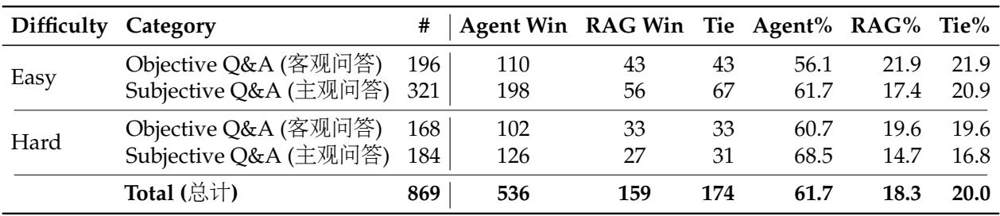
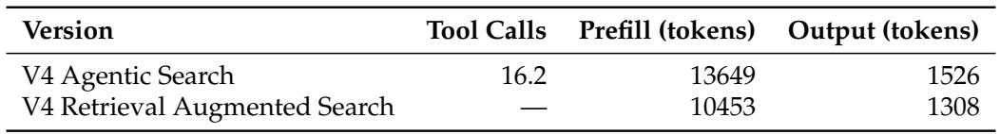
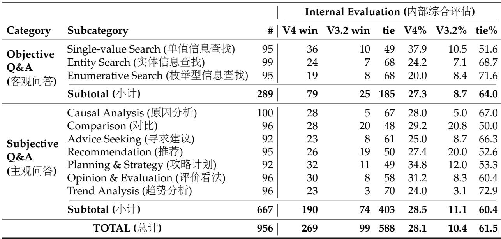
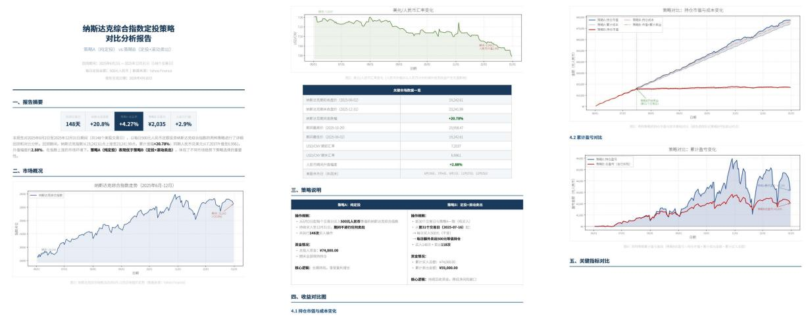
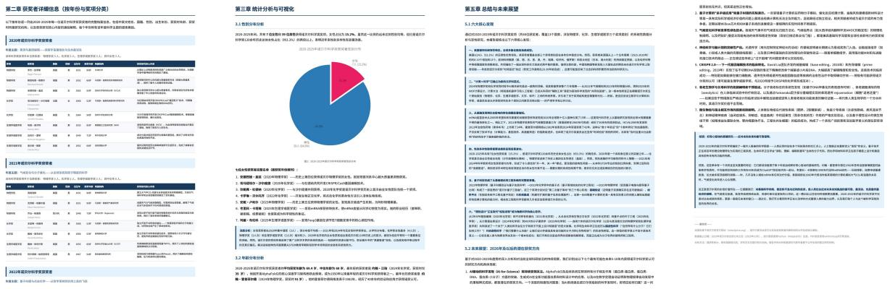
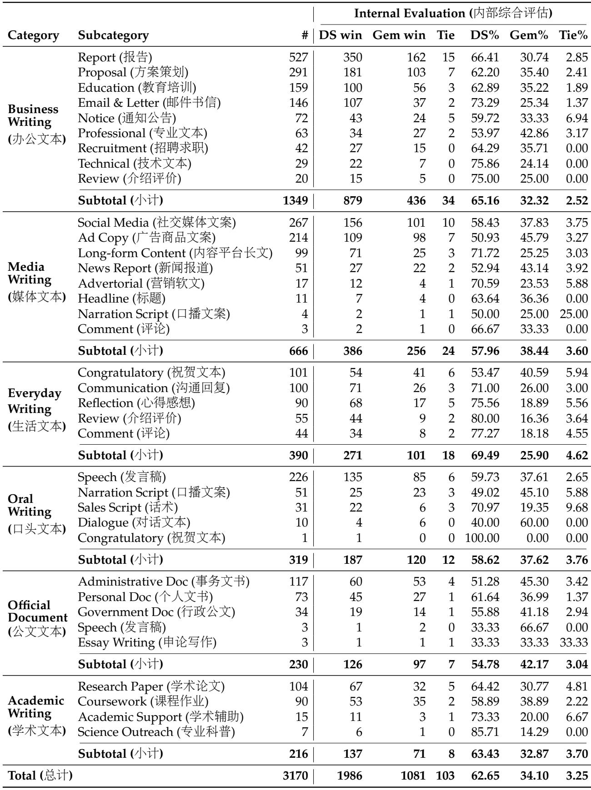
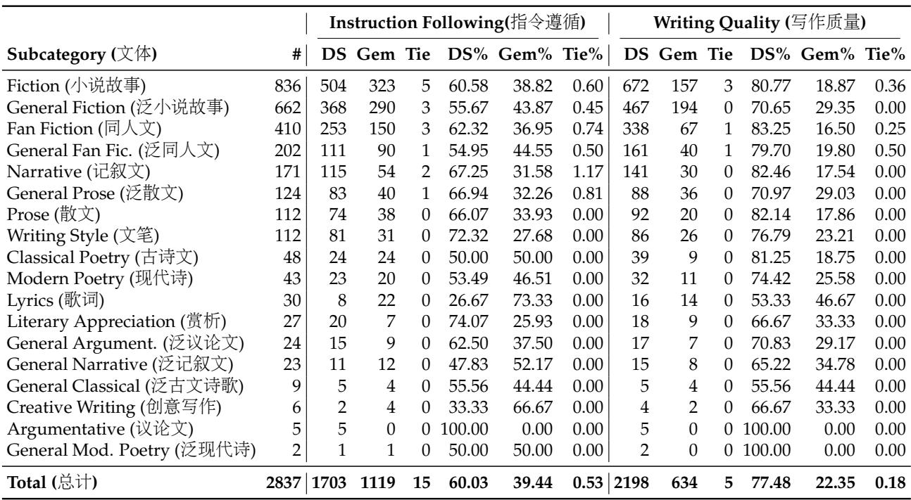
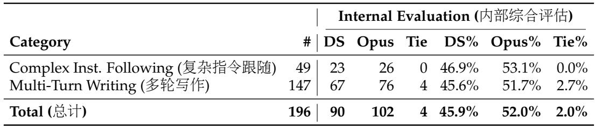

[← 返回 README](../README.md)

# 6. Conclusion, Limitations, and Future Directions + Appendix

## 📌 预览

最后一节把 V4 的贡献和局限收束起来：1M context 效率来自大胆但复杂的架构；Anticipatory Routing 和 SwiGLU Clamping 有效但机理未明；未来会继续做架构简化、新 sparsity 维度、低延迟系统、长周期 agent、多模态和数据合成。附录主要提供作者列表、致谢和真实任务评测细表。

---

## 6. Conclusion, Limitations, and Future Directions

In this work, we present a preview version of DeepSeek-V4 series, aiming at next-generation large language models that break the efficiency barrier of ultra-long-context processing. By combining a hybrid attention architecture that integrates CSA and HCA, DeepSeek-V4 series achieve a dramatic leap in long-sequence efficiency. The architectural innovations, together with extensive infrastructure optimization, enable efficient native support for million-token contexts and establish a necessary foundation for future test-time scaling, long-horizon tasks, and emerging paradigms such as online learning. Evaluation results demonstrate that DeepSeek-V4-Pro-Max, the maximum reasoning effort mode of DeepSeek-V4-Pro, redefines the state-of-the-art for open models. It substantially outperforms prior open-source models on knowledge benchmarks, achieves superior reasoning performance close to the frontier proprietary models, and delivers competitive agent capabilities. Meanwhile, DeepSeek-V4-Flash-Max attains comparable reasoning performance to leading closed models while maintaining a highly cost-efficient architecture. We believe DeepSeek-V4 series usher in a new era of million-length contexts for open models and pave the way toward better efficiency, scale, and intelligence.

> 💡 **结论主线**: 作者把 V4 定位成开放模型的 million-token context 起点。核心不是“最长上下文”，而是 native + efficient + post-training usable：架构和 infra 让 1M 可训练可服务，后训练让它在 reasoning/agent/product tasks 中产生收益。

In pursuit of extreme long-context efficiency, DeepSeek-V4 series adopted a bold architectural design. To minimize risk, we retained many preliminarily validated components and tricks, which, while effective, made the architecture relatively complex. In future iterations, we will carry out more comprehensive and principled investigations to distill the architecture down to its most essential designs, making it more elegant without sacrificing performance. Meanwhile, although Anticipatory Routing and SwiGLU Clamping have been proven effective in mitigating training instabilities, their underlying principles remain insufficiently understood. We will actively study foundational problems on training stability and strengthen internal metric monitoring, aiming for a more principled and predictive approach to stable large-scale training.

> 💡 **局限批读**: 报告主动承认两类局限：架构复杂、稳定性技巧经验化。CSA/HCA/SWA/mHC/Muon/FP4/QAT/KV layout 叠加后非常强，但工程复杂度和调参空间也很大；Anticipatory Routing 与 SwiGLU Clamping 目前更像有效经验，还不是可预测理论。

In addition, beyond the MoE and sparse attention architecture, we will also proactively explore model sparsity along new dimensions — such as more sparse embedding modules (Cheng et al., 2026) — to further improve computational and memory efficiency without compromising capability. We will also continuously investigate low-latency architectures and system techniques to make long-context deployment and interaction more responsive. Furthermore, we recognize the importance and practical value of long-horizon, multi-round agentic tasks, and will continue to iterate and explore in this direction. We are also working on incorporating multimodal capabilities to our models. Finally, we are committed to developing better data curation and synthesis strategies to consistently enhance model intelligence, robustness, and practical usability across an increasingly broad range of scenarios and tasks.

> 💡 **未来方向**: 未来路线仍是效率与能力共同优化：新的 sparsity 维度、低延迟架构/系统、长周期多轮 agent、多模态、数据构建。值得注意的是，他们把 sparse embedding 也列入 future sparsity axis，说明 MoE 和 sparse attention 之外还有内存/计算优化空间。

## References

AA. Gdpval-aa leaderboard, 2025. URL https://artificialanalysis.ai/methodolog y/intelligence-benchmarking#gdpval-aa.   
T. Achim, A. Best, A. Bietti, K. Der, M. Fédérico, S. Gukov, D. Halpern-Leistner, K. Henningsgard, Y. Kudryashov, A. Meiburg, et al. Aristotle: Imo-level automated theorem proving. arXiv preprint arXiv:2510.01346, 2025.   
A. Agache, M. Brooker, A. Florescu, A. Iordache, A. Liguori, R. Neugebauer, P. Piwonka, and D.-M. Popa. Firecracker: lightweight virtualization for serverless applications. In Proceedings of the 17th Usenix Conference on Networked Systems Design and Implementation, NSDI’20, page 419–434, USA, 2020. USENIX Association. ISBN 9781939133137.   
O. J. Aimuyo, B. Oh, and R. Singh. Flashmoe: Fast distributed moe in a single kernel. Advances in Neural Information Processing Systems, 2025. URL https://neurips.cc/virtual/2 025/poster/119124.   
J. Ainslie, J. Lee-Thorp, M. de Jong, Y. Zemlyanskiy, F. Lebrón, and S. Sanghai. Gqa: Training generalized multi-query transformer models from multi-head checkpoints. arXiv preprint arXiv:2305.13245, 2023.

> 💡 **References 批读**: 完整 references 在 `full.md` 中保留。这里摘出开头只是为了说明引用谱系：系统论文引用 Firecracker/EROFS/TVM/Z3/DeepGEMM，也引用 DeepSeekMoE/Muon/LongBench/MRCR/SWE/Terminal-Bench。V4 的知识来源横跨模型架构、优化器、编译器、分布式系统和 agent benchmark。

DeepSeek-AI. Deepseek-v3 technical report. CoRR, abs/2412.19437, 2024. URL https://doi. org/10.48550/arXiv.2412.19437.

DeepSeek-AI. Deepseek-v3.2: Pushing the frontier of open large language models, 2025. URL https://arxiv.org/abs/2512.02556.

K. Jordan, Y. Jin, V. Boza, J. You, F. Cesista, L. Newhouse, and J. Bernstein. Muon: An optimizer for hidden layers in neural networks. Cited on, page 10, 2024.

J. Liu, J. Su, X. Yao, Z. Jiang, G. Lai, Y. Du, Y. Qin, W. Xu, E. Lu, J. Yan, Y. Chen, H. Zheng, Y. Liu, S. Liu, B. Yin, W. He, H. Zhu, Y. Wang, J. Wang, M. Dong, Z. Zhang, Y. Kang, H. Zhang, X. Xu, Y. Zhang, Y. Wu, X. Zhou, and Z. Yang. Muon is scalable for LLM training. CoRR, abs/2502.16982, 2025. URL https://doi.org/10.48550/arXiv.2502.16982.

> 💡 **直接相关引用**: 读 V4 最该回溯的是 DeepSeek-V3/V3.2、DeepSeekMoE、mHC/HyperConnections、Muon、DeepGEMM/TileLang 和 LongBench/MRCR/CorpusQA。它们分别对应继承架构、残差创新、优化器、系统实现和长上下文评测。

Appendix

## A. Author List and Acknowledgment

### A.1. Author List

Authors are listed alphabetically by their first name. Names marked with \* denote individuals who have departed from our team.

Research & Engineering: Anyi Xu, Bangcai Lin, Bing Xue, Bingxuan Wang\*, Bingzheng Xu, Bochao Wu, Bowei Zhang, Chaofan Lin, Chen Dong, Chengda Lu, Chenggang Zhao, Chengqi Deng, Chenhao Xu, Chenze Shao, Chong Ruan\*, Conner Sun, Damai Dai, Daya Guo\*, Dejian Yang, Deli Chen, Donghao Li, Erhang Li, Fangyun Lin, Fangzhou Yuan, Feiyu Xia, Fucong Dai, Guangbo Hao, Guanting Chen, Guoai Cao, Guolai Meng, Guowei Li, Han Yu, Han Zhang, Hanwei Xu, Hao Li, Haofen Liang, Haoling Zhang, Haoming Luo, Haoran Wei\*, Haotian Yuan, Haowei Zhang\*, Haowen Luo, Haoyu Chen, Haozhe Ji, Honghui Ding, Hongxuan Tang, Huanqi Cao, Huazuo Gao, Hui Qu, Hui Zeng, J. Yang, J.Q. Zhu, Jia Yu, Jialiang Huang, Jiasheng Ye, Jiashi Li, Jiaxin Xu, Jiewen Hu, Jin Yan, Jingchang Chen, Jingli Zhou, Jingting Xiang, Jingyang Yuan, Jingyuan Cheng, Jinhua Zhu, Jiping Yu, Joseph Sun, Jun Ran\*, Junguang Jiang, Junjie Qiu, Junlong ${ \mathrm { L i } } ^ { * }$ , Junxiao Song, Kai Dong, Kaige Gao, Kang Guan, Kexing Zhou, Kezhao Huang\*, Kuai Yu, Lean Wang, Lecong Zhang, Lei Wang, Li Zhang, Liang Zhao, Lihua Guo, Lingxiao Luo, Linwang Ma, Litong Wang, Liyu Cai, Liyue Zhang, Longhao Chen, M.S. Di, M.Y Xu, Max Mei, Mingchuan Zhang, Minghua Zhang, Minghui Tang, Mingxu Zhou, Panpan Huang, Peixin Cong, Peiyi Wang, Qiancheng Wang, Qihao Zhu, Qingyang Li, Qinyu Chen, Qiushi Du, Qiwei Jiang, Rui Tian, Ruifan Xu, Ruijie Lu, Ruiling Xu, Ruiqi Ge, Ruisong Zhang, Ruizhe Pan, Runji Wang, Runqian Chen, Runqiu Yin, Runxin Xu, Ruomeng Shen, Ruoyu Zhang, S.H. Liu, Shanghao Lu, Shangyan Zhou, Shanhuang Chen, Shaofei Cai, Shaoheng Nie, Shaoyuan Chen, Shengding Hu, Shengyu Liu, Shiqiang Hu, Shirong Ma, Shiyu Wang, Shuiping Yu, Shunfeng Zhou, Shuting Pan, Shuying Yu, Songyang Zhou, Tao Ni, Tao Yun, Tian Jin, Tian Pei, Tian Ye, Tianle Lin, Tianran Ji, Tianyi Cui, Tianyuan Yue, Tingting Yu, Tun Wang, W. Zhang, Wangding Zeng, Weilin Zhao, Wen Liu, Wenfeng Liang, Wenjie Pang, Wenjing Luo, Wenjing Yao, Wenjun Gao, Wenkai Yang, Wenlve Huang, Wentao Zhang, Wenting Ma, Xi Gao, Xiang He, Xiangwen Wang, Xiao Bi, Xiaodong Liu, Xiaohan Wang, Xiaokang Chen, Xiaokang Zhang, Xiaotao Nie, Xin Cheng, Xin Liu, Xin Xie, Xingchao Liu, Xingchen Liu, Xingkai Yu, Xingyou Li, Xinyu Yang, Xu Chen, Xuanyu Wang, Xuecheng Su, Xuheng Lin, Xuwei Fu, Y.C. Yan, Y.Q. Wang\*, Y.W. Ma, Yanfeng Luo, Yang Zhang, Yanhong Xu, Yanru Ma, Yanwen Huang, Yao Li, Yao Li, Yao Zhao, Yaofeng Sun, Yaohui Wang, Yi Qian, Yi Yu, Yichao Zhang, Yifan Ding, Yifan Shi, Yijia Wu, Yiliang Xiong, Ying He, Ying Zhou, Yingjia Luo, Yinmin Zhong, Yishi Piao, Yisong Wang, Yixiang Zhang, Yixiao Chen, Yixuan Tan, Yixuan Wei, Yiyang Ma, Yiyuan Liu, Yonglun Yang, Yongqiang Guo, Yongtong Wu, Yu Wu, Yuan Cheng, Yuan Ou, Yuanfan Xu, Yuanhao Li, Yuduan Wang, Yuhan Wu, Yuhao Meng, Yuheng Zou, YuKun Li, Yunfan Xiong, Yupeng Chen, Yuqian Cao, Yuqian Wang, Yushun Zhang, Yutong Lin, Yuxian Gu, Yuxiang Luo, Yuxiang You, Yuxuan Liu, Yuxuan Zhou, Yuyang Zhou, Yuzhen Huang, Z.F. Wu, Zehao Wang, Zehua Zhao, Zehui Ren, Zhangli Sha, Zhe Fu, Zhean Xu, Zhenda Xie, Zhengyan Zhang, Zhewen Hao, Zhibin Gou, Zhicheng Ma, Zhigang Yan, Zhihong Shao, Zhixian Huang, Zhixuan Chen, Zhiyu Wu, Zhizhou Ren, Zhuoshu Li, Zhuping Zhang, Zian Xu, Zihao Wang, Zihui Gu, Zijia Zhu, Zilin Li, Zipeng Zhang\*, Ziwei Xie, Ziyi Gao, Zizheng Pan, Zongqing Yao.

Business & Compliance: Chenchen Ling, Chengyu Hou, Dongjie Ji, Fang Wei, Hengqing Zhang, Jia Luo, Jia Song, Jialu Cai, Jian Liang, Jiangting Zhou, Jieyu Yang, Jin Chen, Jingzi Zhou, Junmin Zheng, Leyi Xia, Linyan Zhu, Miaojun Wang, Mingming Li, Minmin Han, Ning Wang, Panpan

Wang, Peng Zhang, Ruyi Chen, Shangmian Sun, Shaoqing Wu, W.L. Xiao, Wei An, Wenqing Hou, Xianzu Wang, Xiaowen Sun, Xiaoxiang Wang, Xinyu Zhang, Xueyin Chen, Yao Xu, Yi Shao, Yiling Ma, Ying Tang, Yuehan Yang, Yuer Xu, Yukun Zha, Yuping Lin, Yuting Yan, Zekai Zhang, Zhe Ju, Zheren Gao, Zhongyu Wu, Zihua Qu, Ziyi Wan.

> 💡 **作者列表批读**: 这份报告的作者规模本身就是信号：Research & Engineering 与 Business & Compliance 都在列表中，说明 V4 不是小组方法论文，而是覆盖研究、工程、产品、合规的大规模系统发布。

### A.2. Acknowledgment

We would like to thank Dolly Deng and other testers for their valuable suggestions and feedback regarding the capabilities of DeepSeek-V4 series models.

## B. Evaluation Details

Table 9 | Agentic Search vs. Retrieval Augmented Search for DeepSeek-V4-Pro.

*Table 9: Agentic Search vs. Retrieval Augmented Search for DeepSeek-V4-Pro.*

> 💡 **Table 9 批读**: Agentic search 总体 Agent% 为 61.7%，RAG% 为 18.3%，Tie 20.0%。Hard subjective Q&A 中 Agent% 到 68.5%，说明复杂搜索任务更受益于多轮工具调用。

Table 10 | Cost Comparison:Agentic Search vs. Retrieval Augmented Search (Mean) for DeepSeek-V4-Pro. Most of the tool calls are parallel for Agentic Search.

*Table 10: Cost comparison for Agentic Search vs. RAG.*

> 💡 **Table 10 批读**: Agentic Search 平均 16.2 tool calls，prefill/output tokens 为 13649/1526；RAG 为 10453/1308。Agentic 更贵但幅度不离谱，且工具调用大多并行，因此它适合 thinking mode 下用预算换准确率。

Table 11 | Comparative Evaluation of DeepSeek-V4-Pro and DeepSeek-V3.2 on Search Q&A Tasks.

*Table 11: DeepSeek-V4-Pro vs. DeepSeek-V3.2 on Search Q&A tasks.*

> 💡 **Table 11 批读**: V4-Pro 对 V3.2 的 win rate 在 objective/subjective search 中都有优势，但 tie 比例也高。Search 场景的提升不是全面碾压，而是集中在 single-value search、planning/strategy、trend analysis 等任务。

*Figure 14: Example output of comparing two regular investment strategies for the NASDAQ.*

*Figure 15: Example output for researching 2020-2025 Nobel Science Prizes and generating an analytical PDF report.*

> 💡 **Figures 14/15 批读**: 这两张附录案例对应白领任务中的长文档分析和报告生成。它们不是 quantitative proof，但能观察模型是否会组织结构化文档、跨来源整理信息、输出面向用户的可交付物。

Table 12 | Comparative Analysis of DeepSeek-V4-Pro and Gemini-3.1-Pro in Chinese Functional Writing.

*Table 12: DeepSeek-V4-Pro vs. Gemini-3.1-Pro in Chinese functional writing.*

> 💡 **Table 12 批读**: Functional writing 总体 DS% 为 62.65%，Gem% 为 34.10%。报告、商务写作、日常写作、学术支持等大类都体现 V4 在中文语体和格式约束上的本地化优势。

Table 13 | Comparative Analysis of DeepSeek-V4-Pro and Gemini-3.1-Pro in Chinese Creative Writing.

*Table 13: DeepSeek-V4-Pro vs. Gemini-3.1-Pro in Chinese creative writing.*

> 💡 **Table 13 批读**: Creative writing 分成 instruction following 和 writing quality。总计 instruction following DS% 60.03%，writing quality DS% 77.48%，说明质量提升大于指令遵循提升；复杂约束仍可能是短板。

Table 14 | DeepSeek-V4-Pro vs. Claude-Opus-4.5 on Complex Instruction Following and Multi-Turn Writing.

*Table 14: DeepSeek-V4-Pro vs. Claude-Opus-4.5 on complex instruction following and multi-turn writing.*

> 💡 **Table 14 批读**: 复杂指令和多轮写作上 Opus 4.5 仍领先：总体 Opus% 52.0%，DS% 45.9%。这为 README 中“复杂约束遵循仍需加强”的局限提供直接证据。

---

## 🔖 Section 总结

### 关键数字速查

| 指标 | 数值 |
|------|------|
| Agentic Search vs RAG | Agent 61.7% / RAG 18.3% / Tie 20.0% |
| Agentic Search cost | 16.2 tool calls；13649 prefill；1526 output |
| Chinese functional writing | DS 62.65% / Gemini 34.10% |
| Chinese creative writing | Instruction DS 60.03%；Quality DS 77.48% |
| Complex writing vs Opus | DS 45.9% / Opus 52.0% |

### 核心洞察

1. V4 的结论同时强势和克制：长上下文效率与开放模型能力提升明确，但架构复杂和训练稳定机理仍待简化/解释。
2. 附录表格补齐了真实任务证据：搜索和中文写作是强项，复杂多轮指令遵循仍落后强 closed model。
3. 后续读这份报告，应重点追问“哪些复杂组件可以删掉但保留大部分收益”，以及“内部评测能否被外部 benchmark 复现”。

