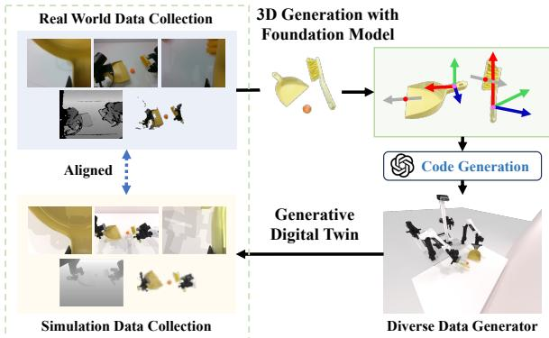

[← 返回 README](../README.md)

# 1. Introduction

## 📌 预览

Introduction 沿"痛点 → 已有方案的不足 → 我们的方案 → 贡献"四步展开。痛点是双臂系统缺少多样高质量数据与对齐真实世界的基准；已有方案里遥操作贵、算法轨迹生成器需任务定制、MimicGen/RoboCasa 受限于固定场景、现有基准偏单臂或分离双臂。RoboTwin 用「3D 生成基础模型 + LLM」从单张 RGB 图片起步，生成带空间标注的数字孪生并自动产出专家演示，最后落到三条贡献。

---

Robotic systems with intricate dual-arm coordination and precise dexterity are essential for complex object manipulation to unlock advanced capabilities across domains such as healthcare, manufacturing, logistics, and domestic assistance. However, creating robust and versatile robotic systems that meet these demands remains a challenge, with a major bottleneck being the absence of diverse, high-quality training data and comprehensive evaluation benchmarks that are aligned with the real world.

> 💡 **问题动机（claude 批注）**: 开篇把双臂灵巧操作的价值（医疗、制造、物流、家庭）与瓶颈（缺多样高质量数据 + 缺对齐真实世界的评测基准）对立起来。注意它把"数据"和"基准"并列为两个瓶颈——这正对应后文两条主贡献：数据生成管线 + 统一基准。

*Figure 1. RoboTwin Benchmark. A framework leveraging generative foundational models to generate realistic and interactive training scenarios and diverse expert demonstrations for benchmarking dual-arm robotic manipulation.*

> 💡 **Figure 1 批读（claude 批注）**:
> - 这张 teaser 图承担"一图看懂全框架"的作用：左侧是真实物体照片，中间通过生成基础模型变成多样的 3D 数字孪生场景，右侧是双臂机器人在这些场景里执行任务并产生专家演示。
> - 它想传达的核心信息是 **"生成式"** 三个字——不是手工搭几个固定场景，而是让基础模型批量生成"逼真且可交互"的训练场景和多样演示。
> - 按 skill 规则，Abstract 页不放图，Figure 1 归属 Introduction，这里正是它的落点。

Traditional approaches to data collection, particularly human teleoperation [4, 12, 16, 18, 20, 31], yield highquality demonstrations but face significant practical limitations. While these methods provide reliable training data, they are often prohibitively expensive, time-intensive, and struggle to cover the diverse range of scenarios robots encounter in real-world deployments. To address these limitations, researchers have turned to algorithmic trajectory generators in simulations [15, 23, 34]. These alternatives, however, frequently require task-specific design, hindering their generalizability and scalability. Recent advances such as MimicGen [54] and RoboCaca [59] have demonstrated significant progress in generating large-scale simulated expert data from limited human demonstrations. However, these approaches operate under fixed scenario settings and struggle to handle task variants beyond their predefined configu rations, limiting their generalizability to novel scenarios.

> 💡 **机制拆解（与 baseline 的差异）（claude 批注）**: 这段是"已有数据方案为什么不够"的逐条否定。①**人类遥操作**：质量高但贵、慢、场景覆盖差。②**仿真里的算法轨迹生成器**：要针对每个任务手工设计，难泛化。③**MimicGen / RoboCasa**：能从少量人类演示放大出大规模仿真数据，但场景固定、只能处理预定义配置，遇到新场景变体就失效。RoboTwin 的差异化定位正是补上"场景/物体多样性"这一维——用 3D 生成模型批量造物体变体，而不是复用固定 3D 资产。

Another limitation of existing benchmarks is that they predominantly focus on single-arm tasks [23, 55] or bimanual tasks with two separated arms [22], which fail to capture the complexity and coordination requirements inherent in integrated dual-arm systems. While HumanoidBench [64] and BiGym [13] explore benchmarks for humanoid bimanual manipulation, their scalability is limited by fixed environments or reliance on VR teleoperation for demonstration collection. As a result, these gaps highlight the urgent need for a scalable and standardized dual-arm collaboration benchmark with an efficient data collection pipeline.

> 💡 **机制拆解（基准维度的空白）（claude 批注）**: 上一段谈数据，这段谈基准。作者指出现有基准要么是单臂、要么是"两条分离手臂"的伪双臂，缺乏真正需要协调（交接、避让）的一体化双臂任务；HumanoidBench 环境固定、BiGym 依赖 VR 遥操作采数据，规模都上不去。于是得到本文的目标函数：**可扩展 + 标准化的双臂协作基准 + 高效数据采集管线**。

To address these challenges, as shown in Fig. 1, we propose RoboTwin, a generative digital twin framework empowered by 3D generative foundation models and large language models (LLMs), aiming to produce diverse expert datasets and provide a real-world-aligned evaluation platform for dual-arm robotic tasks. Starting from a single 2D RGB image, we employ generative foundation models for 3D modeling and texture generation, enabling the efficient creation of varied object instances with different shapes, sizes, and appearances. Each object class is incorporated with spatial annotations, which define function axes, approach axes, lateral axes, and contact points and are applicable across various instances within an object class via feature point matching technology. Building upon these spatially-aware digital twins, RoboTwin leverages LLMs to interpret and decompose complex tasks into manageable sub-tasks. For each sub-task, we infer the constraints of the terminal state. For example, in a hammering task, the functional point of the hammer head needs to align with the surface of the target object. RoboTwin then generates executable code that calculates key poses based on these spatial constraints and object properties, interfacing with underlying planning modules to produce complete, feasible trajectories for execution.

> 💡 **机制拆解（数据流总览）（claude 批注）**: 这是全文最重要的一段方法预告，可以按数据流拆：
> - **输入**：单张 2D RGB 图片。
> - **中间表示 1**：3D 生成模型输出的多样物体实例（形状/尺寸/外观各异）。
> - **中间表示 2**：每个物体类挂上"空间标注"——function axis / approach axis / lateral axis + contact point，并通过特征点匹配把标注迁移到同类的所有实例（一次标注、全类复用）。
> - **中间表示 3**：LLM 把复杂任务拆成子任务，并为每个子任务推断"终态约束"（例：锤子的 functional point 要对齐目标表面）。
> - **输出**：可执行代码 → 计算关键位姿 → 交给底层规划器 → 完整可行轨迹。
> 这段把 [03-methodology](03-methodology.md) 的三节（资产生成 / 空间标注 / 专家数据生成）压缩成了一条流水线。

Within the above framework, our RoboTwin features diverse dual-arm manipulation tasks that combine simulated expert data with real-world teleoperated datasets under consistent environmental and hardware setups. We then benchmark and evaluate the ability of RoboTwin to improve policy generalization in real-world scenarios. Experimental results demonstrated that policies pre-trained on 300 RoboTwin-generated samples and fine-tuned with 20 realworld samples improve the success rate by 70% in singlearm manipulation tasks like hammer beat, and over 40% in dual-arm coordination tasks, such as ball sweep, compared to those trained exclusively on 20 real-world samples.

> 💡 **消融解读（证据前置）（claude 批注）**: 这里把主结论和具体任务绑定：单臂 hammer beat 提升 70%、双臂 ball sweep 提升 40%+，baseline 都是"仅 20 条真机"。"consistent environmental and hardware setups"是关键前提——只有仿真与真机在环境/硬件上严格对齐，"仿真预训练迁移到真机"的对比才有说服力（详见 [05-experiments](05-experiments.md) §5.3）。

We summarize our key contributions as: 1) we establish a convenient real-to-sim pipeline that requires only an RGB image from the real world to generate diverse 3D models of target objects, empowered by a 3D generative foundation model; 2) we create a spatial-aware code generation framework, which automatically creates expert-level demonstration data via a large language model and the spatial annotations of the target objects. 3) we develop a standard benchmark for dual-arm manipulation tasks including both realworld teleoperated data and high-fidelity synthetic data generated for corresponding scenarios. These advancements provide a robust framework for generating diverse, highquality training data and policy evaluation for dual-arm manipulation tasks, significantly contributing to the development of more capable and versatile robotic systems.

> 💡 **机制拆解（三条贡献映射）（claude 批注）**: 三条贡献恰好对应方法三节：①**real-to-sim 管线**（仅需 RGB 图片，对应 §3.1）；②**空间感知代码生成框架**（LLM + 空间标注自动造专家数据，对应 §3.2/§3.3）；③**双臂标准基准**（真机遥操作 + 高保真合成数据，对应 §4）。可以把它当作 README「核心贡献」的原始出处。

---

## 🔖 Section 总结

### 核心洞察
1. 双臂操作的两大瓶颈被明确拆成"数据"与"基准"，全文的两条主贡献一一对应。
2. RoboTwin 的差异化不在策略，而在"用生成基础模型造多样场景/物体 + 用 LLM 自动写代码造专家数据"，从而突破 MimicGen/RoboCasa 的固定场景限制。
3. 数据流骨架：RGB 图片 → 多样 3D 资产 → 空间标注（轴+点，特征点匹配跨实例复用）→ LLM 子任务分解 + 约束推断 → 可执行代码 → 规划器出轨迹。

### 关键数字速查
| 指标 | 数值 |
|------|------|
| 单臂 hammer beat 提升 | ~70% |
| 双臂 ball sweep 提升 | >40% |
| 预训练/微调样本 | 300 仿真 / 20 真机 |
| 空间标注要素 | 3 轴（function/approach/lateral）+ 2 类点（function/contact）|

### 可追问点
- 特征点匹配用什么做跨实例迁移？→ [03-methodology](03-methodology.md) §3.2（Stable Diffusion 编码器的 diffusion features）。
- "hammer beat / ball sweep"分别属于哪些基准任务？→ [07-appendix](07-appendix.md) Table 5 任务描述。

