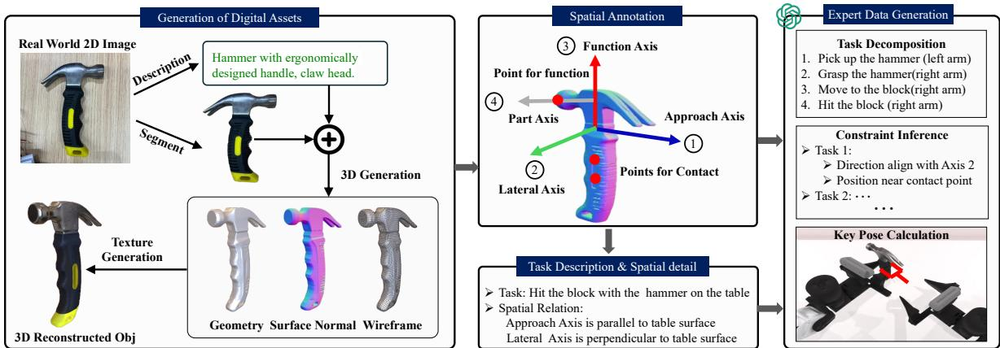
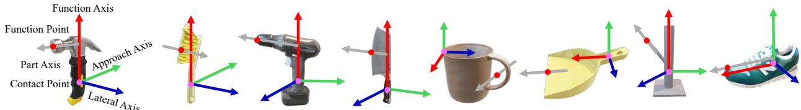

[Back to README](../README.md)

## 3. Bridging Physical and Digital Worlds for Diverse Robot Behavior Generation

## 📌 预览

本节是 RoboTwin 的技术主干：它不是直接训练一个新的 VLA 策略，而是先将真实物体生成为带空间语义的数字孪生，再把语义约束编译成可执行的双臂运动代码与专家轨迹。可以把整条链看成：`RGB 物体图 → 多样化 2D/3D 资产 → 关键点与三轴标注 → 子任务/约束 → LLM 代码 → MPlib 无碰轨迹 → 验证后演示数据`。

Figure 2. Real-to-simulation transfer and expert data generation. We first leverage a 3D generative foundation model to create diverse 3D assets from 2D images, complete with geometry, normals, and textures. This process is augmented by vision-language models to generate variations of object descriptions, enabling the creation of visually diverse yet functionally consistent 3D models. We then implement a spatial annotation framework that marks key functional and contact points, along with functional, approach, and lateral axes on these 3D assets. Finally, we employ LLMs to generate expert demonstrations by decomposing tasks into subtasks, inferring spatia constraints, and generating collision-free robot behavior executable code that satisfies kinematic requirements.

*原图在 MinerU 结果中位于 Related Work 页面，但图意实际对应本节的完整方法流程，因此在保留原 caption 的前提下放入方法节。*

> 💡 **方法定位（claude 批注）**: RoboTwin 与 VLA 的关系是“上游基础设施”：它生产的高多样性专家数据可供 DP/DP3 或更广义的 VLA 策略使用，但本文的策略评测只覆盖 Diffusion Policy 系列，没有实证语言条件的通用 VLA。

## 3.1. Generation of Diverse Digital Assets

Our approach utilizes Deemos’s Rodin platform§ to create 3D models from simple 2D RGB images. This method significantly reduces the need for expensive sensors while achieving realistic visual effects and supporting physical simulations. The process begins with capturing photographs of real-world objects. As shown in Fig. 2, we use GPT-4V [1] to analyze these images to generate corresponding descriptions, which are then autonomously modified via language model to create similar yet visually distinct object descriptions. We use these descriptions with SDXL-Turbo [63] to generate a diverse set of 2D images representing various appearances of the same object class. An image-conditioned 3D generation model then processes this collection of images, producing a wide range of 3D models for a single object type. The final output transforms a 2D image into a comprehensive 3D model, featuring detailed geometry, surface normals, wireframes, and textures. We validate asset quality using two complementary approaches: quantitative evaluation via UCLIP-I [40] similarity metrics and qualitative assessment through GPT-4V visual validation. Assets falling below quality thresholds are automatically flagged for regeneration. This dual validation approach ensures both visual and geometry consistency for effective sim-to-real transfer. To ensure physical fidelity, our pipeline leverages GPT-4V to classify object materials and assign appropriate physics parameters with ±5% random variations to enhance robustness.

> 💡 **资产生成链（claude 批注）**: 这里有两层“生成”：GPT-4V/语言模型先把一张真实图片扩展成同类物体的多种描述，SDXL-Turbo 再把描述扩展成 2D 外观，Rodin 负责 2D→3D。质量门禁同时用 UCLIP-I 相似度和 GPT-4V 视觉检查，但物理参数仍是由 GPT-4V 材质分类后赋值并做 ±5% 随机化。因此“外观高保真”不等于“力学已精确校准”，后者仍是 sim-to-real 的风险点。

  
Figure 3. Examples of spatial annotations. Function and contact points with principal axes for functional parts and approach directions are extracted semi-automatically within RoboTwin for spatial- and geometry-aware manipulation and code generation.

> 💡 **Figure 3 批读（claude 批注）**: 图中的 function point/contact point 回答“工具哪里产生作用、哪里被握持”，function/approach/lateral axes 回答“应以什么方向使用、接近和定姿”。它们把连续几何压缩成 LLM 更容易操作的符号化中间表示。

## 3.2. Spatial Annotation Framework for 3D Assets

To enhance the structural integrity and universal applicability of generated assets, we implement a systematic approach for annotating key points and axes on tools. This methodology aims to render the data more comprehensible and accessible to large language models for complex task code generation. As shown in Fig. 3, the annotation process focuses on two primary elements: key points and axes.

Key Points. Key points represent specific locations on tools directly associated with their functional operations or user interaction points. We distinguish between these two types: (1) Point for Function: This key point designates the primary functional component of the tool, such as the striking surface of a hammer. It defines the tool’s functional origin or point of action, directly correlating to the tool’s primary purpose in a given task. (2) Point for Contact: This key point indicates the area of interaction between the tool and its user or other objects. It represents the gripping point or contact area, serving as a crucial human-machine interface point. Annotating this point facilitates understanding of tool’s operational posture.

Axes. Axes are used to describe the spatial directionality of tools during task execution, encompassing the direction of functional execution and the tool’s approach towards objects. We identify three principal axes: (1) Function Axis: This axis represents the direction in which the tool executes its primary function. It typically aligns with the tool’s main operational vector, guiding the understanding of the tool’s intended use and movement during task performance. (2) Approach Axis: The approach axis delineates the direction in which the tool approaches or is applied to the target object. This axis is crucial for comprehending the spatial relationship between the tool and its subject of operation. (3) Lateral Axis: This axis is perpendicular to both the function and approach axes, completing a three-dimensional coordinate system for the tool. The lateral axis aids in defining the tool’s orientation and potential rotational movements during use.

> 💡 **空间中间语言（claude 批注）**: 三轴不只是为可视化而标注，而是后续约束生成的接口。例如锤击时，function point 要对齐钉子，function axis 给出击打方向，approach axis 限定末端接近方向，lateral axis 补足姿态自由度。这也是本文相比只做关键点约束方法的主要增量。

By systematically annotating these key points and axes, we create a comprehensive spatial framework for each tool. This framework enables a more precise and context-aware understanding of tool functionalities, facilitating improved task planning and execution by large language models. We do not need to repeatedly annotate different 3D models from the same class. Instead, to streamline the annotation process for various 3D models of similar objects, we employ a feature point matching approach leveraging the Stable Diffusion [62] encoder. This method enables the transfer of key points across various 3D models within the same object class. Our approach utilizes feature point matching to determine the target point. Specifically, under the table top view, given a source image $I _ { s } ,$ a target image $I _ { t } ,$ and a source point $p _ { s } ,$ we aim to locate the corresponding point $p _ { t }$ in the target image. Following the methodology outlined in [35, 68], we extract diffusion features from both $I _ { s }$ and $I _ { t } .$ Since these diffusion features correspond to individual pixels in the target image, we can identify the pixel in $I _ { t }$ with the highest similarity to $p _ { s }$ by analyzing the extracted features. This technique allows for efficient key point migration across different 3D models of similar objects, eliminating the need for redundant annotations and enhancing the overall efficiency of the 3D modeling process.

> 💡 **标注迁移的收益与边界（claude 批注）**: 每一个物体实例都重新手标会抹掉生成多样性的规模优势，因此作者用 Stable Diffusion 像素特征在同类物体间迁移关键点。这个过程是半自动的；对形变大、遮挡强或功能部件对应关系不明确的类内变体，特征最近邻不保证功能语义正确，这是未被定量消融的误差源。

## 3.3. Expert Data Generation

Building upon our spatial annotation framework and expert data generation pipeline, we present a systematic approach to generating robot behaviors that satisfy spatial constraints while ensuring collision-free execution. At the core of our framework lies a comprehensive dual-arm manipulation system with three key capabilities. First, it enables synchronized arm movements through screw motion interpolation coupled with coordinated gripper actions, ensuring stable object handling. Second, it supports independent arm operations for scenarios requiring asymmetric movements. Third, it implements dynamic collision avoidance through continuous adjustment of safe intermediate positions between arms. Our motion generation implements a three-stage approach: (1) spatial constraint inference that analyzes object annotations to establish geometric relationships, (2) LLM-based code generation translating constraints into executable code using the MPlib trajectory optimization library, and (3) execution validation ensuring task completion. We incorporate a self-correction mechanism where execution errors are fed back to the language model, with minimal human oversight for complex cases. Leveraging these integrated capabilities, we employ large language models (LLMs) with predefined APIs to systematically generate expert demonstrations across diverse robotic tasks. The process consists of the following detailed steps:

> 💡 **代码生成不等于端到端控制（claude 批注）**: LLM 负责的是任务分解、约束推断和对预定义 API 的组合；真正的轨迹优化由 MPlib/螺旋运动规划器完成，成功检查和错误回馈再形成外循环。这种分工把 LLM 限制在高层程序综合，避免让它直接回归连续关节轨迹。

1. Scene Initialization: The task environment is set up with relevant objects and their initial poses. For instance, a hammering task would involve placing the hammer and target objects in their starting positions.

2. Task Decomposition: Based on human input describing the task, we use LLM to break it down into subtasks. For example, a “hammer a nail” task might be decomposed into: a) grasping the hammer, b) positioning the hammer over the nail, c) striking the nail, and d) returning the hammer to its original position.

3. Constraint Inference: For each sub-task, we use LLM to systematically infer spatial and temporal constraints through a hierarchical constraint analysis process. This analysis begins with identifying the functional relationships between objects’ key points and axes. For grasping sub-tasks, we derive constraints between the endeffector’s pose and the object’s annotated contact points and approach axis, ensuring stable and effective grasps. For manipulation sub-tasks, we establish geometric constraints between the tool’s functional points and the target object. These constraints encompass both positional alignments and directional requirements.

4. Robot Behavior Generation: Based on the derived spatial constraints, the LLM proceeds to generate corresponding behavioral code for each sub-task by calling relevant APIs (See prompts and examples in $\mathsf { A p - }$ pendix D). During execution, the system performs precise calculations of end-effector poses based on these spatial constraints. The process begins by identifying functional points on the object within the world coordinate system, which serves as the fundamental reference frame for all subsequent pose calculations. Building upon this foundation, our system implements a dual approach to determine optimal target poses. The first approach leverages pre-labeled contact points on the object to generate grasp poses. This method takes into account both the object’s geometric properties and the robot’s kinematic limitations. For more complex manipulation tasks, the second approach comes into play, computing target poses by aligning the object’s functional point with a designated target point while adhering to specific directional constraints. To illustrate this, consider a hammering task: the system would align the hammer’s head with the nail while calculating the proper orientation for an effective strike. The core of behavior generation for each sub-task is an optimization problem that seeks optimal joint trajectories $\theta ( t )$ . Using a screw motion planner, the system minimizes a cost function $J ( \theta ( t ) )$ while satisfying all task-specific constraints. This optimization is formulated as:

\[
\begin{array} { r l } { \underset { \theta ( t ) } { \mathrm { m i n } } } & { J ( \theta ( t ) ) } \\ { \mathrm { s . t . } } & { \left\{ \begin{array} { l l } { \mathbf { T } _ { \mathrm { e e } } = f _ { \mathrm { F K } } ( \theta ( t ) ) \quad \mathrm { ( K i n e m a t i c ~ c o n s t r a i n t ) } } \\ { \mathbf { P } _ { \mathrm { e e } } = \mathbf { P } _ { o } - d \cdot \vec { a } _ { o } \quad \mathrm { ( P o s i t i o n ~ a l i g n m e n t ) } } \\ { \vec { n } _ { \mathrm { e e } } = \vec { a } _ { o } \quad \mathrm { ( O r i e n t a t i o n ~ a l i g n m e n t ) } } \\ { \theta ( t ) \in \mathcal { C } , \forall t \in [ t _ { 0 } , t _ { f } ] \quad \mathrm { ( C o l l i s i o n ~ a v o i d a n c e ) } } \end{array} \right. } \end{array}
\]

> 💡 **优化式逐项解读（claude 批注）**: 目标是在关节轨迹 $\theta(t)$ 上最小化代价 $J$，而不是让 LLM 猜轨迹。第一项用正向运动学将关节变量映射到末端位姿；第二、三项把标注的接触点和接近轴变成位置/方向对齐约束；最后一项要求整条轨迹始终位于无碰配置空间。它说明了“空间标注”如何最终落到可计算约束上。

where, $J ( \theta ( t ) )$ represents a cost function that may incorporate factors such as energy efficiency, execution time, and motion smoothness. The constraints ensure that the robot’s end-effector pose $\mathbf { T } _ { \mathrm { e e } }$ matches the desired pose calculated through the forward kinematics function $f _ { \mathrm { F K } } ( \theta ( t ) )$ ), aligning with the object’s contact point ${ \bf P } _ { o }$ and approach axis $\scriptstyle { { \vec { a } } _ { o } }$ (position and orientation alignment). Finally, the trajectory $\theta ( t )$ must remain within the collision-free configuration space C throughout the time interval $[ t _ { 0 } , t _ { f } ]$ , ensuring collision avoidance. This comprehensive optimization framework enables the generation of robot behaviors that are efficient, satisfy spatial constraints, and guarantee safe, collision-free execution of complex tasks like hammering.

5. Success Evaluation: We implement criteria to assess successful task completion. For the hammering task, this might include verifying that the nail has been driven to the correct depth.

6. Iterative Refinement: The system gathers error data from multiple sources: runtime error messages, failed trajectory planning steps, and deviations between the final object states and their target configurations. To regenerate improved code, the system takes a comprehensive set of inputs including the collected error information, original task description, object annotations, and the previous version of code. The newly generated code is then tested, and if issues persist, the cycle continues until the desired performance is achieved.

> 💡 **证据边界（claude 批注）**: 论文报告了各任务的代码生成成功率，却没有对“去掉迭代自纠错”、“去掉轴标注”或“不同 LLM”做系统消融。因此可以相信整体管线能产生可用演示，但尚不能定量归因每个模块的独立贡献。

> 💡 **Q&A 批注记录（claude 批注）**:
> - **Q：这个管线最关键的中间表示是什么？** A：是带 function/contact points 与 function/approach/lateral axes 的 3D 物体标注；它们连接了生成资产、LLM 约束推断和运动规划。
> - **Q：为什么需要代码执行验证？** A：LLM 输出的程序可能语法失败、轨迹无解或末态不满足任务，必须用真实执行信号闭环纠错。
> - **Q：它能否代替人工标注？** A：还不能完全代替。类内关键点可迁移，但初始功能标注与复杂失败仍需少量人工监督。

## 🔖 Section 总结

- RoboTwin 用外部生成模型将真实 RGB 物体扩展成多样化、可物理交互的 3D 资产。
- 关键点+三轴标注是从物体几何到可计算操作约束的桥梁，Stable Diffusion 特征匹配负责类内迁移。
- LLM 主要做任务分解和 API 程序综合，MPlib/螺旋规划器做连续轨迹求解，执行检查形成迭代纠错闭环。
- 主要未决问题是物理参数真实性、标注迁移误差，以及各模块缺乏独立消融。

