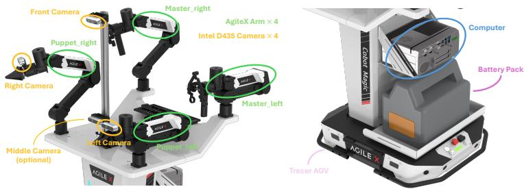
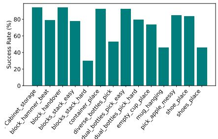

[Back to README](../README.md)

## 4. Benchmark

## 📌 预览

本节把上一节的生成管线落到一个真仿真对齐的双臂评测平台：ManiSkill3 物理引擎、COBOT Magic 四臂平台与多相机采集，每任务预收集 100 条仿真和 20 条真机数据。关键价值不只是“任务多”，而是用一致硬件/观测定义让 sim-to-real 对比可成立。

> 💡 **任务数量口径冲突（claude 批注）**: 正文和 Appendix A 都声称总计 **15** 个任务，但正文 Table 1 明确只评测 **14** 个，Appendix Table 5 也只列出 14 行任务。补充材料的 `Blocks Stack Hard` 可能是未纳入 Table 5 的第 15 个任务，但论文未显式解释这个口径差异。之后引用数据时应写“14 个正式评测任务，文中声称平台共 15 个”。

Based on the methods introduced in Sec. 3, we design a comprehensive benchmark called RoboTwin[57] to assess dual-arm robots, which includes 15 tasks in total. The underlying physics engine is ManiSkill3[69]. We employ the open-source Cobot Magic¶ platform as depicted in Fig. 4, which is equipped with four robot arms and four Intel RealSense D-435 RGBD cameras and is built on the Tracer chassis. These cameras are strategically positioned: one on the high part of the stand for an expansive field of view, two on the wrists of the robot’s arms, and one on the low part of the stand which is optional for use. The front, left, and right cameras capture data simultaneously at a frequency of 30Hz. We utilize ManiSkill [69], an open-source simulation platform with GPU-accelerated data collection built on SAPIEN [72]. The details of each task in RoboTwin can be found in Appendix A.

> 💡 **硬件与观测定义（claude 批注）**: 真机平台有四条机械臂（主/从、左/右）和 4 个 D435 RGB-D 相机，实际同步使用前/左/右视角，30 Hz。补充材料还给出 2D 输入为 320×240、3D 点云用 FPS 下采样到 1024 点。这些规格是复现 DP/DP3 对比时的必要条件。

  
Figure 4. Illustration of our robot platform, with the capabilities for teleopera tion and data acquisition.

  
Figure 5. Success rate of the generated code for RoboTwin benchmark.

> 💡 **Figure 4/5 批读（claude 批注）**: Figure 4 展示硬件与遥操数据采集设置；Figure 5 则是高层 LLM 代码管线的可执行性检验。但 Figure 5 只给最终成功率，没有拆出首次生成、自纠错后成功和人工介入的比例，所以“自动化程度”还不能从图中精确量化。

In RoboTwin benchmark, the agent needs to choose the appropriate collaboration method to successfully complete the task according to the distance of the target object from the left arm and the right arm. It involves the handover of the two arms, such as the handover task and putting the cup on the coaster, and the avoidance of interference between the two arms, such as the shoe placement task, which requires the two arms to coordinate with each other to place a pair of shoes in the limited space of the shoe box. The initial position and posture of the target objects in all our tasks are random. Before the scene is loaded, the mechanical dynamics accessibility of the randomly initialized scene will be checked to ensure that it is feasible. The task also includes objects of different shapes and appearances. The dual bottle pick task includes different models such as Coke bottles, Sprite bottles, and mineral water bottles, all of which are generated from 2D real pictures. The size of the objects in the environment is also randomized within a certain threshold. For each task, we provide well-designed script files that generate expert data across diverse scenarios, including various object placements and environmental conditions. We also report the success rate of generated code using our proposed method in Fig. 5, as described in Sec. 3.3.

> 💡 **难度来源（claude 批注）**: 随机化覆盖物体初始位姿、外观/形状和一定范围内的尺寸，场景载入前先做机械可达性检查。真正区分单臂和双臂难度的，是是否需要交接、两臂交替及限制空间内的互避，而不只是两臂同时动。这预示了后文 `Dual Shoes Place` 会成为显著难点。

For each task in our benchmark, we have pre-collected 100 sets of simulation data and 20 sets of real-world data. The hardware setup for the real-world experiments strictly matches that of the simulation environment. In both the simulation and real-world datasets, each captured frame consists of three images from the cameras, each providing an RGB and depth image. We also provide the point cloud data transformed from depth image, and colored point cloud data transformed from RGB and depth image for different types of algorithm evaluation. Additionally, the data includes the poses of the robotic arms’ joints and endeffectors for both master and slave configurations, encompassing both left and right arms.

> 💡 **数据包含什么（claude 批注）**: 每帧不只有图像：三视角 RGB+深度、由深度生成的 XYZ 点云、RGB-D 生成的彩色点云，以及左/右、主/从机械臂的关节和末端位姿。这使同一数据集可对照 2D DP、3D DP3(XYZ) 和 DP3(XYZ+RGB)，但也要注意：“预收集 100 sim/20 real”是平台默认量，真机迁移实验另外使用 300 sim+20 real。

> 💡 **Q&A 批注记录（claude 批注）**:
> - **Q：这个 benchmark 如何对齐真机与仿真？** A：保持机器人平台、相机视角和观测定义尽量一致，再在相同任务上提供 sim 与 real 演示。
> - **Q：为什么不能简单说它有 15 个评测任务？** A：论文口头数据为 15，但正式表格与实验均只明示 14，需保留这一口径冲突。

## 🔖 Section 总结

- 平台以 ManiSkill3/SAPIEN 为仿真底座，真机使用 COBOT Magic + 多 D435，三路相机 30 Hz 同步采集。
- 默认每任务 100 条仿真+20 条真机演示，同时提供 RGB、深度、点云与双臂状态。
- 双臂任务的核心挑战是交接与互避；项目声称 15 任务，但论文明示评测/列表均为 14。

