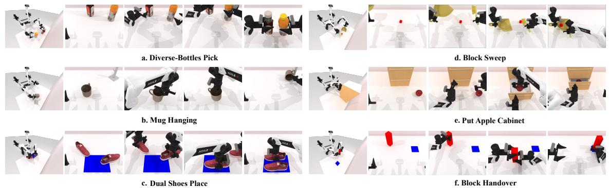
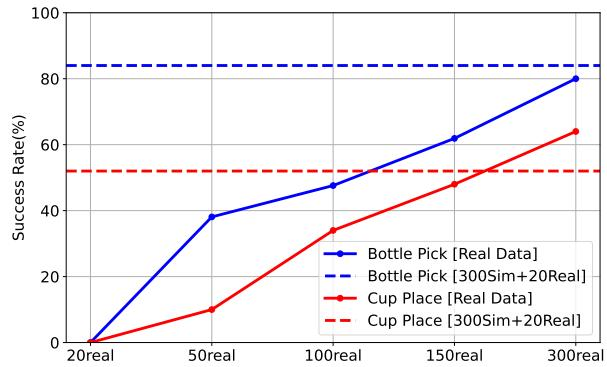
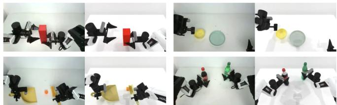

[Back to README](../README.md)

## 5. Experiment on RoboTwin Benchmark

## 📌 预览

实验回答两个问题：①在 14 个仿真任务上，2D Diffusion Policy、3D DP3(XYZ) 和 DP3(XYZ+RGB) 如何随 20/50/100 条专家演示缩放；②先用 300 条 RoboTwin 仿真数据预训练、再用 20 条真机数据微调，是否优于只用 20 条真机数据。结果不支持“某一种表示一直最好”：3D 有小样本优势，2D DP 可在大数据下追上，RGB+点云融合则对任务高度敏感。

> 💡 **阅读 MinerU 版面的注意事项（claude 批注）**: PDF 双栏排版使 §5.2 的一段原文被图表打断：`merely 20 demonstrations...` 和 `mance with limited data...` 原本应连接成“DP3 在 20 条时强，但扩展性有限；DP 小样本弱，随数据增加明显改善”。本文件保留 MinerU 原文顺序，批注按语义恢复，不擅自删改论文文字。

## 5.1. Baselines and Experimental Setup

Diffusion Policy is a generative model for robotic imitation learning that models the distribution of potential actions to create diverse and complex action sequences. The approach has evolved into two main variants based on input dimensionality: The 2D Diffusion Policy [14] processes two-dimensional visual information like images and video frames to predict actions for robotic manipulation tasks. While effective for many applications, this approach may have limitations in tasks requiring depth perception and spatial reasoning. The 3D Diffusion Policy (DP3)[73] addresses these limitations by incorporating three-dimensional visual representations through point clouds. By using efficient point encoders to create compact 3D representations, DP3 enhances spatial awareness and demonstrates improved performance in tasks requiring complex spatial understanding.

We evaluated both 3D (DP3, w & w/o color) and 2D (DP) input imitation learning methods across 14 benchmark tasks, as shown in Fig. 6, tailoring our assessment approach to each model’s characteristics using 20, 50, 100 expert demonstrations. The success rate is determined by satisfying the target pose constraints after execution completion and achieving collision-free trajectory execution throughout the task.

> 💡 **对比设计（claude 批注）**: 这里的 baseline 都是模仿学习，不是语言条件 VLA。DP 看 2D 图像，DP3 分别看纯 XYZ 点云和 XYZ+RGB 彩色点云；每个设置用 3 个随机种子报告成功率，数据量梯度为 20/50/100。成功同时需求末态达标和全轨迹无碰，因而不是只看最终物体位置。

## 5.2. Experimental Results

As shown in Table 1, the experimental results reveal distinct performance patterns across different imitation learning methods. DP3 demonstrates superior few-shot learning capabilities, achieving remarkable performance with mance with limited data, likely due to insufficient geometric priors, but demonstrates significant scalability as training samples increase. With 100 demonstrations, DP outperforms DP3 in several tasks, significantly improving from 1. 7% to 85.7% in the Dual Bottles Pick (Easy) task. This indicates superior learning capabilities with larger datasets. The integration of RGB data with point cloud representations yields inconsistent benefits, highlighting a fundamental limitation in current bimanual manipulation approaches. While DP3(XYZ+RGB) shows dramatic improvements in cluttered environments such as Pick Apple Messy, it simultaneously exhibits performance degradation in some other tasks like Container Place. This indicates that better fusion representations of RGB semantic information and point cloud 3D information need to be developed (see more results in Appendix Table 4).

  
Figure 6. Examples of task execution in the RoboTwin benchmark.

<table><tr><td>Number of Demonstrations</td><td>20</td><td>50</td><td>100</td><td></td><td>20</td><td>50</td><td>100</td></tr><tr><td>Block Hammer Beat</td><td></td><td></td><td></td><td>Block Handover</td><td></td><td></td><td></td></tr><tr><td>DP3 (XYZ)</td><td> $5 5 . 7 \pm 8 . 5$ </td><td> $6 4 . 7 \pm 1 0 . 1$ </td><td> $5 5 . 7 \pm 0 . 6$ </td><td>DP3 (XYZ)</td><td> $8 9 . 0 \pm 2 . 6$ </td><td> $8 4 . 3 \pm 9 . 1$ </td><td> $7 7 . 3 \pm 1 1 . 6$ </td></tr><tr><td>DP3 (XYZ+RGB)</td><td> $4 7 . 7 \pm 4 . 0$ </td><td> $7 9 . 3 \pm 3 . 8$ </td><td> $8 2 . 0 \pm 6 . 6$ </td><td>DP3 (XYZ+RGB)</td><td> $8 6 . 0 \pm 1 . 0$ </td><td> $9 4 . 0 \pm 0 . 0$ </td><td> $8 5 . 3 \pm 1 4 . 5$ </td></tr><tr><td>DP</td><td> $0 . 0 \pm 0 . 0$ </td><td> $0 . 0 \pm 0 . 0$ </td><td> $0 . 0 \pm 0 . 0$ </td><td>DP</td><td> $0 . 0 \pm 0 . 0$ </td><td> $1 2 . 0 \pm 5 . 0$ </td><td> $7 6 . 0 \pm 1 6 . 1$ </td></tr><tr><td>Bottle Adjust</td><td></td><td></td><td></td><td>Container Place</td><td></td><td></td><td></td></tr><tr><td>DP3 (XYZ)</td><td> $6 4 . 7 \pm 1 0 . 8$ </td><td> $7 1 . 7 \pm 1 3 . 8$ </td><td> $7 3 . 3 \pm 1 2 . 5$ </td><td>DP3 (XYZ)</td><td> $5 2 . 7 \pm 5 . 0$ </td><td> $7 7 . 7 \pm 2 . 5$ </td><td> $8 5 . 3 \pm 3 . 2$ </td></tr><tr><td>DP3 (XYZ+RGB)</td><td> $2 5 . 0 \pm 5 . 0$ </td><td> $3 6 . 0 \pm 8 . 5$ </td><td> $4 2 . 0 \pm 7 . 0$ </td><td>DP3 (XYZ+RGB)</td><td> $3 7 . 3 \pm 2 . 1$ </td><td> $5 1 . 3 \pm 7 . 1$ </td><td> $6 2 . 3 \pm 6 . 8$ </td></tr><tr><td>DP</td><td> $6 . 3 \pm 5 . 9$ </td><td> $3 3 . 7 \pm 9 . 0$ </td><td> $3 5 . 7 \pm 2 . 9$ </td><td>DP</td><td> $1 . 7 \pm 0 . 6$ </td><td> $8 . 0 \pm 1 . 7$ </td><td> $1 4 . 0 \pm 6 . 9$ </td></tr><tr><td>Empty Cup Place</td><td></td><td></td><td></td><td>Mug Hanging (Easy)</td><td></td><td></td><td></td></tr><tr><td>DP3 (XYZ)</td><td> $3 3 . 7 \pm 4 . 2$ </td><td> $7 1 . 3 \pm 4 . 0$ </td><td> $6 1 . 7 \pm 1 3 . 1$ </td><td>DP3 (XYZ)</td><td> $7 . 3 \pm 3 . 2$ </td><td> $1 4 . 0 \pm 3 . 6$ </td><td> $1 5 . 3 \pm 4 . 0$ </td></tr><tr><td>DP3 (XYZ+RGB)</td><td> $2 3 . 7 \pm 5 . 5$ </td><td> $6 8 . 0 \pm 7 . 5$ </td><td> $8 1 . 0 \pm 2 . 6$ </td><td>DP3 (XYZ+RGB)</td><td> $4 . 3 \pm 3 . 1$  </td><td> $1 . 7 \pm 1 . 5$ </td><td> $3 . 0 \pm 1 . 0$ </td></tr><tr><td>DP</td><td> $0 . 0 \pm 0 . 0$ </td><td> $2 5 . 0 \pm 2 . 6$ </td><td> $8 7 . 7 \pm 0 . 6$ </td><td>DP</td><td> $0 . 0 \pm 0 . 0$ </td><td> $0 . 0 \pm 0 . 0$ </td><td> $0 . 0 \pm 0 . 0$ </td></tr><tr><td>Mug Hanging (Hard)</td><td></td><td></td><td></td><td>Pick Apple Messy</td><td></td><td></td><td></td></tr><tr><td>DP3 (XYZ)</td><td> $4 . 0 \pm 1 . 7$ </td><td> $1 0 . 7 \pm 3 . 1$ </td><td> $1 5 . 3 \pm 5 . 5$ </td><td>DP3 (XYZ)</td><td> $4 . 0 \pm 1 . 7$ </td><td>一  $1 2 . 7 \pm 5 . 5$ </td><td> $9 . 7 \pm 2 . 1$ </td></tr><tr><td>DP3 (XYZ+RGB)</td><td> $0 . 0 \pm 0 . 0$ </td><td> $1 . 7 \pm 1 . 2$ </td><td> $2 . 3 \pm 2 . 5$ </td><td>DP3 (XYZ+RGB)</td><td> $6 . 0 \pm 2 . 6$ </td><td> $3 1 . 0 \pm 7 . 5$ </td><td> $5 4 . 0 \pm 1 2 . 8$ </td></tr><tr><td>DP</td><td> $0 . 0 \pm 0 . 0$ </td><td> $0 . 0 \pm 0 . 0$ </td><td> $0 . 0 \pm 0 . 0$ </td><td>DP</td><td> $5 . 3 \pm 2 . 5$ </td><td> $1 6 . 7 \pm { 1 . 5 }$ </td><td> $2 9 . 3 \pm 5 . 0$ </td></tr><tr><td>Put Apple Cabinet</td><td></td><td></td><td></td><td>Dual Bottles Pick (Easy)</td><td></td><td></td><td></td></tr><tr><td>DP3 (XYZ)</td><td> $5 0 . 0 \pm 3 8 . 2$ </td><td> $7 3 . 3 \pm 9 . 2$ </td><td> $6 6 . 3 \pm 2 2 . 3$ </td><td>DP3 (XYZ)</td><td> $4 0 . 3 \pm 8 . 0$ </td><td>一  $7 4 . 7 \pm 2 . 9$ </td><td> $5 5 . 3 \pm 1 1 . 5$ </td></tr><tr><td>DP3 (XYZ+RGB)</td><td> $5 3 . 7 \pm 1 4 . 2$ </td><td> $5 4 . 3 \pm 1 7 . 4$ </td><td> $7 8 . 3 \pm 3 . 8$ </td><td>DP3 (XYZ+RGB)</td><td> $3 6 . 7 \pm 5 . 9$ </td><td> $7 4 . 7 \pm 5 . 5$ </td><td> $7 5 . 7 \pm 1 7$ </td></tr><tr><td>DP</td><td> $0 . 0 \pm 0 . 0$ </td><td> $0 . 0 \pm 0 . 0$ </td><td> $8 . 0 \pm 1 2 . 2$ </td><td>DP</td><td> $1 . 7 \pm 0 . 6$ </td><td> $3 8 . 3 \pm 6 . 7$ </td><td> $8 5 . 7 \pm 6 . 7$ </td></tr><tr><td>Dual Bottles Pick (Hard)</td><td></td><td></td><td></td><td>Diverse Bottles Pick</td><td></td><td></td><td></td></tr><tr><td>DP3 (XYZ)</td><td> $3 1 . 7 \pm 9 . 0$ </td><td> $4 8 . 0 \pm 7 . 9$ </td><td> $5 8 . 0 \pm 3 . 0$ </td><td>DP3 (XYZ)</td><td> $1 1 . 3 \pm 2 . 1$ </td><td> $3 2 . 3 \pm 1 0 . 1$ </td><td> $3 7 . 0 \pm 1 0 . 0$ </td></tr><tr><td>DP3 (XYZ+RGB)</td><td> $2 8 . 0 \pm 4 . 4$ </td><td> $4 7 . 3 \pm 4 . 2$ </td><td> $5 5 . 7 \pm 4 . 9$ </td><td>DP3 (XYZ+RGB)</td><td> $2 . 0 \pm 1 . 0$ </td><td> $7 . 7 \pm 4 . 0$ </td><td> $1 4 . 7 \pm 4 . 7$ </td></tr><tr><td>DP</td><td> $8 . 0 \pm 2 . 0$ </td><td> $3 9 . 3 \pm 4 . 0$ </td><td> $5 9 . 3 \pm 5 . 5$ </td><td>DP</td><td> $0 . 7 \pm 0 . 6$ </td><td> $0 . 3 \pm 0 . 6$ </td><td> $1 2 . 0 \pm 5 . 3$ </td></tr><tr><td>Shoe Place</td><td></td><td></td><td></td><td>Dual Shoes Place</td><td></td><td></td><td></td></tr><tr><td>DP3 (XYZ)</td><td> $3 8 . 0 \pm 1 1 . 5$ </td><td> $5 9 . 3 \pm 7 . 4$ </td><td> $5 4 . 3 \pm 0 . 6$ </td><td>DP3 (XYZ)</td><td> $4 . 0 \pm 1 . 0$ </td><td> $7 . 7 \pm 2 . 1$ </td><td> $1 2 . 0 \pm 1 . 7$ </td></tr><tr><td>DP3 (XYZ+RGB)</td><td> $1 4 . 0 \pm 2 . 6$ </td><td>一  $4 4 . 3 \pm 2 . 9$ </td><td> $5 4 . 0 \pm 1 1 . 5$ </td><td>DP3 (XYZ+RGB)</td><td> $1 . 7 \pm 1 . 5$ </td><td> $3 . 3 \pm 0 . 6$ </td><td> $6 . 0 \pm 1 . 0$ </td></tr><tr><td>DP</td><td> $3 . 0 \pm 1 . 2$ </td><td> $4 . 3 \pm 3 . 2$ </td><td> $3 3 . 0 \pm 1 5 . 8$ </td><td>DP</td><td> $0 . 0 \pm 0 . 0$ </td><td> $1 . 7 \pm 1 . 2$ </td><td> $3 . 0 \pm 1 . 0$ </td></tr></table>

Table 1. Benchmarking imitation learning algorithms for dual-arm manipulation under D435 camera setting. We tested on 14 tasks with 20, 50, and 100 expert demonstrations on DP3 (XYZ), DP3 (XYZ+RGB), and DP with 3 seeds and reported the success rate.

> 💡 **Table 1 关键结论（claude 批注）**: 小数据时 DP3 通常更有竞争力，但随演示增加不一定单调上升；2D DP 在 `Dual Bottles Pick (Easy)` 从 20 条时 **1.7%** 上升到 100 条时 **85.7%**，是数据规模改变方法排名的典型。而 `Dual Shoes Place` 各方法/数据量都低于 15%，`Mug Hanging (Hard)` 最高也只有 15.3%，说明交接、精密对齐与双臂互避仍是硬难点。

> 💡 **多模态融合不稳定（claude 批注）**: DP3(XYZ+RGB) 在 `Pick Apple Messy` 这类需要语义辨别的杂乱场景里可明显改善，但在 `Container Place` 等任务又退化。这不能解读成“颜色无用”，更准确的结论是当前的 RGB 语义与 3D 几何融合机制不稳定，尚未保证“加一个模态就不降性能”。

  
Figure 7. Comparison on scaling up real and simulation data.

> 💡 **Figure 7 批读（claude 批注）**: 这张图用于选择 300 条仿真数据作为预训练规模。作者观察到 `300 sim + 20 real` 在单臂 bottle pick 和双臂 cup placement 上可达到与 `300 real` 相近的水平。这是“仿真可替代大量真机采集”的经验证据，但只在两个任务上用于选参，不应外推为所有任务的普遍等价。

merely 20 demonstrations. However, its performance exhibits limited scalability, with minimal improvements or even decreases as training data expands to 100 samples. Conversely, the DP algorithm shows poor initial perfor-

  
Figure 8. Visualization of Real Scene and Simulation Scene. More details can be found in Appendix Fig. 9.

<table><tr><td></td><td colspan="2">Success Rates</td></tr><tr><td>Task</td><td>20 real</td><td>300Sim+20Real</td></tr><tr><td>Bottle Pick (Easy)</td><td>0/50</td><td>42/50</td></tr><tr><td>Bottle Pick (Hard)</td><td>0/50</td><td>16/50</td></tr><tr><td>Container Place</td><td>0/50</td><td>49/50</td></tr><tr><td>Cup Place</td><td>1/50</td><td>39/50</td></tr><tr><td>Hammer Beat</td><td>2/50</td><td>37/50</td></tr><tr><td>Average</td><td>1.2%</td><td>72%</td></tr></table>

Table 2. Real world evaluation with a single arm.

> 💡 **Table 2 单臂 sim-to-real（claude 批注）**: 仅 20 条真机数据的 5 任务平均为 **1.2%**，`300Sim+20Real` 为 **72%**，改善是 **+70.8 个绝对百分点**。原文后面写“72% improvement”容易让人误解为相对增幅；从表格看，正确的差值口径是 72%-1.2%=70.8 个百分点。

Experimental results show significant performance variation based on coordination complexity. Simple operations like Dual Bottles Pick achieved high success rates (85.7% with DP at 100 demonstrations), while tasks requiring complex bimanual coordination, such as Dual Shoes Place, performed poorly (below 15% success across all methods). Notably, tasks demanding complex dual-arm coordination significantly underperformed compared to those where robot arms could operate more independently, with arm selection based primarily on proximity to target objects. This highlights the current limitations in dual-arm coordination within imitation learning algorithms.

## 5.3. Real World Experiment

To validate the effectiveness of RoboTwin-generated training data in real-world policy deployment, we conducted comprehensive experiments on both single-arm and dualarm manipulation tasks, as shown in Fig. 8. We conducted a comparative experiment between policies trained solely on 20 real-world datasets and those pre-trained on 300 simulation datasets before fine-tuning on 20 real-world datasets (see more details and results in Appendix B).

The selection of 300 simulation datasets as our hyperparameter was based on empirical evidence shown in Fig. 7. Through progressive scaling of real-world data, we found that combining 300 simulation datasets with 20 real-world datasets yielded comparable performance than using 300 real-world datasets alone for both single-arm bottle pick and dual-arm cup placement tasks.

> 💡 **公平对比的关键（claude 批注）**: 两组都有相同的 20 条真机微调数据，差异是是否先见过 300 条仿真演示。这个设计支持“仿真预训练提供了可迁移先验”，但不能将增益全部归于视觉外观保真，因为轨迹多样性、初始位姿随机化和动力学扰动同时在发挥作用。

To investigate the performance disparity between baseline algorithms in single-arm versus dual-arm tasks, we conducted sim-to-real transfer experiments for both task categories. Each task underwent 50 test trials with randomized initial configurations, including varying object positions and orientations, as well as robot arm placements within predetermined boundaries. As shown in Table 2 and Table 3, experimental results revealed that policies trained on the combined dataset achieved markedly superior performance in real-world testing scenarios. Specifically, the integration of simulation data yielded a 72% improvement in success rates for single-arm tasks compared to policies trained exclusively on real-world data. For the more complex dual-arm tasks, we observed a significant improvement of over 40% in success rates. Our findings validate the effectiveness of our benchmark and data generation approach in bridging the sim-to-real gap, suggesting a promising direction for developing more robust and generalizable policies for dual-arm robotic manipulation tasks.

> 💡 **统计表述校正（claude 批注）**: 本段的“72%”与“over 40%”是作者的口头说法；严格依表格，单臂是 **1.2%→72%（+70.8 百分点）**，双臂是 **20%→62%（+42 百分点）**。整数百分比的“改善”只能当作绝对成功率差的近似表述，不能当作相对增幅。

<table><tr><td></td><td colspan="2">Success Rates</td></tr><tr><td>Task</td><td>20 real</td><td>300Sim+20Real</td></tr><tr><td>Dual bottle Pick (Easy)</td><td>0/50</td><td>31/50</td></tr><tr><td>Dual bottle Pick (Hard)</td><td>0/50</td><td>11/50</td></tr><tr><td>Container Place</td><td>25/50</td><td>44/50</td></tr><tr><td>Cup Place</td><td>0/50</td><td>26/50</td></tr><tr><td>Sweep Ball</td><td>25/50</td><td>43/50</td></tr><tr><td>Average</td><td>20%</td><td>62%</td></tr></table>

Table 3. Real world evaluation with dual arms.

> 💡 **Table 3 双臂 sim-to-real（claude 批注）**: 平均成功率从 **20%** 上升到 **62%**，即 **+42 个绝对百分点**。平均值背后差异很大：`Container Place` 本来就有 25/50，增至 44/50；`Dual Bottle Pick (Hard)` 从 0/50 仅增至 11/50。所以仿真预训练能打破“全失败”，但还没有解决复杂初始状态下的稳定协调。

We observed significant disparities between single-arm and dual-arm scenarios. In the bottle rearrangement task, dual-arm operations presented substantially greater challenges, primarily due to the diverse initial states of target bottles (upright or lying down). While the incorporation of simulation data enabled the policy to achieve non-zero success rates, the overall performance remained suboptimal. This underscores the pressing need for developing more effective imitation learning algorithms specifically tailored to dual-arm coordination tasks.

> 💡 **Q&A 批注记录（claude 批注）**:
> - **Q：论文最强的因果证据是什么？** A：相同 20 条真机微调数据下，加上 300 条仿真预训练后，单臂/双臂平均成功率分别增加 70.8/42 个百分点。
> - **Q：3D 策略是否一定优于 2D？** A：不是。DP3 小样本往往更强，但 DP 可随 100 条演示大幅提升并在多个任务超过 DP3。
> - **Q：下一步应该优化数据还是算法？** A：两者都需要；数据已能显著改善迁移，但双臂互避/交接任务仍全面低迷，表明策略架构和多模态融合也是瓶颈。

## 🔖 Section 总结

- DP3 表现出小样本 3D 先验，DP 则更能从大量演示中缩放；RGB+点云的收益不稳定。
- 简单双臂拾取可达 85.7%，但 `Dual Shoes Place` 全部低于 15%，显示协调难度仍未解决。
- 300 sim + 20 real 对比 20 real，单臂为 1.2%→72%（+70.8 百分点），双臂为 20%→62%（+42 百分点）。
- 这些结果支持 RoboTwin 作为数据/迁移基础设施的价值，不等价于已解决通用 VLA 或高难双臂控制。

