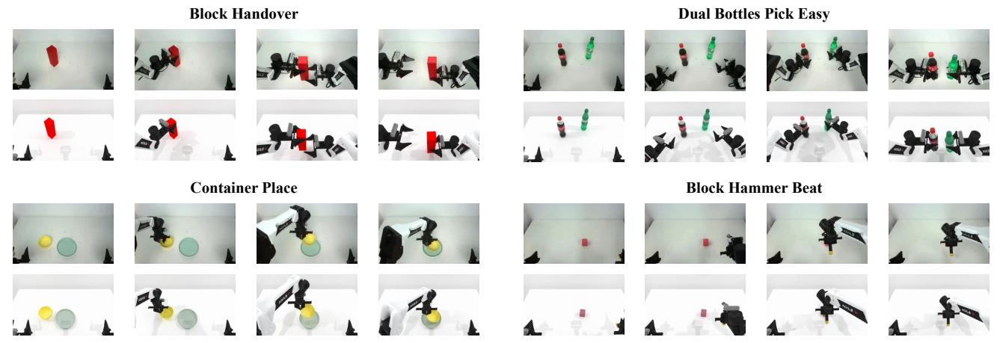

[Back to README](../README.md)

## References

## 📌 预览

本文件保留论文全部 76 条参考文献与补充材料，包括任务描述、DP/DP3 训练参数、sim-to-real 微调步骤、LLM prompt/API 和 `Blocks Stack Hard` 样例代码。它是复现 RoboTwin 时最有价值的细节索引，也暴露了正文统计口径与自动生成接口的边界。

> 💡 **文献谱系（claude 批注）**: 参考文献可分为四条主线：① ALOHA/ALOHA2、Open-TeleVision、BiGym 等真机遥操与双臂平台；② ManiSkill、MimicGen、RoboCasa 等仿真数据/基准；③ Diffusion Policy 与 DP3 等策略学习；④ GPT-4V、Code as Policies、RoboScript/RoboCodeX、ReKep 等视觉语言与代码生成。RoboTwin 的新意正是把这四条链接成一个可产数据、可评测、可迁移的系统。

[1] Gpt-4v(ision) system card. 2023. 3

[2] Michael Ahn, Anthony Brohan, Noah Brown, Yevgen Chebotar, Omar Cortes, Byron David, Chelsea Finn, Keerthana Gopalakrishnan, Karol Hausman, Alex Herzog, et al. Do as i can, not as i say: Grounding language in robotic affordances. arXiv preprint arXiv:2204.01691, 2022. 2

[3] Anurag Ajay, Yilun Du, Abhi Gupta, Joshua B Tenenbaum, Tommi S Jaakkola, and Pulkit Agrawal. Is conditional generative modeling all you need for decision making? In The Eleventh International Conference on Learning Representations, 2023. 3

[4] Jorge Aldaco, Travis Armstrong, Robert Baruch, Jeff Bingham, Sanky Chan, Kenneth Draper, Debidatta Dwibedi, Chelsea Finn, Pete Florence, Spencer Goodrich, et al. Aloha 2: An enhanced low-cost hardware for bimanual teleoperation. arXiv preprint arXiv:2405.02292, 2024. 1

[5] Shikhar Bahl, Russell Mendonca, Lili Chen, Unnat Jain, and Deepak Pathak. Affordances from human videos as a versatile representation for robotics. In Proceedings of the IEEE/CVF Conference on Computer Vision and Pattern Recognition, pages 13778–13790, 2023. 3

[6] Anthony Brohan, Noah Brown, Justice Carbajal, Yevgen Chebotar, Joseph Dabis, Chelsea Finn, Keerthana Gopalakrishnan, Karol Hausman, Alex Herzog, Jasmine Hsu, et al. Rt-1: Robotics transformer for real-world control at scale. arXiv preprint arXiv:2212.06817, 2022. 3

[7] Anthony Brohan, Noah Brown, Justice Carbajal, Yevgen Chebotar, Joseph Dabis, Chelsea Finn, Keerthana Gopalakrishnan, Karol Hausman, Alex Herzog, Jasmine Hsu, et al. RT-1: Robotics transformer for real-world control at scale. In arXiv preprint arXiv:2212.06817, 2022. 2, 3

[8] Yevgen Chebotar, Quan Vuong, Karol Hausman, Fei Xia, Yao Lu, Alex Irpan, Aviral Kumar, Tianhe Yu, Alexander Herzog, Karl Pertsch, et al. Q-transformer: Scalable offline reinforcement learning via autoregressive q-functions. In Conference on Robot Learning, pages 3909–3928. PMLR, 2023. 3

[9] Guanyan Chen, Meiling Wang, Yao Mu Te Cui, Haoyang Lu, Tianxing Zhou, Zicai Peng, Mengxiao Hu, Haizhou Li, Yuan Li, Yi Yang, et al. Vlmimic: Vision language models are visual imitation learner for fine-grained actions. arXiv preprint arXiv:2410.20927, 2024. 3

[10] Junting Chen, Yao Mu, Qiaojun Yu, Tianming Wei, Silang Wu, Zhecheng Yuan, Zhixuan Liang, Chao Yang, Kaipeng

Zhang, Wenqi Shao, et al. Roboscript: Code generation for free-form manipulation tasks across real and simulation. arXiv preprint arXiv:2402.14623, 2024. 3

[11] Tianxing Chen, Yao Mu, Zhixuan Liang, Zanxin Chen, Shijia Peng, Qiangyu Chen, Mingkun Xu, Ruizhen Hu, Hongyuan Zhang, Xuelong Li, et al. G3flow: Generative 3d semantic flow for pose-aware and generalizable object ma nipulation. arXiv preprint arXiv:2411.18369, 2024. 3

[12] Xuxin Cheng, Jialong Li, Shiqi Yang, Ge Yang, and Xiaolong Wang. Open-television: Teleoperation with immersive active visual feedback. arXiv preprint arXiv:2407.01512, 2024. 1

[13] Nikita Chernyadev, Nicholas Backshall, Xiao Ma, Yunfan Lu, Younggyo Seo, and Stephen James. Bigym: A demodriven mobile bi-manual manipulation benchmark. arXiv preprint arXiv:2407.07788, 2024. 2

[14] Cheng Chi, Siyuan Feng, Yilun Du, Zhenjia Xu, Eric Cousineau, Benjamin Burchfiel, and Shuran Song. Diffu sion policy: Visuomotor policy learning via action diffusion. arXiv preprint arXiv:2303.04137, 2023. 3, 6, 1, 4

[15] Murtaza Dalal, Ajay Mandlekar, Caelan Garrett, Ankur Handa, Ruslan Salakhutdinov, and Dieter Fox. Imitating task and motion planning with visuomotor transformers. arXiv preprint arXiv:2305.16309, 2023. 1, 2, 3

[16] Runyu Ding, Yuzhe Qin, Jiyue Zhu, Chengzhe Jia, Shiq Yang, Ruihan Yang, Xiaojuan Qi, and Xiaolong Wang. Bunny-visionpro: Real-time bimanual dexterous teleopera tion for imitation learning. arXiv preprint arXiv:2407.03162, 2024. 1

[17] Danny Driess, Fei Xia, Mehdi SM Sajjadi, Corey Lynch, Aakanksha Chowdhery, Brian Ichter, Ayzaan Wahid, Jonathan Tompson, Quan Vuong, Tianhe Yu, et al. Palm-e: An embodied multimodal language model. In International Conference on Machine Learning, pages 8469–8488. PMLR, 2023. 3

[18] Frederik Ebert, Yanlai Yang, Karl Schmeckpeper, Bernadette Bucher, Georgios Georgakis, Kostas Daniilidis, Chelsea Finn, and Sergey Levine. Bridge data: Boosting generalization of robotic skills with cross-domain datasets. arXiv preprint arXiv:2109.13396, 2021. 1, 2, 3

[19] Yankai Fu, Qiuxuan Feng, Ning Chen, Zichen Zhou, Mengzhen Liu, Mingdong Wu, Tianxing Chen, Shanyu Rong, Jiaming Liu, Hao Dong, and Shanghang Zhang. Cord vip: Correspondence-based visuomotor policy for dexterous manipulation in real-world, 2025. 3

[20] Zipeng Fu, Tony Z Zhao, and Chelsea Finn. Mobile aloha: Learning bimanual mobile manipulation with low-cost whole-body teleoperation. arXiv preprint arXiv:2401.02117, 2024. 1

[21] Zeyu Gao, Yao Mu, Jinye Qu, Mengkang Hu, Lingyue Guo, Ping Luo, and Yanfeng Lu. Dag-plan: Generating directed acyclic dependency graphs for dual-arm cooperative plan ning. arXiv preprint arXiv:2406.09953, 2024. 3

[22] Markus Grotz, Mohit Shridhar, Tamim Asfour, and Dieter Fox. Peract2: Benchmarking and learning for robotic bimanual manipulation tasks, 2024. 2

[23] Jiayuan Gu, Fanbo Xiang, Xuanlin Li, Zhan Ling, Xiqiang Liu, Tongzhou Mu, Yihe Tang, Stone Tao, Xinyue Wei,

Yunchao Yao, et al. Maniskill2: A unified benchmark for generalizable manipulation skills. arXiv preprint arXiv:2302.04659, 2023. 1, 2

[24] Nico Gurtler, Sebastian Blaes, Pavel Kolev, Felix Wid-¨ maier, Manuel Wuthrich, Stefan Bauer, Bernhard Sch¨ olkopf,¨ and Georg Martius. Benchmarking offline reinforcement learning on real-robot hardware. arXiv preprint arXiv:2307.15690, 2023. 3

[25] Mengkang Hu, Yao Mu, Xinmiao Yu, Mingyu Ding, Shiguang Wu, Wenqi Shao, Qiguang Chen, Bin Wang, Yu Qiao, and Ping Luo. Tree-planner: Efficient close-loop task planning with large language models. arXiv preprint arXiv:2310.08582, 2023. 3

[26] Yingdong Hu, Fanqi Lin, Tong Zhang, Li Yi, and Yang Gao. Look before you leap: Unveiling the power of gpt-4v in robotic vision-language planning. arXiv preprint arXiv:2311.17842, 2023.

[27] Haoxu Huang, Fanqi Lin, Yingdong Hu, Shengjie Wang, and Yang Gao. Copa: General robotic manipulation through spatial constraints of parts with foundation models. arXiv preprint arXiv:2403.08248, 2024.

[28] Wenlong Huang, Chen Wang, Ruohan Zhang, Yunzhu Li, Jiajun Wu, and Li Fei-Fei. Voxposer: Composable 3d value maps for robotic manipulation with language models. arXiv preprint arXiv:2307.05973, 2023.

[29] Wenlong Huang, Chen Wang, Yunzhu Li, Ruohan Zhang, and Li Fei-Fei. Rekep: Spatio-temporal reasoning of relational keypoint constraints for robotic manipulation. arXiv preprint arXiv:2409.01652, 2024. 3

[30] Stephen James, Zicong Ma, David Rovick Arrojo, and Andrew J Davison. Rlbench: The robot learning benchmark & learning environment. IEEE Robotics and Automation Letters, 5(2):3019–3026, 2020. 2

[31] Eric Jang, Alex Irpan, Mohi Khansari, Daniel Kappler, Frederik Ebert, Corey Lynch, Sergey Levine, and Chelsea Finn. Bc-z: Zero-shot task generalization with robotic imitation learning. In Conference on Robot Learning, 2021. 1, 2, 3

[32] Eric Jang, Alex Irpan, Mohi Khansari, Daniel Kappler, Frederik Ebert, Corey Lynch, Sergey Levine, and Chelsea Finn. Bc-z: Zero-shot task generalization with robotic imitation learning. In Conference on Robot Learning, pages 991– 1002. PMLR, 2022. 3

[33] Michael Janner, Yilun Du, Joshua B Tenenbaum, and Sergey Levine. Planning with diffusion for flexible behavior synthesis. arXiv preprint arXiv:2205.09991, 2022. 3

[34] Yunfan Jiang, Agrim Gupta, Zichen Zhang, Guanzhi Wang, Yongqiang Dou, Yanjun Chen, Li Fei-Fei, Anima Anandkumar, Yuke Zhu, and Linxi Fan. Vima: General robot manipulation with multimodal prompts. In International Conference on Machine Learning, 2023. 1, 2, 3

[35] Yuanchen Ju, Kaizhe Hu, Guowei Zhang, Gu Zhang, Mingrun Jiang, and Huazhe Xu. Robo-abc: Affordance generalization beyond categories via semantic correspondence for robot manipulation. arXiv preprint arXiv:2401.07487, 2024. 4

[36] Dmitry Kalashnikov, Jacob Varley, Yevgen Chebotar, Benjamin Swanson, Rico Jonschkowski, Chelsea Finn, Sergey

Levine, and Karol Hausman. Mt-opt: Continuous multitask robotic reinforcement learning at scale. arXiv preprint arXiv:2104.08212, 2021. 3

[37] Aviral Kumar, Anikait Singh, Stephen Tian, Chelsea Finn, and Sergey Levine. A workflow for offline model-free robotic reinforcement learning. arXiv preprint arXiv:2109.10813, 2021.

[38] Aviral Kumar, Anikait Singh, Frederik Ebert, Mitsuhiko Nakamoto, Yanlai Yang, Chelsea Finn, and Sergey Levine. Pre-training for robots: Offline rl enables learning new tasks from a handful of trials. arXiv preprint arXiv:2210.05178, 2022.

[39] Sergey Levine, Aviral Kumar, George Tucker, and Justin Fu. Offline reinforcement learning: Tutorial, review, and perspectives on open problems. arXiv preprint arXiv:2005.01643, 2020. 3

[40] Gang Li, Gilles Baechler, Manuel Tragut, and Yang Li. Learning to denoise raw mobile ui layouts for improving datasets at scale. In Proceedings of the 2022 CHI Confer ence on Human Factors in Computing Systems, pages 1–13, 2022. 4

[41] Jacky Liang, Wenlong Huang, Fei Xia, Peng Xu, Karol Hausman, Brian Ichter, Pete Florence, and Andy Zeng. Code as policies: Language model programs for embodied control. In 2023 IEEE International Conference on Robotics and Au tomation (ICRA), pages 9493–9500. IEEE, 2023. 3

[42] Zhixuan Liang, Yao Mu, Yixiao Wang, Tianxing Chen, Wenqi Shao, Wei Zhan, Masayoshi Tomizuka, Ping Luo, and Mingyu Ding. Dexhanddiff: Interaction-aware diffusion planning for adaptive dexterous manipulation. 3

[43] Zhixuan Liang, Yao Mu, Mingyu Ding, Fei Ni, Masayoshi Tomizuka, and Ping Luo. Adaptdiffuser: Diffusion mod els as adaptive self-evolving planners. In International Conference on Machine Learning, pages 20725–20745. PMLR, 2023. 3

[44] Zhixuan Liang, Yao Mu, Hengbo Ma, Masayoshi Tomizuka, Mingyu Ding, and Ping Luo. Skilldiffuser: Interpretable hi erarchical planning via skill abstractions in diffusion-based task execution. In Proceedings of the IEEE/CVF Conference on Computer Vision and Pattern Recognition, pages 16467– 16476, 2024.

[45] Zhixuan Liang, Yao Mu, Yixiao Wang, Fei Ni, Tianxing Chen, Wenqi Shao, Wei Zhan, Masayoshi Tomizuka, Ping Luo, and Mingyu Ding. Dexdiffuser: Interaction-aware diffusion planning for adaptive dexterous manipulation. arXiv preprint arXiv:2411.18562, 2024. 3

[46] Fangchen Liu, Kuan Fang, Pieter Abbeel, and Sergey Levine. Moka: Open-vocabulary robotic manipulation through mark-based visual prompting. In First Workshop on Vision-Language Models for Navigation and Manipulation at ICRA 2024, 2024. 3

[47] Yushan Liu, Shilong Mu, Xintao Chao, Zizhen Li, Yao Mu, Tianxing Chen, Shoujie Li, Chuqiao Lyu, Xiao ping Zhang, and Wenbo Ding. Avr: Active vision-driven robotic precision manipulation with viewpoint and focal length optimiza tion, 2025. 3

[48] Guanxing Lu, Zifeng Gao, Tianxing Chen, Wenxun Dai, Ziwei Wang, and Yansong Tang. Manicm: Real-time 3d diffu-

sion policy via consistency model for robotic manipulation, 2024. 3

[49] Corey Lynch, Ayzaan Wahid, Jonathan Tompson, Tianli Ding, James Betker, Robert Baruch, Travis Armstrong, and Pete Florence. Interactive language: Talking to robots in real time. IEEE Robotics and Automation Letters, 2023. 3

[50] Ajay Mandlekar, Yuke Zhu, Animesh Garg, Jonathan Booher, Max Spero, Albert Tung, Julian Gao, John Emmons, Anchit Gupta, Emre Orbay, Silvio Savarese, and Li Fei-Fei. Roboturk: A crowdsourcing platform for robotic skill learning through imitation. In Conference on Robot Learning, 2018. 2

[51] Ajay Mandlekar, Jonathan Booher, Max Spero, Albert Tung, Anchit Gupta, Yuke Zhu, Animesh Garg, Silvio Savarese, and Li Fei-Fei. Scaling robot supervision to hundreds of hours with roboturk: Robotic manipulation dataset through human reasoning and dexterity. arXiv preprint arXiv:1911.04052, 2019. 2

[52] Ajay Mandlekar, Danfei Xu, Roberto Mart´ın-Mart´ın, Silvio Savarese, and Li Fei-Fei. Learning to generalize across longhorizon tasks from human demonstrations. In Robotics: Science and Systems (RSS), 2020. 3

[53] Ajay Mandlekar, Danfei Xu, Roberto Mart´ın-Mart´ın, Yuke Zhu, Li Fei-Fei, and Silvio Savarese. Human-in-the-loop imitation learning using remote teleoperation, 2020. 2

[54] Ajay Mandlekar, Soroush Nasiriany, Bowen Wen, Iretiayo Akinola, Yashraj Narang, Linxi Fan, Yuke Zhu, and Dieter Fox. Mimicgen: A data generation system for scalable robot learning using human demonstrations. arXiv preprint arXiv:2310.17596, 2023. 1, 2

[55] Oier Mees, Lukas Hermann, Erick Rosete-Beas, and Wolfram Burgard. Calvin: A benchmark for languageconditioned policy learning for long-horizon robot manipulation tasks. IEEE Robotics and Automation Letters, 7(3): 7327–7334, 2022. 2

[56] Yao Mu, Junting Chen, Qing-Long Zhang, Shoufa Chen, Qiaojun Yu, GE Chongjian, Runjian Chen, Zhixuan Liang, Mengkang Hu, Chaofan Tao, et al. Robocodex: Multimodal code generation for robotic behavior synthesis. In Forty-first International Conference on Machine Learning, 2024. 3

[57] Yao Mu, Tianxing Chen, Shijia Peng, Zanxin Chen, Zeyu Gao, Yude Zou, Lunkai Lin, Zhiqiang Xie, and Ping Luo. Robotwin: Dual-arm robot benchmark with generative digital twins (early version). arXiv preprint arXiv:2409.02920, 2024. 2, 5

[58] Yao Mu, Qinglong Zhang, Mengkang Hu, Wenhai Wang, Mingyu Ding, Jun Jin, Bin Wang, Jifeng Dai, Yu Qiao, and Ping Luo. Embodiedgpt: Vision-language pre-training via embodied chain of thought. Advances in Neural Information Processing Systems, 36, 2024. 3

[59] Soroush Nasiriany, Abhiram Maddukuri, Lance Zhang, Adeet Parikh, Aaron Lo, Abhishek Joshi, Ajay Mandlekar, and Yuke Zhu. Robocasa: Large-scale simulation of everyday tasks for generalist robots. arXiv preprint arXiv:2406.02523, 2024. 1, 2

[60] Fei Ni, Jianye Hao, Yao Mu, Yifu Yuan, Yan Zheng, Bin Wang, and Zhixuan Liang. Metadiffuser: Diffusion model as

conditional planner for offline meta-rl. In International Con ference on Machine Learning, pages 26087–26105. PMLR, 2023. 3

[61] Dean A Pomerleau. Alvinn: An autonomous land vehicle in a neural network. In Advances in neural information processing systems, pages 305–313, 1989. 3

[62] Robin Rombach, Andreas Blattmann, Dominik Lorenz, Patrick Esser, and Bjorn Ommer. High-resolution image¨ synthesis with latent diffusion models. In Proceedings of the IEEE/CVF conference on computer vision and pattern recognition, pages 10684–10695, 2022. 4

[63] Axel Sauer, Dominik Lorenz, Andreas Blattmann, and Robin Rombach. Adversarial diffusion distillation. In European Conference on Computer Vision, pages 87–103. Springer, 2024. 3

[64] Carmelo Sferrazza, Dun-Ming Huang, Xingyu Lin, Young woon Lee, and Pieter Abbeel. Humanoidbench: Simulated humanoid benchmark for whole-body locomotion and manipulation. arXiv preprint arXiv:2403.10506, 2024. 2

[65] Hao Sha, Yao Mu, Yuxuan Jiang, Li Chen, Chenfeng Xu, Ping Luo, Shengbo Eben Li, Masayoshi Tomizuka, Wei Zhan, and Mingyu Ding. Languagempc: Large language models as decision makers for autonomous driving. arXiv preprint arXiv:2310.03026, 2023. 3

[66] Pratyusha Sharma, Lekha Mohan, Lerrel Pinto, and Abhinav Gupta. Multiple interactions made easy (mime): Large scale demonstrations data for imitation. In Conference on robot learning, pages 906–915. PMLR, 2018. 3

[67] Kihyuk Sohn, Honglak Lee, and Xinchen Yan. Learning structured output representation using deep conditional generative models. Advances in neural information processing systems, 28, 2015. 3

[68] Luming Tang, Menglin Jia, Qianqian Wang, Cheng Perng Phoo, and Bharath Hariharan. Emergent correspondence from image diffusion. In Thirty-seventh Conference on Neu ral Information Processing Systems, 2023. 4

[69] Stone Tao, Fanbo Xiang, Arth Shukla, Yuzhe Qin, Xander Hinrichsen, Xiaodi Yuan, Chen Bao, Xinsong Lin, Yulin Liu, Tse kai Chan, Yuan Gao, Xuanlin Li, Tongzhou Mu, Nan Xiao, Arnav Gurha, Zhiao Huang, Roberto Calandra, Rui Chen, Shan Luo, and Hao Su. Maniskill3: Gpu parallelized robotics simulation and rendering for generalizable embod ied ai. arXiv preprint arXiv:2410.00425, 2024. 2, 5, 6

[70] Ashish Vaswani, Noam Shazeer, Niki Parmar, Jakob Uszko reit, Llion Jones, Aidan N. Gomez, Lukasz Kaiser, and Illia Polosukhin. Attention is all you need. In Advances in Neural Information Processing Systems, 2017. 3

[71] Chengyue Wu, Yixiao Ge, Qiushan Guo, Jiahao Wang, Zhixuan Liang, Zeyu Lu, Ying Shan, and Ping Luo. Plot2code: A comprehensive benchmark for evaluating multi-modal large language models in code generation from scientific plots. arXiv preprint arXiv:2405.07990, 2024. 3

[72] Fanbo Xiang, He Wang, Yuzhe Qin, Austin Wang, Hejia Zhang, Yikuan Xia, Binbin Lin, Yuzhe Wu, Chengcheng Tang, Yixin Zhu, Li Yi, Leonidas J. Guibas, and Hao Su. Sapien: A simulated part-based interactive environment. Proceedings of the IEEE/CVF Conference on Computer Vi sion and Pattern Recognition (CVPR), 2020. 6

[73] Yanjie Ze, Gu Zhang, Kangning Zhang, Chenyuan Hu, Muhan Wang, and Huazhe Xu. 3d diffusion policy. arXiv preprint arXiv:2403.03954, 2024. 3, 6, 1, 4

[74] Andy Zeng, Pete Florence, Jonathan Tompson, Stefan Welker, Jonathan Chien, Maria Attarian, Travis Armstrong, Ivan Krasin, Dan Duong, Vikas Sindhwani, and Johnny Lee. Transporter networks: Rearranging the visual world for robotic manipulation. In Conference on Robot Learning, 2020. 2

[75] Tianhao Zhang, Zoe McCarthy, Owen Jow, Dennis Lee, Xi Chen, Ken Goldberg, and Pieter Abbeel. Deep imitation learning for complex manipulation tasks from virtual reality teleoperation. In IEEE International Conference on Robotics and Automation (ICRA), 2018. 3

[76] Tony Z Zhao, Vikash Kumar, Sergey Levine, and Chelsea Finn. Learning fine-grained bimanual manipulation with low-cost hardware. arXiv preprint arXiv:2304.13705, 2023. 3

# RoboTwin: Dual-Arm Robot Benchmark with Generative Digital Twins

Supplementary Material

## A. Task Description for RoboTwin

> 💡 **Appendix A 任务核对（claude 批注）**: 本段再次声称“totaling 15 tasks”，但后面 Table 5 只列 14 个；正文 Table 1 也评测 14 个。本附录后面另给出 `Blocks Stack Hard` 的 prompt/代码，它可能是未出现在 Table 5 的第 15 个，但这是基于文本结构的推断，不是作者的明确说明。

We provide detailed descriptions of all tasks involved in the benchmarks and real-world experiments, as shown in Table 5, totaling 15 tasks. The initial positions of target objects in all tasks are randomized. Some tasks must be completed using both arms, such as Shoes Place. Other tasks have both dual-arm and single-arm versions, like Container Place and Empty Cup Place. For these dual-arm versions, the appropriate arm is selected based on the object’s initial position. Tasks like Block Handover and Mug Hanging involve handoffs between the left and right arms. More challenging tasks, such as Shoes Place, require high coordination between both arms.

## B. Implementation Details for Simulation Experiments

> 💡 **Appendix B 复现要点（claude 批注）**: 2D 观测分辨率是 **320×240**，3D 点云经 FPS 下采样为 **1024 点**。Table 6 里 DP 与 DP3 的 horizon/observation/action steps 相同，但扩散推理步数为 100 vs 10、训练 epoch 为 300 vs 3000，因而计算预算并非完全对称；论文说这些值直接遵循原 DP/DP3 设定。

## B.1. Baseline Introduction and Setup

Diffusion Policy [14] is a novel approach in robot learning that models the robot’s visuomotor policy as a conditional denoising diffusion process. It learns the gradient of the action-distribution score function and iteratively optimizes with respect to this gradient field during inference via a series of stochastic Langevin dynamics steps. This methodology enables the robot to generate diverse and highdimensional action distributions, effectively handling multimodal behaviors and high-dimensional action spaces. The input to the Diffusion Policy is a sequence of visual observations, and the output is a sequence of actions predicted over a fixed duration, facilitating robust and temporally consistent action generation.

Building upon the Diffusion Policy, the 3D Diffusion Policy (DP3) [73] integrates 3D visual representations into the diffusion framework, enhancing the robot’s ability to generalize across various tasks and environments. DP3 employs a compact 3D visual representation extracted from sparse point clouds using an efficient point encoder. The input to DP3 is a 3D scene representation, and the output is a sequence of 3D end-effector poses, including both translations and rotations, predicted over a fixed duration. This approach allows the robot to perform complex manipulation tasks with high precision and generalization capabilities, even with limited demonstrations.

We outline all the key hyper-parameters for DP [14] and DP3 [73] in Table 6. These hyper-parameters were adopted directly from the original DP and DP3 papers to ensure consistent performance and enable fair comparison with the published results.

For the camera settings, we utilize a 2D observation with an image resolution of (320, 240) and perform FPS downsampling on the point cloud obtained from the image to 1024 points for 3D observation.

## C. Sim2Real Experiment Setup

> 💡 **Appendix C 训练链（claude 批注）**: 迁移分两步：先用 300 条仿真演示预训练 DP，再用 20 条真机演示微调。真机图像还使用 `convertScaleAbs(alpha=1.5, beta=0)` 提亮，这是明确的视觉域适配步骤，复现时不应遗漏。

Our real-world experiments aim to verify whether the generated simulation data can effectively aid in policy learning, enabling high performance in real-world testing despite exposure to only limited real-world data.

## C.1. Simulation vs. Real Scene Visualization

We present the comparison images of the real and simulation for the same task in Fig. 9. The RoboTwin-generated data demonstrates exceptional visual fidelity to real-world scenarios across all tasks. The simulated environment achieves near photo-realistic quality, accurately capturing lighting, shadows, and object textures. This high-fidelity simulation shows great promise for robot learning by effectively bridging the sim-to-real gap.

## C.2. Details of Sim2Real Fine-Tuning

To better align real-world and simulation images, and considering that brighter environments facilitate better policy learning and feature extraction, we enhanced the typically darker real-world observations. We applied the following brightness adjustment code, where the alpha parameter can be fine-tuned based on specific lighting conditions:

\[
\mathtt { c v 2 . c o n v e r t s c a l e A b s ( s r c , \mathtt { a l p h a } = 1 . 5 , b e t a = 0 ) }
\]

> 💡 **亮度适配的含义（claude 批注）**: 简单全局提亮就是实验管线的一部分，说明资产的照明/纹理高保真并没有完全消除域差。论文没有报告去掉提亮或改变 alpha 的消融，所以最终增益是“仿真预训练+图像预处理+真机微调”联合系统的结果。

Step 1: We pretrain a Diffusion Policy network using 300 sets of RoboTwin-generated simulation data. This simulation data provides a rich foundation for learning basic manipulation skills. The pretraining phase follows the hyperparameter settings detailed in Tab. 7.

Step 2: Following the pretraining phase, we implement a highly efficient fine-tuning approach using only 20 sets of real-world robot data. This minimal data requirement significantly reduces the burden of real-world data collection while still enabling effective domain adaptation. The finetuning process builds upon the pretrained policy network from Step 1, adjusting the network parameters to bridge the sim-to-real gap. All fine-tuning hyperparameters are carefully selected and documented in Tab. 7 to ensure optimal transfer learning performance.

This two-stage training strategy effectively combines the advantages of abundant simulation data with minimal realworld data requirements, demonstrating an efficient approach to robot skill acquisition and transfer.

<table><tr><td>Number of Demonstrations</td><td>20</td><td>50</td><td>100</td><td></td><td>20</td><td>50</td><td>100</td></tr><tr><td>Block Hammer Beat</td><td>_</td><td></td><td></td><td>Block Handover</td><td></td><td></td><td></td></tr><tr><td>DP3 (XYZ)</td><td> $4 7 . 7 \pm 7 . 4$ </td><td> $5 8 . 3 \pm 6 . 5$  </td><td> $4 9 . 7 \pm 8 . 1$ </td><td>DP3 (XYZ)</td><td> $8 2 . 7 \pm 6 . 1$ </td><td> $8 5 . 0 \pm 1 5 . 6$ </td><td> $6 7 . 3 \pm 7 . 0$ </td></tr><tr><td>DP3 (XYZ+RGB)</td><td> $4 4 . 7 \pm 3 . 8$ </td><td> $7 9 . 0 \pm 2 . 0$ </td><td> $7 7 . 3 \pm 7 . 5$ </td><td>DP3 (XYZ+RGB)</td><td> $8 8 . 7 \pm 5 . 0$ </td><td> $9 4 . 3 \pm 7 . 2$ </td><td> $8 6 . 0 \pm 1 5 . 1$ </td></tr><tr><td>DP</td><td> $0 . 0 \pm 0 . 0$ </td><td> $0 . 0 \pm 0 . 0$ </td><td> $0 . 0 \pm 0 . 0$ </td><td>DP</td><td> $0 . 0 \pm 0 . 0$ </td><td> $0 . 0 \pm 0 . 0$ </td><td> $0 . 7 \pm 1 . 2$ </td></tr><tr><td>Bottle Adjust</td><td></td><td></td><td></td><td>Container Place</td><td></td><td></td><td></td></tr><tr><td>DP3 (XYZ)</td><td> $5 5 . 7 \pm 1 . 5$ </td><td> $7 0 . 7 \pm 2 . 5$ </td><td> $7 2 . 7 \pm 1 0 . 1$ </td><td>DP3 (XYZ)</td><td> $5 2 . 7 \pm 4 . 5$ </td><td> $7 4 . 0 \pm 5 . 6$ </td><td> $8 9 . 0 \pm 7 . 5$ </td></tr><tr><td>DP3 (XYZ+RGB)</td><td> $2 8 . 3 \pm 1 2 . 9$ </td><td> $2 7 . 7 \pm 1 6 . 5$ </td><td> $3 5 . 7 \pm 1 2 . 5$ </td><td>DP3 (XYZ+RGB)</td><td> $3 8 . 0 \pm 7 . 9$ </td><td> $5 8 . 3 \pm 5 . 9$ </td><td> $7 3 . 3 \pm 6 . 5$ </td></tr><tr><td>DP</td><td> $1 3 . 0 \pm 1 1 . 8$ </td><td> $2 4 . 7 \pm 1 3 . 8$ </td><td> $3 1 . 0 \pm 6 . 6$ </td><td>DP</td><td> $5 . 3 \pm 4 . 2$ </td><td> $1 6 . 3 \pm 2 . 5$ </td><td> $3 5 . 0 \pm 4 . 4$ </td></tr><tr><td>Empty Cup Place</td><td></td><td></td><td></td><td>Mug Hanging (Easy)</td><td></td><td></td><td></td></tr><tr><td>DP3 (XYZ)</td><td> $3 3 . 0 \pm 6 . 2$ </td><td> $7 0 . 3 \pm 7 . 2$ </td><td> $7 1 . 3 \pm 2 0 . 4$ </td><td>DP3 (XYZ)</td><td> $7 . 3 \pm 2 . 9$ </td><td> $1 4 . 0 \pm 3 . 6$ </td><td> $1 4 . 7 \pm 3 . 5$ </td></tr><tr><td>DP3 (XYZ+RGB)</td><td> $2 6 . 3 \pm 1 0 . 4$ </td><td> $7 1 . 3 \pm 4 . 0$ </td><td> $7 8 . 7 \pm 7 . 4$ </td><td>DP3 (XYZ+RGB)</td><td> $1 . 0 \pm 1 . 0$ </td><td> $2 . 0 \pm 2 . 0$ </td><td> $2 . 0 \pm 3 . 5$ </td></tr><tr><td>DP</td><td> $0 . 3 \pm 0 . 6$ </td><td> $1 4 . 7 \pm 6 . 0$ </td><td> $5 8 . 0 \pm 1 1 . 8$ </td><td>DP</td><td> $0 . 0 \pm 0 . 0$ </td><td> $0 . 0 \pm 0 . 0$ </td><td> $0 . 0 \pm 0 . 0$ </td></tr><tr><td>Mug Hanging (Hard)</td><td></td><td></td><td></td><td>Pick Apple Messy</td><td></td><td></td><td></td></tr><tr><td>DP3 (XYZ)</td><td> $1 2 . 7 \pm 0 . 6$ </td><td> $1 1 . 0 \pm 6 . 1$ </td><td> $1 2 . 7 \pm 2 . 3$ </td><td>DP3 (XYZ)</td><td> $5 . 7 \pm 4 . 5$ </td><td> $1 0 . 7 \pm 4 . 0$ </td><td> $1 1 . 7 \pm 5 . 5$ </td></tr><tr><td>DP3 (XYZ+RGB)</td><td> $0 . 0 \pm 0 . 0$ </td><td> $2 . 0 \pm 2 . 0$  </td><td> $0 . 3 \pm 0 . 6$ </td><td>DP3 (XYZ+RGB)</td><td> $6 . 7 \pm 2 . 3$ </td><td> $2 8 . 7 \pm 9 . 5$ </td><td> $6 8 . 7 \pm 6 . 8$ </td></tr><tr><td>DP</td><td> $0 . 0 \pm 0 . 0$ </td><td> $0 . 3 \pm 0 . 6$ </td><td> $0 . 0 \pm 0 . 0$ </td><td>DP</td><td> $3 . 3 \pm 1 . 5$ </td><td> $6 . 0 \pm 5 . 0$ </td><td> $7 . 0 \pm 4 . 6$ </td></tr><tr><td>Put Apple Cabinet</td><td></td><td></td><td></td><td>Dual Bottles Pick (Easy)</td><td></td><td></td><td></td></tr><tr><td>DP3 (XYZ)</td><td> $6 0 . 7 \pm 2 3 . 0$ </td><td> $8 9 . 3 \pm 1 0 . 8$ </td><td> $7 4 . 7 \pm 4 2 . 2$ </td><td>DP3 (XYZ)</td><td> $3 7 . 0 \pm 4 . 6$ </td><td>一  $6 0 . 3 \pm 7 . 1$ </td><td> $3 2 . 0 \pm 4 . 6$ </td></tr><tr><td>DP3 (XYZ+RGB)</td><td> $5 . 7 \pm 4 . 0$ </td><td> $9 6 . 0 \pm 3 . 5$ </td><td> $9 7 . 0 \pm 2 . 6 $ </td><td>DP3 (XYZ+RGB)</td><td> $2 9 . 7 \pm 3 . 5$ </td><td> $6 7 . 3 \pm 9 . 3$ </td><td> $6 9 . 0 \pm 2 3 . 5$ </td></tr><tr><td>DP</td><td> $1 . 3 \pm 1 . 2$ </td><td> $8 . 3 \pm 2 . 5$ </td><td> $3 4 . 0 \pm 2 1 . 2$ </td><td>DP</td><td> $1 . 3 \pm 1 . 5$ </td><td> $2 6 . 7 \pm 3 . 1$ </td><td> $7 9 . 0 \pm 3 . 5$ </td></tr><tr><td>Dual Bottles Pick (Hard)</td><td></td><td></td><td></td><td>Diverse Bottles Pick</td><td></td><td></td><td></td></tr><tr><td>DP3 (XYZ)</td><td> $3 3 . 0 \pm 2 . 6$ </td><td> $4 8 . 0 \pm 5 . 2$ </td><td> $5 7 . 3 \pm 4 . 0$ </td><td>DP3 (XYZ)</td><td> $1 3 . 3 \pm 5 . 5$ </td><td> $3 4 . 7 \pm 6 . 7$ </td><td> $3 3 . 7 \pm 5 . 9$ </td></tr><tr><td>DP3 (XYZ+RGB)</td><td> $2 3 . 0 \pm 2 . 0$ </td><td> $4 6 . 3 \pm 7 . 8$ </td><td> $5 6 . 7 \pm 3 . 5$ </td><td>DP3 (XYZ+RGB)</td><td> $0 . 7 \pm 0 . 6$ </td><td>一  $5 . 3 \pm 2 . 1$ </td><td> $9 . 7 \pm 2 . 9$ </td></tr><tr><td>DP</td><td> $2 . 0 \pm 1 . 7$ </td><td> $3 2 . 3 \pm 5 . 9$ </td><td> $5 1 . 7 \pm 5 . 1$ </td><td>DP</td><td> $0 . 0 \pm 0 . 0$ </td><td> $0 . 3 \pm 0 . 6$ </td><td> $6 . 0 \pm 1 . 0$ </td></tr><tr><td>Shoe Place</td><td></td><td></td><td></td><td>Dual Shoes Place</td><td></td><td></td><td></td></tr><tr><td>DP3 (XYZ)</td><td> $3 7 . 0 \pm 1 0 . 5$ </td><td> $6 5 . 7 \pm 1 1 . 5$ </td><td> $5 4 . 0 \pm 1 0 . 4$ </td><td>DP3 (XYZ)</td><td> $5 . 7 \pm 0 . 6$ </td><td> $1 0 . 0 \pm 2 . 6$ </td><td>12.0 ± 2.0</td></tr><tr><td>DP3 (XYZ+RGB)</td><td> $1 9 . 7 \pm 6 . 4$ </td><td> $4 4 . 7 \pm 4 . 0$ </td><td> $5 4 . 3 \pm 2 . 5$ </td><td>DP3 (XYZ+RGB)</td><td> $1 . 7 \pm 2 . 9$ </td><td> $3 . 7 \pm 0 . 6$ </td><td> $7 . 7 \pm 2 . 1$ </td></tr><tr><td>DP</td><td> $0 . 0 \pm 0 . 0$ </td><td> $6 . 3 \pm 2 . 5$ </td><td> $2 7 . 0 \pm 1 6 . 1$ </td><td>DP</td><td> $0 . 0 \pm 0 . 0$ </td><td> $3 . 0 \pm 1 . 7$ </td><td> $5 . 3 \pm 2 . 9$ </td></tr></table>

Table 4. Benchmarking imitation learning algorithms for dual-arm manipulation under L515 camera setting. We tested on 14 tasks with 20, 50, and 100 expert demonstrations on DP3 (XYZ), DP3 (XYZ+RGB), and DP, and reported the success rate and standard deviation.

  
Figure 9. Visualization of real-world and RoboTwin-generated data. For each task, real-world collected data is shown in the top row, with RoboTwin-generated data displayed in the bottom row.

<table><tr><td>Task</td><td>Description</td></tr><tr><td>Block Hammer Beat</td><td>There is a hammer and a block in the middle of the table. If the block is closer to the left robotic arm, it uses the left arm to pick up the hammer and strike the block; otherwise, it does the opposite.</td></tr><tr><td>Block Handover</td><td>A long block is placed on the left side of the table. The left arm grasps the upper side of the block and then hands it over to the right arm, which places the block on the blue mat on the right side of the table.</td></tr><tr><td>Bottle Adjust</td><td>A bottle is placed horizontally on the table. The bottle&#x27;s design is random and does not repeat in the training and testing sets. When the bottle&#x27;s head is facing left, pick up the bottle with the right robot arm so that the bottle&#x27;s head is facing up; otherwise, do the opposite.</td></tr><tr><td>Container Place</td><td>Random containers (cups, bowls, etc.) are placed randomly on the table. The robotic arm moves the containers into a fixed plate.</td></tr><tr><td>Diverse Bottles Pick</td><td>A random bottle is placed on the left and right sides of the table. The bottles designs are random and do not repeat in the training and testing sets. Both left and right arms are used to lift the two bottles to a designated location.</td></tr><tr><td>Dual Bottles Pick (Easy)</td><td>A red bottle is placed randomly on the left side, and a green bottle is placed ran- domly on the right side of the table. Both bottles are standing upright. The left and right arms are used simultaneously to lift the two bottles to a designated location.</td></tr><tr><td>Dual Bottles Pick (Hard)</td><td>A red bottle is placed randomly on the left side, and a green bottle is placed ran- domly on the right side of the table. The bottles&#x27; postures are random. Both left and right arms are used simultaneously to lift the two bottles to a designated loca- tion.</td></tr><tr><td>Dual Shoes Place</td><td>One shoe is placed randomly on the left and right sides of the table. The shoes are the same pair with random designs that do not repeat in the training and testing sets. Both left and right arms are used to pick up the shoes and place them in the blue area, with the shoe heads facing the left side of the table.</td></tr><tr><td>Empty Cup Place</td><td>An empty cup and a cup mat are placed randomly on the left or right side of the table. The robotic arm places the empty cup on the cup mat.</td></tr><tr><td>Mug Hanging (Easy)</td><td>A mug is placed randomly on the left side of the table, and a mug rack is placed on the right side (fixed). The left arm moves the mug to a suitable position in the middle of the table, and then the right arm hangs the handle of the mug on the mug rack.</td></tr><tr><td>Mug Hanging (Hard)</td><td>A mug is placed randomly on the left side of the table, and a mug rack is placed randomly on the right side. The left arm moves the mug to a suitable position in the middle of the table, and then the right arm hangs the handle of the mug on the mug rack.</td></tr><tr><td>Pick Apple Messy</td><td>Apples and four random items are placed randomly on the table. The robotic arm picks up the apple and lifts it.</td></tr><tr><td>Put Apple Cabinet</td><td>Initially, an apple is placed randomly. The robotic arm uses the left arm to open the cabinet and the right arm to pick up the apple and place them inside.</td></tr><tr><td>Shoe Place</td><td>Shoes are placed randomly on the table, with random designs that do not repeat in the training and testing sets. The robotic arm moves the shoes to a blue area in the center of the table, with the shoe head facing the left side of the table.</td></tr></table>

Table 5. Task descriptions for RoboTwin platform.

> 💡 **Table 5 口径检查（claude 批注）**: 表中可数出 **14** 个任务，包括需要真正交接的 `Block Handover`/`Mug Hanging`、高协调的 `Dual Shoes Place`，以及同时有单/双臂版本的 `Container Place`/`Empty Cup Place`。这一明细表是判断任务难度来源的最直接依据，也是“15 vs 14”内部不一致的实证。

<table><tr><td>Parameter</td><td>DP [14]</td><td>DP3 [73]</td></tr><tr><td>horizon</td><td>8</td><td>8</td></tr><tr><td>n_obs_steps</td><td>3</td><td>3</td></tr><tr><td>n_action_steps</td><td>6</td><td>6</td></tr><tr><td>num_inference_steps</td><td>100</td><td>10</td></tr><tr><td>dataloader.batch_size</td><td>128</td><td>256</td></tr><tr><td>dataloader.num_workers</td><td>0</td><td>8</td></tr><tr><td>dataloader.shuffle</td><td>True</td><td>True</td></tr><tr><td>dataloader.pin_memory</td><td>True</td><td>True</td></tr><tr><td>dataloader.persistent_workers</td><td>False</td><td>False</td></tr><tr><td>optimizer._target_</td><td>torch.optim.AdamW</td><td>torch.optim.AdamW</td></tr><tr><td>optimizer.lr</td><td>1.0e-4</td><td>1.0e-4</td></tr><tr><td>optimizer.betas</td><td>[0.95, 0.999]</td><td>[0.95, 0.999]</td></tr><tr><td>optimizer.eps</td><td>1.0e-8</td><td>1.0e-8</td></tr><tr><td>optimizer.weight_decay</td><td>1.0e-6</td><td>1.0e-6</td></tr><tr><td>training.lr_scheduler</td><td>cosine</td><td>cosine</td></tr><tr><td>training.lr_warmup_steps</td><td>500</td><td>500</td></tr><tr><td>training.num_epochs</td><td>300</td><td>3000</td></tr><tr><td>training.gradient_accumulate_every</td><td>1</td><td>1</td></tr><tr><td>training.use_ema</td><td>True</td><td>True</td></tr></table>

Table 6. Hyper-parameter Settings for Training and Deployment of DP and DP3 Algorithms.

<table><tr><td>Parameter</td><td>Pre-training</td><td>Fine-tuning</td></tr><tr><td>horizon</td><td>8</td><td>8</td></tr><tr><td>n_obs_steps</td><td>3</td><td>3</td></tr><tr><td>n_action_steps</td><td>6</td><td>6</td></tr><tr><td>num_inference_steps</td><td>100</td><td>100</td></tr><tr><td>dataloader.batch_size</td><td>128</td><td>128</td></tr><tr><td>dataloader.num_workers</td><td>0</td><td>0</td></tr><tr><td>dataloader.shuffle</td><td>True</td><td>True</td></tr><tr><td>dataloader.pin_memory</td><td>True</td><td>True</td></tr><tr><td>dataloader.persistent_workers</td><td>False</td><td>False</td></tr><tr><td>optimizer._target_</td><td>torch.optim.AdamW</td><td>torch.optim.AdamW</td></tr><tr><td>optimizer.lr</td><td>1.0e-4</td><td>5e-5</td></tr><tr><td>optimizer.betas</td><td>[0.95, 0.999]</td><td>[0.95, 0.999]</td></tr><tr><td>optimizer.eps</td><td>1.0e-8</td><td>1.0e-8</td></tr><tr><td>optimizer.weight_decay</td><td>1.0e-6</td><td>1.0e-6</td></tr><tr><td>training.lr_scheduler</td><td>cosine</td><td>cosine</td></tr><tr><td>training.lr_warmup_steps</td><td>500</td><td>500</td></tr><tr><td>training.num_epochs</td><td>300</td><td>300</td></tr><tr><td>training.gradient_accumulate_every</td><td>1</td><td>1</td></tr><tr><td>training.use_ema</td><td>True</td><td>True</td></tr><tr><td>training.rollout_every</td><td>50</td><td>50</td></tr></table>

Table 7. Hyper-parameter Settings for Pretraining with RoboTwin-generated Data and Finetuning with Limited Real-world Data.

## D. Prompts

> 💡 **Prompt 作为系统接口（claude 批注）**: 作者不是给 LLM 一句自然语言便让它直接控制机器人，而是显式提供：任务/坐标系信息、可用 API 列表和函数例子。这是强约束程序综合，API 命名、参数语义和示例质量都会直接影响生成成功率。

In the process of generating expert demonstration data, we structure prompts for large language models with three components: 1) Task Information and General Prompt; 2) Introduction to Available APIs, detailing usable programming interfaces and libraries; 3) Function Examples that demonstrate implementation patterns.

## D.1. Task Information and General Prompt

> 💡 **通用 prompt 约束（claude 批注）**: prompt 明确了 1 个仿真长度单位对应 1 m、7D pose 的 `[x,y,z,qw,qx,qy,qz]` 顺序、世界坐标正方向，以及两臂交替时必须调用 `get_avoid_collision_pose`。这些细节本质上是把隐性物理/软件契约显式化，否则即使代码语法正确也可能在姿态或避碰上失败。

You need to generate relevant code for some robot tasks in a robot simulation environment based on the   
provided API.   
In this environment, distance 1 indicates 1 meter long. Pose is representated as 7 dimention, [x, y, z,   
qw, qx, qy, qz]. For a 7-dimensional Pose object, you can use Pose.p to get the [x, y, z] coordinates and   
Pose.q to get the [qw, qx, qy, qz] quaternion orientation.   
All functions which has parameter actor\_data, and all of actor\_data should be in the actor\_data\_dic.   
In the world coordinate system, the positive directions of the xyz coordinate axes are right, front, and   
upper respectively, so the direction vectors on the right, front, and upper sides are [1,0,0], [0,1,0],   
[0,0,1] respectively. In the same way, we can get the unit vectors of the left side, back side and down   
side.   
Task Discription:   
Use the gripper to pick up block1 and move block 1 to the target position. Then pick up block 2 and place   
it on the block 1, and finally pick up block3 and place it on the block2. If block1’s x coordinate (dim   
0) is greater than 0, use right arm to stack the block1, else use the left arm. And same for the block2   
and block3.   
Note:   
1. You need to call the get\_avoid\_collision\_pose function to avoid collisions when the left and right   
arms move alternately.   
2. For example, if the previous action uses the left arm and the next action uses the right arm, you need   
to move the left arm after release gripper to avoid collisions, vice versa.   
3. The pre-dis of stacked blocks may be smaller.   
Available Constants:   
self.world\_direction\_dic: {   
’left’: [0.5, 0.5, 0.5, 0.5],   
’front\_left’: [0.65334811, 0.27043713, 0.65334811, 0.27043713],   
’front’ : [0.707, 0, 0.707, 0],   
’front\_right’: [0.65334811, -0.27043713, 0.65334811, -0.27043713],   
’right’: [0.5, -0.5, 0.5, 0.5],   
’top\_down’: [0, 0, 1, 0],   
The world\_direction\_dic is a dict of different approach directions.   
The Actor Name List: [’block1’, ’block2’, ’block3’, ’block1\_target\_pose’]   
The Actor Data List: [’block1\_data’, ’block2\_data’, ’block3\_data’, ’block1\_target\_pose’]   
The Actor Points Discription: {   
’block1’:{   
’contact\_points’:[]   
’target\_points’: ["The top surface center of the block." ],   
’functional\_points’: ["Point0: The center point on the bottom of the block, and functional axis   
is vertical bottom side down"]   
’actor\_orientation’: []   
},   
’block2’:{   
’contact\_points’:[]   
’target\_points’: ["The top surface center of the block." ],   
’functional\_points’: ["Point0: The center point on the bottom of the block, and functional axis   
is vertical bottom side down"]   
’actor\_orientation’: []   
},   
’block3’:{   
’contact\_points’:[]   
’target\_points’: ["The top surface center of the block." ],   
’functional\_points’: ["Point0: The center point on the bottom of the block, and functional axis   
is vertical bottom side down"]   
’actor\_orientation’: []   
}   
}   
Current Code:   
‘‘‘python   
class gpt\_{dual\_bottles\_pick\_hard}({dual\_bottles\_pick\_hard}):   
def play\_once(self):   
pass   
‘‘‘

## D.2. Introduction of Available APIs

> 💡 **API 分层（claude 批注）**: 可用接口把复杂几何与低层控制封装为几类原语：获取物体/标注、计算抓取姿态、根据目标点和方向计算放置姿态、左/右臂螺旋移动、夹爪开合和双臂避碰。LLM 的动作空间因此是“受限 API 序列”，而不是任意 Python/任意关节命令。

Available API:   
"open\_left\_gripper": Open the left gripper to a specified position.,   
"close\_left\_gripper": Close the left gripper to a specified position.,   
"open\_right\_gripper": Open the right gripper to a specified position.,   
"close\_right\_gripper": Close the right gripper to a specified position.,   
"together\_open\_gripper": Open both left and right grippers to specified positions.,   
"together\_close\_gripper": Close both left and right grippers to specified positions.,   
"left\_move\_to\_pose\_with\_screw":   
def left\_move\_to\_pose\_with\_screw(pose).   
Plan and execute a motion for the left arm using screw motion interpolation.   
No Return.   
Args:   
pose: list [x, y, z, qw, qx, qy, qz], the target pose of left end-effector,   
"right\_move\_to\_pose\_with\_screw":   
def right\_move\_to\_pose\_with\_screw(pose).   
Plan and execute a motion for the right arm using screw motion interpolation.   
No Return.   
Args:   
pose: list [x, y, z, qw, qx, qy, qz], the target pose of right end-effector,   
"together\_move\_to\_pose\_with\_screw":   
def together\_move\_to\_pose\_with\_screw(left\_target\_pose, right\_target\_pose).   
Plan and execute motions for both left and right arms using screw motion interpolation.   
No Return.   
Args:   
left\_target\_pose: list [x, y, z, qw, qx, qy, qz], the target pose of left end-effector   
right\_target\_pose: list [x, y, z, qw, qx, qy, qz], the target pose of right end-effector,   
"get\_actor\_functional\_pose":   
def get\_actor\_functional\_pose(actor, actor\_data),   
Get the functional pose of the actor in the world coordinate system.   
Returns: pose: list [x, y, z, qw, qx, qy, qz].   
Args:   
actor: Object(self.actor), the object of actor in render.   
actor\_data: dict(self.actor\_data), the actor\_data match with actor.,   
"get\_grasp\_pose\_to\_grasp\_object":   
def get\_grasp\_pose\_to\_grasp\_object(self, endpose\_tag: str, actor, actor\_data = DEFAULT\_ACTOR\_DATA,   
pre\_dis = 0),   
This function is used to grasp actor from the labeled contact points of the actor, and return the   
most suitable pose of the end-effector.   
Returns: pose: list [x, y, z, qw, qx, qy, qz].   
Args:   
endpose\_tag: str, the endpose tag of the actor, can be ’left’ or ’right’.   
actor: Object(self.actor), the object of actor in render.   
actor\_data: dict(self.actor\_data), the actor\_data match with actor.   
pre\_dis: float, the distance between grasp pose and target actor pose.,   
"get\_grasp\_pose\_from\_goal\_point\_and\_direction":   
def get\_grasp\_pose\_from\_goal\_point\_and\_direction(self, actor, actor\_data, endpose\_tag: str,   
actor\_functional\_point\_id, target\_point, target\_approach\_direction, actor\_target\_orientation = None,   
pre\_dis):   
This function is used to move the actor’s point of action to the target point when the direction of   
the end-effector is given, return the pose of the end-effector.   
The actor refers to an object being grasped by robotic grippers. actor\_target\_orientation is the   
orientation of the actor after grasping.   
Returns: pose: list [x, y, z, qw, qx, qy, qz].   
Args:   
actor: Object(self.actor), the object of actor in render.   
actor\_data: dict(self.actor\_data), the actor\_data match with actor.   
endpose\_tag: str, the endpose tag of the actor, can be ’left’ or ’right’.   
actor\_functional\_point\_id: int, the index of the functional point of the actor.   
target\_point: list [x, y, z], the target point pose which the actor’s target\_pose expected to move to.   
target\_approach\_direction: list [qw, qx, qy, qz], the approach direction which the actor’s expected   
approach direction at the target point.   
The target approach direction can use self.world\_direction\_dic[’left’, ’front\_left’, ’front’,   
’fron\_right’, ’right’, ’top\_down’].   
actor\_target\_orientation: list [x, y, z], the orientation of the actor after grasping. The positive   
directions of the xyz axis are right, front, and up respectively. You can give a direction vector to   
specify the target direction of the object. like [0, 0, 1] means the actor’ orientation is up and [0, 1,   
0] means the actor’s orientation is front.   
pre\_dis: float, the distance on approach direction between actor’s point of action and target point.,   
"get\_avoid\_collision\_pose":   
def get\_avoid\_collision\_pose(self, avoid\_collision\_arm\_tag: str),

This function can obtain the safe position of the specified robot arm to avoid collision when both   
arms need to move at the same time.   
Returns: pose: list [x, y, z, qw, qx, qy, qz].   
Args:   
avoid\_collision\_arm\_tag: str, ’left’ or ’right’.,   
"get\_actor\_goal\_pose":   
def get\_actor\_goal\_pose(self, actor, actor\_data, id),   
This function is used to get the target pose point of an actor in world axis.   
Returns: pose: list [x, y, z].   
Args:   
actor: Object(self.actor), the object of actor in render.   
actor\_data: dict(self.actor\_data), the actor\_data match with actor.   
id: int, the id of the actor, if the actor has multiple target points. And default is 0.,

## D.3. Function Example

> 💡 **示例的作用（claude 批注）**: 函数例子提供了“预抓取→抓取→闭合夹爪→提起”、“预放置→放置→打开夹爪→撤离”和交替移动时的避碰模板。MinerU 对这部分 PDF 代码的围栏、缩进和部分字符识别不理想，下方仍保留原始解析文本；若要直接运行，应以作者仓库源码为准，不应复制 OCR 版。

Function Example:   
You can retrieve the actor object by the actor’s name:   
‘‘‘python   
actor = self.actor\_name\_dic[’actor\_name’]   
111   
You can retrieve the actor\_data object by the actor\_data’s name:   
‘‘‘python   
actor\_data = self.actor\_data\_dic[’actor\_data\_name’]   
  
Here are some APIs and examples of grasping objects:   
If you want to get the gripper pose to grasp the actor, you typically execute the following code:   
‘‘‘python   
grasp\_pose = self.get\_grasp\_pose\_to\_grasp\_object(endpose\_tag = "left", self.actor, self.actor\_data,   
pre\_dis = 0.09) # endpose\_tag can be "left" or "right"   
六   
If you want to pick up an actor, you can refer to the following sample code:   
‘‘‘python   
pre\_grasp\_pose = self.get\_grasp\_pose\_to\_grasp\_object(endpose\_tag = "left", self.actor, self.actor\_data,   
pre\_dis = 0.09) # endpose\_tag can be "left" or "right"   
target\_grasp\_pose = self.get\_grasp\_pose\_to\_grasp\_object(endpose\_tag = "left", self.actor,   
self.actor\_data, pre\_dis = 0) # endpose\_tag can be "left" or "right"   
self.left\_move\_to\_pose\_with\_screw(pre\_grasp\_pose) # left arm move to the pre grasp pose   
self.left\_move\_to\_pose\_with\_screw(target\_grasp\_pose) # left arm move to the grasp pose   
self.close\_left\_gripper() # close left gripper to grasp the actor   
self.left\_move\_to\_pose\_with\_screw(pre\_grasp\_pose) # lift the actor up   
11   
The code for grasping with the right arm or both arms is similar to the above code.   
For the grasping of a certain actor, the movement of the end-effector typically executes the following   
codes:   
‘‘‘python   
actor\_pose = self.get\_actor\_goal\_pose(self.actor, self.actor\_data)   
if actor\_pose[0] > 0: # if the actor in the right side, use right arm to grasp the actor   
# grasp actor with right arm   
else: # if the actor in the left side, use left arm to grasp the actor   
# grasp actor with left arm   
111   
Here are some examples of gripper control:   
‘‘‘python   
self.close\_left\_gripper(pos = 0.02) # Close half of the left gripper   
self.close\_left\_gripper(pos = -0.01) # Tighten the left gripper.   
self.open\_left\_gripper(pos = 0.02) # Open half of the left gripper   
self.close\_right\_gripper(pos = 0.02) # Close half of the right gripper   
self.close\_right\_gripper(pos = -0.01) # Tighten the right gripper.   
self.open\_right\_gripper(pos = 0.02) # Open half of the right gripper   
self.together\_close\_gripper(left\_pos = 0.02,right\_pose = 0.02) # Together close half of grippers   
111   
Note:   
For grabbing some objects, you may need to close the clamping jaws tightly to grab them. You can adjust   
this through the ’pos’ parameter, like ’pos = -0.01’.   
By default ’pos’ is 0, when close gripper.

Here are some APIs and examples of moving objects:   
Note: The drop height of the actor depends on the distance of the actor that was lifted up the previous   
action.   
To move an object to the target point, the ’get\_grasp\_pose\_from\_goal\_point\_and\_direction()’ is often   
called first to obtain the target’s gripper posture.   
If you want to move the point of actor which is grasped by the gripper action to the target point, you   
typically execute the following code:   
‘‘‘python   
pre\_grasp\_pose = self.get\_grasp\_pose\_from\_goal\_point\_and\_direction(self.actor, self.actor\_data,   
endpose\_tag = "left", actor\_functional\_point\_id = 0, target\_pose, target\_approach\_direction, pre\_dis =   
0.09)   
target\_grasp\_pose = self.get\_grasp\_pose\_from\_goal\_point\_and\_direction(self.actor, self.actor\_data,   
endpose\_tag = "left", actor\_functional\_point\_id = 0, target\_pose, target\_approach\_direction, pre\_dis = 0)   
self.left\_move\_to\_pose\_with\_screw(pre\_grasp\_pose) # left arm move to the pre grasp pose   
self.left\_move\_to\_pose\_with\_screw(target\_grasp\_pose) # left arm move to the grasp pose   
self.open\_left\_gripper() # open left gripper to place the target object   
# You also can move right arm   
1   
Note:   
1. The target\_approach\_direction is the approach direction which the actor’s expected approach direction   
at the target point.   
2. actor\_functional\_point\_id is the index of the functional point of the actor, You can choose based on   
the given function points information.   
3. For the parameter target\_approach\_direction, you can use self.world\_direction\_dic[’left’,   
’front\_left’, ’front’, ’fron\_right’, ’right’, ’top\_down’].   
4. The target pose can be obtained by calling the ’get\_actor\_goal\_pose()’ function.   
If you also have requirements for the target orientation of the object, you can specify the   
actor\_target\_orientation parameter through the direction vector to determine the final orientation of the   
object:   
‘‘‘python   
# the actor target orientation is front, the direction vector is [0,1,0]   
# The positive directions of the direction vector xyz axis are right, front, and up respectively.   
pre\_grasp\_pose = self.get\_grasp\_pose\_from\_goal\_point\_and\_direction(self.actor, self.actor\_data,   
endpose\_tag = "left", actor\_functional\_point\_id = 0, target\_pose, actor\_target\_orientation = [0,1,0],   
target\_approach\_direction, pre\_dis = 0.09)   
target\_grasp\_pose = self.get\_grasp\_pose\_from\_goal\_point\_and\_direction(self.actor, self.actor\_data,   
endpose\_tag = "left", actor\_functional\_point\_id = 0, target\_pose, actor\_target\_orientation = [0,1,0],   
target\_approach\_direction, pre\_dis = 0)   
self.left\_move\_to\_pose\_with\_screw(pre\_grasp\_pose) # left arm move to the pre grasp pose   
self.left\_move\_to\_pose\_with\_screw(target\_grasp\_pose) # left arm move to the grasp pose   
self.open\_left\_gripper() # open left gripper to place the target object   
11   
If you need to align the functional axis of the grabbed object with the functional axis of the target   
object, you can use the following code:   
‘‘‘python   
target\_actor\_functional\_pose = self.get\_actor\_functional\_pose(self.actor, self.actor\_data,   
actor\_functional\_point\_id = 0)   
target\_actor\_point = target\_actor\_functional\_pose[:3]   
target\_approach\_direction = target\_actor\_functional\_pose[3:]   
pre\_grasp\_pose = self.get\_grasp\_pose\_from\_goal\_point\_and\_direction(self.actor, self.actor\_data,   
endpose\_tag = "left", actor\_functional\_point\_id = 0, target\_point = target\_actor\_point,   
target\_approach\_direction = target\_approach\_direction, pre\_dis = 0.09)   
target\_grasp\_pose = self.get\_grasp\_pose\_from\_goal\_point\_and\_direction(self.actor, self.actor\_data,   
endpose\_tag = "left", actor\_functional\_point\_id = 0, target\_point = target\_actor\_point,   
target\_approach\_direction = target\_approach\_direction, pre\_dis = 0)   
self.left\_move\_to\_pose\_with\_screw(pre\_grasp\_pose) # left arm move to the pre grasp pose   
self.left\_move\_to\_pose\_with\_screw(target\_grasp\_pose) # left arm move to the grasp pose   
self.open\_left\_gripper() # open left gripper to place the target object   
  
Note:   
1. The parameter actor in get\_grasp\_pose\_from\_goal\_point\_and\_direction() should be grasp actor, not the   
target actor.   
2. self.world\_direction\_dic is a dict of different approach directions.   
3. This situation usually occurs when hanging objects or performing some delicate operations.   
4. actor\_functional\_point\_id is the index of the functional point of the actor, You can choose based on   
the given function points information.   
Some tasks involve simultaneous operations of the left and right arms, which may require calling the   
collision avoidance function:   
1. There is no need to avoid collision at the end of the task.   
2. If both arms have moved at the same time before, and the next step needs to be to move the left arm   
first to place the target object, You can first obtain the pose of the right arm that can avoid   
subsequent collisions, and then move both arms at the same time:

‘‘‘python   
# Get left and right arm target pose   
# Here, the direction in which the object contacts the target point is vertically top\_down as an example.   
# The actor target orientation is left, the direction vector is [-1,0,0].   
left\_pre\_pose = self.get\_grasp\_pose\_from\_goal\_point\_and\_direction(left\_actor, left\_actor\_data,   
endpose\_tag="left", actor\_functional\_point\_id = 0, target\_point=point1,   
target\_approach\_direction=self.world\_direction\_dic[’top\_down’], actor\_target\_orientation=[-1, 0, 0],   
pre\_dis=0.05)   
left\_target\_pose = self.get\_grasp\_pose\_from\_goal\_point\_and\_direction(left\_actor, left\_actor\_data,   
endpose\_tag="left", actor\_functional\_point\_id = 0, target\_point=point1,   
target\_approach\_direction=self.world\_direction\_dic[’top\_down’], actor\_target\_orientation=[-1, 0, 0],   
pre\_dis=0)   
right\_pre\_pose = self.get\_grasp\_pose\_from\_goal\_point\_and\_direction(right\_actor, right\_actor\_data,   
endpose\_tag="right", actor\_functional\_point\_id = 0, target\_point=point2,   
target\_approach\_direction=self.world\_direction\_dic[’top\_down’], actor\_target\_orientation=[-1, 0, 0],   
pre\_dis=0.05)   
right\_target\_pose = self.get\_grasp\_pose\_from\_goal\_point\_and\_direction(right\_actor, right\_actor\_data,   
endpose\_tag="right", actor\_functional\_point\_id = 0, target\_point=point2,   
target\_approach\_direction=self.world\_direction\_dic[’top\_down’], actor\_target\_orientation=[-1, 0, 0],   
pre\_dis=0)   
# right arm avoid collision pose   
right\_avoid\_collision\_pose = self.get\_avoid\_collision\_pose(avoid\_collision\_arm\_tag = ’right’)   
# move left arm to the pre pose and right arm to the avoid collision pose   
self.together\_move\_to\_pose\_with\_screw(left\_pre\_pose, right\_avoid\_collision\_pose)   
# put down the actor on left gripper   
self.left\_move\_to\_pose\_with\_screw(left\_target\_pose)   
self.open\_left\_gripper() # open left gripper to place the target object   
# left arm avoid collision pose   
left\_avoid\_collision\_pose = self.get\_avoid\_collision\_pose(avoid\_collision\_arm\_tag = ’left’)   
# move right arm to the target pose and left arm to the avoid collision pose   
self.together\_move\_to\_pose\_with\_screw(left\_avoid\_collision\_pose, right\_pre\_pose)   
# put down the actor on right gripper   
self.right\_move\_to\_pose\_with\_screw(right\_target\_pose)   
self.open\_right\_gripper() # open right gripper to place the target object   
# avoid\_collision\_arm\_tag: ’left’ or ’right’   
# direction: ’left’, ’right’, ’front’, ’back’, ’up’, ’down’   
  
Note:   
1. If the move\_arm\_tag is ’left’, the direction also not be ’right’, and same for ’right’.   
2. Collision avoidance may only be necessary if both arms have been moved.

## D.4. Sample Code for Blocks Stack Hard Task

> 💡 **Blocks Stack Hard 程序解读（claude 批注）**: 样例先按 block 的 x 坐标选择左/右臂，再用标注数据计算抓取和堆叠位姿；每次交替手臂前把另一条臂移到避碰姿态。这个例子展示了空间语义如何通过 API 落成程序，但它也是手工选定的成功样例，不能单独衡量所有任务的自动代码生成鲁棒性。

```python
class gpt_blocks_stack_hard(blocks_stack_hard):
def play_once(self):
# Retrieve actor objects
block1 = self.actor_name_dic[’block1’]
block2 = self.actor_name_dic[’block2’]
block3 = self.actor_name_dic[’block3’]
block1_target_pose = self.actor_name_dic[’block1_target_pose’]
# Retrieve actor data objects
block1_data = self.actor_data_dic[’block1_data’]
block2_data = self.actor_data_dic[’block2_data’]
block3_data = self.actor_data_dic[’block3_data’]
block1_target_pose_data = self.actor_data_dic[’block1_target_pose’]
# Define pre-dis for grasping and placing
pre_dis = 0.08
# Function to grasp and place a block
def grasp_and_place(block, block_data, target_pose, target_pose_data, pre_dis):
# Determine which arm to use based on the block’s x coordinate
block_pose = self.get_actor_goal_pose(block, block_data)
if block_pose[0] > 0:
arm_tag = "right"
move_function = self.right_move_to_pose_with_screw
close_gripper_function = self.close_right_gripper
open_gripper_function = self.open_right_gripper
else:
arm_tag = "left"
move_function = self.left_move_to_pose_with_screw
```

close\_gripper\_function = self.close\_left\_gripper   
open\_gripper\_function = self.open\_left\_gripper   
# Get the grasp pose   
pre\_grasp\_pose = self.get\_grasp\_pose\_to\_grasp\_object(endpose\_tag=arm\_tag, actor=block,   
actor\_data=block\_data, pre\_dis=pre\_dis)   
target\_grasp\_pose = self.get\_grasp\_pose\_to\_grasp\_object(endpose\_tag=arm\_tag, actor=block,   
actor\_data=block\_data, pre\_dis=0)   
# Move to the pre-grasp pose   
move\_function(pre\_grasp\_pose)   
# Move to the grasp pose   
move\_function(target\_grasp\_pose)   
# Close the gripper to grasp the block   
close\_gripper\_function()   
# Lift the block up   
move\_function(pre\_grasp\_pose)   
# Get the target pose for placing the block   
target\_point = self.get\_actor\_goal\_pose(target\_pose, target\_pose\_data)   
target\_approach\_direction = self.world\_direction\_dic[’top\_down’]   
pre\_place\_pose = self.get\_grasp\_pose\_from\_goal\_point\_and\_direction(block, block\_data,   
endpose\_tag=arm\_tag, actor\_functional\_point\_id=0, target\_point=target\_point,   
target\_approach\_direction=target\_approach\_direction, pre\_dis=pre\_dis)   
target\_place\_pose = self.get\_grasp\_pose\_from\_goal\_point\_and\_direction(block, block\_data,   
endpose\_tag=arm\_tag, actor\_functional\_point\_id=0, target\_point=target\_point,   
target\_approach\_direction=target\_approach\_direction, pre\_dis=0)   
# Move to the pre-place pose   
move\_function(pre\_place\_pose)   
# Move to the place pose   
move\_function(target\_place\_pose)   
# Open the gripper to place the block   
open\_gripper\_function()   
# Lift the arm up   
move\_function(pre\_place\_pose)   
# Grasp and place block1   
grasp\_and\_place(block1, block1\_data, block1\_target\_pose, block1\_target\_pose\_data, pre\_dis)   
# Avoid collision if necessary   
if self.get\_actor\_goal\_pose(block1, block1\_data)[0] > 0:   
avoid\_collision\_pose = self.get\_avoid\_collision\_pose(avoid\_collision\_arm\_tag=’left’)   
self.left\_move\_to\_pose\_with\_screw(avoid\_collision\_pose)   
else:   
avoid\_collision\_pose = self.get\_avoid\_collision\_pose(avoid\_collision\_arm\_tag=’right’)   
self.right\_move\_to\_pose\_with\_screw(avoid\_collision\_pose)  
# Grasp and place block2 on top of block1   
grasp\_and\_place(block2, block2\_data, block1, block1\_data, pre\_dis)   
# Avoid collision if necessary   
if self.get\_actor\_goal\_pose(block2, block2\_data)[0] > 0:   
avoid\_collision\_pose = self.get\_avoid\_collision\_pose(avoid\_collision\_arm\_tag=’left’)   
self.left\_move\_to\_pose\_with\_screw(avoid\_collision\_pose)   
else:   
avoid\_collision\_pose = self.get\_avoid\_collision\_pose(avoid\_collision\_arm\_tag=’right’)   
self.right\_move\_to\_pose\_with\_screw(avoid\_collision\_pose)
# Grasp and place block3 on top of block2   
grasp\_and\_place(block3, block3\_data, block2, block2\_data, pre\_dis)   
# Avoid collision if necessary   
if self.get\_actor\_goal\_pose(block3, block3\_data)[0] > 0:   
avoid\_collision\_pose = self.get\_avoid\_collision\_pose(avoid\_collision\_arm\_tag=’left’)   
self.left\_move\_to\_pose\_with\_screw(avoid\_collision\_pose)   
else:   
avoid\_collision\_pose = self.get\_avoid\_collision\_pose(avoid\_collision\_arm\_tag=’right’)  
self.right\_move\_to\_pose\_with\_screw(avoid\_collision\_pose)

> 💡 **Q&A 批注记录（claude 批注）**:
> - **Q：为什么附录 prompt 比一句任务描述长很多？** A：它还承担单位、坐标系、pose 顺序、API 合约、避碰规则和 in-context 程序示例的作用。
> - **Q：能否从本 Markdown 直接运行附录代码？** A：不应该。PDF/OCR 导致引号、缩进和围栏变形，批读为了保真而保留它们；执行应回到官方源码。
> - **Q：复现 sim-to-real 最容易漏掉什么？** A：不只是 300 sim/20 real 的数据量，还包括真机亮度 alpha=1.5、微调学习率 5e-5、观测长度 3、预测 horizon 8 等细节。

## 🔖 Section 总结

- 附录给出了正文缺少的训练、相机/点云、图像预处理、prompt/API 和程序细节。
- Table 5 只列 14 个任务，与“共 15 个”的文字声明不一致；`Blocks Stack Hard` 是可能的第 15 个。
- LLM 依赖明确坐标系、空间标注和受限 API 生成高层程序，规划器仍负责连续轨迹与无碰执行。
- MinerU 的代码文本用于阅读与索引，不是可直接执行的权威源码。

