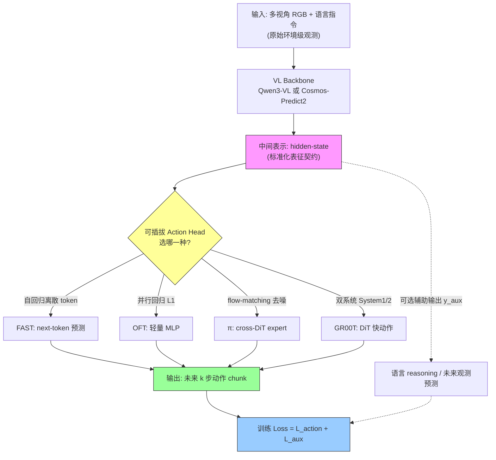

# StarVLA: A Lego-like Codebase for Vision-Language-Action Model Developing

**作者**: Jinhui Ye, Ning Gao, Yilun Chen†, Weiyu Guo, Zixuan Wang, Yuxing Chen, Fangjing Wang, Senqiao Yang, Chengyao Wang, Yuqi Liu, Meng Chu, Changsheng Lu, Pengguang Chen, Shu Liu†, Jiaya Jia†∗ 等(StarVLA Community & Von Neumann Institute, HKUST)
**类型**: arXiv 技术报告(持续维护更新) | **年份**: 2026(报告标注 April 2026)
**链接**: [Project Page](https://starvla.github.io) · [代码 github.com/starVLA/starVLA](https://github.com/starVLA/starVLA) · 本地 PDF: `864e0fe5-868d-4eb8-af80-e4a6e5d0e6ff_origin.pdf`

---

## 一句话总结

StarVLA 是一个"乐高式"开源 VLA 平台,用 **backbone–action-head 双向可插拔解耦** 把 VLM-based 与 world-model-based 两大家族统一到同一数据/训练/评测管线下,使研究者能在只改一个变量的受控条件下对比四种动作解码范式(FAST / OFT / π / GR00T),并用极简配方在 5 大 benchmark 上 match/surpass 已有方法。

---

## 核心贡献

1. **统一 VLA 框架(backbone–action-head 解耦)**: 在共享抽象下实现四种代表性范式——StarVLA-FAST(自回归 tokenize)、StarVLA-OFT(并行回归)、StarVLA-π(flow-matching 去噪)、StarVLA-GR00T(双系统推理);VLM backbone(Qwen3-VL)与 world-model backbone(Cosmos-Predict2)可作为 drop-in 替换,实现两条技术路线在**相同训练/评测条件**下的直接对比。
2. **可复用、与范式无关的训练配方**: 把监督行为克隆、多模态 co-training(防遗忘)、跨本体混合数据联合训练抽象成配置项,任何 action head 通用;RL 微调在集成中(尚未交付)。
3. **广泛 benchmark 整合 + 统一 server-client 评测**: 整合 LIBERO / SimplerEnv / RoboTwin 2.0 / RoboCasa-GR1 / BEHAVIOR-1K 等,模型当 WebSocket policy server、benchmark/机器人当 client,同一 checkpoint 仿真↔真机零代码改动。
4. **广义 VLA 视角(generalized VLA perspective)**: 提出 $\mathcal{L} = \mathcal{L}_{\text{action}} + \mathcal{L}_{\text{aux}}$ 的统一形式,主张 VLM-based 与 world-model-based 的差异只在辅助信号 $\mathcal{L}_{\text{aux}}$ 的形式,而非本质不同的范式。
5. **强且易复现的极简 baseline**: 无 VLA 预训练/无增强/无 DAgger,用 6–20× 更少训练量即达 SOTA 附近(如 LIBERO 30K steps 达 96.6%),并给出可复现的单 benchmark / generalist / 计算效率结果。

---

## 📖 批读导航

| Section | 内容 |
|---------|------|
| [00 - Abstract](sections/00-abstract.md) | 摘要:三层碎片化 → 三大解法;平台定位 |
| [01 - Introduction](sections/01-introduction.md) | 动机、backbone–head 解耦、Table 1 竞品对比、广义 VLA 视角 |
| [02 - Unified Framework](sections/02-unified-framework.md) | 方法核心:统一形式(Fig 1, Eq 1/2)、I/O 接口、组合式架构、四范式(Fig 2) |
| [03 - System Pipeline](sections/03-system-pipeline.md) | 四种训练范式 + server-client 评测/部署(Fig 3) |
| [04 - Benchmark Integration](sections/04-benchmark-integration.md) | 整合三件套接口 + 7 个 benchmark 介绍 |
| [05 - Single-Benchmark Results](sections/05-single-benchmark-results.md) | Specialist 结果:LIBERO/SimplerEnv/RoboCasa/RoboTwin(Table 2–7) |
| [06 - Co-Training](sections/06-cotraining.md) | 多模态联合训练防遗忘(Fig 4, Table 8);ST4VLA 案例 |
| [07 - Cross-Benchmark](sections/07-cross-benchmark.md) | Generalist 单模型跨本体(Table 9);32 维统一 padding |
| [08 - Computation Efficiency](sections/08-computation-efficiency.md) | 单/多节点扩展性(Table 10/11, Fig 5/6);两种吞吐 |
| [09 - Appendix](sections/09-appendix.md) | 作者与贡献者 + 完整参考文献 |

---

## 关键数字

| 指标 | 数值 |
|------|------|
| 动作解码范式数 | 4(FAST / OFT / π / GR00T) |
| 支持 backbone 类型 | 2 类:VLM(Qwen3-VL-4B)/ world model(Cosmos-Predict2-2B) |
| 整合 benchmark 数 | 5 主打(Table 1 计 7) |
| LIBERO StarVLA-OFT | 96.6%(Qwen3-VL),30K steps / 9.54 epochs |
| LIBERO 对照 OpenVLA-OFT | 97.1%,175K steps / 223 epochs(StarVLA 少 6× step、23× epoch) |
| SimplerEnv WidowX(VM)最高 | 65.3%(StarVLA-GR00T, Qwen3-VL) |
| SimplerEnv Google Robot(VM) | 76.0%(StarVLA-OFT) |
| RoboCasa-GR1 最佳 specialist | 48.8%(StarVLA-OFT);generalist 提升到 **57.3%** |
| RoboTwin 2.0 最高(random) | 88.8%(StarVLA-π) |
| Co-training 最佳(spatially pretrained) | WidowX 73.2 / Google VM 84.6 / RefCOCO-g 71.2 IoU@0.5 |
| 多节点并行效率(≥64 GPU) | 稳定 79–80%;sample 吞吐 87→2200 samples/s(8→256 GPU) |

---

## 数据流:输入 → 中间表示 → 输出

> 数据流要点:backbone 与 head 之间用 **hidden-state 标准化契约** 连接,两侧可各自独立替换(双向模块化);$\mathcal{L}_{\text{aux}}$ 的形式(语言 reasoning / 未来观测预测 / 无)决定该实例属于 VLM-based / world-model-based / Direct VLA。

---

## 优缺点与还能做什么

### 优点
- **真正的模块化**: 两个标准化边界(外:观测→动作;内:输入→hidden→动作)让 backbone/head 独立替换,不是纸面能力——实验证明换整类 backbone(VLM↔world model)掉点极小(LIBERO ≥95.2%)。
- **受控可比性**: 一次只改一个变量,首次让 VLM-based 与 world-model-based 在相同管线下直接对比,催生"广义 VLA 视角"。
- **极简可复现基线**: 刻意不用预训练/增强/DAgger,提供干净锚点;数据效率高(6–20× 更少训练量达 SOTA 附近)。
- **训练-部署一致**: 统一 I/O 接口吃原始观测,最小化 train/test 分布错配;server-client 让同一 checkpoint 仿真↔真机零改动。
- **透明工程**: 显式 PyTorch 循环、公开 profiling(issue #158)、完整训练/评测脚本。

### 局限 / 风险
- **RL 微调未交付**: 仅规划中(§3.1.4),当前只有 SFT 与 co-training。
- **BEHAVIOR-1K 结果缺席**: 虽列为整合 benchmark,但第 5 节无其数字。
- **离散 head 系统性偏弱**: StarVLA-FAST 在每个 benchmark 都垫底(RoboCasa 39% vs 连续 48.8%),可插拔性以"某些 head 明显更差"为代价。
- **co-training 主证据来自外部研究**: 第 6 节关键结果引用 ST4VLA(Ye 2026a),非本文自证。
- **generalist 覆盖不全**: Table 9 部分 cell 缺失(如 RoboTwin clean),跨本体用"32 维 padding"这一简单策略,可能不是动作空间对齐的最优解。
- **对比表噪声**: Table 1 的勾叉符号经 MinerU 提取有噪声,需以原图为准。

### 还能做什么
- 补齐 RL 微调(RLinf 集成)与 BEHAVIOR-1K、CALVIN 的完整结果。
- 在统一管线下系统消融"backbone 类型 × head 类型 × 训练策略"的三维交互(平台已具备条件)。
- 探索比"32 维 padding"更好的跨本体动作空间对齐(如可学习的动作 tokenizer / 本体条件 head)。
- 把"广义 VLA 视角"从经验观察推进到理论刻画(何时 $\mathcal{L}_{\text{aux}}$ 的两种形式等价/互补)。
- 引入真机大规模跨本体预训练,验证 generalist 的正迁移红利能否规模化。

---

## 阅读 Q&A 记录

- **Q: StarVLA 是一个新 VLA 方法还是一个平台?**
  A: 平台/代码库。它不发明新方法,而是把已有四范式统一到可插拔 backbone+head 抽象下,核心价值是消除对比时的混杂变量,并提供强 baseline。(见 [00](sections/00-abstract.md)、[01](sections/01-introduction.md))

- **Q: "backbone 与 head 可各自独立替换"靠什么保证?**
  A: 两个标准化契约——外边界(原始观测→动作,统一 I/O 接口)和内边界(多模态输入→hidden state→动作,表征契约)。因此 backbone/head 谁换都不影响对方与周边基础设施。(见 [02 §2.2](sections/02-unified-framework.md))

- **Q: 为什么离散的 StarVLA-FAST 几乎处处垫底?**
  A: 它把连续动作离散成 token 再自回归生成,精度受 tokenizer 分辨率限制且易累积误差;越难/越需精确控制的 benchmark 差距越大(RoboCasa 39% vs 连续 48.8%,WidowX 31.6% vs 65.3%)。(见 [05](sections/05-single-benchmark-results.md))

- **Q: co-training 到底改变了哪个中间表示?**
  A: 它维持 VLM backbone 感知通路表征不退化(Fig 4a 的 grounding、Table 8 的 POPE/RefCOCO-g),使 backbone→head 契约上的 hidden state 仍保有空间/物体语义;梯度层面(Fig 4c PSS)让 grounding 与动作目标的梯度子空间对齐,两者不再互相破坏。(见 [06](sections/06-cotraining.md))

- **Q: generalist 为什么在 RoboCasa 涨最多(+8.5)、LIBERO 几乎不变?**
  A: 正迁移红利与"任务难度 × 数据稀缺度"正相关——RoboCasa 最难且数据有限,联合训练从其他 benchmark 借来通用先验;LIBERO 已接近饱和,无明显负迁移也无涨点空间。(见 [07](sections/07-cross-benchmark.md))

- **Q: 加更多 GPU 能让训练更快吗?**
  A: 看目标。处理固定数据量→更快(sample 吞吐 87→2200 samples/s 近线性);跑固定步数→略慢(step 吞吐因同步 0.735→0.93 s/step)。通信开销是一次性台阶,>64 GPU 后效率稳定 79–80%。(见 [08](sections/08-computation-efficiency.md))

---

## 📊 Citation Landscape

> ⚠️ **数据来源说明**: Semantic Scholar Graph API 在批读时持续返回 HTTP 429(速率限制),且本文为 2026 年 4 月的技术报告、很可能尚未被 Semantic Scholar 收录,因此 TLDR / 被引统计 / Recommendations 无法自动获取。以下 Citation Landscape 依据**论文自身参考文献(见 [09-appendix](sections/09-appendix.md))**手工归类整理,待 API 可用后可补充自动化数据。

**引用规模(来自 full.md)**: 参考文献约 90+ 条,横跨 VLA 方法、视频世界模型、benchmark 三大主题。

**参考文献分组(按主题,组内按影响力/代表性)**

- **VLA 方法与动作解码(本文四范式与主要对比 baseline 来源)**
  - Kim et al. (2025) *OpenVLA-OFT: Fine-tuning VLA — optimizing speed and success* — StarVLA-OFT 对标
  - Black et al. (2024) *π0: A vision-language-action flow model* — StarVLA-π 对标
  - Pertsch et al. (2025) *FAST: Efficient action tokenization for VLA* — StarVLA-FAST 对标
  - Bjorck et al. (2025) *GR00T N1: Open foundation model for humanoid robots* — StarVLA-GR00T 对标
  - Brohan et al. (2022/2023) *RT-1 / RT-2* — VLA 奠基工作
  - Intelligence et al. (2025a) *π0.5*;Kim et al. (2024) *OpenVLA*;Zheng et al. (2025a) *X-VLA*;Wu et al. (2026) *Lingbot/pragmatic VLA*;Contributors (2025) *Dexbotic* — 竞品/对比

- **视频世界模型 / world-model backbone**
  - Kim et al. (2026) *Cosmos policy* — StarVLA world-model backbone 来源
  - Assran et al. (2025) *V-JEPA 2*;Jang et al. (2025) *DreamGen*;Zheng et al. (2025b) *FLARE*;Ye et al. (2025) *Latent action pretraining*
  - GigaWorld Team (2025) / GigaBrain Team (2026) / Guo et al. (2025) *Ctrl-World* — 可控世界模型/数据引擎
  - Ye et al. (2026b) *World action models are zero-shot policies*;Yuan et al. (2026) *Fast-WAM*

- **VL 基础模型(backbone 与感知)**
  - Bai et al. (2025a) *Qwen3-VL* — StarVLA VLM backbone 来源;Bai et al. (2025b) *Qwen2.5-VL*
  - Radford et al. (2021) *CLIP*;Zhai et al. (2023) *SigLIP*;Oquab et al. (2023) *DINOv2*;Dosovitskiy et al. (2021) *ViT*;Kirillov et al. (2023) *SAM*

- **Benchmark**
  - Liu et al. (2024a) *LIBERO*;Fei et al. (2025) *LIBERO-Plus*;Li et al. (2024b) *SimplerEnv*
  - Chen et al. (2025b) *RoboTwin 2.0*;Nasiriany et al. (2024) *RoboCasa*;Li et al. (2023) *BEHAVIOR-1K*;Mees et al. (2022) *CALVIN*

- **多模态 co-training / 空间引导(第 6 节案例)**
  - Ye et al. (2026a) *ST4VLA: Spatially guided training for VLA* — 第 6 节 co-training 实证的直接出处
  - Driess et al. (2025) *Knowledge insulating VLA*;Chen et al. (2025c) *InternVLA-M1*;Zhou et al. (2025) *ChatVLA*

**相关/推荐阅读**(基于主题关联,非 API 生成): Cosmos policy(Kim 2026)、GR00T N1(Bjorck 2025)、π0/π0.5(Black 2024 / Intelligence 2025a)、OpenVLA-OFT(Kim 2025)、X-VLA(Zheng 2025a)、ST4VLA(Ye 2026a)。

- **Connected Papers**: 待补(需 arXiv id;可用 `https://www.connectedpapers.com/search?q=StarVLA`)
- **Semantic Scholar**: 待补(API 可用后按 paperId 构造)
