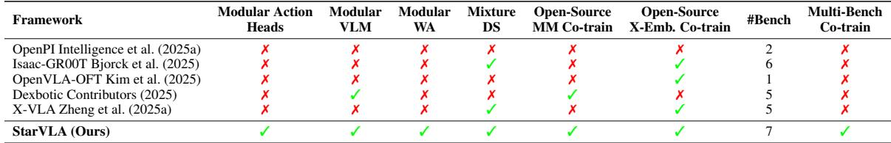

[← 返回 README](../README.md)

# 1. Introduction

## 📌 预览

Introduction 分四个逻辑块:(1) 背景——VLA 已成为具身 AI 主导范式,但分成 VLM-based 与 world-model-based 两大家族且各自为政;(2) 痛点——从架构、系统、评测三个层次论证"碎片化"是核心障碍("Tower of Babel");(3) 方案——StarVLA 用 backbone–action-head 解耦提供三大能力(统一框架 / 灵活训练配方 / 广泛 benchmark 整合),并用 Table 1 与已有开源系统对比;(4) 升华——提出 generalized VLA perspective,主张两大家族只是同一结构下 $\mathcal{L}_{\text{aux}}$ 形式不同。

---

Embodied AI is advancing toward general-purpose agents that integrate perception, language understanding, and action in the physical world, driven in part by recent breakthroughs in large foundation models (OpenAI, 2023; Bai et al., 2025a; Gao et al., 2025). Vision-Language-Action (VLA) models have emerged as a dominant paradigm for this goal, with a diverse range of design choices. Existing approaches can be broadly grouped into two families: VLM-based methods, which repurpose the language model’s representational capacity for action decoding, and world-model-based methods, which employ generative architectures to jointly model action distributions and future observations. While both directions have shown strong promise, they are often developed in isolation, with different codebases, interface assumptions, and evaluation protocols, making it challenging to systematically compare them and understand the trade-offs between different design choices.

> 💡 **问题动机** (claude 批注): 开篇就把 VLA 世界二分为两大家族,这个二分贯穿全文:
> - **VLM-based**: 把语言模型的表征能力"挪用"来解码动作。代表:把动作离散成 token 用自回归生成(如 RT-2、FAST),或用轻量 head 做并行回归(如 OpenVLA-OFT)。
> - **World-model-based**: 用生成式架构同时建模动作分布和未来观测(如 diffusion / flow matching,代表 π0、GR00T)。
>
> 作者的判断是:两条路都有前景,但因为"代码库不同、接口假设不同、评测协议不同"而无法系统对比。这就是 StarVLA 存在的理由——它不发明新方法,而是消除对比时的混杂变量。

Fragmentation hinders systematic exploration. Despite this progress, VLA research remains hindered by fragmentation at multiple levels. At the architecture level, existing approaches (Kim et al., 2025; Brohan et al., 2022, 2023; Bjorck et al., 2025; Black et al., 2024; Intelligence et al., 2025a; Wu et al., 2026; Li et al., 2026) adopt diverse action-decoding designs, from VLM-native methods (autoregressive tokenization, parallel regression) to generative-model-based methods (diffusion, flow matching), making systematic comparison across paradigm families difficult. At the system level, methods are released with tightly coupled assumptions on model architecture, data processing, and training pipelines, limiting component reuse across projects. At the evaluation level, results are reported on disjoint subsets of benchmarks with inconsistent protocols, making fair comparison infeasible. Together, these issues create a “Tower of Babel” for VLA research, where ideas are difficult to compare, reproduce, or recombine. We attribute this fragmentation to the lack of a unified abstractionfor VLA systems. Existing codebases (Bjorck et al., 2025; Black et al., 2024) are largely method-specific and do not support (i) modular composition across different action-decoding paradigms, (ii) reusable training across heterogeneous data sources, or (iii) standardized evaluation and deployment across benchmarks and embodiments.

> 💡 **机制拆解** (claude 批注): 这段是全文的"病理诊断",把碎片化拆成三层,与三大贡献严格对应——记住这个三层结构,后文每一节都在解决其中一层:
>
> | 碎片化层次 | 具体表现 | StarVLA 对应解法 | 对应章节 |
> |-----------|---------|-----------------|---------|
> | 架构层 | action-decoding 设计五花八门(自回归/并行回归/diffusion/flow) | backbone–head 解耦,head 可插拔 | §2 |
> | 系统层 | 模型/数据/训练管线紧耦合,无法复用 | 统一 I/O 接口 + 可复用训练配方 | §2.2, §3 |
> | 评测层 | benchmark 子集不同、协议不一致 | server-client 统一评测接口 | §3.2, §4 |
>
> "Tower of Babel(巴别塔)"这个比喻很到位:大家都在造 VLA,但语言不通,想法无法互译。作者把根因归结为"缺乏统一抽象"——这是全文最关键的方法论 claim。

StarVLA: a unified platform for exploring embodied intelligence. We introduce StarVLA, an opensource research platform that brings VLM-based and world-model-based VLA paradigms into a unified modular framework. The core design is a backbone–action-head decomposition, where a shared visionlanguage backbone encodes the scene and instruction, and a pluggable action head maps the resulting representation to motor commands. This formulation is flexible enough to support a wide range of existing approaches, including autoregressive tokenization, parallel regression, flow-matching denoising, and dualsystem reasoning, with re-implementations that match or in some cases exceed reported performance. In practice, StarVLA provides three core capabilities:

> 💡 **机制拆解** (claude 批注): 这里给出全文最核心的结构公式——**backbone–action-head 解耦**:
> - **backbone**(共享): 接收场景图像 + 语言指令,编码成 hidden state 表征。可以是 VLM(Qwen3-VL)或 world model(Cosmos-Predict2)。
> - **action head**(可插拔): 读 backbone 的表征,映射成电机指令。支持四种:自回归 tokenize / 并行回归 / flow-matching 去噪 / 双系统推理。
>
> "match or exceed reported performance" 是一个很强的工程宣称:StarVLA 的重实现不是打折版,而是能复现甚至超过原论文数字。这为后文"作为强 baseline 提供者"的定位背书。

• Unified VLA frameworks: StarVLA implements four representative paradigms under the shared backbone– action-head abstraction (Section 2): StarVLA-FAST (autoregressive tokenization), StarVLA-OFT (parallel regression), StarVLA-π (flow-matching denoising), and StarVLA-GR00T (dual-system reasoning). Crucially, both VLM backbones (e.g., Qwen3-VL) and world-model backbones (e.g., Cosmos-Predict2) are supported as drop-in alternatives, enabling direct comparison between VLM-based and world-model-based research paths under identical training and evaluation conditions. All variants share the same data interface and downstream infrastructure; only the backbone or the action head differs, enabling researchers to isolate the effect of any single design choice while holding all others constant.

> 💡 **机制拆解** (claude 批注): 这是四大范式的"名片",后面第 2.3 节会展开。先记住映射关系:
>
> | 变体 | action head 类型 | 对标已有方法 |
> |------|-----------------|-------------|
> | StarVLA-FAST | 自回归离散 token(FAST tokenizer) | π0+FAST |
> | StarVLA-OFT | 轻量 MLP 并行回归(L1 loss) | OpenVLA-OFT |
> | StarVLA-π | 层间 cross-DiT flow-matching expert | π0 |
> | StarVLA-GR00T | 双系统(VLM=System2 慢思考, DiT=System1 快动作) | GR00T N1.5 |
>
> 最后一句"only the backbone or the action head differs"是本文实验设计的灵魂:它把 VLA 研究变成受控实验,一次只动一个变量。这正是为什么本文能给出"换 backbone 性能相当"这类干净结论。

• Flexible training recipes: StarVLA treats cross-embodiment learning and multimodal co-training as reusable, paradigm-agnostic configurations rather than method-specific add-ons. The same training infrastructure supports supervised action learning, co-training with web-scale vision-language data to preserve multimodal reasoning, and cross-embodiment pretraining across heterogeneous robot datasets. Every recipe applies uniformly to all supported paradigms, making it straightforward to study how training strategies interact with different architectural choices.

> 💡 **机制拆解** (claude 批注): 关键词是 **paradigm-agnostic(与范式无关)**。跨本体学习和多模态联合训练在别的工作里往往是"某方法专属的技巧",在 StarVLA 里被抽象成配置项,任何 action head 都能用。这带来一个研究能力:可以研究"训练策略 × 架构选择"的交互效应,而不是把两者绑死。对应第 6 节(co-training)和第 7 节(cross-benchmark)。

• Broad benchmark integration: StarVLA integrates five mainstream benchmarks (LIBERO, SimplerEnv, RoboTwin 2.0, RoboCasa-GR1, and BEHAVIOR-1K) through a unified server-client testing interface, enabling controlled comparison across environments and embodiments. For each benchmark, we provide simple, fully reproducible training recipes with minimal data engineering that already achieve competitive or state-of-the-art performance under both VLM and world-model backbones, lowering the barrier for the community to build upon. The same interface supports both simulation evaluation and real-robot deployment without code changes, closing the gap between research exploration and practical deployment.

> 💡 **机制拆解** (claude 批注): server-client 抽象是评测层的解法(详见 §3.2)。核心巧思:benchmark 各自的依赖栈(仿真器、控制循环)千差万别,如果把它们塞进模型代码会污染。StarVLA 把模型做成一个 WebSocket policy server,benchmark 端只当 client 发观测、收动作。这样"同一个 checkpoint 在仿真和真机之间零代码改动"就能复用——这是"closing the gap between research and deployment"的技术兑现。

To position StarVLA within the existing ecosystem, we compare it with representative open-source VLA systems across key capabilities in Table 1. To the best of our knowledge, StarVLA is the first platform to bring these capabilities together within a unified interface. Leveraging the controlled comparisons enabled by this framework, StarVLA achieves competitive, and in some cases state-of-the-art, performance across multiple benchmarks with both VLM and world-model backbones, demonstrating that the platform serves not only as a research toolkit but also as a provider of strong, easy-to-reproduce baselines.

*Table 1: Comparison of representative open-source VLA systems. Modular Action Heads: action heads are plug-and-play on a shared backbone. Modular VLM: supports swapping the VLM backbone. Modular WA: supports world model as VL backbone. Mixture DS: built-in mixture dataloader for heterogeneous data sources. Open-Source MM Co-train: open-source multimodal co-training support. Open-Source X-Emb. Co-train: open-source cross-embodiment co-training support. #Sim Bench: number of integrated simulation benchmarks with evaluation code. Multi-Bench Co-train: joint all benchmarks into one model.*

> 💡 **Table 1 批读** (claude 批注): 这张对比表是本文的"竞品定位"证据,拿 OpenPI、Isaac-GR00T、OpenVLA-OFT、Dexbotic、X-VLA 逐项对照。它想证明一件事:StarVLA 在**所有九个能力维度上都打勾**,是唯一同时覆盖以下能力的平台——
> - Modular Action Heads(可插拔 head)+ Modular VLM(可换 VLM)+ Modular WA(可用 world model 当 backbone)三者全有;
> - Mixture DS(异构数据混合 dataloader);
> - 开源 MM 联合训练 + 开源跨本体联合训练;
> - #Bench=7(整合的仿真 benchmark 数量最多);
> - Multi-Bench Co-train(把所有 benchmark 合成一个模型)。
>
> 对比之下,竞品要么只支持 1–2 个 benchmark(OpenVLA-OFT 只 1 个),要么缺少 world-model backbone 支持,要么不开源 co-training。这张表的作用是把"最全面开源 VLA 框架"的 claim 落到可核对的清单上,而不是空口宣称。(注:MinerU 提取的表格勾叉符号有噪声——V/√ 表示支持、X/x 表示不支持;以原始图片为准。)

A generalized VLA perspective. Beyond its engineering utility, StarVLA also suggests a broader perspective on unifying diverse VLA approaches. Empirically, we find that a single backbone–action-head abstraction can accommodate VLM-based decoding, generative-model-based decoding, and dual-system architectures, all within a shared data pipeline, training loop, and evaluation protocol. This observation indicates that VLMbased and world-model-based methods may be better understood not as fundamentally distinct paradigms, but as variations within a common structural framework, differing primarily in the form of auxiliary learning signals (e.g., language-aligned reasoning or future observation prediction). We refer to this as the generalized VLA perspective. Rather than a purely conceptual viewpoint, it arises from the practical unification enabled by StarVLA: when differences in infrastructure are minimized, underlying commonalities become more apparent. We hope this perspective encourages more systematic and cumulative exploration of robotic foundation models.

> 💡 **机制拆解** (claude 批注): 这是全文最有理论野心的一段——**generalized VLA perspective(广义 VLA 视角)**。它的逻辑是:
> 1. 经验上,同一个 backbone–head 抽象能容纳 VLM 解码、生成式解码、双系统三种架构;
> 2. 那么三者的差异其实只在**辅助学习信号 $\mathcal{L}_{\text{aux}}$ 的形式**——VLM-based 用语言对齐的 reasoning,world-model-based 用未来观测预测;
> 3. 结论:它们不是本质不同的范式,而是同一结构框架下的变体。
>
> 关键在于最后一句方法论:"当基础设施差异被最小化时,底层共性才浮现"。也就是说这个理论视角不是先验哲学,而是**工程统一的副产品**——正因为 StarVLA 把数据/训练/评测都统一了,才看得出两家族的相似。这个视角在第 2 节会用形式化的 $\mathcal{L} = \mathcal{L}_{\text{action}} + \mathcal{L}_{\text{aux}}$ 公式落地。

> 💡 **Q&A 批注记录** (claude 批注):
> - Q: 既然作者宣称 VLM-based 和 world-model-based 只是 $\mathcal{L}_{\text{aux}}$ 不同,那 Direct VLA(不加辅助信号)算什么?
> - A: 见第 2 节公式(2)后的分类:Direct VLA 令 $\mathcal{L}_{\text{aux}}=0$,只优化动作;VLM-based 加语言对齐辅助目标;WM-based 加未来观测预测。三者是同一公式在 $\mathcal{L}_{\text{aux}}$ 上的三种取值,这正是"广义 VLA 视角"的形式化落点。

> 💡 **Section 小结** (claude 批注):
> - **关键结构**: backbone(共享,VLM 或 world model)+ action head(可插拔,4 种)。
> - **三层碎片化 → 三大贡献**: 架构层→统一框架;系统层→可复用训练配方;评测层→server-client 统一评测。
> - **核心洞察**: generalized VLA perspective——两大家族差异只在 $\mathcal{L}_{\text{aux}}$,是工程统一后浮现的共性,而非先验假设。
> - **关键数字**: 4 范式 / 2 类 backbone / Table 1 中 StarVLA 是唯一九项能力全覆盖、整合 benchmark 数最多(7)的平台。
> - **可追问点**: 四种 head 具体怎么从同一 backbone 表征里"抽动作"?见第 2.3 节 Figure 2。
