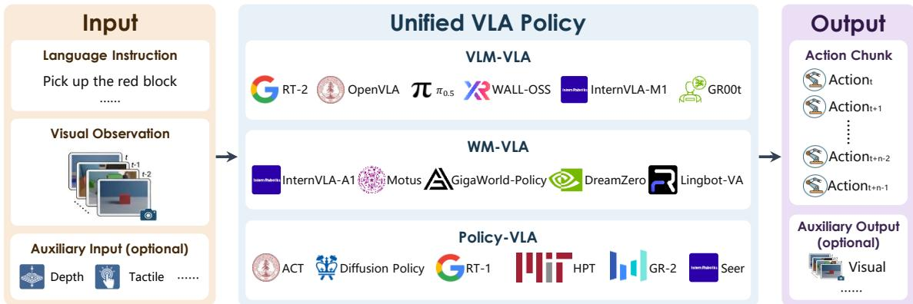
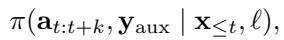
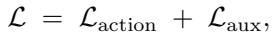
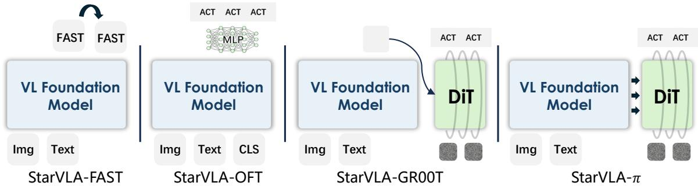

[← 返回 README](../README.md)

# 2. Unified Framework for VLA Systems

## 📌 预览

这是全文的方法核心。先给出**系统级抽象**(每个方法都是带显式训练/推理接口的模块化组件)和**策略级抽象**(把 VLA 统一成 policy $\pi$,训练目标分解为 $\mathcal{L} = \mathcal{L}_{\text{action}} + \mathcal{L}_{\text{aux}}$)。然后三个子节:2.1 综述可用的 VL 基础模型;2.2 讲怎么把这些"不为动作而生"的 VL 模型改造成 VLA-ready(统一 I/O 接口 + 组合式 backbone–head 架构);2.3 在这个抽象下实例化四种代表性范式(FAST/OFT/π/GR00T)。

---

The rapid evolution of Vision-Language-Action (VLA) models has led to a wide range of heterogeneous designs, with varying preprocessing pipelines, model boundaries, and inference assumptions. While this diversity enables rapid exploration, it often hinders reproducibility and makes fair comparison difficult. To address this, StarVLA adopts a unifiedframework abstraction at the system level: each method is implemented as a modular component with explicit training and inference interfaces, such that algorithmic differences are isolated to a minimal set of interchangeable modules.

> 💡 **机制拆解** (claude 批注): 这段确立"系统级抽象"的原则——**把算法差异压缩到一小组可互换模块里**。翻译成工程语言:预处理管线、模型边界、推理假设都统一,只留 backbone 和 head 两个"可换插槽"。这是 Lego(乐高)比喻的来源:积木接口标准化,块本身可自由拼换。

Abstraction of VLA systems. Beyond the system-level abstraction, we introduce a unified policy-centric formulation of VLA models. Prior work often distinguishes between VLM-based policies (VLA) and worldmodel-based approaches (WAM); here, we place them under a common perspective centered on action generation.

> 💡 **机制拆解** (claude 批注): 从"系统级抽象"(代码工程)升级到"策略级抽象"(数学形式)。作者要把 VLA 和 WAM(world-action model)放到同一个以**动作生成**为中心的公式里。下面的 Figure 1 和公式(1)(2)就是这个统一形式的正式表达。

*Figure 1: Conceptual view of the unified VLA formulation adopted in StarVLA. A policy π maps visual observations and a language instruction to a future action chunk. The training objective decomposes as $\mathcal{L} = \mathcal{L}_{\text{action}} + \mathcal{L}_{\text{aux}}$, where different model families correspond to different forms of $\mathcal{L}_{\text{aux}}$.*

> 💡 **Figure 1 批读** (claude 批注): 这张概念图是"广义 VLA 视角"的可视化。它传达一件事:所有 VLA 都是同一个 policy $\pi$——输入视觉观测 + 语言指令,输出未来动作 chunk;训练 loss 拆成两块:
> - $\mathcal{L}_{\text{action}}$: 监督预测的动作(所有方法都有)。
> - $\mathcal{L}_{\text{aux}}$: 辅助信号,决定"这是哪一家"——VLM-based 用语言 reasoning,world-model-based 用未来观测预测,Direct VLA 则为 0。
>
> 图的价值在于把"两大家族"从并列关系改画成"同一主干 + 不同旁支"的关系,为后文四范式共享 backbone 埋下概念伏笔。

As illustrated in Fig. 1, we model a VLA system as a policy that maps vision-language (VL) inputs to future action (A) sequences and optional auxiliary outputs:

where:

$\mathbf{x}_{\leq t} = \{ o_{\lt t}^{\text{vis}}, o_{\lt t}^{\text{depth}}, o_{\lt t}^{\text{tactile}}, ... \}$ denotes the multimodal observation history up to time t, which may include visual observations, depth maps, tactile feedback, proprioceptive states, or other sensor modalities;

• ℓ is the language instruction describing the task;

$\mathbf{a}_{t:t+k}$ represents the predicted k-step action chunk from time t to $t+k$

$\mathbf{y}_{\text{aux}}$ denotes optional auxiliary outputs over the future horizon, such as predicted future visual observations $o_{t+1:t+k}^{\text{vis}}$, intermediate language reasoning or sub-goal descriptions $\ell_{\text{plan}}$, or other modality predictions.

This formulation abstracts away intermediate representations and implicitly marginalizes over latent predictions when present, allowing both direct policies and model-based approaches to be expressed within a common interface.

> 💡 **公式批读** (claude 批注): 公式(1)是 $\pi(\mathbf{a}_{t:t+k}, \mathbf{y}_{\text{aux}} \mid \mathbf{x}_{\leq t}, \ell)$。逐符号拆:
> - **输入 $\mathbf{x}_{\leq t}$**: 截至 t 时刻的多模态观测历史(RGB、深度、触觉、本体状态…)。用"历史"而非"当前帧",给 world model 类方法留了时序建模空间。
> - **输入 $\ell$**: 语言指令。
> - **输出 $\mathbf{a}_{t:t+k}$**: 未来 k 步的**动作 chunk**(注意是块,不是单步)——这对应后文 LIBERO 的 action chunking=8。
> - **输出 $\mathbf{y}_{\text{aux}}$**: 可选辅助输出,可以是未来视觉观测 $o^{\text{vis}}$(world model 用)、中间语言 reasoning / 子目标 $\ell_{\text{plan}}$(VLM 用)。
>
> 最后一句是精髓:公式"abstract away 中间表示,并对 latent 预测隐式边缘化"。这正是它能同时表达 direct policy(无 latent)和 model-based(有 latent 未来预测)的原因——把 latent 当作可积掉的内部变量,只保留输入输出契约。

The training objective takes the general form

where $\mathcal{L}_{\text{action}}$ supervises the predicted actions, and $\mathcal{L}_{\text{aux}}$ serves as an inductive bias that shapes the learned representation. Different VLA paradigms can then be interpreted as instantiations of this formulation with distinct learning signals:

• Direct VLA Modeling sets $\mathcal{L}_{\text{aux}} = 0$, optimizing actions alone.

• VLM-based VLA introduces language-aligned auxiliary objectives, such as sub-task planning, spatial grounding, or structured reasoning supervision, requiring the model to generate language tokens as auxiliary outputs.

• WM-based VLA incorporates future observation prediction (e.g., images or videos), either as an auxiliary objective or as an implicit latent structure that supports action generation, where the model must predict visual states as auxiliary outputs.

Under this view, seemingly different paradigms such as VLM-based, world-model-based, and direct policies can be understood as variations of a shared policy formulation with different inductive biases. This perspective simplifies comparison while remaining compatible with both step-wise execution and multi-step open-loop control.

> 💡 **公式批读** (claude 批注): 公式(2)$\mathcal{L} = \mathcal{L}_{\text{action}} + \mathcal{L}_{\text{aux}}$ 是"广义 VLA 视角"的一行数学总纲。$\mathcal{L}_{\text{action}}$ 是共性(人人都监督动作),$\mathcal{L}_{\text{aux}}$ 是**归纳偏置(inductive bias)**,塑造学到的表征——它的取值把三家族区分开:
>
> | 范式 | $\mathcal{L}_{\text{aux}}$ | 需要模型额外产出什么 |
> |------|------|------|
> | Direct VLA | $= 0$ | 只出动作 |
> | VLM-based | 语言对齐目标(子任务规划/空间 grounding/结构化 reasoning) | 生成语言 token |
> | WM-based | 未来观测预测(图像/视频),或隐式 latent 结构 | 预测视觉状态 |
>
> 这个分类的价值:它把"用什么辅助信号"变成一个可调的设计维度,而不是"选哪个门派"。所以第 2.3 节能把 4 个变体放在同一 backbone 上——它们本质是 $\mathcal{L}_{\text{action}}$ 相同、head 与 $\mathcal{L}_{\text{aux}}$ 不同的实例。

---

## 2.1 Background: VL Foundation Models for Embodied Intelligence

> 💡 **2.1 要点预览** (claude 批注): 这个子节是"为什么用 VL 基础模型 + 为什么它们还不够"的综述。分三条线:视觉-语言基础模型、面向机器人的视觉-语言建模、视频世界模型。落脚点在最后一句:VL 预训练和视频世界模型沿"互补但割裂"的两条轴扩展,正是这种割裂促成了 StarVLA "分离该变的与该稳定的"的设计动机。

Embodied agents interact continuously with the physical world, where vision serves as the primary modality for perceiving scene structure, object identity, spatial relations, and interaction affordances.

Vision-language foundation models. This central role of vision has driven advances in visual representation learning, from supervised models such as ResNet (He et al., 2016) and Vision Transformers (Dosovitskiy et al., 2021) to scalable self-supervised approaches (Oquab et al., 2023) and video pretraining that captures temporal structure. Building on these backbones, language-aligned pretraining (Radford et al., 2021; Zhai et al., 2023) enables shared vision–language representations, while promptable systems such as SAM (Kirillov et al., 2023; Liu et al., 2023b) extend open-world perception. Together with instruction-tuned VLMs (Liu et al., 2023a; Chen et al., 2023; Karamcheti et al., 2024; Bai et al., 2025b; OpenAI, 2024; Gemini Team, Google, 2024) and generative video models (Gao et al., 2025; Google DeepMind, 2025), these advances significantly enhance perceptual grounding. However, perception alone is insufficient: embodied agents must also reason over language-conditioned goals and predict environment dynamics under action. Existing models are not inherently designed for action generation or visuomotor control (Zhao et al., 2023; Dhariwal and Nichol, 2021; Ze et al., 2024).

> 💡 **机制拆解** (claude 批注): 这段的论证节奏是"先夸后转"。先罗列 VL 基础模型的进步(ResNet/ViT → 自监督 → 语言对齐 CLIP/SigLIP → SAM → 指令微调 VLM → 生成式视频模型),然后在末句转折:**perception alone is insufficient**——这些模型都不是为动作生成/视觉运动控制而设计的。这个"转折"直接引出 §2.2 的核心任务:把 VL 模型改造成 VLA-ready。

Vision-language modeling for robotic perception and reasoning. Vision-language pretraining grounds perception in language, providing a scalable interface for task specification and high-level reasoning (Radford et al., 2021; Zhai et al., 2023). Extending this paradigm, Vision-Language-Action (VLA) models incorporate action supervision to unify perception, language, and control (Brohan et al., 2022, 2023; Kim et al., 2024; Black et al., 2024; Intelligence et al., 2025b; Bjorck et al., 2025). Early works (Nair et al., 2022; Xiao et al., 2022) show that strong visual priors improve control, while VLA models directly map observations and instructions to actions via behavior cloning or policy learning. By transferring large-scale semantic knowledge into control, they improve instruction following and cross-task generalization, often outperforming prior robotic policies (Zhao et al., 2023; Chi et al., 2024a; Ze et al., 2024). Recent work extends these models to humanoid loco-manipulation (Wei et al., 2026). To preserve reasoning capabilities, subsequent approaches explore multimodal co-training (Driess et al., 2025; Ye et al., 2026a; Chen et al., 2025c; Zeng et al., 2024; Yang et al., 2025c; Zhou et al., 2025), while others scale teleoperated datasets (Collaboration et al., 2023; Khazatsky et al., 2024; Wu et al., 2024; AgiBot, 2025; Ebert et al., 2021; Duan et al., 2024). However, these datasets remain limited in task, language, and scene diversity (Shi et al., 2025; Chi et al., 2024b), motivating portable data collection (Generalist AI, 2025; Liu et al., 2024b; Chi et al., 2024b). Meanwhile, tightly coupled pipelines hinder reproducibility, modularity, and scalability, highlighting the need for unified frameworks.

> 💡 **机制拆解** (claude 批注): 这段是 VLM-based VLA 这条线的谱系梳理,并埋了两个后文伏笔:
> - "multimodal co-training 保留 reasoning 能力"——直接对应第 6 节,且引用了 Ye et al. 2026a(即 ST4VLA,本文第 6 节的案例研究);
> - 末句再次点题"tightly coupled pipelines 阻碍复现/模块化/可扩展",把综述引回本文动机。注意作者把自己的定位放进这条线的终点:统一框架是这条演化线的自然下一步。

Video-based world model for robotic dynamics and interaction. Orthogonal to language-based scaling, video-based world models learn physical dynamics via visual prediction. Video captures motion, contact, and causality more effectively than static data. Early methods augment VLA policies with predictive latent modeling (Zheng et al., 2025b; Bjorck et al., 2025; Ye et al., 2025), while large-scale video pretraining enables planning with minimal robot data (Assran et al., 2025; Jang et al., 2025). Later work treats video as a primary policy substrate, either unifying policy, simulation, and evaluation or decoupling planning from control (Du et al., 2023; Ko et al., 2024; Pai et al., 2025; Chen et al., 2025a). Action-conditioned world models further support policy evaluation and improvement: imagined rollouts achieve strong performance (Wu et al., 2023), while recent systems enable counterfactual replay and safety evaluation (1X World Model Team, 2025; Team et al., 2025). Other approaches use controllable world models for trajectory generation, reinforcement learning, or scalable data synthesis (Guo et al., 2025; Jiang et al., 2026; GigaWorld Team et al., 2025; GigaBrain Team et al., 2026; Qiu et al., 2026). Recent work emphasizes causal consistency, controllability, and closed-loop efficiency by integrating action and value prediction into pretrained video models or jointly learning dynamics and control (Kim et al., 2026; Li et al., 2026; Cai et al., 2026; Gao et al., 2026; Zhu et al., 2025; Yuan et al., 2025). Some approaches formulate joint video–action prediction as policy learning or analyze gains from test-time imagination versus co-training (Ye et al., 2026b; Yuan et al., 2026). Additionally, human video provides scalable motion priors, with egocentric pipelines enabling transferable behaviors across tasks and embodiments (Hoque et al., 2025; Yang et al., 2025b; Zheng et al., 2026).

> 💡 **机制拆解** (claude 批注): 这段综述 world-model-based 这条线,和上段是"正交(orthogonal)"关系——语言 scaling vs. 视频动态 scaling。要点:视频比静态数据更能捕捉运动、接触、因果。作者把 world model 的用途归纳成几类:增强 VLA 的预测性 latent、少机器人数据下做规划、当作 policy 主体、支持反事实回放/安全评估、可控轨迹生成/RL/数据合成。这条线解释了为什么 StarVLA 要支持 Cosmos-Predict2 这类 world-model backbone——它不是可有可无的附加,而是与 VLM 平行的一整条研究路径。

Above vision-language pretraining and video-based world modeling scale embodied intelligence along complementary but largely fragmented axes, motivating StarVLA’s design choice to separate what should vary across methods from what should remain stable across training, evaluation, and deployment.

> 💡 **Q&A 批注记录** (claude 批注):
> - Q: 2.1 综述这么长,和本文方法有什么直接关系?
> - A: 它建立了两条"互补但割裂"的 scaling 轴(VL 预训练 / 视频世界模型),从而论证 StarVLA 的核心设计哲学——**分离"该随方法变化的"(backbone、action head)与"该保持稳定的"(数据管线、训练循环、评测协议)**。这句话是 2.1 全节的落点,也是 2.2 组合式架构的直接前提。

---

## 2.2 Building VLA Frameworks on VL Foundation Models

> 💡 **2.2 要点预览** (claude 批注): 这节回答"怎么把不为动作而生的 VL 模型改造成 VLA-ready"。两个关键设计:(1) **统一 I/O 接口**——训练和推理都吃原始环境级观测(和真机部署一模一样),最小化 train/test 分布错配;(2) **组合式架构**——把每个 VLA 拆成 VL backbone + 可插拔 action head,两者通过标准化表征契约连接,实现双向模块化。

While the foundation models surveyed above provide powerful visual-linguistic representations, they are not natively designed for action generation. A key design goal of StarVLA is to make these VL foundation models VLA-ready: we provide a unified I/O interface contract and a compositional architecture that allow diverse action decoding strategies to be flexibly composed on top of the same VL backbone.

Unified I/O Interface. All framework modules in StarVLA inherit from a common base class and expose two methods that share a unified input/output (I/O) interface: both training and inference consume raw, environment-level observations identical to what the robot receives at deployment time.

• forward({raw images, str, ...}) → {raw images, str, ...}: the training entry point. It receives a batch of raw samples, each containing multi-view RGB images, a natural-language instruction, and an action chunk, and returns a loss dictionary.

• predict\_action({raw images, str, ...}) → {normalized\_actions, ...}: the inference entry point. It accepts the same observation format (minus ground-truth actions) and returns predicted action chunks.

By deliberately adopting this unified I/O interface, where training inputs mirror real deployment observations rather than relying on heavily preprocessed dataloader tensors, we minimize train/test distribution mismatch, a common source of silent performance degradation in VLA systems.

> 💡 **机制拆解** (claude 批注): 统一 I/O 接口只有两个方法,这是整个 codebase 的"外契约":
> - `forward(原始样本) → loss 字典`: 训练入口,吃多视角 RGB + 语言指令 + action chunk。
> - `predict_action(原始观测) → normalized_actions`: 推理入口,吃同样格式(减去 GT 动作)。
>
> 设计要点在最后一句:训练输入**镜像真机部署观测**,而不是喂经过 dataloader 重度预处理的 tensor。为什么重要?因为很多 VLA 系统在训练时用了一套精心预处理(resize、crop、归一化),部署时环境给的却是原始传感流,两者对不上就会"silent performance degradation(悄悄掉点)"。把原始观测定为一等契约,就从根上堵住了 train/test 分布错配。

This design choice reflects a deeper invariant of robotic deployment: regardless of how different VL foundation models are pretrained—what tokenization scheme they adopt, how they resize or partition images, or what auxiliary objectives they optimize during pretraining—at inference time every model must ultimately accept the same raw sensor streams that the physical robot provides and produce executable motor commands. The unified I/O interface codifies this deployment-time invariant as the system’s first-class contract, ensuring that any VL model whose inference path can consume raw observations is immediately compatible with StarVLA, without requiring users to reverse-engineer or replicate model-specific preprocessing pipelines. Crucially, this same invariant-driven principle extends naturally to the internal architecture, as we describe next.

> 💡 **机制拆解** (claude 批注): 这段把 I/O 接口上升为"部署时不变量(deployment-time invariant)":无论 backbone 怎么预训练/怎么切图,**推理时都必须吃原始传感流、吐可执行电机指令**。把这个不变量定为一等契约的好处:任何"推理路径能吃原始观测"的 VL 模型都能即插即用,用户不用去逆向工程别人的预处理管线。末句是过渡句——同样的"不变量驱动"原则接下来要用到内部架构(backbone–head 边界)。

Compositional framework. Applying the same principle internally, we decompose every VLA method into two explicitly separated components connected by a standardized representation contract: a VL backbone (e.g., Qwen2.5-VL, z) that consumes raw multimodal observations and exposes hidden-state representations through a common output specification, and a pluggable action head that reads those representations through a corresponding input specification and converts them into motor commands. Each framework assembles itself through the same two-step composition (first loading the backbone, then attaching an action head), with both components configured declaratively via YAML. Because the outer system boundary (raw observations → actions) and the inner backbone–head boundary (multimodal inputs → hidden states → actions) are both governed by standardized contracts, StarVLA achieves bidirectional modularity: backbone and action head can each be replaced independently without affecting the other or any surrounding infrastructure.

> 💡 **机制拆解** (claude 批注): 这是"组合式架构"的核心。数据流被切成两段,中间用**标准化表征契约**焊接:
>
> 原始多模态观测 → [VL backbone] → hidden-state 表征 → [pluggable action head] → 电机指令
>
> 组装分两步(先加载 backbone,再挂 head),全部用 YAML 声明式配置。关键结论是 **bidirectional modularity(双向模块化)**:外边界(观测→动作)和内边界(输入→hidden state→动作)都被契约管住,所以 backbone 和 head 谁换都不影响对方,也不影响周边基础设施。这就是"Lego-like"的技术含义——不是比喻,而是两个标准接口保证的可组合性。

This modularity provides flexibility across different stages of VLA development. For researchers, it supports rapid experimentation in multiple directions. New action decoding paradigms can be prototyped by implement ing and registering an action-head module, while new vision-language backbones—such as instruction-tuned VLMs (e.g., Qwen2.5-VL (Bai et al., 2025b), InternVL (Cai et al., 2026)) or video-native models (e.g., Cosmos (Kim et al., 2026))—can be integrated through a lightweight adapter that conforms to a shared representation interface. Once integrated, these backbones can be evaluated across different action heads without requiring per-method modification. For training infrastructure, the standardized interfaces allow much of the upstream and downstream stack (e.g., training pipelines, benchmark harnesses, and deployment services) to remain largely backbone- and action-head-agnostic, reducing the need for method-specific code paths as new paradigms or models are introduced. For deployment, switching between different backbones or action paradigms can be handled through configuration changes, without requiring code-level modifications

> 💡 **机制拆解** (claude 批注): 这段把模块化的收益落到三个开发阶段,值得记住这个"谁受益"清单:
> - **研究者**: 新 action head 只需实现并注册一个模块;新 backbone(指令 VLM 如 Qwen2.5-VL/InternVL,或视频原生模型如 Cosmos)只需写一个轻量 adapter 对齐表征接口。集成后即可跨不同 head 评测,无需逐方法改代码。
> - **训练基础设施**: 上下游栈(训练管线、benchmark harness、部署服务)基本 backbone/head 无关,新范式进来不用加专用代码路径。
> - **部署**: 换 backbone/范式只改配置,不改代码。
>
> 这三条正是 Table 1 里 StarVLA 能九项全勾的工程根基。

---

## 2.3 Representative VLA Instantiations

> 💡 **2.3 要点预览** (claude 批注): 这节把抽象兑现成四个实例(Figure 2)。所有变体共享同一 VL backbone、同一 base class、同一 forward/predict_action 契约,**唯一区别是"如何从 backbone 表征里抽出动作"**。这四个覆盖了从 VLM 原生解码到生成式解码的主要动作解码家族。

Under this unified abstraction, we implement four paradigms spanning the major action decoding families in the current VLA literature, as illustrated in Fig. 2. All variants share the same VL backbone, the same base class, and the same forward/predict\_action contract, differing only in how they extract actionsfrom the backbone’s representations:

*Figure 2: Overview of four representative approaches for adapting Vision-Language Models into Vision-Language-Action frameworks in StarVLA (FAST, OFT, π, and GR00T) under a unified interface.*

> 💡 **Figure 2 批读** (claude 批注): 这是"四种 action head 如何从同一 backbone 抽动作"的对照图,是理解本文可插拔设计的关键。四条支路的区别在于动作解码机制:
> - **FAST**: backbone 后接 FAST tokenizer,把动作离散成 token,用 LLM 自己的词表**自回归 next-token 预测**。属 VLM 原生、离散。
> - **OFT**: 挂一个轻量 MLP,读预定义 action token 的 hidden state,**并行回归**连续动作(L1 loss)。最简单的可插拔 head。
> - **π**: 层间 cross-DiT flow-matching action expert,通过 cross-attention 条件于**多层** VL hidden state,**迭代去噪**出连续动作。
> - **GR00T**: 双系统——VL backbone 当 System 2(慢推理),DiT flow-matching 当 System 1(快动作)。
>
> 图想证明的核心 claim:从"自回归 tokenize/并行回归"(VLM 原生)到"flow-matching 去噪/双系统"(与 world model 架构共享)这一整个谱系,都能挂在同一 backbone、同一接口上。加新范式只需实现并注册一个新 head,backbone/训练循环/评测管线全不动。

• StarVLA-FAST (πfast): Appends a FAST tokenizer (Pertsch et al., 2025) to the VL backbone and autoregressively generates discrete action tokens via next-token prediction, using the LLM’s own vocabulary space.

• StarVLA-OFT: Attaches a lightweight MLP that reads the hidden states of predefined action tokens and regresses continuous actions in parallel (L1 loss), following OpenVLA-OFT (Kim et al., 2025)—the simplest form of pluggable head.i

• StarVLA-π (π): Integrates a layer-wise cross-DiT flow-matching action expert, conditioned on multilayer VL hidden states via cross-attention, and predicts continuous actions through iterative denoising, following π (Black et al., 2024).

• StarVLA-GR00T: Adopts a dual-system design where the VL backbone serves as System 2 (slow reasoning) and a DiT-based flow-matching module serves as System 1 (fast action generation), consistent with GR00T N1.5 (Bjorck et al., 2025). This variant demonstrates that even fundamentally different inference-time compute patterns can coexist under the same interface.

> 💡 **机制拆解** (claude 批注): 四个变体按"动作表示"可分成两组,这个二分对后文实验解读很关键:
> - **离散动作**: 只有 FAST(自回归 token)。第 5 节反复出现"离散 FAST 通常弱于连续变体"——例如 RoboCasa 上 FAST 39.0% vs 连续变体 43.9–48.8%。
> - **连续动作**: OFT(并行回归)、π(flow-matching)、GR00T(双系统 flow-matching)。
>
> GR00T 那句"即便推理时计算模式根本不同也能共存于同一接口"是对模块化极限的压力测试:双系统的 System1/System2 分离在推理时是异步/分层的,和单塔自回归完全不同,却依然塞进了同一 forward/predict_action 契约。

This spectrum, from VLM-native decoding (autoregressive tokenization, parallel regression) to generativemodel-based decoding shared with world-model architectures (iterative flow-matching denoising, dual-system reasoning), shows that the proposed compositional architecture and unified interface are broadly applicable. Adding further paradigms requires only implementing and registering a new action head; the backbone, training loop, and evaluation pipeline remain unchanged.

> 💡 **Section 总结** (claude 批注):
> - **数据流(方法主干)**: 原始观测 + 指令 $\to$ VL backbone(Qwen3-VL 或 Cosmos-Predict2)$\to$ hidden-state 表征 $\to$ 可插拔 action head(FAST/OFT/π/GR00T)$\to$ 动作 chunk;训练 loss $\mathcal{L} = \mathcal{L}_{\text{action}} + \mathcal{L}_{\text{aux}}$。
> - **核心变量**: hidden-state 表征是 backbone 与 head 之间的标准化契约;$\mathcal{L}_{\text{aux}}$ 是区分三家族的归纳偏置。
> - **核心洞察**: 两个标准化边界(外:观测→动作;内:输入→hidden→动作)带来双向模块化,backbone 与 head 可独立替换——这是"Lego-like"和后文受控对比实验的技术根基。
> - **关键数字**: 4 种 head、2 类 backbone、只需实现+注册新 head 即可扩展。
> - **可追问点**: 这四个变体在实际训练/评测里怎么跑?见第 3 节统一系统管线。
