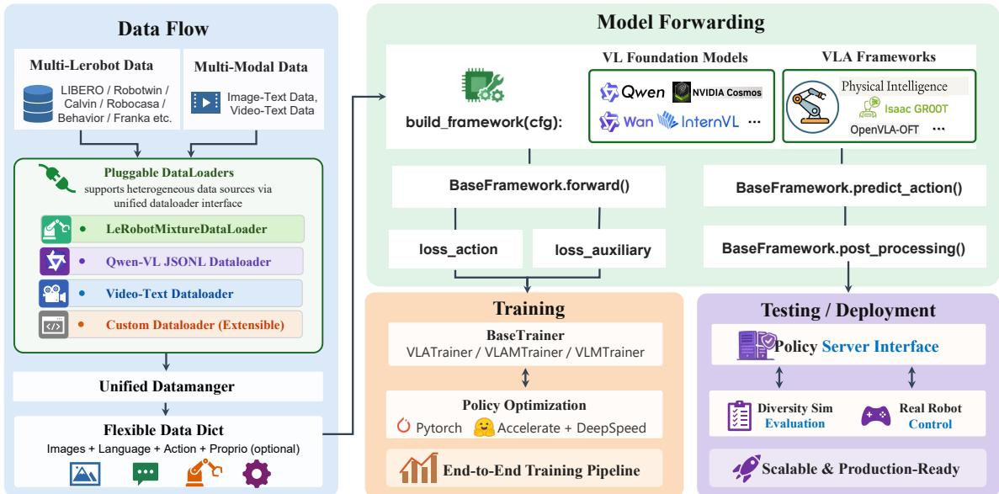

[← 返回 README](../README.md)

# 3. Unified System Pipeline for Model Training and Testing

## 📌 预览

这节讲"训练 + 评测/部署"的统一系统管线。3.1 给出四种训练范式:监督行为克隆(SFT)、多目标联合训练(co-training)、跨本体混合数据联合训练、RL 微调(规划中)。3.2 给出评测与部署:用轻量 server-client 抽象把"模型推理"和"benchmark 评测代码"解耦——模型当 WebSocket policy server,benchmark 当 client,同一 checkpoint 在仿真和真机之间零代码改动复用。

---

The StarVLA codebase supports several practical training regimes for VLA policies, ranging from standard supervised fine-tuning (SFT) on downstream robot datasets to multi-objective co-training with vision–language (VLM) web data and cross-embodiment co-training on mixed robot embodiments. All training pipelines are implemented in explicit PyTorch loops built on Accelerate + DeepSpeed for distributed execution, while preserving a unified YAML configuration interface across methods. Figure 3 summarizes the supported training modes and how data streams connect to the unified model framework.

> 💡 **机制拆解** (claude 批注): 这段是训练系统的"技术栈声明":显式 PyTorch 循环(不是黑盒 Trainer)+ Accelerate + DeepSpeed 做分布式,统一 YAML 配置。"显式 PyTorch 循环"是刻意选择——便于研究者读懂和魔改训练逻辑,符合"降低门槛"的定位。三种训练模式(SFT / co-training / 跨本体)全部共享同一模型框架接口,这是第 2 节模块化的直接兑现。

*Figure 3: Overview of the StarVLA framework. We present a unified and modular pipeline that connects heterogeneous data sources, pluggable dataloaders, and flexible data representations with a standardized model forwarding interface. The framework supports diverse vision-language foundation models and VLA architectures, enabling end-to-end training and deployment.*

> 💡 **Figure 3 批读** (claude 批注): 这张系统总览图把第 2 节的"模型抽象"扩展到"端到端管线"。它想展示的链条是:**异构数据源 → 可插拔 dataloader → 灵活数据表示 → 标准化模型 forward 接口 → 训练/部署**。相比 Figure 2 只画模型内部,Figure 3 把数据侧(混合数据集、跨本体)和下游(部署)都纳进来,说明模块化不止于模型,而是贯穿整条管线。这也是它区别于"只发一个模型"的工作——StarVLA 卖的是整条可复用管线。

---

## 3.1 Training Paradigms

### 3.1.1 Supervised Learning for Behavior Cloning

> 💡 **3.1.1 要点预览** (claude 批注): 最基础的训练模式——机器人数据上的监督学习(行为克隆),从观测+指令预测连续动作。重点看优化设置里的两个工程细节:选择性冻结子模块、多参数组不同学习率。

The most direct training mode is robot-only supervised learning, where the policy is trained to predict continuous actions from observations and language instructions. In our codebase, this training path is implemented in starVLA/training/train\_starvla.py. The objective is the action modeling loss returned by the framework forward() method (e.g., action\_loss in the output dict).

Optimization setup. We support (i) full-parameter fine-tuning and (ii) selective freezing of submodules via trainer.freeze\_modules (comma-separated module paths). To stabilize training across heterogeneous components, the optimizer can use multiple parameter groups with different learning rates (e.g., separate LR for qwen\_vl\_interface and the action model) configured by trainer.learning\_rate. Training uses bfloat16 autocast, gradient accumulation, gradient clipping, and a cosine schedule with a minimum learning rate.

> 💡 **机制拆解** (claude 批注): 这里的优化设置回答"如何稳定地训练一个 backbone+head 的异构模型"。关键是**多参数组不同学习率**:预训练好的 VL backbone(qwen_vl_interface)和从零学的 action model 需要不同 LR——backbone 用小 LR 温和微调保留预训练知识,action head 用大 LR 快速学动作。配合 bfloat16、梯度累积/裁剪、cosine 调度(带最小 LR),这套是当代大模型微调的标准稳定化组合。选择性冻结(freeze_modules)则让研究者能只训 head、冻 backbone,做便宜的对照实验。

### 3.1.2 Multi-Objective Co-Training for Embodied Reasoning

> 💡 **3.1.2 要点预览** (claude 批注): 解决"纯动作 SFT 会让 VLM backbone 过拟合到窄指令分布、遗忘通用视觉推理"的问题。做法:交织机器人动作学习和网页多模态数据上的 VLM loss。这是第 6 节的系统基础。

Robot-only SFT can over-specialize the VLM backbone to a narrow instruction distribution. To preserve general-purpose visual reasoning and language grounding while learning action prediction, StarVLA supports a co-training regime that interleaves robot action learning with a VLM loss on multimodal web data. This mode is implemented in starVLA/training/train\_starvla\_cotrain.py.

Dual-loader multi-objective training scheme. Co-training uses two dataloaders (VLA and VLM) and performs two forward/backward passes per optimization step: (i) a VLA forward pass through the framework forward() to obtain action\_loss, and (ii) a VLM forward pass through qwen\_vl\_interface to obtain the language modeling loss. The VLM loss is scaled by trainer.loss\_scale.vlm in config, enabling a controlled trade-off between action learning and VLM capability retention.

> 💡 **机制拆解** (claude 批注): co-training 的机制是**双 dataloader + 每步两次 forward/backward**:
> - Pass 1: VLA 前向 → `action_loss`(学动作);
> - Pass 2: VLM 前向(走 qwen_vl_interface)→ 语言建模 loss(保能力)。
>
> 关键旋钮是 `loss_scale.vlm`——它控制"学动作 vs 保 VLM 能力"的权衡。调大则更保留多模态推理但可能拖慢动作学习,调小则相反。第 6 节 Figure 4/Table 8 就是在实证这个权衡:纯 VLA 会在 20K 步内让 RefCOCO-g grounding 掉到接近随机,co-training 能救回来。

### 3.1.3 Cross-Embodiment Co-Training with Robot Data Mixtures

> 💡 **3.1.3 要点预览** (claude 批注): 支持跨本体泛化——用统一的 LeRobot mixture 数据集接口,在不同本体/动作约定/相机配置的异构机器人数据上联合训练。核心 claim:把"跨本体预训练"变成一个配置选择,而非专用脚本。

To support cross-embodiment generalization, the codebase provides a unified LeRobot mixture dataset interface that allows training on heterogeneous robot datasets with different embodiments, action conventions, and camera setups. In config, users select a named mixture through datasets.vla\_data.data\_mix, which maps to a list of (dataset name, sampling weight, robot type) tuples. At runtime, the mixture is materialized as a LeRobotMixtureDataset, which samples trajectories across datasets according to the specified weights and tracks embodiment tags based on robot type. This design makes “cross-embodiment pretraining” an operational configuration choice, rather than a bespoke training script.

> 💡 **机制拆解** (claude 批注): 机制是**命名 mixture → (数据集名, 采样权重, 机器人类型) 三元组列表**。运行时物化成 LeRobotMixtureDataset,按权重跨数据集采样轨迹,并按 robot type 打 embodiment tag。这个 embodiment tag 很关键——它让模型知道当前样本来自哪种本体,从而能处理不同 DoF/动作空间(第 7 节用"统一 padding 到 32 维动作向量"配合)。最后一句是本文一贯的设计哲学:把一个原本要写专用脚本的复杂能力,降维成一行配置。

### 3.1.4 Reinforcement Learning Fine-Tuning

Beyond supervised and co-training regimes, we plan to support reinforcement learning (RL) fine-tuning as an extension of the same framework abstraction, collaborating with the RLinf project (https://github.com/ RLinf/RLinf). At the time of writing, RL fine-tuning is an ongoing integration effort; the current public codebase focuses on supervised and co-training pipelines to build up a strong robotic foundation model.

> 💡 **机制拆解** (claude 批注): 注意这里如实说明 RL 微调**尚未完成**,仍在与 RLinf 项目集成中,当前公开代码只覆盖 SFT 和 co-training。这是本文诚实的一处——不把规划中的能力当作已交付。对读者的含义:如果想用 StarVLA 做 RL 微调,现在还不能开箱即用。

---

## 3.2 Evaluation and Deployment

### 3.2.1 Unified Server-Client Evaluation Across Benchmarks

> 💡 **3.2.1 要点预览** (claude 批注): 评测层的核心设计——server-client 解耦。为什么需要?因为 LIBERO/SimplerEnv/RoboTwin 各自带不同的仿真依赖栈和控制循环,塞进模型代码会互相污染。解法:模型当 WebSocket policy server,benchmark 评测器(可在另一个 conda 环境)当 client。

StarVLA adopts a thin server–client testing abstraction so that benchmark-side evaluation code remains close to the official implementations, while model-side inference is standardized. In practice, a checkpoint is loaded by baseframework.from\_pretrained() and hosted as a lightweight WebSocket policy server in the StarVLA runtime environment. The benchmark evaluator, which may live in a different conda environment with its own simulator dependencies, interacts with the model through a small client wrapper rather than importing framework code directly. This decoupling is particularly useful for benchmarks such as LIBERO, SimplerEnv, and RoboTwin, whose official evaluators each carry different dependency stacks and control loops.

> 💡 **机制拆解** (claude 批注): server-client 解耦解决的是"依赖地狱":benchmark 官方评测器往往锁死某些仿真器版本,和模型的 PyTorch/CUDA 环境冲突。传统做法要么改 benchmark 代码,要么装不上。StarVLA 让**模型进程和 benchmark 进程各自活在独立 conda 环境**,通过 WebSocket 通信——benchmark 端只需一个 client wrapper,不 import 框架代码。好处双重:(1) benchmark 评测代码保持贴近官方实现(评测忠实、可比),(2) 模型侧推理标准化。这是评测层碎片化的直接解药。

Inference interface. All framework variants expose the same inference entry point, Framework.predict\_action(), and the server forwards incoming payload dictionaries to this method with minimal routing logic. The benchmark-side client packages observations into a single dictionary, typically containing image (single- or multi-view RGB observations), lang (task instruction), and optional fields such as state, timestamps, or episode metadata. The payload is serialized with msgpack and sent to the policy server, which returns a dictionary containing model outputs such as normalized\_actions. Because the communication contract is action-head-agnostic, switching from OFT to FAST, π, or GR00T does not require modifying benchmark code.

> 💡 **机制拆解** (claude 批注): 通信契约的关键词是 **action-head-agnostic(与 action head 无关)**。client 打包成一个字典(image / lang / 可选 state、timestamp),用 msgpack 序列化发给 server,server 返回含 normalized_actions 的字典。因为这个契约不关心 head 是哪种,所以从 OFT 换到 FAST/π/GR00T **benchmark 代码一行都不用改**——这正是第 2 节"head 可插拔"在评测层的兑现。normalized_actions(归一化动作)交由 benchmark adapter 反归一化,见下段。

Benchmark-specific adapters. In StarVLA, benchmark differences are isolated in lightweight interface files such as model2libero\_interface.py, model2simpler\_interface.py, and model2robotwin\_interface.py. These adapters translate raw environment observations into the common StarVLA example format and post-process returned actions into the benchmark’s native control API. Typical responsibilities include resizing images to the training resolution, reading dataset\_statistics.json from the checkpoint directory for action unnormalization, converting chunked normalized predictions into executable actions, applying action ensembling, and handling benchmark-specific conventions such as sticky grippers or delta/relative-to-absolute action conversion. This design keeps the core policy server benchmark-agnostic while preserving faithful evaluation under each official protocol.

> 💡 **机制拆解** (claude 批注): benchmark 之间不可避免的差异被隔离进轻量 adapter 文件(model2libero / model2simpler / model2robotwin)。adapter 的职责清单很实用,值得记住 VLA 部署的"最后一公里"都干些什么:
> - 把原始观测翻译成 StarVLA 通用 example 格式;
> - 读 checkpoint 里的 `dataset_statistics.json` 做动作**反归一化**;
> - 把 chunked 归一化预测转成可执行动作;
> - action ensembling(动作集成,平滑多次预测);
> - 处理 benchmark 专属约定:sticky gripper(粘滞夹爪)、delta/相对→绝对动作转换。
>
> 这样 core policy server 保持 benchmark 无关,而每个官方协议的忠实性由各自 adapter 保证。

### 3.2.2 Deployment on Real Robots

> 💡 **3.2.2 要点预览** (claude 批注): 真机部署复用同一套 client-server 契约——机器人控制器扮演 benchmark client 的角色。核心 claim:同一 checkpoint 在仿真和真机之间零代码改动。

The same client-server contract also supports real-robot or hosted-benchmark deployment. In this setting, the robot controller plays the role of the benchmark client: it captures camera observations, assembles the same example dictionary used in simulation, queries the remote policy server, and executes the returned action on hardware. As a result, the control loop, safety logic, and device-specific middleware remain outside the StarVLA model runtime, while the model service remains unchanged.

Deployment interface. This separation makes deployment much less intrusive. The model stack can stay in a GPU-oriented inference environment, whereas the robot-side process can remain integrated with vendor SDKs, ROS nodes, or hosted evaluation platforms such as RoboChallenge. More importantly, the exact same checkpoint can be reused across simulation and real-robot settings as long as the client provides observations in the agreed dictionary format and applies the appropriate benchmark- or robot-specific post-processing. In this sense, StarVLA treats deployment as a continuation of the same testing paradigm rather than as a separate engineering path.

> 💡 **机制拆解** (claude 批注): 真机部署的巧思:机器人控制器 = 另一个 client。它采图、打包成和仿真**一模一样的 example 字典**、查询远端 server、把返回动作执行到硬件。结果是控制循环、安全逻辑、设备中间件全部留在 StarVLA 模型运行时**之外**——模型侧完全不变。这带来两个实际好处:(1) 模型栈住在 GPU 推理环境,机器人侧住在 ROS/厂商 SDK 环境,互不干扰;(2) 同一 checkpoint 仿真真机通用。呼应了摘要"closing the gap between research and deployment"——部署不是另起炉灶,而是评测范式的自然延续。

> 💡 **Q&A 批注记录** (claude 批注):
> - Q: server-client 解耦最实际的价值是什么?为什么不直接把 benchmark 代码 import 进来?
> - A: 因为不同 benchmark(LIBERO/SimplerEnv/RoboTwin)锁死不同的仿真器依赖栈,直接 import 会导致依赖冲突装不上。解耦让模型和 benchmark 各活在独立 conda 环境(§3.2.1),benchmark 端只需 client wrapper。且通信契约 action-head-agnostic,换 head 不改 benchmark 代码;真机部署也只是把机器人控制器当 client(§3.2.2),同一 checkpoint 零改动复用。

> 💡 **Section 总结** (claude 批注):
> - **四种训练范式**: SFT(行为克隆)/ 多目标 co-training / 跨本体 mixture / RL 微调(规划中,未交付)。
> - **关键变量/旋钮**: `freeze_modules`(选择性冻结)、多参数组 LR、co-training 的 `loss_scale.vlm`(动作 vs VLM 能力权衡)、`data_mix`(跨本体三元组 + embodiment tag)。
> - **评测/部署核心**: 轻量 server-client;模型当 WebSocket server,benchmark/机器人当 client;通信契约 action-head-agnostic;benchmark 差异隔离进 adapter。
> - **核心洞察**: "部署 = 评测范式的延续",同一 checkpoint 仿真↔真机零代码改动。
> - **可追问点**: 这套管线在具体 benchmark 上跑出什么数字?见第 4 节(benchmark 介绍)和第 5 节(结果)。
