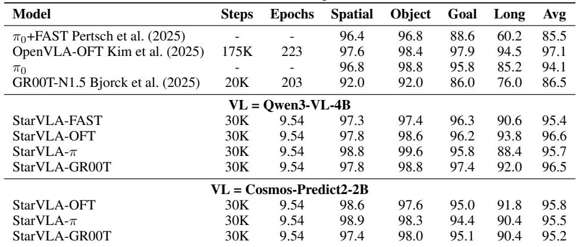
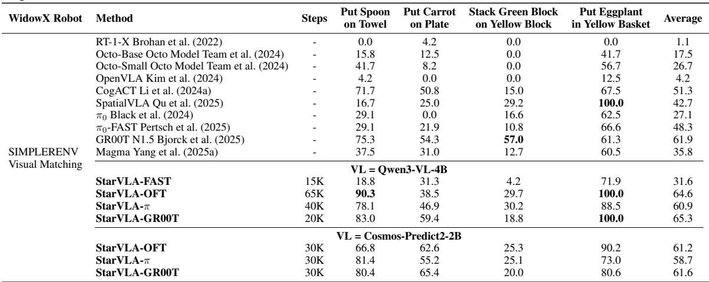
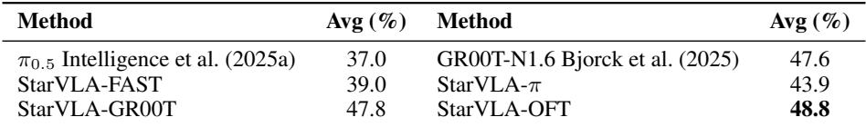
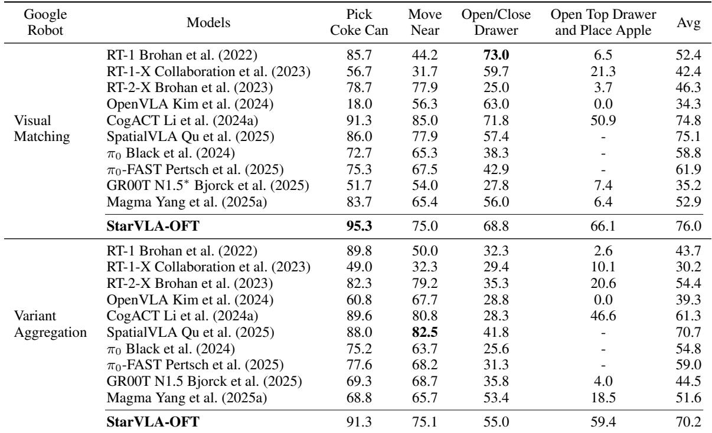
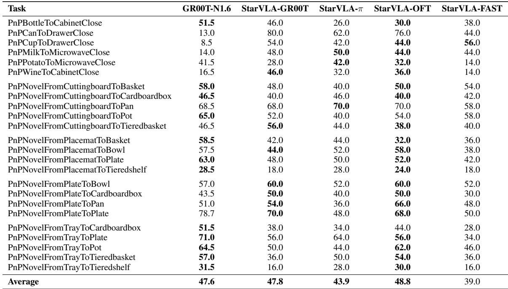
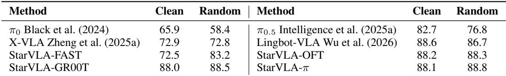

[← 返回 README](../README.md)

# 5. Single-Benchmark Training Examples

## 📌 预览

这是"specialist(专才)"实验主线:每个 benchmark 单独训练一个模型,用最干净的极简 SFT 配方(无 VLA 预训练、无数据增强、无 DAgger),只为提供透明、可复现的参考锚点。逐个 benchmark 报结果:5.1 LIBERO、5.2 SimplerEnv、5.3 RoboCasa-GR1、5.4 RoboTwin 2.0。核心 claim:极简配方 + 少得多的训练步数,已 match/surpass 强 baseline,且换 backbone(Qwen3-VL ↔ Cosmos-Predict2)性能相当。

---

In this section, we report single-benchmark SFT results to establish transparent, reproducible reference points under official evaluation protocols. To provide the community with the cleanest possible baselines, we deliberately avoid any VLA-specific pretraining (e.g., large-scale robot pretraining mixtures), data augmentation, or online refinement techniques such as DAgger. Every model is initialized from publicly released VL pretrained weights and fine-tuned exclusively on the benchmark’s standard demonstration dataset. These minimal-assumption results serve as reliable anchor points for future research: they make it straightforward to measure the marginal value of additional pretraining data, augmentation strategies, or co-training recipes.

> 💡 **问题动机** (claude 批注): 这段界定了实验哲学——**刻意做最弱假设的 baseline**。故意不用三样常见涨点手段:大规模机器人预训练混合、数据增强、DAgger(在线精修)。为什么故意"自废武功"?因为目标不是刷 SOTA,而是提供**干净锚点**:未来任何人加了预训练/增强/co-training,都能拿这个锚点量化"边际增益"。这是把论文定位成"平台+基线提供者"而非"又一个 SOTA 方法"的关键姿态,读实验数字时要带着这个前提——很多数字略低于满配 SOTA 是设计使然,不是缺陷。

---

## 5.1 Results on LIBERO

> 💡 **5.1 要点预览** (claude 批注): LIBERO 作为第一个"跑通全流程"的样例,把数据加载→训练→评测每一步都交代清楚以便复现。核心结果:StarVLA 用约 10 epoch(30K steps)就 match/surpass 训练 223 epoch 的 OpenVLA-OFT,数据效率极高;换 Cosmos backbone 也保持 ≥95.2%。

LIBERO (Liu et al., 2024a) is a widely used tabletop manipulation benchmark comprising four task suites of increasing difficulty: Spatial, Object, Goal, and Long. We treat it as the first worked example of our single-benchmark pipeline and walk through every step—data loading, training, and evaluation—so that readers can fully reproduce our numbers.

Training data format. To maintain a simple and reproducible baseline, we adopt minimal data engineering and follow the benchmark’s native schema.

• Input: a raw sample dict loaded directly from the LeRobot-format dataset, containing the primary (third-person) RGB view and the wrist-camera RGB view. We do not use proprioceptive state, history stacking, or image augmentation for this baseline.

• Output: a continuous end-effector (EEF) control action vector following the LIBERO action definition with action chunking= 8.

> 💡 **机制拆解** (claude 批注): 数据格式极简到刻意:输入只用两路 RGB(第三人称 + 腕部相机),**不用本体状态、不做历史堆叠、不做图像增强**;输出是连续 EEF 控制向量,action chunking=8(一次预测 8 步动作,对应第 2 节公式的 $\mathbf{a}_{t:t+k}$)。这个"能省则省"的配置正是极简 baseline 哲学的落地——任何后续增强的收益都能相对这个裸配置来度量。

Training setup. We train the LIBERO baseline using distributed training with 8 A100 GPUs (via accelerate + DeepSpeed ZeRO-2). Unless otherwise specified, the per-device batch size is 16 and training runs for 100K optimization steps. Checkpoints are saved every 10K steps, with periodic logging and evaluation during training. For transparency and exact reproducibility (full command line, YAML configuration, and environment variables),we provide the complete training scripts under examples/LIBERO/train\_files/. We train a single policy jointly on four LIBERO suites (Spatial, Object, Goal, and LIBERO-10) using the corresponding LeRobot-format datasets: They are available as a public collection at https: //huggingface.co/collections/IPEC-COMMUNITY/libero-benchmark-dataset.

Evaluation protocol. We evaluate on the four suites (Spatial, Object, Goal, and LIBERO-Long) using the official LIBERO evaluation scripts and report success rate. We periodically evaluate checkpoints (every 10K steps by default) and report the earliest checkpoint that achieves the best average success rate. For each suite, we run 10 tasks with 50 episodes per task (500 trials total) and report the mean success rate over all trials. To ensure reproducibility without modifying benchmark logic, we provide the complete evaluation scripts and launch instructions under examples/LIBERO/eval\_files/.

> 💡 **机制拆解** (claude 批注): 两个评测细节值得注意:(1) **一个策略联合训四套件**(不是四个专用模型),更贴近多任务真实场景;(2) 报"最早达到最佳平均成功率的 checkpoint"——这是诚实的做法,避免用后期过拟合 checkpoint 挑数字。每套件 10 任务 × 50 episode = 500 trial,统计量足够。

Results and analysis. Table 2 summarizes the LIBERO baseline performance. Using only 30K steps (∼10 epochs), StarVLA already matches or surpasses several strong published baselines. For instance, OpenVLA-OFT trains for 175K steps (223 epochs) to reach 97.1% average, whereas StarVLA-OFT achieves 96.6% (Qwen3-VL) and 95.8% (Cosmos-Predict2-2B) with 6× fewer steps and 23× fewer epochs. π +FAST and GR00T-N1.5 score 85.5% and 86.5% respectively, both considerably below our variants. Notably, replacing the VL backbone from Qwen3-VL-4B to Cosmos-Predict2-2B yields comparable performance (average ≥95.2% across all action heads), demonstrating that StarVLA generalizes well across different VL backbones. These comparisons suggest that the StarVLA pipeline is highly data-efficient on LIBERO.

*Table 2: Comparison of different VLA models on LIBERO. We train one policy for all 4 suites. All scores are averaged over 500 trials for each task suite (10 tasks × 50 episodes).*

> 💡 **Table 2 批读** (claude 批注): 这张表支撑两个 claim,证据链要分开看:
> - **数据效率**: StarVLA-OFT(Qwen3-VL)30K steps / 9.54 epochs → 96.6% avg,而 OpenVLA-OFT 需 175K steps / 223 epochs → 97.1%。用 **6× 更少 step、23× 更少 epoch** 达到相差仅 0.5 个点的水平。这就是"data-efficient"的实证。
> - **backbone 无关性**: 把 backbone 从 Qwen3-VL-4B 换成 Cosmos-Predict2-2B(world model),所有 head 平均 ≥95.2%(OFT 95.8 / π 95.5 / GR00T 95.2)。换句话说**换一整类 backbone 掉点很小**,这是第 1 节"generalized VLA perspective"的直接证据。
> - **对照弱项**: π0+FAST(85.5)和 GR00T-N1.5(86.5)明显低,主要拖在 Long 套件(60.2 / 76.0),再次印证长时序是难点。StarVLA-OFT 在 Long 上 93.8,大幅领先。
>
> 一个要点:StarVLA-π 在 Spatial/Object 上极高(98.8/99.6)但 Long 只有 88.4,说明 flow-matching head 擅长精确定位但长时序稳定性略逊于 OFT/GR00T。

---

## 5.2 Results on SimplerEnv

> 💡 **5.2 要点预览** (claude 批注): SimplerEnv 用真实数据(Bridge+Fractal)训练、仿真评测。两个平台分开报:WidowX(VM)和 Google Robot(VM/VA)。核心结果:Qwen3-VL 最高 65.3%,Cosmos 最高 61.6%,再次确认 backbone 无关;Google Robot 上 StarVLA-OFT 达 76.0%(VM)与强 baseline 持平或更好。

Training setup. All models are trained with full-parameter fine-tuning using distributed training on 16 A100 GPUs. Unless otherwise specified, the per-device batch size is 16 and training runs for 100K optimization steps. Checkpoints are saved every 10K steps, with periodic logging and evaluation during training. For transparency and exact reproducibility (full command line, YAML configuration, and environment variables), we provide the complete training scripts under examples/SimplerEnv/train\_files/. We train SimplerEnv baselines on a merged mixture of Bridge and Fractal datasets in LeRobot format: https://huggingface.co/datasets/IPEC-COMMUNITY/bridge\_orig\_lerobot and https:// huggingface.co/datasets/IPEC-COMMUNITY/fractal20220817\_data\_lerobot.

Evaluation protocol. We evaluate using the official SimplerEnv evaluation workflow and report the task success rate. We present detailed per-task results under two standard SimplerEnv settings: (i) WidowX robot with Visual Matching (VM) in Table 3, and (ii) Google Robot in Table 4. We strictly follow the official protocol for per-task repeats/episodes and success-rate aggregation without modifying benchmark logic. Since SimplerEnv evaluation can exhibit non-trivial variance, we run each reported setting five times (each time rerunning the full official evaluation) and report the mean success rate. To ensure reproducibility without modifying benchmark logic, we provide the complete evaluation scripts and launch instructions under examples/SimplerEnv/eval\_files/.

> 💡 **机制拆解** (claude 批注): 注意一个方法学上的严谨点:SimplerEnv 评测方差不小,所以作者**每个设置重跑 5 次完整官方评测取均值**。这在 VLA 论文里不常见但很重要——单次跑的成功率可能因随机初始条件波动几个点。重跑取均值让 Table 3/4 的对比更可信。训练数据用真实机器人数据(Bridge+Fractal),这也是为什么 SimplerEnv 能当"真机代理"。

Results. Tables 3 and 4 summarize the SimplerEnv performance. On WidowX (VM), StarVLA with Qwen3- VL-4B achieves a strong average success rate (up to 65.3%), while the Cosmos-Predict2-2B backbone also delivers competitive results (up to 61.6%), confirming that StarVLA generalizes across different VL backbones. Both configurations show consistently high performance on the most structured task and a remaining gap on object placement tasks. On Google Robot, StarVLA is competitive with or better than strong recent baselines under the Visual Matching setting, and remains comparable under Variant Aggregation, suggesting that the policy transfers robustly across standardized simulation evaluation settings.

*Table 3: Detailed results on the SimplerEnv WidowX benchmark (Visual Matching). Steps denote optimization steps; all numbers are success rates (%).*

> 💡 **Table 3 批读** (claude 批注): WidowX(VM)四个子任务成功率。要点:
> - **StarVLA-GR00T(Qwen3-VL)平均 65.3%** 最高,StarVLA-OFT 64.6% 次之,都显著超过 GR00T N1.5(61.9)、π0-FAST(48.3)等 baseline。
> - **任务难度分化明显**: "Put Eggplant in Yellow Basket"这个最结构化的任务大家都高(StarVLA 常 88–100%),但"Stack Green Block on Yellow Block"这类需精确堆叠/放置的任务普遍低(18–30%)——这就是原文说的"structured task 高、object placement 有 gap"。
> - Cosmos backbone 最高 61.6%(GR00T 变体),与 Qwen3-VL 差距约 4 点,依然 competitive。注意 StarVLA-FAST 只有 31.6%,再次显示离散 head 在这类任务上偏弱。

> 💡 **排版说明** (claude 批注): Table 4(SimplerEnv Google Robot)在 PDF 原文中因分页被排到了 5.3–5.4 节之间,本笔记按其内容归属放在下方 5.4 节附近集中展示,批读见该处。

---

## 5.3 Results on RoboCasa-GR1

> 💡 **5.3 要点预览** (claude 批注): RoboCasa-GR1 是人形桌面操作,难度陡增,且 **action head 的选择影响被放大**。核心结果:离散 FAST 39.0%,连续变体 43.9–48.8%,StarVLA-OFT 最佳(48.8%),超过 π0.5 达 11.8 点。

Training setup. We train the RoboCasa-GR1 baselines with distributed full-parameter fine-tuning on 16 A100 GPUs. Unless otherwise specified, the per-device batch size is 16 and training runs for up to 100K optimization steps. Checkpoints are saved every 10K steps, with periodic logging and evaluation during training. For the specialist setting, we use the official RoboCasa-GR1 tabletop release and train one model jointly across all 24 tasks from this benchmark only. This keeps the policy architecture fixed while treating RoboCasa as a multi-task humanoid-style manipulation suite rather than 24 separate single-task runs.

Evaluation protocol. We follow the official RoboCasa-GR1 evaluation workflow and report average success rate over the 24 tasks. For the architecture comparison in this section, each model is evaluated with 50 rollouts per task. Table 6 further reports the task-level success rates for representative baselines and StarVLA variants.

Results. Table 5 summarizes the average RoboCasa-GR1 performance for the single-benchmark setting. This benchmark is noticeably harder than LIBERO and SimplerEnv, and the choice of action head matters more: the discrete StarVLA-FAST baseline reaches 39.0%, while the continuous-action variants improve to 43.9–48.8%. Among the StarVLA variants, StarVLA-OFT performs best with a 48.8% average success rate, slightly exceeding StarVLA-GR00T (47.8%) and outperforming $\pi_{0.5}$ by 11.8 points. Detailed task-level results are reported in Table 6. We defer cross-benchmark generalist results to Sec. 7.

*Table 5: Average success rate on RoboCasa-GR1 (24 tasks) under the single-benchmark training setting.*

> 💡 **Table 5 批读** (claude 批注): 这张小表是"离散 vs 连续 head"最干净的对照,因为 RoboCasa 难度高把差异放大了:
> - 离散 **StarVLA-FAST 39.0%** vs 连续 **StarVLA-OFT 48.8% / GR00T 47.8% / π 43.9%**——连续动作在复杂人形操作上系统性优于离散 tokenize,差距近 10 个点。
> - StarVLA-OFT(48.8)超 π0.5(37.0)达 11.8 点,超 GR00T-N1.6(47.6)。
> - 一个有意思的点:最简单的 head(OFT 只是个 MLP 回归)反而最强,说明在数据充足的多任务设置下,复杂的 flow-matching 未必带来额外收益——简单 head + 好 backbone 已足够。

---

## 5.4 Results on Robotwin 2.0

> 💡 **5.4 要点预览** (claude 批注): RoboTwin 2.0 是双臂协调。核心结果:Qwen3-VL 下四个变体都拿到强成绩,且 randomized 常高于 clean,证明端到端管线(数据→训练→评测)可靠可复现。

Training setup. We train the RoboTwin 2.0 baseline using distributed training with 48 A100 GPUs (via accelerate + DeepSpeed ZeRO-2). Unless otherwise specified, the per-device batch size is 4 and training runs for 150K optimization steps. Checkpoints are saved every 10K steps, with periodic logging and evaluation during training. For transparency and exact reproducibility (full command line, YAML configuration, and environment variables), we provide the complete training scripts under examples/Robotwin/train\_files/. We train RoboTwin 2.0 baselines on official clean and randomized datasets in LeRobot format: https://huggingface.co/datasets/StarVLA/RoboTwin-Clean and https://huggingface.co/datasets/StarVLA/RoboTwin-Randomized.

*Table 4: Detailed results on the SimplerEnv Google Robot benchmark. Numbers are officially reported unless marked with ∗, which denotes our reimplementation. We report StarVLA-OFT with Qwen3-VL-4B as a representative configuration due to the high evaluation cost on this platform.*

> 💡 **Table 4 批读** (claude 批注): Google Robot 分 Visual Matching(VM)和 Variant Aggregation(VA)两块。因为这个平台评测成本高,作者只报 **StarVLA-OFT(Qwen3-VL)** 一个代表配置:
> - **VM 下 StarVLA-OFT 76.0%**,超过 CogACT(74.8)、SpatialVLA(75.1)、所有 RT 系列,是表内最高。
> - **VA 下 StarVLA-OFT 70.2%**,与 SpatialVLA(70.7)基本持平,显著超 π0-FAST(59.0)、GR00T N1.5(44.5)。
> - 特别看"Open Top Drawer and Place Apple"(最难的复合任务):StarVLA-OFT VM 66.1、VA 59.4,远超大多数 baseline(很多是个位数或 0)。这说明 StarVLA 在长链复合任务上尤其稳。带 ∗ 的是作者复现的数字(如 GR00T N1.5*),其余为官方报告值。

Evaluation protocol. We evaluate on the 50 tasks using the official RoboTwin 2.0 evaluation scripts and report success rate. We periodically evaluate checkpoints (every 10K steps by default) and report the earliest checkpoint that achieves the best average success rate. For each suite, we run 50 tasks with 100 episodes per task under clean and randomized condition (10000 trials total) and report the mean success rate over all trials. To ensure reproducibility without modifying benchmark logic, we provide the complete evaluation scripts and launch instructions under examples/Robotwin/eval\_files/.

Results. Table 7 summarizes the RoboTwin baseline performance. Under Qwen3-VL-4B backbones, all four StarVLA variants achieve strong average success rates when trained as a single unified policy over 50 tasks, demonstrating that our end-to-end baseline pipeline (data → training → evaluation) is reliable and reproducible.

*Table 6: RoboCasa GR1 Tabletop Tasks Evaluation Results. A single model was trained for all 24 tasks. Results are reported over 50 rollouts per task (average success rate with 250 rollouts: 48.97%).*

> 💡 **Table 6 批读** (claude 批注): 这是 RoboCasa-GR1 的**任务级明细**(24 个 PnP 拾放任务),用来支撑 Table 5 的平均值不是靠个别任务撑起来的。观察:
> - StarVLA 各变体在不同任务上互有胜负(如 GR00T 在 PnPCanToDrawerClose 80% 领先,OFT 在 PnPNovelFromPlateToPan 66% 领先),没有一个变体全面碾压——这说明 head 选择的最优值有任务依赖性。
> - GR00T-N1.6(外部 baseline)在某些任务(PnPBottleToCabinetClose 51.5、PnPNovelFromTrayToPlate 71.0)很强,但平均(47.6)仍略低于 StarVLA-OFT(48.8)。
> - 最后一行 Average 对齐 Table 5;注 caption 说 250 rollouts 下平均 48.97%,与 50 rollouts 的 48.8% 一致,说明结果对 rollout 数稳健。

*Table 7: Detailed results on the RoboTwin 2.0 benchmark. We report different StarVLA model architecture on this platform.*

> 💡 **Table 7 批读** (claude 批注): RoboTwin 2.0 双臂,分 Clean/Random 两列。关键观察:
> - **四个 StarVLA 变体的 Random 都 ≥ Clean**(如 FAST 72.5→83.2,OFT 88.2→88.3,GR00T 88.0→88.5,π 88.1→88.8)。这个反直觉现象说明:randomized 训练数据(域随机)带来的多样性反而提升了泛化,而 clean-only 更易过拟合。
> - 连续变体(OFT/GR00T/π)都在 88 左右,追平甚至接近专门的 Lingbot-VLA(88.6/86.7),大幅超过 π0(65.9/58.4)、X-VLA(72.9/72.8)。
> - 又一次:离散 FAST(72.5/83.2)是四者里最弱,连续动作在双臂协调上优势明显。

> 💡 **Q&A 批注记录** (claude 批注):
> - Q: 贯穿第 5 节,为什么离散的 StarVLA-FAST 几乎在每个 benchmark 都垫底?
> - A: FAST 把连续动作离散成 token 再自回归生成,精度受 tokenizer 分辨率限制,且自回归易累积误差;在越难/越需精确控制的 benchmark(RoboCasa 39% vs 连续 48.8%;WidowX 31.6% vs 65.3%)差距越大。连续 head(回归/flow-matching)直接输出连续量,精度更高。这是本文一条稳定的横向证据。
> - Q: 换 backbone(Qwen3-VL→Cosmos)几乎不掉点,能说明什么?
> - A: 说明 StarVLA 的模块化不是纸面能力——world-model backbone 和 VLM backbone 在相同 head/训练/评测下给出可比成绩(LIBERO ≥95.2%,WidowX 最高 61.6%),支撑了"generalized VLA perspective":两类 backbone 是同框架下可互换的组件。

> 💡 **Section 总结** (claude 批注):
> - **关键数字**: LIBERO StarVLA-OFT 96.6%(30K steps,vs OpenVLA-OFT 175K steps/97.1%);SimplerEnv WidowX 最高 65.3%、Google Robot VM 76.0%;RoboCasa 最佳 48.8%(超 π0.5 11.8 点);RoboTwin 最高 88.8%(random)。
> - **两条横向证据链**: (1) 连续 head(OFT/π/GR00T)系统性优于离散 head(FAST),越难的 benchmark 差距越大;(2) VLM backbone ↔ world-model backbone 换用性能相当,证实模块化与广义 VLA 视角。
> - **核心洞察**: 极简配方 + 少 6–20× 训练量已 match/surpass 满配 baseline,证明"干净基线已经很强";最简单的 OFT head 常常最优。
> - **可追问点**: 加了 co-training 会怎样?一个模型跨所有 benchmark(generalist)能否成立?见第 6、7 节。
