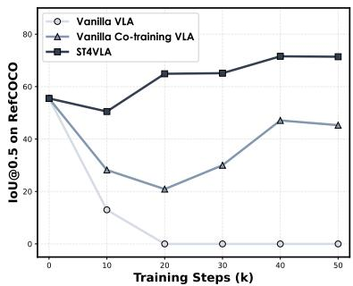
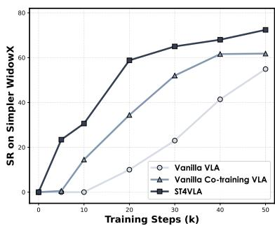
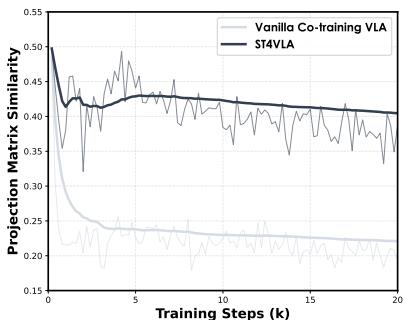
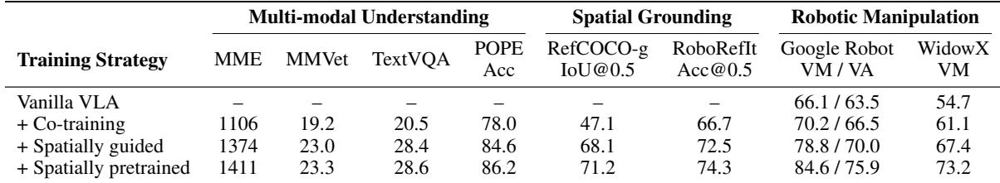

[← 返回 README](../README.md)

# 6. Multimodal Co-Training Examples

## 📌 预览

这节实证第 3.1.2 节的 co-training 机制。核心问题:纯动作 SFT 会让 VLM backbone 在几千步内"遗忘"预训练的视觉/语言能力(物体 grounding、指令跟随、场景理解全掉),而这些恰是稳健操作的前提。解法:混入多模态 grounding 数据联合训练维持感知通路的梯度流。以基于 StarVLA 的 ST4VLA(Ye et al., 2026a)研究为案例,对比三种策略,给出 Figure 4(动态曲线)和 Table 8(多维指标)。

---

Beyond single-benchmark supervised fine-tuning, StarVLA natively supports multimodal co-training, in which the VLM backbone is jointly optimized on both robot action data and auxiliary vision-language tasks (e.g., spatial grounding, visual question answering, and captioning). The motivation is twofold: (i) action-only finetuning can rapidly degrade the pre-trained multimodal representations, undermining instruction comprehension and spatial reasoning; and (ii) co-training with carefully curated auxiliary data can align the optimization dynamics of perception and control, leading to better-performing policies.

> 💡 **问题动机** (claude 批注): co-training 的两条动机要分清:(i) **防遗忘**——纯动作微调会毁掉预训练多模态表征;(ii) **正向对齐**——精心挑选的辅助数据能让"感知优化"和"控制优化"的动力学对齐,不只是防守,还能主动涨点。第二条更强:co-training 不是"补丁",而是能提升 policy 本身的训练策略。这对应第 2 节公式里的 $\mathcal{L}_{\text{aux}}$——co-training 相当于给 VLM-based VLA 加语言对齐辅助目标。

When a pre-trained VLM is fine-tuned exclusively on action prediction, it tends to “forget” pre-trained visual and linguistic capabilities within thousands of steps. This manifests as degraded object grounding, instruction following, and scene understanding, all of which are prerequisites for robust manipulation. Cotraining with multimodal grounding data counteracts this forgetting by maintaining the gradient flow through perception-relevant pathways.

> 💡 **机制拆解** (claude 批注): 关键机制词是 **maintaining the gradient flow through perception-relevant pathways(维持感知相关通路的梯度流)**。纯动作 loss 的梯度只流经"动作预测"相关参数,感知通路长期收不到有意义梯度就退化。混入 grounding 数据后,VLM loss 的梯度重新流过感知通路,把它"钉住"不漂移。"within thousands of steps"是个警示数字——遗忘发生得很快,Figure 4 显示 20K 步内 grounding 就掉到接近随机。

---

## 6.1 Experimental Setup

> 💡 **6.1 要点预览** (claude 批注): 交代 co-training 的配置能力(任意混合动作数据 + VLM QA 数据,框架自动处理 tokenize/loss masking/梯度累积)和评测设置(对比三种策略:Vanilla VLA / Vanilla co-training / Spatially guided)。

Co-training setup. StarVLA provides built-in support for mixing heterogeneous data sources during training. Users can specify arbitrary combinations of action datasets and VLM-style QA datasets in a single configuration file; the framework handles tokenization, loss masking, and gradient accumulation transparently across data types. This makes it straightforward to reproduce co-training recipes, for instance, mixing OXE action data with RefCOCO spatial grounding or LLaVA-style visual QA data, without modifying the training loop.

> 💡 **机制拆解** (claude 批注): 框架替用户处理三件跨数据类型的脏活:**tokenization**(动作 chunk 和文本 QA 的 token 化方式不同)、**loss masking**(哪些 token 算 loss——动作样本只算动作 loss,QA 样本只算语言 loss)、**梯度累积**(两类数据的梯度如何合并)。用户只需在一个配置文件里写"混哪些数据集",不用改训练循环。举例:OXE 动作数据 + RefCOCO 空间 grounding + LLaVA 风格视觉 QA。这是第 3.1.2 节双 loader 机制的用户视角。

Evaluation and baselines. To illustrate the effect, we summarize a spatially guided co-training study built on the StarVLA codebase (Ye et al., 2026a). This study compares three training strategies: (1) Vanilla VLA, which fine-tunes only on action data, (2) Vanilla co-training VLA, which jointly optimizes on spatial grounding and action data, and (3) Spatially guided training VLA, which additionally incorporates spatial pre-training and spatial prompting during co-training.

> 💡 **机制拆解** (claude 批注): 三种策略是递进的消融阶梯,读 Figure 4/Table 8 时对号入座:
> 1. **Vanilla VLA**: 只训动作数据(基线,会遗忘)。
> 2. **Vanilla co-training**: 动作 + 空间 grounding 联合(防遗忘,但不稳定)。
> 3. **Spatially guided**: 在 co-training 基础上再加空间预训练 + 空间 prompting(最佳)。
>
> 注意本节是**引用一个基于 StarVLA 的独立研究(ST4VLA)**作为案例,而非本文自己的新方法——这符合"平台论文"定位:展示平台能支撑这类研究,细节留给 ST4VLA 论文。

---

## 6.2 Main Results for Multimodal Co-training

> 💡 **6.2 要点预览** (claude 批注): Figure 4 给动态(感知-动作随训练步的协同演化 + 梯度子空间对齐),Table 8 给终值(多模态理解/空间 grounding/操作三类指标)。核心结论:spatially guided 在保住 ~70% grounding 的同时拿到最强操作成绩。

Figure 4 visualizes the interaction between spatial perception (measured by IoU@0.5 on RefCOCO-g) and manipulation performance (WidowX success rate) across training steps. Vanilla VLA suffers rapid perception degradation: RefCOCO-g performance drops to near-random levels within 20K steps. Vanilla co-training partially preserves perception but exhibits unstable oscillations. The spatially guided StarVLA (ST4VLA (Ye et al., 2026a)) variant achieves the best balance, maintaining ∼70% of original grounding performance while reaching strong manipulation success.

<table><tr>
<td width="33%"></td>
<td width="33%"></td>
<td width="33%"></td>
</tr><tr>
<td align="center"><i>(a) Perception Performance</i></td>
<td align="center"><i>(b) Manipulation Performance</i></td>
<td align="center"><i>(c) Projection-Space Similarity</i></td>
</tr></table>

*Figure 4: Perception–action co-optimization dynamics under different co-training strategies (reproduced from a StarVLA-based spatially guided co-training study ST4VLA (Ye et al., 2026a)). From left to right: (a) spatial grounding performance (IoU@0.5 on RefCOCO-g); (b) manipulation success rate (WidowX); (c) gradient subspace alignment (PSS) between spatial grounding and action objectives under vanilla co-training vs. spatially guided co-training.*

> 💡 **Figure 4 批读** (claude 批注): 三张子图构成一条完整的"机制诊断"证据链,不要只看结论看曲线形状:
> - **(a) 感知**: Vanilla VLA 的 RefCOCO-g IoU 在 20K 步内**崩到接近随机**(灾难性遗忘的直接可视化);Vanilla co-training 部分保住但**震荡不稳**;Spatially guided 稳定维持约 70% 原始 grounding。
> - **(b) 操作**: 三者的 WidowX 成功率——spatially guided 不仅感知最好,操作也最强,说明"保住感知"和"操作变强"是正相关而非权衡。
> - **(c) 投影空间相似度(PSS,梯度子空间对齐)**: 这是本组图的机制解释——它度量"空间 grounding 目标"和"动作目标"的梯度子空间有多对齐。vanilla co-training 对齐差(两个目标互相打架),spatially guided 对齐好。这就解释了为什么 (a)(b) 里 spatially guided 更稳:梯度不冲突,两个任务协同优化。
>
> 三图逻辑闭环:(c) 梯度对齐好 → (a) 感知不崩 → (b) 操作更强。

Table 8 further quantifies the impact of co-training on multimodal understanding, spatial grounding, and robotic manipulation. Compared to the vanilla VLA, vanilla co-training already improves manipulation performance (+4.1% Google Robot VM, +6.4% WidowX) while recovering multimodal capabilities. The spatially guided StarVLA variant pushes the results further, achieving 84.6%/75.9% on Google Robot VM/VA and 73.2% on WidowX, while simultaneously preserving strong spatial grounding (71.2 IoU@0.5 on RefCOCO-g).

*Table 8: Effect of co-training strategies on multimodal understanding, spatial grounding, and robotic manipulation (from a StarVLA-based spatially guided co-training study Ye et al. (2026a)).*

> 💡 **Table 8 批读** (claude 批注): 这张表把 Figure 4 的动态浓缩成终值,横跨三类指标——多模态理解(MME/MMVet/TextVQA/POPE)、空间 grounding(RefCOCO-g / RoboRefIt)、操作(Google Robot VM/VA、WidowX)。读法:
> - **Vanilla VLA 那行多模态/grounding 指标是"—"**(即崩到无法测或未测),但操作也只有 66.1/63.5(Google)、54.7(WidowX)。
> - **+ Co-training**: 操作涨(Google VM +4.1、WidowX +6.4 到 61.1),同时恢复了多模态能力(MME 1106、grounding 47.1)。
> - **+ Spatially guided**: 操作再涨(WidowX 67.4),grounding 大涨到 68.1。
> - **+ Spatially pretrained**(最强): Google VM/VA 84.6/75.9,WidowX 73.2,RefCOCO-g 71.2,MME 1411。
>
> 关键洞察:**四行是单调递增的阶梯**——每加一层空间引导,操作和感知**同时**变好,没有此消彼长。这有力支撑"保住多模态理解 → policy 更泛化"的主张,也说明 grounding 能力和操作能力在这套配方下是互补而非竞争的。

Takeaways. These results demonstrate that StarVLA’s co-training infrastructure enables significant gains over action-only fine-tuning. By preserving multimodal understanding during policy learning, co-training yields more generalizable agents. For a comprehensive treatment of spatially guided co-training, including the full training recipe, gradient alignment analysis, and extensive real-world experiments, we refer readers to the ST4VLA Ye et al. (2026a), a study paper based on StarVLA.

> 💡 **Q&A 批注记录** (claude 批注):
> - Q: co-training 到底改变了哪个中间表示,才让操作变强?
> - A: 它维持了 VLM backbone 的**感知通路表征**不退化(Fig. 4a 的 RefCOCO-g grounding、Table 8 的 POPE/RefCOCO-g 指标),使得 backbone 输出给 action head 的 hidden state 仍保有空间/物体语义;从梯度层面看(Fig. 4c 的 PSS),spatially guided 让 grounding 目标与动作目标的梯度子空间对齐,两者不再互相破坏。因此不是新增了动作模块,而是保护并对齐了 backbone→head 契约上的表征质量。
> - Q: 本节是本文的新方法吗?
> - A: 不是。本节是**引用基于 StarVLA 的独立研究 ST4VLA(Ye et al., 2026a)** 当作平台能力的展示案例。完整配方、梯度对齐分析、真机实验都在 ST4VLA 原文。本文只借它证明"StarVLA 的 co-training 基础设施能支撑这类研究"。

> 💡 **Section 总结** (claude 批注):
> - **关键数字**: Vanilla VLA 的 grounding 20K 步崩到接近随机;spatially guided 保住 ~70%(RefCOCO-g 71.2 IoU@0.5),操作达 Google VM/VA 84.6/75.9、WidowX 73.2。
> - **核心变量**: $\mathcal{L}_{\text{aux}}$(此处=空间 grounding/QA 的 VLM loss)+ loss_scale.vlm;PSS 梯度子空间对齐是解释性指标。
> - **核心洞察**: 保感知与强操作是正相关而非权衡——梯度对齐让 grounding 与动作目标协同,四级策略阶梯单调递增。
> - **可复用点**: 想在自己数据上防遗忘,混入 grounding/QA 数据并监控 grounding 指标是否随训练崩塌。
> - **可追问点**: 单个模型能否跨所有 benchmark/本体(generalist)?见第 7 节。
