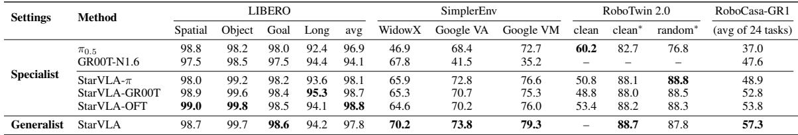

[← 返回 README](../README.md)

# 7. Cross-Benchmark Training Examples

## 📌 预览

这是"generalist(通才)"实验主线,比第 5 节的 specialist 更严格:**一个模型联合训练所有 benchmark 和本体**,再直接按各自官方协议评测,不做任何 benchmark 专属微调。关键工程手段:用统一 padding 把不同 DoF 的动作扩展到共享 32 维向量,避免任务专属 head。核心结果(Table 9):generalist 在多数 benchmark 保持竞争力,且把 RoboCasa-GR1 从最佳 specialist 48.8% 提升到 57.3%。

---

Building on the benchmark-wise specialist baselines in Sec. 5, we next evaluate a stricter setting for embodied generalization: one model jointly trained across benchmarks and robot embodiments. StarVLA natively supports co-training on heterogeneous datasets under a unified framework, which makes this all-in-one setting a natural case study for generalist VLA training.

> 💡 **问题动机** (claude 批注): specialist(第 5 节)是"每个 benchmark 一个模型",generalist(本节)是"一个模型打通所有 benchmark + 本体"。后者更难也更有意义——它才是"通用具身智能体"的真正考核。作者说这个 all-in-one 设置是跨本体联合训练能力(第 3.1.3 节 mixture dataset)的"自然案例研究",即用第 7 节来 showcase 第 3 节埋的跨本体基础设施。

Existing evaluation patterns. The Embodied AI community shares a common ambition: to develop a generalist agent that can seamlessly operate across diverse tasks, environments, and robots. In practice, however, the research landscape remains fragmented. Many state-of-the-art systems are tuned for specific benchmarks, and their performance can drop substantially when transferred to different environments or embodiments. This makes it difficult to measure true generalization ability.

> 💡 **机制拆解** (claude 批注): 这段点出行业通病:很多 SOTA 是"为特定 benchmark 调出来的",换环境/换本体就掉大分,所以现有评测测不出**真实泛化**。generalist 设置的价值就是把这个隐藏问题显式化——同一个模型必须同时面对所有 benchmark,无处藏拙。

---

## 7.1 Experimental Setups

> 💡 **7.1 要点预览** (claude 批注): 交代 generalist 的训练/评测配置。关键技术点:learning rate 1e-4、total batch 256、合并 LIBERO/SimplerEnv/RoboTwin/RoboCasa 训练集;用**统一 32 维动作 padding** 处理跨本体动作空间差异。

Training setup. In this setting, we jointly train one model on the merged training sets from LIBERO, SimplerEnv, RoboTwin 2.0, and RoboCasa-GR1, and then directly evaluate on each benchmark under its official protocol. No additional benchmark-specific fine-tuning is applied. We set the learning rate to $1 \times 10^{-4}$ the total batch size to 256, and train jointly on the merged benchmark datasets. To handle action-space differences across embodiments, we avoid task-specific action heads and apply a simple unified padding strategy that expands lower-DoF actions to a shared 32-dimensional action vector.

> 💡 **机制拆解** (claude 批注): 跨本体最大的技术障碍是**动作空间维度不一致**(单臂 7-DoF、双臂更多、人形又不同)。作者的解法极简:**统一 padding 到 32 维共享动作向量**——低 DoF 的动作补零/占位到 32 维。这样一个 action head 就能吃所有本体,不用为每个本体做专属 head。这个"简单 padding"选择呼应全文的极简哲学:能用配置/补零解决就不写专用模块。配合第 3.1.3 节的 embodiment tag,模型知道当前是哪种本体,从而正确解读那 32 维里哪些位是有效的。

Evaluation protocol as a generalist. A practical way to test generalization is to require one model to handle diverse benchmarks simultaneously. Following this principle, we evaluate StarVLA under a unified multibenchmark setting, where a single policy is trained once and evaluated across suites without benchmark-specific fine-tuning.

Baselines. To further demonstrate the effectiveness of our method and the proposed setting, we report both specialist results, where models are trained only on individual datasets, and results from the generalist training setting. In addition to comparing with our model, we also evaluate several state-of-the-art methods, such as π0.5 and GR00T-N1.6.

> 💡 **机制拆解** (claude 批注): 评测设计的严格性在于"train once, evaluate across suites, **no benchmark-specific fine-tuning**"。baseline 同时报 specialist 和 generalist 两栏,这样能直接看出"通才化"付出了多少代价(哪些 benchmark 掉分)、换回了多少收益(哪些 benchmark 涨分)。对比对象包括 π0.5 和 GR00T-N1.6 两个强 SOTA。

---

## 7.2 Main Results as a Generalist

As shown in Table 9, we compare our generalist model (jointly trained across datasets) with specialist models trained per benchmark. The generalist model remains competitive across most benchmarks and improves RoboCasa-GR1 from the best specialist average of 48.8% to 57.3% on the 24-task average. These results support the feasibility of a single policy that transfers across tasks and embodiments under a unified training/evaluation setting.

*Table 9: Performance comparison between generalist and specialist settings. Specialist represents multiple models trained separately on each benchmark-specific dataset, while Generalist represents a single model jointly trained across all datasets.*

> 💡 **Table 9 批读** (claude 批注): 这是全文最关键的一张表——它验证"一个模型跨 benchmark/本体是否可行"。读法要对比最后一行(Generalist StarVLA)与上方 specialist 各行:
> - **正向迁移最明显的是 RoboCasa-GR1**: 从最佳 specialist 48.8% 跳到 **57.3%**(+8.5 点)。为什么这个最难的 benchmark 反而受益最大?因为它数据相对少、任务复杂,联合训练借来了其他 benchmark 的通用操作先验,产生正迁移。
> - **SimplerEnv 也涨**: WidowX 70.2(vs specialist 最高 65.9)、Google VA 73.8、VM 79.3,均超 specialist——跨数据训练帮助了真机代理任务。
> - **LIBERO 基本持平**: generalist 97.8 avg,与 specialist 最佳 98.8 只差 1 点,几乎无损。
> - **代价**: 部分 cell 是"—"(如 RoboTwin clean 未报),说明并非所有 benchmark 都完美覆盖,generalist 在个别设置上有取舍。
>
> 核心结论:generalist **多数持平、难任务显著涨**,证明"单策略跨任务跨本体"在统一训练/评测下确实可行,且联合训练对数据稀缺的复杂 benchmark 有正迁移红利。

Takeaways This section focuses on a direct capability demonstration rather than ablation analysis: StarVLA can jointly train on heterogeneous, cross-embodiment benchmark datasets and produce a single model that remains competitive across diverse evaluation suites. We view this as evidence that all-in-one multi-benchmark training is a practical path toward large-scale cross-embodiment pretraining for future generalist VLA systems.

> 💡 **Q&A 批注记录** (claude 批注):
> - Q: generalist 为什么在 RoboCasa 上比 specialist 涨这么多(+8.5),而 LIBERO 几乎不变?
> - A: RoboCasa-GR1 最难且每任务数据相对有限,联合训练从 LIBERO/SimplerEnv/RoboTwin 借来的通用操作/感知先验对它是"雪中送炭"(正迁移);LIBERO 本身较易且数据充足,specialist 已接近饱和(98+),联合训练既无明显负迁移也无涨点空间,所以基本持平。这说明正迁移红利与"任务难度 × 数据稀缺度"正相关。
> - Q: 这节和第 5 节最本质的区别是什么?
> - A: 第 5 节是 specialist(N 个数据集 → N 个模型),第 7 节是 generalist(N 个数据集 → 1 个模型),且 generalist 靠 32 维统一 padding + embodiment tag 处理跨本体动作空间差异,评测时零 benchmark 专属微调。

> 💡 **Section 总结** (claude 批注):
> - **关键数字**: RoboCasa-GR1 48.8%(best specialist)→ 57.3%(generalist,+8.5);SimplerEnv WidowX 70.2、Google VM 79.3(均超 specialist);LIBERO 97.8 avg(几乎无损);lr=1e-4,total batch=256。
> - **核心机制**: 统一 32 维动作 padding + embodiment tag,单一 action head 通吃所有本体,零 benchmark 专属微调。
> - **核心洞察**: 单策略跨任务跨本体可行;联合训练对数据稀缺的难 benchmark 有正迁移红利,对已饱和的易 benchmark 基本无损。
> - **定位**: 本节是"能力展示"而非消融,作者视其为迈向大规模跨本体预训练的可行路径。
> - **可追问点**: 训练这么大规模,计算效率如何随 GPU 数扩展?见第 8 节。
