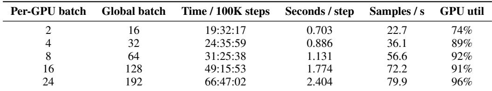
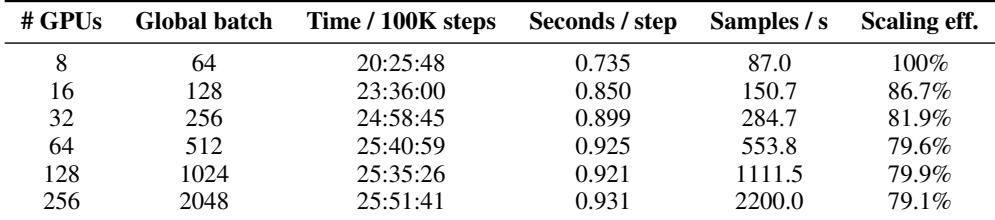
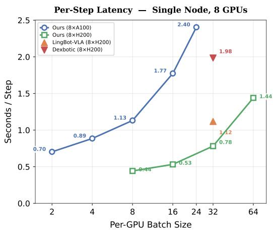
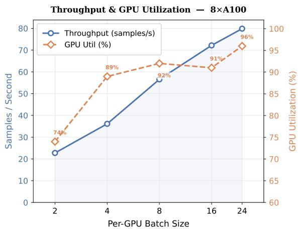
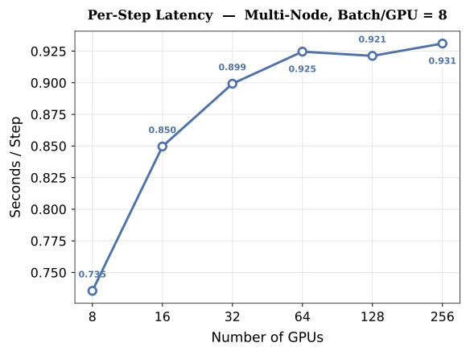
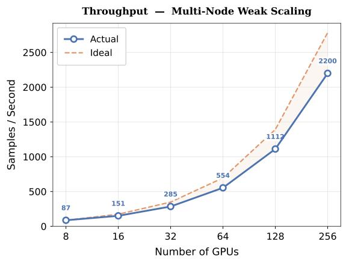

[← 返回 README](../README.md)

# 8. Computation Efficiency

## 📌 预览

这节给实用的扩展性指南,数据来自公开 profiling(GitHub issue #158)。区分两个吞吐概念:step 吞吐(秒/步,越低越好)vs sample 吞吐(样本/秒,越高越好)。8.1 单节点扫 per-GPU batch size,8.2 固定 per-GPU batch=8 扫 GPU 数(8→256)。核心结论:多节点通信只带来一次性延迟开销(0.735→0.93 s/step),之后 sample 吞吐近线性扩展,超过 8 节点(64 GPU)后并行效率稳定在 79–80%。

---

This section reports the training efficiency of StarVLA using the public profiling measurements collected in issue https://github.com/starVLA/starVLA/issues/158. Our goal is to provide actionable scaling guidance for practitioners, while keeping the reported metrics aligned with common distributed-training bottlenecks (compute and communication).

> 💡 **问题动机** (claude 批注): 这节的定位是"给实践者的扩展指南",不是刷 benchmark。数据来自公开 GitHub issue(#158)——透明可核查,符合全文的可复现主张。关注两大分布式瓶颈:compute(计算)和 communication(通信)。

*Table 10: Single-node training efficiency (8 × A100). Sample throughput is derived from the measured time per 100K steps and the global batch size.*

> 💡 **Table 10 批读** (claude 批注): 单节点(8×A100)扫 per-GPU batch(2→24)。看两条趋势的**反向权衡**:
> - **秒/步随 batch 单调上升**: 0.703(batch 2)→ 2.404(batch 24),即 batch 越大单步越慢。
> - **sample 吞吐随 batch 单调上升**: 22.7 → 79.9 samples/s,即 batch 越大处理数据越快。
> - **GPU 利用率随 batch 上升**: 74% → 96%。
>
> 结论:小 batch 步快但硬件闲置(74%),大 batch 吃满硬件(96%)但单步慢 3.4×。中间的 batch 8(56.6 samples/s, 92% util)是延迟与利用率的甜点。

*Table 11: Multi-node training efficiency (per-GPU batch = 8). “Ideal” scaling assumes linear growth of samples/s from the 8-GPU baseline.*

> 💡 **Table 11 批读** (claude 批注): 固定 per-GPU batch=8,扫 GPU 数(8→256)。关键看 **Scaling eff.(相对 8-GPU 线性理想的效率)**:
> - 8 GPU: 0.735 s/step, 87.0 samples/s, 100%(基准)。
> - 16→32 GPU: 秒/步升到 0.850→0.899(跨节点通信开销显现),效率 86.7%→81.9%。
> - **64→256 GPU: 秒/步稳定在 ~0.92–0.93,效率稳定在 79–80%**,不再继续下滑。
> - sample 吞吐从 87.0 近线性扩展到 2200.0(256 GPU)。
>
> 核心洞察:通信开销是**一次性台阶**(8→32 GPU 那一跳),而不是持续恶化。跨过 8 节点后效率触底稳定,这对想扩到几百 GPU 的实践者是好消息——可以放心扩,不会越扩越亏。

Experimental setup. Unless otherwise specified, the measurements use StarVLA-GR00T with a Qwen3- VL-4B backbone trained on the RoboCasa-GR1 dataset on A100 80GB GPUs. We report wall-clock time per 100K optimization steps, which includes distributed communication and system overhead.

Efficiency metrics. We distinguish two throughput notions: (i) step throughput (lower seconds/step is better), and (ii) sample throughput (higher samples/s is better), where samples/s is computed as global batch/(seconds per step). This distinction is important because distributed scaling often decreases step throughput (due to synchronization) while increasing sample throughput (due to larger global batch).

> 💡 **机制拆解** (claude 批注): 这段是全节的概念钥匙——**两个吞吐不能混为一谈**:
> - **step throughput(秒/步)**: 越低越好。分布式扩展会因同步而**变差**。
> - **sample throughput(样本/秒 = global batch / 秒每步)**: 越高越好。分布式扩展因 global batch 变大而**变好**。
>
> 为什么重要?因为两者方向相反,只看一个会得出错误结论。若训练目标是"固定步数",加 GPU 不会更快(step 吞吐还变差);若目标是"快速处理固定数据量",加 GPU 显著更快(sample 吞吐近线性)。测量配置固定为 StarVLA-GR00T + Qwen3-VL-4B + RoboCasa-GR1 + A100 80GB。

---

## 8.1 Single-Node Training Efficiency

Table 10 summarizes a single-node sweep that varies the per-GPU batch size. We omit derived “24-hour” projections and focus on directly measured quantities and the implied sample throughput.

<table><tr>
<td width="50%"></td>
<td width="50%"></td>
</tr></table>

*Figure 5: Per-step latency and throughput on a single 8-GPU node. Left: step latency as a function of per-GPU batch size for our method on A100 and H200, compared with LingBot-VLA and Dexbotic (both on 8×H200). Right: training throughput and GPU utilization on 8×A100 across batch sizes.*

> 💡 **Figure 5 批读** (claude 批注): 单节点(8-GPU)的延迟-吞吐可视化,对应 Table 10:
> - **左图(step latency vs per-GPU batch)**: 把 StarVLA 在 A100 和 H200 上的单步延迟,与 LingBot-VLA、Dexbotic(都在 8×H200)对比。H200 比 A100 快,且随 batch 增大延迟上升——这给"选什么卡、开多大 batch"提供横向参照。
> - **右图(throughput + GPU util vs batch)**: 8×A100 上吞吐和利用率随 batch 上升,直观展示"大 batch → 高吞吐高利用率但高延迟"的权衡曲线。
>
> 这张图的实用价值:让实践者一眼看出自己硬件(A100/H200)下的甜点 batch,而不用自己盲扫。

Figure 5 visualizes the main trade-off. Smaller per-GPU batches yield faster steps (e.g., 0.703 s/step at batch 2 vs. 2.404 s/step at batch 24), while larger per-GPU batches improve sample throughput (from 22.7 to 79.9 samples/s) at the cost of sharply increased step latency.

---

## 8.2 Multi-Node Scaling Efficiency

We next fix per-GPU batch size to 8 and scale the number of GPUs. As shown in Table 11, the time per step rises from 0.735 s (8 GPUs) to 0.899 s (32 GPUs) due to inter-node communication overhead, then plateaus at ∼0.93 s up to 256 GPUs. Despite this overhead, sample throughput scales from 87.0 to 2200.0 samples/s, which is the relevant metric when the training objective is to process a fixed amount of data quickly.

<table><tr>
<td width="50%"></td>
<td width="50%"></td>
</tr></table>

*Figure 6: Multi-node scaling efficiency. Left: per-step latency rises noticeably from 8 to 32 GPUs due to inter-node communication overhead, then plateaus between 64 and 256 GPUs. Right: measured sample throughput versus ideal linear scaling; parallel efficiency stabilizes around 79–80% beyond 32 GPUs.*

> 💡 **Figure 6 批读** (claude 批注): 多节点扩展(8→256 GPU)的两张诊断图,对应 Table 11:
> - **左图(per-step latency vs GPU 数)**: 清楚画出"台阶形"——8→32 GPU 明显上升(跨节点通信开销),64→256 GPU 走平。这可视化了"通信开销是一次性台阶而非持续恶化"的核心论点。
> - **右图(实测 sample 吞吐 vs 理想线性)**: 实测曲线随 GPU 增加而上升,但与理想线性有固定间隔;并行效率在超过 32 GPU 后稳定在 79–80%。
>
> 两图合起来给实践者的判断:扩到几百 GPU 是安全的,效率不会继续跌破 ~80%,值不值得取决于你是"数据量驱动"(值)还是"固定步数"(不值)。

Figure 6 plots both step latency and sample throughput against GPU count, together with the ideal linear reference line. The results highlight a practical guideline: scaling out is most beneficial for data-volume-driven training, while fixed-step training does not become faster with more GPUs.

Takeaways. First, inter-node communication introduces a one-time latency overhead (0.735→0.93 s/step), but sample throughput still scales near-linearly via larger global batch. Second, on a single node, a moderate per-GPU batch (e.g., 8) often provides the best balance between step latency and GPU utilization; very large batches (e.g., 24) maximize utilization (96%) but inflate step latency by 3.4×. Third, for large-scale training, once the system scales beyond 8 nodes (64 GPUs), the communication burden no longer grows further, maintaining a stable scaling efficiency of 79–80%. This indicates that practitioners can confidently scale to hundreds of GPUs without incurring additional parallel efficiency degradation.

> 💡 **Q&A 批注记录** (claude 批注):
> - Q: 加更多 GPU 到底能不能让训练更快?
> - A: 取决于训练目标(§8.2 末句)。若目标是"处理固定数据量",加 GPU 显著更快——sample 吞吐从 87.0(8 GPU)近线性扩到 2200.0(256 GPU);若目标是"跑固定步数",加 GPU 反而略慢(step 吞吐因同步从 0.735 升到 0.93 s/step)。这正是本节坚持区分两种吞吐的原因。
> - Q: 扩到几百 GPU 会不会效率崩掉?
> - A: 不会。通信开销是 8→32 GPU 的一次性台阶,超过 64 GPU 后并行效率稳定在 79–80%(Table 11 / Fig. 6 右),可以放心扩。

> 💡 **Section 总结** (claude 批注):
> - **关键数字**: 单节点甜点 per-GPU batch=8(56.6 samples/s, 92% util);batch 24 利用率 96% 但延迟 ×3.4。多节点:step 延迟 0.735(8 GPU)→0.93(≥32 GPU)一次性台阶;sample 吞吐 87.0→2200.0(256 GPU);并行效率稳定 79–80%。
> - **核心概念**: step throughput(越低越好,随扩展变差)vs sample throughput(越高越好,随扩展近线性)——方向相反,必须分开看。
> - **核心洞察**: 通信开销是一次性台阶而非持续恶化;扩到数百 GPU 安全,收益取决于"数据量驱动 vs 固定步数"。
> - **可复用点**: 单节点选 batch≈8;多节点若为吃数据尽管扩,若为跑固定步数别指望加速。
