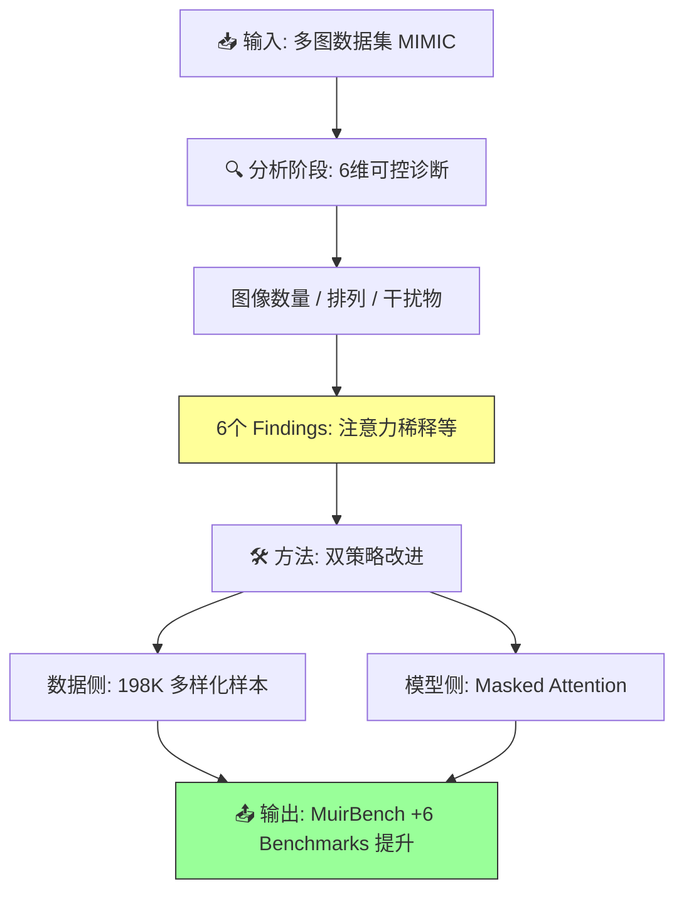

# More Images, More Problems? A Controlled Analysis of VLM Failure Modes

## Paper Metadata

| 项目 | 内容 |
|------|------|
| **Title** | More Images, More Problems? A Controlled Analysis of VLM Failure Modes |
| **Authors** | Anurag Das, Adrian Bulat, Alberto Baldrati, Ioannis Maniadis Metaxas, Bernt Schiele, Georgios Tzimiropoulos, Brais Martinez |
| **Affiliations** | MPI for Informatics, Saarland Informatics Campus; Samsung AI, Cambridge; Technical University of Iasi, Romania; Queen Mary University of London |
| **Venue** | arXiv 2026 |
| **Paper Link** | https://github.com/anurag-198/MIMIC |
| **Code** | https://github.com/anurag-198/MIMIC |

## One-Sentence Summary

通过构建可控多图测试基准 MIMIC，系统诊断了当前 LVLM 在多图场景下的 6 大 failure mode —— 本质上是"单图模型行为"：模型无法跨图聚合信息、难以追踪多个概念、对干扰图像敏感，根源在于序列长度膨胀 + 深层跨图注意力衰减；进而提出数据侧（合成多图训练数据）和优化侧（层间注意力掩码）两种互补微调策略，在多个 benchmark 上刷新 SOTA。

## Core Contributions

1. **提出 MIMIC Benchmark** (Section 3): 基于 MS-COCO 标注程序化生成的多图评测框架。通过精确控制信息分布（information spread）、干扰存在（distractor presence）、物体实例分布、序列长度和查询复杂度，实现可控、解耦的细粒度 failure mode 诊断。包含 Counting、Listing、Common、Odd-One 四个核心任务，均为开放式问答。

2. **系统揭示 6 大 Failure Mode** (Section 3.2):
   - Finding 1: 性能退化主要来自序列长度膨胀，而非图像数量增加
   - Finding 2: 当前 LVLM 本质上表现为"单图模型"，性能峰值出现在 vision token 数量 ≈ 1-2 张图时
   - Finding 3: 模型难以跨多图聚合信息
   - Finding 4: 模型对视觉干扰敏感，尤其是信息分散时
   - Finding 5: 多概念追踪能力有限
   - Finding 6: 模型深层跨图注意力衰减，从跨图整合转向单图聚焦

3. **提出两种互补微调策略** (Section 4):
   - 数据侧：基于 OpenImages 的程序化多图训练数据生成 pipeline，显式提供跨图推理监督
   - 优化侧：层间注意力掩码（attention masking），限制深层 vision token 仅关注同图 token，强制学习干净的图像局部表示

4. **刷新多图 Benchmark SOTA** (Section 5): 在 MuirBench (+9.6% for 7B)、Blink、MMIU、MIRB、MMT、NLVR2 等多个多图 benchmark 上一致超越 baseline，同时注意力掩码策略减少 ~81% FLOPs。

## Section Navigation

| 章节 | 文件 | 核心内容 |
|------|------|---------|
| Abstract | [00-abstract.md](sections/00-abstract.md) | 论文概述、MIMIC 设计目标、两大微调策略 |
| 1. Introduction | [01-introduction.md](sections/01-introduction.md) | 多图 LVLM 研究 gap、贡献总结 |
| 2. Related Work | [02-related-work.md](sections/02-related-work.md) | 多图 LVLM 架构、评测基准、内部机理分析 |
| 3. Challenges & Insights | [03-challenges-insights.md](sections/03-challenges-insights.md) | MIMIC 基准构建、6 大 Finding 的系统实验 |
| 4. Method | [04-method.md](sections/04-method.md) | 数据侧合成数据生成 + 优化侧注意力掩码 |
| 5. Results | [05-results.md](sections/05-results.md) | 主实验 + 消融 + 跨任务泛化 + 效率分析 + 结论与局限 |

## Key Numbers

| 指标 | 数值 |
|------|------|
| MIMIC Benchmark 任务数 | 4 (Counting, Listing, Common, Odd-One) |
| Counting 子设置 | 2 (Balanced + Unbalanced) |
| MIMIC 评测集样本数 | 13,800 queries |
| 评测模型数 | 13+ LVLMs (LLaVA-OV, Qwen2-VL, InternVL2 等) |
| Counting 最大图像数 | 35 |
| 序列长度下采样性能提升 | 4-8x pooling 即可带来显著提升（zero-shot） |
| 合成训练数据量 | ~198K samples (基于 OpenImages) |
| 训练图像数上限 | 10 张 |
| 注意力掩码 FLOPs 减少 | ~81% (0.5B), ~75% (1.5B) |
| LLaVA-OV-7B MuirBench 提升 | 41.7% -> 51.3% (+9.6%) |
| LLaVA-OV-0.5B MIMIC Avg 提升 | 26.4 -> 49.4 (+23.0) |
| LLaVA-OV-7B MIMIC Avg 提升 | 54.0 -> 63.8 (+9.8) |
| 训练 GPU | 8x NVIDIA H100 80GB |

## Data Flow: MIMIC Benchmark Construction

## Data Flow: Proposed Method (Training Pipeline)

## Pros/Cons & Future Work

### Strengths

1. **可控诊断设计精妙**: MIMIC 通过程序化控制信息分布、干扰数量、实例分布等维度，实现了对 LVLM 多图能力的"单元测试"（unit test），这是已有 benchmark (MuirBench, Blink) 做不到的。
2. **Finding 与 Method 紧密对应**: Finding 1/2（序列长度问题）-> 注意力掩码；Finding 3/4/5（信息聚合/干扰/多概念）-> 合成数据训练。每个方法组件都有经验发现作为动机。
3. **实验覆盖面广**: 13+ 模型评测、6 个外部 benchmark + MIMIC 自评测、跨任务泛化分析、效率分析、注意力掩码层间消融。
4. **效率-性能双赢**: 注意力掩码不仅提升性能，还减少 81% FLOPs，实用价值高。
5. **开放式 QA 设计**: 避免了多选题的 shortcut 和干扰项校准问题，更真实地反映模型能力。

### Weaknesses / Limitations

1. **Benchmark 域受限**: MIMIC 基于 MS-COCO natural images，在密集文档、医学影像等专业领域的表现未经验证。
2. **分辨率 trade-off**: 降低序列长度提升多图推理，但可能牺牲对极细小细节的感知——论文未探索自适应分辨率策略。
3. **仅验证开源模型**: Finding 的结论在闭源模型（GPT-4o, Gemini）上未经充分验证。
4. **计数任务指标的严格性**: 使用 binary accuracy（完全匹配），对接近正确答案的部分匹配无容忍——虽然增加了难度但也可能掩盖部分有用能力。
5. **合成数据的分布偏移**: 训练数据是基于 OpenImages 的程序化生成，可能在分布上偏向 object-centric 任务，较少涉及场景级语义。

### Future Work

1. 将 MIMIC 的可控方法论扩展到密集文档、医学影像等专业领域
2. 探索自适应分辨率策略，在保持像素级感知的同时缓解序列长度压力
3. 将注意力掩码策略与其他模型架构（如 InternVL、Qwen2-VL）结合验证
4. 研究合成数据在 non-object-centric 任务（如关系推理、场景理解）上的泛化效果
5. 进一步分析 attention mask 的最佳层数和 mask 模式的理论依据

## Reading Q&A Record

| # | 问题 | 答案位置 | 解答 |
|---|------|---------|------|
| 1 | 为什么 MIMIC 不使用多选题格式？ | Section 3.1 | 开放式问答增加挑战性、避免固定选项集带来的 shortcut、无需校准干扰项选择。使用多个 prompt 模板进一步减少 prompt bias。 |
| 2 | "序列长度膨胀"与"图像数量增加"如何解耦？ | Section 3.2, Fig.3 | (a) 直接增加图像数测性能；(b) 对 vision token 做 1-D average pooling 降低序列长度，发现 4-8x pooling 零样本即可提升性能；(c) control experiment：在像素空间先下采样再上采样保持序列长度不变，排除"信息减少"的混淆。 |
| 3 | 为什么早期层需要保留跨图 attention，而深层需要 mask？ | Section 3.2, Fig.4 + Table 5(right) | Fig.4 显示早期层有显著跨图 attention（建立跨图语义关联），深层则变为单图主导。Table 5(right) 消融证实：mask 深层（12-23）效果最好，mask 早期层（0-11 或 0-23）反而严重下降。早期跨图交互对信息聚合是必要的。 |
| 4 | Balanced vs Unbalanced Counting 的设置差异是什么？ | Section 3.1 | Balanced: 固定总实例数，仅改变实例分布在不同图像上的"信息分散度"。Unbalanced: 总实例数随图像数变化。Balanced 设置排除了"更多图像天然包含更多实例"的混淆。 |
| 5 | 合成训练数据与 MIMIC 评测数据有何不同？ | Section 4 + Appendix A.2 | 训练数据基于 OpenImages（而非 MS-COCO），包含多轮对话和选项式回答（LLaVA 格式），支持最多 10 张图。评测数据是 MS-COCO-based 的开放式问答。源域不同，防止 data leakage。 |
| 6 | 为什么 Masked Attention 在 0.5B 上超过 full FT，在 7B 上则不如？ | Table 4, Table 5(mid) | 0.5B 上 Masked 平均 49.4 vs Full FT 45.5。小模型可能更容易受 long-sequence attention noise 影响，mask 正则化效果更显著。7B 上 masked 63.8 vs baseline 54.0（提升 9.8），但论文未直接对比 7B full FT。 |
| 7 | Stitching 实验说明了什么？ | Appendix A.1, Table 6 | 将多图拼接成单张大图输入，保持 vision token 数量相似，发现性能基本持平或略升。说明问题核心是序列长度而非图形格式。但与 MIMIC 互补——MIMIC 通过更精细控制发现信息分散本身也是挑战。 |

## Citation Landscape

### Reference Grouping by Topic

**Multi-Image LVLMs & Architectures**:
- LLaVA-OneVision [1], Qwen2-VL [2], InternVL2/VL3 [3], CogVLM2 [4]
- Flamingo [5], PaLM-E [6], MiniGPT-v2 [7]

**Multi-Image Benchmarks**:
- MuirBench [8], Blink [9], Visual Haystack [10]
- MMIU [11], MIRB [12], MMT-Bench [13], NLVR2 [14]

**Single-Image Benchmarks & Evaluation**:
- MS-COCO [15], VQA [16], GQA [17], DocVQA [18], AI2D [19]
- SEED-Bench [20], MMBench [21], MME [22]

**Video Benchmarks**:
- MMVU [23], Video-MME [24]

**LVLM Analysis**:
- Hallucination [25, 26], Modality Bias [27, 28], Input Sensitivity [29]
- Multi-image analysis [30, 31, 32]

**Training Data**:
- OpenImages v4/v7 [33]

### Connected Works (Most Relevant)
- **Visual Haystack** (Wu et al., 2025): 关注多图检索能力随序列长度的退化，但未控制混淆因素、未寻根因。
- **MuirBench** (Wang et al., 2024a): 12 任务的多图评测，但复用已有数据集，未做到细粒度可控分析。
- **Blink** (Fu et al., 2024b): 14 个"人类觉得简单"的多图任务，揭示 LVLM 感知能力的短板。

---

*Batch reading created on 2026-06-24*
