# More Images, More Problems? A Controlled Analysis of VLM Failure Modes.

Anurag Das1\*, Adrian Bulat2,3, Alberto Baldrati2, Ioannis Maniadis Metaxas2 Bernt Schiele1, Georgios Tzimiropoulos2,4, Brais Martinez2

1MPI for Informatics, Saarland Informatics Campus 2Samsung AI, Cambridge

3Technical University of Ias, i, Romania 4Queen Mary University of London, UK andas@mpi-inf.mpg.de

## Abstract

Large Vision Language Models (LVLMs) have demonstrated remarkable capabilities, yet their proficiency in understanding and reasoning over multiple images remains largely unexplored. While existing benchmarks have initiated the evaluation of multi-image models, a comprehensive analysis of their core weaknesses and their causes is still lacking. In this work, we introduce MIMIC (Multi-Image Model Insights and Challenges), a new benchmark designed to rigorously evaluate the multi image capabilities of LVLMs. Using MIMIC, we conduct a series of diagnostic experiments that reveal pervasive issues: LVLMs often fail to aggregate information across images and struggle to track or attend to multiple concepts simultaneously. To address these failures, we propose two novel complementary remedies. On the data side, we present a procedural data-generation strategy that composes single-image annotations into rich, targeted multi-image training examples. On the optimization side, we analyze layer-wise attention patterns and derive an attention-masking scheme tailored for multi-image inputs. Experiments substantially improved cross-image aggregation, while also enhancing performance on existing multi-image benchmarks, outperforming prior state of the art across tasks. Data and code will be made available at https: //github.com/anurag-198/MIMIC.

## 1 Introduction

Current Large Vision Language Models (Li et al., 2024a; Liu et al., 2024a; Wang et al., 2024c,b; Yao et al., 2024) showcase impressive vision-language understanding capabilities (Goyal et al., 2017; Mathew et al., 2021; Kembhavi et al., 2016). Most of these models are built upon pre-trained vision encoders (Radford et al., 2021; Zhai et al., 2023) and large language models (LLMs) (Touvron et al.,

2023; Abdin et al., 2024; Jiang et al., 2024a). While early efforts primarily focused on single images (Liu et al., 2024a), recent works have extended them to support multiple images (Li et al., 2024a; Wang et al., 2024b; Chen et al., 2023) and videos (Zhang et al., 2023) by incorporating temporal modeling and adjusting the positional embeddings (Zhang et al., 2023; Li et al., 2024a).

Despite their success, LVLMs continue to face significant challenges(Stogiannidis et al., 2025; Liu et al., 2023; Ouali et al., 2024; Guan et al., 2024; Kaul et al., 2024; Qian et al., 2024). Progress towards identifying and addressing these challenges can follow two primary avenues: the development of comprehensive evaluation benchmarks (Goyal et al., 2017; Mathew et al., 2021; Kembhavi et al., 2016; Masry et al., 2022; Li et al., 2024b; Fu et al., 2024a) and the study of the models’ inner workings (Deng et al., 2025; Qian et al., 2024; Kaul et al., 2024). To date, research in both areas has predominantly focused on the single-image setting. While early efforts have introduced benchmarks for multi-image scenarios (Wang et al., 2024a; Jiang et al., 2024b; Fu et al., 2024b), a comprehensive, in-depth analysis to ascertain the true efficacy of these models and identify the root causes of their limitations is notably absent.

In this work, we address this gap by conducting a systematic study of LVLMs in multi-image contexts. We first analyze and characterize common failure modes using a newly proposed benchmark, and then seek to mitigate these limitations using two novel complementary fine-tuning strategies. Our in-depth analysis is performed on the newly introduced MIMIC (Multi-Image Model Insights and Challenges) benchmark. Built from MS-COCO (Lin et al., 2014), using its bounding boxes and class labels, MIMIC procedurally generates multi-image sequences by leveraging per-image annotations that give fine-grained control over information spread, distractor presence, object-instance distributions, sequence length, and query complexity, while providing unambiguous ground-truth answers for robust, decorrelated analysis of the model’s strengths and weaknesses. Using both quantitative and qualitative assessments, our study reveals that current state-of-the-art LVLMs struggle to effectively aggregate information across multiple images, are unable to track/attend to multiple concepts simultaneously, while being susceptible to distractors. We attribute these shortcomings to a combination of factors, including limitations in multi-image sequence modeling, training data biases, poor inter-image communication induced by the causal attention and the inherent complexity of multi-image reasoning tasks.

Finally, to address the identified problems, we propose two new finetuning strategies: (1) a data-centric approach that generates targeted multi-image training examples to provide rich, multi-image supervision derived from OpenImages (Kuznetsova et al., 2020); and (2) an optimization-centric approach that leverages layerwise attention analysis to derive an attentionmasking scheme tailored for multi-image inputs. Our proposed finetuning strategies lead to substantial performance gains across all scenarios.

In summary, our main contributions are:

• We introduce MIMIC, a comprehensive evaluation framework for multi-image LVLMs that probes various aspects of model performance through a controlled and diverse set of tasks.

• We conduct an extensive evaluation of several state-of-the-art LVLMs using MIMIC, uncovering critical insights into their capabilities and limitations in multi-image settings.

• We propose a novel data-centric finetuning approach using synthetically generated multiimage data, alongside an optimization-centric attention-masking strategy, both of which significantly enhance model performance in multi-image contexts.

• We set new state-of-the-art results on existing multi-image benchmarks, demonstrating the effectiveness of our proposed methods.

## 2 Related work

## Multi-Image Large Vision Language Models:

Early LVLMs such as Flamingo (Alayrac et al., 2022) and PaLM-E (Driess et al., 2023) pioneered the integration of pre-trained vision encoders with powerful LLMs for VQA and captioning. Subsequent models (Dai et al., 2023; Li et al., 2024a) introduced expanded instruction tuning and multi-modal pre-training techniques. More recent advancements include MiniGPT-5 (Zheng et al., 2023), Qwen2-VL (Wang et al., 2024b), CogVLM2 (Hong et al., 2024) and InternVL3 (Zhu et al., 2025) further advanced the field by scaling training data and model capacity and adopting more sophisticated architectural designs. While early LVLMs primarily operated on low-resolution, single-image inputs (Liu et al., 2024a; Lin et al., 2024), later research significantly expanded their scope. High-resolution images (Li et al., 2024a; Wang et al., 2024b; Zheng et al., 2023) are commonly processed by splitting them into fixedresolution patches and treating them as image sequences, while videos are represented by extracting frames to form multi-image inputs. In addition, models have begun to explicitly support multiimage context (Wang et al., 2024b; Li et al., 2024a; Zhu et al., 2025), enabling reasoning across multiple visual inputs. Multi-image capability is introduced by fine-tuning single-image LVLMs on multi-image instruction-tuning data, while largely preserving the original model architecture and attention mechanisms.

Evaluation of LVLMs: Early evaluation efforts focused on narrower domains with benchmarks such as MS-COCO (Lin et al., 2014), VQA (Antol et al., 2015), DocVQA (Mathew et al., 2021), GQA (Hudson and Manning, 2019) and AI2D (Kembhavi et al., 2016), primarily assessing single-image understanding and using templetized questions with limited diversity. Later work introduced more comprehensive benchmarks to evaluate a wider range of skills, e.g. SEED-Bench (Li et al., 2024b), MMBench (Liu et al., 2024c) and MME (Fu et al., 2024a), which feature diverse question types and require complex reasoning abilities. Similarly, video benchmarks such as MMVU (Zhao et al., 2025) and VideoMME (Fu et al., 2025) require models to understand temporal dynamics and to reason across multiple frames.

Closer to our work, several benchmarks have been proposed specifically for multi-image LVLMs. MuirBench (Wang et al., 2024a) introduced 12 tasks evaluating multi-image understanding, including image comparison and multi-image reasoning. Blink (Fu et al., 2024b) included 14 tasks deemed easy for humans, highlighting LVLMs limitations in truly understanding multi-image visual content. Visual Haystack (Wu et al., 2025) focuses on retrieval-based tasks, assessing how well models can find certain concepts within a long sequence of images. Instead, we provide a more granular analysis of model performance across various controlled dimensions, such as information distribution, query complexity and distractor presence. Moreover, while prior works often repurposed existing datasets, we design our task from scratch to allow for selective performance exploration. This allows us to pinpoint specific strengths and weaknesses in current models that prior benchmarks may have overlooked and, importantly, provide deeper actionable insights on their underlying root causes.

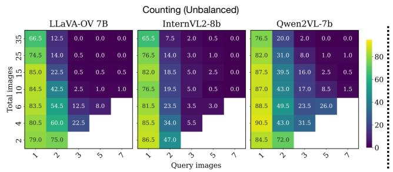

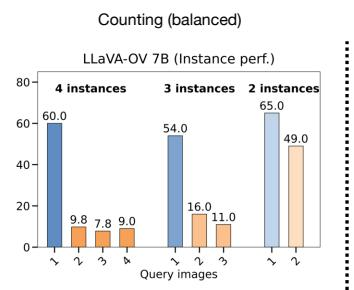

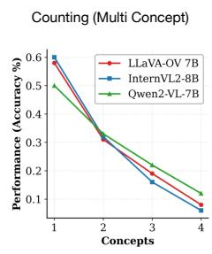  
Figure 1: Counting performance under different settings. Left (Unbalanced): We compare different LVLMs by analyzing the trade-off between the number of query images and the total number of images without controlling for number of instances. Mid (Balanced): We fix the total number of images to 7 and of object instances distributed across query images to 4,3 and 2. In both settings, performance consistently drops when instances are spread over multiple images. Right (Multi Concept): We increase the complexity by adding more classes (concepts) to the counting task, and observe a steep performance drop, indicating limited capacity for multi-concept tracking.

Analysis of LVLMs: Parallel to the development of benchmarks, there is growing interest in analyzing the internal mechanisms of LVLMs to better root-cause their limitations at a data and architecture level. Current studies have investigated issues such as hallucination (Liu et al., 2023; Ouali et al., 2024; Guan et al., 2024), modality bias (Deng et al., 2025; Wang et al., 2025), and sensitivity to input phrasing (Qian et al., 2024). These works often involve probing the models with carefullydesigned inputs to reveal their decision-making process. Only recently have such analyses expanded to multi-image LVLMs (Wang et al., 2024d; Wu et al., 2025; Sharma et al., 2024). The closest to our work is the study by Wu et al. (Wu et al., 2025), which examines the retrieval capabilities of multi-image LVLMs as the sequence length increases, showing limitations when operating over long sequences. However, their focus is primarily on the models ability to locate specific items within an image set and does not control conflating factors, nor seek to identify the root causes beyond data scarcity.

Instead, we systematically probe additional dimensions of multi-image understanding, such as information aggregation and multi-concept tracking. To control for confounding factors, our evaluation is designed to isolate specific unitary aspects of multi-image understanding, leading to precise conclusions and to the identification of areas for improvement. Moreover, we analyze the internal model’s behavior, and complement our analysis with proposed solutions to address the identified challenges at both data and optimization levels.

## 3 Challenges and Insights in Multi-Image LVLMs

Herein, we systematically investigate the current LVLMs limitations in multi-image scenarios across six complementary dimensions: information distribution, query complexity, reasoning patterns, robustness to visual distractors, scalability with the number of images, and multi-concept tracking. For this purpose, we introduce MIMIC, a controlled testbed synthesized from a curated subset of MS-COCO (Lin et al., 2014). Using the manually annotated bounding boxes and labels, MIMIC generates multi-image sequences that allow precise control over information spread, distractor presence, object-instance distributions, and sequence length. This design enables decorrelated, fine-grained analyses of the model’s behavior. Beyond these dimensions, our framework scrutinizes the models mechanisms for aggregating and reasoning over distributed visual information. Through this controlled analysis, we aim to isolate the specific limitations and offer actionable insights for the next generation of visual understanding models.

Section 3.1 describes the tasks design and dataset construction of our probing benchmark. Sec-

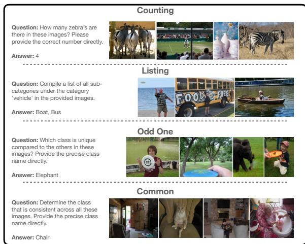  
Figure 2: MIMIC Bench: examples of each task.

tion 3.2 describes the systematic probing of several state-of-the-art LVLMs to uncover their strengths and limitations in multi-image understanding.
<table><tr><td rowspan="2"></td><td colspan="2">Counting</td><td rowspan="2">Common Odd One Listing</td><td rowspan="2"></td><td rowspan="2"></td><td rowspan="2">Overall</td></tr><tr><td>Bal. Unbal.</td><td></td></tr><tr><td>Queries</td><td>5000 5800</td><td></td><td>1000</td><td>1000</td><td>1000</td><td>13800</td></tr><tr><td>Images</td><td>53703761</td><td></td><td>3842</td><td>3726</td><td>4137</td><td>13145</td></tr><tr><td>Obj. inst. per query</td><td></td><td>44.3132.1</td><td>26.1</td><td>20.7</td><td>27.9</td><td>77.0</td></tr><tr><td>Min img per query</td><td>7</td><td>2</td><td>3</td><td>4</td><td>2</td><td>2</td></tr><tr><td>Max img per query</td><td>7</td><td>35</td><td>8</td><td>6</td><td>8</td><td>35</td></tr><tr><td>Median img per query</td><td>7.0</td><td>15.0</td><td>5.0</td><td>5.0</td><td>5.0</td><td>7</td></tr><tr><td>Avg words per question 15.1</td><td></td><td>15.2</td><td>14.7</td><td>17.3</td><td>13.6</td><td>15.2</td></tr></table>

Table 1: MIMIC Benchmark statistics per task. Counting settings: Balanced (Bal) and Unbalanced (Unbal).

## 3.1 Testbed benchmark construction

We build the probing dataset by procedurally generating multi-image, open-ended question-answering tasks that target distinct aspects of cross-image reasoning. To this end, we sample a curated subset from MS-COCO (Lin et al., 2014) by filtering images with object bounding boxes less than 5% of the image in order to ensure visual recognizability at common LVLM input resolutions (e.g. LLaVA-$\mathrm { O V _ { \mathrm { ~ S ~ } } ^ { \prime } 3 8 4 \times 3 8 4 p x ) }$ . To minimize the impact of potential class imbalance, we first select a pool of classes and then sample from this pool, ensuring that each class is chosen with an equal probability. This ensures that the distributions of classes and instances remain consistent across settings.

MIMIC defines four core tasks: Counting, Listing, Common, and Odd-One, each targeting a distinct facet of multi-image reasoning. Fig. 2 provides some qualitative examples, and Table 1 reports dataset statistics. All tasks are formulated as open-ended question answering rather than multiple-choice to increase challenge, avoid shortcuts introduced by fixed option sets, and remove the need to calibrate distractor choices. To further reduce prompt bias, we employ multiple templatized prompts per task (see appendix for a template list). Below, we describe each task in detail.

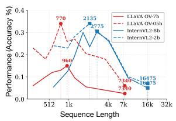

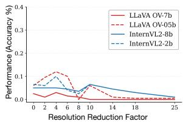  
Figure 3: Effect of vision token sequence length on performance. Left: Sequence length reduction via 1- D pooling. The square denotes the original sequence length. Right: Control experiment reducing the information via pixel space pooling while keeping the sequence length fixed. Results are reported for counting task with 3 query images and total 10 images.

Counting: Given a set of N input images, and a query containing k object classes, the model is asked to count the total number of instances of each class. With increasing difficulty, we vary the distribution of object instances across images. For example, in the easiest setting, all may be concentrated in a single image, while in more challenging cases, instances are spread across multiple images. We refer to this as the information spread. Additionally, we introduce distractors - images that do not contain any instances of the target objects - to assess the model’s ability to focus on relevant information. In summary, this task offers the following controllable dimensions: (1) number of object classes to count (k); (2) information spread across images (s); (3) number of distractor images and (4) total number of images. Each case probes different aspects and potential biases. For instance, increasing the number of object classes k tests the model’s multi-concept tracking ability, while varying the information spread evaluates its capacity to aggregate information across images.

To account for potential biases caused by the long-tail distribution of object instance counts in natural images, which may lead to models favoring smaller counts, we design two distinct settings: (1) Balanced, where the total number of object instances is fixed, but distributed across a varying number of images; (2) Unbalanced, where the total number of object instances varies arbitrarily with the number of images. The metric of choice is binary accuracy, i.e. the answer is correct if it matches the ground truth count exactly.

Listing: The model is presented with a set of N images and asked to list all object classes belonging to a given category (e.g.: animals, vehicles, etc.) that it can identify. This task evaluates the model’s ability to exhaustively extract information in a dense manner from multiple images. As a byproduct, it also measures the model’s visual perception ability to recognize and categorize multiple objects, as well as its capacity to aggregate this information into a coherent list. Similar to the Counting task, we vary the number of images and the distribution of object instances to assess the model’s robustness in multi-image understanding. The model’s response is evaluated on the completeness and accuracy of the list, using F1-score as metric. See the appendix for a complete hierarchy of object categories and subcategories.

Common and Odd-One: The two tasks are designed to assess the model’s ability to identify shared or unique elements across multiple images. Importantly, while previous tasks focus on aggregating information, these tasks require comparative reasoning across images, hence the model must first implicitly identify all objects before performing cross-image analysis. In the Common task, the model has to determine which object class is present in all provided images, while in the Odd-One case, it must identify the object class that is present in a minority of images. For simplicity, we ensure by design that the answers are unique. The model’s answers are evaluated based on their correctness, with binary accuracy as the metric.

## 3.2 Empirical analysis

Setup: We evaluate several state-of-the-art LVLMs: LLaVA-OV (Li et al., 2024a), Qwen2- VL (Wang et al., 2024b) and InternVL2 (Chen et al., 2024b). We use publicly available checkpoints and follow the official data processing pipeline. For test data, we use the MIMIC benchmark described in Section 3.1, selecting tasks and configurations that best isolate the dimensions we aim to probe.

Performance in Relation to Sequence Length and Number of Images: LLMs are known to manifest position and sequence length biases (Ravaut et al., 2024), with tokens appearing earlier and late in the sequence receiving more attention. Unlike for LLMs, we distinguish two axes of sequence length growth: (1) increasing the number of images, and (2) increasing the input image(s) resolution. We seek to understand if the performance degradation stems from the model’s inability to handle long sequences, or from the inability to process many images. We disentangle these two factors with the following experiments: (a) directly increasing the number of images without explicitly controlling for sequence length. In this setting, we simply vary the number of images provided to the model, measuring performance on the counting task. As the results from Fig. 1 (left) show, performance degrades in all setting consistently for all models as the total number of images increases from 2 to 35s. (b) reducing the vision token sequence length through 1-D average pooling applied to the original multi-image vision tokens. To ensure that the observed behavior is not an artifact of reduced information, we also perform a control experiment where we similarly reduce the amount of information by downsampling and then upsampling back the images in pixel space, prior to being passed to the vision encoder. This preserves the initial sequence length but reduces the amount of visual information available to the model. This allows us to assess if the performance degradation observed in (a) is primarily due to the increased sequence length or number of images.

The results are summarized in Fig. 3. On the left, we plot performance changes for different models as we decrease the number of vision tokens via 1-D pooling. Due to different processing, each model allocates different number of tokens per image, hence we mark two points - extreme right (no downsampling) and central point that maximizes performance. On the right, we show the control experiment, that decreases the information in the pixel space artificially without reducing sequence length. Surprisingly, we find that reducing the sequence length in a zero-shot manner via 1-D pooling up to 4 − 8× leads to significant performance improvements across all models. The control experiment confirms that gains are due to sequence length reduction rather than information reduction. This suggests that the models primarily struggle with long sequence understanding rather than with processing multiple distinct images.

Finding 1: The performance degradation in multi-image scenarios stems primarily from increased sequence length rather than the increased number of images.

Moreover, we observe that for LLaVA-OV performance peaks when the vision sequence length is approximately that of one or two images (i.e., roughly the number of vision tokens for a 384×384 image/patch). This suggests the model effectively relies on a single-image context and has limited practical multi-image integration; we later evaluate how targeted finetuning can mitigate this limitation.

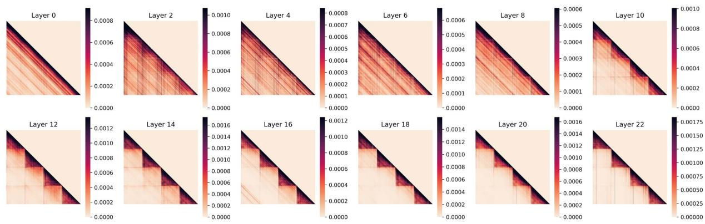  
Figure 4: Inter-image and intra-image token attention across layers. The attention patterns transitions from cross-image to intra-image interactions as we advance in depth.

Finding 2: Current LVLMs primarily behave as single-image models: performance peaks when the vision-token sequence length matches that produced by one or two images.

Information aggregation across images: Prior benchmarks rarely control for how information is distributed across images, making it difficult to isolate whether models can effectively aggregate information across images. To this end, we vary the information spread in the counting task, which defines how object instances are distributed across images. In Fig. 1 (left and middle) we show the results of increasing the number of images containing the object instance from 1 to 7. We observe a sharp accuracy drop that approaches 0 even when very few distractors are present. This trend is consistent across all models tested and manifests both in balanced and unbalanced counting settings. This indicates that the models may rely on shortcuts, such as focusing on a single or very small subset of images, rather than effectively integrating information from all provided images.

Finding 3: Current LVLMs struggle to aggregate information across multiple images.

Robustness to visual distractors. In real-world scenarios, models often encounter irrelevant or distracting information. To evaluate the robustness of LVLMs, we introduce a varying numbers of irrelevant images into the input sequence. As shown in

Fig. 1 (left), the accuracy decreases as the number of distractors increases (e.g: from 79.0% to 66.5% (1 vs 34 distractors) for 1 query image, from 75.0% to 12.5% for two query images, etc., for LLaVA-OV). A particularly pronounced drop occurs as the number of images containing the object of interest increases, suggesting that distractors exacerbate the models’ existing difficulties in aggregating information across multiple images.

Finding 4: Models are sensitive to visual distractors, especially if information is spread out.

Multi-concept tracking. The ability to track and attend to multiple concepts simultaneously is critical for multi-image understanding. To probe this capability, we vary the number of object classes k that the model is required to count. As shown in Fig. 1 (right), the model performance degrades sharply as k increases, indicating a limited capacity to handle multiple concepts at once.

Finding 5: LVLMs demonstrate limited capacity for multi-concept tracking, reducing their reliability on complex multi-object queries.

Multi-image interaction. To probe how visual information is propagated and integrated across images at the token level, we analyze attention patterns among vision tokens in multi-image inputs. Concretely, we compute the normalized attention scores from each vision token to all other vision tokens in the input sequence subject to an autoregressive attention masking on a subset of 50 samples. Fig. 4 summarizes the results across a few layers of interest for a LLaVA-OV model for multi-image inputs with 4 images. We find that in earlier layers, there is a significant amount of inter-image attention, indicating that the model is attempting to integrate information across images. However, as we progress to deeper layers, the attention becomes predominantly intra-image. This inflection point occurs somewhere around the middle of the network. This shift may contribute to the observed difficulty in aggregating information across multiple images. Conceptually, the build-up of representations appears to proceed from broad semantic correlations across images to finer-grained, instance-level integration.

<table><tr><td rowspan=1 colspan=3>Model</td><td rowspan=1 colspan=1>Geographic.</td><td rowspan=1 colspan=1>Counting</td><td rowspan=1 colspan=1>Action.</td><td rowspan=1 colspan=1>Grounding</td><td rowspan=1 colspan=1>Matching.</td><td rowspan=1 colspan=1>|Ordering</td><td rowspan=1 colspan=1>|Scene.</td><td rowspan=1 colspan=1>|Difference.</td><td rowspan=1 colspan=1>Cartoon.</td><td rowspan=1 colspan=1>Diagram|</td><td rowspan=1 colspan=1>|Attribute.</td><td rowspan=1 colspan=1>Retrieval</td><td rowspan=1 colspan=1>[Overall</td></tr><tr><td rowspan=1 colspan=3>Random ChoiceHuman</td><td rowspan=1 colspan=1>25.098.0</td><td rowspan=1 colspan=1>21.094.9</td><td rowspan=1 colspan=1>23.497.6</td><td rowspan=1 colspan=1>25.085.7</td><td rowspan=1 colspan=1>24.194.8</td><td rowspan=1 colspan=1>22.887.5</td><td rowspan=1 colspan=1>25.094.6</td><td rowspan=1 colspan=1>23.292.9</td><td rowspan=1 colspan=1>25.082.1</td><td rowspan=1 colspan=1>29.698.99</td><td rowspan=1 colspan=1>20.087.6</td><td rowspan=1 colspan=1>21.386.3</td><td rowspan=1 colspan=1>24.093.2</td></tr><tr><td rowspan=7 colspan=3>GPT-4o (OpenAI, 2023)Gemini Pro (Team et al., 2023)Mantis-8b-Idefics2 (Jiang et al., 2024b)Idefics-9B-Instruct (Laurençon et al., 2023)</td><td rowspan=4 colspan=1>56.048.0</td><td rowspan=4 colspan=1>49.228.6</td><td rowspan=1 colspan=1>44.5</td><td rowspan=1 colspan=1>36.9</td><td rowspan=1 colspan=1>86.9</td><td rowspan=1 colspan=1>23.44</td><td rowspan=1 colspan=1>71.5</td><td rowspan=1 colspan=1>60.3</td><td rowspan=1 colspan=1>51.3</td><td rowspan=1 colspan=1>88.7</td><td></td><td></td><td></td></tr><tr><td rowspan=3 colspan=1>36.0</td><td rowspan=3 colspan=1>28.6</td><td rowspan=3 colspan=1>66.6</td><td rowspan=3 colspan=1>12.5</td><td></td><td></td><td></td><td></td><td></td><td></td><td></td></tr><tr><td></td><td></td><td></td><td></td><td rowspan=2 colspan=1>56.141.3</td><td rowspan=2 colspan=1>80.143.8</td><td rowspan=2 colspan=1>68.049.4</td></tr><tr><td rowspan=1 colspan=1>59.1</td><td rowspan=1 colspan=1>45.3</td><td rowspan=1 colspan=1>47.4</td><td rowspan=1 colspan=1>64.8</td></tr><tr><td rowspan=1 colspan=2></td><td rowspan=1 colspan=1>26.0</td><td rowspan=1 colspan=1>38.5</td><td rowspan=1 colspan=1>33.5</td><td rowspan=1 colspan=1>26.2</td><td rowspan=1 colspan=1>53.9</td><td rowspan=1 colspan=1>18.8</td><td rowspan=1 colspan=1>57.0</td><td rowspan=1 colspan=1>28.8</td><td rowspan=1 colspan=1>38.5</td><td rowspan=1 colspan=1>67.6</td><td rowspan=1 colspan=1>48.5</td><td rowspan=1 colspan=1>35.6</td><td rowspan=2 colspan=1>44.535.4</td></tr><tr><td rowspan=1 colspan=1>3)</td><td rowspan=1 colspan=1>35.0</td><td rowspan=1 colspan=1>21.8</td><td rowspan=1 colspan=1>26.2</td><td rowspan=1 colspan=1>26.2</td><td rowspan=1 colspan=1>24.8</td><td rowspan=1 colspan=1>15.6</td><td rowspan=1 colspan=1>56.5</td><td rowspan=1 colspan=1>27.6</td><td rowspan=1 colspan=1>39.7</td><td rowspan=1 colspan=1>25.4</td><td rowspan=1 colspan=1>17.9</td><td rowspan=1 colspan=1>17.1</td></tr><tr><td rowspan=10 colspan=3>VILA1.5-13B (Lin et al., 2024)LLaVA-NeXT-34B (Liu et al., 2024b)LLaVA-v1.5-7B (Liu et al., 2024a)LLaVA-v1.5-13B (Liu et al., 2024a)CogVLM (Wang et al., 2024c)MiniGPT-4-v2 (Chen et al., 2023)Qwen2-VL-7B (Wang et al., 2024b)Qwen2-VL-2B (Wang et al., 2024b)InternVL2-8B (Chen et al., 2024a)</td><td rowspan=1 colspan=1>34.0</td><td rowspan=1 colspan=1>31.2</td><td rowspan=1 colspan=1>27.4</td><td rowspan=1 colspan=1>26.2</td><td rowspan=1 colspan=1>37.3</td><td rowspan=1 colspan=1>15.6</td><td rowspan=1 colspan=1>48.4</td><td rowspan=1 colspan=1>32.6</td><td rowspan=1 colspan=1>43.6</td><td rowspan=1 colspan=1>37.7</td><td rowspan=1 colspan=1>31.6</td><td rowspan=1 colspan=1>24.0</td><td rowspan=1 colspan=1>33.6</td></tr><tr><td rowspan=1 colspan=1>31.0</td><td rowspan=1 colspan=1>19.7</td><td rowspan=1 colspan=1>28.7</td><td rowspan=1 colspan=1>25.0</td><td rowspan=1 colspan=1>40.9</td><td rowspan=1 colspan=1>10.9</td><td rowspan=1 colspan=1>56.5</td><td rowspan=1 colspan=1>24.7</td><td rowspan=1 colspan=1>30.8</td><td rowspan=1 colspan=1>42.7</td><td rowspan=1 colspan=1>24.5</td><td rowspan=1 colspan=1>30.1</td><td rowspan=1 colspan=1>33.1</td></tr><tr><td rowspan=1 colspan=1>12.0</td><td rowspan=1 colspan=1>36.3</td><td rowspan=1 colspan=1>26.2</td><td rowspan=1 colspan=1>33.3</td><td rowspan=1 colspan=1>37.9</td><td rowspan=1 colspan=1>21.9</td><td rowspan=1 colspan=1>54.3</td><td rowspan=1 colspan=1>22.1</td><td rowspan=1 colspan=1>41.0</td><td rowspan=1 colspan=1>38.2</td><td rowspan=1 colspan=1>38.3</td><td rowspan=1 colspan=1>25.0</td><td rowspan=1 colspan=1>33.3</td></tr><tr><td rowspan=1 colspan=1>20.0</td><td rowspan=1 colspan=1>23.1</td><td rowspan=1 colspan=1>27.4</td><td rowspan=1 colspan=1>14.3</td><td rowspan=1 colspan=1>23.5</td><td rowspan=1 colspan=1>23.4</td><td rowspan=1 colspan=1>35.0</td><td rowspan=1 colspan=1>20.0</td><td rowspan=1 colspan=1>24.4</td><td rowspan=1 colspan=1>25.1</td><td rowspan=1 colspan=1>23.0</td><td rowspan=1 colspan=1>19.9</td><td rowspan=1 colspan=1>23.5</td></tr><tr><td rowspan=1 colspan=1>20.0</td><td rowspan=1 colspan=1>25.2</td><td rowspan=1 colspan=1>29.3</td><td rowspan=1 colspan=1>14.3</td><td rowspan=1 colspan=1>20.3</td><td rowspan=1 colspan=1>20.3</td><td rowspan=1 colspan=1>36.6</td><td rowspan=1 colspan=1>20.0</td><td rowspan=1 colspan=1>25.6</td><td rowspan=1 colspan=1>31.7</td><td rowspan=1 colspan=1>23.0</td><td rowspan=1 colspan=1>20.9</td><td rowspan=1 colspan=1>24.4</td></tr><tr><td rowspan=1 colspan=1>13.0</td><td rowspan=1 colspan=1>14.1</td><td rowspan=1 colspan=1>26.2</td><td rowspan=1 colspan=1>16.7</td><td rowspan=1 colspan=1>21.3</td><td rowspan=1 colspan=1>12.5</td><td rowspan=1 colspan=1>41.4</td><td rowspan=1 colspan=1>19.7</td><td rowspan=1 colspan=1>41.0</td><td rowspan=1 colspan=1>19.6</td><td rowspan=1 colspan=1>16.3</td><td rowspan=1 colspan=1>15.8</td><td rowspan=1 colspan=1>20.9</td></tr><tr><td rowspan=1 colspan=1>13.0</td><td rowspan=1 colspan=1>12.0</td><td rowspan=1 colspan=1>14.0</td><td rowspan=1 colspan=1>25.0</td><td rowspan=1 colspan=1>17.0</td><td rowspan=1 colspan=1>18.8</td><td rowspan=1 colspan=1>14.5</td><td rowspan=1 colspan=1>20.0</td><td rowspan=1 colspan=1>21.8</td><td rowspan=1 colspan=1>21.6</td><td rowspan=1 colspan=1>17.4</td><td rowspan=1 colspan=1>14.7</td><td rowspan=1 colspan=1>17.4</td></tr><tr><td rowspan=1 colspan=1>12.0</td><td rowspan=1 colspan=1>38.9</td><td rowspan=1 colspan=1>42.7</td><td rowspan=1 colspan=1>28.5</td><td rowspan=1 colspan=1>57.5</td><td rowspan=1 colspan=1>10.9</td><td rowspan=1 colspan=1>75.3</td><td rowspan=1 colspan=1>32.9</td><td rowspan=1 colspan=1>38.5</td><td rowspan=1 colspan=1>49.2</td><td rowspan=1 colspan=1>46.4</td><td rowspan=1 colspan=1>26.7</td><td rowspan=1 colspan=1>43.0</td></tr><tr><td rowspan=1 colspan=1>14.0</td><td rowspan=1 colspan=1>27.8</td><td rowspan=1 colspan=1>35.4</td><td rowspan=1 colspan=1>26.2</td><td rowspan=1 colspan=1>34.3</td><td rowspan=1 colspan=1>10.9</td><td rowspan=1 colspan=1>51.1</td><td rowspan=1 colspan=1>19.4</td><td rowspan=1 colspan=1>39.7</td><td rowspan=1 colspan=1>21.4</td><td rowspan=1 colspan=1>31.1</td><td rowspan=1 colspan=1>15.4</td><td rowspan=1 colspan=1>27.2</td></tr><tr><td rowspan=1 colspan=1>17.0</td><td rowspan=1 colspan=1>30.3</td><td rowspan=1 colspan=1>34.7</td><td rowspan=1 colspan=1>28.5</td><td rowspan=1 colspan=1>43.5</td><td rowspan=1 colspan=1>17.2</td><td rowspan=1 colspan=1>60.2</td><td rowspan=1 colspan=1>26.2</td><td rowspan=1 colspan=1>46.2</td><td rowspan=1 colspan=1>46.5</td><td rowspan=1 colspan=1>42.8</td><td rowspan=1 colspan=1>33.6</td><td rowspan=1 colspan=1>37.9</td></tr><tr><td rowspan=1 colspan=3>InternVL2-2B (Chen et al., 2024a)</td><td rowspan=1 colspan=1>17.0</td><td rowspan=1 colspan=1>21.8</td><td rowspan=1 colspan=1>26.8</td><td rowspan=1 colspan=1>26.2</td><td rowspan=1 colspan=1>31.7</td><td rowspan=1 colspan=1>10.9</td><td rowspan=1 colspan=1>52.2</td><td rowspan=1 colspan=1>17.4</td><td rowspan=1 colspan=1>35.9</td><td rowspan=1 colspan=1>21.6</td><td rowspan=1 colspan=1>16.8</td><td rowspan=1 colspan=1>13.7</td><td rowspan=1 colspan=1>24.3</td></tr><tr><td rowspan=1 colspan=3>LLaVA-OV-0.5B (Li et al., 2024a)</td><td rowspan=1 colspan=1>22.0</td><td rowspan=1 colspan=1>20.9</td><td rowspan=1 colspan=1>31.1</td><td rowspan=1 colspan=1>25.0</td><td rowspan=1 colspan=1>30.2</td><td rowspan=1 colspan=1>7.8</td><td rowspan=1 colspan=1>46.7</td><td rowspan=1 colspan=1>24.1</td><td rowspan=1 colspan=1>42.3</td><td rowspan=1 colspan=1>25.1</td><td rowspan=1 colspan=1>23.9</td><td rowspan=1 colspan=1>20.5</td><td rowspan=1 colspan=1>26.8</td></tr><tr><td rowspan=2 colspan=3>OursOurs (Masked)</td><td rowspan=2 colspan=1>43.031.0</td><td rowspan=1 colspan=1>20.5</td><td rowspan=1 colspan=1>41.4</td><td rowspan=1 colspan=1>22.6</td><td rowspan=1 colspan=1>38.4</td><td rowspan=1 colspan=1>9.4</td><td rowspan=1 colspan=1>52.7</td><td rowspan=1 colspan=1>22.1</td><td rowspan=1 colspan=1>37.2</td><td rowspan=1 colspan=1>39.4</td><td rowspan=1 colspan=1>29.6</td><td rowspan=1 colspan=1>32.5</td><td rowspan=2 colspan=1>33.632.5</td></tr><tr><td rowspan=1 colspan=1>17.5</td><td rowspan=1 colspan=1>40.8</td><td rowspan=1 colspan=1>33.3</td><td rowspan=1 colspan=1>37.3</td><td rowspan=1 colspan=1>14.1</td><td rowspan=1 colspan=1>53.8</td><td rowspan=1 colspan=1>21.5</td><td rowspan=1 colspan=1>42.3</td><td rowspan=1 colspan=1>34.9</td><td rowspan=1 colspan=1>28.1</td><td rowspan=1 colspan=1>32.9</td></tr><tr><td rowspan=1 colspan=3>LLaVA-OV-7B (Li et al., 2024a)</td><td rowspan=1 colspan=1>43.3</td><td rowspan=1 colspan=1>24.8</td><td rowspan=1 colspan=1>36.6</td><td rowspan=1 colspan=1>29.7</td><td rowspan=1 colspan=1>45.3</td><td rowspan=1 colspan=1>17.2</td><td rowspan=1 colspan=1>71.5</td><td rowspan=1 colspan=1>30.0</td><td rowspan=1 colspan=1>35.9</td><td rowspan=1 colspan=1>54.2</td><td rowspan=1 colspan=1>32.7</td><td rowspan=1 colspan=1>46.2</td><td rowspan=1 colspan=1>41.7</td></tr><tr><td rowspan=1 colspan=3>Ours (Masked)</td><td rowspan=1 colspan=1>44.0</td><td rowspan=1 colspan=1>35.9</td><td rowspan=1 colspan=1>51.2</td><td rowspan=1 colspan=1>42.9</td><td rowspan=1 colspan=1>59.9</td><td rowspan=1 colspan=1>12.5</td><td rowspan=1 colspan=1>71.0</td><td rowspan=1 colspan=1>43.5</td><td rowspan=1 colspan=1>38.5</td><td rowspan=1 colspan=1>62.1</td><td rowspan=1 colspan=1>52.0</td><td rowspan=1 colspan=1>48.6</td><td rowspan=1 colspan=1>51.3</td></tr></table>

Table 2: Performance comparison across different MuirBench (Wang et al., 2024a) subtasks. Ours (Masked): Our efficient model trained with LoRA and masked attention. Ours: Fully fine-tuned model. Due to computational constraints, we do not fully finetune LLaVA-7B model.

This has a series of consequences: (1) the early inter-image attention may introduce noise or distractions that hinder the model’s ability to focus on relevant information in later layers; hence, early mistakes in cross-image interaction are harder to correct; (2) the cross-image interaction under a causal attention mechanism may lead to error propagation, where tokens belonging to later images cumulate higher amount of noise with incorrect information from earlier images; this may reduce the vision perception capability of the model for later images and explain some of the performance degradation as the number of images increases; (3) the architecture and training objectives may not sufficiently encourage cross-image integration, leading to a default behavior of treating images independently; (4) the observed attention patterns may reflect inherent biases in the training data, where the multi-image tasks don’t require deep cross-image reasoning, leading the model to learn shortcuts that prioritize single-image understanding.

Finding 6: Inter-image attention diminishes in deeper layers of LVLMs, indicating a shift from cross-image integration to intra-image focus.

## 4 Method

In the previous section, we identified key limitations of LVLMs on multi-image tasks via zero-shot evaluation using the MIMIC benchmark. Here, we investigate targeted fine-tuning strategies derived from our findings and aimed at improving multi-image reasoning capabilities. In particular, we explore two complementary approaches: a data-centric fine-tuning strategy using synthetically generated multi-image data, and an optimizationcentric attention-masking strategy.

Multi-Image Finetuning: We fine-tune LLaVA-OV models on a unified training dataset composed of samples procedurally generated using the MIMIC pipeline (see section 3.1) together with the original LLaVA-OV multi-image instructiontuning data (approximately 580K samples). Unlike the MIMIC benchmark used for evaluation, our fine-tuning data is built from OpenImages and provides explicit supervision for cross-image reasoning. It contains approximately 198K samples, with sequence lengths of up to 10 images (see appendix), deliberately exposing models to substantially longer vision-token sequences. All four MIMIC tasks are included to encourage diverse multi-image reasoning behaviors.

Attention Masking: Our analysis shows that inter-image attention diminishes in deeper layers (see fig. 4). Motivated by this, we apply layer-wise attention masking during fine-tuning, restricting vision tokens to attend only to tokens from the same image in selected layers, while leaving text-token attention unchanged. This design offers two key benefits. First, it reduces unnecessary cross-image interactions, leading to a more efficient model with lower computational cost (see table 7 and fig. 7 of appendix). Second, it encourages cleaner imagelocal representations in deeper layers, which empirically improves performance across several benchmarks. For this setting, we employ LoRA-based fine-tuning to further improve parameter efficiency. See appendix for implementation details.

<table><tr><td rowspan=1 colspan=1>Model</td><td rowspan=1 colspan=1>|MuirBench|B</td><td rowspan=1 colspan=1>link|</td><td rowspan=1 colspan=1>MMIU|M</td><td rowspan=1 colspan=1>IRB||</td><td rowspan=1 colspan=1>MMT (val)</td><td rowspan=1 colspan=1>|NLVR2</td><td rowspan=1 colspan=1>Avg.</td></tr><tr><td rowspan=3 colspan=1>GPT-4VInternVL2-Llama3-76BLLaVA-v1.5-7B</td><td rowspan=1 colspan=1>62.3</td><td rowspan=1 colspan=1>54.6</td><td rowspan=1 colspan=1></td><td rowspan=1 colspan=1>53.1</td><td rowspan=1 colspan=1>64.3</td><td rowspan=1 colspan=1>=</td><td rowspan=1 colspan=1>=</td></tr><tr><td rowspan=1 colspan=1>51.2</td><td rowspan=1 colspan=1>56.8</td><td rowspan=1 colspan=1>44.2</td><td rowspan=1 colspan=1>58.2</td><td rowspan=1 colspan=1>67.4</td><td rowspan=1 colspan=1>1</td><td rowspan=2 colspan=1>1=</td></tr><tr><td rowspan=1 colspan=1>20.0</td><td rowspan=1 colspan=1>37.1</td><td rowspan=1 colspan=1>19.2</td><td rowspan=1 colspan=1>28.5</td><td rowspan=1 colspan=1></td><td rowspan=1 colspan=1></td></tr><tr><td rowspan=1 colspan=1>InternVL2-2B</td><td rowspan=1 colspan=1>24.3</td><td rowspan=1 colspan=1>16.3</td><td rowspan=1 colspan=1>13.6</td><td rowspan=1 colspan=1>25.0</td><td rowspan=1 colspan=1>46.7</td><td rowspan=1 colspan=1>18.9</td><td rowspan=1 colspan=1>24.1</td></tr><tr><td rowspan=1 colspan=1>InternVL2-8B</td><td rowspan=1 colspan=1>37.9</td><td rowspan=1 colspan=1>23.4</td><td rowspan=1 colspan=1>36.8</td><td rowspan=1 colspan=1>48.6</td><td rowspan=1 colspan=1>57.9</td><td rowspan=1 colspan=1>8.7</td><td rowspan=1 colspan=1>35.6</td></tr><tr><td rowspan=2 colspan=1>Qwen2VL-2BQwen2VL-7B</td><td rowspan=1 colspan=1>27.2</td><td rowspan=1 colspan=1>12.7</td><td rowspan=1 colspan=1>38.7</td><td rowspan=1 colspan=1>45.9</td><td rowspan=1 colspan=1>51.9</td><td rowspan=1 colspan=1>41.6</td><td rowspan=1 colspan=1>36.3</td></tr><tr><td rowspan=1 colspan=1>43.0</td><td rowspan=1 colspan=1>17.7</td><td rowspan=1 colspan=1>52.6</td><td rowspan=1 colspan=1>60.8</td><td rowspan=1 colspan=1>61.7</td><td rowspan=1 colspan=1>41.5</td><td rowspan=1 colspan=1>46.2</td></tr><tr><td rowspan=1 colspan=1>LLaVA-OV-0.5B</td><td rowspan=1 colspan=1>26.8</td><td rowspan=1 colspan=1>40.4</td><td rowspan=1 colspan=1>34.2</td><td rowspan=1 colspan=1>31.8</td><td rowspan=1 colspan=1>41.1</td><td rowspan=1 colspan=1>61.2</td><td rowspan=1 colspan=1>39.3</td></tr><tr><td rowspan=1 colspan=1>Ours</td><td rowspan=1 colspan=1>33.6</td><td rowspan=1 colspan=1>38.9</td><td rowspan=1 colspan=1>37.2</td><td rowspan=1 colspan=1>32.8</td><td rowspan=1 colspan=1>45.6</td><td rowspan=1 colspan=1>68.0</td><td rowspan=1 colspan=1>42.7</td></tr><tr><td rowspan=1 colspan=1>Ours (masked)</td><td rowspan=1 colspan=1>32.5</td><td rowspan=1 colspan=1>39.1</td><td rowspan=1 colspan=1>36.3</td><td rowspan=1 colspan=1>28.5</td><td rowspan=1 colspan=1>45.9</td><td rowspan=1 colspan=1>65.1</td><td rowspan=1 colspan=1>41.2</td></tr><tr><td rowspan=1 colspan=1>LLaVA-OV-7B</td><td rowspan=1 colspan=1>41.7</td><td rowspan=1 colspan=1>50.4</td><td rowspan=1 colspan=1>45.0</td><td rowspan=1 colspan=1>47.2</td><td rowspan=1 colspan=1>56.6</td><td rowspan=1 colspan=1>84.2</td><td rowspan=1 colspan=1>54.2</td></tr><tr><td rowspan=1 colspan=1>Ours (masked)</td><td rowspan=1 colspan=1>51.3</td><td rowspan=1 colspan=1>51.9</td><td rowspan=1 colspan=1>45.5</td><td rowspan=1 colspan=1>51.0</td><td rowspan=1 colspan=1>55.3</td><td rowspan=1 colspan=1>87.3</td><td rowspan=1 colspan=1>57.1</td></tr></table>

Table 3: Comparisons on multi-image benchmarks: MuirBench, Blink, MMIU, MIRB, MMT, and NLVR2.

<table><tr><td rowspan=1 colspan=1>Model</td><td rowspan=1 colspan=1>Common</td><td rowspan=1 colspan=1>Counting</td><td rowspan=1 colspan=1>Odd-one</td><td rowspan=1 colspan=1>Listing</td><td rowspan=1 colspan=1>Avg.</td></tr><tr><td rowspan=5 colspan=1>Mantis-8B-llama3 (Jiang et al., 2024b)InternVL2-2B (Chen et al., 2024a)InternVL2-8B (Chen et al., 2024a)Qwen2VL-2B (Wang et al., 2024b)Qwen2VL-7B (Wang et al., 2024b)</td><td rowspan=1 colspan=1>13.0</td><td rowspan=1 colspan=1>19.9</td><td rowspan=1 colspan=1>10.9</td><td rowspan=1 colspan=1>17.0</td><td rowspan=1 colspan=1>15.2</td></tr><tr><td rowspan=1 colspan=1>25.6</td><td rowspan=1 colspan=1>11.7</td><td rowspan=1 colspan=1>9.6</td><td rowspan=1 colspan=1>19.6</td><td rowspan=1 colspan=1>16.6</td></tr><tr><td rowspan=3 colspan=1>45.241.958.6</td><td rowspan=1 colspan=1>18.9</td><td rowspan=1 colspan=1>30.2</td><td rowspan=2 colspan=1>29.823.8</td><td rowspan=2 colspan=1>31.029.4</td></tr><tr><td rowspan=1 colspan=1>21.7</td><td rowspan=1 colspan=1>30.2</td></tr><tr><td rowspan=1 colspan=1>35.7</td><td rowspan=1 colspan=1>35.9</td><td rowspan=1 colspan=1>23.4</td><td rowspan=1 colspan=1>38.4</td></tr><tr><td rowspan=1 colspan=1>LLaVA-OV-0.5B (Li et al., 2024a)</td><td rowspan=1 colspan=1>44.7</td><td rowspan=1 colspan=1>29.7</td><td rowspan=1 colspan=1>8.3</td><td rowspan=1 colspan=1>22.8</td><td rowspan=1 colspan=1>26.4</td></tr><tr><td rowspan=2 colspan=1>OursOurs (masked)</td><td rowspan=1 colspan=1>68.5</td><td rowspan=1 colspan=1>37.8</td><td rowspan=1 colspan=1>41.0</td><td rowspan=1 colspan=1>34.5</td><td rowspan=1 colspan=1>45.5</td></tr><tr><td rowspan=1 colspan=1>68.9</td><td rowspan=1 colspan=1>35.8</td><td rowspan=1 colspan=1>50.9</td><td rowspan=1 colspan=1>42.0</td><td rowspan=1 colspan=1>49.4</td></tr><tr><td rowspan=1 colspan=1>LLaVA-OV-7B (Li et al., 2024a)</td><td rowspan=1 colspan=1>71.5</td><td rowspan=1 colspan=1>29.7</td><td rowspan=1 colspan=1>58.1</td><td rowspan=1 colspan=1>56.6</td><td rowspan=1 colspan=1>54.0</td></tr><tr><td rowspan=1 colspan=1>Ours (masked)</td><td rowspan=1 colspan=1>75.5</td><td rowspan=1 colspan=1>51.2</td><td rowspan=1 colspan=1>72.1</td><td rowspan=1 colspan=1>55.0</td><td rowspan=1 colspan=1>63.8</td></tr></table>

Table 4: Comparisons on our benchmark. We report model’s accuracy for Odd-one, Common and Counting whereas f1 score for listing benchmark.

## 5 Results

## 5.1 Comparison with state-of-the-art

Existing multi-image benchmarks. We first report results on MuirBench (Wang et al., 2024a) and its subtasks in table 2. Across all model sizes, our approach consistently outperforms the corresponding LLaVA-OV baseline. Notably, for the 7B model, our masked-attention variant improves the overall score from 41.7 to 51.3%. We observe a similar trend for the smaller 0.5B variant, indicating that the improvements are robust across model sizes. Interestingly, our method generalizes well to out-of-domain subtasks, including geographic, action and diagram understanding, suggesting that our data construction strategy teaches the model multi-image processing concepts rather than object perception, which we argue develops already in the single-image training phase.

Next, we extend the evaluation to additional multi-image benchmarks, including Blink (Fu et al., 2024b), MMIU (Meng et al., 2024), MIRB (Zhao et al., 2024), MMT (Ying et al., 2024), and NLVR2 (Suhr et al., 2019). Our approach achieves consistent improvements across all variants. As shown in table 5, our masked-attention fine-tuning strategy yields significant gains over the baseline even with very few trainable parameters, and in some cases outperforms full fine-tuning (e.g., LLaVA-OV 0.5B).

MIMIC benchmark. We report results in table 4. Unless otherwise specified, all results for Counting subtask correspond to the balanced split. Our method significantly outperforms LLaVA-OV across all four tasks. For the 0.5B model, the average score improves from 26.4 to 49.4, while for the 7B model, masked fine-tuning increases performance from 54.0 to 63.8. Gains are most pronounced on the Common and Odd-One tasks, highlighting improved information aggregation and multi-concept reasoning across images.

## 5.2 Ablation studies and analysis

Cross-task generalization. In this experiment, we train models on individual subtasks (e.g., Counting, Common, Odd-One, and Listing) to analyze their complementary roles and assess cross-task generalization. Table 5 (left) shows the results. We observe that training on the Common task generalizes well to Counting and Listing, but not to Odd-One; a similar trend is observed when training on Odd-One. This behavior is expected, as the two tasks are complementary in nature: Common requires aggregating information across multiple images, whereas Odd-One emphasizes localizing distinctive evidence within a single image. Training on Listing consistently improves performance across all other tasks, while training on Counting primarily benefits Odd-One.

Efficiency analysis. Table 5 (mid) demonstrates that our masked attention variant achieves superior performance with substantially lower computational cost compared with vanilla attention. On the 0.5B backbone, masked finetuning reduces the FLOPs by ∼81%, while outperforming full finetuning. This confirms that selectively constraining inter-image attention is both effective and efficient. See appendix for details on FLOPs estimations.

<table><tr><td></td><td>|Common|</td><td>Count</td><td>|Odd-one|</td><td>|List</td></tr><tr><td>Ours (all)</td><td>68.5</td><td>37.8</td><td>41.0</td><td>34.5</td></tr><tr><td>LLaVA-OV-0.5B</td><td>44.7</td><td>29.7</td><td>8.3</td><td>22.8</td></tr><tr><td>only Common</td><td>73.7</td><td>32.0</td><td>3.7</td><td>30.7</td></tr><tr><td>only Counting</td><td>35.8</td><td>39.4</td><td>12.2</td><td>20.7</td></tr><tr><td>only Odd One</td><td>34.4</td><td>31.8</td><td>53.6</td><td>31.1</td></tr><tr><td>only Listing</td><td>46.0</td><td>29.3</td><td>11.1</td><td>28.3</td></tr></table>

<table><tr><td rowspan=1 colspan=4></td><td rowspan=1 colspan=1></td><td rowspan=1 colspan=1></td></tr><tr><td rowspan=1 colspan=3>LLaVA-OV-0</td><td rowspan=1 colspan=1>.5B</td><td rowspan=1 colspan=1>58B (0%)</td><td rowspan=1 colspan=1>26.4</td></tr><tr><td rowspan=1 colspan=4>Ours</td><td rowspan=1 colspan=1>58B (0%)</td><td rowspan=1 colspan=1>45.5</td></tr><tr><td rowspan=1 colspan=4>Ours (masked)</td><td rowspan=1 colspan=1>11.2B (81%)</td><td rowspan=1 colspan=1>49.4</td></tr></table>

<table><tr><td rowspan=1 colspan=1>Layers masked|</td><td rowspan=1 colspan=1>|Comm.</td><td rowspan=1 colspan=1>|Count.</td><td rowspan=1 colspan=1>|Odd.</td><td rowspan=1 colspan=1>List.</td><td rowspan=1 colspan=1>Avg.</td></tr><tr><td rowspan=1 colspan=1>No mask.</td><td rowspan=1 colspan=1>70.0</td><td rowspan=1 colspan=1>32.0</td><td rowspan=1 colspan=1>37.9</td><td rowspan=1 colspan=1>44.5</td><td rowspan=1 colspan=1>46.1</td></tr><tr><td rowspan=1 colspan=1>0-23</td><td rowspan=1 colspan=1>64.5</td><td rowspan=1 colspan=1>36.1</td><td rowspan=1 colspan=1>20.9</td><td rowspan=1 colspan=1>29.2</td><td rowspan=1 colspan=1>37.7</td></tr><tr><td rowspan=1 colspan=1>0-11</td><td rowspan=1 colspan=1>62.5</td><td rowspan=1 colspan=1>27.3</td><td rowspan=1 colspan=1>28.8</td><td rowspan=1 colspan=1>33.6</td><td rowspan=1 colspan=1>38.1</td></tr><tr><td rowspan=1 colspan=1>12-23</td><td rowspan=1 colspan=1>68.9</td><td rowspan=1 colspan=1>35.8</td><td rowspan=1 colspan=1>50.9</td><td rowspan=1 colspan=1>42.0</td><td rowspan=1 colspan=1>49.4</td></tr></table>

Table 5: Left: Cross-task generalisation. We train LLaVA-OV model individually with each task and compare cross task generalisation. Ours (with all task): upperbound trained with all 4 tasks. Middle: Efficiency Analysis of Masked Attention. Right: Ablation wrt different layers for attention masking. Experiments on LLaVA-OV 0.5B.

Attention masking strategy. Table 5 (right) ablates the layers at which attention masking is applied. Masking only deeper layers (layers 12–23) yields the best performance, whereas masking early layers significantly degrades accuracy. These results suggest that early layers are important for effective cross-image information aggregation.

Qualitative analysis. Figure 5 visualizes answerto-image attention for a ‘Counting’ example. The baseline fails to attend to relevant objects in the third image, resulting in an incorrect count. In contrast, our model exhibits balanced and semantically grounded attention across all images, leading to the correct prediction. This qualitative evidence corroborates our quantitative improvements.

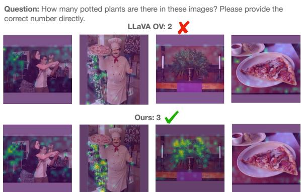  
Figure 5: Answer-to-Image Attention: The baseline LLaVA OV (top row) fails to attend to the potted plant in the third image, whereas our method (bottom row) correctly focuses on the relevant object. Visualization is shown at the 15th layer of the LLM.

## 6 Conclusions

We systematically investigated the capabilities of LVLMs in multi-image contexts through MIMIC, a novel benchmark designed to isolate specific unitary behaviors. Our analysis reveals that current SOTA models fundamentally exhibit “singleimage behavior,” struggling to aggregate information across inputs or track multiple concepts in the presence of visual distractors. To address this, we introduced a data-centric synthetic fine-tuning strategy and an optimization-centric attention-masking mechanism. These contributions not only resolve key failure modes but also establish new state-ofthe-art results, offering a robust foundation for future research in multi-image understanding.

## 7 Limitations

While our work offers a rigorous analysis and effective solutions for multi-image LVLMs, we note the following boundaries of our study:

• Benchmark Domain: We constructed MIMIC using MS-COCO to maintain precise control over confounding variables (e.g., object counts, occlusion levels). While this design enables exact “unit testing” of model reasoning, extending this controlled methodology to specialized domains, such as dense documents or medical imaging, remains an exciting avenue for future research.

• Resolution Trade-offs: Our analysis demonstrates that reducing sequence length improves multi-image reasoning by mitigating context overload. While highly effective for semantic understanding and counting, tasks requiring pixel-perfect perception of extremely small details might benefit from adaptive resolution strategies, which were outside the scope of this study.

• Architectural Scope: Our proposed analysis focuses on models with open weights. While we expect conclusions to hold for closed models, additional validations (which induce budget constraints) may be useful for reinforcing our findings.

## References

Marah Abdin, Jyoti Aneja, Harkirat Behl, Sébastien Bubeck, Ronen Eldan, Suriya Gunasekar, Michael Harrison, Russell J Hewett, Mojan Javaheripi, Piero Kauffmann, and 1 others. 2024. Phi-4 technical report. arXiv preprint arXiv:2412.08905.

Jean-Baptiste Alayrac, Jeff Donahue, Pauline Luc, Antoine Miech, Iain Barr, Yana Hasson, Karel Lenc, Arthur Mensch, Katherine Millican, Malcolm Reynolds, and 1 others. 2022. Flamingo: a visual language model for few-shot learning. Neural Information Processing Systems.

Stanislaw Antol, Aishwarya Agrawal, Jiasen Lu, Margaret Mitchell, Dhruv Batra, C Lawrence Zitnick, and Devi Parikh. 2015. VQA: Visual question answering. In IEEE International Conference on Computer Vision.

Jun Chen, Deyao Zhu, Xiaoqian Shen, Xiang Li, Zechun Liu, Pengchuan Zhang, Raghuraman Krishnamoorthi, Vikas Chandra, Yunyang Xiong, and Mohamed Elhoseiny. 2023. MiniGPT-v2: large language model as a unified interface for vision-language multi-task learning. arXiv preprint arXiv:2310.09478.

Zhe Chen, Weiyun Wang, Yue Cao, Yangzhou Liu, Zhangwei Gao, Erfei Cui, Jinguo Zhu, Shenglong Ye, Hao Tian, Zhaoyang Liu, and 1 others. 2024a. Expanding performance boundaries of open-source multimodal models with model, data, and test-time scaling. arXiv preprint arXiv:2412.05271.

Zhe Chen, Jiannan Wu, Wenhai Wang, Weijie Su, Guo Chen, Sen Xing, Muyan Zhong, Qinglong Zhang, Xizhou Zhu, Lewei Lu, and 1 others. 2024b. Internvl: Scaling up vision foundation models and aligning for generic visual-linguistic tasks. In Proceedings of the IEEE/CVF Conference on Computer Vision and Pattern Recognition, pages 24185–24198.

Wenliang Dai, Junnan Li, Dongxu Li, Anthony Tiong, Junqi Zhao, Weisheng Wang, Boyang Li, Pascale N Fung, and Steven Hoi. 2023. InstructBLIP: Towards general-purpose vision-language models with instruction tuning. Neural Information Processing Systems, 36:49250–49267.

Ailin Deng, Tri Cao, Zhirui Chen, and Bryan Hooi. 2025. Words or vision: Do vision-language models have blind faith in text? In IEEE Conference on Computer Vision and Pattern Recognition.

Danny Driess, Fei Xia, Mehdi SM Sajjadi, Corey Lynch, Aakanksha Chowdhery, Ayzaan Wahid, Jonathan Tompson, Quan Vuong, Tianhe Yu, Wenlong Huang, and 1 others. 2023. PaLM-E: An embodied multimodal language model. International Conference on Machine Learning.

Chaoyou Fu, Yuhan Dai, Yongdong Luo, Lei Li, Shuhuai Ren, Renrui Zhang, Zihan Wang, Chenyu Zhou, Yunhang Shen, Mengdan Zhang, and 1 others. 2025. Video-MME: The first-ever comprehensive

evaluation benchmark of multi-modal LLMs in video analysis. In IEEE Conference on Computer Vision and Pattern Recognition.

Chaoyou Fu, Yi-Fan Zhang, Shukang Yin, Bo Li, Xinyu Fang, Sirui Zhao, Haodong Duan, Xing Sun, Ziwei Liu, Liang Wang, and 1 others. 2024a. MME-survey: A comprehensive survey on evaluation of multimodal LLMs. arXiv preprint arXiv:2411.15296.

Xingyu Fu, Yushi Hu, Bangzheng Li, Yu Feng, Haoyu Wang, Xudong Lin, Dan Roth, Noah A Smith, Wei-Chiu Ma, and Ranjay Krishna. 2024b. Blink: Multimodal large language models can see but not perceive. In European Conference on Computer Vision.

Yash Goyal, Tejas Khot, Douglas Summers-Stay, Dhruv Batra, and Devi Parikh. 2017. Making the V in VQA matter: Elevating the role of image understanding in visual question answering. In IEEE Conference on Computer Vision and Pattern Recognition.

Tianrui Guan, Fuxiao Liu, Xiyang Wu, Ruiqi Xian, Zongxia Li, Xiaoyu Liu, Xijun Wang, Lichang Chen, Furong Huang, Yaser Yacoob, and 1 others. 2024. HallusionBench: an advanced diagnostic suite for entangled language hallucination and visual illusion in large vision-language models. In IEEE Conference on Computer Vision and Pattern Recognition.

Wenyi Hong, Weihan Wang, Ming Ding, Wenmeng Yu, Qingsong Lv, Yan Wang, Yean Cheng, Shiyu Huang, Junhui Ji, Zhao Xue, and 1 others. 2024. CogVLM2: Visual language models for image and video understanding. arXiv preprint arXiv:2408.16500.

Drew A Hudson and Christopher D Manning. 2019. GQA: A new dataset for real-world visual reasoning and compositional question answering. In IEEE Conference on Computer Vision and Pattern Recognition.

Albert Q Jiang, Alexandre Sablayrolles, Antoine Roux, Arthur Mensch, Blanche Savary, Chris Bamford, Devendra Singh Chaplot, Diego de las Casas, Emma Bou Hanna, Florian Bressand, and 1 others. 2024a. Mixtral of experts. arXiv preprint arXiv:2401.04088.

Dongfu Jiang, Xuan He, Huaye Zeng, Cong Wei, Max Ku, Qian Liu, and Wenhu Chen. 2024b. Mantis: Interleaved multi-image instruction tuning. arXiv preprint arXiv:2405.01483.

Prannay Kaul, Zhizhong Li, Hao Yang, Yonatan Dukler, Ashwin Swaminathan, CJ Taylor, and Stefano Soatto. 2024. Throne: An object-based hallucination benchmark for the free-form generations of large vision-language models. In IEEE Conference on Computer Vision and Pattern Recognition.

Aniruddha Kembhavi, Mike Salvato, Eric Kolve, Minjoon Seo, Hannaneh Hajishirzi, and Ali Farhadi. 2016. A diagram is worth a dozen images. In European Conference on Computer Vision.

Alina Kuznetsova, Hassan Rom, Neil Alldrin, Jasper Uijlings, Ivan Krasin, Jordi Pont-Tuset, Shahab Kamali, Stefan Popov, Matteo Malloci, Alexander Kolesnikov, and 1 others. 2020. The open images dataset v4: Unified image classification, object detection, and visual relationship detection at scale. International Journal on Computer Vision, 128(7):1956–1981.

Hugo Laurençon, Lucile Saulnier, Léo Tronchon, Stas Bekman, Amanpreet Singh, Anton Lozhkov, Thomas Wang, Siddharth Karamcheti, Alexander Rush, Douwe Kiela, and 1 others. 2023. Obelics: An open web-scale filtered dataset of interleaved imagetext documents. Neural Information Processing Systems.

Bo Li, Yuanhan Zhang, Dong Guo, Renrui Zhang, Feng Li, Hao Zhang, Kaichen Zhang, Peiyuan Zhang, Yanwei Li, Ziwei Liu, and 1 others. 2024a. LLaVA-OneVision: Easy visual task transfer. arXiv preprint arXiv:2408.03326.

Bohao Li, Yuying Ge, Yixiao Ge, Guangzhi Wang, Rui Wang, Ruimao Zhang, and Ying Shan. 2024b. Seedbench: Benchmarking multimodal large language models. In IEEE Conference on Computer Vision and Pattern Recognition.

Ji Lin, Hongxu Yin, Wei Ping, Pavlo Molchanov, Mohammad Shoeybi, and Song Han. 2024. Vila: On pre-training for visual language models. In IEEE Conference on Computer Vision and Pattern Recognition.

Tsung-Yi Lin, Michael Maire, Serge Belongie, James Hays, Pietro Perona, Deva Ramanan, Piotr Dollár, and C Lawrence Zitnick. 2014. Microsoft COCO: Common objects in context. In European Conference on Computer Vision.

Fuxiao Liu, Kevin Lin, Linjie Li, Jianfeng Wang, Yaser Yacoob, and Lijuan Wang. 2023. Mitigating hallucination in large multi-modal models via robust instruction tuning. arXiv preprint arXiv:2306.14565.

Haotian Liu, Chunyuan Li, Yuheng Li, and Yong Jae Lee. 2024a. Improved baselines with visual instruction tuning. In IEEE Conference on Computer Vision and Pattern Recognition.

Haotian Liu, Chunyuan Li, Yuheng Li, Bo Li, Yuanhan Zhang, Sheng Shen, and Yong Jae Lee. 2024b. LLaVA-NeXT: Improved reasoning, OCR, and world knowledge.

Yuan Liu, Haodong Duan, Yuanhan Zhang, Bo Li, Songyang Zhang, Wangbo Zhao, Yike Yuan, Jiaqi Wang, Conghui He, Ziwei Liu, and 1 others. 2024c. Mmbench: Is your multi-modal model an all-around player? In European Conference on Computer Vision. Springer.

Ahmed Masry, Xuan Long Do, Jia Qing Tan, Shafiq Joty, and Enamul Hoque. 2022. Chartqa: A benchmark for question answering about charts with visual and logical reasoning. In Findings of the association for

computational linguistics: ACL 2022, pages 2263– 2279.

Minesh Mathew, Dimosthenis Karatzas, and CV Jawahar. 2021. DocVQA: A dataset for vqa on document images. In Winter Conference on Applications of Computer Vision.

Fanqing Meng, Jin Wang, Chuanhao Li, Quanfeng Lu, Hao Tian, Jiaqi Liao, Xizhou Zhu, Jifeng Dai, Yu Qiao, Ping Luo, and 1 others. 2024. Mmiu: Multimodal multi-image understanding for evaluating large vision-language models. arXiv preprint arXiv:2408.02718.

R OpenAI. 2023. Gpt-4 technical report. arxiv 2303.08774. View in Article, 2(5):1.

Yassine Ouali, Adrian Bulat, Brais Martinez, and Georgios Tzimiropoulos. 2024. CLIP-DPO: Visionlanguage models as a source of preference for fixing hallucinations in LVLMs. In European Conference on Computer Vision.

Yusu Qian, Haotian Zhang, Yinfei Yang, and Zhe Gan. 2024. How easy is it to fool your multimodal LLMs? an empirical analysis on deceptive prompts. arXiv preprint arXiv:2402.13220.

Alec Radford, Jong Wook Kim, Chris Hallacy, Aditya Ramesh, Gabriel Goh, Sandhini Agarwal, Girish Sastry, Amanda Askell, Pamela Mishkin, Jack Clark, and 1 others. 2021. Learning transferable visual models from natural language supervision. In International Conference on Machine Learning.

Mathieu Ravaut, Aixin Sun, Nancy Chen, and Shafiq Joty. 2024. On context utilization in summarization with large language models. In Annual Meeting of the Association for Computational Linguistics (Volume 1: Long Papers), pages 2764–2781.

Aditya Sharma, Michael Saxon, and William Yang Wang. 2024. Losing visual needles in image haystacks: Vision language models are easily distracted in short and long contexts. arXiv preprint arXiv:2406.16851.

Ilias Stogiannidis, Steven McDonagh, and Sotirios A Tsaftaris. 2025. Mind the gap: Benchmarking spatial reasoning in vision-language models. arXiv preprint arXiv:2503.19707.

Alane Suhr, Stephanie Zhou, Ally Zhang, Iris Zhang, Huajun Bai, and Yoav Artzi. 2019. A corpus for reasoning about natural language grounded in photographs. In Proceedings of the 57th annual meeting of the association for computational linguistics, pages 6418–6428.

Quan Sun, Yufeng Cui, Xiaosong Zhang, Fan Zhang, Qiying Yu, Yueze Wang, Yongming Rao, Jingjing Liu, Tiejun Huang, and Xinlong Wang. 2024. Generative multimodal models are in-context learners. In IEEE Conference on Computer Vision and Pattern Recognition.

Gemini Team, Rohan Anil, Sebastian Borgeaud, Jean-Baptiste Alayrac, Jiahui Yu, Radu Soricut, Johan Schalkwyk, Andrew M Dai, Anja Hauth, Katie Millican, and 1 others. 2023. Gemini: a family of highly capable multimodal models. arXiv preprint arXiv:2312.11805.

Hugo Touvron, Thibaut Lavril, Gautier Izacard, Xavier Martinet, Marie-Anne Lachaux, Timothée Lacroix, Baptiste Rozière, Naman Goyal, Eric Hambro, Faisal Azhar, and 1 others. 2023. LLaMA: Open and efficient foundation language models. arXiv preprint arXiv:2302.13971.

Fei Wang, Xingyu Fu, James Y Huang, Zekun Li, Qin Liu, Xiaogeng Liu, Mingyu Derek Ma, Nan Xu, Wenxuan Zhou, Kai Zhang, and 1 others. 2024a. MuirBench: A comprehensive benchmark for robust multi-image understanding. arXiv preprint arXiv:2406.09411.

Peng Wang, Shuai Bai, Sinan Tan, Shijie Wang, Zhihao Fan, Jinze Bai, Keqin Chen, Xuejing Liu, Jialin Wang, Wenbin Ge, and 1 others. 2024b. Qwen2- vl: Enhancing vision-language model’s perception of the world at any resolution. arXiv preprint arXiv:2409.12191.

Weihan Wang, Qingsong Lv, Wenmeng Yu, Wenyi Hong, Ji Qi, Yan Wang, Junhui Ji, Zhuoyi Yang, Lei Zhao, Song XiXuan, and 1 others. 2024c. CogVLM: Visual expert for pretrained language models. Neural Information Processing Systems.

Xidong Wang, Dingjie Song, Shunian Chen, Junyin Chen, Zhenyang Cai, Chen Zhang, Lichao Sun, and Benyou Wang. 2024d. Longllava: Scaling multimodal llms to 1000 images efficiently via a hybrid architecture. arXiv preprint arXiv:2409.02889.

Zhaochen Wang, Bryan Hooi, Yiwei Wang, Ming-Hsuan Yang, Zi Huang, and Yujun Cai. 2025. Text speaks louder than vision: Ascii art reveals textual biases in vision-language models. arXiv preprint arXiv:2504.01589.

Tsung-Han Wu, Giscard Biamby, Jerome Quenum, Ritwik Gupta, Joseph E Gonzalez, Trevor Darrell, and David M Chan. 2025. Visual haystacks: A vision-centric needle-in-a-haystack benchmark. International Conference on Learning Representations.

Yuan Yao, Tianyu Yu, Ao Zhang, Chongyi Wang, Junbo Cui, Hongji Zhu, Tianchi Cai, Haoyu Li, Weilin Zhao, Zhihui He, and 1 others. 2024. MiniCPM-V: A GPT-4V level MLLM on your phone. arXiv preprint arXiv:2408.01800.

Kaining Ying, Fanqing Meng, Jin Wang, Zhiqian Li, Han Lin, Yue Yang, Hao Zhang, Wenbo Zhang, Yuqi Lin, Shuo Liu, and 1 others. 2024. Mmt-bench: A comprehensive multimodal benchmark for evaluating large vision-language models towards multitask agi. arXiv preprint arXiv:2404.16006.

Xiaohua Zhai, Basil Mustafa, Alexander Kolesnikov, and Lucas Beyer. 2023. Sigmoid loss for language image pre-training. In IEEE International Conference on Computer Vision.

Hang Zhang, Xin Li, and Lidong Bing. 2023. Video-LLaMA: An instruction-tuned audio-visual language model for video understanding. arXiv preprint arXiv:2306.02858.

Bingchen Zhao, Yongshuo Zong, Letian Zhang, and Timothy Hospedales. 2024. Benchmarking multiimage understanding in vision and language models: Perception, knowledge, reasoning, and multi-hop reasoning. arXiv preprint arXiv:2406.12742.

Yilun Zhao, Haowei Zhang, Lujing Xie, Tongyan Hu, Guo Gan, Yitao Long, Zhiyuan Hu, Weiyuan Chen, Chuhan Li, Zhijian Xu, and 1 others. 2025. Mmvu: Measuring expert-level multi-discipline video understanding. In IEEE Conference on Computer Vision and Pattern Recognition.

Kaizhi Zheng, Xuehai He, and Xin Eric Wang. 2023. MiniGPT-5: Interleaved vision-and-language generation via generative vokens. arXiv preprint arXiv:2310.02239.

Jinguo Zhu, Weiyun Wang, Zhe Chen, Zhaoyang Liu, Shenglong Ye, Lixin Gu, Hao Tian, Yuchen Duan, Weijie Su, Jie Shao, and 1 others. 2025. Internvl3: Exploring advanced training and test-time recipes for open-source multimodal models. arXiv preprint arXiv:2504.10479.

## A Appendix

## A.1 Additional analysis

Multi-image vs single composite image (stitching). To further understand whether the observed failure modes are due to the presence of multiple images or simply due to the increased number of vision tokens, we conduct an additional experiment involving multi-image stitching: Here, we create a single composite image by stitching multiple images together in a grid format, ensuring that the total number of vision tokens remains similar to that of the multi-image input. The conceptual changes that occur here are twofold: (1) the chat template is devoid of any image separators, and (2) the vision encoder may jointly process parts of different images together. The results across all tasks are summarized in Table 6. As the results show, general performance remains similar or increases slightly in some cases.

Efficiency and FLOPs Analysis. Table 7 shows that our masked attention variant achieves superior performance with substantially lower computational cost compared to vanilla attention. On the 0.5B backbone, masked finetuning reduces FLOPs by approximately 81%, while also outperforming full finetuning. This demonstrates that selectively constraining inter-image attention is both effective and computationally efficient.

Formally, given $N _ { t }$ text tokens and $N _ { v }$ visual tokens distributed across M independent images, the FLOPs of a standard transformer layer with full self-attention scale as $\mathcal { O } ( ( N _ { t } + N _ { v } ) ^ { 2 } d + ( N _ { t } +$ $N _ { v } ) d ^ { 2 } )$ , where d denotes the hidden dimension. The first term corresponds to self-attention computation, while the second accounts for the MLP.

In contrast, our masked attention restricts visual tokens to attend only within their respective image blocks, each of size $\begin{array} { r } { n \ = \ \frac { N _ { v } } { M } } \end{array}$ , while preserving global visibility for text tokens. This modifies the complexity to

$$
\mathrm { F L O P s } \approx \underbrace { \left( N _ { t } ( N _ { t } + N _ { v } ) + \sum _ { i = 1 } ^ { M } n _ { i } ^ { 2 } \right) d } _ { \mathrm { M a s k e d } \mathrm { A t t e n t i o n } } + \underbrace { \left( N _ { t } + N _ { v } \right) d } _ { \mathrm { M L P } } ,\tag{1}
$$

Assuming uniform image sizes $\begin{array} { r } { ( n _ { i } = \frac { N _ { v } } { M } ) } \end{array}$ , this enables scaling to a larger number of high-resolution images under fixed memory and compute budgets. In our MIMIC benchmark, we observe $M = 1 0 . 4$ images per sample with an average of $N _ { t } = 1 7 . 4$ text tokens. Since LLaVA-OV uses 730 visual tokens per image, this yields $N _ { v } = 7 5 9 2$ . We use hidden dimensions d = 896 for the 0.5B model and d = 1536 for the 1.5B variant, consistent with the FLOPs reductions reported in Table 7.

<table><tr><td rowspan=1 colspan=1>Model</td><td rowspan=1 colspan=1>Common</td><td rowspan=1 colspan=1>Counting</td><td rowspan=1 colspan=1>Odd-one</td><td rowspan=1 colspan=1>Listing</td></tr><tr><td rowspan=4 colspan=1>LLaVA-OV-0.5BLLaVA-OV-0.5B (stitched)LLaVA-OV-7BLLaVA-OV-7B (stitched)</td><td rowspan=4 colspan=1>33.641.072.468.2</td><td rowspan=1 colspan=1>28.9</td><td rowspan=1 colspan=1>8.8</td><td rowspan=1 colspan=1>25.0</td></tr><tr><td rowspan=3 colspan=1>30.829.135.9</td><td rowspan=1 colspan=1>22.7</td><td rowspan=1 colspan=1>19.5</td></tr><tr><td rowspan=2 colspan=1>58.067.1</td><td rowspan=1 colspan=1>49.4</td></tr><tr><td rowspan=1 colspan=1>51.5</td></tr><tr><td rowspan=4 colspan=1>Qwen2-VL-2BQwen2-VL-2B (stitched)Qwen2-VL-7BQwen2-VL-7B (stitched)</td><td rowspan=4 colspan=1>40.436.261.351.7</td><td rowspan=1 colspan=1>21.8</td><td rowspan=1 colspan=1>26.3</td><td rowspan=1 colspan=1>50.8</td></tr><tr><td rowspan=1 colspan=1>38.8</td><td rowspan=1 colspan=1>26.8</td><td rowspan=1 colspan=1>51.1</td></tr><tr><td rowspan=1 colspan=1>36.6</td><td rowspan=1 colspan=1>35.3</td><td rowspan=1 colspan=1>50.3</td></tr><tr><td rowspan=1 colspan=1>35.8</td><td rowspan=1 colspan=1>51.1</td><td rowspan=1 colspan=1>58.5</td></tr><tr><td rowspan=4 colspan=1>InternVL2-2BInternVL2-2B (stitched)InternVL2-8BInternVL2-8B (stitched)</td><td rowspan=1 colspan=1>25.6</td><td rowspan=1 colspan=1>28.8</td><td rowspan=1 colspan=1>7.1</td><td rowspan=1 colspan=1>35.3</td></tr><tr><td rowspan=1 colspan=1>29.5</td><td rowspan=1 colspan=1>29.3</td><td rowspan=1 colspan=1>6.2</td><td rowspan=1 colspan=1>39.8</td></tr><tr><td rowspan=2 colspan=1>42.842.5</td><td rowspan=1 colspan=1>30.9</td><td rowspan=1 colspan=1>24.4</td><td rowspan=1 colspan=1>52.9</td></tr><tr><td rowspan=1 colspan=1>27.3</td><td rowspan=1 colspan=1>37.3</td><td rowspan=1 colspan=1>54.8</td></tr></table>

Table 6: Stitching Experiment. To ensure a similar number of tokens for both stitched and multi-image, we resize images to 384×384 for LLaVA-OV and 484×484 for Qwen2-VL and InternVL2.
<table><tr><td rowspan=1 colspan=1></td><td rowspan=1 colspan=1>FLOPs (Gain)</td><td rowspan=1 colspan=1>Avg. Perf.</td></tr><tr><td rowspan=1 colspan=1>LLaVA-OV-0.5BOurs</td><td rowspan=1 colspan=1>58B (0%)58B (0%)</td><td rowspan=1 colspan=1>26.445.5</td></tr><tr><td rowspan=1 colspan=1>Ours (masked)</td><td rowspan=1 colspan=1>11.2B (81%)</td><td rowspan=1 colspan=1>49.4</td></tr><tr><td rowspan=1 colspan=1>LLaVA-OV-1.5BOurs</td><td rowspan=1 colspan=1>107B (0%)107B (0%)</td><td rowspan=1 colspan=1>29.854.7</td></tr><tr><td rowspan=1 colspan=1>Ours (masked)</td><td rowspan=1 colspan=1>26.7B (75%)</td><td rowspan=1 colspan=1>46.4</td></tr></table>

Table 7: Efficiency analysis. Our masked-attention variant is substantially more computationally efficient than the vanilla-attention version used in our method.

Performance vs. number of images. In Section 3.2 and Fig. 1, we analyze how the performance of the counting task varies with the total number of images and the number of query images. Here, we extend this analysis by also considering the Listing, Odd-One, and Common tasks. Fig. 6 reports the performance on these three tasks as the number of input images increases. We observe that for the Listing and Odd-One tasks, performance decreases as the number of total images grows, while performance on the Common task remains largely stable and is not affected by the number of images. This behavior is expected, since the Common task contains no distractors and therefore does 2not require exhaustive reasoning over all images to predict the correct class.

Extended multi-image interaction. Fig. 4 in Section 3.2 reports the normalized attention scores from each vision token to all other vision tokens in an input sequence of 4 images for a LLaVA-OV model. The scores are computed on a subset of 50 samples and then averaged. Fig. 9 extends this analysis to an input sequence of 6 images. From the figures, we observe that the observations made for 4 images also hold for 6 images. In particular, in the early layers, there is a large amount of inter-image attention, while in deeper layers the attention becomes mostly intra-image, indicating that the model focuses more on individual images. Therefore, we can infer that the observed behavior is intrinsic to the model and does not depend on the number of input images.

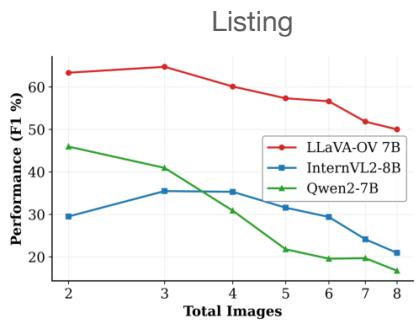

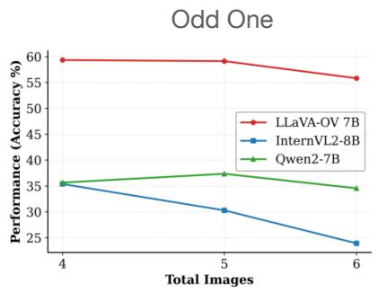

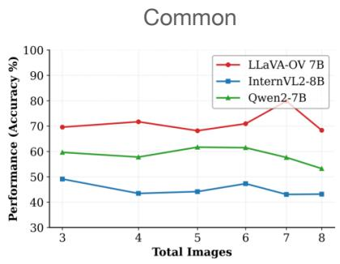  
Figure 6: Performance vs. Number of Images. We report performance as a function of the total number of input images for the Listing, Odd-One tasks, and common tasks.

Counting (balanced) Performance Comparison. We extend the results from table 4 with a finegrained analysis of performance improvements in fig. 8. We observe that fine-tuning substantially improves performance when object instances are distributed across multiple query images. For example, when four instances are spread across four images, accuracy increases from 9% to 45.8%. Similar gains are observed across different instance distributions, indicating improved cross-image information aggregation.

Extended Performance Comparison with LLaVA-OV 1.5B. We extend the comparison to multi-image benchmarks from table 3 by including the LLaVA-OV 1.5B model. We observe that both of our fine-tuned models outperform the baseline. In particular, our fine-tuned model achieves a 3.4% improvement over the baseline, demonstrating enhanced multi-image reasoning capabilities.

Bigger and latest models. Fig. 10 reports results on the Counting task by increasing the number of images that contain the object instance from 1 to 7. We consider larger (LLaVA-OV 72B) or more recent (Qwen2.5-7B, Qwen3-VL-8B) models compared to those analyzed in Fig. 1 (left). Consistent with previous findings outlined in Section 3.2, even more powerful models achieve strong performance when the object of interest appears in a single query image, but performance decreases as the same object is spread across multiple images.

<table><tr><td>Model</td><td>MuirBench |Blink |MMIU|MIRB|MMT (val) |NLVR2|Avg.</td><td></td><td></td><td></td><td></td><td></td><td></td></tr><tr><td>GPT-4V</td><td>62.3</td><td>54.6</td><td>，</td><td>53.1</td><td>64.3</td><td></td><td>，</td></tr><tr><td>InternVL2-Llama3-76B (Chen et al., 2024a) LLaVA-v1.5-7B</td><td>51.2 20.0</td><td>56.8 37.1</td><td>44.2 19.2</td><td>58.2 28.5</td><td>67.4</td><td></td><td></td></tr><tr><td>InternVL2-2B (Chen et al., 2024a)</td><td>24.3</td><td>16.3</td><td>13.6</td><td>25.0</td><td>46.7</td><td>18.9</td><td>24.1</td></tr><tr><td>InternVL2-8B (Chen et al., 2024a)</td><td>37.9</td><td>23.4</td><td>36.8</td><td></td><td></td><td>8.7</td><td>35.6</td></tr><tr><td></td><td></td><td></td><td></td><td>48.6</td><td>57.9</td><td></td><td></td></tr><tr><td>Qwen2VL-2B (Wang et al., 2024b)</td><td>27.2</td><td>12.7</td><td>38.7</td><td>45.9</td><td>51.9</td><td>41.6</td><td>36.3</td></tr><tr><td>Qwen2VL-7B (Wang et al., 2024b)</td><td>43.0</td><td>17.7</td><td>52.6</td><td>60.8</td><td>61.7</td><td>41.5</td><td>46.2</td></tr><tr><td>LLaVA-OV-0.5B (Li et al., 2024a)</td><td>26.8</td><td>40.4</td><td>34.2</td><td>31.8</td><td>41.1</td><td>61.2</td><td>39.3</td></tr><tr><td>Ours</td><td>33.6</td><td>38.9</td><td>37.2</td><td>32.8</td><td>45.6</td><td>68.0</td><td>42.7</td></tr><tr><td>Ours (masked)</td><td>32.5</td><td>39.1</td><td>36.3</td><td>28.5</td><td>45.9</td><td>65.1</td><td>41.2</td></tr><tr><td>LLaVA-OV-1.5B (Li et al., 2024a)</td><td>31.1</td><td>36.4</td><td>33.4</td><td>37.7</td><td>47.5</td><td>70.9</td><td>42.8</td></tr><tr><td>Ours Ours (masked)</td><td>39.7 32.3</td><td>40.0 42.2</td><td>38.9 35.5</td><td>36.0</td><td>48.8</td><td>73.7 69.0</td><td>46.2 43.0</td></tr><tr><td>LLaVA-OV-7B (Li et al., 2024a)</td><td>41.7</td><td>50.4</td><td>45.0</td><td>30.6 47.2</td><td>48.1</td><td></td><td>54.2</td></tr><tr><td></td><td></td><td></td><td></td><td></td><td>56.6</td><td>84.2</td><td></td></tr><tr><td>Ours (masked)</td><td>51.3</td><td>51.9</td><td>45.5</td><td>51.0</td><td>55.3</td><td>87.3</td><td>57.1</td></tr></table>

Table 8: Extended Comparisons including LLaVA-OV 1.5B with the state-of-the-art on multi-image benchmarks: MuirBench, Blink, MMIU, MIRB, MMT and NLVR2.

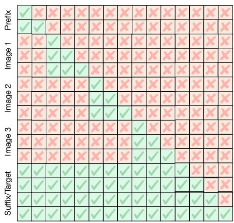  
Figure 7: Our Masked Attention. Vision tokens are restricted to attend only to tokens from the same image, following a block-diagonal attention pattern, while text tokens in both the prefix and suffix follow the standard autoregressive attention.

## A.2 Implementation Details.

Training Data. Our method is trained on a unified training set composed of synthetic samples generated using the MIMIC pipeline (see Section 3.1) together with the original LLaVA-OV multi-image instruction-tuning data (approximately 580K samples). Unlike the MIMIC benchmark used for evaluation, the synthetic MIMIC training dataset is built from OpenImages (Kuznetsova et al., 2020) annotations and provides explicit supervision for cross-image reasoning. Additionally, it supports multi-turn conversations and option-based responses (see fig. 11). Dataset statistics are reported in table 9. In particular, the dataset consists of approximately 50K samples from each MIMIC subtask, with sequences containing up to 10 images. This design encourages learning effective cross-image information aggregation while retaining general vision-language capabilities through joint training with LLaVA-OV data.

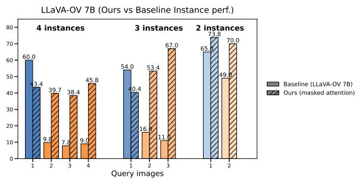  
Figure 8: Comparison on Counting (balanced). Our fine-tuned model performs substantially better when object instances are distributed across multiple images. For example, when four instances are spread across four images, performance improves from 9% to 45.8%, indicating enhanced cross-image information aggregation.

Training Procedure. For both training strategies—the data-centric fine-tuning approach and the optimization-centric attention-masking approach—we start from the LLaVA-OV Single-Image variant (Stage 2.1) (Li et al., 2024a), which has been pre-trained on high-quality single-image instruction-tuning data. We freeze the vision encoder and train only the language model layers and the vision-to-language projector.

For the optimization-centric attention-masking strategy, we do not fully fine-tune the language model layers; instead, we apply LoRA adapters to these layers. In addition, we introduce attention masking in the self-attention blocks, restricting vision tokens to attend only to tokens from the same image. For the data-centric fine-tuning strategy, we fully fine-tune the language model layers without attention masking.

All models are trained with an effective batch size of 128, zero weight decay, and a cosine learning rate schedule with a warmup ratio of 0.03. For the data-centric approach, we use a learning rate of $2 . 5 \times 1 e ^ { - 6 }$ , while for the LoRA-based attentionmasking strategy, we increase the learning rate to $2 . 5 \times 1 e ^ { - 5 }$ . Training is performed on 8 NVIDIA H100 GPUs with approximately 80GB memory each. For the attention-masking strategy, we set the LoRA rank to 128.

## A.3 Additional MIMIC details

<table><tr><td></td><td>Counting</td><td>Common</td><td>Odd One</td><td>Listing</td><td>Overall</td></tr><tr><td>Queries</td><td>50000</td><td>50000</td><td>47561</td><td>49267</td><td>196828</td></tr><tr><td>Images</td><td>157995</td><td>80438</td><td>81642</td><td>108300</td><td>232196</td></tr><tr><td>Obj. inst. per query</td><td>27.3</td><td>16.3</td><td>17.8</td><td>18.6</td><td>20.0</td></tr><tr><td>Min img per query</td><td>2</td><td>2</td><td>3</td><td>2</td><td>2</td></tr><tr><td>Max img per query</td><td>10</td><td>8</td><td>8</td><td>8</td><td>10</td></tr><tr><td>Median img per query</td><td>5</td><td>4</td><td>4</td><td>4</td><td>4</td></tr><tr><td>Avg words per question</td><td>48.9</td><td>44.6</td><td>47.7</td><td>52.1</td><td>48.3</td></tr></table>

Table 9: MIMIC synthetic training dataset statistics based on OpenImagesv7 (Kuznetsova et al., 2020).

Prompt templates Fig. 12 shows the different prompt templates used for the four tasks. For each task, a prompt is constructed by randomly sampling one template from the task-specific template set $( P _ { \mathrm { t a s k } } )$ and one from the connector template set $( P _ { \mathrm { c o n n e c t o r } } )$ . The two templates are then combined to form the final prompt, i.e., $P = P _ { \mathrm { t a s k } }$ ∥Pconnector. Additional examples We report additional sample instances from the Common, Odd-One, Listing, and Counting categories, in Figs. 13, 14, 15 and 16, respectively.

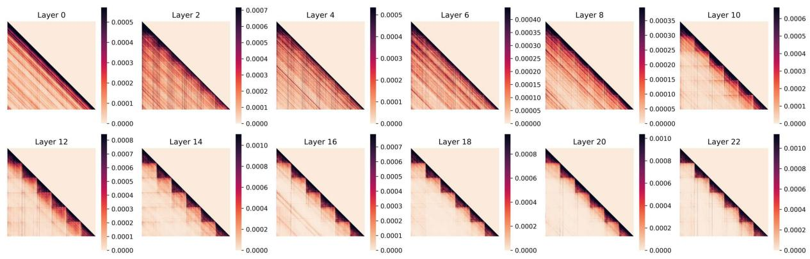  
Figure 9: Inter-image and intra-image token attention across layers for 6 images.

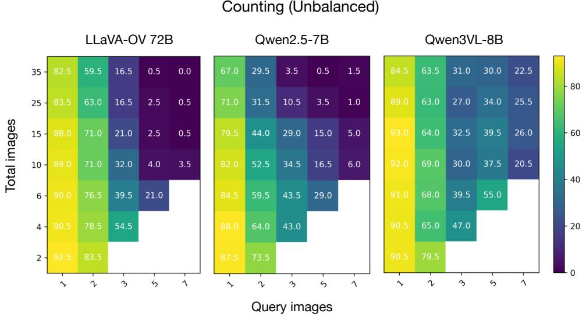  
Figure 10: Counting (unbalanced) performance with bigger and latest models. We analyze the trade-off between the number of query images and the total number of images for bigger (LLaVA-OV 72B) and latest models (Qwen2.5-7B and Qwen3VL-8B).

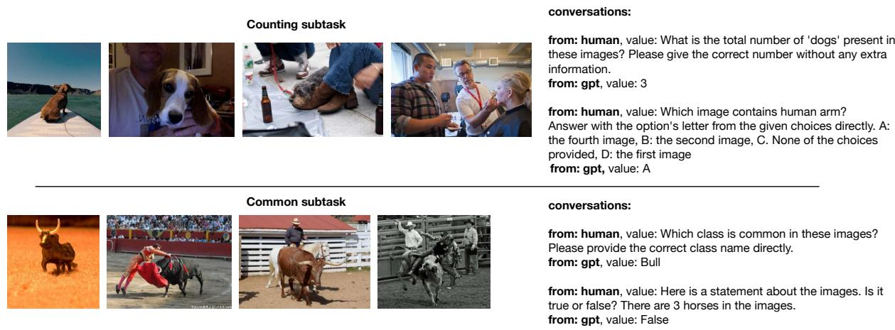  
Figure 11: Samples from the MIMIC training dataset.Unlike the evaluation benchmark, the training data follows the LLaVA data format and includes multi-turn conversations with option-based answers.

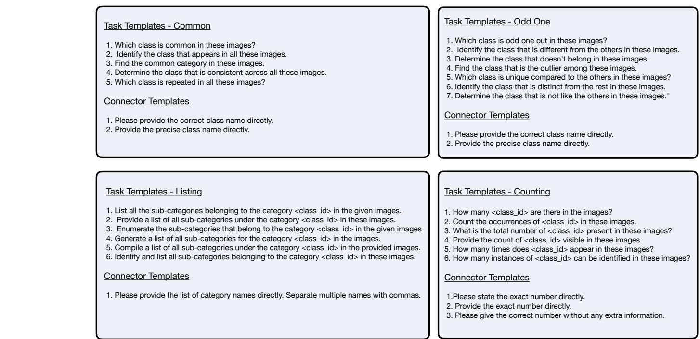  
Figure 12: Prompt Templates for Different Tasks. For each task, a prompt is constructed by randomly sampling one template from the task-specific template set $( P _ { \mathrm { t a s k } } )$ and one from the connector template set $( P _ { \mathrm { c o n n e c t o r } } )$ . The two templates are then combined to form the final prompt, i.e., $P = P _ { \mathrm { t a s k } }$ ∥Pconnector.

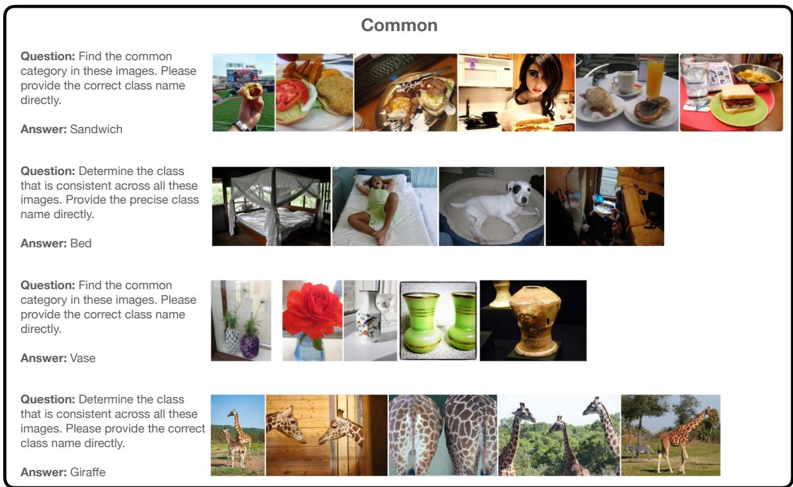  
Figure 13: Our MIMIC Evaluation Benchmark. We show some samples from the category ‘common’ from our benchmark.

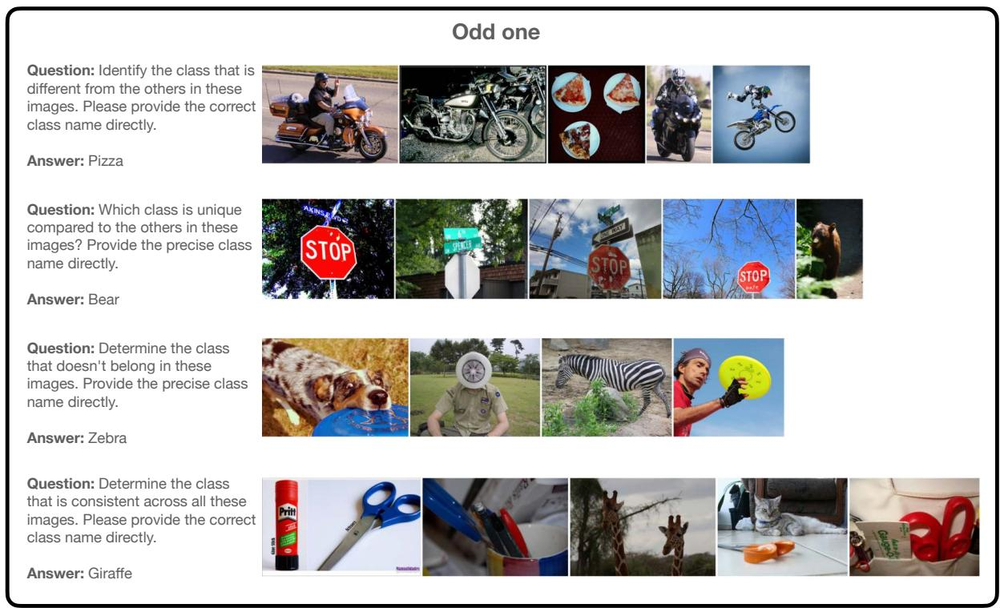  
Figure 14: Our MIMIC Evaluation Benchmark. We show some samples from the category ‘Odd One’ from our benchmark.

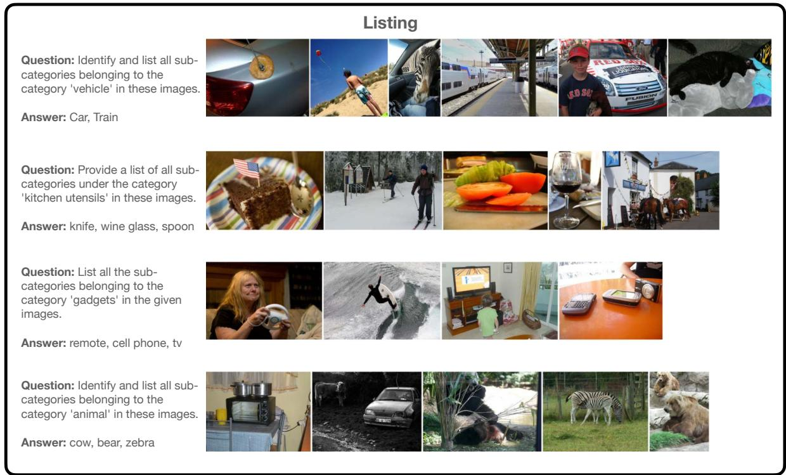  
Figure 15: Our MIMIC Evaluation Benchmark. We show some samples from the category ‘Listing’ from our benchmark.

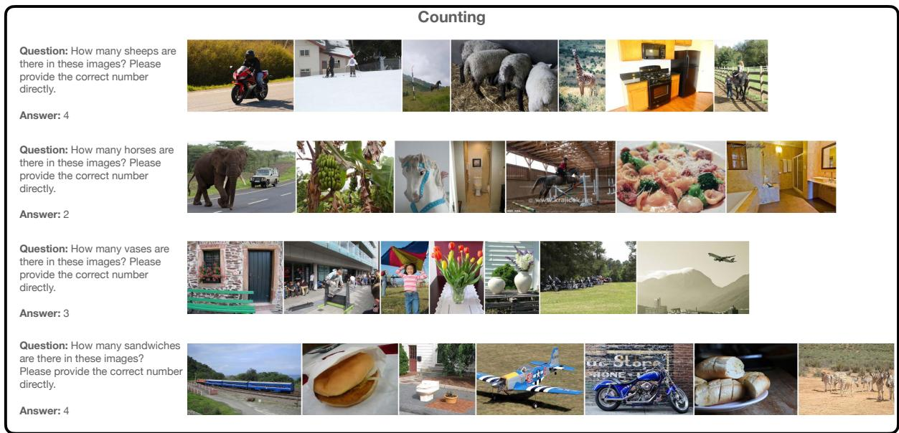  
Figure 16: Our MIMIC Evaluation Benchmark. We show some samples from the category ‘Counting’ from our benchmark.