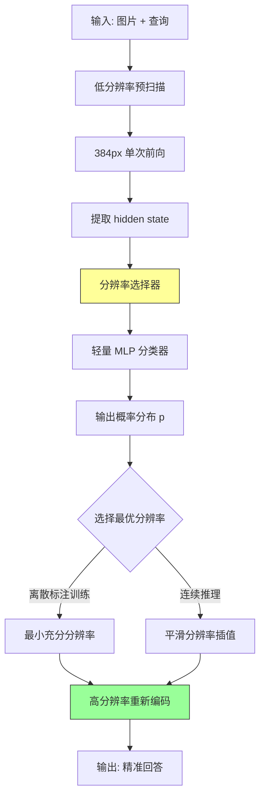

# CARES: Context-Aware Resolution Selector for VLMs

## Paper Metadata

| 项目 | 内容 |
|------|------|
| **Title** | CARES: Context-Aware Resolution Selector for VLMs |
| **Authors** | Moshe Kimhi, Nimrod Shabtay, Raja Giryes, Chaim Baskin, Eli Schwartz |
| **Affiliations** | Technion, IBM Research, Tel-Aviv University, Ben-Gurion University |
| **Venue** | Arxiv 2025 |
| **Project Page** | https://mkimhi.github.io/CARES/ |

## 一句话总结

CARES 是一个轻量级、模型无关的预处理模块：给定图像-问题对，用一个冻结的小 VLM（350M）提取低分辨率联合表征，然后由一个分类器预测当前任务所需的最小充分输入分辨率——从而在 tokenization 之前就决定使用多少像素，无需改动目标 VLM 的架构、权重或训练，在 9 个多模态 benchmark 上保持精度的同时将视觉计算平均降低 70-80%。

更准确地说，CARES 不是做 token pruning/merging（那些在 tokenization 之后操作），而是在 VLM 看到图像之前就做 "分辨率路由"：粗粒度问题走低分辨率，细粒度问题走高分辨率，本质上是一个 query-conditioned adaptive pixel allocation 框架。

## 核心贡献

1. **定义新任务**：提出 query- 和 image-conditioned resolution selection，目标是在不牺牲精度的前提下减少输入规模，将 VLM 效率优化从 token 后处理推到 tokenization 之前的像素分配。

2. **简单有效的监督策略**：基于多分辨率 rollout + 收敛规则自动标注每个样本的"最小充分分辨率"（ANLS >= tau 且高分辨率无显著提升），解决"什么是真正需要的分辨率"这个核心标注难题。

3. **CARES 模块**：轻量（350M）、模型无关、预处理角色、不修改目标 VLM。使用冻结 SmolVLM-500M 的中间层（layer 16）提取 joint image-query representation，接一个轻量分类器。

4. **离散训练 + 连续推理**：训练时做 K-way 分类（{384, 768, 1024}），推理时用 softmax 概率期望插值出连续分辨率，实现细粒度控制且不损失准确率。

5. **全面实验验证**：9 个 benchmark（文档理解到自然图像）、4 个 target VLM（Granite-Vision-2B, InternVL3-8B, Qwen2.5-VL-72B, GPT-4o），平均 prefill FLOPs 降低 65-85%，准确率几乎无损。且与 post-tokenization 的 token compression 方法正交互补。

## 批读导航

| Section | 内容 |
|---------|------|
| [00 - Abstract](sections/00-abstract.md) | 摘要 + 总览 claim + 核心数据 |
| [01 - Introduction](sections/01-introduction.md) | 动机（visual token 膨胀）、方法概览、贡献列表 |
| [02 - Related Work](sections/02-related-work.md) | 相关工作谱系：token sparsification、flexible token budgets、AnyRes/tiling、dynamic computation、adaptive resolution |
| [03 - Methodology](sections/03-methodology.md) | 问题定义、标注策略（Algorithm 1）、架构设计、连续分辨率推理（Algorithm 2） |
| [04 - Results & Analysis](sections/04-experiments.md) | 实验设置、主结果（Table 2）、Cross-Teacher Agreement、消融实验 |
| [05 - Discussion & Conclusion](sections/05-conclusion.md) | 总结、局限性、未来工作 |

## 关键数字

| 指标 | 数值 |
|------|------|
| 训练数据 | 80K samples（TextVQA, ChartQA, DocVQA, LLaVA-Multi 各 20K） |
| CARES 参数量 | ~350M（frozen SmolVLM backbone layer 1-16 + 轻量 classifier） |
| 离散分辨率集合 | Rd = {384, 768, 1024} |
| 连续分辨率范围 | [384, 1024] |
| Benchmark 数量 | 9（Ai2D, ChartQA, DocVQA, OCRBench, SeedBench-2, MMMU, RealWorldQA, InfoVQA, MathVista） |
| Target VLM 数量 | 4（Granite-Vision-2B, InternVL3-8B, Qwen2.5-VL-72B, GPT-4o） |
| 平均 FLOPs 节省 | 63-78%（取决于模型和 benchmark） |
| 标注阈值 tau | 0.85（ANLS） |
| 标注 margin delta | 0.1 |
| 训练 | 6 epochs, LR=1e-3, batch=32, label smoothing=0.05 |
| AR 变体 | Granite-Docling-258M + LoRA rank 8, LR=1e-5, batch=64, 3 epochs |

## 数据流：输入 → 中间表示 → 输出



## 优缺点与还能做什么

### 优点
- **介入层次选得巧**：不做 token pruning/merging，而是在 pixel allocation 阶段做决策。这个和所有 post-tokenization 方法正交互补，可以叠加使用。
- **模型无关性强**：不需要改目标 VLM 的任何东西（架构/权重/训练），对 API 模型也适用（只需控制输入分辨率）。
- **训练便宜**：只需要一个冻结小 VLM（350M）的中间层特征 + 轻量分类器，80K 标注样本，6 epoch 训练。
- **连续推理优雅**：训练是离散 K-way 分类，推理时用概率期望插值出连续分辨率，比直接离散选择更细粒度且不损失性能。
- **标注策略自洽**：用目标 VLM 自己的多分辨率 rollout 来定义"充分分辨率"，避免了人工定义 ground truth 的困难；且 cross-teacher agreement >95%，说明该概念是模型无关的。
- **实验扎实**：覆盖 9 个 benchmark、4 个 VLM（从 2B 到 72B、从开源到 API）、多种消融、TTFT 实际测量。

### 局限 / 风险
- CARES 依赖一个 frozen proxy VLM 提取低分辨率特征；在需要极其细粒度视觉线索的领域（密集 OCR、医学影像）可能低估所需分辨率，导致 under-allocation。
- 监督信号来自目标 VLM 的多分辨率 rollout，因此继承了该模型的 bias 和有限语言支持；不同语言的 query 可能影响分辨率预测质量。
- 仅评估单图、单轮交互场景；多图、视频、流式场景以及 joint resolution-tiling 选择未涉及。
- 没研究安全问题、对抗 prompt 鲁棒性、或不同硬件上的详细 cost-latency trade-off。
- 对模型推理时的扰动（如 sign-bit flip）或标注噪声的鲁棒性未探索。

### 还能做什么
- 与 post-tokenization 的 token compression（如 HiRED、SparseVLM、PyramidDrop）叠加，探索像素 + token 联合优化能达到的极致效率。
- 扩展到多图、视频场景：对每帧做 adaptive resolution，同时考虑跨帧信息冗余。
- 联合优化 resolution + tiling 策略：CARES 现在只是 resize，但 AnyRes/tiling 的选择也可以纳入。
- 做预算自适应的在线版本：根据系统负载动态调整 tau，在高负载时更激进地降低分辨率。
- 在特定高风险领域（医学、遥感）做 calibration 和安全验证，确认 under-allocation 不会导致关键信息丢失。

## 阅读 Q&A 记录

- **Q: CARES 和 token pruning/merging 类方法（HiRED、SparseVLM 等）的核心区别是什么？**
  A: 层次不同。token pruning 在 VLM 内部、tokenization 之后操作 visual tokens；CARES 在 VLM 外部、tokenization 之前决定输入分辨率。两者正交互补，可以叠加。

- **Q: 为什么不直接在 VLM 里做 adaptive resolution？**
  A: 因为要保持模型无关性。CARES 不需要改目标 VLM 的任何东西，对开源模型和 API 模型（如 GPT-4o）都适用。如果改 VLM 内部，就失去了这个优势。

- **Q: 为什么用 SmolVLM 的中间层特征而不是最后层？**
  A: 中间层特征（layer 16）比最后层特征（layer 32）更富含感知和语义信息，实验中中间层比最后层高约 1% 的分类准确率，且计算量减半。

- **Q: 训练是离散分类，推理是连续值，这个 gap 怎么解决？**
  A: 两个手段：(1) label smoothing 软化类别边界，避免过拟合到离散标签；(2) 推理时用 softmax 概率的期望值（而不是 argmax）得到连续分辨率。

- **Q: CARES 的 AR（autoregressive）变体和主变体有什么区别？**
  A: 主变体是 discriminative（分类器头），AR 变体基于 Granite-Docling-258M + LoRA fine-tune，用 next-token prediction 预测分辨率 token。推理时两者都用连续插值。AR 变体在文档 benchmark 上更激进地降低分辨率，但精度也略低于主变体。

- **Q: 为什么用 ANLS 而不是 exact match 作为标注指标？**
  A: ANLS（Average Normalized Levenshtein Similarity）对 OCR/文档任务是更敏感的指标，能区分"基本正确但有小拼写差异"和"完全不对"。但在 natural image 数据上，论文实际也用 exact match（如 Ai2D、ChartQA）。

- **Q: "视觉 token 占 99%"这个数字怎么来的？**
  A: 论文在 Appendix A.1 有详细计算：假设 100 个文本 token，在 4096x4096 输入下 Qwen2.5-VL 的 visual tokens 可达 21609（占比 99.5%），AnyRes 模型饱和在约 96.6%（因 tile 数量有上限）。

## Citation Landscape

### 参考文献分组 (by topic)

**VLM Backbones & Architectures**:
- Granite-Vision 3.3-2B (Team et al., 2025)
- InternVL3-8B (Zhu et al., 2025)
- Qwen2.5-VL-72B (Bai et al., 2025)
- GPT-4o (Achiam et al., 2023)
- SmolVLM-500M (Marafioti et al., 2025)

**Visual Token Sparsification at Inference**:
- HiRED: Attention-guided token dropping (Arif et al., 2025)
- SparseVLM: Text-guided visual token sparsification (Zhang et al., 2025c)
- PyramidDrop: Progressive token reduction at stage boundaries (Xing et al., 2025)
- Visual Tokens Withdrawal (VTW): Withdraw vision tokens beyond a learned layer (Lin et al., 2025)

**Training for Flexible Token Budgets**:
- Token-FLEX: Stochastic token modulation + adaptive pooling (Hu et al., 2025)
- Matryoshka Multimodal Models (MMM): Nested representations under progressive budgets (Cai et al., 2025)
- LLaVA-Mini: Extreme compression to nearly one vision token (Zhang et al., 2025b)

**Any-Resolution Inputs & Tiling**:
- FlexiViT: One model for all patch sizes (Beyer et al., 2023)
- NaViT: Patch n' Pack for any aspect ratio and resolution (Dehghani et al., 2023)
- LLaVA-NeXT: AnyRes tiling (Liu et al., 2024a)
- Qwen2-VL: Native dynamic resolution (Wang et al., 2024)

**Dynamic Computation in Vision**:
- DynamicViT: Hierarchical token pruning (Rao et al., 2021)
- EViT: Token reorganization and discarding (Liang et al., 2022)
- ToMe: Token merging (Bolya et al., 2023)
- SGL: Small VLM routes easy cases, large VLM handles hard ones (Zhao et al., 2024)

**Adaptive Resolution & Extreme Compression**:
- Dynamic Resolution Network: Per-image resolution predictor for classification (Zhu et al., 2021)
- WAVE-CLIP: Wavelet tokenization for adaptive-resolution (Kimhi et al., 2025b)
- "Inference optimal VLMs need only one visual token but larger models" (Li et al., 2024)

**Benchmarks**:
- TextVQA, ChartQA, DocVQA, OCRBench, SeedBench-2, MMMU, RealWorldQA, InfoVQA, MathVista, Ai2D, LLaVA-Multi

**Evaluation & Tooling**:
- lmms-eval (Zhang et al., 2024)

## BibTeX

```bibtex
@article{kimhi2025cares,
  title={CARES: Context-Aware Resolution Selector for VLMs},
  author={Moshe Kimhi and Nimrod Shabtay and Raja Giryes and Chaim Baskin and Eli Schwartz},
  journal={arXiv preprint},
  year={2025}
}
```

---

*Batch reading created on 2026-06-24*
