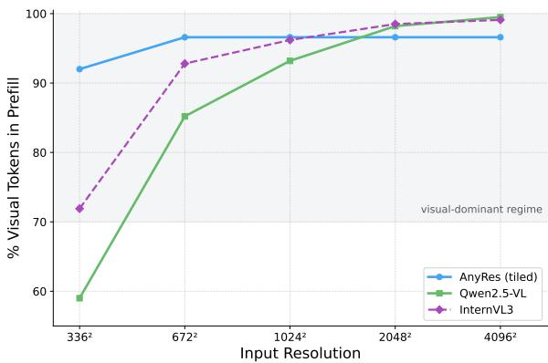
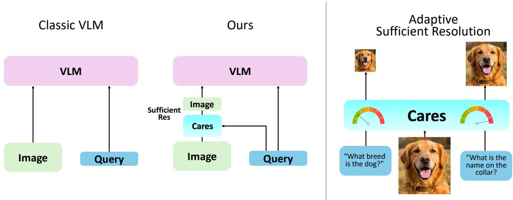
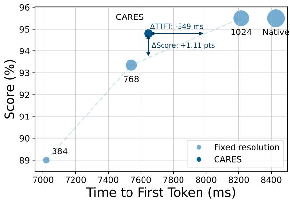
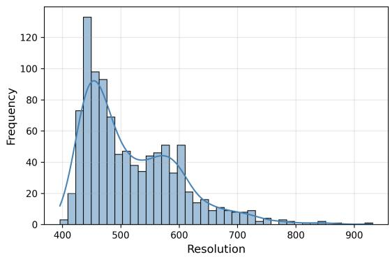
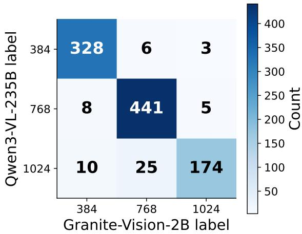
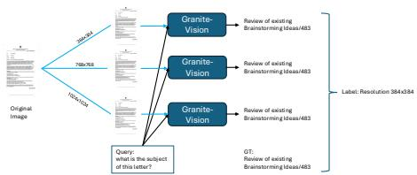
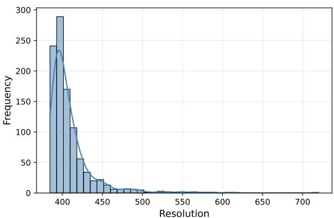
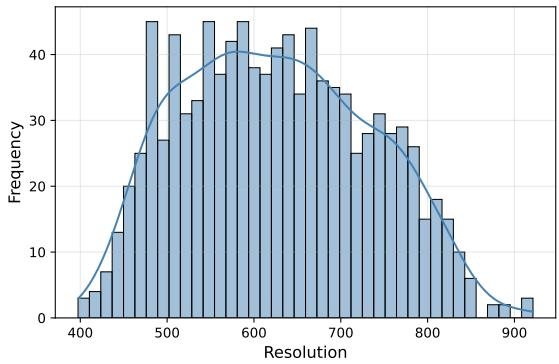
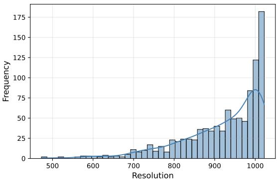
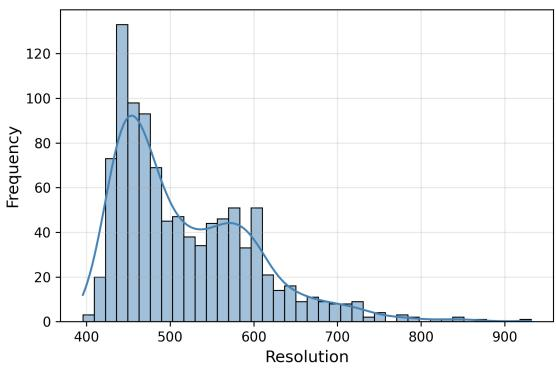

# CARES: Context-Aware Resolution Selector for VLMs

Moshe Kimhi1,2\* Nimrod Shabtay2,3\* Raja Giryes3 Chaim Baskin4† Eli Schwartz2†

1Technion 2IBM Research

3Tel-Aviv University 4Ben-Gurion University

Project Page: https://mkimhi.github.io/CARES/

## Abstract

Large vision–language models (VLMs) commonly process images at native or high resolution to remain effective across tasks. This inflates visual tokens up to to 99% of total tokens of the prefill stage, resulting in high compute and latency, even when lowresolution images would suffice. We introduce CARES—a Context-Aware Resolution Selector, a lightweight preprocessing module that, given an image–query pair, predicts the minimal sufficient input resolution. CARES uses a compact VLM (350M) to extract features and predict when a target pretrained VLM’s response converges to its peak ability to answer correctly. Though trained as a discrete classifier over a set of optional resolutions, CARES interpolates continuous resolutions at inference for fine-grained control. Across nine multimodal benchmarks spanning documents and natural images, as well as diverse target VLMs, CARES preserves task performance while reducing compute by up to 78% on average across 9 benchmarks.

## 1 Introduction

Large vision–language models (VLMs) are increasingly used as general-purpose systems that solve a broad variety of visual tasks using a single model. Since the complexity and nature of each task are not known in advance, these models typically process images at very high resolutions to preserve the visual detail necessary for any potential query. This leads to a sharp increase in the number of visual tokens, as modern architectures map higher resolutions to proportionally more tokens. Strategies like AnyRes and tiling further increase token counts in order to capture fine-grained information (Liu et al., 2024a; Wang et al., 2024). In practical settings, visual tokens make up to 99% of all tokens processed per request, which significantly impacts latency and memory consumption (Fig 1), even when the actual query may only require a coarse understanding of the scene.

  
Figure 1: Visual token dominance across resolutions. Fraction of visual tokens relative to a fixed 100-token text prompt. As resolution increases, visual tokens quickly dominate the context window, particularly in dynamic-resolution models where scaling is quadratic. AnyRes refer to tiling of multiple views. More details in Appx A.1.

A key observation is that not all queries require the same visual granularity. Coarse queries (e.g., “What is the breed of the dog?”) are typically answerable from a small image; fine-grained queries (e.g., “What is the name on the collar?”) benefit from higher resolution. Existing efficiency methods typically operate after tokenization, on the output of the vision encoder -pruning, pooling, merging, or compressing with Q-former style architecture (Arif et al., 2025; Zhang et al., 2025c; Xing et al., 2025; Lin et al., 2025; Rao et al., 2021; Liang et al., 2022; Bolya et al., 2023; Hu et al., 2025; Cai et al., 2025). While complementary, these methods typically operate on the output of the visual encoder alone and are unaware of the text input or the current query. Yet a more fundamental lever remains untouched: Can we choose the input granularity as a pre-processing step?

  
Figure 2: Overview of CARES. On the left, we compare the traditional pipeline of a use of VLM vs the pipeline using CARES. Given an image and its query, CARES predicts the minimal sufficient input resolution. The image is resized accordingly and, together with the query, passed to a downstream VLM. Coarse queries are routed to lower resolution; fine-grained queries that require more detail trigger higher resolution, which yields more visual tokens in the VLM.

We propose a Context-Aware Resolution Selector (CARES), a lightweight model that, for a given image-query pair, selects the minimal sufficient resolution to answer the query (Fig. 2). CARES is model-agnostic, placed in front of an arbitrary VLM. While our main instantiation uses a compact frozen VLM with a lightweight discriminative classifier, the CARES formulation is not tied to a specific predictor architecture. We also study a closely related autoregressive instantiation based on Granite-Docling, fine-tuned with LoRA, and report it separately on document-centric benchmarks.

It operates in three steps:

• A cheap low-resolution pass (e.g., ≤ 3842) extracts a joint image–query representation using a small proxy VLM.

• Given this representation, a lightweight classifier predicts the minimal resolution required for the task.

• The image is resized to the predicted resolution and passed to the target VLM. No changes to the VLM’s architecture, weights, or training are required.

A central challenge is supervision: what resolution is truly sufficient for each example? We introduce a simple labeling procedure based on a discrete set of resolutions R and a task performance metric. For each image, query, and GT response, we evaluate a pretrained VLM with increasingly higher resolution up to convergence in terms of the task metric (or reaching the native resolution). The lowest resolution at which the convergence occurs is selected as the ground-truth optimal resolution for training CARES. Using a discrete resolution set avoids the cost of exhaustively searching over continuous values. Since the labels are discrete, the model is trained as a classifier. At inference time, however, we interpolate between the predicted class probabilities to recover a continuous resolution estimate.

Across 9 multimodal benchmarks, varying from natural images to document understanding (Section 4) and different open and api-based model, CARES reduces average visual tokens and GFLOPS by 70-80%, with minimal to no accuracy drop compared to always using the highest (native) resolution.

## Our contributions are as follows:

1. We define the task of query- and imageconditioned resolution selection for visionlanguage models, aimed at reducing input size without sacrificing accuracy.

2. We propose a simple yet effective supervision strategy based on multi-resolution rollouts and a convergence rule, yielding per-example sufficient resolution ground-truth, enabling training and evaluation.

3. We introduce CARES, a lightweight, modelagnostic module that selects resolution as a pre-processing step, requiring no changes to the target VLM.

4. We demonstrate that many visual tokens are unnecessary: CARES preserves performance across tasks while reducing visual compute by up to 78% on average across 9 benchmarks, and is orthogonal with post-tokenization token compression.

## 2 Related Work

Visual-token sparsification at inference A growing line of work trims visual tokens after tokenization inside the VLM stack. HiRED uses [CLS] attention to allocate a per-partition token budget and drop the least-informative vision tokens under a fixed budget, yielding large speedups on high-resolution inputs without retraining (Arif et al., 2025). SparseVLM proposes a training-free, text-guided strategy: self-attention matrices rank visual tokens with an adaptive layer-wise sparsification ratio and a token-recycling mechanism to preserve information (Zhang et al., 2025c). PyramidDrop stages the model and progressively reduces tokens at stage boundaries, motivated by the observation that redundancy increases with depth; it accelerates both training and inference and can also be used in a plug-and-play inference mode (Xing et al., 2025). Complementary to these, Visual Tokens Withdrawal (VTW) argues that visual information migrates to text tokens in early layers and thus withdraws vision tokens beyond a learned layer, cutting compute while maintaining quality (Lin et al., 2025). In contrast, CARES decides before tokenization which input resolution to use and leaves all VLM’s components frozen.

Training for flexible token budgets Token-FLEX trains VLMs to operate across a range of visual–token counts by stochastically modulating tokens during training and adding a lightweight projector with adaptive pooling (Hu et al., 2025). Matryoshka Multimodal Models (MMM) further pursue elastic compute, training nested representations that remain useful under progressively smaller token/feature budgets (Cai et al., 2025). LLaVA-Mini pushes efficiency to the extreme by compressing visual information into (nearly) a single vision token while retaining competitive performance for both images and videos (Zhang et al., 2025b). CARES targets the complementary axis of adaptive pixel allocation before tokenization: it selects the minimal input resolution needed for a target utility and can front-end TokenFLEX/Matryoshka/LLaVA-Mini–style models to reduce pixels (and thus to-

kens) further.

Any-resolution inputs and tiling Many modern ViTs (Dehghani et al., 2023; Beyer et al., 2023) and VLMs boost fine-grained perception with AnyRes/dynamic-high-resolution tiling (e.g., LLaVA-NeXT) or native dynamic resolution that maps larger images to more tokens (e.g., Qwen2-VL) (Liu et al., 2024a; Wang et al., 2024). While effective, these strategies often increase visual tokens substantially. CARES explicitly avoids unnecessary tiling by routing easy cases to low resolutions and only escalating when the query and low-res cues predict a benefit.

Dynamic computation Vision-only methods reduce computation via token pruning/merging inside ViTs-e.g., DynamicViT prunes tokens hierarchically with learned importance (Rao et al., 2021), EViT reorganizes/discards inattentive tokens (Liang et al., 2022), and ToMe merges similar tokens on the fly (Bolya et al., 2023).WAVE-CLIP replaces patch tokenization with a multi-level wavelet tokenizer and performs coarse-to-fine inference in a single ViT (Kimhi et al., 2025b). For VLMs, SGL routes easy cases via a small ‘stitch model and defers hard ones to a larger counterpart, akin to early-exit routing (Zhao et al., 2024). These operate within the encoder after tokenization; CARES is complementary, deciding how many pixels to tokenize in the first place.

Adaptive input resolution selection Outside VLMs, dynamic-resolution networks learn a perimage resolution predictor that trades accuracy for cost in classification (Zhu et al., 2021). CARES brings this idea to multimodal QA, conditions the policy on the query text, and supervises it with per-example multi-resolution rollouts of the target VLM using a sufficiency rule, which yields unambiguous labels at deployment resolutions.

Extreme compression and design insights Recent analyses argue that, under fixed inference budgets, compute-optimal VLMs may prefer very few visual tokens and a larger LLM (Li et al., 2024). Such results support approaches that minimize visual tokens when possible; methods like LLaVA-Mini instantiate the “one-token vision” regime in practice (Zhang et al., 2025b). CARES provides a query-conditioned mechanism to reduce pixels upstream, complementing these token-minimal designs.

## 3 CARES

This section outlines the problem addressed by CARES (3.1), followed by a description of the dataset generation procedure (3.2). We then detail the architecture and the training details of CARES (3.3), Finally we outline our continuous resolution approach (3.4).

## 3.1 Problem Definition

Given an image x and query q, let $\begin{array} { r l } { { \mathcal { R } } } & { { } = } \end{array}$ $[ r _ { \operatorname* { m i n } } , r _ { \operatorname* { m a x } } ] \subset \mathbb { R } ^ { + }$ denote the range of valid input resolutions and let F be a fixed VLM. For any resolution $r \in \mathcal { R } .$ , we denote by $x ^ { ( r ) }$ the image x resized such that its largest dimension equals $^ { r } \cdot$ Feeding $x ^ { ( r ) }$ and $q$ into F yields an output $y = F ( x ^ { ( r ) } , q )$ . The VLM forms $T ( r )$ visual tokens at resolution $r$ (including AnyRes/tiling effects). Our goal is to learn a selector $f _ { \theta }$ that predicts, from a single inexpensive low-resolution pass at $r _ { m i n }$ , the minimal sufficient resolution $r _ { s } \in \mathcal { R }$ for accurately answering the query q given image $x .$

## 3.2 Labeling Strategy for Training CARES

Since searching for the optimal $r ^ { \star } \in \mathcal R$ is prohibitively expensive, we chose to use a small, discrete set of valid resolutions for the annotation $\mathcal { R } _ { d } = \{ r _ { 1 } , . . . , r _ { K } \} \subset \mathcal { R }$ . For each sample, we render the image at the fixed resolutions, $\mathcal { R } _ { d }$ , and use a pretrained VLM to generate predictions at each resolution. The predictions are evaluated against the ground-truth annotations using the ANLS metric. The supervision label is assigned as the lowest resolution whose ANLS score exceeds a threshold, without significant improvement at higher resolutions. The procedure yields a discrete sufficiency label $r ^ { \star } \in \mathcal { R } _ { d }$ per example. We emphasize that discretization is only used for supervision efficiency; at inference, we deploy a continuous finer-grained selector (§3.4). Algorithm 1 outlines the data generation process, and Table. 1 visualizes the concept.

Formally, we compute the ANLS score for each resolution:

$$
u _ { k } = { \mathrm { A N L S } } \Big ( F ( x ^ { ( r _ { k } ) } , q ) , \mathbf { g } \mathbf { t } \Big ) \in [ 0 , 1 ]\tag{1}
$$

and select the minimal sufficient resolution as:

$$
r ^ { \star } = \operatorname* { m i n } \left\{ r _ { k } \ \middle | \ u _ { k } \geq \tau , \ \underset { \ell > k } { \operatorname* { m a x } } ( u _ { \ell } - u _ { k } ) \leq \delta \right\}\tag{2}
$$

where we default to $r _ { K }$ if no resolution satisfies the condition. We set $\tau { = } 0 . 8 5$ and use a small margin $\delta \left( \mathrm { e . g . , 0 . 1 } \right)$ to prevent rewarding negligible performance improvements. We define the full resolution range as $\mathcal { R } = [ 3 8 4 , 1 0 2 4 ]$ , and use a discrete set $\mathcal { R } _ { d } = \{ 3 8 4 , 7 6 8 , 1 0 2 4 \}$ for annotation.

Algorithm 1: Labeling via multi-resolution   
sufficiency rollouts.   
Input: $( x , q ) ;$ resolutions R; VLM $F ;$   
utility U ; threshold $\tau ;$ margin δ   
Output: Label $r ^ { \star } \in \mathcal { R }$   
for $k \gets 1$ to K do   
$y _ { k } \gets F ( x ^ { ( r _ { k } ) } , q ) ; u _ { k } \gets U ( y _ { k } , \mathbf { g } t )$   
for $k \gets 1$ to K do   
if $u _ { k } \geq \tau$ and max ${ \bf \nabla } \cdot \ell > k \big ( { u } \ell - { u } _ { k } \big ) \le \delta$   
then   
return $r ^ { \star }  r _ { k }$   
return $r ^ { \star }  r _ { K }$

## 3.3 Model Instantiations

Unless otherwise stated, all main experiments in this paper use the following discriminative instantiation of CARES.

We design CARES as a lightweight resolution selector that can be deployed in front of any vision–language model (VLM) to improve efficiency. Its behavior is governed by three core principles:

1. Compactness: minimal overhead in computation and memory.

2. Preprocessing role: determines resolution directly from raw inputs before invoking the VLM.

3. VLM-agnosticism: works with any VLM, whether run locally or accessed via API, with no architecture changes or retraining required.

To implement these principles, we use a compact frozen VLM backbone as a joint vision–text feature extractor, followed by a lightweight classifier head.

Specifically, we adopt the pretrained SmolVLM-500M model (Marafioti et al., 2025), with layers 17–32 removed, as the backbone. Given an image at resolution $r _ { \mathrm { m i n } }$ and a text query, we feed both into the model and extract the hidden state of the final token at layer 16. This representation encodes the joint image–query context and is passed to a classifier that outputs a soft distribution over target resolutions. This design is motivated by recent findings showing that intermediate layer activations in LLMs and VLMs encode rich perceptual and semantic information that may not be surfaced at the output layer (Orgad et al., 2024; Zhang et al., 2025a). In addition to being more informative, as also evidenced by the performance gap in Table 3 where using intermediate features outperforms lastlayer features by about 1%, this choice substantially reduces computation since only roughly half of the LLM is used for feature extraction.

<table><tr><td rowspan="2"></td><td colspan="2">Cafidatial RORT PR APVL</td><td rowspan="8">cc T.F. Riehl FROM C. ↓. Coak</td><td rowspan="8"></td></tr><tr><td colspan="2">caTe. 1/g/ u s   POR RRLAN VO1 CTT: P. CAtTER ROVTE DOI ZAas is Pogvr Carter Xauza Payas Tom GRisc David piahel Dinne Barrue l 3lekm Tow Racker olds Building 1142 2977</td></tr><tr><td colspan="2">what is the contact person name mentioned in letter?</td><td>499150498</td></tr><tr><td colspan="2">Query</td><td colspan="2">One variable that has implicitly not Who is in cc in this letter? been controlled? influence of the test chamber (glass</td></tr><tr><td colspan="2">GT P. Carter</td><td colspan="2">T.F. Riehl mouth) geometry. T.F. Rosel</td></tr><tr><td colspan="2" rowspan="2">Resp@384 P. Carter ANLS 1.0</td><td colspan="2">concentration of the final product 0.0 the influence of the test chamber</td></tr><tr><td colspan="2">(i.e. ash seath) geometry on the flow</td></tr><tr><td colspan="4">1.0</td></tr><tr><td colspan="4">ANLS</td><td colspan="2">0.65 the influence of the test chamber</td></tr><tr><td colspan="2">Resp@1024 ANLS Sufficient</td><td colspan="2"></td><td colspan="2">(glass mouth) geometry. 0.93</td></tr><tr><td colspan="4">384 768</td><td colspan="2">1024</td></tr></table>

Table 1: Data generation pipeline for training CARES. We process each input through a pretrained VLM (Granite-Vision) at three fixed resolutions and select the smallest resolution that produces a sufficient answer quality according to the ANLS metric.

The resulting CARES module has approximately 350M parameters and is trained with supervision over discrete resolution labels (see §3.2).

Autoregressive document-specialized instantiation. In addition to the discriminative selector above, we also instantiate CARES using an autoregressive vision-language model. Concretely, we start from Granite-Docling-258M (Auer et al., 2024) and fine-tune it with LoRA (rank 8) on the same resolution-selection training set. Given the low-resolution image and the query, the model is prompted to predict one resolution label from the discrete set $\mathcal { R } _ { d } = \{ 3 8 4 , 7 6 8 , 1 0 2 4 \}$ . To avoid tokenization ambiguity, we map these labels to dedicated tokens $< 1 > , < 2 >$ and <3>.

At inference time, we read the first-step logits over the resolution tokens, apply a softmax to obtain class probabilities, and use the same expectation-based interpolation described in Eq. 3 to produce a continuous resolution. This preserves the deployment rule of CARES while replacing the discriminative head with an autoregressive predictor.

## 3.4 From Discrete Supervision to a Continuous Resolution

Although CARES is trained as a K-way classifier over a discrete set of resolutions $\mathcal { R } _ { d } ~ = ~ \{ r _ { 1 } ~ <$ $\cdots < r _ { K } \big \}$ , we deploy it as a continuous selector over $\mathcal { R } = [ r _ { m i n } , r _ { m a x } ]$ . Given features z from the low-resolution image and query, compute logits $\ell ( z ) \in \mathbb { R } ^ { K }$ and class probabilities

$$
p = \operatorname { s o f t m a x } ( \ell ) ,
$$

We use the probability-weighted expectation

over $\mathcal { R } _ { d } \colon$

$$
\tilde { r } = \sum _ { k = 1 } ^ { | \mathcal { R } _ { d } | } p _ { k } r _ { k } ,\tag{3}
$$

This yields a continuous resolution that varies smoothly with confidence and is insensitive to the specific discretization used for labeling. In practice, $\tilde { r }$ preserves the routing behavior of the classifier while allowing finer control.

Algorithm 2: Continuous resolution se  
lection.   
Input: $( x , q ) { \mathrm { ; } }$ ; low-res $r _ { 1 } ;$ logits $\ell .$   
Output: Continuous resolution   
$\tilde { r } \in [ r _ { 1 } , r _ { K } ] .$   
z ← features from proxy VLM at $r _ { 1 }$   
p ← softmax $( \ell ( z ) )$   
$\begin{array} { r } { \tilde { r } \gets \sum _ { k = 1 } ^ { K } p _ { k } r _ { k } } \end{array}$   
return $\underline { { \tilde { r } } }$

Continuous inference algorithm.

Deployment. The target VLM receives x with the largest dimension resized to $\tilde { r }$ (or to the nearest supported side length to avoid under-allocation). For backbones that only accept a discrete set of input sizes, we round up to the next supported size.

## 4 Results & Analysis

This section presents the experimental evaluation of CARES. We begin by describing the benchmarks and evaluation metrics (4.1), followed by the main results (4.2), and finally a comprehensive ablation study (4.4).

## 4.1 Experimental Setup

Training Data To train the resolution selector, we construct a dataset of images and queries $( x , q )$ we automatically annotated with the minimal sufficient resolution $r ^ { \star }$ . We construct an 80K-sample training set by randomly sampling 20K instances from each of four datasets: TextVQA (Singh et al., 2019), ChartQA (Masry et al., 2022), DocVQA (Mathew et al., 2021), and LLaVA-Multi (Jiang et al., 2024), covering documents and natural images domains.

Training details We train CARES on the curated data described in 3.2 for 6 epochs using a learning rate of $1 e - 3$ and a batch size of 32. We optimize the standard cross-entropy loss over the fixed resolution labels:

$$
{ \mathcal { L } } ( \theta ) = \mathrm { C E } { \Big ( } f _ { \theta } ( z ) , r ^ { \star } { \Big ) } .
$$

Where $f _ { \boldsymbol { \theta } } ( z )$ is CARES composed of a frozen VLM and the lightweight classifier. In addition, we apply label smoothing of 0.05 to support continuous resolutions at inference time.

VLM variant training details. For the autoregressive (AR) Granite-Docling instantiation, we use the same training set and the same discrete supervision labels. The model is fine-tuned with LoRA of rank 8, while the base model remains frozen. Training is performed with next-token supervision over the resolution tokens, and for efficiency, generation length is set to 1. Learning rate is set to 1e − 5 and a batch size of 64 for 3 epochs.

  
Figure 3: Accuracy vs. TTFT for DocVQA with Qwen2.5-VL-72B across native and fixed-resolution settings versus CARES. Bubble size indicates the number of pixels processed by the model.

  
Figure 4: Histogram of the predicted resolutions r˜ by CARES for OCRBench.

Evaluation We evaluate on nine public benchmarks varying from documents to natural images: Ai2D (Kembhavi et al., 2016), ChartQA (Masry et al., 2022), DocVQA (Mathew et al., 2021), OCR-Bench (Liu et al., 2024b), and SeedBench-2 (Li et al., 2023), MMMU (Yue et al., 2024), Real-WorldQA (xAI, 2024), InfoVQA (Mathew et al.,

<table><tr><td></td><td colspan="2">Ai2D</td><td colspan="2">ChartQA</td><td colspan="2">DocVQA</td><td colspan="2">OCRBench</td><td colspan="2">SeedBench-2</td><td colspan="2">MMMU</td><td colspan="2">RealWorldQA</td><td colspan="2">InfoVQA</td><td colspan="2">MathVista</td><td colspan="2">Average</td></tr><tr><td>Model</td><td>Score</td><td>Cost</td><td>Score</td><td>Cost</td><td>Score</td><td>Cost</td><td>Score</td><td>Cost</td><td>Score</td><td>Cost</td><td>Score</td><td>Cost</td><td>Score</td><td>Cost</td><td>Score</td><td>Cost</td><td>Score</td><td>Cost</td><td>|Score</td><td>Cost</td></tr><tr><td>Granite-Vision -2B</td><td>0.74</td><td></td><td>0.86</td><td></td><td>0.90</td><td></td><td>0.80</td><td></td><td>0.72</td><td></td><td>0.29</td><td></td><td>0.17</td><td></td><td>0.35</td><td></td><td>0.48</td><td></td><td>0.59</td><td></td></tr><tr><td>+ CARES</td><td>0.73</td><td>-67%</td><td>0.87</td><td>-69%</td><td>0.90</td><td>-68%</td><td>0.80</td><td>-68%</td><td>0.72</td><td>-44%</td><td>0.29</td><td>-85%</td><td>0.19</td><td>-72%</td><td>0.40</td><td>-72%</td><td>0.48</td><td>-22%</td><td>0.60</td><td>-63%</td></tr><tr><td>+ CARES-AR</td><td>0.71</td><td>-81%</td><td>0.84</td><td>-81%</td><td>0.88</td><td>-82%</td><td>0.77</td><td>-75%</td><td>0.72</td><td>-10%</td><td>0.30</td><td>-84%</td><td>0.15</td><td>-82%</td><td>0.39</td><td>-81%</td><td>0.44</td><td>-25%</td><td>0.58</td><td>-67%</td></tr><tr><td>InternVL3-8B</td><td>0.84</td><td></td><td>0.86</td><td></td><td>0.92</td><td></td><td>0.85</td><td></td><td>0.79</td><td></td><td>0.56</td><td></td><td>0.68</td><td></td><td>0.72</td><td></td><td>0.69</td><td></td><td>0.77</td><td></td></tr><tr><td>+ CARES</td><td>0.84</td><td>-66%</td><td>0.86</td><td>-68%</td><td>0.92</td><td>-69%</td><td>0.85</td><td>-70%</td><td>0.79</td><td>-44%</td><td>0.56</td><td>-86%</td><td>0.68</td><td>-82%</td><td>0.74</td><td>-72%</td><td>0.69</td><td>-22%</td><td>0.77</td><td>-64%</td></tr><tr><td>+ CARES-AR</td><td>0.84</td><td>-86%</td><td>0.86</td><td>-81%</td><td>0.92</td><td>-80%</td><td>0.85</td><td>-78%</td><td>0.72</td><td>-84%</td><td>0.55</td><td>-85%</td><td>0.68</td><td>-82%</td><td>0.74</td><td>-81%</td><td>0.68</td><td>-31%</td><td>0.76</td><td>-76%</td></tr><tr><td>Qwen2.5-VL-72B</td><td>0.87</td><td></td><td>0.87</td><td></td><td>0.96</td><td></td><td>0.75</td><td></td><td>0.81</td><td></td><td>0.62</td><td></td><td>0.77</td><td></td><td>0.73</td><td></td><td>0.74</td><td></td><td>0.79</td><td></td></tr><tr><td>+ CARES</td><td>0.87</td><td>-85%</td><td>0.84</td><td>-77%</td><td>0.95</td><td>-84%</td><td>0.76</td><td>-64%</td><td>0.79</td><td>-77%</td><td>0.62</td><td>-86%</td><td>0.79</td><td>-82%</td><td>0.84</td><td>-72%</td><td>0.74</td><td>-7%</td><td>0.80</td><td>-70%</td></tr><tr><td>GPT-40</td><td>0.78</td><td></td><td>0.56</td><td></td><td>0.80</td><td></td><td>0.77</td><td></td><td>0.76</td><td></td><td>0.57</td><td></td><td>0.61</td><td></td><td>0.75</td><td></td><td>0.64</td><td></td><td>0.69</td><td></td></tr><tr><td>+ CARES</td><td>0.78</td><td>-60%</td><td>0.56</td><td>-60%</td><td>0.80</td><td>-36%</td><td>0.75</td><td>-33%</td><td>0.75</td><td>-47%</td><td>0.56</td><td>-85%</td><td>0.61</td><td>-84%</td><td>0.73</td><td>-76%</td><td>0.61</td><td>-17%</td><td>0.68</td><td>-55%</td></tr><tr><td>+ CARES-AR</td><td>0.74</td><td>-85%</td><td>0.52</td><td>-85%</td><td>0.78</td><td>-88%</td><td>0.73</td><td>-84%</td><td>0.71</td><td>-82%</td><td>0.56</td><td>-85%</td><td>0.62</td><td>-84%</td><td>0.71</td><td>-82%</td><td>0.58</td><td>-28%</td><td>0.66</td><td>-78%</td></tr></table>

Table 2: Benchmark performance and estimated prefill-stage savings for Cost (measured in FLOPS for local models or \$ for API models). Reporting CARES-AR for auto-regressive prediction. CARES was trained on document data, where other domain datasets shows similar performance with less aggressive Cost saved.

2022) and MathVista (Lu et al., 2024). For Ai2D, ChartQA, and SeedBench-2 we report exact-match accuracy. For DocVQA and OCRBench we report Average Normalized Levenshtein Similarity (ANLS). All evaluations were performed with the standard lmms-eval (Zhang et al., 2024) setup. We also report a macro-averaged Performance (%) across all datasets.

## 4.2 Main results

We evaluate CARES across Granite-Vision 3.3- 2B (Team et al., 2025), InternVL3-8B (Zhu et al., 2025), Qwen2.5-VL-72B (Bai et al., 2025), and GPT-4o (Achiam et al., 2023). We also report prefill-stage FLOPS savings for locally run models, and estimated dollar savings in API usage for GPT-4o. As summarized in Table 2, CARES maintains accuracy while cutting prefill compute: averaged over models and datasets, prefill FLOPs drop by 65– 85% with at most a sub-point change in macro performance relative to always using the highest/native resolution. The effect is consistent for compact (Granite-Vision 3.3-2B) and large (Qwen2.5-VL-72B) backbones, and holds for GPT-4o accessed via API (accuracy parity at comparable quality).

Fig. 3 shows the accuracy–latency frontier: CARES matches near-native accuracy while using far fewer TFLOPs (e.g., 2.58 vs. 7.5) and achieving ∼ 1 second lower time-to-first-token (TTFT); static high-res inputs (e.g., 10242) incur substantial compute with limited TTFT gains, whereas fixed low-res (3842) improves TTFT at the cost of quality. The query-aware routing yields a superior Pareto point.

Finally, the distribution of predicted continuous resolutions r˜ (Fig. 4) and the comparison in Table 5 indicate that continuous routing adapts per instance, matches or slightly improves accuracy over a discrete menu, and saves additional compute without quality loss.

## 4.3 Cross-Teacher Agreement for Resolution Labels

Because our supervision is generated by rolling out a pretrained VLM at multiple resolutions, one natural question is whether the resulting labels depend strongly on the specific annotating model. To test this, we compare labels generated by two substantially different teachers: Granite-Vision-2B and Qwen3-VL-235B, on a shared subset of 1000 examples.

We find a high degree of agreement between the two annotators. The two teachers predict the same sufficient resolution for more than 95% of examples, with Pearson correlation 0.908 and mutual information 1.116 between their predicted sufficiency levels. The confusion matrix is shown in Table 5. These results suggest that the notion of sufficient resolution is largely shared across architectures and scales, and is not tied to a single model family.

This result complements the downstream transfer results in the main paper, where a selector trained using labels derived from one setup transfers well across multiple target VLMs. Together, these findings support the view that CARES captures a broadly shared notion of resolution adequacy, rather than overfitting to one teacher’s idiosyncrasies.

## 4.4 Ablation study

We conduct a series of ablations to isolate the effect of key training design choices on resolution selection accuracy and downstream benchmark performance.

  
Figure 5: Confusion matrix between sufficientresolution labels generated by Granite-Vision-2B and Qwen3-VL-235B on a shared subset. Most mass lies on the diagonal, indicating strong agreement across teachers.

Feature extractor. We ablate several frozen backbones used for feature extraction in CARES, varying both model type and layer depth. As shown in Table 3, both Qwen2.5-3B and SmolVLM achieve higher accuracy when using intermediatelayer features, outperforming their own final-layer variants. This aligns with prior findings suggesting that intermediate representations in VLMs often encode richer signals than final outputs.

Qwen2.5-3B and SmolVLM both process the image and query jointly within a unified transformer, in contrast to SigLIP v2’s dual-encoder architecture, where vision and language are encoded separately. For SigLIP, we follow the original design by pooling the outputs of each tower, concatenating them, and passing the result to the classifier head. While this setup is architecturally simple, it underperforms joint encoding by a considerable margin (56.1% accuracy), and it requires more parameters than the lightweight SmolVLM.

Although Qwen2.5-3B achieves the best overall accuracy, we adopt SmolVLM as our default backbone due to its favorable trade-off between performance, size, and efficiency, making it a more practical choice for real-world pre-processing.

Resolution menu size. We compare training with binary $\mathcal { R } _ { d } = \left\{ 3 8 4 , 1 0 2 4 \right\} ( \left| \mathcal { R } _ { d } \right| = 2 )$ vs. ternary $\mathcal { R } _ { d } ~ = ~ \{ 3 8 4 , 7 6 8 , 1 0 2 4 \} ~ ( \left| \mathcal { R } _ { d } \right| ~ = ~ 3 )$ resolution choices. Table 4 reports both the classification accuracy and the downstream performance of Granite Vision, averaged over 5 benchmarks. As expected, the two-way classification yields higher validation accuracy in the resolution classification task compared to the more challenging three-way classification. But the ternary setup leads to better downstream benchmark performance due to the finer-grained control.

<table><tr><td>Model</td><td>Layer</td><td>Params</td><td>Accuracy</td></tr><tr><td>SigLIP v2</td><td></td><td>0.8B</td><td>56.1%</td></tr><tr><td>SmolVLM</td><td>Mid</td><td>0.35B</td><td>63.3%</td></tr><tr><td>SmolVLM</td><td>Last</td><td>0.5B</td><td>62.3%</td></tr><tr><td>Qwen2.5-3B</td><td>Mid</td><td>2.3B</td><td>67.2%</td></tr><tr><td>Qwen2.5-3B</td><td>Last</td><td>3.75B</td><td>66.2%</td></tr></table>

Table 3: Feature extractor. Validation accuracy and parameter count for different frozen feature extractors used in CARES. All models are trained to classify among three resolution choices. For SmolVLM and Qwen2.5- 3B, we compare features extracted from intermediate (MID) and final (LAST) layers. For SigLIP, the pooled outputs from the vision and language towers are concatenated and passed to the classifier head. Qwen2.5-3B provides the best performance, while SmolVLM offers strong accuracy with minimal size.

<table><tr><td> $| \mathcal { R } _ { d } |$ </td><td>Resolution Accuracy</td><td>Downstream Accuracy</td></tr><tr><td>2</td><td>96.2%</td><td>0.76</td></tr><tr><td>3</td><td>67.2%</td><td>0.80</td></tr></table>

Table 4: Binary vs. Ternary Resolution Classification. We compare binary $( | \mathcal { R } _ { d } | = 2 .$ , using {384, 1024}) and ternary $( | \mathcal { R } _ { d } | = 3 ,$ using {384, 768, 1024}) resolution selection setups. The binary classifier achieves higher accuracy on the resolution prediction task due to its reduced complexity, while the ternary classifier improves downstream performance by enabling finer control over resolution. Reported downstream accuracy is averaged over 5 vision-language benchmarks using Granite Vision.

Discrete vs. continuous. CARES is trained as a discrete resolution classifier, but at inference time, it can produce either discrete predictions or a continuous estimate via interpolation. In Table 5, we compare the impact of discrete versus continuous inference across three VLM backbones. All scores and FLOPS deltas are averaged over nine benchmarks. We find that continuous resolution selection achieves comparable accuracy to both discrete and native strategies, while significantly reducing compute. For example, with Granite-Vision 3.3-2B and InternVL3-8B, FLOPS are reduced by 63% using continuous prediction, compared to 46% with discrete. These results suggest that continuous inference allows finer control over input resolution and leads to more efficient inference without compromising performance.

<table><tr><td>Model</td><td>Resolution</td><td>Score</td><td>FLOPS</td></tr><tr><td>Granite-Vision 3.3-2B</td><td>Native</td><td>0.803</td><td></td></tr><tr><td></td><td>Discrete</td><td>0.801</td><td>-46%</td></tr><tr><td></td><td>Continuous</td><td>0.804</td><td>-63%</td></tr><tr><td>InternVL3-8B</td><td>Native</td><td>0.851</td><td></td></tr><tr><td></td><td>Discrete</td><td>0.851</td><td>-46%</td></tr><tr><td></td><td>Continuous</td><td>0.851</td><td>-63%</td></tr><tr><td>Qwen2.5-VL-72B</td><td>Native</td><td>0.851</td><td></td></tr><tr><td></td><td>Discrete</td><td>0.852</td><td>-74%</td></tr><tr><td></td><td>Continuous</td><td>0.839</td><td>-80%</td></tr></table>

Table 5: Discrete vs. Continuous Resolution Selector. . The overall score and relative FLOPS delta per resolution strategy are averaged over 5 benchmarks. Using continuous resolutions allows finer control of the resolution, resulting in a lower resolution and computation with no drop in accuracy.

Label smoothing. To bridge the mismatch between discrete supervision and our continuous inference policy, we apply label smoothing when training the classifier over $\mathcal { R } _ { d } .$ Smoothing softens class boundaries and discourages over-confident logits, yielding better-calibrated probability distributions p that are subsequently mapped to a scalar resolution via expectation (Eq. 3). This improves the stability of the continuous selector, reduces spurious hard escalations near decision thresholds, and translates to higher downstream utility at similar—or lower—compute. Empirically, Table 6 shows that adding label smoothing improves OCR-Bench performance for Qwen2.5-VL-7B (0.821 vs. 0.811) while slightly reducing expected FLOPS, supporting its role as a simple but effective regularizer for continuous-resolution deployment.

<table><tr><td>Setting</td><td>Score</td><td>FLOPS</td></tr><tr><td>Native resolution</td><td>0.824</td><td></td></tr><tr><td>CARES Without label-smoothing</td><td>0.811</td><td>-60.5%</td></tr><tr><td>CARES With label-smoothing</td><td>0.821</td><td>-63.8%</td></tr></table>

Table 6: Label smoothing effect. Evaluated on OCR-Bench with Qwen2.5-VL-7B. Comparison of native resolution and training with or without label smoothing. FLOPs indicate relative change.

## 5 Discussion and Conclusion

Inference efficiency has become a critical concern for modern vision-language systems. Most user queries do not require high-resolution inputs, yet current deployments often process all images at native or tiled resolutions by default. This leads to bloated token counts, slower response times, and higher costs. CARES addresses this challenge with a lightweight, model-agnostic approach that dynamically selects input resolution based on the query. By acting before tokenization, it provides a clean and practical lever for controlling inference cost while maintaining output quality.

## Key Takeaways

• CARES reduces compute and latency across a wide range of models and benchmarks, with minimal to no loss in task accuracy.

• It requires no changes to the vision-language model and works as a plug-in component, making it easy to integrate into real-world pipelines.

• CARES adapts resolution based on the specific query, using a single low-cost pass to determine how much visual detail is needed.

• The design is compact and efficient, enabling wide applicability without adding large overhead to the main model.

Overall, CARES highlights the value of adaptive pixel allocation as a simple yet powerful strategy for efficient multimodal inference. It complements existing techniques for token-level compression and opens up a new path for practical deployment of vision-language models at scale.

## Limitations

CARES depends on a frozen proxy VLM for lowresolution features; domains requiring extremely fine cues (e.g., dense OCR, medical imagery) may be under-allocated. Our supervision uses multiresolution rollouts of a target VLM and thus inherits that model’s biases and limited language support. Robustness to model perturbation at inference (Galil et al., 2026) or noise in annotations (Kimhi et al., 2025a) are not explored. We evaluate single-image, single-turn inputs only; multiimage, video, streaming, and joint resolution–tiling selection are left to future work. We do not study safety, robustness to adversarial prompts, or detailed cost–latency trade-offs across hardware.

## References

Josh Achiam, Steven Adler, Sandhini Agarwal, Lama Ahmad, Ilge Akkaya, Florencia Leoni Aleman, Diogo Almeida, Janko Altenschmidt, Sam Altman, Shyamal Anadkat, and 1 others. 2023. Gpt-4 technical report. arXiv preprint arXiv:2303.08774.

Kazi Hasan Ibn Arif, JinYi Yoon, Dimitrios S Nikolopoulos, Hans Vandierendonck, Deepu John, and Bo Ji. 2025. Hired: Attention-guided token dropping for efficient inference of high-resolution visionlanguage models. In Proceedings of the AAAI Conference on Artificial Intelligence, volume 39, pages 1773–1781.

Christoph Auer, Maksym Lysak, Ahmed Nassar, Michele Dolfi, Nikolaos Livathinos, Panos Vagenas, Cesar Berrospi Ramis, Matteo Omenetti, Fabian Lindlbauer, Kasper Dinkla, Lokesh Mishra, Yusik Kim, Shubham Gupta, Rafael Teixeira de Lima, Valery Weber, Lucas Morin, Ingmar Meijer, Viktor Kuropiatnyk, and Peter W. J. Staar. 2024. Docling technical report. Preprint, arXiv:2408.09869.

Shuai Bai, Keqin Chen, Xuejing Liu, Jialin Wang, Wenbin Ge, Sibo Song, Kai Dang, Peng Wang, Shijie Wang, Jun Tang, Humen Zhong, Yuanzhi Zhu, Mingkun Yang, Zhaohai Li, Jianqiang Wan, Pengfei Wang, Wei Ding, Zheren Fu, Yiheng Xu, and 8 others. 2025. Qwen2.5-vl technical report. arXiv preprint arXiv:2502.13923.

Lucas Beyer, Pavel Izmailov, Alexander Kolesnikov, Mathilde Caron, Simon Kornblith, Xiaohua Zhai, Matthias Minderer, Michael Tschannen, Ibrahim Alabdulmohsin, and Filip Pavetic. 2023. Flexivit: One model for all patch sizes. Preprint, arXiv:2212.08013.

Daniel Bolya, Cheng-Yang Fu, Xiaoliang Dai, Peizhao Zhang, Christoph Feichtenhofer, and Judy Hoffman. 2023. Token merging: Your ViT but faster. In International Conference on Learning Representations.

Mu Cai, Jianwei Yang, Jianfeng Gao, and Yong Jae Lee. 2025. Matryoshka multimodal models. Proceedings of the International Conference on Learning Representation.

Mostafa Dehghani, Basil Mustafa, Josip Djolonga, Jonathan Heek, Matthias Minderer, Mathilde Caron, Andreas Peter Steiner, Joan Puigcerver, Robert Geirhos, Ibrahim Alabdulmohsin, Avital Oliver, Piotr Padlewski, Alexey A. Gritsenko, Mario Lucic, and Neil Houlsby. 2023. Patch n’ pack: Navit, a vision transformer for any aspect ratio and resolution. In Thirty-seventh Conference on Neural Information Processing Systems.

Ido Galil, Moshe Kimhi, and Ran El-Yaniv. 2026. Maximal brain damage without data or optimization: Disrupting neural networks via sign-bit flips. Transactions on Machine Learning Research. Featured Certification.

Junshan Hu, Jialiang Mao, Zhikang Liu, Zhongpu Xia, Peng Jia, and Xianpeng Lang. 2025. Tokenflex: Unified vlm training for flexible visual tokens inference. Preprint, arXiv:2504.03154.

Dongfu Jiang, Xuan He, Huaye Zeng, Cong Wei, Max Ku, Qian Liu, and Wenhu Chen. 2024. Mantis: Interleaved multi-image instruction tuning. arXiv preprint arXiv:2405.01483.

Aniruddha Kembhavi, Mike Salvato, Eric Kolve, Minjoon Seo, Hannaneh Hajishirzi, and Ali Farhadi. 2016. A diagram is worth a dozen images. Preprint, arXiv:1603.07396.

Moshe Kimhi, Omer Kerem, Eden Grad, Ehud Rivlin, and Chaim Baskin. 2025a. Noisy annotations in semantic segmentation. Preprint, arXiv:2406.10891.

Moshe Kimhi, Erez Koifman, Ehud Rivlin, Eli Schwartz, and Chaim Baskin. 2025b. Waveclip: Wavelet tokenization for adaptive-resolution clip. Preprint, arXiv:2509.21153.

Bohao Li, Yuying Ge, Yixiao Ge, Guangzhi Wang, Rui Wang, Ruimao Zhang, and Ying Shan. 2023. Seedbench-2: Benchmarking multimodal large language models. arXiv preprint arXiv:2311.17092.

Kevin Y. Li, Sachin Goyal, Joao D. Semedo, and J. Zico Kolter. 2024. Inference optimal vlms need only one visual token but larger models. Preprint, arXiv:2411.03312.

Youwei Liang, Chongjian Ge, Zhan Tong, Yibing Song, Jue Wang, and Pengtao Xie. 2022. Not all patches are what you need: Expediting vision transformers via token reorganizations. Preprint, arXiv:2202.07800.

Zhihang Lin, Mingbao Lin, Luxi Lin, and Rongrong Ji. 2025. Boosting multimodal large language models with visual tokens withdrawal for rapid inference. In Proceedings of the AAAI Conference on Artificial Intelligence, volume 39, pages 5334–5342.

Haotian Liu, Chunyuan Li, Yuheng Li, Bo Li, Yuanhan Zhang, Sheng Shen, and Yong Jae Lee. 2024a. Llavanext: Improved reasoning, ocr, and world knowledge.

Yuliang Liu, Zhang Li, Mingxin Huang, Biao Yang, Wenwen Yu, Chunyuan Li, Xu-Cheng Yin, Cheng-Lin Liu, Lianwen Jin, and Xiang Bai. 2024b. Ocrbench: on the hidden mystery of ocr in large multimodal models. Science China Information Sciences, 67(12).

Pan Lu, Hritik Bansal, Tony Xia, Jiacheng Liu, Chunyuan Li, Hannaneh Hajishirzi, Hao Cheng, Kai-Wei Chang, Michel Galley, and Jianfeng Gao. 2024. Mathvista: Evaluating mathematical reasoning of foundation models in visual contexts. In International Conference on Learning Representations (ICLR).

Andrés Marafioti, Orr Zohar, Miquel Farré, Merve Noyan, Elie Bakouch, Pedro Cuenca, Cyril Zakka, Loubna Ben Allal, Anton Lozhkov, Nouamane Tazi, Vaibhav Srivastav, Joshua Lochner, Hugo Larcher, Mathieu Morlon, Lewis Tunstall, Leandro von Werra, and Thomas Wolf. 2025. Smolvlm: Redefining small and efficient multimodal models. arXiv preprint arXiv:2504.05299.

Ahmed Masry, Do Xuan Long, Jia Qing Tan, Shafiq Joty, and Enamul Hoque. 2022. Chartqa: A benchmark for question answering about charts with visual and logical reasoning. arXiv preprint arXiv:2203.10244.

Minesh Mathew, Viraj Bagal, Rubèn Pérez Tito, Dimosthenis Karatzas, Ernest Valveny, and C.V. Jawahar. 2022. Infographicvqa. In 2022 IEEE/CVF Winter Conference on Applications of Computer Vision (WACV), pages 2582–2591.

Minesh Mathew, Dimosthenis Karatzas, and CV Jawahar. 2021. Docvqa: A dataset for vqa on document images. In Proceedings of the IEEE/CVF winter conference on applications of computer vision, pages 2200–2209.

Hadas Orgad, Michael Toker, Zorik Gekhman, Roi Reichart, Idan Szpektor, Hadas Kotek, and Yonatan Belinkov. 2024. Llms know more than they show: On the intrinsic representation of llm hallucinations. arXiv preprint arXiv:2410.02707.

Yongming Rao, Wenliang Zhao, Benlin Liu, Jiwen Lu, Jie Zhou, and Cho-Jui Hsieh. 2021. Dynamicvit: Efficient vision transformers with dynamic token sparsification. In Advances in Neural Information Processing Systems (NeurIPS).

Amanpreet Singh, Vivek Natarajan, Meet Shah, Yu Jiang, Xinlei Chen, Dhruv Batra, Devi Parikh, and Marcus Rohrbach. 2019. Towards vqa models that can read. In Proceedings of the IEEE/CVF conference on computer vision and pattern recognition, pages 8317–8326.

Granite Vision Team, Leonid Karlinsky, Assaf Arbelle, Abraham Daniels, Ahmed Nassar, Amit Alfassi, Bo Wu, Eli Schwartz, Dhiraj Joshi, Jovana Kondic, and 1 others. 2025. Granite vision: a lightweight, open-source multimodal model for enterprise intelligence. arXiv preprint arXiv:2502.09927.

IBM Granite Vision Team. 2026. Granite 4.0 vision.

Peng Wang, Shuai Bai, Sinan Tan, Shijie Wang, Zhihao Fan, Jinze Bai, Keqin Chen, Xuejing Liu, Jialin Wang, Wenbin Ge, Yang Fan, Kai Dang, Mengfei Du, Xuancheng Ren, Rui Men, Dayiheng Liu, Chang Zhou, Jingren Zhou, and Junyang Lin. 2024. Qwen2- vl: Enhancing vision-language model’s perception of the world at any resolution. arXiv preprint arXiv:2409.12191.

xAI. 2024. Realworldqa. https://x.ai/news/ grok-1.5v.

Long Xing, Qidong Huang, Xiaoyi Dong, Jiajie Lu, Pan Zhang, Yuhang Zang, Yuhang Cao, Conghui He, Jiaqi Wang, Feng Wu, and Dahua Lin. 2025. Pyramiddrop: Accelerating your large vision-language models via pyramid visual redundancy reduction. Preprint, arXiv:2410.17247.

Xiang Yue, Yuansheng Ni, Kai Zhang, Tianyu Zheng, Ruoqi Liu, Ge Zhang, Samuel Stevens, Dongfu Jiang, Weiming Ren, Yuxuan Sun, Cong Wei, Botao Yu, Ruibin Yuan, Renliang Sun, Ming Yin, Boyuan Zheng, Zhenzhu Yang, Yibo Liu, Wenhao Huang, and 3 others. 2024. Mmmu: A massive multi-discipline multimodal understanding and reasoning benchmark for expert agi. In Proceedings of CVPR.

Jiarui Zhang, Mahyar Khayatkhoei, Prateek Chhikara, and Filip Ilievski. 2025a. MLLMs know where to look: Training-free perception of small visual details with multimodal LLMs. In The Thirteenth International Conference on Learning Representations.

Kaichen Zhang, Bo Li, Peiyuan Zhang, Fanyi Pu, Joshua Adrian Cahyono, Kairui Hu, Shuai Liu, Yuanhan Zhang, Jingkang Yang, Chunyuan Li, and Ziwei Liu. 2024. Lmms-eval: Reality check on the evaluation of large multimodal models. Preprint, arXiv:2407.12772.

Shaolei Zhang, Qingkai Fang, Zhe Yang, and Yang Feng. 2025b. Llava-mini: Efficient image and video large multimodal models with one vision token. In International Conference on Learning Representations (ICLR).

Yuan Zhang, Chun-Kai Fan, Junpeng Ma, Wenzhao Zheng, Tao Huang, Kuan Cheng, Denis Gudovskiy, Tomoyuki Okuno, Yohei Nakata, Kurt Keutzer, and 1 others. 2025c. Sparsevlm: Visual token sparsification for efficient vision-language model inference. In International Conference on Machine Learning.

Wangbo Zhao, Yizeng Han, Jiasheng Tang, Zhikai Li, Yibing Song, Kai Wang, Zhangyang Wang, and Yang You. 2024. A stitch in time saves nine: Small vlm is a precise guidance for accelerating large vlms. arXiv preprint arXiv:2412.03324.

Jinguo Zhu, Weiyun Wang, Zhe Chen, Zhaoyang Liu, Shenglong Ye, Lixin Gu, Hao Tian, Yuchen Duan, Weijie Su, Jie Shao, and 1 others. 2025. Internvl3: Exploring advanced training and test-time recipes for open-source multimodal models. arXiv preprint arXiv:2504.10479.

Mingjian Zhu, Kai Han, Enhua Wu, Qiulin Zhang, Ying Nie, Zhenzhong Lan, and Yunhe Wang. 2021. Dynamic resolution network. In Advances in Neural Information Processing Systems (NeurIPS), Red Hook, NY, USA.

## A Additional Analysis and Results

This appendix provides additional qualitative and quantitative analysis of CARES.

## A.1 Extended token count evaluation

## A.1.1 Textual token statistics

We analyze the number of textual tokens across the evaluated benchmarks using the Qwen2.5-VL tokenizer. For each dataset, we compute the average number of tokens in the full input prompt, including the question, answer choices (when applicable), and the instruction suffix (e.g., “Answer with the option’s letter...”). The results are summarized in Table 8.

We observe that most benchmarks contain relatively short textual inputs, typically in the range of 20–50 tokens. The longest prompts appear in MMMU, with an average of approximately 100 tokens, due to its multi-choice and instruction-heavy format.

Based on this analysis, we adopt a fixed text length of $T = 1 0 0$ tokens in our token composition study (Section A.1). This choice reflects a conservative upper bound over the evaluated benchmarks and ensures that our analysis does not underestimate the contribution of textual tokens. In practice, this assumption is favorable to text, as most datasets contain substantially fewer tokens, further increasing the relative dominance of visual tokens in real-world settings.

For a fixed text prompt of T = 100 tokens, the visual-token fraction is

$$
P ( V ; T ) = 1 0 0 \cdot { \frac { V } { V + T } } .
$$

For Qwen2.5-VL, we approximate the number of LLM-side visual tokens by

$$
V _ { \mathrm { Q w e n } } ( H , W ) = \left\lceil \frac { H } { 2 8 } \right\rceil \left\lceil \frac { W } { 2 8 } \right\rceil ,
$$

reflecting patch size 14 with spatial merge size 2.

For AnyRes tiled models (e.g., LLaVA-NeXT / Granite-Vision (Team, 2026) processing), a squareinput abstraction is

$$
V _ { \mathrm { A n y R e s } } ( s ) = 5 7 6 \Big ( 1 + \operatorname* { m i n } \{ \lceil s / 3 3 6 \rceil ^ { 2 } , 4 \} \Big ) ,
$$

where 576 is the per-image embedding length and the default square grid saturates at a $2 \times 2$ local tiling plus a global view.

<table><tr><td rowspan=1 colspan=1>Resolution</td><td rowspan=1 colspan=1>Model</td><td rowspan=1 colspan=1>Visual</td><td rowspan=1 colspan=1>Total</td><td rowspan=1 colspan=1>% Visual</td></tr><tr><td rowspan=1 colspan=1>336×336</td><td rowspan=1 colspan=1>AnyRes (Tiled)Qwen2.5-VLInternVL3</td><td rowspan=1 colspan=1>1152144256</td><td rowspan=1 colspan=1>1252244356</td><td rowspan=1 colspan=1>92.0%59.0%71.9%</td></tr><tr><td rowspan=1 colspan=1>672×672</td><td rowspan=1 colspan=1>AnyRes (Tiled)Qwen2.5-VLInternVL3</td><td rowspan=1 colspan=1>28805761280</td><td rowspan=1 colspan=1>29806761380</td><td rowspan=1 colspan=1>96.6%85.2%92.8%</td></tr><tr><td rowspan=1 colspan=1>1024×1024</td><td rowspan=1 colspan=1>AnyRes (Tiled)Qwen2.5-VLInternVL3</td><td rowspan=1 colspan=1>288013692560</td><td rowspan=1 colspan=1>298014692660</td><td rowspan=1 colspan=1>96.6%93.2%96.2%</td></tr><tr><td rowspan=1 colspan=1>2048×2048</td><td rowspan=1 colspan=1>AnyRes (Tiled)Qwen2.5-VLInternVL3</td><td rowspan=1 colspan=1>288054766656</td><td rowspan=1 colspan=1>298055766756</td><td rowspan=1 colspan=1>96.6%98.2%98.5%</td></tr><tr><td rowspan=1 colspan=1>4096×4096</td><td rowspan=1 colspan=1>AnyRes (Tiled)Qwen2.5-VLInternVL3</td><td rowspan=1 colspan=1>28802160910496</td><td rowspan=1 colspan=1>29802170910596</td><td rowspan=1 colspan=1>96.6%99.5%99.1%</td></tr></table>

Table 7: Visual vs. text token composition (assuming 100 text tokens) across representative VLM architectures. Qwen2.5-VL scales approximately quadratically with input size, AnyRes-style tiled models saturate due to a fixed square tiling budget, and InternVL3 follows a dynamic tile-based scaling with 448×448 tiles and an additional thumbnail view.

<table><tr><td>Dataset</td><td>Avg. Tokens</td></tr><tr><td>AI2D</td><td>44.3</td></tr><tr><td>ChartQA</td><td>21.6</td></tr><tr><td>DocVQA</td><td>21.2</td></tr><tr><td>OCRBench</td><td>22.5</td></tr><tr><td>SeedBench-2</td><td>45.8</td></tr><tr><td>MMMU</td><td>100.4</td></tr><tr><td>RealWorldQA</td><td>37.5</td></tr><tr><td>InfoVQA</td><td>24.0</td></tr><tr><td>MathVista</td><td>67.3</td></tr></table>

Table 8: Average number of textual tokens per benchmark. Token counts are computed using the Qwen2.5- VL tokenizer and include the full input prompt (question, answer choices when applicable, and instruction suffix such as “Answer with the option’s letter...”).

For InternVL3, we use a tile-based approximation consistent with its dynamic-resolution preprocessing:

$$
V _ { \mathrm { I n t e r n } } ( s ) = 2 5 6 \Big ( n ( s ) + \mathbf { 1 } [ n ( s ) > 1 ] \Big ) ,
$$

$$
n ( s ) = \operatorname* { m i n } \left( \Bigl \lceil \frac { s } { 4 4 8 } \Bigr \rceil ^ { 2 } , 4 0 \right) ,
$$

where each 448×448 tile contributes 256 LLMside tokens after pixel unshuffle, and an additional thumbnail is used when more than one tile is present.

These expressions explain the different regimes in Table 7: Qwen2.5-VL grows approximately quadratically with resolution, AnyRes saturates early due to a fixed tile budget, and InternVL3 follows a stepwise tile-based growth pattern.

<table><tr><td>Setting</td><td>Accuracy</td></tr><tr><td>Native</td><td>95.50</td></tr><tr><td>1024</td><td>95.50</td></tr><tr><td>768</td><td>93.35</td></tr><tr><td>384</td><td>89.00</td></tr><tr><td>CARES</td><td>94.80</td></tr></table>

Table 9: Comparison between fixed-resolution inference and CARES. While naive downscaling reduces accuracy, CARES recovers most of the native performance at much lower average compute.

## A.2 Label generation pipeline

Figure 6 illustrates the supervision pipeline used to train CARES. For each image-query pair, we evaluate a pretrained VLM at several fixed resolutions and compare its prediction to the ground-truth answer. The smallest resolution whose score satisfies the sufficiency criterion is used as the training target. This process transforms downstream task behavior into per-example supervision for resolution selection, enabling CARES to learn when higher visual detail is genuinely needed.

## A.3 Adaptive Selection vs. Fixed-Resolution Baselines

To disentangle the benefit of adaptive resolution selection from the general robustness of VLMs to downscaling, we compare CARES against fixedresolution baselines. Table 9 reports an example comparison using [MODEL / benchmark setting], where all inputs are processed at a single fixed resolution.

These results clarify that the gains are not simply due to the model tolerating smaller images. Rather, the adaptive policy selectively preserves high resolution for the examples that need it, while routing easier cases to much smaller inputs. This explains why CARES achieves a better accuracy–efficiency trade-off than any single fixed-resolution operating

  
Figure 6: Label generation pipeline for training CARES. For each image-query pair, we evaluate a pretrained VLM at multiple fixed resolutions and assign the smallest resolution that satisfies the sufficiency criterion as the supervision label.

Table 10: Time to First Token (TTFT, ms) measured on H100 with batch size 1, averaged over 100 DocVQA examples. Native denotes the model’s default input pipeline. CARES reduces TTFT substantially compared to native and fixed high-resolution settings while preserving strong downstream accuracy.
<table><tr><td>Model</td><td>Native</td><td>10242</td><td>7682</td><td>3842</td><td>CARES</td></tr><tr><td>Qwen2.5-VL-7B</td><td>435.7</td><td>433.8</td><td>220</td><td>76.12</td><td>270.1</td></tr><tr><td>Granite-Vision 3.3-2B</td><td>228.6</td><td>201.3</td><td>140.1</td><td>96.1</td><td>108.9</td></tr></table>

point.

## A.4 Time-to-first-token analysis

Table 10 reports time-to-first-token (TTFT) on DocVQA for representative downstream VLMs. The results mirror the FLOPS trends in the main paper: lower resolutions substantially reduce latency, while CARES achieves a favorable trade-off by approaching the latency of low-resolution inference without incurring the accuracy loss of always using a small input. In particular, CARES significantly improves TTFT relative to native or fixed high-resolution processing, confirming that adaptive resolution selection translates into practical end-to-end inference gains.

## A.5 Robustness to Proxy–Target Feature Mismatch

Since CARES uses a proxy VLM to extract lowresolution image-query features, one may worry that mismatch between the proxy representation and the downstream target model could introduce bias. To directly test this, we evaluate CARES on Qwen2.5-VL-3B using two feature extractors: (i) features from the same target-family model, and (ii) features from SmolVLM, a substantially smaller proxy.

Table 11 shows that the two variants perform similarly across all tested benchmarks, with differences that are small relative to the benchmark scale. This indicates that the resolution-selection decision depends primarily on coarse visual-textual cues that are preserved across different VLMs, rather than requiring tight alignment between proxy and target feature spaces.

## A.6 Predicted resolution distributions

Figure 7 shows the distribution of continuous resolutions predicted by CARES across different benchmarks. The histograms highlight that the selector adapts its behavior to the underlying task:

<table><tr><td>Task</td><td>Qwen features</td><td>SmolVLM features</td></tr><tr><td>Ai2D</td><td> $0 . 7 8 3 0 \pm 0 . 0 0 7 4$ </td><td> $0 . 7 8 2 4 \pm 0 . 0 0 7 4$ </td></tr><tr><td>ChartQA</td><td> $0 . 8 1 6 4 \pm 0 . 0 0 7 7$ </td><td> $0 . 8 0 8 0 \pm 0 . 0 0 7 9$ </td></tr><tr><td>DocVQA</td><td> $0 . 8 8 1 4 \pm 0 . 0 0 4 4$ </td><td> $0 . 8 6 4 0 \pm 0 . 0 0 4 0$ </td></tr><tr><td>OCRBench</td><td> $0 . 7 5 0 0 \pm 0 . 0 0 0 1$ </td><td> $0 . 7 6 0 0 \pm 0 . 0 0 0 3$ </td></tr></table>

Table 11: Downstream performance of CARES when using same-family versus proxy-family features. The small differences suggest that CARES is robust to moderate proxy–target representation mismatch.

Ai2D is dominated by lower-resolution predictions, suggesting that many diagram-understanding questions require only coarse visual information; SeedBench-2 shifts toward higher resolutions, reflecting the need for finer-grained visual recognition; and DocVQA and OCRBench exhibit broader distributions, indicating a mixture of easy and detail-sensitive examples. This behavior is consistent with the intended design of CARES, which escalates resolution only when the image-query pair appears to demand additional visual detail.

(a) Ai2D.  

(b) DocVQA.  

(c) SeedBench-2.  
  
(d) OCRBench.  
Figure 7: Histograms of the predicted continuous resolutions r˜ by CARES. CARES routes many Ai2D examples to lower resolutions, while SeedBench-2 shifts toward higher resolutions. DocVQA and OCRBench show broader distributions, reflecting their mixture of coarse and fine-grained queries, including dense text and complex layouts.