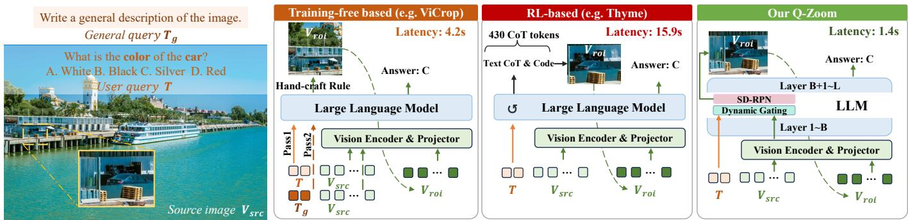

# 01 - Introduction

## 原文 Section I: INTRODUCTION

### 背景：MLLMs 的感知演进

> MLLMs have demonstrated unprecedented capabilities in visual reasoning, document understanding, and vision-language-action (VLA) modeling. The bedrock of these sophisticated reasoning capabilities lies in the model's foundational visual perception.

早期架构（如原始 LLaVA 系列）依赖冻结的低分辨率 Vision Transformer（224x224 或 336x336），虽然对粗粒度图像描述有效，但严重压缩和模糊了关键的局部细节。

为克服这一感知瓶颈，后续工作显著推进了高分辨率适配：
- **AnyRes 策略** [14, 21]: 将高分辨率输入空间分割为多个局部 patch，独立编码后拼接
- **Native Dynamic Resolution** [20, 22]: 原生适配视觉编码器处理可变高分辨率（如 Qwen2-VL 的 NaViT 架构）

> **Hao 批注**: 这一段交代了 MLLM 视觉感知的发展脉络：固定低分辨率 → AnyRes 分块 → 原生动态分辨率。Q-Zoom 要解决的问题正是这些方案引入的效率瓶颈。

---

### 核心问题：当前高分辨率范式的双重冗余

尽管分辨率扩展带来了显著的感知提升，但现有方案默认采用"暴力扩展"范式：

> Current dynamic resolution solutions default to a brute-force scaling paradigm, producing visual tokens based solely on raw input resolution.

**冗余一：忽视 Query-Level Intent**
- 假设所有 query 都需要最大视觉保真度
- 浪费资源在粗粒度特征就足以回答的简单问题上

**冗余二：忽视 Spatial Sparsity**
- 全局缩放整张图像 → 数千个视觉上无用的背景 token 涌入 LLM 的二次自注意力机制

> **Hao 批注**: 这两个冗余是整篇论文的 motivation 核心。Table I（见下文）的数据非常直观——把 token 从 2048 砍到 512，吞吐翻倍，精度只掉了 ~7%，说明大部分 query 根本不需要那么多 token。但现有方案选择"一律给满"，造成了巨大的算力浪费。

---

### 现有解决方案及其局限

#### 方案一：Training-Free Heuristics（如 ViCrop [23]）

- 利用 MLLM 内部交叉注意力在运行时识别 RoI，裁剪并重编码
- **问题**: 提取 attention map 需要多次冗余 prefill pass 或昂贵的自回归解码 → 严重瓶颈推理效率，且刚性规则泛化困难

#### 方案二：RL-Based Think-with-Image（如 Thyme [5], DeepEyes [4]）

- 通过强化学习优化模型自主推断视觉充分性并定位 RoI
- 虽然有效减少了 visual token 使用，但将计算负担转移到了语言模型
- **问题**: 依赖冗长 CoT 解码 → 大幅增加推理延迟；RL 优化昂贵、数据饥渴、高度不稳定

> **Hao 批注**: 这是 Fig.1 对应的核心分析。两种主流范式各有致命缺陷——training-free 慢在前传次数多，RL 慢在解码步骤多。Q-Zoom 的解法是：让感知模块直接操作在中间特征空间，在单次 prefill 中完成判断和定位。

---

### Figure 1: 三种范式对比

**Fig. 1**: Comparison of adaptive high-resolution perception paradigms.

> Training-free methods rely on handcrafted contrastive rules, requiring multiple redundant prefilling passes. RL-based methods use the LLM to auto-regressively generate code or coordinates to find the RoI. Our Q-Zoom framework operates directly on the intermediate feature space during a single prefilling pass, yielding superior efficiency.

---

### Q-Zoom 设计动机与核心思路

受 MLLM 中间层包含鲁棒视觉定位能力 [27, 28] 的启发，Q-Zoom 将两个轻量级子网络附加到冻结 backbone 上：

**阶段一：Dynamic Gating Network（消除 Query-Level 冗余）**
- 评估粗粒度特征是否足够
- 通过 Consistency-Aware Sample Generation 生成干净路由标签
- 沿分辨率轨迹评估，保留"低分→高分"的有效转移样本

**阶段二：SD-RPN（消除 Spatial 冗余）**
- 在中间 token 上预测密集 heatmap
- 裁剪并重编码仅任务相关的 RoI
- 通过自蒸馏范式训练：挖掘内部交叉注意力 → 过滤 sink token → 三态标签分配

**阶段三：时空对齐**
- 连续时空 MRoPE 编码方案解决粗粒度全局图像与细粒度局部 RoI 的空间失准
- 定向 Post-SFT 在显式挖掘的硬失败案例上微调 LLM，恢复鲁棒的空间推理

> **Hao 批注**: 第三阶段是 Q-Zoom 相比原始 SD-RPN 的核心增量之一。裁剪 RoI 后如果不做对齐，模型会丢失全局空间上下文，导致"看得清但看不懂在哪"的问题。连续时空位置编码 + 硬样本定向微调是一个优雅的解决方案。

---

### 实验结果速览

基于 Qwen2.5-VL-7B backbone：
- 在 Document & OCR 基准上超越 4096-token 暴力 baseline 峰值精度，同时 visual token 减少 53.0%，吞吐加速 **2.52x**
- 在 High-Resolution 基准上超越 baseline 峰值精度 2.5%，同时 visual token 减少 73.2%，吞吐加速 **4.39x**
- Q-Zoom 是即插即用模块，甚至在先进 RL-trained thinking 模型 [36] 上集成后仍提供正交性能提升

---

### 三大贡献总结

1. **Q-Zoom 框架**: 解耦感知保真度与二次计算代价，在单次 prefill pass 中同时消除 query-level 和 spatial 冗余

2. **数据高效优化策略**: Consistency-aware 样本生成训练动态门控，三态自蒸馏范式训练 SD-RPN，完全无需人工标注和昂贵 RL

3. **时空对齐与定向微调**: 连续时空位置编码 + 定向 Post-SFT，将 dense local RoI 与 coarse global layout 无缝融合

> **Hao 批注**: 本文是 SD-RPN (ICLR 2026) 的扩展。原工作成功展示了自蒸馏区域提议的可行性，但 pipeline 是刚性的（无 query-aware routing）且存在空间失准问题。Q-Zoom 将这套方案从"可工作"推进到了"全面优化"的完整框架。
