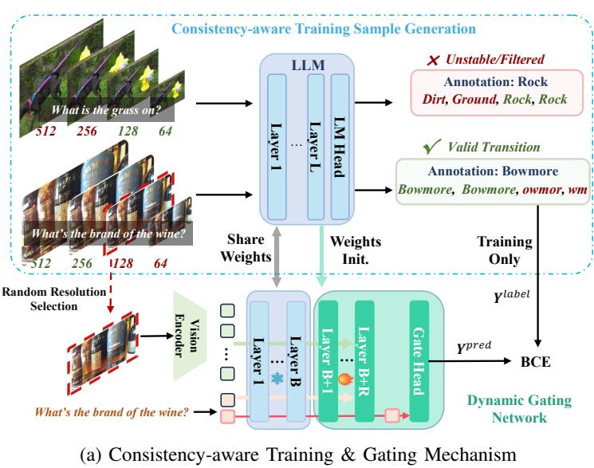
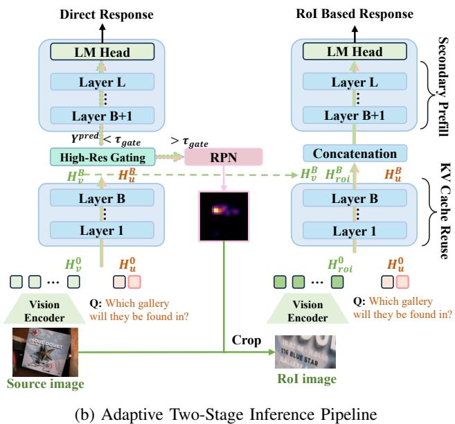

# 03 - Methodology (I): Preliminaries & Dynamic Gating

## 原文 Section III: METHOD

---

## A. Preliminaries

### MLLM 架构组成

在广泛采用的 LLaVA 风格架构中，MLLM 包含三个核心组件：

1. **Vision Encoder** $E_v$: 从原始图像 $x_v$ 提取特征
2. **Vision-Language Projector** P: 将视觉特征映射到 LLM 嵌入空间
3. **LLM Backbone** L: 包含 L 层 transformer

初始视觉嵌入序列：**$H_v^0$ = P($E_v$($x_v$))**，上标 0 表示输入嵌入层。

### Prefill 与 Decode 两个阶段

**Prefilling 阶段（高度并行化）**：

LLM 将视觉嵌入与文本 token（系统提示 $H_{sys}^0$ 和用户查询 $H_{user}^0$）一同处理：

$$H_{context}^L = \mathcal{L}([H_{sys}^0, $H_{v}^{0}$, H_{user}^0]) $$

其中 [·,·] 表示序列拼接。

**Autoregressive Decoding 阶段**：

模型的逐 token 生成概率分布：

$$P(y_t | x_v, x_t, y_{\lt t}) = \mathrm{Softmax}(W_{head} \, h_t^L) $$

其中 $h_t^L$ 是第 L 层在第 t 步的隐藏状态，$W_{head}$ 是语言建模头。

> **Hao 批注**: 这里强调了一个关键前提——由于高度并行化的矩阵运算，**prefilling 阶段比自回归解码快得多**（对同等 token 数量而言）。Q-Zoom 的核心设计原则之一就是将所有的感知决策（门控 + RoI 定位）都放在 prefill 阶段完成，避免进入慢速的 decode 阶段。这也是它比 RL 方法快得多的根本原因。

---

## B. Adaptive Dynamic Gating Mechanism

### 动机：不是所有 query 都需要高分辨率

Table I 的数据揭示了关键洞察：将输入从 2048 约束到 512 tokens，吞吐翻倍，精度仅从 83.1% 降到 76.5%。这意味着**大多数 query 可以用粗粒度上下文解决**，全域高分辨率处理极度浪费。

> **Hao 批注**: 这里作者将高分辨率感知重新表述为一个 **条件路由问题（conditional routing problem）**——二元分类器动态预测特定 query ($x_v$, $x_t$) 是否需要高分辨率细化。这个 formulation 很巧妙，将一个连续的感知保真度问题转化为了离散的路由决策。

### Figure 2: 框架总览

<table><tr><td width="50%"></td><td width="50%"></td></tr><tr><td align="center"><i>Figure 2a</i></td><td align="center"><i>Figure 2b</i></td></tr></table>

*Figure 2: Overview of the proposed Adaptive High-Resolution Perception Framework. (a) 通过 consistency-aware generation 生成鲁棒监督信号训练门控模块。(b) 推理时门控动态评估文本 query，路由简单 query 直接用粗粒度特征生成，复杂 query 触发 SD-RPN 提取定向高分辨率区域。*

---

### B.1 Consistency-aware Training Sample Generation

#### 为什么不能直接用单分辨率正确性？

> A naive approach assigns refinement labels based solely on the correctness of a single low-resolution response. However, MLLM performance is also influenced by intrinsic hallucinations or ambiguous queries, making such labels highly noisy.

**核心问题**: MLLM 性能不仅受分辨率影响，还受到固有幻觉和歧义 query 的影响，单分辨率标签噪声极大。

#### 解决方案：多分辨率一致性检验

沿**单调递增分辨率轨迹** R = {r_1, r_2, ..., $r_{k}$} 生成响应 {y_r1, y_r2, ..., $y_{rk}$}：

1. **严格启发式**: 响应精度跨分辨率应近似 Heaviside 阶跃函数
2. **接受有效转移**: 模型在低分辨率失败但在高分辨率成功
3. **丢弃不稳定案例**: 模型在低分辨率成功但在高分辨率失败

> **Hao 批注**: 这里的核心思想是——如果分辨率真的是决定正确性的因素，那么正确性应该随分辨率单调递增。如果低分对高分错，那说明正确与否跟分辨率无关（可能是幻觉等其他因素），这些样本不应该用于训练门控。这个过滤策略非常聪明，本质上是利用多分辨率作为"因果推断"的工具来消除混淆因子。

#### 标签生成

对于过滤后的样本：
- 随机选择分辨率 r ∈ R 产生 $x_v^{r}$
- 如果响应**错误** → 标签 $Y_{label}$ = 1 (**Need-Refine**)，触发 RoI 分支
- 如果响应**正确** → 标签 $Y_{label}$ = 0 (**No-Refine**)，跳过冗余处理

> 这本质上是将 **多分辨率共识** 转化为 **鲁棒的二元目标**，迫使门控学习"额外的局部视觉细节是否会切实改变答案质量"。

---

### B.2 Gating Network Architecture and Optimization

#### 架构设计（参数复用策略）

遵循与 SD-RPN [37] 相同的参数复用范式：

- 门控模块 G 使用原始 LLM backbone 的第 B+1 到 B+R 层预训练权重初始化
- Prefill 阶段：拼接的视觉+文本 token 通过前 B 层冻结层 → **$H_{context}^B$**
- 这些表示通过 R 层可调门控层 → **$H_{gate}^{(B+R)}$**

#### 路由决策：利用 Causal Attention 特性

> Because the causal masking of the transformer's self-attention mechanism strictly propagates historical context forward, this terminal token inherently aggregates the full semantic intent of the question alongside the preceding visual evidence.

**关键设计**: 隔离用户 query 最后一个 token 的隐藏状态 **$H_{gate}^{(B+R)}[-1]$**：
- Causal attention 保证此 token "看到"了所有之前的 visual + text 上下文
- 通过线性投影头 $LP_{gate}$ + sigmoid → 连续细化概率 $Y_{pred}$

> **Hao 批注**: 用最后一个 query token 作为路由决策的依据是一个经典且合理的设计。在 causal attention 下，这个 token 的 hidden state 聚合了问题语义 + 视觉证据的完整上下文。相比用 [CLS] token 或平均 pooling，使用末 token 能更好地捕捉 query 的意图。

#### 训练与推理

**训练目标**：

$$H_{gate}^{B+R} = \mathcal{G}(H_{context}^B)$$

$$Y^{pred} = \sigma(LP_{gate}(H_{gate}^{B+R}[-1]))$$

$$\mathcal{L}_{gate} = \mathrm{BCE}(Y^{pred}, Y^{label}) $$

**推理时的自适应路由**：

引入预定义置信度阈值 $τ_{gate}$ 控制精度-效率权衡：

- **$Y_{pred}$ < $τ_{gate}$**: 粗粒度输入足够 → 旁路门控分支 → LLM 通过剩余冻结层继续标准前向
- **$Y_{pred}$ >= $τ_{gate}$**: 检测到关键视觉不足 → 暂停标准生成 → 触发 SD-RPN 模块

> **Hao 批注**: $τ_{gate}$ 是一个可以手动调节的"旋钮"，控制精度与速度的 trade-off。这也是 Fig.8 中 Pareto 曲线图的来源——不同的 $τ_{gate}$ 对应曲线上不同的点。在实际部署中可以按需调整这个阈值。
