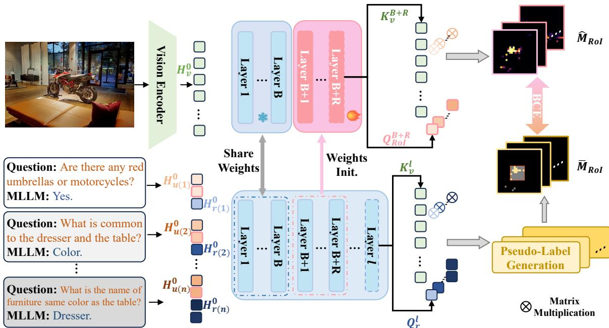
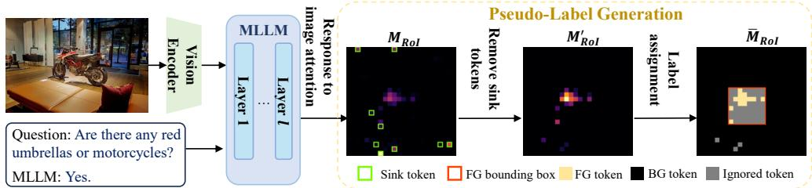
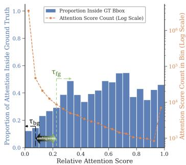
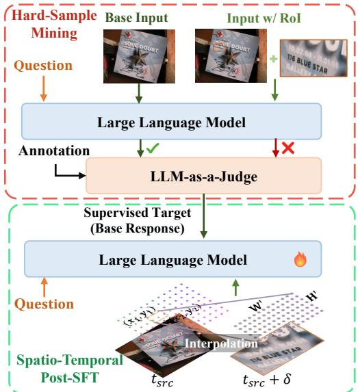

# 04 - Methodology (II): SD-RPN & Spatio-Temporal Alignment

## 原文 Section III-C & III-D

---

## C. Self-Distilled Region Proposal Network (SD-RPN)

当门控网络触发细化路径（Y_pred >= τ_gate）时，缩放整张图像会导致严重的二次计算瓶颈。SD-RPN 的任务是**在空间上隔离关键视觉证据**。

> **Hao 批注**: 门控解决了"需不需要高分辨率"的问题，SD-RPN 解决的是"高分辨率放在哪里"的问题。两者配合完成从"要不要"到"放哪里"的完整决策链。

### Figure 3: SD-RPN 架构总览



**Fig. 3**: Overview of the conditional Region-of-Interest extraction pipeline. (上) 当动态门控模块触发时，SD-RPN 利用冻结 backbone 共享的中间特征高效生成密集空间 heatmap。(下) 训练阶段通过自蒸馏范式优化——利用 denoised cross-modal attention maps 作为监督伪标签。

---

### C.1 Lightweight RoI Prediction via Branched Feature Reuse

#### 架构设计

受 MLLM 中间层包含鲁棒视觉定位能力 [27, 28] 的启发：

- SD-RPN 是操作在冻结 backbone 中间特征上的**轻量级分支**
- 包含 R 个 transformer 块，使用第 B+1 到 B+R 层预训练权重初始化
- 结构上与门控网络**平行**

#### 密集 RoI 热力图预测

**步骤 1**: 在初始 prefill 阶段，RPN 继承冻结 backbone 计算的 **H_context^B**，通过前 R-1 个可调层产生 **H_rpn^(B+R-1)**

**步骤 2**: 将最后（第 R）个 block 的自注意力机制复用为专门的空间预测头：

- 从序列中隔离最后一个 user query token: **H_u^(B+R-1)[-1]** ∈ R^(1×d)
- 提取密集视觉特征序列: **H_v^(B+R-1)** ∈ R^(HW×d)
- 通过 RPN 第 R 个注意力层的原生投影矩阵 (LP_q 和 LP_k) 映射到共享潜空间：

$$Q_{RoI} = LP_q(\mathrm{Norm}(H_u^{B+R-1}[-1]))$$
$$K_v = LP_k(\mathrm{Norm}(H_v^{B+R-1})) \tag{4}$$

**步骤 3**: 通过内积计算空间热力图：

$$\hat{M}_{RoI} = Q_{RoI} K_v^\top \tag{5}$$

> **Hao 批注**: 这个设计非常优雅。核心思路是将 query token 作为"查询"，将 visual tokens 作为"键"，计算它们的注意力分数作为 RoI heatmap。这本质上是在问"哪些视觉位置与当前问题最相关？"——不需要引入任何新的随机初始化参数，完全复用了注意力层的预训练投影矩阵。

**步骤 4**: 热力图后处理：

- Sigmoid 激活 → 重塑为 2D 空间网格 → 高斯滤波平滑 → 二值化（阈值 τ_roi）

$$\mathcal{B}(x,y) = \begin{cases} 1, & \text{if } \mathcal{G}(\gamma(\sigma(\hat{M}_{RoI})))(x,y) > \tau_{roi} \\ 0, & \text{otherwise} \end{cases} \tag{6}$$

**步骤 5**: 计算包围激活前景的最小轴对齐边界框，裁剪局部子图并重编码：

$$b_{roi} = \mathrm{bbox}(B), \quad H_{v_{roi}}^0 = \mathcal{P}(\mathcal{E}_v(x_{v_{roi}})) \tag{7}$$

#### KV-Cache 前缀复用优化

> **Hao 批注**: 这是 Q-Zoom 高效率的关键工程优化。因为高分辨率 RoI token 插入在文本 query 之前，系统提示和粗粒度视觉特征的 prefix 上下文到第 B 层为止在数学上保持不变。直接检索缓存的 H_sys^B 和 H_v^B，仅对新 RoI 和位移后的 user token 进行前 B 层前向：

$$[H_{v_{roi}}^B, H_{user}^B] = \mathcal{L}_{1:B}([H_{v_{roi}}^0, H_{user}^0]) \tag{8}$$

拼接后通过剩余层生成最终响应：

$$H_{context}^L = \mathcal{L}_{B+1:L}([H_{sys}^B, H_v^B, H_{v_{roi}}^B, H_{user}^B]) \tag{9}$$

这种缓存策略避免了粗粒度视觉上下文的冗余重编码，显著加速二次 prefill 阶段。

---

### C.2 Training SD-RPN via Self-Distillation

MLLM 的内部交叉注意力机制天然具有强大的视觉定位能力。通过精炼这些信号构建高质量伪标签，**完全消除对外部定位数据的依赖**。

#### (a) Extracting Raw Grounding Signals

从指定的中间层 l 提取交叉模态注意力权重。对于单个注意力头：

$$M_{RoI}^l = \frac{1}{N_t} \sum_{i=1}^{N_t} A_i^l, \quad \text{where} \quad A^l = \mathrm{softmax}\left(\frac{Q_t^l (K_v^l)^\top}{\sqrt{d}}\right) \tag{10}$$

> 每个 visual token 对文本响应的聚合重要性编码为 RoI map。

#### (b) Robust Pseudo-Label Construction

> Directly utilizing M_{RoI} as a dense supervisory signal is suboptimal because raw attention distributions are notoriously noisy.

**Figure 4: 伪标签生成 Pipeline**



**Fig. 4**: Pseudo-label generation pipeline. 通过移除 sink token 去噪原始 attention map，再进行三态标签分配——隔离高置信前景 (FG) 和背景 (BG) token，忽略模糊中间区域。

**噪声源一：Sink Tokens**

某些 visual token 尽管缺乏与定位对象的语义相关性，却累积了不成比例的 attention mass。这些 token 在特征表示中一致地显示出异常大的 L2-norm。

过滤策略（Eq.11）：对 L2-norm 超过阈值 τ_norm 的 token 将 attention 置零：

$$(M_{RoI}')_j = \begin{cases} 0, & \text{if } \|(H_v)_j\|_2 > \tau_{norm} \\ (M_{RoI})_j, & \text{otherwise} \end{cases} \tag{11}$$

**Figure 5: Attention Magnitude vs Localization Accuracy**



**Fig. 5**: 在 TextVQA 上，具有极端相对 attention score (a_j / a_max) 的 token 与 ground-truth 前/背景可靠相关，但大量 token 落入高度模糊的中间范围。

> **Hao 批注**: Fig.5 是理解三态标签设计的关键。横轴是相对 attention score，纵轴可能展示了前景/背景的分类准确率。核心发现：两端（极低和极高 attention）是干净的信号，中间是一片"灰色地带"——这些 token 既可能属于前景也可能属于背景，强行分类只会引入噪声。

**噪声源二：前景-背景边缘模糊**

**选择性三态分类策略**：

1. **高置信前景集** S_fg = {j | a_j >= τ_fg · a_max}
   - 构建包围这些前景 token 的最小边界框 B_fg
2. **Ignore 区域**: B_fg 内但不属于 S_fg 的 token 设为 ignore (-1)
   - 防止不完整的对象激活错误惩罚网络
3. **背景集** S_bg: B_fg 外且 attention 低于 τ_bg · a_max 的 token (严格约束)

最终离散伪标签：

$$(\bar{M}_{RoI})_j = \begin{cases} 1, & \text{if token } j \in S_{fg} \\ 0, & \text{if token } j \in S_{bg} \\ -1, & \text{otherwise (ignored)} \end{cases} \tag{12}$$

> **Hao 批注**: 三态标签设计是本方法最精巧的部分之一。它承认了 attention-based 伪标签的内在模糊性，并通过 ignore 机制避免了在不确定区域上施加 hard supervision。这在标签噪声管理上是一个成熟且有效的策略。

#### 多轮对话处理

为支持多轮交互，在训练期间绕过昂贵的解码步骤：

- 从 SD-RPN 的倒数第二层 (l = B+R-1) 提取隐藏状态
- 跨 n 轮对话拼接：系统提示 + 视觉 + 多轮 query/response

$$H^l = [H_{sys}^l, H_v^l, H_{u(1)}^l, H_{r(1)}^l, \ldots, H_{u(n)}^l, H_{r(n)}^l] \tag{13}$$

每个用户 query 的末 token 拼接为聚合 query tensor：

$$H_{RoI}^l = \mathrm{concat}(H_{u(1)}^l[-1], \dots, H_{u(n)}^l[-1]) \tag{14}$$

这些 query 和密集视觉状态通过 Eq.4-5 计算多轮 RoI map，通过**选择性 BCE loss** 优化（仅在有效 token 上计算梯度）：

$$\mathcal{L}_{RPN} = \mathrm{BCE}(\hat{M}_{RoI}, \bar{M}_{RoI})$$

---

## D. Spatio-Temporal Alignment and Targeted Fine-Tuning

### 问题：RoI 裁剪导致的空间失准

虽然高分辨率 RoI 有效隔离了细粒度视觉细节，但裁剪区域脱离了其更广泛的空间上下文。对于配备 MRoPE 的 MLLM，将粗粒度源图像和局部 RoI 作为两个独立视觉序列处理会**导致空间错位**，使模型无法将 RoI 映射回其原始物理位置。

> **Hao 批注**: 想象一个场景——问题是"左边桌子上红色的杯子是什么牌子？"。SD-RPN 精准定位了杯子区域，裁剪后重编码能清晰看到品牌文字。但裁剪丢失了"左边桌子"的空间参照，模型可能答出品牌但无法正确描述位置关系。这就是空间失准的典型表现。

### Figure 6: 时空对齐与 Post-SFT 流程



**Fig. 6**: Overview of the Spatio-Temporal Alignment and Targeted Post-SFT pipeline.

---

### 连续时空对齐方案

#### 双轴位置调整：Temporal Shift + Spatial Interpolation

**1. Temporal Shift（时间位移）**

- 目的：在逻辑上区分密集 RoI token 和共享相同空间足迹的粗粒度源 token，防止位置冲突
- 操作：为 RoI token 分配偏移时间索引 t_roi = t_src + δ
- δ = min(H, W)：将高分辨率 RoI 投影到源图像上方的"辅助时间层"
- 效果：遵循 MRoPE 的 (t, h, w) 三维位置编码体系

**2. Spatial Interpolation（空间插值）**

- 目的：保持语义定位，将 RoI 的空间位置 ID 直接源自源图像的边界框坐标
- 操作：裁剪的 RoI 产生比源图像中等效区域更密集的视觉 token 网格 (H' × W')，将稀疏源坐标插值填充密集 RoI 网格

#### 形式化定义

令 b = [x_1, y_1, x_2, y_2] 表示归一化到源坐标空间的 RoI 精确边界框，RoI token 在网格索引 (i, j) 处的连续时空位置嵌入：

$$p_{roi}^{(i,j)} = \mathrm{Embed}\left(t_{src} + \delta, \ y_1 + \frac{i}{H'-1}(y_2 - y_1), \ x_1 + \frac{j}{W'-1}(x_2 - x_1)\right) \tag{15}$$

其中 i ∈ {0, ..., H'-1}, j ∈ {0, ..., W'-1}。**保证密集 RoI token 保持在其原始全局坐标中的显式锚定**。

> **Hao 批注**: 这个设计非常精妙。Temporal Shift 避免了位置 ID 冲突（相同空间位置但不同来源的 token 获得不同的 t 坐标），Spatial Interpolation 保持了空间连续性（RoI token 知道自己在全局图像中的位置）。两个操作合在一起，实现了"看得清（高分辨率）且知道在哪（全局定位）"。

---

### Targeted Post-Supervised Fine-Tuning (Post-SFT)

即使有严格的位置对齐，预训练的 LLM backbone 缺乏融合双流输入（粗全局 + 细局部）的固有能力。局部特征的突然涌入可能分散模型注意力，掩盖全局上下文。

#### 核心策略：对比硬样本挖掘

1. 使用 **LLM-as-a-Judge** 评估两个配置的并行响应：
   - **原始 Base Model**（仅粗粒度输入）
   - **Unfinetuned RoI-Based Model**（源图像 + 对齐 RoI）

2. 隔离 **Base Model 正确但 RoI Model 失败** 的硬样本子集
   - 这些样本捕获了空间失准和上下文分散的实例

3. Post-SFT 阶段：
   - Vision Encoder 和 Projector 保持**冻结**
   - 仅更新 **LLM backbone**，使用挖掘的 ~7K 硬样本
   - 教导 LLM 如何动态平衡和集成高分辨率 RoI 特征与粗粒度全局上下文

> **Hao 批注**: 这里有三个关键设计选择：
> 1. **只微调 LLM backbone**——视觉编码器和投影器保持冻结，避免改变视觉表示空间
> 2. **只选硬样本**——不是所有 RoI 增强的样本都需要微调，只有那些"加了 RoI 反而答错"的才需要修正
> 3. **LLM-as-a-Judge**——自动化筛选，不需要人工标注。这个策略的数据效率极高（仅 7K 样本），且不会引入灾难性遗忘

**注意**: 由于 LLaVA 系列不原生支持 MRoPE，Post-SFT 阶段**仅适用于 Qwen 系列**。

---

## 训练流程总结

```
┌──────────────────────────────────────────────────────┐
│                Q-Zoom Training Pipeline               │
├──────────────────────────────────────────────────────┤
│                                                       │
│  Step 1: SD-RPN Training (自蒸馏)                      │
│    ├── 从冻结 backbone 提取交叉注意力                   │
│    ├── Sink token 过滤 + 三态标签分配 → 伪标签         │
│    ├── 仅优化 SD-RPN 分支 (R layers)                   │
│    └── 数据: 185K (Qwen) / 152K (LLaVA)              │
│                                                       │
│  Step 2: Post-SFT (定向微调, Qwen only)               │
│    ├── LLM-as-a-Judge 筛选硬样本 (~7K)                │
│    ├── 仅优化 LLM backbone                            │
│    └── 恢复全局空间推理能力                             │
│                                                       │
│  Step 3: Dynamic Gate Training (一致性生成)             │
│    ├── 多分辨率轨迹评估 → 一致性过滤                    │
│    ├── 仅优化 Gating 分支 (R layers)                   │
│    └── 数据: 40K-60K (依模型而定)                      │
│                                                       │
│  注意: 三个步骤中 backbone 始终冻结                     │
│  (Post-SFT 除外，该阶段仅更新 LLM backbone)             │
│                                                       │
└──────────────────────────────────────────────────────┘
```
