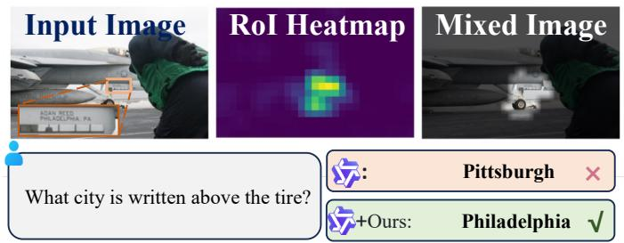
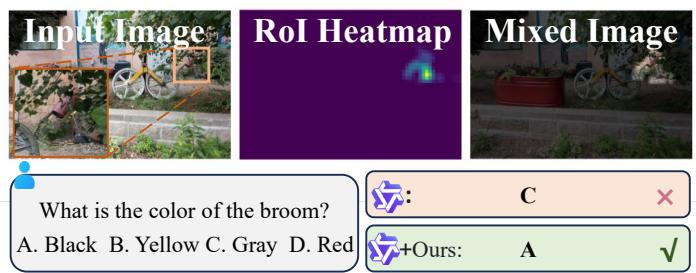
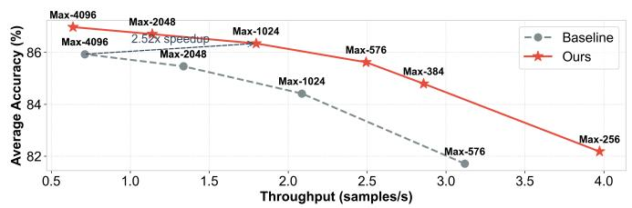
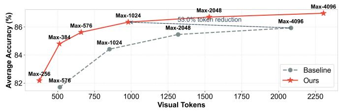
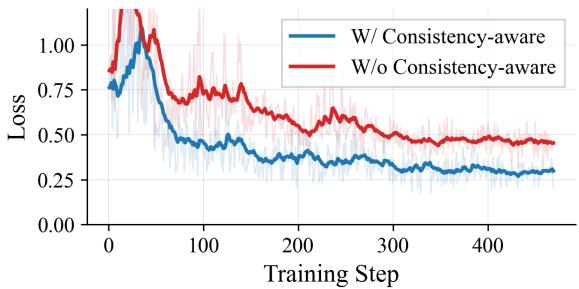
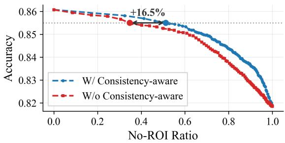

# 05 - Experiments & Conclusion

## 原文 Section IV: EXPERIMENTS

---

## A. Experiment Settings

### (a) Benchmarks

三类需要细粒度感知的基准：

| 类别 | 数据集 | 评估维度 |
|------|--------|---------|
| **Document & OCR** | DocVQA, InfoVQA, ChartQA, OCRBench, TextVQA | 文档理解、文字识别、图表推理 |
| **High-Resolution & Vision-Centric** | V*, MME-RealWorld, HR-Bench (4K/8K) | 小目标检测、空间推理、高分辨率场景 |
| **General QA** (消融用) | MME, MMStar | 验证多模态通用性保持 |

### (b) Implementation Details

**训练范式一：Efficient Partial Tuning**

- 冻结 base MLLM，仅优化新增分支参数
- Dynamic Gate 和 SD-RPN 在标准 VQA 和文档数据集的过滤子集上训练
- LLaVA 系列训练时排除极端分辨率样本（基础分辨率低导致伪标签提取不稳定）

**训练范式二：Targeted Post-SFT**

- 仅微调 LLM backbone
- ~7K 硬样本（LLM-as-a-Judge 挖掘）
- **仅适用于 Qwen 系列**（LLaVA 缺少 MRoPE）

### (c) Inference Configurations

- 标准基准：max visual tokens = 576（与 LLaVA baseline 对齐）
- 高分辨率基准：max visual tokens = 4096（公平比较 SoTA）
- 放松最小 token 数（如 128）以保留动态宽高比编码
- 评估框架：LMMS-Eval [75]，单 NVIDIA RTX A6000 GPU

---

## B. Main Results

### Table II: Document & OCR Benchmarks

**原文 Table II**: Performance on Document & OCR benchmarks.

> 关键结果速览（以 Qwen2.5-VL-7B 为例）：

| Methods | Throughput | DocVQA | ChartQA | OCRBench | InfoVQA | TextVQA | Ave. |
|---------|-----------|--------|---------|----------|---------|---------|------|
| Baseline | 1.0x | 92.0 | 83.0 | 82.8 | 70.1 | 81.1 | 81.8 |
| SD-RPN [37] | 0.50x | 93.6 | 85.5 | 82.9 | 76.9 | 83.5 | 84.5 |
| **Q-Zoom** | **0.81x** | **94.3** | **85.6** | **85.4** | **79.4** | **83.5** | **85.6 (+3.8)** |

> **Hao 批注**: 
> 1. Q-Zoom 相比 SD-RPN 的吞吐从 0.50x 提升到 0.81x（**+62%**），同时精度还略有提升。这直接归功于 Dynamic Gating——简单 query bypass 了 RoI 分支。
> 2. AdaptVision（RL-based）的吞吐仅 0.06x，Q-Zoom 比它快 **>13x**。这暴露了 RL 范式的结构性问题——自回归 CoT 解码严重瓶颈吞吐。
> 3. Qwen3-VL-4B 上 Q-Zoom 的吞吐达 0.82x，精度 +3.2%，显示跨架构的鲁棒泛化。

### Table III: High-Resolution & Vision-Centric Benchmarks

**原文 Table III**: Performance on Vision-Centric and High-Resolution benchmarks.

> 关键结果速览（以 Qwen2.5-VL-7B 为例）：

| Methods | Throughput | V* Overall | MME-RW | HR-4K Overall | HR-8K Overall | Ave. |
|---------|-----------|-----------|--------|--------------|--------------|------|
| Baseline | 1.00x | 78.0 | 42.7 | 72.5 | 63.6 | 64.2 |
| Thyme [5] | 0.21x | 82.2 | 53.7 | 77.0 | 72.0 | 71.2 |
| DeepEyes [4] | - | 85.6 | 50.9 | 75.1 | 72.6 | 71.1 |
| SD-RPN [37] | 0.77x | 88.0 | 46.4 | 78.5 | 73.5 | 71.6 |
| **Q-Zoom** | **0.86x** | **85.3** | **48.0** | **78.5** | **77.3** | **72.3 (+8.1)** |

> **Hao 批注**: 
> 1. Q-Zoom 在 Qwen2.5-VL-7B 上达到 72.3% 均值，超过 DeepEyes (+1.2%) 和 Thyme (+1.1%)
> 2. 关键的是，Q-Zoom 的吞吐 0.86x 远超 Thyme 的 0.21x（**>4x 更快**），因为绕过了 RL 方法的 text-decoding 瓶颈
> 3. 在 RL-trained ZwZ 模型上叠加 Q-Zoom 后进一步提升 6.6%（ZwZ-Qwen2.5-VL）和 5.2%（ZwZ-Qwen3-VL），证明 Q-Zoom 与高级推理范式正交互补

---

### Figure 7: Qualitative Comparison

<table><tr><td width="50%"></td><td width="50%"></td></tr><tr><td align="center"><i>Figure 7a</i></td><td align="center"><i>Figure 7b</i></td></tr></table>

*Figure 7: Qualitative comparisons on TextVQA (left) and V* Bench (right).*

> **左侧 (TextVQA)**: Baseline 因压缩将 "Philadelphia" 幻觉为 "Pittsburgh"。SD-RPN 预测出微观文本上的集中 heatmap，Q-Zoom 准确读取。
> **右侧 (V* Bench)**: Baseline 盲目猜测被遮挡扫帚颜色为 "Gray"。Q-Zoom 定位物体，将高分辨率裁剪路由至正确答案 "Black"。

---

### Figure 8: Accuracy vs Efficiency Pareto Frontiers

<table><tr><td width="50%"></td><td width="50%"></td></tr><tr><td align="center"><i>Figure 8a</i></td><td align="center"><i>Figure 8b</i></td></tr></table>

*Figure 8: (a) Document & OCR, (b) High-Resolution & Vision-Centric.*

> 在 Qwen2.5-VL-7B 上扫描 visual token 限制 256-4096：

| 场景 | Baseline 峰值 | Baseline 峰值 token | Q-Zoom 超越点 | Q-Zoom 超越点 token | 加速 | Token 减少 |
|------|-------------|-------------------|-------------|-------------------|------|-----------|
| Doc & OCR | 85.9% | 4096 | 85.9%+ | **1024** | 2.52x | 53.0% |
| High-Res | 64.2% | 4096 | 66.7% | **576** | 4.39x | 73.2% |

> **Hao 批注**: 这张图是 Q-Zoom 最强的论据。Q-Zoom 的 Pareto 曲线**严格支配** baseline——在任意 token 预算下，Q-Zoom 的精度都更高或持平，且在极低 token 预算（256-576）下差距尤为显著。这意味着 Q-Zoom 不是简单的"精度换速度"，而是**同时提升了精度和效率**。

---

## C. Ablation Study

### Table IV: Effectiveness of Key Components

**原文 Table IV**: Ablation on core components. 以 Qwen2.5-VL-7B 为例：

| RPN | SFT | Gate | Doc/OCR Tp | Doc/OCR Ave. | High-Res Tp | High-Res Ave. | General QA |
|-----|-----|------|-----------|-------------|------------|--------------|------------|
| - | - | - | 1.0x | 81.8 | 1.0x | 52.5 | 基准 |
| v1 | - | - | 0.50x | 84.5 | 0.47x | 64.4 | 保持 |
| v2 | - | - | 0.59x | 85.5 | 0.49x | 66.7 | 保持 |
| v2 | Y | - | 0.63x | 86.1 | 0.52x | 67.3 | 保持 |
| v2 | Y | Y | **0.81x** | **85.6** | 0.54x | 66.6 | **保持** |

**关键发现**：

1. **升级 SD-RPN 训练数据**（v1→v2）：移除严格 token 约束 + 增加 33K 高分辨率 DocVQA 样本 → 精度和吞吐双提升
2. **Post-SFT**：解决 dense local RoI 与 coarse global 的空间失准，恢复全局空间推理，不损害 General QA
3. **Dynamic Gating**：在 Doc/OCR 和 General QA 上安全 bypass RoI 分支 → 吞吐提升近 **30%**；在 High-Res 上始终触发 RoI → 保持精度峰值

> **Hao 批注**: 值得注意的是，加了 Gate 后 Doc/OCR 精度从 86.1 轻微下降到 85.6（但吞吐从 0.63 升到 0.81），而 High-Res 的吞吐反而略有提升（0.52→0.54）且精度几乎不变。这说明门控在不同任务类型上表现出不同的行为——对于简单任务更多 bypass，对于困难任务几乎全部触发。

---

### Table V: Comparison with Training-Free RoI Strategies

**原文 Table V**: 对比 SD-RPN 与三种 training-free RoI 替代方案：

| Method | Doc/OCR Tp | Doc/OCR Ave. | High-Res Tp | High-Res Ave. |
|--------|-----------|-------------|------------|--------------|
| Baseline (LLaVA-7B) | 1.0x | 27.5 | 1.0x | 37.3 |
| Response-to-Image Attention | 0.39x | 31.8 | 0.38x | 40.5 |
| GroundingDINO (1 bbox) | 0.37x | 29.6 | 0.17x | 44.5 |
| GroundingDINO (2 bbox) | 0.32x | 30.0 | 0.15x | 46.1 |
| **+SD-RPN** | **0.62x** | **34.6** | **0.57x** | **46.8** |

> **Hao 批注**: 
> - **Attention 方案**的问题：虽然精度尚可，但需要昂贵的自回归解码提取 attention map → 吞吐极低
> - **GroundingDINO** 的问题：缺乏深度语义推理，对复杂 query 表现挣扎；与 MLLM 解耦导致无法共享计算 → 效率最差
> - **SD-RPN 优势**：将 query-conditioned 推理直接蒸馏到轻量集成分支 → 精度和速度双赢

---

### Table VI: Impact of Backbone Depth (B) and RPN Capacity (R)

**原文 Table VI**: 基于 Qwen2.5-VL-7B。

**Backbone Depth B 的消融**（固定 R=3）：

| B | Doc | Chart | OCR | Info | Text | V* | RW | **Ave.** |
|---|------|-------|-----|------|------|-----|-----|-----------|
| 3 | 92.6 | 85.0 | 82.2 | 70.4 | 81.2 | 61.8 | 36.5 | 72.8 |
| 9 | 93.0 | 84.8 | 83.3 | 71.0 | 81.4 | 71.2 | 36.0 | 74.4 |
| 15 | 94.0 | 85.6 | 84.4 | 77.6 | 82.7 | 71.7 | 39.6 | 76.5 |
| **18** | **94.1** | **85.8** | **84.9** | **79.6** | **83.0** | **80.1** | **44.6** | **78.9** |
| 21 | 93.6 | 85.7 | 84.4 | 76.4 | 82.2 | 78.5 | 41.2 | 77.4 |

> B=18 为最优，恰好与近期 probing study [27] 识别的固有定位层深度一致。

**RPN 层数 R 的消融**（固定 B=18）：

| R | Doc | Chart | OCR | Info | Text | V* | RW | **Ave.** |
|---|------|-------|-----|------|------|-----|-----|-----------|
| 1 | 93.6 | 85.2 | 84.6 | 75.5 | 82.5 | 71.7 | 40.4 | 76.2 |
| 2 | 93.8 | 85.8 | 84.8 | 78.7 | 83.1 | 78.6 | 44.2 | 78.4 |
| **3** | **94.1** | **85.8** | **84.9** | **79.6** | **83.0** | **80.1** | **44.6** | **78.9** |
| 4 | 93.6 | 85.8 | 84.1 | 76.9 | 82.4 | 75.4 | 44.5 | 77.5 |

> 单层投影定位能力不足 → 网络需要足够深度将中间特征转化为密集 heatmap。R=3 最优，R=4 略有退化。**B=18, R=3 作为所有主实验的默认配置**。

> **Hao 批注**: B=18 与 [27] 发现的"视觉功能层"位置一致（即在 Qwen2.5-VL-7B 的 ~18 层附近视觉定位信息最丰富），这是一个很好的验证——方法设计的内在先验与独立研究的实证发现吻合。

---

### Table VII: Data Efficiency and Self-Distillation Quality

**原文 Table VII**: SD-RPN 伪标签训练数据量消融。

| 数据量 | Doc | Chart | OCR | Info | Text | V* | RW | **Ave.** |
|--------|------|-------|-----|------|------|-----|-----|-----------|
| 10K | 93.6 | 85.4 | 84.9 | 78.0 | 82.7 | 78.5 | 40.7 | 77.7 |
| 25K | 93.5 | 85.5 | 85.1 | 78.1 | 83.0 | 80.1 | 42.4 | 78.2 |
| 50K | 93.4 | 85.5 | 84.6 | 78.8 | 83.0 | 78.0 | 43.7 | 78.1 |
| 100K | 93.6 | 85.3 | 84.9 | 79.2 | 82.9 | 78.0 | 45.1 | 78.4 |
| **185K** | **94.1** | **85.8** | **84.9** | **79.6** | **83.0** | **80.1** | **44.6** | **78.9** |
| *68K GT* | 93.4 | 85.5 | 83.6 | 75.8 | 83.0 | 80.1 | 44.3 | 78.0 |

关键发现：
- **极速收敛**：仅 10K 自蒸馏伪标签 → 77.7% 均值（已接近饱和）
- **GT 监督对比**：68K GT 边界框训练（Visual CoT 数据集）→ 78.0%，仅与 50K 伪标签模型相当（78.1%）
- **结论**：自蒸馏 pipeline 成功消除了对外部标注数据集的依赖，且质量不逊于人工标注

> **Hao 批注**: 这是非常强的论证。自蒸馏的伪标签质量与人工标注的 GT 边界框效果相当，而前者是免费的。这也侧面说明 MLLM 内部的交叉注意力确实包含了高质量的定位信息，只是需要合适的方法去挖掘和去噪。

---

### Table VIII: Pseudo-Label Assignment Thresholds

**原文 Table VIII**: $τ_{fg}$ 和 $τ_{bg}$ 的消融。

> 核心结论：$τ_{fg}$ = 0.20, $τ_{bg}$ = 0.05 达到峰值性能（LLaVA-7B: 55.6%, Qwen2.5-VL-7B: 82.7%）
> - $τ_{fg}$ = $τ_{bg}$ = 0.10 时（等同于禁用三态标签），性能显著下降
> - 这直接验证了三态标签设计的必要性

---

### Figure 9: Consistency-aware Training Ablation

<table><tr><td width="50%"></td><td width="50%"></td></tr><tr><td align="center"><i>Figure 9a</i></td><td align="center"><i>Figure 9b</i></td></tr></table>

*Figure 9: (上) 门控网络训练 loss 曲线。(下) 准确率 vs No-RoI Ratio 的 Pareto 前沿。*

- **Naive labeling**（基于单分辨率正确性）：优化极不稳定，收敛到高 loss 下界
- **Consistency-aware**：平滑优化，更快收敛到更低 loss 下界
- 在 85.5% 精度阈值处，consistency-aware gate 安全旁路比 naive baseline 多 **16.5%** 的 query，提升整体吞吐而不牺牲感知保真度

> **Hao 批注**: Fig.9 直接证明了 consistency-aware 策略的必要性——不只是在训练阶段收敛更好，在推理时也能更准确地判断哪些 query 不需要高分辨率。

---

## 原文 Section V: CONCLUSION

> In this paper, we presented Q-Zoom, an efficient, query-aware adaptive high-resolution perception framework for MLLMs. Current global resolution scaling paradigms suffer from profound query-level and spatial redundancies, indiscriminately flooding self-attention mechanisms with visually useless tokens. To resolve this, Q-Zoom fundamentally decouples perceptual fidelity from computational cost by dynamically determining if high-resolution refinement is necessary and where it should be spatially applied.

核心要点总结：

1. **Dynamic Gating Mechanism**: 通过一致性感知样本生成策略优化，作为智能路由器为简单 query 旁路高分辨率处理
2. **Self-Distilled Region Proposal Network (SD-RPN)**: 精确本地化细节需求任务的视觉证据；完全自监督三态蒸馏范式实现卓越数据效率
3. **Spatio-Temporal Alignment + Post-SFT**: 连续时空位置编码 + 定向微调，消除裁剪区域与全局上下文的感知断层

> Q-Zoom establishes a dominant Pareto frontier, offering a robust, scalable, and highly accessible paradigm for efficient visual perception in MLLMs.

---

## 附录 A: Implementation Details 速览

### 训练超参数 (Table IX)

| 配置 | SD-RPN | Post-SFT | Dynamic Gate |
|------|--------|----------|-------------|
| 优化器 | AdamW | AdamW | AdamW |
| Weight Decay | 0.0 | 0.0 | 0.0 |
| Batch Size | 128 | 64 | 128 |
| Peak LR | 1e-4 | 1e-6 | 1e-4 |
| LR Schedule | cosine decay | cosine decay | cosine decay |
| Warmup Ratio | 0.03 | 0.03 | 0.03 |
| Max Gradient Norm | 1.0 | 1.0 | 1.0 |
| Epochs | 1 | 1 | 1 |

### 数据集使用 (Table X)

| 组件 | 模型 | 训练数据 | 样本量 |
|------|------|---------|--------|
| SD-RPN | Qwen 系列 | GQA + OCR-VQA + VCoT-DocVQA | 185K |
| SD-RPN | LLaVA 系列 | GQA + OCR-VQA | 152K |
| Post-SFT | Qwen 系列 | 挖掘硬样本 | ~7K |
| Dynamic Gate | 全部 | TextVQA + GQA + DocVQA + ChartQA 过滤子集 | 40K-60K |

### Backbone 分叉深度 (Table XI)

| 模型 | B |
|------|---|
| LLaVA-1.5-7B/13B | 15 |
| Qwen2.5-VL-3B | 24 |
| Qwen2.5-VL-7B | 18 |
| Qwen3-VL-4B | 24 |
| ZwZ 变体 | 继承对应 base model |

> 所有模型统一使用 R = 3 的分支深度。

---

## 关键洞察总结

| # | 洞察 | 出处 |
|---|------|------|
| 1 | 大多数 visual query 不需要高分辨率，粗粒度足够（Table I: 512 tokens 保留 >90% 精度） | III-B |
| 2 | MLLM 中间层包含鲁棒视觉定位能力，无需外部检测器 | III-C |
| 3 | 原始交叉注意力包含高质量定位信号，但需去噪（sink token + 三态标签） | III-C2 |
| 4 | 自蒸馏伪标签质量与人工标注 GT 相当（78.1% vs 78.0%） | IV-C, Table VII |
| 5 | 多分辨率一致性检验优于单分辨率标签（使 bypass 率 +16.5% 而不损精度） | IV-C, Fig.9 |
| 6 | Q-Zoom 在任意 token 预算下严格支配 brute-force baseline（Pareto 前沿） | IV-C, Fig.8 |
| 7 | RL-based 方法的瓶颈是 CoT 解码延迟而非 visual token 数量 | IV-B |
| 8 | Q-Zoom 可与 RL-trained thinking 模型叠加使用，提供正交增益 | IV-B, Table III |
