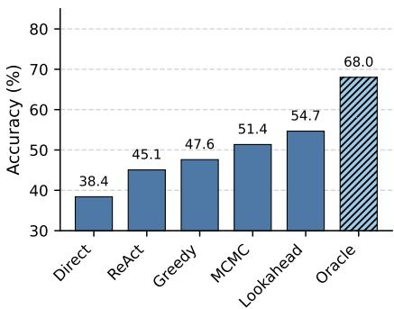
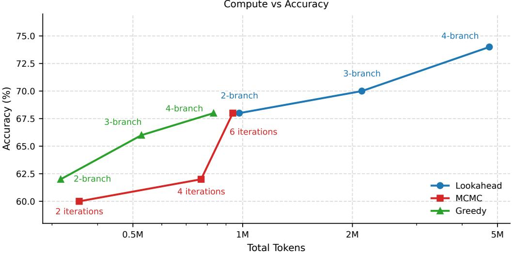

[← 返回 README](../README.md)

# 5. Experiments: The Tool-Integrated Agent

## 一、Preview

本节在 4 个高分辨率 benchmark 上验证 FOVEA，设置包括：(1) 多 benchmark 主结果对比 (Sec 5.1)；(2) 遥感搜索场景下的策略消融和 oracle gap 分析 (Sec 5.2)；(3) compute-accuracy scaling 曲线分析 (Sec 5.3)。

---

## 二、原始文本

We instantiate the S-BOED framework with FOVEA, a plugin inference-time module that intercepts the VLM's crop commands and refines them before tool execution. This refinement is essential because external vision experts (e.g., OCR, Detection, and Segmentation) are equally subject to the perceptual bandwidth bottleneck. Without highresolution inputs, these tools struggle to resolve dense or minute features in down-sampled global views (Akyon et al., 2022; Singh et al., 2019). Consequently, the cropping operation serves as a fundamental bridge to deliver high-fidelity signals to both the reasoning VLM and downstream tools. FOVEA optimises this critical interface by refining the crop's spatial parameters to maximise its informative utility.

> 💡 **Cropping 作为关键接口**: crop 操作不仅是 VLM 感知的 bottleneck，也是下游工具（OCR、Detection、Segmentation）的 bottleneck。全局下采样视图喂给 Detection 模型同样会导致小目标不可检测。因此 FOVEA 通过优化 crop 的空间参数，同时为 VLM 推理和下游工具提供高保真信号——这是一个"一石二鸟"的效果。

Benchmarks. We assess FOVEA on four benchmarks: HR-Bench (Team, 2024), MME-RealWorld-Lite (Zhang et al., 2024), V\*Bench (Wu & Xie, 2023), and CV-Bench (Tong et al., 2024). These datasets cover fine-grained recognition, small-object search, and 3D reasoning, all of which require high-fidelity local information.

> 💡 **Benchmark 覆盖的任务维度**:
> - **MME-RealWorld-Lite**: 真实世界复杂场景，包含 remote sensing（遥感）、OCR、细粒度识别
> - **CV-Bench**: 3D 空间推理和跨视角理解
> - **V\*Bench**: 引导式视觉搜索（guided visual search），需要精确的空间定位
> - **HR-Bench**: 4K/8K 高分辨率图像上的细粒度识别

Baselines. We compare FOVEA against three groups of baselines. Proprietary models such as GPT-5 and Gemini 2.5 Flash establish the performance frontier, while Thyme (Zhang et al., 2025b) represents SOTA RL-based methods. Qwen3-VL-30B-A3B-Instruct serves as our controlled foundation model (Direct). The ReAct agent uses the same backbone and tool interface, but directly executes the VLM-proposed crop commands without S-BOED-guided refinement.

> 💡 **Baseline 设计的三层对比**:
> 1. **Proprietary frontier**: GPT-5, Gemini 2.5 Flash —— 展示多模态能力的上限
> 2. **Prior visual agents**: Thyme (RL-based), RAP (Retrieval-Augmented Perception) —— 展示现有主动感知方法的水平
> 3. **Controlled comparisons**: Direct（纯 passive encoding）和 ReAct（heuristic tool use）—— 用于隔离 FOVEA 的 S-BOED refinement 贡献

Implementation Details. Our primary results in Table 1 use the efficient greedy instantiation of FOVEA. For each initial crop proposal $d_{seed}$, we generate two local perturbations, yielding a threecandidate pool {$d_{seed}$, $d_{small}$, $d_{large}$}, and perform K = 3 stochastic probes per candidate to estimate Î(d). The final action d*_t is selected greedily (Algorithm 1).

> 💡 **Greedy 配置**: 候选池 = {seed (1.0x), large (1.5x, coverage), small (0.8x, resolution)} × 3 probes each = 9 次 VLM 调用。这种精简配置使得主实验可以在全量 benchmark 上保持计算可行性，而更昂贵的 MCMC/Lookahead 策略保留给 challenging subsets。

---

### 5.1. Main Results

Table 1. Main results on multimodal benchmarks. FOVEA is compared with proprietary models, prior visual agents, and controlled direct/ReAct baselines under matched backbone settings where applicable. Bold indicates the best result within each comparison block.

| Method | Backbone | MME-RealW | CV-Bench | V* | HR-Bench (4K) | HR-Bench (8K) | Mean |
|--------|----------|-----------|----------|------|---------------|---------------|------|
| **State-of-the-Art & Prior Agents** |
| Thyme | Qwen-2.5-VL-7B | 55.2% | 78.4% | 82.2% | 77.0% | 72.0% | 73.0% |
| GPT-5 | Proprietary | 55.0% | 84.9% | 77.0% | 78.1% | 75.5% | 74.1% |
| Gemini 2.5 Flash | Proprietary | 58.5% | 87.3% | 80.1% | 83.4% | 80.9% | 78.0% |
| **Controlled Comparison (30B Backbone)** |
| Direct | Qwen3-VL-30B-A3B | 48.2% | 81.2% | 81.2% | 80.0% | 75.9% | 73.3% |
| ReAct Agent | Qwen3-VL-30B-A3B | 51.1% | 81.3% | 83.8% | 80.8% | 78.3% | 75.1% |
| RAP (Wang et al., 2025) | Qwen3-VL-30B-A3B | 40.8% | 72.2% | 86.4% | 79.6% | 80.6% | 71.9% |
| **FOVEA (ours)** | **Qwen3-VL-30B-A3B** | **54.6%** | **84.8%** | **85.3%** | **84.5%** | **79.2%** | **77.7%** |
| **Controlled Comparison (8B Backbone)** |
| Direct | Qwen3-VL-8B | 47.6% | 84.5% | 76.9% | 74.5% | 70.9% | 70.9% |
| ReAct Agent | Qwen3-VL-8B | 48.1% | 83.9% | 78.8% | 77.7% | 73.8% | 72.5% |
| **FOVEA (ours)** | **Qwen3-VL-8B** | **49.9%** | **84.7%** | **83.6%** | **80.9%** | **75.4%** | **74.9%** |

> 💡 **主结果解读 — 五个关键观察**:

> 1. **FOVEA vs ReAct (30B)**: Mean 77.7% vs 75.1% (+2.6pp)。FOVEA 的 S-BOED crop refinement 在 ReAct 启发式工具使用之上带来一致提升。
>
> 2. **FOVEA vs Direct (30B)**: Mean 77.7% vs 73.3% (+4.4pp)。主动 evidence acquisition 比 passive encoding 提升显著。
>
> 3. **FOVEA vs Gemini 2.5 Flash**: 77.7% vs 78.0% —— 几乎持平！用开源 30B 模型 + training-free inference-time refinement 就接近了闭源前沿模型，说明更好的 evidence acquisition 可以弥补模型规模差距。
>
> 4. **跨 backbone 泛化 (8B)**: 74.9% vs 70.9%/72.5% —— 800B 规模的模型上同样有效，说明策略不依赖特定 backbone 规模。
>
> 5. **MME-RealWorld-Lite 上 FOVEA vs RAP**: 54.6% vs 40.8% —— RAP 的 retrieval-augmented perception 策略在该任务上甚至低于 Direct baseline，表明简单的检索增强可能不适合需要精细 spatial reasoning 的场景。

> 💡 **RAP 为什么在 MME-RealWorld 上表现最差？** RAP (Retrieval-Augmented Perception) 通过检索外部视觉知识来增强感知，但在真实世界遥感图像中，检索到的可能是不相关的 distractor regions，反而引入噪声。而 FOVEA 的 resolvability probing 直接验证每个 crop 是否包含 query-relevant evidence，更精准。

---

### 5.2. Strategy Efficacy in the Gigapixel Regime

*Figure 3: Search efficacy in the gigapixel regime. We compare Direct, ReAct, and FOVEA variants on the Remote Sensing subset against an oracle-crop baseline. FOVEA-Lookahead yields the largest gain, while the remaining oracle gap reflects residual backbone recognition and reasoning errors.*

To isolate the contribution of our search strategy from the VLM's semantic reasoning capabilities, we conduct a focused ablation on the Remote Sensing subset of MME-RealWorld-lite (Zhang et al., 2024). This setting is searchdominated: images are extremely large, targets are sparse, and task-relevant regions are often nearly invisible in the downsampled global view. We compare Direct, ReAct, and FOVEA variants against an oracle-crop baseline, where the VLM is given a human-annotated crop.

> 💡 **遥感场景为什么是理想的测试场？**
> - 图像极大（gigapixel 级）→ perceptual bandwidth bottleneck 极端严重
> - 目标稀疏（图像中可能只有 1-2 个 task-relevant 区域）→ 搜索策略至关重要
> - 全局下采样视图中目标几乎不可见 → "cold start" 问题最突出
> - Oracle crop 用于解耦搜索失败和识别失败

Analysis. As visualised in Figure 3, ReAct improves over the base model by enabling active tool use, but remains limited by noisy crop proposals. FOVEA-Greedy and FOVEA-MCMC further improve accuracy by refining local foveations, while FOVEA-Lookahead reaches 54.7%, compared with 45.1% for ReAct. The remaining gap to the oracle-crop baseline shows that evidence acquisition and backbone recognition are distinct bottlenecks: even with task-relevant crops, the VLM can still misrecognise or misreaso.

> 💡 **Figure 3 的数据阶梯**:

> | 方法 | 准确率 | 差距分析 |
> |------|--------|---------|
> | Direct (passive) | ~40% | Baseline, 无主动搜索 |
> | ReAct (heuristic) | 45.1% | 有主动搜索，但 crop 是启发式的 |
> | FOVEA-Greedy | 47.6% | 简单局部精炼 |
> | FOVEA-MCMC | 51.4% | 更精细的局部搜索 |
> | **FOVEA-Lookahead** | **54.7%** | 一步前瞻规划，最大提升 |
> | Oracle (human crop) | 68.0% | 搜索瓶颈解除后的上限 |

> **三层 gap 分解**:
> - **Search gap** (ReAct → FOVEA-Lookahead): ~9.6pp —— S-BOED 搜索策略带来的提升
> - **Oracle gap** (FOVEA-Lookahead → Oracle): ~13.3pp —— 搜索策略仍有提升空间（如 cold start）
> - **Recognition gap** (Oracle → 100%): ~32pp —— backbone VLM 的固有 reasoning 能力上限

---

### 5.3. Compute–Accuracy Scaling of Search Strategies

*Figure 4: Accuracy–compute scaling of FOVEA variants on a 50-example remote-sensing subset. We vary the search budget within each policy family and report accuracy against average total tokens per question.*

The previous section compares search strategies at a fixed budget on the full 150-question Remote Sensing set. To assess each strategy's scaling potential, we also vary the search budget within each policy family on a 50-example subset and plot accuracy versus average tokens per question (Figure 4). For FOVEA-Greedy, the budget is the number of sampled branches; for FOVEA-MCMC, the number of refinement iterations; and for FOVEA-Lookahead, the number of search branches.

> 💡 **Compute-Accuracy 曲线解读**:

> 三个关键观察：
> 1. **Monotonic improvement**: 每个策略家族内部，更高的搜索预算 → 更高的准确率（单调提升）
> 2. **Diminishing returns**: 增益不是线性的——预算加倍不会带来加倍的准确率
> 3. **策略排序**: Lookahead > MCMC > Greedy，但 cost 也是 Lookahead > MCMC > Greedy
>
> 这验证了一个重要观点：**主动感知 (active perception) 提供了推理时 scaling 的补充维度**——额外的计算不仅可以花在生成更长的文本推理链上，还可以花在获取更高价值的视觉证据上。

Analysis. The trend is monotonic within each family: a higher search budget yields higher accuracy, but at increasing token cost. This indicates that FOVEA should be viewed as a family of compute–accuracy operating points rather than a single fixed policy. Lower-budget variants such as FOVEA-Greedy provide cheaper moderate gains and are suitable when latency is constrained, while higher-budget FOVEA-Lookahead yields larger improvements in searchdominated settings where additional search budget translates into meaningful gains.

This suggests that active perception provides a complementary axis of inference-time scaling: additional compute can be spent on acquiring higher-value visual evidence, not only on generating longer textual reasoning traces.

> 💡 **Inference-time scaling 的两种维度**:

> | 维度 | 传统方法 | FOVEA (本文) |
> |------|---------|-------------|
> | 计算花在哪里 | 生成更长的 reasoning traces (CoT) | 采集更多/更好的视觉证据 |
> | 典型方法 | Best-of-N, tree search, 更长 CoT | 更多 probing, MCMC iterations, lookahead branches |
> | 适用场景 | 推理密集型 | 感知/搜索密集型 |
> | 核心 bottleneck | 语义推理能力 | 感知带宽 |

> 一个有趣的观点是：当任务的核心困难是"找不到目标"而非"不理解目标"，增加文本推理步数帮助有限，增加视觉搜索预算才是更有效的 scaling 方向。

Table 5 (Appendix D.5). Inference cost of search strategies compared to ReAct:

| Search Policy | Accuracy (%) | Accuracy Gain | Avg. Input Tokens / Query | Avg. Output Tokens / Query |
|--------------|-------------|---------------|--------------------------|---------------------------|
| ReAct (Baseline) | 45.1 | - | 46.5k (1x) | 0.3k (1x) |
| FOVEA-Greedy | 47.6 | +5.54% | 301.9k (6.5x) | 3.1k (9.8x) |
| FOVEA-MCMC | 51.4 | +13.97% | 359.3k (7.7x) | 4.0k (12.5x) |
| FOVEA-Lookahead | 54.7 | +21.29% | 441.4k (9.5x) | 17.5k (55.2x) |

> 💡 **成本-收益分析的实践指导**:
> - **FOVEA-Greedy**: 6.5x input tokens cost → +5.5% accuracy。适合 latency 敏感场景。
> - **FOVEA-MCMC**: 7.7x input → +14% accuracy。中等预算下的 sweet spot。
> - **FOVEA-Lookahead**: 9.5x input + 55x output (因模拟未来轨迹) → +21% accuracy。搜索密集型场景的 premium option。
>
> 注意 output tokens 在 Lookahead 中爆炸 (55x)，因为需要生成完整的假设性未来推理轨迹。input tokens 增长相对温和，主要由更多 crop 图像的编码产生。

---

## 三、Summary

- **多 Benchmark 主结果**: FOVEA (30B) mean 77.7%，超过 ReAct (+2.6pp) 和 Direct (+4.4pp)，与 Gemini 2.5 Flash (78.0%) 几乎持平。
- **跨 Backbone 泛化**: 在 8B 模型上也一致有效 (74.9% vs 70.9%/72.5%)。
- **遥感搜索**: FOVEA-Lookahead 达 54.7% vs ReAct 45.1% (+9.6pp)，但仍有 Oracle gap (68.0%) 表明搜索和识别是独立瓶颈。
- **Compute-Accuracy Scaling**: 主动感知提供了推理时 scaling 的补充维度——用更多 compute 获取更好的视觉证据。
- **关键发现**: 更好的 evidence acquisition 可以弥补 model scale 的差距（30B + FOVEA ≈ proprietary frontier）；active perception 的 compute-accuracy trade-off 是策略家族而非单一操作点。
