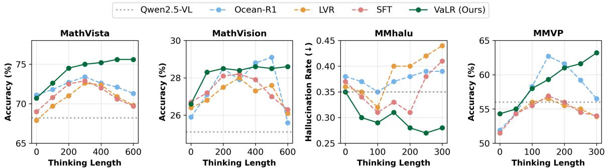

[← 返回 README](../README.md)

# Abstract & Figure 1

## 一、论文信息速览

| 项目 | 内容 |
|------|------|
| **标题** | Vision-aligned Latent Reasoning for Multi-modal Large Language Model |
| **作者** | Byungwoo Jeon1, Yoonwoo Jeong2, Hyunseok Lee1, Minsu Cho2,3,*, Jinwoo Shin1,3,* |
| **单位** | 1KAIST, 2POSTECH, 3KRAFTON |
| **发表** | arXiv 2026 |
| **代码** | Available at project page |

---

## 二、原始文本

Abstract:

Despite recent advancements in Multi-modal Large Language Models (MLLMs) on diverse understanding tasks, these models struggle to solve problems which require extensive multistep reasoning. This is primarily due to the progressive dilution of visual information during long-context generation, which hinders their ability to fully exploit test-time scaling. To address this issue, we introduce Vision-aligned Latent Reasoning (VaLR), a simple, yet effective reasoning framework that dynamically generates vision-aligned latent tokens before each Chain-of-Thought reasoning step, guiding the model to reason based on perceptual cues in the latent space. Specifically, VaLR is trained to preserve visual knowledge during reasoning by aligning intermediate embeddings of MLLM with those from vision encoders. Empirical results demonstrate that VaLR consistently outperforms existing approaches across a wide range of benchmarks requiring long-context understanding or precise visual perception, while exhibiting test-time scaling behavior not observed in prior MLLMs. In particular, VaLR improves the performance significantly from 33.0% to 52.9% on VSI-Bench, achieving a 19.9%p gain over Qwen2.5-VL. Code is available at project page.

> 💡 **一句话概括**: VaLR 通过在每步 Chain-of-Thought 推理前动态生成与视觉编码器对齐的 latent tokens，解决了 MLLM 在长上下文生成中视觉信息逐渐稀释的问题，首次在 MLLM 上实现了 test-time scaling 行为，在 VSI-Bench 上取得 19.9%p 的巨大提升。

---

*Figure 1: Overview of VaLR. Our framework, VaLR, generates vision-aligned latent tokens and language tokens throughout reasoning process. (a) During latent token generation, the last hidden states of MLLM becomes input embedding for the next token prediction. (b) To train the latent token generation, we align the intermediate features of MLLM with pre-trained visual representation extracted from external vision encoders. Note that we do not use the external vision encoder at test-time.*

> 💡 **Figure 1 批读**: 这张图展示了 VaLR 的核心框架设计。图 (a) 展示了推理过程的两种模式交替：在 latent mode 中，模型使用前一步的 hidden state（而非 token embedding）作为下一步的输入，以潜空间"思维"替代显式文本；图 (b) 展示了训练时的 REPA（Representation Alignment）机制：MLLM 中间层的 hidden states 通过 MLP 投影后，与外部视觉编码器（DINO/SigLIP/CLIP 等）的 patch 级特征进行余弦相似度对齐，但关键在推理时完全不需要外部编码器。核心洞察是：**latent tokens 充当"视觉检查点"，在每个推理步之前回顾视觉信息，防止长链推理中视觉信号的衰减**。

> 💡 **问题动机**: MLLM 当前面临的核心矛盾：LLM 的 CoT 推理已证明 test-time scaling law（更长推理 = 更好性能），但 MLLM 因为视觉信号在长序列生成中逐渐衰减，反而在更长推理时性能下降。本文的核心洞察是：**静态的初始视觉特征不足以支撑长链推理，需要在每个推理阶段动态重新注入视觉信息**。

---

*Figure 2: Reasoning length-wise analysis. We investigate the effect of reasoning length on model performance across different MLLMs. We report hallucination rate on MMhalu benchmark and accuracy (%) on MathVista, MathVision, and MMVP benchmark. For MMhalu, lower is better. We observe that VaLR is the only method that exhibits consistent performance improvements as reasoning length increases, while remaining robust on long-horizon tasks.*

> 💡 **Figure 2 批读**: 这是本文最关键的实验证据。在 4 个 benchmark 上，所有 baseline 方法（包括 Ocean-R1 这样的强化推理模型和 LVR 这样的潜推理方法）都在中等推理长度时达到峰值后性能下降，唯独 VaLR 随推理长度单调提升。MMVP 上最明显：Ocean-R1 从 62.7% 暴跌至 56.5%（@300 tokens），而 VaLR 持续提升。这个证据直接验证了论文的核心论证：**只有动态注入视觉信息的推理，才能真正实现 test-time scaling**。

---

## 三、Summary

- **核心问题**: MLLM 在长上下文推理中视觉信号逐渐衰减，无法从 test-time scaling 中受益。
- **核心假设**: 在每步推理前动态生成视觉对齐的 latent tokens，作为"视觉检查点"保持视觉信息。
- **核心方案**: VaLR = Latent Reasoning（潜空间交替推理）+ REPA（表征对齐）+ 两阶段课程学习。
- **核心优势**: (1) 首个 MLLM test-time scaling；(2) 推理时零额外开销（训练用编码器，推理不需要）；(3) VSI-Bench +19.9%p 巨大提升；(4) 编码器无关，可与多种视觉编码器配合。
