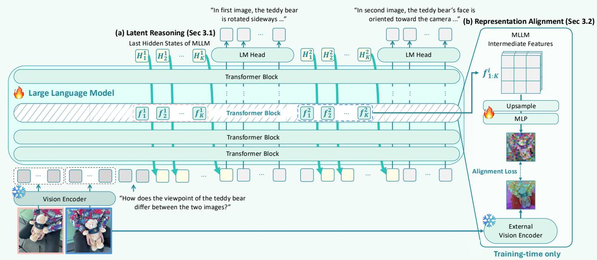

[← 返回 README](../README.md)

# 3. Vision-aligned Latent Reasoning

## 一、Preview

本章是论文的核心技术章节，分三个子节：(3.1) 形式化 MLLM 中的潜推理机制（latent mode 和 language mode 的交替）；(3.2) 引入 Representation Alignment (REPA) 将 latent tokens 与视觉编码器特征对齐，并扩展到多编码器对齐；(3.3) 描述两阶段课程学习训练流程。整体设计思路清晰：**形式化框架 → 对齐目标 → 训练策略**，三层递进。

---

## 二、原始文本

We propose VaLR, an approach that aligns latent reasoning tokens with visual features to prevent visual signal decay, thereby enabling effective test-time scaling in MLLMs.

*Figure 1: Overview of VaLR.*

In Section 3.1, we first revisit the concept of latent reasoning in MLLMs. Then, in Section 3.2, we discuss how multimodal reasoning can be enhanced through representation alignment between MLLMs and vision encoders. Finally, Section 3.3 presents VaLR, a two-stage supervised finetuning (SFT) pipeline designed to gradually equip MLLMs with latent multi-modal reasoning capabilities. The overall pipeline of VaLR is illustrated in Figure 1.

### 3.1. Latent Reasoning in MLLMs

Formally, given an input text sequence **x** = (x₁, ..., $x_{T}$) and images I, we formulate the task as generating a corresponding text response. During inference with latent reasoning, the model iteratively switches between two distinct modes: latent and language. In detail, in the latent mode, the model produces latent reasoning tokens that are not directly shown as text, while in the language mode, it generates the response with text tokens.

Specifically, the native vision encoder first extracts image tokens from images I, i.e., **v** = (v₁, v₂, ..., $v_{S}$) = ViT(I). Subsequently, the transformer decoder processes input text-token embeddings, $E_{T}$ = [v₁, ..., $v_{S}$, e(x₁), ..., e($x_{T}$)], to yield the last hidden state $H_{T}$ = Transformer($E_{T}$), where e is the token embedding function. During inference, the model enters the latent mode by predicting a special token `<latent>` and reverts to the language mode by predicting another special token `</latent>`. In the latent mode, the model leverages the previous hidden state, $h_{t}$ = $H_{t}$[t, :], as input for the next prediction, whereas in the language mode, the model uses the token embedding, e($x_{{t+1}}$), as input for the next prediction, as formulated below:

$E_{t+1} = \begin{cases}
[$E_{t}$; $h_{t}$] & \text{if latent mode}, \\
[$E_{t}$; e($x_{{t+1}}$)] & \text{if language mode},
\end{cases}$

$H_{t+1} = \text{Transformer}(E_{t+1}),$

where t > T. This recursive process repeats until the model predicts the `<EOS>` token. Upon entering the latent mode, the model is constrained to remain in this state for a fixed number K of steps. After K latent steps, the model reverts to the language mode and resumes generating text tokens from the current hidden state $h_{t}$, using the language model head, LM-Head:

$M(x_t | v, x_{\lt t}) = \text{LM-Head}(h_t),$

where $M$ denotes the standard MLLM. This alternation strategy allows MLLMs to broaden its reasoning capability without explicit linguistic reasoning steps.

> 💡 **机制拆解 — Latent Mode vs Language Mode**:
>
> | 属性 | Latent Mode | Language Mode |
> |------|------------|---------------|
> | 触发 token | `<latent>` | `</latent>` |
> | 输入来源 | 前一步 hidden state $h_t$ | token embedding e($x_{t+1}$) |
> | 输出内容 | 连续潜向量（不可读） | 离散文本 token |
> | 固定步数 | K=16 步（固定） | 不固定 |
> | 功能 | 在潜空间中保持视觉信息 | 生成可读的推理文本 |
>
> 关键设计细节：latent mode 中的输入是 **hidden state 而非 token embedding**。这意味着模型在潜空间中"思考"时，使用的是自身内部表征的连续向量，而非离散符号。这种设计的优势是：(1) 连续向量可以编码比离散 token 更丰富的信息；(2) 不需要将视觉信息压缩到离散 token 中。

> 💡 **与语言模型 COCONUT 的继承与差异**:
> - 继承：latent/language mode 交替的基本框架（如 Hao et al., 2024b / COCONUT）
> - 关键差异：VaLR 在 latent mode 中不追求"更高效的推理"，而是追求 **"保持视觉信息"**。COCONUT 的 latent tokens 是无监督的（仅通过 CE loss 训练），VaLR 的 latent tokens 有显式的视觉对齐监督（REPA loss）。

### 3.2. Latent Reasoning with Representation Alignment

To effectively leverage latent reasoning for visual grounding, we align hidden states of MLLM with visual features from pre-trained vision encoders during the latent mode. This alignment encourages the MLLM to maintain visual information throughout the recurrent reasoning process.

**Alignment objective.** For each reasoning stage i, we first select an image I⁽ⁱ⁾ ∈ I (details in Appendix B). We then extract patch-wise visual features from pre-trained vision encoder, φ, i.e., **F**\_φ⁽ⁱ⁾ = φ(I⁽ⁱ⁾) ∈ ℝ^{P×D}, where P is the number of patches and D is the feature dimension. Afterward, we extract features from the intermediate layer of MLLM, i.e., **F**\_MLLM⁽ⁱ⁾ = [f₁⁽ⁱ⁾, ..., $f_{K}$⁽ⁱ⁾]. We project these intermediate features through a learnable MLP ψ to match the dimension of vision encoder features:

$\hat{F}_{MLLM}^{(i)} = \psi(\text{Upsample}(F_{MLLM}^{(i)})) \in R^{P \times D},$

where the 'Upsample' denotes an operation that aligns the image feature resolution of the MLLM with that of the pre-trained vision encoder. The representation alignment loss, i.e., $L_{REPA}$, encourages these projected latent features to align with the visual features using patch-wise cosine similarity throughout all latent reasoning stages:

$L_{REPA} := -\frac{1}{NP} \sum_{i=1}^{N} \sum_{p=1}^{P} \text{sim}(\hat{F}_{MLLM}^{(i)}[p, :], F_{\phi}^{(i)}[p, :]),$

where sim(·,·) denotes the conventional cosine similarity function. By aligning with visual features, each latent token learns to encode visual information inherent in the image, thereby enabling comprehensive visual reasoning. Note that the alignment is applied only during training, while at inference time the model performs latent mode reasoning without REPA supervision, relying on learned visual grounding.

> 💡 **机制拆解 — REPA 对齐的四个关键操作**:
> 1. **目标编码器特征提取**: φ(I⁽ⁱ⁾) → F_φ⁽ⁱ⁾ ∈ ℝ^{P×D}（冻结的视觉编码器，无需梯度）
> 2. **MLLM 中间层特征提取**: 从指定层（第 12 层，实验证明最优）提取 K=16 个 latent tokens 的 hidden states → $F_{MLLM}$⁽ⁱ⁾
> 3. **维度对齐**: Upsample（匹配 patch 分辨率）+ MLP ψ（匹配特征维度 D）→ F̂_MLLM⁽ⁱ⁾
> 4. **Patch-wise Cosine Similarity**: 对每个 patch 位置计算余弦相似度，取负均值作为 loss
>
> 设计的精巧之处：REPA 是 **patch-wise** 的（而非 image-level），这意味着每个 latent token 可以学习对应图像不同空间位置的视觉信息。16 个 latent tokens 可以通过 MLP + Upsample 映射到与视觉编码器相同数量的 patch 上。

> 💡 **训练/推理不对称设计**: 这是 VaLR 效率优势的来源。训练时用 REPA loss 进行视觉对齐监督，推理时完全不需要外部视觉编码器——MLLM 学会了在 latent tokens 中内化视觉表征。这类似于知识蒸馏但方向相反：不是从大模型到小模型，而是从视觉编码器到 MLLM 的潜空间。

**Multi-encoder Alignment.** While alignment with a single vision encoder provides a robust visual foundation, we observe that leveraging multiple vision encoders enables the model to capture complementary visual representations. For instance, CLIP (Radford et al., 2021) and SigLIP (Tschannen et al., 2025) excel at semantic understanding, DINO (Oquab et al., 2023; Simeoni et al., 2025) capture fine-grained appearance and spatial relationships, and π³ (Wang et al., 2025d) encode 3D spatial structure. To leverage these complementary strengths, we extend our framework to incorporate multiple vision encoders simultaneously.

Let {φ₁, ..., $φ_{M}$} denotes a set of M frozen vision encoders. We extract features from each vision encoder for each reasoning stage i:

$F_{\phi_m}^{(i)} = \phi_m(I^{(i)}) \in R^{P_m \times D_m} \quad \text{for } m = 1, \cdots, M,$

where $P_{m}$ and $D_{m}$ denote the varying number of patches and feature dimension across different vision encoders, respectively. For each vision encoder, we employ a separate learnable projection head $ψ_{m}$ to match its feature dimension. The multi-encoder alignment loss is computed as the average of individual REPA losses:

$L_{REPA}^{multi} := \frac{1}{M} \sum_{m=1}^{M} L_{REPA}^{(m)},$

where each $L_{REPA}^{(m)}$ follows the same formulation as the single-encoder case but uses features from the m-th vision encoder, $φ_{m}$, and its corresponding projection head $ψ_{m}$. This multi-encoder approach allows the model to distill diverse visual knowledge into its latent reasoning space, enhancing both spatial awareness and general visual understanding.

> 💡 **多编码器协同设计分析**:
>
> | 编码器 | 表征特性 | 实验贡献 |
> |--------|---------|---------|
> | DINOv3 | 细粒度外观、空间关系 | 通用视觉理解提升（Table 5 中单编码器最佳） |
> | SigLIPv2 | 语义理解、多语言 | 语义层面的理解增强 |
> | π³ | 3D 空间结构 | VSI-Bench 3D 空间推理大幅提升（Table 4） |
> | Qwen Encoder | MLLM 原生视觉表征 | 兼容性验证（Table 3, Table 9） |
>
> 关键发现：多编码器组合的效果 **不是简单的叠加**，而是**互补协同**。π³ + DINOv3 的组合（52.4%）几乎接近全部三种编码器组合（52.9%），说明 π³ 提供了 DINOv3 缺乏的 3D 几何信息。

### 3.3. Training Pipeline

We adopt a two-stage curriculum learning strategy to progressively foster latent reasoning in MLLMs. In the first stage, we perform standard supervised fine-tuning (SFT) on Chain-of-Thought (CoT) visual question-answering (VQA) datasets to establish foundational multi-modal reasoning capabilities. Subsequently, in the second stage, we decompose the reasoning into step-by-step phases and interleave latent reasoning tokens, allowing the model to reaso within the latent representations. Crucially, we employ representation alignment (REPA) to align the intermediate hidden states of the MLLM with features extracted from vision encoders such as DINO (Oquab et al., 2023; Simeoni et al., 2025), CLIP (Radford et al., 2021), or SigLIP (Tschannen et al., 2025). This alignment empowers MLLMs to retain visual information required for reasoning, thereby enabling robust long-context reasoning.

**Stage 1: Standard SFT on CoT datasets.** We perform standard SFT on pre-trained MLLMs using 450K samples from existing CoT datasets, endowing MLLMs with language-based reasoning capabilities. Concretely, given a training sample with an input image set I, a question q, and ground-truth language CoT reasoning **y** = [r¹, r², ..., r^N, a] where rⁱ represents the i-th reasoning step and a is the final answer, we optimize the model using the standard autoregressive language modeling objective:

$L_{CE} := -E_{(I, q, y)} \left[ \sum_{t} \log M(y_t | v, q, y_{\lt t}) \right],$

where $y_{t}$ denotes the t-th token in the reasoning sequence. This stage establishes the fundamental ability to decompose complex visual questions into intermediate linguistic reasoning steps. During this stage, we only train the decoder of MLLM while freezing the native vision encoder.

> 💡 **Stage 1 设计考量**: 为什么需要先做标准 SFT？直觉上，对于一个 base MLLM（Qwen2.5-VL），它可能还不具备将复杂视觉问题分解为多步推理的能力。直接跳到 Stage 2（latent + REPA）的话，模型既要学推理分解，又要学潜空间对齐，任务过于困难。Stage 1 先建立"语言推理能力"这个基础，Stage 2 再叠加"潜空间视觉对齐"。

**Stage 2: Latent token training with REPA.** Building on the standard CoT reasoning capabilities established in Stage 1, we introduce latent reasoning supervised by vision encoders in this stage. We first tailor existing CoT datasets for latent reasoning and then train the model on the tailored datasets using representation alignment (REPA) (Yu et al., 2025).

Specifically, each sample from existing CoT datasets consists of visual information v, a question q conditioned on visual input, a sequence of intermediate reasoning steps {r⁽ⁱ⁾}ᴺ_{i=1}, where N denotes the number of reasoning steps, and the corresponding answer a, i.e.,

$v, q \to (r^{(i)})_{i=1}^{N} \to a.$

To adapt these datasets for latent reasoning, we insert K latent tokens, {ℓ\_k⁽ⁱ⁾}^$K_{{k=1}}$, before each language reasoning step r⁽ⁱ⁾. To inform the model when the latent mode should be initialized or terminated, we set the first and last tokens of each latent segment to special control tokens, i.e., ℓ\_1⁽ⁱ⁾ = `<latent>` and ℓ\_K⁽ⁱ⁾ = `</latent>`. This transformation yields a latent-augmented reasoning sequence, which can be expressed as follows:

$v, q \to (\ell_{[1:K]}^{(i)}, r^{(i)})_{i=1}^{N} \to a.$

In this stage, we extend the Stage 1 training objective with a REPA loss, i.e., $L := L_{CE} + \lambda L_{REPA}$. When we use multiple encoders for training, we apply the multi-REPA loss instead of the single-REPA loss, i.e., $L := L_{CE} + \lambda L_{REPA}^{multi}$. We freeze the vision encoder and train only the MLLM decoder. Remark that the REPA loss ensures that the hidden states remain grounded in visual information.

> 💡 **Stage 2 数据构造策略**:
> - 对每个推理步 r⁽ⁱ⁾，在其前面插入 K=16 个 latent tokens
> - 用 `<latent>` 和 `</latent>` 特殊 token 标记 latent mode 的边界
> - 对于多视图数据，用 GPT-4o 为每个推理步匹配最相关的目标图像（详见 Appendix B）
> - 对于交错数据（interleaved），在交错图像出现的位置初始化 latent mode
>
> 总损失 $L = L_{CE} + \lambda L_{REPA}$ 中的 λ=0.5 是最优值（Table 11），说明**语言语义保持（CE）和视觉对齐（REPA）需要均衡**——过大的 λ 会破坏语言生成质量。

> 💡 **训练效率**: Stage 2 中只训练 MLLM decoder + MLP ψ，冻结视觉编码器（原生 + 外部）。450K 数据，4×A100，1 epoch，每 GPU batch size 2，gradient accumulation 16。Stage 2 的学习率（2e-6）明显低于 Stage 1（1e-5），避免破坏 Stage 1 学到的推理能力。

---

## 三、Summary

- **Latent Reasoning 形式化**: 通过 `<latent>` / `</latent>` 特殊 token 控制 latent/language mode 交替，latent mode 中用 hidden state 而非 token embedding 作为输入。
- **REPA 对齐**: 将 MLLM 中间层 hidden states（经 Upsample + MLP 投影）与视觉编码器 patch 特征进行余弦相似度对齐，patch-wise 粒度。
- **多编码器**: 独立 MLP 投影头匹配不同编码器维度，平均各编码器的 REPA loss。DINOv3 + SigLIPv2 + π³ 组合最佳。
- **两阶段训练**: Stage 1 建立文本推理基础（CE only），Stage 2 引入 latent tokens + REPA（CE + λ×REPA，λ=0.5）。
- **推理时零开销**: 外部编码器仅训练时使用，推理时 MLLM 独立完成 latent mode 推理。
