# Multimodal Latent Reasoing via Hierarchical Visual Cues Injection

Yiming Zhang <sup>1</sup> Qiangyu Yan <sup>2</sup> Borui Jiang <sup>2</sup> Kai Han <sup>2</sup>

## Abstract

The advancement of multimodal large language models (MLLMs) has enabled impressive perception capabilities. However, their reasoing process often remains a “fast thinking” paradigm, reliant on end-to-end generation or explicit, language-centric chains of thought (CoT), which can be inefficient, verbose, and prone to hallucination. This work posits that robust reasoing should evolve within a latent space, integrating multimodal signals seamlessly. We propose multimodal latent reasoing via HIerarchical Visual cuEs injection (HIVE), a novel framework that instills deliberate, “slow thinking” without depending on superficial textual rationales. Our method recursively extends transformer blocks, creating an internal loop for iterative reasoing refinement. It further injects hierarchical visual cues, from global scene context to fine-grained regional details, into the model’s latent representations, showing that this strategy remains effective in a loop-transformer reasoing framework. This enables the model to perform grounded, multistep inference entirely in the aligned latent space. Extensive evaluations demonstrate that test-time scaling remains effective when incorporating vision knowledge, and that hierarchical visual cue injection can be effectively integrated into the loop-transformer framework for improved understanding of complex scenes.

## 1. Introduction

The rapid evolution of large-scale pre-trained models (Brown et al., 2020; Kaplan et al., 2020) has fundamentally transformed the landscape of artificial intelligence. Beginning with breakthroughs in natural language processing, models such as GPT-3 (Brown et al., 2020) demonstrated unprecedented capabilities in understanding and generating human-like text. This progress soon expanded into the multimodal domain, where systems like GPT-4 (OpenAI, 2023) and Qwen-VL (Wang et al., 2024b) have set new benchmarks by integrating and aligning information across vision, language, and beyond. These Multimodal Large Language Models (MLLMs) (OpenAI, 2023; Liu et al., 2023d) excel in multimodal tasks such as visual question answering, image captioning, and cross-modal retrieval. Their success marks a paradigm shift from unimodal intelligence toward more holistic, human-like understanding, enabling richer interactions and more robust applications in real-world scenarios.

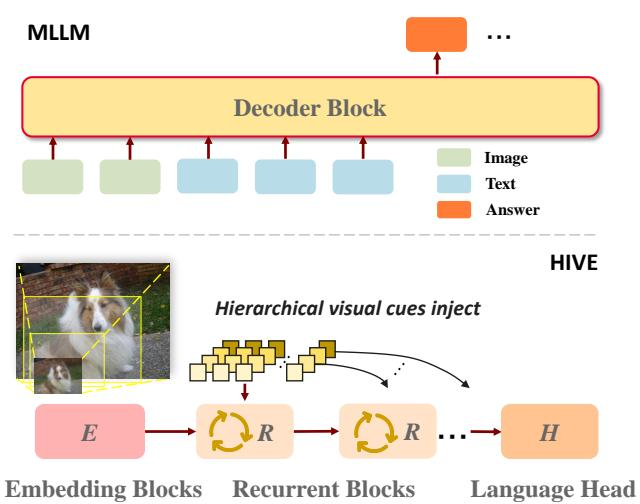  
Figure 1. Visualization of traditional MLLMs, visual features extracted from a vision tower are projected into the language space and directly concatenated with text tokens. This combined sequence is then fed into a stack of transformer decoder blocks. HIVE is built upon Huginn, a recursive architecture that iteratively processes token representations through a unified set of layers to enhance feature depth. We have extended this by incorporating the visual modality and, for the first time, introducing hierarchical visual information into latent space reasoing.

Building upon these advancements, the prevailing reasoing paradigm in most existing MLLMs can be characterized as a form of “System 1” or fast thinking which is a rapid, intuitive, and associative processing of multimodal inputs to generate direct, end-to-end responses. While effective for many pattern recognition and simple descriptive tasks, this single-step generation process often struggles with complex, compositional questions that demand deeper logical inference, sequential deliberation, or multi-faceted analysis. This limitation has spurred recent research aimed at instilling models with “System 2” or slow thinking capabilities, which involve explicit, structured, and often iterative reasoing steps. Representative efforts in this direction include LLaVA-CoT (Xu et al., 2025b), which applies chain-ofthought prompting to visual questions; Vision-r1 (Huang et al., 2025), which uses outcome-supervised rewards to incentivize faithful reasoing; and Mulberry (Yao et al., 2024), which employs collective tree search for deliberate planning. These works collectively highlight a critical shift towards more deliberate reasoing processes.

However, a common reliance on explicitly generated textual rationales as the primary scaffold for “slow thinking” may introduce inefficiencies and remain susceptible to the very language biases and hallucinatory pitfalls that deeper reasoing seeks to mitigate. This highlights the need for exploring more fundamental, latent, and modality-synchronized reasoing structures beyond surface-level linguistic chains. A series of works in LLMs focus on thinking in the latent space (Chen et al., 2025b; Hao et al., 2024; Li et al., 2025b), where the model performs computations entirely within its continuous hidden state. Recently, Heima (Shen et al., 2025) extends the latent-space reasoing paradigm in LLMs to multimodal settings by introducing a set of Heima Encoder/Decoders. During the training stage, the encoder learns to compress CoT into predefined tokens. At inference time, Heima employs independently trained decoders to decode these abstract compressed tokens. However, the reasoing process is still driven by textual CoT supervision, rather than being grounded in or induced by visual representations. As a result, visual information is not truly integrated into the model’s reasoing mechanism.

In this work, we propose HIVE, the first multimodal latent reasoing framework that enhances reasoing capability through recursive extension of transformer blocks and hierarchical injection of visual cues, as illustrated in Figure 1. The core of our framework is a looped transformer architecture, which performs test-time scaling via recurrent blocks, enabling iterative refinement of latent representations. We incorporate hierarchical visual information, from coarse scene-level semantics to fine-grained regional details, into the latent space of the model. This design demonstrates that multi-scale visual cue injection remains effective when integrated with loop-transformer-based latent reasoing. Our contributions in this paper are summarized as follows:

• We propose HIVE, the first MLLM that leverages loop transformers to enable recursive reasoing within the latent space, moving beyond the limitations of purely feed-forward architectures.

• We introduce hierarchical visual cue injection into the recurrent blocks, which allows the model to perform iterative reasoing guided by structural visual information.

Table 1. Comparison of Latent Space Reasoing Approaches. Coconut/Heima progressively abstract CoT text into learnable tokens without altering model architecture; Heima is the first to include multimodal input. Huginn/HIVE utilize a Loop Transformer architecture to reaso via iterations, reducing dependency on CoT tokens. HIVE further introduces hierarchical visual features.
<table><tr><td>Method</td><td>Visual</td><td>Text</td><td>Hierarchical</td><td>CoT Data Requirement</td></tr><tr><td>Training-induced Recurrence</td><td></td><td></td><td></td><td></td></tr><tr><td>Coconut</td><td>X</td><td></td><td></td><td>High</td></tr><tr><td>Heima</td><td></td><td></td><td>X</td><td>High</td></tr><tr><td>Loop Transformer Recurrence</td><td></td><td></td><td></td><td></td></tr><tr><td>Huginn</td><td>X</td><td></td><td></td><td>Low</td></tr><tr><td>HIVE (Ours)</td><td></td><td></td><td></td><td>Low</td></tr></table>

• Extensive evaluations demonstrate that test-time scaling remains effective when incorporating vision knowledge, and that hierarchical visual cue injection works effectively within the loop-transformer framework on complex scene understanding.

## 2. Related Work

## 2.1. Thinking in Latent Space

Recently, many models that perform reasoing process in the latent space have emerged. (Zhu et al., 2025). Early work, such as Coconut (Hao et al., 2024), each language reasoing step in CoT is gradually substituted by hidden states from model. Subsequent work like SoftCoT (Xu et al., 2025c) generates “soft prompts” using a lightweight auxiliary model to serve as an initial CoT before formal reasoing, with frozen backbone LLM parameter, it prevents the catastrophic forgetting observed in Coconut and gain better results. While these approaches primarily focus on the language models, extending latent reasoing to the multimodal realm introduces unique challenges, such as the direct alignment of visual features with abstract logical steps. Consequently, recent research has begun to bridge this gap by integrating cross-modal inputs into the latent thinking process.

Within the multimodal latent-space reasoing framework (Shen et al., 2025; Pham & Ngo, 2025), Heima adopts a training-driven approach akin to Coconut, where textual CoT is progressively compressed into specialized “thinking tokens.” While Heima achieves latent reasoing through this behavioral adaptation, it does not alter the fundamental model architecture. In contrast, loop transformer recurrence (Dehghani et al., 2019; Mohtashami et al., 2025; Bae et al., 2025; Gao et al., 2025; Geiping et al., 2025b) introduces an explicit structural recurrence. This paradigm enables the iterative refinement of hidden states within a single forward pass by cycling through shared layers, effectively decoupling the depth of “thinking” from the physical parameter count. A representative implementation of this architectural philosophy is Huginn (Geiping et al., 2025b), which serves as the foundational backbone for our proposed framework.

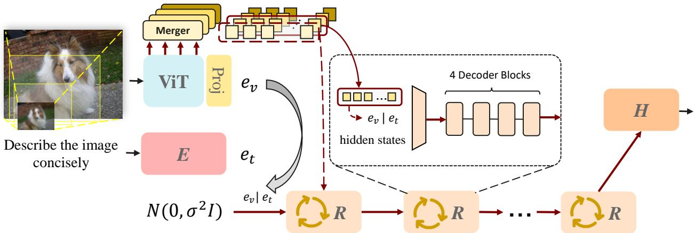  
Figure 2. Our framework incorporates a pre-trained vision encoder, with a group of lightweight patch merger that maps visual features into the LLM embedding space. During multimodal alignment, the [CLS] token is removed. represents Embedding, Recurrent, Head blocks respectively

Specifically, Huginn is characterized by a tripartite loop transformer architecture consisting of three core components: the Embedding Blocks E, which project the input into the latent space; the Recurrent block R, which performs the iterative computations; and the Language Head H, which handles decoding and outputs probabilities. All three modules are built from fundamental decoder blocks.

Huginn utilizes a vocabulary of 65536 tokens via BPE (Sennrich et al., 2016). This 3.5B-parameter model was pretrained on 0.8T tokens without subsequent finetuning, The model comprises approximately 1.5B parameters in the nonrecurrent embedding blocks and language head, 1.5B parameters in the core recurrent block, and 0.5B parameters in the tied input embedding.

To optimize the training of such recursive structures, Huginn employs truncated backpropagation through depth. Unlike standard transformers, gradients are only propagated through the final k iterations of the recurrent unit, significantly reducing memory overhead while maintaining the stability of deep latent refinement (Mikolov et al., 2011).

## 2.2. Multimodal Large Language Models

Early MLLMs focus on aligning visual and textual representations in a shared semantic space. CLIP (Radford et al., 2021) demonstrates the effectiveness of large-scale contrastive pretraining for zero-shot transfer, while BLIP (Li et al., 2022) and its variants (Li et al., 2023b; Liu et al., 2025) extend this paradigm toward generative multimodal modeling by connecting pretrained vision encoders with large language models. These works lay the foundation for subsequent MLLMs.

Building upon large language models, LLaVA (Liu et al., 2023c;a) introduces a projector-based connection scheme and instruction tuning to enable multimodal dialogue and reasoing. By directly mapping visual features into the language embedding space, LLaVA and its follow-ups achieve effective vision–language alignment with relatively low training complexity. However, due to the limited resolution of pretrained vision encoders, such approaches face challenges in tasks requiring fine-grained visual understanding.

Recent large-scale multimodal models emphasize unified training and improved visual feature utilization. LLaVA-OneVision-1.5 (An et al., 2025; Xie et al., 2025; Li et al., 2024) extends the LLaVA framework with a unified training pipeline to improve robustness across diverse visual tasks, while Qwen3-VL (Bai et al., 2023; Wang et al., 2024a; Bai et al., 2025c;a), introduces deepStack (Meng et al., 2024) to hierarchically inject fine-grained visual features into early layers of large language models, strengthening vision–language interaction without increasing input tokens. Nevertheless, these models remain based on feed-forward Transformer architectures with statically encoded visual representations, limiting explicit iterative or latent-space reasoing.

Beyond architectural scaling, recent models highlight a shift in multimodal reasoing paradigms. The emergence of GPT-4o (OpenAI, 2024a;b) demonstrates the feasibility of fully unified multimodal models, supporting vision, language, audio, and video within a single framework. Moreover, recent studies (Yao et al., 2024; Xu et al., 2025a) suggest that enhanced reasoing performance increasingly relies on transitioning from fast, single-pass inference toward slower, deliberative reasoing processes, enabling multi-step refinement and improved decision making. This paradigm shift motivates the exploration of multimodal models that explicitly support iterative and structured reasoing mechanisms.

## 3. Method

In this section, we introduce our motivation to inject hierarchical cues into the recurrent blocks and how we incorporate visual information into Huginn.

## 3.1. Recurrent Visual-Language Backbone

We denote the input sequence length as $n ,$ the hidden dimension of the model as $h ,$ and the vocabulary as $V .$ Given a recurrent depth $R ,$ an iteration step $t ,$ an input text sequence $x \in V ^ { n }$ , and a sequence of flattened image patches $\mathbf { X } _ { v } ,$ , we process the textual and visual modalities separately. For the visual components, we denote the vision transformer and its associated projector as ViT(·) and Proj(·), respectively. The feature extraction and fusion process can be written as:

$$
e = [ e _ { v } ; e _ { t } ] = { \mathrm { c o n c a t } } ( e _ { v } , e _ { t } ) ,\tag{1}
$$

where

$$
\left\{ { \begin{array} { l l } { e _ { v } = { \mathrm { P r o j } } ( { \mathrm { V i T } } ( \mathbf { X } _ { v } ) ) , } \\ { e _ { t } = E ( x ) , } \end{array} } \right.\tag{2}
$$

$e _ { v }$ and $e _ { t }$ represent the visual and textual embeddings, respectively. We denote $s _ { t }$ as the hidden states after t iterations. To stabilize the recurrent iterations, Huginn utilizes a random vector:

$$
s _ { 0 } \sim \mathcal { N } ( 0 , \sigma ^ { 2 } I _ { n \cdot h } ) .\tag{3}
$$

In the initial iteration, this vector is concatenated with the input embeddings along the channel dimension, which is subsequently mapped back to the original dimensionality by an adapter within the recurrent block $\mathcal { R } - B l o c k$ . In subsequent iterations, the hidden states derived from the preceding block are concatenated with the input embeddings. Let $\hat { e } _ { v }$ be the fused visual cues:

$$
s _ { r + 1 } = \mathcal { R } - B l o c k \left( e , \hat { e } _ { v } ; s _ { r } \right) .\tag{4}
$$

## 3.2. Hierarchical Visual Injection

To empower Huginn with the ability to perceive both structural details and high-level semantics, we move beyond the conventional practice of utilizing only the last layer of the vision encoder. Instead, we introduce a hierarchical visual injection strategy.

Specifically, we extract hidden states from a set of representative layers $\mathcal { L } = \{ 6 , 1 2 , 1 8 , 2 4 \}$ }. This selection is motivated by the inherent hierarchical nature of vision transformers:

• Lower-level Layers (e.g., Layer 6) retain highresolution spatial information and primitive visual patterns such as textures and edges, which are beneficial for grounding tasks.

• Intermediate and Higher-level Layers (e.g., Layer 12 to 24) gradually aggregate these primitives into complex semantic concepts and global context, providing the model with a holistic understanding of the scene.

To bridge the modality gap and align the dimensionalities, we employ a set of patch mergers inspired by Qwen3-VL: $\mathcal { M } = \{ m _ { l } \} _ { l \in \mathcal { L } }$ (Bai et al., 2025b). For each selected layer $l ,$ the visual features $h _ { v } ^ { l }$ are projected as:

$$
v _ { l } = m _ { l } ( h _ { v } ^ { l } ) , \quad l \in \{ 6 , 1 2 , 1 8 , 2 4 \} ,\tag{5}
$$

where $v _ { l } \in \mathbb { R } ^ { n \times h }$ represents the projected visual cues ready for recurrent injection. By progressively injecting these features from fine-grained semantics to coarse-grained textures into the initial recurrent iterations, we provide the language backbone with a “curriculum” of visual understanding, stabilizing the hidden state transition during the early stages of reasoing.

$$
{ \hat { e } } _ { v } = { \left\{ \begin{array} { l l } { v _ { i } } & { { \mathrm { i f ~ } } t < K , } \\ { 0 } & { { \mathrm { i f ~ } } t \geq K . } \end{array} \right. } \quad { \mathrm { w h e r e ~ } } i = { \mathcal { L } } [ t ]\tag{6}
$$

To enhance the robustness of the recurrent reasoing process, the recurrent depth is randomly sampled from a Poisson distribution during the training stage of Huginn. This stochasticity forces our model to decouple the visual-language fusion from a fixed step count.

We introduce an adaptive injection schedule. The core challenge lies in aligning the t iterations with the 4 available visual tiers. We define the injection at step t as follows:

1. Case I: Sufficient Iterations $( R \geq 4 )$ . The visual cues are injected in a “top-down” hierarchical order during the initial 4 steps. For $t > 4 ,$ , the model performs pure language modeling to refine the reasoing output.

2. Case II: Constrained Iterations $( R < 4 )$ . When the sampled depth is shallower than the visual hierarchy, we perform progressive downsampling of the visual cues. Specifically, we select a subset of V with an interval of $\lfloor 4 / R \rfloor$ to ensure that even in shallow reasoing, the model still receives a representative spectrum of visual information (e.g., if R = 2, the model integrates $\{ v _ { 1 } , v _ { 2 } \} )$ .

```python
1 def core_block_forward(x_in, embd):
2 ... # Model expand recurrent blocks here.
3 return x_out
4
5 def iterate_forward(x, embeds, vis_features):
6 n_no_grad, n_grad = random_sampler()
7
8 def get_input(i):
9 if i < len(vis_features):
10 # Vision features are injected into embeds
11 return func(embeds, vis_features[i])
12 else:
13 return embeds
14
15 with torch.no_grad():
16 for i in range(n_no_grad):
17 core_block_forward(x, get_input(i))
18
19 for i in range(n_no_grad, n_no_grad + n_grad):
20 core_block_forward(x, get_input(i))
21
```

Finally, after r recurrent iterations, the model decodes the hidden state s<sub>r</sub> to produce the output probabilities:

$$
p = H ( s _ { r } ) .\tag{7}
$$

## 3.3. Training Objective

Given an input text sequence x and a set of hierarchical visual features $\mathbf { V } _ { h i e r } = \left\{ v _ { ( 1 ) } , v _ { ( 2 ) } , \ldots , v _ { ( L ) } \right\}$ extracted from multiple encoder layers, the training loss is defined as:

$$
\begin{array} { r } { \mathcal { L } ( \theta ) = \mathbb { E } _ { ( x , \mathbf { V } _ { h i e r } ) \in \mathcal { X } } \mathbb { E } _ { r \sim \Lambda } \left[ \mathcal { L } _ { \mathrm { C E } } \left( _ { \theta } ( x , \mathbf { V } _ { h i e r } , r ) , x ^ { \prime } \right) \right] , } \end{array}
$$

where θ denotes the trainable parameters, and ${ \bf \Gamma } _ { \theta } ( x , \mathbf { V } _ { h i e r } , r )$ represents the model output at the r-th recurrence step. The hierarchical features $\mathbf { V } _ { h i e r }$ are selectively injected into the early layers of the transformer during each recurrent pass. This ensures that the model progressively refines its latent representations by anchoring them to multi-scale visual cues. The recurrence depth r is sampled from a log-normal Poisson distribution Λ with a targeted mean r¯+1. This stochastic supervision forces the model to maintain semantic consistency across varied computational paths, facilitating the adaptive early-exit mechanism during inference.

## 4. Experiments

## 4.1. Training Configuration

Following the established methodology of MLLMs like LLaVA-NeXT (Liu et al., 2024b), we decouple the training of HIVE into a three-stage pipeline.

Table 2. Comparison of Various Backbone LMMs, including Gemma3 (Team, 2025), LLaMA2 (Touvron et al., 2023), Phi-3- mini (Abdin et al., 2024) and Huginn (Geiping et al., 2025a). We detail model sizes, training token counts, and benchmark performances. The results indicate that the inherent language capabilities of our backbone LLM are constrained, which may, in turn, impact the overall performance of the resulting MLLMs. The missing entries are unavailable results.
<table><tr><td colspan="5">Gemma3 LLaMA2 Phi-3-mini Huginn</td></tr><tr><td>Param</td><td>4B</td><td>7B</td><td>3.8B</td><td>3.5B</td></tr><tr><td>Train Tokens</td><td>4T</td><td>2.0T</td><td>3.3T</td><td>0.8T</td></tr><tr><td>GSM8K</td><td>38.4</td><td>一</td><td>-</td><td>28.20</td></tr><tr><td>GSM8K-CoT (8-shot)</td><td></td><td></td><td>82.5</td><td>34.57</td></tr><tr><td>HumanEval</td><td>36.0</td><td>29.9</td><td>58.5</td><td>23.17</td></tr></table>

Table 3. Training configurations across different stages.
<table><tr><td>Parameters</td><td>Stage 1</td><td>Stage 2</td><td>Stage 3</td></tr><tr><td>Learning Rate</td><td> $1 \times 1 0 ^ { - 3 }$ </td><td>1 × 10−5</td><td>1 × 10−⁶</td></tr><tr><td>Max Dynamic Patches (#)</td><td>4</td><td>2</td><td>2</td></tr><tr><td>Max Tokens</td><td>1536</td><td>2048</td><td>2048</td></tr></table>

To capture fine-grained visual details across varying aspect ratios, we employ InternViT-300M-448px-V2.5 as our visual backbone. Unlike static encoders that resize images to a fixed square, our model leverages a dynamic high-resolution strategy. In our implementation, we set the maximum number of image tiles to a relatively conservative value to align with our available computational budget. Details are shown in Table 3.

Stage 1. To pre-align the vision-language modality, we only train the projector as well as the patch mergers in this stage, using the LCS-558K dataset (Liu et al., 2023b).

Stage 2. To enhance image-text alignment, we use the subset of the EMOVA alignment dataset (Chen et al., 2025a). General visual-language pre-training is sourced from ShareGPT4V (Chen et al., 2024b), ALLaVA (Chen et al., 2024a) (English and translated Chinese), and ShareGPT-4o (Cui et al., 2024), while OCR-related capabilities are supported by SynthDog (Kim et al., 2022), MMC-Alignment (Liu et al., 2024a), K12 Printing, and the UReader Text Reading subset (Ye et al., 2023). We also integrate the text-only corpus from Magpie Pro (Xu et al., 2025d) into our multi-modal training pipeline to maintain strong linguistic proficiency.

Stage 3. Our Stage 3 training data comprises 3.4M samples from the EMOVA-SFT subset, together with a collection of high-quality open-source visual instruction datasets, including ShareGPT4V (Chen et al., 2024b), InternVL (Chen et al., 2024d), Meteor (Lee et al., 2024), Idefics-2 (Laurenc¸on et al., 2024), Cambrian (Shengbang et al., 2024), and LLaVA-OneVision (Li et al., 2025a). See Fig. 6 for more details.

Table 4. Main performance comparison with MLLMs. We report the LLM backbone, model size, and training data scales (4T\* denotes 4T tokens, otherwise samples). Note that backbones are detailed in Table 2. MMB: MMBench (En) dev split; ${ \mathrm { S Q A } } _ { \mathrm { i m g } } { \mathrm { : } }$ ScienceQA-Img; $\mathrm { S E E D } _ { \mathrm { i m g } } { \mathrm { : } }$ SEED-Bench-Img; RWQA: RealWorldQA; TVQA: TextVQA; CQA: ChartQA; DVQA: DocVQA; POPE; Missing entries indicate unavailable results.
<table><tr><td colspan="2"></td><td>Gemma3-4B-PT</td><td>MobileVLM V2 7B</td><td>Bunny-v1.1-4B</td><td>Imp-4B</td><td>Emu3</td><td>HIVE</td></tr><tr><td colspan="2">Backbone</td><td>Gemma3</td><td>Vicuna-7B-v1.5</td><td>Phi-3-3.8B</td><td>Phi-3-3.8B</td><td>-</td><td>Huginn</td></tr><tr><td colspan="2" rowspan="2">Param. Train Data</td><td>4B</td><td>7B</td><td>4B</td><td>4B</td><td>8B</td><td>4B</td></tr><tr><td> $4 \mathrm { T ^ { * } }$ </td><td>3.6M</td><td>2.7M</td><td>1.6M</td><td>-</td><td>6.5M</td></tr><tr><td rowspan="4">General VQA</td><td>MMB</td><td>=</td><td>69.2</td><td>74.2</td><td>73.3</td><td>58.5</td><td>69.6</td></tr><tr><td> $\mathrm { \Delta S Q A _ { \mathrm { i m g } } }$ </td><td>-</td><td>74.8</td><td>78.3</td><td>78.3</td><td>89.2</td><td>91.6</td></tr><tr><td> $\mathrm { S E E D _ { i m g } }$ </td><td>-</td><td>-</td><td>72.5</td><td>-</td><td>68.2</td><td>70.5</td></tr><tr><td> $\mathrm { R W Q A }$ </td><td>45.5</td><td>-</td><td>-</td><td>-</td><td>57.4</td><td>57.9</td></tr><tr><td rowspan="3">OCR Chart</td><td> $\mathrm { T V Q A _ { \mathrm { v a l } } }$ </td><td>58.9</td><td>62.3</td><td>-</td><td>60.2</td><td>64.7</td><td>57.5</td></tr><tr><td> $\mathrm { C Q A } _ { \mathrm { t e s t } }$ </td><td>63.6</td><td>-</td><td>一</td><td>一</td><td>68.6</td><td>67.0</td></tr><tr><td> $\mathrm { D V Q A _ { \mathrm { v a l } } }$ </td><td>72.8</td><td>-</td><td>-</td><td>-</td><td>76.3</td><td>73.2</td></tr><tr><td>Others</td><td>POPE</td><td>-</td><td>85.3</td><td>87.2</td><td>86.9</td><td>85.2</td><td>87.6</td></tr></table>

## 4.2. Setup

Tokenization. To bridge the modalities, we introduce three dedicated tokens: <|image start|>, <|image|>, and <|image end|>. Specifically, the <|image|> token serves as a placeholder and is substituted by the visual features projected from the vision encoder into the language embedding space.

Hyperparameters. We train the model with a weight decay of $1 0 ^ { - 3 }$ . We adhere to the optimization configuration of the original Huginn, employing the AdamW optimizer with $\beta _ { 1 } = 0 . 9$ and $\beta _ { 2 } = 0 . 9 5$ . The learning rate is set with a cosine decay scheduler. Other detailed configurations are summarized in Table 3.

Evaluation. We evaluated the effectiveness of our approach across several challenging benchmarks via LMMs-Eval (Zhang et al., 2024), including MMStar (Chen et al., 2024c), MMBench (Liu et al., 2024c), ScienceQA (Lu et al., 2022), SEED-Bench (Li et al., 2023a), and RealWorldQA for general visual question answering capability. For OCR & Chart, we utilize ChartQA (Masry et al., 2022), TextVQA (Singh et al., 2019), and DocVQA (Mathew et al., 2021). In addition, we use MathVista (Lu et al., 2024) for math and reasoing evaluation. POPE (Li et al., 2023c) and GQA (Hudson & Manning, 2019) are adopted to assess model capabilities in hallucination-prone scenarios and complex visual reasoing challenges.

## 4.3. Benchmark Results

We developed three models for a comparative study: a baseline model trained without recurrence, a model trained with a mean recurrence of 32, and a third model that incorporates hierarchical visual information with the same recurrence level. To assess performance, we benchmarked these models against several open-source models, including Gemma-3- 4B-PT (Team, 2025), MobileVLM V2 7B (Chu et al., 2024), Bunny-v1.1-4B (He et al., 2024), Imp-4B (Shao et al., 2025), and Emu3 (Wang et al., 2024c). The main results are shown in Table 4. HIVE is evaluated using r = 32.

Based on the results, HIVE demonstrates a competitive edge in parameter efficiency and specialized visual reasoing. Despite its compact 4B architecture, the model achieves 91.6 on ScienceQA-Img, notably outperforming the larger 8B Emu3 and the 7B MobileVLM V2. This indicates that HIVE is particularly effective at handling complex, knowledge-based visual tasks. Furthermore, it achieves the highest reliability in the POPE benchmark (87.6), suggesting a robust capability to mitigate object hallucination compared to its peers.

The model also exhibits impressive data efficiency. While trained on 6.5M samples, HIVE consistently outperforms or matches models like Gemma3-4B-PT, which benefit from a much larger 4T token pre-training scale, across benchmarks such as RealWorldQA and DocVQA. Overall, HIVE strikes a balance between model size and performance. This is particularly notable because it manages to overcome the inherent limitations of its relatively lightweight Huginn backbone to achieve results that rival established baselines.

Table 5. Results on benchmarks for three variants. Bold text indicates the best performance among these models. MMB: MM-Bench (En) dev split; $\mathrm { { S Q A } _ { \mathrm { { i m g } } } \mathrm { { : } } }$ ScienceQA-Img; SEED $\operatorname { i m g } \colon$ SEED-Bench-Img; RWQA: RealWorldQA; TVQA: TextVQA; DVQA: DocVQA; MathV: MathVista; POPE
<table><tr><td>Benchmark</td><td>Baseline (r=1)</td><td>Ours w/o Hier (r=32)</td><td>Ours w/ Hier (r=32)</td></tr><tr><td>MMStar</td><td>33.28</td><td>48.44</td><td>49.79</td></tr><tr><td> $\mathrm { S E E D _ { i m g } }$ </td><td>42.37</td><td>70.46</td><td>70.48</td></tr><tr><td> $\bf M M B _ { \mathrm { d e v } }$ </td><td>21.74</td><td>68.04</td><td>69.59</td></tr><tr><td> $\mathrm { R W Q A }$ </td><td>41.44</td><td>57.52</td><td>57.91</td></tr><tr><td> $\mathrm { \Delta S Q A _ { \mathrm { i m g } } }$ </td><td>60.09</td><td>89.39</td><td>91.57</td></tr><tr><td>Avg.</td><td>39.78</td><td>66.77</td><td>67.87</td></tr><tr><td> $\mathrm { D V Q A _ { v a l } }$   $\mathrm { T V Q A _ { \mathrm { v a l } } }$ </td><td>24.04 30.56</td><td>73.72 57.66</td><td>73.20 57.54</td></tr><tr><td> $\mathbf { A v } \mathbf { g } .$ </td><td>27.3</td><td>65.69</td><td>65.37</td></tr><tr><td> $\mathbf { M a t h } \mathbf { V } _ { \mathrm { m i n i } }$ </td><td>24.5</td><td></td><td></td></tr><tr><td>POPE</td><td>74.84</td><td>35.0 87.02</td><td>34.7 87.61</td></tr><tr><td>GQA</td><td>44.8</td><td>57.71</td><td>57.89</td></tr><tr><td>Avg.</td><td>48.05</td><td>59.91</td><td>60.07</td></tr></table>

There remains substantial space for performance optimization. We recognize that the current model can be further elevated through finer hyperparameter tuning and more sophisticated dynamic resolution configurations, which could better capture the intricate spatial details required for advanced OCR and document understanding tasks.

Recurrence improves the performance. Figure 4 illustrates the performance scaling of three model variants across varying recurrence steps r: (1) a non-recurrent baseline (trained with r = 1), (2) a recurrent variant without hierarchical cues $( \bar { r } = 3 2 $ , w/o Hier.), and (3) our full recurrent model with hierarchical visual cues $( \bar { r } = 3 2 $ , w/ Hier.). The empirical results yield several key insights:

• Iterative Refinement Gains: While the non-recurrent baseline remains stagnant at a low performance level (averaging 59.0% across all steps), both recurrent variants exhibit a dramatic upward trajectory as r increases. For instance, the hierarchical model climbs from 32.82% at r = 1 to a peak of 91.57% at $r = 3 2$ validating that iterative recurrence allows the model to progressively refine its internal representations.

• Impact of Hierarchical Cues: The incorporation of hierarchical cues is associated with modest performance gains in this setting. At the recurrence depth of $r = 3 2$ the full model reaches 91.57%, compared with 89.39%

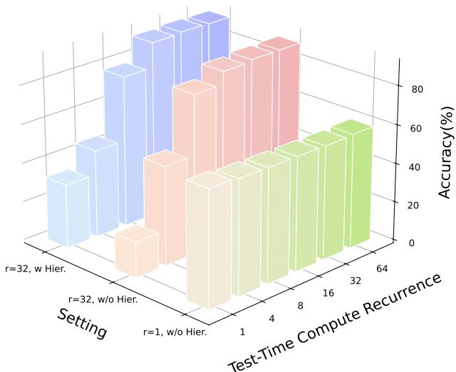  
Figure 3. Building upon Huginn, we integrate a Vision Transformer (ViT) and propose a hierarchical latent-space reasoing framework. Specifically, we argue that latent-space reasoing with visual information should be hierarchical rather than merely iterative. The figure shows our comparison results on ScienceQA<sub>img</sub>.

for the “w/o Hier.” variant.

• Performance Saturation: We observe a clear “diminishing returns” effect beyond r = 32. The performance gains for the hierarchical model plateau, moving from 91.57% (r = 32) to a slight fluctuation at 91.27% (r = 64). This convergence indicates that the model’s representational capacity saturates at this depth, where additional computational steps no longer yield meaningful accuracy improvements.

Hierarchical cues help understanding. To further examine the role of hierarchical visual cues, we report finegrained results across six core dimensions in Table 4. Compared with the recurrent baseline (r¯ = 32, w/o Hier.), the hierarchical recurrent variant (r¯ = 32, w/ Hier.) shows generally positive trends in several categories. In particular, HIVE yields moderate gains in Logic Reasoing (LR, +2.54%), Attribute Reasoing (AR, +1.99%), Relation Reasoing (RR, +1.74%), and Coarse Perception (CP, +3.04%), suggesting that hierarchical visual priors can be incorporated effectively into the recurrent framework. Although the differences are limited in instance-level perception (FI), the overall results indicate that hierarchical cues are compatible with loop-based latent reasoing and can provide additional support in complex visual understanding.

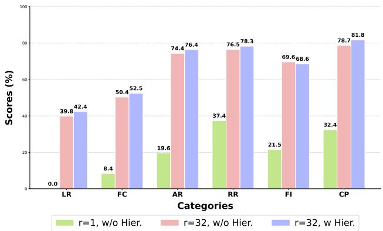  
Figure 4. MMBench detailed results. LR denotes logic reasoing. FC denotes fine-grained perception (cross-instance). AR denotes attribute reasoing. RR denotes relation reasoing. FI denotes finegrained perception (instance-level). CP denotes coarse perception.

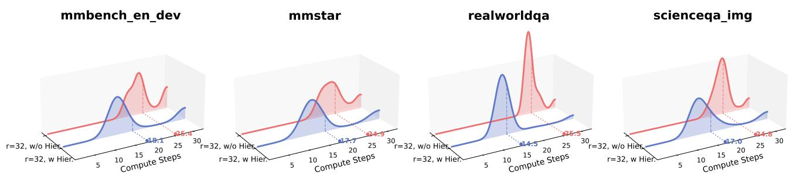  
Figure 5. Distribution of inference steps for the first token generation across multiple-choice benchmarks. We evaluate the impact of hierarchical cue injection on the recurrent steps. The results demonstrate that incorporating these cues causes a distinct leftward shift in the distribution, indicating a reduction in computation during inference.

## 4.4. Adaptive Compute

To optimize the efficiency-performance trade-off, Huginn has implemented an adaptive computation mechanism that dynamically adjusts the number of recurrence iterations during inference. This optional mechanism lets the model determine the termination of recurrence based on the convergence of hidden states. A relative change metric is defined as follows:

$$
\mathrm { n o r m \_ d i f f } = \frac { \| \mathbf h _ { t } - \mathbf h _ { t - 1 } \| _ { 2 } } { \| \mathbf h _ { t } \| _ { 2 } } .
$$

To further enhance inference efficiency, Huginn adopts a specialized KV-cache management scheme with a periodic retrieval strategy. For the i-th token during the r-th recurrence step, the latest-m4 mechanism retrieves the KV-cache from the most recent valid step $j$ that aligns with the current block’s functional cycle. Specifically, the latest-m4 lookup mechanism determines the retrieved cache index $j ^ { * }$ as:

$$
\begin{array} { r } { j ^ { * } = \left\{ \begin{array} { l l } { \operatorname* { m a x } \{ j \mid j \leq r , j \equiv _ { 4 } r , \mathbb { Z } _ { j , i } = 1 \} } & { r \geq 2 , } \\ { r } & { r < 2 , } \end{array} \right. } \end{array}
$$

where $\mathcal { T } _ { j , i } \in \{ 0 , 1 \}$ denotes the validity of the cache at step $j$ for token $i ,$ and $\equiv _ { 4 }$ denotes congruence modulo 4. This periodic reuse of cache states maintains temporal consistency while significantly reducing redundant computations.

This optimized caching framework provides the necessary infrastructure for dynamic inference. To quantify the computational effect, we analyze the average recurrence steps required for the first token under the adaptive early-exit setting (max $r = 3 2 )$ . As shown in Figure 5, incorporating hierarchical cues is associated with faster convergence of hidden states across MMBench, MMStar, RealWorldQA, and Science $\mathrm { Q A } _ { \mathrm { i m g } }$ . Concretely, the mean reasoing steps decrease from 25.4 to 18.1 on MMBench, 24.9 to 17.7 on MM-Star, and 24.8 to 17.0 on $\mathbf { S c i e n c e Q A _ { i m g } }$ . On RealWorldQA, the average computation depth decreases from 25.5 to 14.5. This leftward shift in the step distribution suggests that hierarchical visual cues can provide useful multi-scale information that helps the model meet the exit criterion earlier in some cases. Overall, these results indicate that hierarchical cue injection is compatible with reducing the number of recurrence steps required under adaptive computation.

## 5. Conclusion

In this work, we introduced HIVE, a novel MLLM that pioneers the use of loop-based Transformer architectures for latent-space reasoing. By progressively leveraging hierarchical visual features through iterative recurrence, HIVE demonstrates that complex multimodal tasks can be refined within a fixed-parameter recurrent framework. Our experiments reveal that the integration of hierarchical cues is naturally suited to loop-based architectures and can improve reasoing efficiency. Under an adaptive computation setting, the hierarchical mechanism facilitates faster convergence of latent states.

Looking ahead, we aim to enhance OCR & Chart performance via dynamic resolution strategies and investigate various layer-selection schemes. A primary focus is internalizing explicit CoT within recurrent loops. Central to this effort is the challenge of implementing early-exit mechanisms that reduce computational overhead while maintaining accuracy. Furthermore, we intend to explore the scalability of this recurrent approach to more diverse modal inputs. This research provides a practical path toward developing MLLMs that balance high-level cognitive depth with manageable computational costs, potentially serving as a reliable framework for real-time multimodal reasoing systems.

## Impact Statement

This paper presents HIVE, a framework designed to advance the field of MLLMs through recursive latent-space reasoing and hierarchical visual integration. The potential broader impacts of this work are summarized as follows:

Computational Efficiency and Sustainability: By performing reasoing within the latent space and utilizing a looped transformer architecture, HIVE reduces the reliance on extremely long text sequences (CoT) and massive parameter scaling. This contributes to more computationally efficient AI systems, potentially lowering the energy consumption and carbon footprint associated with deploying high-performance reasoing models.

Enhanced Decision Support: The integration of hierarchical visual information allows for more robust interpretation of complex scenes. This could have positive societal applications in fields requiring nuanced visual-logical analysis, such as assistive technologies for the visually impaired, medical imaging interpretation support, and autonomous system safety.

Ethical Considerations: As with all large-scale multimodal models, there is a risk that the model may inherit or amplify biases present in the training data (e.g., InternViT or large-scale text corpora). Furthermore, enhanced reasoing capabilities could be misused for generating sophisticated misinformation. We encourage the community to apply standard rigorous bias-detection and safety-filtering protocols when deploying recursive latent reasoing frameworks.

Overall, our work aims to make complex multimodal reasoing more efficient and structurally grounded, and we do not foresee any specific negative societal consequences that uniquely distinguish our research from general advancements in the field of Machine Learning.

## References

Abdin, M. I., Jacobs, S. A., Awan, A. A., Aneja, J., Awadallah, A., Awadalla, H., Bach, N., Bahree, A., Bakhtiari, A., Behl, H. S., Benhaim, A., Bilenko, M., Bjorck, J., Bubeck, S., Cai, M., Mendes, C. C. T., Chen, W., Chaudhary, V., Chopra, P., Giorno, A. D., de Rosa, G., Dixon, M., Eldan, R., Iter, D., Garg, A., Goswami, A., Gunasekar, S., Haider, E., Hao, J., Hewett, R. J., Huynh, J., Javaheripi, M., Jin, X., Kauffmann, P., Karampatziakis, N., Kim, D., Khademi, M., Kurilenko, L., Lee, J. R., Lee, Y. T., Li, Y., Liang, C., Liu, W., Lin, E., Lin, Z., Madan, P., Mitra,

A., Modi, H., Nguyen, A., Norick, B., Patra, B., Perez-Becker, D., Portet, T., Pryzant, R., Qin, H., Radmilac, M., Rosset, C., Roy, S., Ruwase, O., Saarikivi, O., Saied, A., Salim, A., Santacroce, M., Shah, S., Shang, N., Sharma, H., Song, X., Tanaka, M., Wang, X., Ward, R., Wang, G., Witte, P. A., Wyatt, M., Xu, C., Xu, J., Yadav, S., Yang, F., Yang, Z., Yu, D., Zhang, C., Zhang, C., Zhang, J., Zhang, L. L., Zhang, Y., Zhang, Y., Zhang, Y., and Zhou, X. Phi-3 technical report: A highly capable language model locally on your phone. CoRR, abs/2404.14219, 2024. doi: 10.48550/ARXIV.2404.14219. URL https: //doi.org/10.48550/arXiv.2404.14219.

An, X., Xie, Y., Yang, K., Zhang, W., Zhao, X., Cheng, Z., Wang, Y., Xu, S., Chen, C., Wu, C., Tan, H., Li, C., Yang, J., Yu, J., Wang, X., Qin, B., Wang, Y., Yan, Z., Feng, Z., Liu, Z., Li, B., and Deng, J. Llava-onevision-1.5: Fully open framework for democratized multimodal training. In arXiv, 2025.

Bae, S., Fisch, A., Harutyunyan, H., Ji, Z., Kim, S., and Schuster, T. Relaxed recursive transformers: Effective parameter sharing with layer-wise lora. In The Thirteenth International Conference on Learning Representations, ICLR 2025, Singapore, April 24-28, 2025. OpenReview.net, 2025. URL https://openreview.net/ forum?id=WwpYSOkkCt.

Bai, J., Bai, S., Yang, S., Wang, S., Tan, S., Wang, P., Lin, J., Zhou, C., and Zhou, J. Qwen-vl: A versatile visionlanguage model for understanding, localization, text reading, and beyond. arXiv preprint arXiv:2308.12966, 2023.

Bai, S., Cai, Y., Chen, R., Chen, K., Chen, X., Cheng, Z., Deng, L., Ding, W., Gao, C., Ge, C., Ge, W., Guo, Z., Huang, Q., Huang, J., Huang, F., Hui, B., Jiang, S., Li, Z., Li, M., Li, M., Li, K., Lin, Z., Lin, J., Liu, X., Liu, J., Liu, C., Liu, Y., Liu, D., Liu, S., Lu, D., Luo, R., Lv, C., Men, R., Meng, L., Ren, X., Ren, X., Song, S., Sun, Y., Tang, J., Tu, J., Wan, J., Wang, P., Wang, P., Wang, Q., Wang, Y., Xie, T., Xu, Y., Xu, H., Xu, J., Yang, Z., Yang, M., Yang, J., Yang, A., Yu, B., Zhang, F., Zhang, H., Zhang, X., Zheng, B., Zhong, H., Zhou, J., Zhou, F., Zhou, J., Zhu, Y., and Zhu, K. Qwen3-vl technical report. arXiv preprint arXiv:2511.21631, 2025a.

Bai, S., Cai, Y., Chen, R., Chen, K., Chen, X., Cheng, Z., Deng, L., Ding, W., Gao, C., Ge, C., Ge, W., Guo, Z., Huang, Q., Huang, J., Huang, F., Hui, B., Jiang, S., Li, Z., Li, M., Li, M., Li, K., Lin, Z., Lin, J., Liu, X., Liu, J., Liu, C., Liu, Y., Liu, D., Liu, S., Lu, D., Luo, R., Lv, C., Men, R., Meng, L., Ren, X., Ren, X., Song, S., Sun, Y., Tang, J., Tu, J., Wan, J., Wang, P., Wang, P., Wang, Q., Wang, Y., Xie, T., Xu, Y., Xu, H., Xu, J., Yang, Z., Yang, M., Yang, J., Yang, A., Yu, B., Zhang, F., Zhang, H., Zhang, X., Zheng, B., Zhong, H., Zhou,

J., Zhou, F., Zhou, J., Zhu, Y., and Zhu, K. Qwen3-vl technical report. CoRR, abs/2511.21631, 2025b. doi: 10.48550/ARXIV.2511.21631. URL https://doi. org/10.48550/arXiv.2511.21631.

Bai, S., Chen, K., Liu, X., Wang, J., Ge, W., Song, S., Dang, K., Wang, P., Wang, S., Tang, J., Zhong, H., Zhu, Y., Yang, M., Li, Z., Wan, J., Wang, P., Ding, W., Fu, Z., Xu, Y., Ye, J., Zhang, X., Xie, T., Cheng, Z., Zhang, H., Yang, Z., Xu, H., and Lin, J. Qwen2.5-vl technical report. arXiv preprint arXiv:2502.13923, 2025c.

Brown, T., Mann, B., Ryder, N., Subbiah, M., Kaplan, J. D., Dhariwal, P., Neelakantan, A., Shyam, P., Sastry, G., Askell, A., et al. Language models are few-shot learners. Advances in neural information processing systems, 33: 1877–1901, 2020.

Chen, G. H., Chen, S., Zhang, R., Chen, J., Wu, X., Zhang, Z., Chen, Z., Li, J., Wan, X., and Wang, B. Allava: Harnessing gpt4v-synthesized data for A lite vision-language model. CoRR, abs/2402.11684, 2024a.

Chen, K., Gou, Y., Huang, R., Liu, Z., Tan, D., Xu, J., Wang, C., Zhu, Y., Zeng, Y., Yang, K., Wang, D., Xiang, K., Li, H., Bai, H., Han, J., Li, X., Jin, W., Xie, N., Zhang, Y., Kwok, J. T., Zhao, H., Liang, X., Yeung, D., Chen, X., Li, Z., Zhang, W., Liu, Q., Hong, L., Hou, L., and Xu, H. EMOVA: empowering language models to see, hear and speak with vivid emotions. In CVPR, pp. 5455–5466. Computer Vision Foundation / IEEE, 2025a.

Chen, L., Li, J., Dong, X., Zhang, P., He, C., Wang, J., Zhao, F., and Lin, D. Sharegpt4v: Improving large multimodal models with better captions. In ECCV (17), volume 15075 of Lecture Notes in Computer Science, pp. 370– 387. Springer, 2024b.

Chen, L., Li, J., Dong, X., Zhang, P., Zang, Y., Chen, Z., Duan, H., Wang, J., Qiao, Y., Lin, D., and Zhao, F. Are we on the right way for evaluating large vision-language models? In Globersons, A., Mackey, L., Belgrave, D., Fan, A., Paquet, U., Tomczak, J. M., and Zhang, C. (eds.), Advances in Neural Information Processing Systems 38: Annual Conference on Neural Information Processing Systems 2024, NeurIPS 2024, Vancouver, BC, Canada, December 10 - 15, 2024, 2024c. URL http://papers. nips.cc/paper\_files/paper/2024/hash/ 2f8ee6a3d766b426d2618e555b5aeb39-Abstr html.

Chen, X., Zhao, A., Xia, H., Lu, X., Wang, H., Chen, Y., Zhang, W., Wang, J., Li, W., and Shen, X. Reasoing beyond language: A comprehensive survey on latent chainof-thought reasoing. CoRR, abs/2505.16782, 2025b.

Chen, Z., Wu, J., Wang, W., Su, W., Chen, G., Xing, S., Zhong, M., Zhang, Q., Zhu, X., Lu, L., et al. Internvl: Scaling up vision foundation models and aligning for generic visual-linguistic tasks. In Proceedings of the IEEE/CVF Conference on Computer Vision and Pattern Recognition, pp. 24185–24198, 2024d.

Chu, X., Qiao, L., Zhang, X., Xu, S., Wei, F., Yang, Y., Sun, X., Hu, Y., Lin, X., Zhang, B., and Shen, C. Mobilevlm V2: faster and stronger baseline for vision language model. CoRR, abs/2402.03766, 2024. doi: 10.48550/ARXIV.2402.03766. URL https://doi. org/10.48550/arXiv.2402.03766.

Cui, E., He, Y., Ma, Z., Chen, Z., Tian, H., Wang, W., Li, K., Wang, Y., Wang, W., Zhu, X., Lu, L., Lu, T., Wang, Y., Wang, L., Qiao, Y., and Dai, J. Sharegpt-4o: Comprehensive multimodal annotations with gpt-4o, 2024. URL https://sharegpt4o.github.io/.

Dehghani, M., Gouws, S., Vinyals, O., Uszkoreit, J., and Kaiser, L. Universal transformers. In 7th International Conference on Learning Representations, ICLR 2019, New Orleans, LA, USA, May 6-9, 2019. OpenReview.net, 2019. URL https://openreview.net/forum? id=HyzdRiR9Y7.

Gao, Y., Zheng, C., Xie, E., Shi, H., Hu, T., Li, Y., Ng, M., Li, Z., and Liu, Z. Algoformer: An efficient transformer framework with algorithmic structures. Trans. Mach. Learn. Res., 2025, 2025. URL https: //openreview.net/forum?id=oYP2Pd5aQt.

Geiping, J., McLeish, S., Jain, N., Kirchenbauer, J., Singh, S., Bartoldson, B. R., Kailkhura, B., Bhatele, A., and Goldstein, T. Scaling up test-time compute with latent reasoing: A recurrent depth approach. CoRR, abs/2502.05171, 2025a. doi: 10.48550/ARXIV. 2502.05171. URL https://doi.org/10.48550/ arXiv.2502.05171.

Geiping, J., McLeish, S., Jain, N., Kirchenbauer, J., Singh, S., Bartoldson, B. R., Kailkhura, B., Bhatele, A., and Goldstein, T. Scaling up test-time compute with latent reasoing: A recurrent depth approach. CoRR, abs/2502.05171, 2025b.

Hao, S., Sukhbaatar, S., Su, D., Li, X., Hu, Z., Weston, J., and Tian, Y. Training large language models to reaso in t-Conference.a continuous latent space. CoRR, abs/2412.06769, 2024.

He, M., Liu, Y., Wu, B., Yuan, J., Wang, Y., Huang, T., and Zhao, B. Efficient multimodal learning from datacentric perspective. CoRR, abs/2402.11530, 2024. doi: 10.48550/ARXIV.2402.11530. URL https://doi. org/10.48550/arXiv.2402.11530.

Huang, W., Jia, B., Zhai, Z., Cao, S., Ye, Z., Zhao, F., Xu, Z., Hu, Y., and Lin, S. Vision-r1: Incentivizing reasoing capability in multimodal large language models. arXiv preprint arXiv:2503.06749, 2025.

Hudson, D. A. and Manning, C. D. GQA: A new dataset for real-world visual reasoing and compositional question answering. In IEEE Conference on Computer Vision and Pattern Recognition, CVPR 2019, Long Beach, CA, USA, June 16-20, 2019, pp. 6700–6709. Computer Vision Foundation / IEEE, 2019. doi: 10.1109/CVPR.2019.00686. URL http: //openaccess.thecvf.com/content\_CVPR\_ 2019/html/Hudson\_GQA\_A\_New\_Dataset\_ for\_Real-World\_Visual\_Reasoing\_and\_ Compositional\_CVPR\_2019\_paper.html.

Kaplan, J., McCandlish, S., Henighan, T., Brown, T. B., Chess, B., Child, R., Gray, S., Radford, A., Wu, J., and Amodei, D. Scaling laws for neural language models. CoRR, abs/2001.08361, 2020.

Kim, G., Hong, T., Yim, M., Nam, J., Park, J., Yim, J., Hwang, W., Yun, S., Han, D., and Park, S. Ocr-free document understanding transformer. In ECCV (28), volume 13688 of Lecture Notes in Computer Science, pp. 498–517. Springer, 2022.

Laurenc¸on, H., Tronchon, L., Cord, M., and Sanh, V. What matters when building vision-language models? In NeurIPS, 2024.

Lee, B., Kim, C. W., Park, B., and Ro, Y. M. Meteor: Mamba-based traversal of rationale for large language and vision models. In NeurIPS, 2024.

Li, B., Wang, R., Wang, G., Ge, Y., Ge, Y., and Shan, Y. Seed-bench: Benchmarking multimodal llms with generative comprehension. CoRR, abs/2307.16125, 2023a. doi: 10.48550/ARXIV.2307.16125. URL https:// doi.org/10.48550/arXiv.2307.16125.

Li, B., Zhang, Y., Guo, D., Zhang, R., Li, F., Zhang, H., Zhang, K., Zhang, P., Li, Y., Liu, Z., and Li, C. Llavaonevision: Easy visual task transfer. Transactions on Machine Learning Research, 2024.

Li, B., Zhang, Y., Guo, D., Zhang, R., Li, F., Zhang, H., Zhang, K., Zhang, P., Li, Y., Liu, Z., and Li, C. Llavaonevision: Easy visual task transfer. Trans. Mach. Learn. Res., 2025, 2025a.

Li, J., Li, D., Xiong, C., and Hoi, S. C. H. BLIP: bootstrapping language-image pre-training for unified vision-language understanding and generation. In Chaudhuri, K., Jegelka, S., Song, L., Szepesvari, C., Niu, G.,´

and Sabato, S. (eds.), International Conference on Machine Learning, ICML 2022, 17-23 July 2022, Baltimore, Maryland, USA, volume 162 of Proceedings of Machine Learning Research, pp. 12888–12900. PMLR, 2022. URL https://proceedings.mlr.press/ v162/li22n.html.

Li, J., Li, D., Savarese, S., and Hoi, S. BLIP-2: Bootstrapping language-image pre-training with frozen image encoders and large language models. In Krause, A., Brunskill, E., Cho, K., Engelhardt, B., Sabato, S., and Scarlett, J. (eds.), Proceedings of the 40th International Conference on Machine Learning, volume 202 of Proceedings of Machine Learning Research, pp. 19730–19742. PMLR, 23–29 Jul 2023b. URL https://proceedings. mlr.press/v202/li23q.html.

Li, J., Fu, Y., Fan, L., Liu, J., Shu, Y., Qin, C., Yang, M., King, I., and Ying, R. Implicit reasoing in large language models: A comprehensive survey. CoRR, abs/2509.02350, 2025b.

Li, Y., Du, Y., Zhou, K., Wang, J., Zhao, W. X., and Wen, J.-R. Evaluating object hallucination in large visionlanguage models. arXiv preprint arXiv:2305.10355, 2023c.

Liu, F., Wang, X., Yao, W., Chen, J., Song, K., Cho, S., Yacoob, Y., and Yu, D. MMC: advancing multimodal chart understanding with large-scale instruction tuning. In NAACL-HLT, pp. 1287–1310. Association for Computational Linguistics, 2024a.

Liu, H., Li, C., Li, Y., and Lee, Y. J. Improved baselines with visual instruction tuning, 2023a.

Liu, H., Li, C., Wu, Q., and Lee, Y. J. Visual instruction tuning. In NeurIPS, 2023b.

Liu, H., Li, C., Wu, Q., and Lee, Y. J. Visual instruction tuning. In NeurIPS, 2023c.

Liu, H., Li, C., Wu, Q., and Lee, Y. J. Visual instruction tuning. Advances in neural information processing systems, 36:34892–34916, 2023d.

Liu, H., Li, C., Li, Y., Li, B., Zhang, Y., Shen, S., and Lee, Y. J. Llava-next: Improved reasoing, ocr, and world knowledge, January 2024b. URL https://llava-vl.github.io/blog/ 2024-01-30-llava-next/.

Liu, X., Xia, X., Ng, S.-K., and Chua, T.-S. Principled multimodal representation learning. arXiv preprint arXiv:2507.17343, 2025.

Liu, Y., Duan, H., Zhang, Y., Li, B., Zhang, S., Zhao, W., Yuan, Y., Wang, J., He, C., Liu, Z., Chen, K.,

and Lin, D. Mmbench: Is your multi-modal model an all-around player? In Leonardis, A., Ricci, E., Roth, S., Russakovsky, O., Sattler, T., and Varol, G. (eds.), Computer Vision - ECCV 2024 - 18th European Conference, Milan, Italy, September 29-October 4, 2024, Proceedings, Part VI, volume 15064 of Lecture Notes in Computer Science, pp. 216–233. Springer, 2024c. doi: 10.1007/978-3-031-72658-3\ 13. URL https:// doi.org/10.1007/978-3-031-72658-3\_13.

Lu, P., Mishra, S., Xia, T., Qiu, L., Chang, K., Zhu, S., Tafjord, O., Clark, P., and Kalyan, A. Learn to explain: Multimodal reasoing via thought chains for science question answering. In Koyejo, S., Mohamed, S., Agarwal, A., Belgrave, D., Cho, K., and Oh, A. (eds.), Advances in Neural Information Processing Systems 35: Annual Conference on Neural Information Processing Systems 2022, NeurIPS 2022, New Orleans, LA, USA, November 28 - December 9, 2022, 2022. URL http://papers. nips.cc/paper\_files/paper/2022/hash/ 11332b6b6cf4485b84afadb1352d3a9a-Abstr html.

Lu, P., Bansal, H., Xia, T., Liu, J., Li, C., Hajishirzi, H., Cheng, H., Chang, K., Galley, M., and Gao, J. Mathvista: Evaluating mathematical reasoing of foundation models in visual contexts. In The Twelfth International Conference on Learning Representations, ICLR 2024, Vienna, Austria, May 7-11, 2024. OpenReview.net, 2024. URL https://openreview.net/forum? id=KUNzEQMWU7.

Masry, A., Long, D. X., Tan, J. Q., Joty, S. R., and Hoque, E. Chartqa: A benchmark for question answering about charts with visual and logical reasoing. In Muresan, S., Nakov, P., and Villavicencio, A. (eds.), Findings of the Association for Computational Linguistics: ACL 2022, Dublin, Ireland, May 22-27, 2022, pp. 2263–2279. Association for Computational Linguistics, 2022. doi: 10.18653/V1/2022. FINDINGS-ACL.177. URL https://doi.org/10. 18653/v1/2022.findings-acl.177.

Mathew, M., Karatzas, D., and Jawahar, C. V. Docvqa: A dataset for VQA on document images. In IEEE Winter Conference on Applications of Computer Vision, WACV 2021, Waikoloa, HI, USA, January 3-8, 2021, pp. 2199–2208. IEEE, 2021. doi: 10.1109/WACV48630. 2021.00225. URL https://doi.org/10.1109/ WACV48630.2021.00225.

Meng, L., Yang, J., Tian, R., Dai, X., Wu, Z., Gao, J., and Jiang, Y. Deepstack: Deeply stacking visual tokens is surprisingly simple and effective for lmms. In Globersons, A., Mackey, L., Belgrave, D., Fan, A., Paquet, U., Tomczak, J. M., and Zhang, C. (eds.),

Advances in Neural Information Processing Systems 38: Annual Conference on Neural Information Processing Systems 2024, NeurIPS 2024, Vancouver, BC, Canada, December 10 - 15, 2024, 2024. URL http://papers. nips.cc/paper\_files/paper/2024/hash/ 29cd7f8331d13ede6dc6d6ef3dfacb70-Abstract-Confere html.

Mikolov, T., Kombrink, S., Burget, L., Cernocky, J., and´ Khudanpur, S. Extensions of recurrent neural network language model. In ICASSP, pp. 5528–5531. IEEE, 2011.

Mohtashami, A., Pagliardini, M., and Jaggi, M. Cotformer: A chain of thought driven architecture with budget-adaptive computation cost at inference. In The Thirteenth International Conference on Learning Representations, ICLR 2025, Singapore, April 24-28, 2025. OpenReview.net, 2025. URL https://openreview. net/forum?id=7igPXQFupX.

OpenAI. GPT-4 technical report. CoRR, abs/2303.08774, <sup>t-Conference.</sup>2023. doi: 10.48550/ARXIV.2303.08774. URL https: //doi.org/10.48550/arXiv.2303.08774.

OpenAI. Hello gpt-4o, 2024a. URL https://openai. com/index/hello-gpt-4o/.

OpenAI. Gpt-4o mini: advancing cost-efficient intelligence, 2024b. URL https://openai.com/index/ gpt-4o-mini-advancing-cost-efficient-intelligence

Pham, T. and Ngo, C. Multimodal chain of continuous thought for latent-space reasoing in vision-language models. CoRR, abs/2508.12587, 2025. doi: 10.48550/ ARXIV.2508.12587. URL https://doi.org/10. 48550/arXiv.2508.12587.

Radford, A., Kim, J. W., Hallacy, C., Ramesh, A., Goh, G., Agarwal, S., Sastry, G., Askell, A., Mishkin, P., Clark, J., Krueger, G., and Sutskever, I. Learning transferable visual models from natural language supervision. In Meila, M. and Zhang, T. (eds.), Proceedings of the 38th International Conference on Machine Learning, ICML 2021, 18-24 July 2021, Virtual Event, volume 139 of Proceedings of Machine Learning Research, pp. 8748– 8763. PMLR, 2021. URL http://proceedings. mlr.press/v139/radford21a.html.

Sennrich, R., Haddow, B., and Birch, A. Neural machine translation of rare words with subword units. In ACL (1). The Association for Computer Linguistics, 2016.

Shao, Z., Yu, Z., Yu, J., Ouyang, X., Zheng, L., Gai, Z., Wang, M., Kuang, Z., and Ding, J. Imp: Highly capable large multimodal models for mobile devices. IEEE Trans. Multim., 27:2961–2974, 2025. doi: 10.1109/TMM.2025. 3557680. URL https://doi.org/10.1109/TMM. 2025.3557680.

Shen, X., Wang, Y., Shi, X., Wang, Y., Zhao, P., and Gu, J. Efficient reasoing with hidden thinking. CoRR, abs/2501.19201, 2025.

Shengbang, T., Ellis, B., Penghao, W., Sanghyun, W., Manoj, M., Charitha, A. S., Jihan, Y., Shusheng, Y., Adithya, I., Xichen, P., Austin, W., Rob, F., Yann, L., and Saining, X. Cambrian-1: A Fully Open, Vision-Centric Exploration of Multimodal LLMs. arXiv preprint arXiv:2406.16860, 2024.

Singh, A., Natarajan, V., Shah, M., Jiang, Y., Chen, X., Batra, D., Parikh, D., and Rohrbach, M. Towards vqa models that can read. In Proceedings of the IEEE/CVF conference on computer vision and pattern recognition, pp. 8317–8326, 2019.

Team, G. Gemma 3 technical report. CoRR, abs/2503.19786, 2025. doi: 10.48550/ARXIV.2503.19786. URL https: //doi.org/10.48550/arXiv.2503.19786.

Touvron, H., Martin, L., Stone, K., Albert, P., Almahairi, A., Babaei, Y., Bashlykov, N., Batra, S., Bhargava, P., Bhosale, S., Bikel, D., Blecher, L., Canton-Ferrer, C., Chen, M., Cucurull, G., Esiobu, D., Fernandes, J., Fu, J., Fu, W., Fuller, B., Gao, C., Goswami, V., Goyal, N., Hartshorn, A., Hosseini, S., Hou, R., Inan, H., Kardas, M., Kerkez, V., Khabsa, M., Kloumann, I., Korenev, A., Koura, P. S., Lachaux, M., Lavril, T., Lee, J., Liskovich, D., Lu, Y., Mao, Y., Martinet, X., Mihaylov, T., Mishra, P., Molybog, I., Nie, Y., Poulton, A., Reizenstein, J., Rungta, R., Saladi, K., Schelten, A., Silva, R., Smith, E. M., Subramanian, R., Tan, X. E., Tang, B., Taylor, R., Williams, A., Kuan, J. X., Xu, P., Yan, Z., Zarov, I., Zhang, Y., Fan, A., Kambadur, M., Narang, S., Rodriguez, A., Stojnic, R., Edunov, S., and Scialom, T. Llama 2: Open foundation and fine-tuned chat models. CoRR, abs/2307.09288, 2023. doi: 10.48550/ARXIV.2307.09288. URL https: //doi.org/10.48550/arXiv.2307.09288.

Wang, P., Bai, S., Tan, S., Wang, S., Fan, Z., Bai, J., Chen, K., Liu, X., Wang, J., Ge, W., Fan, Y., Dang, K., Du, M., Ren, X., Men, R., Liu, D., Zhou, C., Zhou, J., and Lin, J. Qwen2-vl: Enhancing vision-language model’s perception of the world at any resolution. arXiv preprint arXiv:2409.12191, 2024a.

Wang, P., Bai, S., Tan, S., Wang, S., Fan, Z., Bai, J., Chen, K., Liu, X., Wang, J., Ge, W., et al. Qwen2-vl: Enhancing vision-language model’s perception of the world at any resolution. arXiv preprint arXiv:2409.12191, 2024b.

Wang, X., Zhang, X., Luo, Z., Sun, Q., Cui, Y., Wang, J., Zhang, F., Wang, Y., Li, Z., Yu, Q., Zhao, Y., Ao, Y., Min, X., Li, T., Wu, B., Zhao, B., Zhang, B., Wang, L., Liu, G., He, Z., Yang, X., Liu, J., Lin, Y., Huang, T., and Wang, Z. Emu3: Next-token prediction is all you need.

CoRR, abs/2409.18869, 2024c. doi: 10.48550/ARXIV. 2409.18869. URL https://doi.org/10.48550/ arXiv.2409.18869.

Xie, Y., Yang, K., An, X., Wu, K., Zhao, Y., Deng, W., Ran, Z., Wang, Y., Feng, Z., Miles, R., Elezi, I., and Deng, J. Region-based cluster discrimination for visual representation learning. In ICCV, 2025.

Xu, G., Jin, P., Wu, Z., Li, H., Song, Y., Sun, L., and Yuan, L. Llava-cot: Let vision language models reaso stepby-step. In Proceedings of the IEEE/CVF International Conference on Computer Vision (ICCV), pp. 2087–2098, October 2025a.

Xu, G., Jin, P., Wu, Z., Li, H., Song, Y., Sun, L., and Yuan, L. Llava-cot: Let vision language models reaso stepby-step. In Proceedings of the IEEE/CVF International Conference on Computer Vision, pp. 2087–2098, 2025b.

Xu, Y., Guo, X., Zeng, Z., and Miao, C. Softcot: Soft chainof-thought for efficient reasoing with llms. In ACL (1), pp. 23336–23351. Association for Computational Linguistics, 2025c.

Xu, Z., Jiang, F., Niu, L., Deng, Y., Poovendran, R., Choi, Y., and Lin, B. Y. Magpie: Alignment data synthesis from scratch by prompting aligned llms with nothing. In The Thirteenth International Conference on Learning Representations, ICLR 2025, Singapore, April 24-28, 2025. OpenReview.net, 2025d. URL https: //openreview.net/forum?id=Pnk7vMbznK.

Yao, H., Huang, J., Wu, W., Zhang, J., Wang, Y., Liu, S., Wang, Y., Song, Y., Feng, H., Shen, L., et al. Mulberry: Empowering mllm with o1-like reasoing and reflection via collective monte carlo tree search. arXiv preprint arXiv:2412.18319, 2024.

Ye, J., Hu, A., Xu, H., Ye, Q., Yan, M., Xu, G., Li, C., Tian, J., Qian, Q., Zhang, J., Jin, Q., He, L., Lin, X., and Huang, F. Ureader: Universal ocr-free visually-situated language understanding with multimodal large language model. In EMNLP (Findings), pp. 2841–2858. Association for Computational Linguistics, 2023.

Zhang, K., Li, B., Zhang, P., Pu, F., Cahyono, J. A., Hu, K., Liu, S., Zhang, Y., Yang, J., Li, C., and Liu, Z. Lmms-eval: Reality check on the evaluation of large multimodal models, 2024. URL https://arxiv.org/ abs/2407.12772.

Zhu, R., Peng, T., Cheng, T., Qu, X., Huang, J., Zhu, D., Wang, H., Xue, K., Zhang, X., Shan, Y., Cai, T., Kergan, T., Kembay, A., Smith, A., Lin, C., Nguyen, B., Pan, Y., Chou, Y., Cai, Z., Wu, Z., Zhao, Y., Liu, T., Yang, J., Zhou, W., Zheng, C., Li, C., Zhou, Y., Li, Z., Zhang,

Z., Liu, J., Zhang, G., Huang, W., and Eshraghian, J. A survey on latent reasoing. CoRR, abs/2507.06203, 2025. doi: 10.48550/ARXIV.2507.06203. URL https: //doi.org/10.48550/arXiv.2507.06203.

## A. Training Dataset

We provide a comprehensive breakdown of the data sources and distributions used during the training process. Detailed statistics are illustrated in Figure 6.

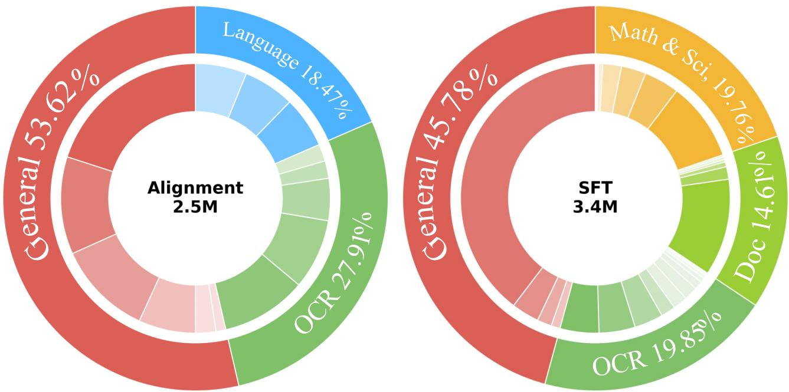  
Figure 6. The details of our training datasets.

## B. Latent Space Visualizations

We visualize the internal mechanisms of our model using a specific case from ScienceQA, as shown in Figure 7. To analyze convergence behavior, Figures 8 and 9 compare the evolution of latent states toward a steady state, while Figures 10 and 11 trace the specific trajectories of hidden states during inference for both the baseline (r=32, w/o Hier,) and HIVE.

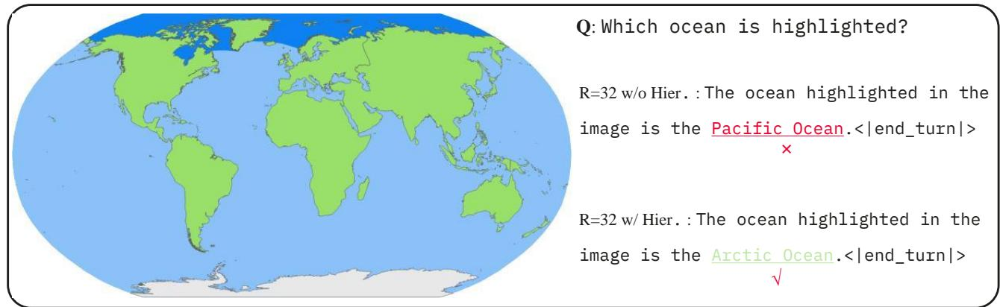  
Figure 7. A case from ScienceQA, where the question has been modified as a QA.

## C. Test-time scaling Results

The performance gains achieved through increased computational budget during inference are quantified in this section.   
Figure 12 visualizes the trends of model accuracy relative to scaling parameters at test-time.

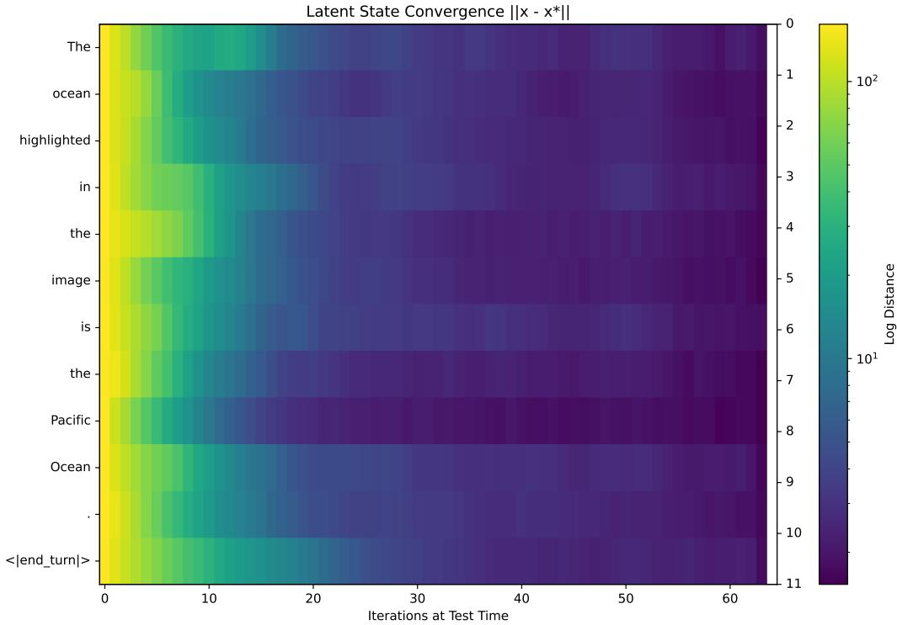  
Figure 8. The visualization shows the evolution of latent states as a function of token position (vertical axis) and iteration depth (horizonta axis) in the model variant (r=32, w/o Hier,). Each cell represents the distance between a given iterate and its corresponding steady state, approximated at r = 32.

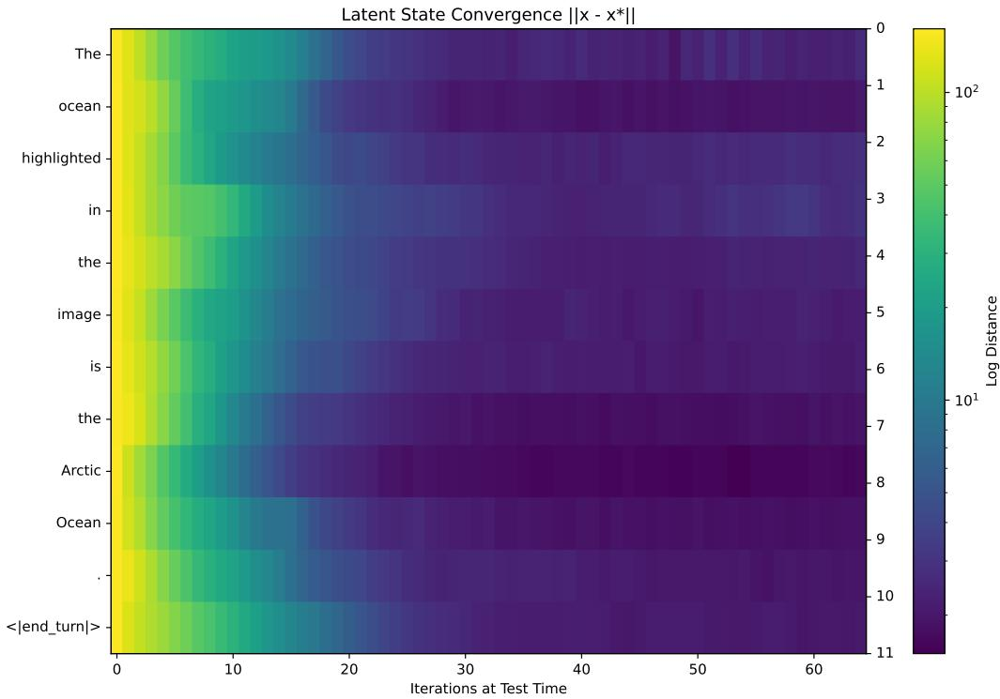  
Figure 9. The visualization shows the evolution of latent states as a function of token position (vertical axis) and iteration depth (horizontal axis) in the HIVE. Each cell represents the distance between a given iterate and its corresponding steady state, approximated at r = 32.

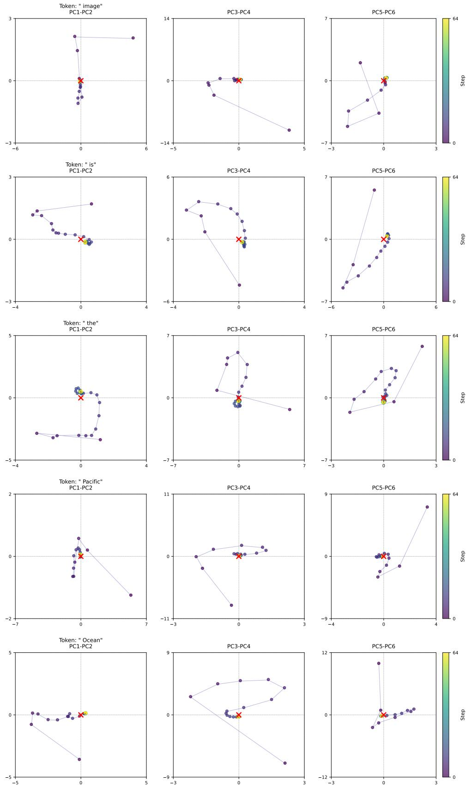  
Figure 10. Visualization of hidden state trajectories in the model variant (r=32 w/o Hier.) during inference.

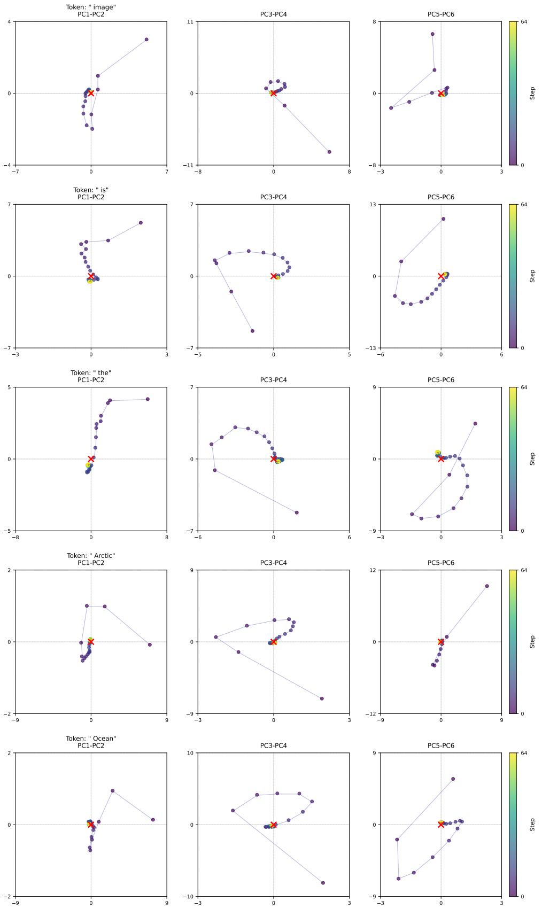  
Figure 11. Visualization of hidden state trajectories in HIVE during inference.

MMB  
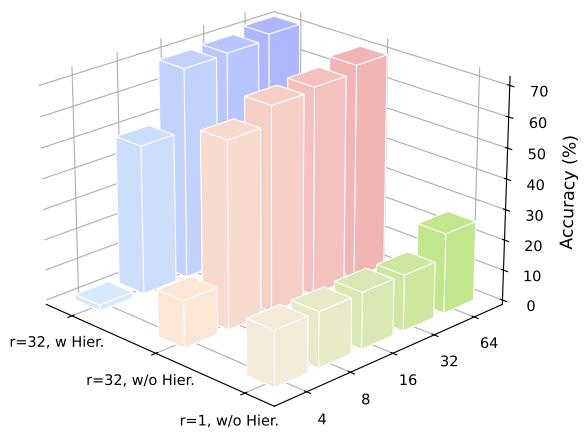  
MMStar

RealWorldQA  
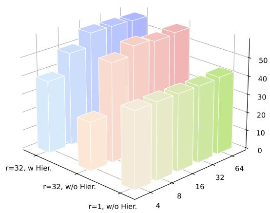  
ScienceQA

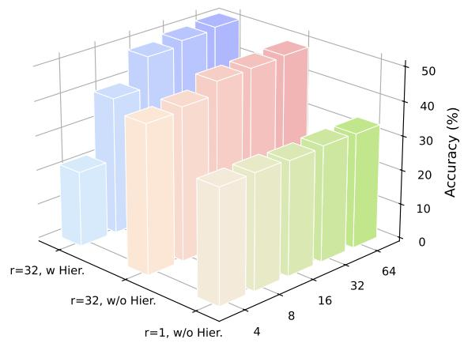  
Figure 12

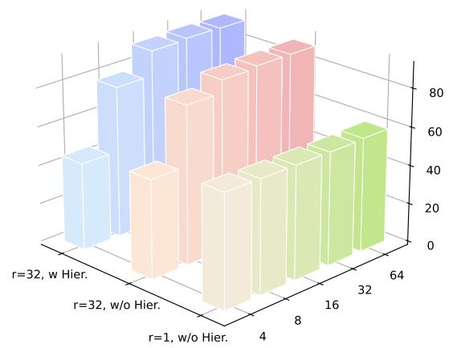