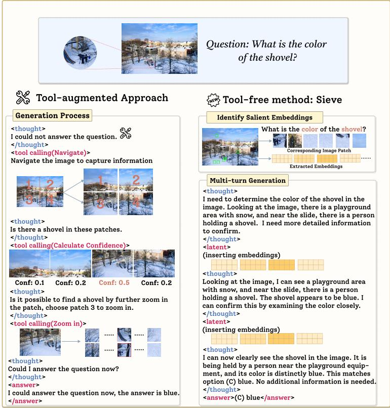

[← 返回 README](../README.md)

# Abstract & Figure 1

## 一、论文信息速览

| 项目 | 内容 |
|------|------|
| **标题** | Improving Visual Reasoing with Iterative Evidence Refinement |
| **作者** | Zeru Shi\*, Kai Mei\*, Yihao Quan, Dimitris N. Metaxas, Ruixiang Tang† |
| **单位** | Department of Computer Science, Rutgers University |
| **发表** | arXiv 2026 |

---

## 二、原始文本

Vision–language models (VLMs) are increasingly capable of reasoing over images, but robust visual reasoing often requires re-grounding intermediate steps in the underlying visual evidence. Recent approaches typically rely on external image operations such as zooming or cropping to re-access fine-grained details during inference, which requires additional image re-encoding and can disrupt the reasoing trajectory. We argue that VLMs already provide strong internal signals for identifying and reusing visual evidence, and that these signals can be directly leveraged to support image-grounded reasoing. Motivated by this insight, we propose an end-to-end self-revisit framework, SIEVE, that trains models to re-engage image evidence through internal representations. SIEVE automatically extracts embeddings of salient image regions and injects them into the reasoing chain when additional grounding is needed, enabling later steps to condition on relevant visual cues without external tool calls or re-encoding. We use reinforcement learning to teach the model when to trigger visual revisiting and which region embeddings to retrieve and insert during the reasoing process. Experiments on multiple visual reasoing benchmarks, together with perception, reasoing, and hallucination evaluations, show that SIEVE yields consistent gains, improving performance by 8% on average across several benchmarks.

> 💡 **一句话概括**: SIEVE 是一个端到端的 self-revisit 框架，核心主张是"VLM 内部信号已经足够强"——无需外部工具做 crop/zoom，而是直接从隐状态中提取显著区域的 embedding 并按需注入推理链，通过 RL 训练让模型学会"何时回头看"和"看哪里"。

---

*Figure 1: This figure compares tool-augmented methods with SIEVE. The left shows tool-based reasoing, where external tools are invoked for additional visual information. The right shows SIEVE, which directly retrieves and injects key region embeddings into the reasoing process.*

> 💡 **Figure 1 批读 — 两种范式的根本分歧**: 
> - **左图 (工具增强范式)**: 推理过程 → 遇到不确定性 → 调用外部工具 (crop/zoom) → 重新编码新的图像 view → 作为**额外输入**追加到原图后 → 继续推理。问题在于：(1) 新 view 不是插入到 CoT 对应位置，而是追加到输入尾部，打断了推理的语义连贯性；(2) 每次 re-encoding 都增加延迟。
> - **右图 (SIEVE)**: 推理过程 → 遇到不确定性 → 直接检索并注入 **已有编码**的 region embedding → 继续推理。关键差异：(1) 证据嵌入是**在原位置插入**推理链的，而非追加在输入末端；(2) 不需要 re-encoding，只是"翻找"已有的表示。
> - **本质分歧**: 工具增强派认为"需要生成新的视觉信息"；SIEVE 派认为"已有的视觉信息就够了，瓶颈在于不会回访"。

> 💡 **问题动机深层解读**: VLM 在自回归生成中存在一个被忽视的问题——**视觉信息的逐渐衰减**。随着生成 token 变长，模型对最初输入的 image token 的 attention 越来越弱，文本 token 的自回归历史逐渐占据主导。这是一个 architecture-level 的瓶颈，不是"模型不够强"的问题。外部工具试图通过"重新看"来解决，但 SIEVE 更优雅：让模型学会在需要时回到初始编码中去"翻"。

---

## 三、Summary

- **核心问题**: VLM 长链推理中视觉证据逐渐被遗忘，"越生成越不看图"
- **核心假设**: VLM 的初始编码已包含足够丰富的视觉信息，问题在于模型不会选择性回访
- **核心方案**: SIEVE = 内部显著性区域 embedding 提取 + 动态注入推理链 + RL 训练调用策略
- **核心优势**: 无外部工具、无图像重编码、数据高效 (~1.5k samples)、多 benchmark 一致提升 ~8%
