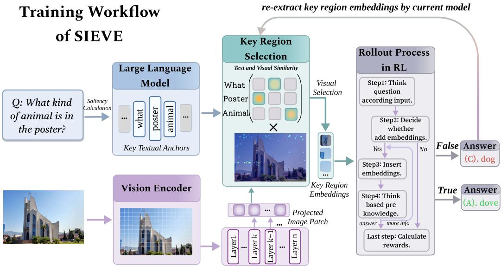

[← 返回 README](../README.md)

# 3. Methodology

## 一、Preview

SIEVE 的方法论分为两个阶段：(1) Pre-training 阶段：通过梯度显著性 + 跨模态匹配自动发现并缓存视觉证据（Section 3.2, Algorithm 1）；(2) Training 阶段：通过 GRPO 强化学习训练模型"何时插入 evidence"及"插入哪个 region 的 evidence"（Section 3.3）。Figure 3 展示了完整的训练闭环：evidence cache 会随着模型参数的更新而周期性刷新。

---

## 二、原始文本

Our core hypothesis is that the visual embeddings produced by a VLM already encode sufficient information for complex visual reasoning, provided the model can access the appropriate localized evidence at the right moment. To validate this hypothesis, we conduct a controlled study on the V\* dataset examining whether region-level visual features can directly enhance multimodal inference. Concretely, we manually identify task-relevant regions, extract their corresponding embeddings, and augment inference by inserting these region embeddings with the model's original visual embeddings, all without any additional training. We evaluate this intervention against the standard setting that relies solely on global image. As shown in Figure 2, region-augmented inference yields a 3% improvement, confirming that localized embedding evidence provides a compact yet effective signal that the model can immediately leverage. This finding aligns with prior work demonstrating that LLM hidden states encode rich semantic structure [Skean et al., 2025, Schiekiera et al., 2026, Liu et al., 2024].

> 💡 **Figure 2 批读 — 手动证据注入的实证基础**: 这个 3% 的提升是整个方法论的基石。有几层含义需要解读：(1) 全局图像 + region embedding > 仅全局图像，说明 region 提供了**互补的细粒度信息**；(2) 不需要额外训练就能从 region embedding 中获益，说明 VLM 的表示空间天然支持这种跨表示的信息融合；(3) 3% 是一个 lower bound——手动选择的 region 不一定最优，自动化证据发现（SIEVE 后续做的事）应该能超越这个数字。
>
> **理论支撑**: 引用 Skean et al. (2025), Liu et al. (2024) 等关于中间层语义丰富性的工作，为 "为什么中间层的 embedding 值得复用" 提供了理论背书。

Motivated by this observation, we introduce SIEVE, a framework that treats task-relevant region embeddings as reusable visual evidence and learns to incorporate them within RL policy optimization. Specifically, SIEVE (i) extracts and caches region embeddings as compact evidence units and (ii) jointly optimizes how such evidence is selected and integrated into the model's reasoning process throughout reinforcement learning. Section 3.1 presents an overview of the training pipeline. Section 3.2 details our automatic evidence discovery procedure. Section 3.3 introduces a visually grounded RL formulation that trains the model to retrieve and insert cached region embeddings on demand, enabling systematic evidence-aware reasoning beyond global visual representations.

*Figure 3: Training workflow of SIEVE. For each question, the embeddings of image patches aligned with key textual anchors are extracted and cached as visual evidence. During RL rollouts, the policy learns when to insert this evidence into the reasoning stream, with rewards computed from the final answer. Embeddings of visual evidence are periodically re-extracted using the updated model to keep the evidence aligned with the evolving policy.*

> 💡 **Figure 3 批读 — 训练闭环的三个关键环节**:
> 1. **证据预提取 (左上)**: 对每个 question-image 对，自动识别关键区域并缓存其 embedding。这个缓存是训练过程中被**周期性刷新**的——因为模型参数在变，同一个区域的 embedding 也会变。
> 2. **RL Rollouts (中)**: 模型生成推理链，在需要额外视觉信息时触发 evidence 插入。这是一个序列决策问题：每步决定是否插入 evidence → 插入后继续推理 → 可能再次触发插入 → 直到给出答案。
> 3. **Reward 反馈 (下)**: 答案正确性 + 格式规范性 + evidence 使用有效性 → 更新 policy。如果模型用了 evidence 但答错了，说明 evidence 可能 misaligned，触发重新提取。
>
> **关键设计 — evidence 的周期性刷新**: 这是 SIEVE 训练流程中最容易被忽视但最重要的设计。模型参数在 RL 过程中持续变化，同一个区域的 hidden state 表示也在变化。如果缓存的是旧模型的 embedding，但当前模型已经迁移，evidence 就会失效。周期性刷新确保 evidence 始终与当前 policy 对齐。

### 3.1 Overview of SIEVE

Figure 3 illustrates the training workflow of SIEVE. Prior to training-time rollouts, we construct embeddings of visually salient regions through a two-stage process. On the textual side, we compute token-level saliency scores to identify the tokens that exert the greatest influence on subsequent generation. These salient tokens serve as semantic queries. On the visual side, we compute crossmodal similarity between each query token and the image patch representations to localize the most relevant spatial regions.

> 💡 **Evidence Discovery 的两阶段设计**: Textual Anchor → Visual Evidence 的映射关系。先用梯度找到"模型最在意的词"，再在图像 patch 中找到与这些词最对齐的区域。这个 pipeline 完全自引导 (self-guided)，不需要任何外部模型或人工标注。

Algorithm 1 Self-Guided Visual Evidence Discovery
Require: Multimodal model M; image I; token embeddings {$h_{i}$}; u, v row and column coordinates of the patch.
Ensure: Evidence snapshot set E
Run M(I, {$h_{i}$}) to obtain logits $z_{L}$ and hidden states {H^(ℓ)}
v̂ = argmax_v $z_{L}$[v], s = $z_{L}$[v̂]  // choose prediction target
Sal(i) = ||∇_{$h_{i}$} s ⊙ $h_{i}$||_2, A = Filter(Sal)  // identify salient textual anchors
H̄ = (1/|$L_{mid}$|) $Σ_{{ℓ∈$L_{mid}$}}$ H^(ℓ)  // stabilize cross-modal representations
Extract patch tokens X = {$x_{j}$} and anchor token reps {$q_{i}$} from H̄.
Normalize x̂_j = $x_{j}$ / ||$x_{j}$||_2, q̂_i = $q_{i}$ / ||$q_{i}$||_2; initialize E = ∅.
for i ∈ A do
    $s_{ij}$ = cos(q̂_i, x̂_j), $w_{ij}$ = exp($s_{ij}$/τ) / $Σ_{u}$ exp($s_{iu}$/τ)  // anchor–patch affinity
    S($B_{i}$) = max_{u,v∈$B_{i}$} $s_{{u,v}}$, B* = TopK({S($B_{i}$)})  // score blocks and select top-k
    $R_{i}$ = BBox(⋃_{B∈B*} B)  // merge selected blocks into a region
    $E_{i}$ = Concat $x_{j}$  // concatenate all patch embeddings in region $R_{i}$
    E ← E ∪ {$E_{i}$}
end for
return E

> 💡 **Algorithm 1 逐行批读 — 最核心的算法**:
>
> **步骤 1: 前向传播** `Run M(I, {$h_{i}$})`
> - 对输入 (image + text) 做一次完整的前向传播，获取最后位置的 logits 和所有层的 hidden states。
> - 注意：这里用的是**完整输入**（image + question），不是仅图像。因为锚点需要在**任务上下文**中被识别。
>
> **步骤 2: 预测目标选择** `v̂ = argmax $z_L$, s = $z_{L}$[v̂]`
> - 选取模型在最后一个输入位置**最可能预测的下一个 token** 作为优化目标。
> - 这是一个精妙的设计：用模型自己的预测倾向来定义"什么重要"，而不是用 ground truth answer。这保证了自引导的纯粹性。
>
> **步骤 3: 梯度显著性** `Sal(i) = ||∇_{$h_{i}$} s ⊙ $h_{i}$||_2`
> - 计算每个 input token 对预测目标 s 的梯度大小。梯度越大 → 模型输出对这个 token 越敏感 → 这个 token 越重要。
> - `⊙ $h_{i}$` 的 element-wise product：Simonyan et al. (2013) 的 gradient×input 方法，比纯梯度更能反映 token 的实际贡献（因为同时考虑了梯度和表示大小）。
> - **Filter(Sal)**: 过滤 stop words + 保留超过阈值的 content-bearing tokens → 得到 textual anchors。
>
> **步骤 4: 中层表示稳定化** `H̄ = mean(ℓ ∈ $L_mid$) H^(ℓ)`
> - 对中间层的 hidden states 取平均。为什么是中间层？Section 4.4.2 的 IHR 实验给出实证支持：中间层同时具有足够的语义抽象和空间保真度。
>
> **步骤 5: 跨模态匹配** `$s_{ij}$ = cos(q̂_i, x̂_j) → $w_ij$ = softmax($s_{ij}$/τ)`
> - 在**同一个** H̄ 中提取 anchor 表示 $q_i$ 和 patch 表示 $x_j$，做 cosine similarity + temperature-scaled softmax。
> - 关键前提：VLM 中 text token 和 image patch token 在**同一个表示空间**中（经过 projector 对齐后），可以直接比较。
>
> **步骤 6: 块评分与选择** `S($B_i$) = ma$x_{u,v∈$B_{i}$}$ $s_{u,v}$ → B* = TopK({S($B_i$)})`
> - 将 patch 映射到 H×W 网格，对每个 block 取最大 similarity 作为该 block 的得分。
> - TopK 选取得分最高的 block(s)。默认 K=1（Section 4.4.2 和 Appendix B 验证了 K=1 最优）。
>
> **步骤 7: 区域构建与嵌入缓存**  $R_{i}$ = BBox(⋃ B*) → $E_i$ = Concat $x_{j}$ 
> - 将选中的 block(s) 合并成 bounding box 区域，并可能进行扩张（expand）——补全对象边缘（因为 patch grid 可能与 object boundary 不对齐）。
> - 拼接该区域内所有 patch 的 embedding 作为 evidence snapshot。
> - **关键操作**: $E_i$ 是**拼接** (concat) 而非池化 (pooling)——保留了所有 patch 的空间信息，让模型在注入时能看到完整的区域表示。
>
> **批判性审视 — 锚点质量的潜在风险**:
> 1. 如果模型本身 poorly calibrated（尤其在 RL 训练初期），`v̂` 的预测可能不稳定，导致锚点选择波动大。
> 2. Gradient×input 的显著性受 token 频率影响——高频的 function words 虽然被 stop-word filter 过滤了，但一些高频 content words（如 "color", "object"）可能获得不成比例的高显著性。
> 3. K=1 虽然是实验最优的，但对于需要多对象对比的推理任务（如 "A 和 B 哪个更大"），单区域可能不够。

### 3.2 Self-Guided Visual Evidence Identification

A central challenge in constructing visual evidence lies in determining what to store: the embeddings must capture precisely the visual information that the model would need to revisit during reasoning, without relying on manual annotation or task-specific heuristics. We address this through a two-stage self-guided visual evidence identification pipeline, which is illustrated in Algorithm 1. First, the model introspects on its own predictive process to surface the most prediction-critical tokens as textual anchors. Subsequently, we ground these anchors onto spatially coherent image regions via cross-modal matching within the model's internal representation space.

> 💡 **核心挑战 — "存什么"比"怎么存"更难**: 这个 sentence 点出了 evidence-based 方法的本质难度：如果你存的 evidence 不是模型真正需要的，注入再多也无效。SIEVE 的回答是"去问模型自己"——通过梯度显著性让模型告诉你哪些 token 对它而言最关键，然后去图像中找这些 token 的视觉对应区域。

#### 3.2.1 Discovering Textual Anchors via Gradient Saliency

Rather than relying on external concept taggers or handcrafted keyword lists, we derive anchors directly from the model's own predictive dynamics. Our primary signal is token-level gradient saliency: if a token is critical to the model's next-step prediction, the output logit will exhibit high sensitivity to perturbations of that token's embedding, manifesting as a large gradient magnitude. This yields an importance landscape over input tokens, from which we select the most influential ones as anchors. Formally, let the multimodal model produce logits $z_{L}$ ∈ R^{|V|} at the last input position L, where V is the vocabulary. Let v̂ = argmax_{v∈V} $z_{L}$[v] denote the predicted next token, and define the scalar target s = $z_{L}$[v̂]. We compute a saliency score for each input token embedding $h_{i}$ ∈ R^d as

Sal(i) = ||∇_{$h_{i}$} s ⊙ $h_{i}$||_2      (1)

where ⊙ denotes element-wise multiplication. This gradient–input formulation captures both the sensitivity of the prediction (via the gradient) and the magnitude of the representation (via $h_{i}$), ensuring that high saliency reflects genuine dependence of the model's output on token i. Since raw saliency scores often assign non-trivial weight to function words (e.g., the, is) that carry limited semantic content, we apply a stop-word filter and retain only content-bearing tokens whose saliency exceeds a predefined threshold. The surviving tokens constitute our textual anchors, i.e., the semantics that the model implicitly treats as pivotal to its reasoning (e.g., objects, attributes, or spatial relations). These anchors subsequently serve as queries for visual grounding.

> 💡 **Eq (1) 批读 — 梯度显著性公式**:
> - ∇_{$h_{i}$} s: 预测目标 s 对 token i 的 embedding 的梯度。物理意义：如果轻微扰动这个 token 的 embedding，预测结果会变多少。
> - ⊙ $h_i$: 乘以 token 自身的 embedding。物理意义：不仅考虑敏感性，还考虑该 token 的表示本身有多强。
> - ||·||_2: L2 norm 将向量转化为标量分数。
> - **与标准 saliency 的区别**: 标准的 gradient saliency 只用 ||∇_{$h_{i}$} s||_2，而这里加入了 $h_i$ 的乘法项——这是一个 gradient×input 的变体，更好地反映了 token 对预测的**实际贡献**（而不仅仅是局部敏感性）。
>
> **Stop-word 过滤的必要性**: 论文坦诚指出 function words 如 "the", "is" 可能获得非平凡的高显著性——因为这些词在序列中位置靠前、参与了大量 self-attention 计算。不滤波会导致锚点被虚词占据，从而定位到不相关的图像区域。这个设计细节是实际工程中不可或缺的。

#### 3.2.2 Identifying Visual Evidence with Textual Anchors

Given the textual anchors, we localize their corresponding visual regions by matching the internal hidden representations of text tokens and image patch tokens within the model's joint multimodal space, where both modalities reside in the same representation space and can therefore be directly compared. Our approach operates on intermediate-layer representations, where cross-modal semantics exhibit more explicit alignment.

Let H^(ℓ) ∈ R^{L×d} denote the hidden states at layer ℓ, for ℓ = 1, ..., L. Prior work has shown that middle layers tend to capture richer semantic representations than either early or later layers Skean et al. [2024, 2025]. We accordingly compute a stabilized representation by averaging middle layer's hidden states with: H̄ = (1/|$L_{mid}$|) $Σ_{{ℓ∈$L_{mid}$}}$ H^(ℓ). Both modalities are obtained from the same H̄ by indexing the corresponding token positions. Let X ∈ R^{N×d} denote the patch-token representations and q ∈ R^d the representation of a textual anchor token.

To ensure robust similarity computation, we apply mean-centering and ℓ_2 normalization to both the patch tokens and the anchor, yielding normalized vectors {x̂_i} and q̂. We then compute anchor–patch affinity via cosine similarity: $s_{i}$ = cos(x̂_i, q̂) i = 1, ..., N, and convert the affinities into a temperature-scaled softmax distribution:

$w_{i}$ = exp($s_{i}$/τ) / $Σ_{j}$ exp($s_{j}$/τ)      (2)

We leverage this distribution to extract a spatially coherent region. Specifically, we map patch tokens onto the H×W patch grid and compute each block's score as the maximum similarity within the block: $s_{b}$ = max_{j∈$B_{b}$} $w_{ij}$, where $B_{b}$ denotes the set of patches in block b. We then select the top-K scoring blocks $B_{i}$ = TopK({$s_{b}$}), and expand each selected block by computing the bounding rectangle of the selected patches. We set k to 1, and further discussion it in the B. We evaluate the similarity of these patches with their corresponding textual anchors and retain the highest-scoring one as the expanded block $R_{i}$ = Expand(B̄_i). The embeddings of patches within each region are then aggregated to form a region-level snapshot: $E_{i}$ = Concat_{j∈$R_{i}$} $x_{j}$. The resulting region embeddings are cached as evidence snapshots and stored alongside each training sample. These embeddings constitute reusable visual evidence that can be dynamically inserted into reasoning during the rollout process.

> 💡 **跨模态匹配的几点关键设计**:
>
> 1. **同一表示空间的前提**: VLM 中 text token 和 image patch token 经过 projector 后处于同一表示空间——这也是 VLM 能够做多模态理解的基础。SIEVE 利用了这个既有属性，不需要额外的对齐模块。
>
> 2. **中间层的双重要求** (semantics + spatial): 中间层需要同时满足两个条件：(a) text token 具有足够的语义信息来描述 anchor (如 "dog" 的语义而不是 tokenization artifact)；(b) image patch token 仍保留足够的空间信息来定位 (浅层太 noisy，深层太 task-biased)。这个 trade-off 在 Section 4.4.2 的 IHR 实验中被量化验证。
>
> 3. **Temperature τ 的作用** (Eq.2): temperature-scaled softmax 控制相似度分布的 sharpness。τ 越小 → 分布越尖锐 → 更偏向最高相似度的 patch → 区域更集中但可能漏掉对象边缘。τ 越大 → 分布越平滑 → 区域更分散但可能引入无关 patch。论文没有给出 τ 的具体值，这是一个关键的超参数。
>
> 4. **Block scoring 的 max 操作**: 每个 block 的得分为块内最大 patch similarity。使用 max 而非 mean 的直觉是：只要块内有一个 patch 与 anchor 高度对齐，整个块就值得关注。这避免了块内低相似度 patch 稀释得分。
>
> 5. **Expand 操作的必要性**: Qwen-VL 使用 patch-based segmentation，patch grid 可能与对象边界不对齐。Expand 通过取 bounding box 来覆盖因 patch 划分而被截断的对象部分。但这个 expand 也会引入一些边界外的噪声 patch——论文在 Section 4.4.2 和 Appendix B 中讨论了这种噪声累积效应（K 越大噪声越多）。

### 3.3 Visual-grounded Reinforcement Learning

Existing tool-augmented thinking-with-images methods [Zheng et al., 2025, Hong et al., 2025, Zhang et al., 2025b] enlarge the action space with external tool calls and require image re-encoding at every reasoning step. Since SIEVE simply reuses embeddings already produced by the vision encoder and projected into text space, it sidesteps these issues entirely and we can formalize the reasoning as shown in Equation 3, where the policy selects the next action conditioned on the original image and the full interaction history, including both generated text and any previously inserted visual evidence, accumulated up to the current step:

$a_{t}$ ~ $π_{θ}$(· | $s_{t}$),   $s_{t}$ ≜ I || ($x_{1}$ || $E_{1}$) || ... || ($x_{{t-1}}$ || $E_{{t-1}}$)      (3)

Here, I denotes the input image, $x_{t}$ is the text generated by the model, and $E_{t}$ is the embeddings of visual evidence inserted at turn t (with $E_{t}$ = ∅ when no insertion occurs). Thus, $s_{t}$ represents the accumulated context: the raw image followed by all preceding textual responses and inserted evidence blocks in temporal order. Conditioned on $s_{t}$, the policy samples the next action $a_{t}$, either terminating with a final answer or triggering insertion of the cached visual evidence. The rollout terminates when a final answer is produced or when a predefined maximum number of turns is reached.

> 💡 **Eq (3) 批读 — 序列决策形式化**:
> - `I`: 原始图像 (不变的全局上下文)
> -  $x_{t}$ : 模型在 turn t 生成的文本
> -  $E_{t}$ : turn t 注入的 evidence embedding (可能是空集 ∅)
> - `||`: 序列拼接
> - **关键设计**: $E_t$ 是**插入**在 $x_t$ 之后的——它与文本 token 在序列中**交错排列** (interleaved)。这与工具增强方法中 "new view 追加在输入前端" 形成鲜明对比。
> - **与 CoT 的关系**: $x_t$ 可以包含推理文本 (如 "Let me check the color of the object...")，然后 $E_t$ 提供该对象的 region embedding。这在语义上是自然的——"我想看看 X" → X 的 embedding 被注入 → 继续推理。

Trajectory-level reward design. We design a trajectory-level reward function that holistically evaluates the quality of the complete reasoning path. The reward comprises four complementary components, each yielding a binary score of 1 (satisfied) or 0 (violated). Given a trajectory τ, the total reward is:

R(τ) = $λ_{1}$ $R_{res}$(τ) + $λ_{2}$ $R_{fmt}$(τ) + $λ_{3}$ $R_{emb}$(τ) + $λ_{4}$ $R_{act}$(τ)      (4)

where the λ values are scaling coefficients. In our experiments, we set $λ_{1}$ = 0.6, $λ_{2}$ = 0.3, $λ_{3}$ = 0.5 and $λ_{4}$ = 0.2. Each component targets a distinct aspect of the desired behavior:

• Format reward ($R_{fmt}$) promotes well-structured outputs. For single-turn trajectories, the full reward is granted only if the model produces a valid reasoning chain followed by a final answer. For multi-turn trajectories, obtaining the full reward additionally requires an explicit embedding selection during an intermediate turn. Any structural violation results in a zero format reward.

• Result reward ($R_{res}$) evaluates the correctness of the final answer, serving as the primary learning signal for reasoning quality.

• Embedding reward ($R_{emb}$) is activated exclusively when the model produces a correct final answer and invokes embedding insertion at least once during intermediate reasoning steps. This bonus incentivizes the model to actively leverage visual evidence when it is beneficial for task resolution, rather than bypassing the available evidence.

• Action reward ($R_{act}$) improves training stability in two ways: (i) it penalizes overly short reasoning traces that could hack the reward, and (ii) it provides a small positive reward for committing to an action, either retrieving an embedding or producing an answer, which discourages the policy from collapsing into "non-committal" outputs that avoid taking actions.

> 💡 **Eq (4) 批读 — 四维 Reward 设计的精妙之处**:
>
> | Reward 组件 | 权重 | 触发条件 | 设计意图 |
> |------------|------|---------|---------|
> | $R_fmt$ (格式) | 0.3 | 有效推理链 + 最终答案 | 防止模型输出非结构化内容 |
> | $R_res$ (结果) | 0.6 | 答案正确 | 主要正确性信号 |
> | $R_emb$ (嵌入) | 0.5 | 答案正确 **且** 使用了 evidence | 鼓励 "evidence 有价值时才用"——防止模型学会不使用 evidence 也能答对就不用了 |
> | $R_act$ (动作) | 0.2 | 有实质推理内容 + 做出确定动作 | 防止空白推理 + 防止策略坍塌为 no-op |
>
> **关键设计意图**:
> 1. **$R_emb$ 的条件激活**: 只有答对且用了 evidence 时才给 bonus。这意味着如果模型没用 evidence 也答对了——不给 bonus（虽然可以得 $R_res$ + $R_fmt$）。这创造了一个"鼓励尝试 evidence"的机制：evidence 方案可能让你赚到额外的 0.5 分，但如果 evidence 导致你答错，你会失去 0.6。
> 2. **权重排序的合理性**: $R_res$ (0.6) > $R_emb$ (0.5) > $R_fmt$ (0.3) > $R_act$ (0.2)。正确性权重 > evidence 使用权重 > 格式权重 > 动作权重——这意味着"用 evidence 但答错"不如"不用 evidence 但答对"。这是一个务实的设计，避免了 RL 训练中 reward hacking。
> 3. **$R_act$ 的双重功能**: 防止两个极端——(a) 模型输出 `<think> </think>` 空的推理标签就匆匆给出答案（被 thought richness penalty 捕获）；(b) 模型一直不给出确定答案，无限循环（被 commitment reward 鼓励做出明确决策）。

---

## 三、Summary

- **Phase 1 — Evidence Discovery**: 梯度显著性找锚点 → 中间层跨模态匹配找区域 → 拼接 patch embedding 作为 evidence snapshot 缓存
- **Phase 2 — Visually-Grounded RL**: 序列决策形式化 (Eq.3) → 四维 trajectory-level reward (Eq.4) → GRPO 优化 → evidence 缓存周期性刷新
- **设计哲学**: 自引导 (模型自己的梯度告诉你什么重要)、轻量化 (no external tool, no re-encoding)、解耦 (evidence 发现与 policy 学习分离但协同)
