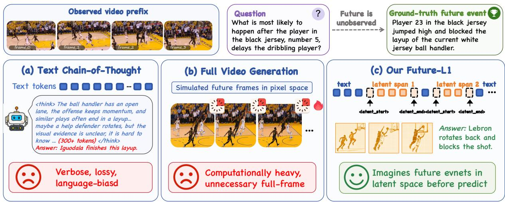

[← 返回 README](../README.md)

# Abstract & Figure 1

## 一、Preview

本文提出了 FUTURE-L1，一种面向视频事件预测 (VEP) 的交错式潜空间视觉推理框架。其核心动机是：现有 MLLM 将未来推理全部文本化，导致细粒度运动、几何、交互等视觉信息丢失；而本文主张通过潜空间中连续的视觉表示来保留这些动态语义，文本仅负责组织推理结构和输出最终答案。

---

## 二、原始文本

Video event prediction (VEP) requires models to infer unobserved future states from partial video evidence. Existing video MLLMs usually verbalize intermediate future reasoing in text space: once visual evidence is verbalized, fine-grained motion, geometry, and interaction cues can be lost, leading to plausible but visually ungrounded hallucinations. We introduce FUTURE-L1, an interleaved latent visual reasoing framework that lets an MLLM alternate between language tokens and continuous latent visual spans during autoregressive decoding. To train this capability, we construct FUTURE-L1-50K by selecting examples where future visual hints help prediction and align latent states to future-frame embeddings, then further optimize sampled latent trajectories with LA-DAPO, a latent-aware RL objective with outcome-contrastive and temporal-diversity rewards. FUTURE-L1 achieves new state-of-the-art results on both benchmarks: on FutureBench, it improves Qwen3-VL-8B from 61.0 to 85.4 and exceeds the previous best Video-CoE by 10.4 points; on TwiFF-Bench, it improves the average score from 2.44 to 3.04. These results suggest that future-oriented video reasoing benefits from preserving intermediate visual semantics in latent space rather than translating every reasoing step into text.

> 💡 **一句话概括**: FUTURE-L1 的核心主张是：对于视频事件预测这类需要想象"尚未发生的动态视觉状态"的任务，**潜空间连续表示是比文本更好的推理介质**——文本化会丢失几何/运动/交互等细粒度视觉信息，而潜空间能保留这些动态语义。为此，FUTURE-L1 设计了"交错文本-潜视觉"的自回归解码方式 + visual-gain 数据筛选 + 潜空间感知 RL，在两大 VEP benchmark 上大幅刷新 SOTA。

---

*Figure 1: Motivation of interleaved latent visual reasoing. Text-CoT can be verbose and visually lossy, while pixel-space future simulation is computationally heavy. FUTURE-L1 instead inserts compact latent visual spans that preserve dynamic future semantics without generating full frames.*

> 💡 **Figure 1 批读**: 这张动机图展示了三种未来推理方式的对比：
> - **Text-CoT**（红色）: 将所有中间推理步骤写成长文本，不仅冗长而且会丢失视觉细节（"visually lossy"）
> - **Pixel-space simulation**（蓝色）: 直接生成未来帧图像——视觉信息完整但计算代价极高
> - **FUTURE-L1**（绿色）: 在文本推理中插入紧凑的潜视觉 span，既保留了动态未来语义，又避免了生成完整帧的计算开销
>
> 这是一个经典的 **trade-off 三角平衡**: 文本效率高但信息丢失、像素生成信息全但代价大、潜空间表示是两个极端之间的最优折中。

---

## 三、Summary

- **核心问题**: VEP 需要推理未观察到的动态未来视觉状态，但文本化中间推理会丢失细粒度视觉语义，导致"听起来合理但视觉上无根据"的幻觉。
- **核心假设**: 在潜空间中保留中间视觉语义（而非每一步都转换为文本）有利于未来导向的视频推理。
- **核心方案**: FUTURE-L1 = 交错式文本-潜视觉自回归解码 + FUTURE-L1-50K (visual-gain 筛选 + 未来帧嵌入对齐) + LA-DAPO (outcome-contrastive + temporal-diversity 奖励)
- **核心结果**: FutureBench 61.0→85.4 (+24.4)，超 Video-CoE 10.4 分；TwiFF-Bench 2.44→3.04。

---

## 四、贡献结构一览

论文的三个核心贡献形成"数据-方法-优化"三层递进结构：

| 层面 | 贡献 | 解决的核心问题 |
|------|------|--------------|
| **数据层** | Visual-gain 筛选 + FUTURE-L1-50K | 什么样的训练样本能有效监督潜空间未来推理？（answer：未来视觉线索有可测量预测效用的样本） |
| **方法层** | 交错式潜视觉推理 | 如何在自回归框架中实现文本和潜视觉的交替推理？（answer：三个特殊 token 控制边界） |
| **优化层** | LA-DAPO | 如何在没有中间帧标注的情况下优化潜轨迹？（answer：outcome-contrastive + temporal-diversity rewards） |
