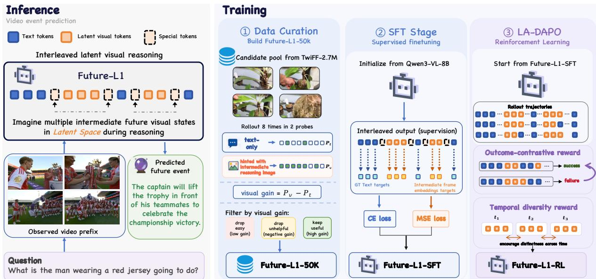

[← 返回 README](../README.md)

# 3. Method

## 一、Preview

Method 分为三个子模块：3.1 定义交错式潜视觉推理的机制（特殊 token + 动态潜预算）；3.2 描述 SFT 阶段的数据构建 (visual-gain curation) 和训练目标 (CE + MSE)；3.3 提出 LA-DAPO 及其两类潜空间感知奖励。三者的关系是：3.1 定义"怎么推理"，3.2 解决"冷启动"，3.3 解决"优化"。

---

## 二、原始文本

We propose FUTURE-L1, an interleaved latent visual reasoning framework for VEP. Given an observed video prefix V and question q, the model generates a response y by alternating textual reasoning, bounded latent visual spans, and a final answer. Training has two stages: SFT on FUTURE-L1-50K teaches when to invoke latent spans and aligns them with future-frame embeddings, while LA-DAPO further optimizes sampled latent trajectories with outcome-contrastive and temporal-diversity rewards. Figure 2 illustrates the pipeline.

### 3.1 Interleaved Latent Visual Reasoning

**Autoregressive Reasoning with Latent Visual Spans.** FUTURE-L1 augments a standard MLLM backbone (Bai et al., 2025a) with a latent visual reasoning channel using three special tokens: `<|latent_start|>`, `<|latent|>`, and `<|latent_end|>`. Generation begins in textual mode. Once `<|latent_start|>` is emitted, each following `<|latent|>` position produces a hidden state $h_{t}$ that is fed back as the next input embedding rather than projected to the vocabulary. These continuous states act as latent visual thoughts and remain in the KV cache to condition later textual reasoning. Generation returns to text when `<|latent_end|>` is emitted.

> 💡 **机制拆解 — 潜视觉 span 的工作原理**:
>
> 标准的自回归解码中，每个位置输出 hidden state → LM head → 词汇表分布 → 采样 token → token embedding → 作为下一位置的输入。这是"离散符号 → 离散符号"的链。
>
> FUTURE-L1 在潜视觉 span 内部做了一个关键的**短路**：
> - 输入：`<|latent|>` token → 模型前向 → hidden state $h_t$
> - 输出处理：**跳过 LM head（不投影到词汇表），直接将 $h_t$ 作为下一位置的输入 embedding**
> - 下一个输入：`<|latent|>` token + $h_t$ (前一步的 hidden state 作为 embedding 注入)
>
> 这样 $h_t$ 在 KV cache 中累积，持续影响后续的所有 token（包括后续的文本 token 和其他潜 span）。
>
> **为什么这个设计对 VEP 特别重要**：因为动态视觉状态需要在时间维度上累积和更新。每次潜状态更新都留在 KV cache 中 → 后来的文本 token 可以 "attend to" 之前所有的想象视觉状态。

**Dynamic Latent Budget at Inference.** Latent span length is not fixed: a span ends when the model emits `<|latent_end|>`. We cap each span by $L_{max}$ to avoid run-on latent decoding, and a response may contain multiple spans, allowing the model to allocate latent computation adaptively across reasoning stages.

> 💡 **设计细节 — 自适应潜预算**:
> - **不受控的灵活性**: span 长度由模型自己决定（通过生成 `<|latent_end|>`），无强制固定长度
> - **可控的安全性**: $L_{max}$ 上界防止潜在的无休止潜解码（类似于 LLM 生成中的 max_new_tokens）
> - **多处分配**: 一个回答可有多个 span → 模型可以在推理的不同阶段动态分配潜计算
> - **实验发现 (Section 4.3)**: $L_{max}$=4 效果最优；模型确实会在更难的问题上使用更多 span（1-Hop: 1.79 → 3-Hop: 2.52）

### 3.2 SFT with FUTURE-L1-50K

SFT provides a necessary cold start for latent reasoning by training on curated interleaved traces and aligning latent states with future-frame embeddings. This prevents the model from either avoiding latent spans or producing continuous states not grounded in meaningful visual manifold before RL.

> 💡 **SFT 的双重目标**: (1) **行为层面**: 训练模型在推理中正确使用 `<|latent_start|>` / `<|latent|>` / `<|latent_end|>` —— 何时开始、何时结束、每个 span 内生成多少潜状态； (2) **语义层面**: 通过 MSE 对齐确保潜状态位于有意义的视觉语义 manifold 上，而非任意向量。缺少任何一个目标都会导致 RL 阶段的 failure。

**Visual-Gain Data Curation.** We curate FUTURE-L1-50K from TwiFF-2.7M (Liu et al., 2026a), a VCoT corpus that provides intermediate reasoning frames. Unlike synthesized sketches or generic helper images, these frames are temporally later frames from the same authentic video, so they depict unseen future states that are physically consistent with the observed prefix. This makes them a natural supervision signal for latent visual reasoning: the model is not asked to imitate arbitrary visual hints, but to internalize future visual states that actually occur.

> 💡 **为什么用 TwiFF 数据**: TwiFF 提供的"中间推理帧"实际上是**同一视频中时间上的后续帧**——这些帧描绘的是物理上与观察前缀一致的未来的真实视觉状态。这比合成的草图或通用的辅助图像更适合作为潜空间未来视觉推理的监督信号——因为目标是让模型内部化"实际发生"的未来状态，而非任意视觉提示。

However, not every TwiFF sample provides useful supervision for VEP. Some examples are already easy to solve from the observed prefix alone, where extra future-frame hints add little value. Others remain ambiguous or uninformative even when a reasoning frame is provided. Training on them dilutes the signal that latent visual states should carry. We therefore filter examples by the marginal utility of their intermediate reasoning frames.

For each candidate, we evaluate Qwen3-VL-8B-Instruct under two conditions: (1) a text-only input with the observed video prefix and question; and (2) a hinted input that additionally includes the intermediate reasoning frames. Each condition uses 8 independent rollouts judged by Qwen3.5-397B-A17B. Let $p_{t}$, $p_{v}$ ∈ [0, 8] be the correct-rollout counts; we retain samples with $p_{t}$ ≤ 6, so the text-only setting is not saturated, and $p_{v}$ - $p_{t}$ ≥ 2, so the visual hint provides measurable lift. We rank retained samples by descending $p_{v}$ - $p_{t}$, and take the top 50,000 items as FUTURE-L1-50K. All retained samples are reformatted into the interleaved trajectory shown in Figure 3.

> 💡 **机制拆解 — Visual-Gain 筛选的完整流程**:
>
> ```
> For each TwiFF candidate:
>   在 Qwen3-VL-8B-Instruct 上做 2 组 × 8 次 rollout:
>     (a) 仅观察前缀 → $p_t$ (correct-rollout count)
>     (b) 观察前缀 + 未来推理帧 → $p_v$ (correct-rollout count)
>   筛选条件:
>     (1) $p_t$ ≤ 6 → 纯文本不能用太多正确（如果文本已饱和，visual hint 无价值）
>     (2) $p_v$ - $p_t$ ≥ 2 → visual hint 必须有可测量提升（至少多对 2 个 rollout）
>   排序: $p_v$ - $p_t$ 降序
>   取 top 50K
> ```
>
> **为什么这个指标设计合理**:
> - `$p_{t}$`：衡量问题本身的难度（文本条件下正确 rollout 数越低 = 越难 = 越需要视觉线索）
> - `$p_{v}$ - $p_{t}$`：衡量未来视觉线索的**边际效用**——增量越大说明这些帧确实提供了关键信息
> - 筛选出"需要未来视觉线索且未来视觉线索确实有帮助"的样本 → 训练信号质量最大化

> 💡 **关键设计 — 为什么"visual gain > 0"不够，要 ≥ 2？**: 8 次 rollout 中 1 次的增量可能是随机波动。≥2 的阈值提供了统计显著性保障。同时也不取太大（如 ≥5）以免过度筛选导致样本量不足。

**Training Objective.** SFT optimizes a joint objective over discrete text tokens and continuous latent visual states:

$L_{SFT}$ = $L_{CE}$ + λ $L_{Latent}$

where λ controls the strength of latent supervision.

For discrete positions (textual reasoning, answer tokens, special control tokens), standard next-token prediction:

$L_{CE}$ = -∑ log $p_{θ}$($w_{t}$ | w_<t, V, q)

For latent positions, each hidden state $h_{t}$ is aligned with the visual embedding e*_t of the corresponding future reasoning frame, extracted by the Qwen3-VL vision encoder:

$L_{Latent}$ = (1/|S|) ∑ ||$h_{t}$ - e*_t||²₂

This anchors latent spans to the future-frame manifold while preserving standard language modeling over the textual channel.

> 💡 **公式批读 — 联合训练目标的设计逻辑**:
>
> **$L_CE$ (交叉熵)**：和标准 LLM 训练一致——对文本 token 位置进行 next-token prediction。这保持了语言建模能力。
>
> **$L_Latent$ (MSE)**：对潜位置进行隐藏状态到未来帧视觉 embedding 的 L2 对齐。
> - 使用的视觉 encoder 与 backbone MLLM 相同 (Qwen3-VL vision encoder) → 在相同的表征空间中对齐
> - 每个潜位置对应一个未来推理帧 → "这个潜状态应该编码该未来帧的视觉语义"
>
> **λ = 0.1**：经验最优值。λ 太小 (0.01)→ 潜状态对齐不充分；λ 太大 (1.0) → 语言建模被挤压。这反映了 SFT 的主次关系：语言建模是主任务，视觉对齐是辅助约束。

> 💡 **Figure 2 对照**: 参见 00-abstract 和本文末尾的 Figure 2 详细分析。

### 3.3 LA-DAPO for Latent-Aware RL

SFT provides a grounded but teacher-forced initialization: each latent state is matched to a future-frame embedding, while sampled latent trajectories are not directly optimized for prediction success. We therefore introduce LA-DAPO (Latent-Aware Direct Advantage Policy Optimization), a latent-aware extension of DAPO (Yu et al., 2026a). LA-DAPO keeps DAPO's answer and format rewards, and adds two trajectory-level latent rewards: an outcome-contrastive reward that aligns latent trajectories associated with correct answers, and a temporal-diversity reward that discourages repeating the same visual thought across spans. Because these rewards depend on rollout outcomes and generated latent states, LA-DAPO can optimize latent reasoning without requiring intermediate-frame annotations during RL.

> 💡 **LA-DAPO 的核心价值**: RL 阶段不需要中间帧标注——signal 完全来自 answer correctness 和潜状态结构。这使得 LA-DAPO 可以在大规模无标注视频上进行 RL，而不受 SFT 阶段需要未来帧的限制。这是一个**监督信号解耦**的设计：SFT 用未来帧 embedding（强监督）、RL 用 answer reward（弱监督）——前者保证初始化，后者保证泛化。

**Outcome-Contrastive Latent Reward.** Answer rewards provide only a sequence-level scalar, leaving latent states weakly supervised. We introduce an outcome-contrastive reward $R_{ctr}$ that structures latent trajectories by group outcomes: correct rollouts are pulled together, while incorrect rollouts serve as negatives. Because the signal depends only on final-answer correctness, it does not require intermediate-frame annotations.

> 💡 **问题动机 — 为什么需要 $R_ctr$**: DAPO 的 answer reward 是一个 sequence-level 标量——所有 token 位置共享同一个 reward 信号。这意味着潜状态收到的梯度信号非常弱（特别是当序列中潜状态占比较小时）。$R_ctr$ 为潜状态提供了一种**结构化的轨迹级反馈**：正确的推理路径上的潜状态应该是相似的（它们在做相似的未来想象），而错误的路径上的潜状态应该不同。

Let $Z_{i}$ = [$z_{{i,1}}$, ..., z_{i,$T_{i}$}] be the normalized latent trajectory of rollout i, with correctness $a_{i}$ ∈ {0, 1}. We define trajectory similarity as:

$s_{ij}$ = (1/T) ∑ (1 + ⟨$z_{{i,t}}$, $z_{{j,t}}$⟩) / 2

where T = min($T_{i}$, $T_{j}$). Let $P_{i}$ = {j ≠ i : $a_{j}$ = 1}, $N_{i}$ = {j ≠ i : $a_{j}$ = 0}, and $s_{i}$^+ = max_{j∈$P_{i}$} $s_{ij}$. We use a hardest-positive InfoNCE reward:

$R_{ctr}$(i) = exp($s_{i}$^+ / τ) / (exp($s_{i}$^+ / τ) + ∑_{j∈$N_{i}$} exp($s_{ij}$ / τ))

> 💡 **公式批读 — $R_ctr$ 的对比学习设计**:
>
> **轨迹相似度 $s_ij$**: 按时间步对齐后计算余弦相似度，取平均。相似度在 [0, 1] 范围（1 代表完全相同）。
>
> **Hardest-positive**: $s_{i}$^+ = max($s_ij$ over all correct rollouts) —— 只与最相似的正确 rollout 比较，而不是平均。这样鼓励"至少有一条正确的潜轨迹与你相似"，给模型更多灵活性。
>
> **InfoNCE**: 对比学习标准形式 —— 分子是正例相似度的指数，分母是正例 + 所有反例相似度的指数和。最大化 $R_ctr$ 等价于最大化正例相对反例的区分度。
>
> **为什么不用简单的余弦相似度奖励**：直接的"让所有正确的潜轨迹相似"可能导致模式坍缩（所有正确轨迹变得一模一样）。InfoNCE 通过引入反例的对比迫使潜表示更具区分性，同时允许正确的多一些多样性。

> 💡 **设计细节 — hardest-positive 的选择**: 使用 hardest-positive 而非 closest-positive 或 average-positive：(1) closest-positive 可能引入噪音（可能是随机猜对但潜轨迹不相似的 rollout）；(2) average-positive 可能过于宽松，允许大量低质量潜轨迹；hardest-positive 取最大值确保至少有一条高质量正确的潜轨迹作为正锚点。

**Temporal Diversity Reward.** $R_{ctr}$ aligns trajectories across rollouts but imposes no structure within a rollout: a policy can still earn a high answer reward by emitting near-identical latent states at consecutive spans, collapsing the latent channel into a single visual thought repeated over time. Although SFT discourages this through frame-distinct supervision, this constraint is no longer present during RL. We therefore add a temporal diversity reward $R_{div}$ that encourages adjacent latent spans to represent distinct future updates. For a response with M latent spans, we mean-pool the latent vectors within span m into a representative $b_{m}$, and penalize adjacent-span similarity:

$R_{div}$ = - (1/(M-1)) ∑ cos²($b_{m}$, $b_{{m+1}}$)

This reward is maximized at 0 when adjacent span representatives are orthogonal and decreases as they become redundant.

> 💡 **公式批读 — $R_div$ 的设计直觉**:
>
> **Mean-pooling per span**: 将每个 span 内的所有潜向量取平均得到一个代表向量 $b_m$。这是合理的——同一 span 内的潜状态应该编码相似时间步的未来状态。
>
> **cos² 惩罚 (而非 cos)**: 使用平方有两个效果：(1) 始终为正数，避免 cos 为负时的奖励；(2) 对小相似度变化更敏感（导数在 0 附近更大），对已高度相似的惩罚斜率更大。
>
> **负号**: 最大化 $R_div$ 等价于最小化相邻 span 的相似度 → 鼓励时序多样性。
>
> **SFT 的对应**: SFT 中不同 span 对应不同时间步的未来帧 embedding——自然保证了多样性。RL 中没有这个约束，所以需要 $R_div$ 显式鼓励。

**Final Rewards.** The total target combines answer/format rewards and two latent terms:

R = $λ_{a}$ $R_{acc}$ + $λ_{f}$ $R_{fmt}$ + $λ_{c}$ $R_{ctr}$ + $λ_{d}$ $R_{div}$

where $λ_{c}$ and $λ_{d}$ are ablated in Section 4.

> 💡 **奖励权重设计**: $λ_a$=0.9, $λ_f$=0.1 (标准 DAPO 配置), $λ_c$=0.2, $λ_d$=0.1 (实验 4.2 消融得到的最优值)。注意 $λ_c$ > $λ_d$ —— 这反映了 outcome-contrastive 比 temporal-diversity 更核心：先保证"潜轨迹和答案正确性相关"，再保证"潜轨迹内部有时序多样性"。

---



*Figure 2: Overview of FUTURE-L1. (Left) FUTURE-L1-50K is built by ranking TwiFF candidates by visual gain $p_{v}$ - $p_{t}$. (Center) SFT trains interleaved text-latent trajectories, aligning latent spans with future visual states. (Right) LA-DAPO further optimizes sampled trajectories with outcome-contrastive and temporal-diversity rewards.*

> 💡 **Figure 2 批读**: 这张 overview 图展示了完整的三阶段 pipeline：
>
> **(Left) 数据阶段**: 从 TwiFF-2.7M 中通过 visual-gain (pv - pt) 进行候选人排序和筛选 → 保留 top 50K → 构造为交错式训练格式
>
> **(Center) SFT 阶段**: 输入观察前缀 V + 问题 q，输出交错式 text-latent 轨迹，用 CE loss (文本部分) + MSE loss (潜状态 → 未来帧 embedding 对齐)
>
> **(Right) LA-DAPO 阶段**: 从 SFT checkpoint 出发，sampling 8 rollouts per question，计算：
> - $R_acc$: answer correctness (LLM-as-judge)
> - $R_fmt$: format validity
> - $R_ctr$: hardest-positive InfoNCE (correct → similar, incorrect → dissimilar)
> - $R_div$: -mean(cos²(adjacent span representatives))
>
> 训练动态：SFT 使用 teacher-forcing（每个 token 位置有 ground-truth），LA-DAPO 使用 sampling + reward。数据依赖：SFT 需要未来帧 embedding，LA-DAPO 不需要。

---

## 三、Summary

- **3.1 推理机制**: 三个特殊 token 控制边界，潜状态跳过 LM head 直接作为下一输入的 embedding，保留在 KV cache 中持续影响后续 token
- **3.2 SFT + 数据**: visual-gain 筛选 (pv - pt ≥ 2, pt ≤ 6) → top 50K → $L_{CE}$ (文本) + λ * $L_{Latent}$ (潜状态 MSE 对齐未来帧 embedding)，λ=0.1
- **3.3 LA-DAPO**: $R_{ctr}$ = hardest-positive InfoNCE (跨 rollout 潜轨迹对齐)，$R_{div}$ = -cos² 惩罚 (相邻 span 时序多样性)，不需要 RL 阶段的中间帧标注
