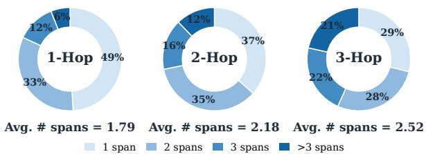
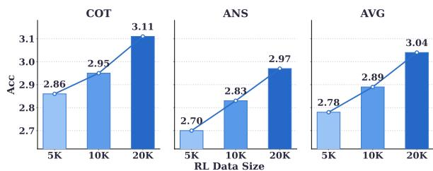

[← 返回 README](../README.md)

# 4. Experiments

## 一、Preview

实验分为三个层次：(1) 主结果 (Table 1, 2)——与各类基线在两个 benchmark 上的全面对比；(2) 消融实验 (Table 3-6)——验证每个设计选择的价值；(3) 定性分析 (Figure 4-9)——从潜空间使用、数据筛选效果、推理效率、reward dynamics 等多个维度解读模型行为。

---

## 二、原始文本

**Benchmarks.** We evaluate FUTURE-L1 on two complementary video event prediction benchmarks. FutureBench (Wang et al., 2025b) is a multiple-choice VEP benchmark that asks models to predict unobserved future events from a video prefix. It reports overall accuracy and four reasoning-depth splits: 1-Hop, 2-Hop, 3-Hop, and Interp.. While 1-Hop mainly tests immediate next-event prediction, 3-Hop and Interp. form harder OOD-style regimes: 3-Hop requires extrapolating longer future event chains, and Interp. requires reasoning over non-consecutive future states under partial intermediate anchors. These splits therefore test whether a model can generalize beyond local next-event cues. TwiFF-Bench (Liu et al., 2026a) evaluates open-ended future-frame reasoning over 1,078 QA samples and scores both the generated reasoning trajectory and the final answer. Following the official protocol, we report CoT quality, answer quality, and their average under the benchmark judge. The TwiFF-Bench evaluation set is not used in FUTURE-L1-50K construction, SFT, or RL training.

> 💡 **Benchmark 选择逻辑**: FutureBench (多选题) 评估预测准确性；TwiFF-Bench (开放题) 评估推理过程质量 + 答案真实性。两者互补——前者控制评估难度（标准化答案），后者评估推理链的真实质量（不容易被 guess 或 shortcut 欺骗）。

**Implementation Details.** We use Qwen3-VL-8B-Instruct (Bai et al., 2025a) as the backbone. SFT trains for 1 epoch on FUTURE-L1-50K with global batch size 128, peak learning rate 1×10⁻⁵, MSE weight λ=0.1, and maximum latent budget L_max = 4 unless otherwise specified. RL starts from the SFT checkpoint with group size G=8 and uses Qwen3.6-27B as the LLM-as-judge for the accuracy reward. All experiments run on 8×NVIDIA H200 GPUs, and all checkpoints are evaluated with lmms-eval (Zhang et al., 2024a).

### 4.1 Main Results

**Prior Models Struggle on VEP.** Tables 1 and 2 show that VEP remains difficult even for strong MLLMs. Proprietary and open-source models do not reliably solve FutureBench: GPT-4o obtains 59.0, GPT-5 obtains 57.9, and Qwen3-VL-30B-A3B reaches 66.9. Video-reasoning models improve over generic MLLMs but continue to struggle, including Video-R1 (63.3), Video-o3 (68.9), NEP (67.3), and Video-CoE (75.0). Their remaining errors are especially visible on the harder future-oriented splits: the strongest Video-CoE reaches only 71.6 on 3-Hop and 71.4 on Interp., where models must extrapolate longer event chains or reaso over non-consecutive future states. Existing static latent visual reasoning methods also do not transfer directly to dense video prediction: Monet reaches 47.9 and LVR obtains 21.0. These results suggest that VEP is not solved by scaling generic MLLMs, adding text-centric video reasoning, or directly reusing static latent-reasoning recipes.

> 💡 **Table 1 关键数据解读 — 三条基线家族的表现**:
>
> | 类别 | 最强代表 | FutureBench AVG | 核心发现 |
> |------|---------|----------------|---------|
> | 通用 MLLM | Qwen3-VL-30B-A3B | 66.9 | VEP 不是靠 scale 能解决的（GPT-5 仅 57.9） |
> | 视频推理 (文本 CoT) | Video-CoE | 75.0 | SOTA 文本推理方法在长链推理 (3-Hop: 71.6, Interp.: 71.4) 上也有显著下降 |
> | 静态潜视觉推理 | Monet | 47.9 | 直接迁移失效——静态潜视觉方法无法处理密集视频预测 |
> | **FUTURE-L1-RL** | **8B** | **85.4** | 超越了 30B-A3B 通用模型 (66.9) 和 75.0 的文本推理 SOTA |

> 💡 **Table 1 关键解读 — 深度 split 分析**:
>
> | Split | 任务特征 | 基线最好 (Video-CoE) | FUTURE-L1-RL | 增益 |
> |-------|---------|-------------------|-------------|------|
> | 1-Hop | 临近下一事件 | 80.9 | 83.2 | +2.3 |
> | 2-Hop | 中等链长 | 83.9 | 86.5 | +2.6 |
> | 3-Hop | 长链外推 | 71.6 | 86.6 | +15.0 |
> | Interp. | 非连续未来 | 71.4 | 85.1 | +13.7 |
>
> **关键发现**: 增益主要在 hardest splits (3-Hop +15.0, Interp. +13.7)。这完美验证了核心假设——潜空间表示在需要长链未来外推和非连续未来推理时最有价值，因为文本化在这种场景下丢失的视觉信息最多。

**FUTURE-L1 Boosts FutureBench.** FUTURE-L1-SFT reaches 73.2, improving the Qwen3-VL backbone (from 61.0) by +12.2. It outperforms the text-only SFT control trained on the same FUTURE-L1-50K (65.0) by 8.2, isolating the gain from interleaved latent reasoning rather than sample selection alone. After LA-DAPO, FUTURE-L1-RL improves to 85.4, exceeding Qwen3-VL-30B-A3B by 18.5 points and Video-CoE by 10.4 points. The gains over the backbone are strongest on the harder splits: +19.0, +20.7, +20.4, and +29.3 on 1-Hop, 2-Hop, 3-Hop, and Interp., respectively. The larger improvements on 3-Hop and Interp. suggest that latent channel generalizes to longer future chains, rather than only improving single-step NEP.

> 💡 **分解增益来源 — 从 61.0 到 85.4 的三步拆解**:
>
> | 步骤 | 配置 | 分数 | 增量 | 增量来源 |
> |------|------|------|------|---------|
> | 0 | Qwen3-VL-8B zero-shot | 61.0 | — | 基线 |
> | 1 | + FUTURE-L1-50K 文本 SFT | 65.0 | +4.0 | 数据增益（好样本 + 任务格式） |
> | 2 | + 交错潜空间 SFT | 73.2 | +8.2 | **模态匹配增益**（潜空间 > 文本） |
> | 3 | + LA-DAPO RL | 85.4 | +12.2 | RL 优化增益（潜轨迹优化） |
>
> 累计的总增益 (+24.4) 均匀分布在三个来源：数据 (+4.0)、模态 (+8.2)、RL (+12.2)。模态匹配增益是最大单项——再次验证了核心主张。

**TwiFF-Bench Shows the Same Trend.** On TwiFF-Bench, FUTURE-L1-SFT raises the average score from 2.44 to 2.52. Though its CoT score decreases from 2.75 to 2.62, its answer score rises from 2.14 to 2.42, showing the curated traces strengthen prediction even when their surface reasoning is imperfect. LA-DAPO improves both dimensions, reaching 3.11 CoT and 2.97 Ans for an average of 3.04. This surpasses the previous best TwiFF-2.7M (2.79) and all listed MLLM or unified baselines, indicating that interleaved latent reasoning and trajectory-level RL are complementary.

> 💡 **TwiFF-Bench 的有趣现象**: SFT 后 CoT 分数反而下降 (2.75 → 2.62)，但 Answer 分数明显上升 (2.14 → 2.42)。这说明 SFT 的 teacher-forcing 让模型的文本推理轨迹变得不那么流畅（因为被强制插入了 latent span 边界），但内部潜状态编码的未来视觉信息确实改善了最终预测质量。RL 阶段通过优化轨迹同时提升了 CoT 和 Answer——这是一个经典的"先牺牲表面质量换内部能力，再通过 RL 恢复表面质量"的训练轨迹。

### 4.2 Ablation Study

**SFT Hyperparameters.** Table 3 sweeps the latent MSE weight λ and the maximum latent budget L_max. With L_max = 4 fixed, λ = 0.1 is optimal (73.2); both weaker (λ=0.01, 69.1) and stronger (λ=1.0, 69.5) alignment weights cost 3-4 points, indicating that latent positions need explicit but not dominant supervision. With λ=0.1 fixed, accuracy peaks at L_max = 4 and degrades to 67.4 at L_max = 64, suggesting that an overly long latent span dilutes useful signal. This indicates that latent reasoning benefits from short, explicitly supervised spans rather than simply allocating more continuous tokens.

> 💡 **SFT 超参数敏感性分析**:
>
> **λ 消融**:
> - λ=0.01 (69.1): 潜状态对齐太弱 → 潜状态不在有意义的视觉语义 manifold 上
> - λ=0.1 (73.2): **最优** → 适度的视觉监督
> - λ=1.0 (69.5): 潜状态对齐太强 → 挤压了语言建模 → 文本推理质量下降
>
> **L_max 消融**:
> - L_max=2 (70.7): 潜空间容量不足
> - L_max=4 (73.2): **最优** → 短而精
> - L_max=16 (71.0): 开始下降
> - L_max=64 (67.4): 被稀释 → 过多的潜 tokens 缺乏足够的未来帧监督（FUTURE-L1-50K 中只有 4.2% 样本有 3+ 未来帧）
>
> **核心教训**: 潜空间推理不是"越多越好"，而是"少而精"——短 span + 明确监督 > 长 span + 弱信号

**RL Objective.** Table 4 ablates the RL objective from FUTURE-L1-SFT. GRPO (82.8) and DePO (81.1) already lift FUTURE-L1-SFT (73.2) by about 9 points, and DAPO further reaches 83.8. Adding latent-aware rewards improves the objective beyond DAPO: the outcome-contrastive reward R_ctr raises performance to 84.5, the temporal-diversity reward R_div reaches 84.8, and using both in FUTURE-L1-RL achieves 85.4. This shows that the gain is not only from stronger RL, but from rewards that directly structure latent visual trajectories.

> 💡 **RL 方法对比的关键洞察**:
>
> | RL 方法 | AVG | vs DAPO 基线 | 增量来源 |
> |---------|-----|-------------|---------|
> | DAPO | 83.8 | — | 基线 RL (answer+format reward) |
> | + R_ctr | 84.5 | +0.7 | 潜轨迹跨 rollout 对齐 |
> | + R_div | 84.8 | +1.0 | 潜轨迹内时序多样性 |
> | + Both (FUTURE-L1-RL) | 85.4 | +1.6 | 两者互补 |
>
> 注意：即使只用 DAPO（无潜空间 reward），FUTURE-L1-SFT → DAPO 的提升 (+10.6) 已经远大于文本-only SFT → DAPO 的提升 (+11.3-12.3 over 65.0 baseline)。这再次验证了潜空间 SFT 初始化的优势。

**RL Reward Coefficients.** Table 5 examines the latent-reward coefficients. The outcome-contrastive weight peaks at λ_c = 0.2 (85.4), and the temporal-diversity weight peaks at λ_d = 0.1; larger values hurt, dropping to 81.6 at λ_d = 1.0. This suggests that contrastive alignment and temporal diversity are both useful, but excessive pressure can push latent spans off the manifold.

> 💡 **奖励系数的"倒 U 型"**: 两个潜空间奖励都存在最优值，过大反而有害——λ_d=1.0 时性能骤降至 81.6。这验证了一个重要直觉：过度的多样性约束会迫使潜状态偏离有意义的视觉 manifold → 偏离了 SFT 阶段建立的有效表征区域。这是"正则化强度—表征保真度"之间的经典 trade-off。

### 4.3 Analysis of Latent Visual Reasoning

**Visual-Gain Filtering.** Table 6 controls for a key confound: whether the SFT gain comes from visual-gain selection or merely from TwiFF-style formatting. We compare our Top-50K set with a random 50K set sampled from TwiFF-2.7M under the same interleaved-format requirement and train both with the same FUTURE-L1-SFT recipe. The random set improves Qwen3-VL-8B from 61.0 to 68.4, showing that interleaved demonstrations help, but it remains 4.8 points below our visual-gain selected set (73.2). The gap persists on the harder splits, including 3-Hop (70.1 vs. 77.6) and Interp. (67.7 vs. 72.2). Thus FUTURE-L1-50K improves transfer not only by exposing the model to TwiFF-style traces, but by selecting examples whose future visual hints provide measurable predictive utility.

> 💡 **关键消隐 — 排除"格式效应"混淆**: 随机 50K (68.4) vs visual-gain 50K (73.2) = +4.8 的差距纯粹来自筛选质量，而非交错格式本身。这证明 visual-gain 筛选是必要且有效的——不是所有带有未来帧的数据都有同等的训练价值。

**Adaptive Latent Usage.** Figure 4 examines whether FUTURE-L1 allocates latent computation according to reasoning difficulty. Averaged over six RL hyperparameter settings, the mean span count increases with depth, from 1.79 on 1-Hop to 2.18 on 2-Hop and 2.52 on 3-Hop. The distribution shifts in the same direction: one-span responses become less frequent as depth increases, while responses with more than three spans grow from 6% on 1-Hop to 12% on 2-Hop and 21% on 3-Hop. This shows that latent spans are not emitted as a fixed template; instead, FUTURE-L1 spends more latent visual computation when longer future event chains require updating dynamic visual states.

> 💡 **自适应潜计算分配——涌现行为**: 随着推理深度的增加，模型自动分配更多潜 span 来处理更长的未来事件链。特别值得注意的是——这并非 SFT 中显式训练的（FUTURE-L1-50K 中只有 4.2% 样本有 3+ 未来帧），而是 RL 后涌现的**自适应行为**。这说明模型学会了"更难的推理 = 更多潜视觉更新"的元策略。

**RL Data Scaling.** Figure 5 tests whether LA-DAPO benefits from more retained visual-gain data. Using 5K, 10K, and 20K samples from the retained pool, the TwiFF-Bench average score increases monotonically from 2.78 to 2.89 and 3.04. This trend indicates that trajectory-level latent RL continues to benefit from high-utility samples rather than saturating on a small preference set.

> 💡 **RL 数据效率**: 5K → 10K → 20K 的单调递增趋势表明：(1) LA-DAPO 在 20K 以内尚未饱和；(2) visual-gain 筛选后的样本在 RL 阶段仍然保持"高效用"——高质量数据持续带来增益。

**Inference Efficiency.** Table 7 compares inference cost on FutureBench. Text-heavy and multi-turn baselines require substantially larger decoding budgets: Video-R1 emits 398.5 tokens at 3.28 seconds per sample, and Video-o3 emits 348.6 tokens at 25.90 seconds due to repeated model calls during search. In contrast, FUTURE-L1-SFT uses 205.3 tokens and reaches 73.1 accuracy at 0.96 seconds, while FUTURE-L1-RL uses 195.3 tokens and reaches 85.4 accuracy at 0.91 seconds, yielding the best accuracy-per-second score. Thus FUTURE-L1 improves accuracy through compact latent visual computation rather than expensive explicit multi-turn reasoning.

> 💡 **推理效率的完整解读**:
>
> | 模型 | Tokens | Latency (s) | Acc. | Acc./s |
> |------|--------|-------------|------|--------|
> | Qwen3-VL-8B (基线) | 288.8 | 1.18 | 61.0 | 51.7 |
> | Video-R1 | 398.5 | 3.28 | 63.3 | 19.3 |
> | Video-o3 | 348.6 | 25.90 | 68.9 | 2.7 |
> | FUTURE-L1-SFT | 205.3 | 0.96 | 73.1 | 76.1 |
> | **FUTURE-L1-RL** | **195.3** | **0.91** | **85.4** | **93.8** |
>
> 惊人发现：FUTURE-L1 的 token 数甚至少于不推理的基线 (195 vs 289)！因为潜状态不产生 text token。准确率高 24 分的同时又快 23%。这是潜空间推理在效率上的根本优势。

---

*Figure 4: Latent-span usage by reasoning depth. Donuts show span-count distributions; values report mean spans over six RL settings.*

> 💡 **Figure 4 批读**: 环形图展示了不同推理深度下的潜 span 数量分布。随着 1-Hop → 2-Hop → 3-Hop，>3 span 的比例从 6% 增加到 21%，平均 span 数从 1.79 增加到 2.52。关键发现：模型不是"每个问题都用相同数量的潜 span"，而是根据推理难度自适应分配。3-Hop 长链需要更多的视觉状态更新步骤。

*Figure 5: RL data scaling on TwiFF-Bench. Scores improve as LA-DAPO uses 5K, 10K, and 20K retained visual-gain samples.*

> 💡 **Figure 5 批读**: LA-DAPO 在 5K→10K→20K 数据量上持续单调提升（2.78→2.89→3.04）。这表明：(1) 潜空间 RL 受益于更多高质量样本；(2) 在 20K 处尚未饱和——更大规模 RL 可能带来进一步增益；(3) 全部使用 visual-gain 筛选后的样本，确保了数据质量。

---

## 三、Summary

- **主结果**: FutureBench 85.4 (超 SOTA +10.4), TwiFF-Bench 3.04 (超 SOTA +0.25)
- **增益分解**: 文本 SFT +4.0 → 潜空间 SFT +8.2 (模态匹配) → RL +12.2 (轨迹优化)
- **消融验证**: visual-gain 筛选 (random vs curated: +4.8), SFT 超参数 (λ=0.1, Lmax=4 最优), RL 奖励 (Rctr+Rdiv 均有效且互补)
- **涌现行为**: 模型自适应分配潜计算 (更难题 = 更多 span)，RL 阶段无需中间帧标注
- **效率优势**: 195.3 tokens / 0.91s → 93.8 acc/s，比文本推理 SOTA 快 3-28 倍
