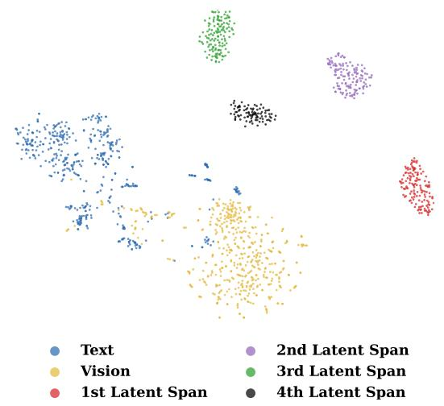
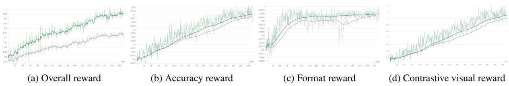

[← 返回 README](../README.md)

# 5. Conclusion

## 一、Preview

结论部分简短总结核心思想和方法，然后通过附录的关键要点（Stage-wise Latent States, Reward Dynamics, Case Studies）对潜空间推理行为进行了深入的定性分析，提供了实验数据之外的理解维度。

---

## 二、原始文本

We presented FUTURE-L1, an interleaved latent visual reasoning framework for video event prediction. The central idea is to keep dynamic future visual structure in a continuous latent channel instead of verbalizing every intermediate hypothesis as text. To make this practical, FUTURE-L1 first uses FUTURE-L1-50K to ground latent spans with future-frame embeddings selected by visual-gain curation, and then applies LA-DAPO to optimize sampled latent trajectories through outcome-contrastive and temporal-diversity rewards. Across FutureBench and TwiFF-Bench, this combination improves both multiple-choice future prediction and open-ended future reasoning, with especially large gains on longer and non-consecutive future-event splits. These results suggest a broader direction for video reasoning: language should organize and communicate predictions, while latent visual states preserve the dynamic semantics needed to imagine what happens next.

> 💡 **一句话总结 — 论文的终极主张**: **语言应负责"组织和传达预测"，而潜空间应负责"保留想象未来所需的动态视觉语义"**。这不是简单地说"潜空间比文本好"——而是提出了一种**分工协作**的推理范式：语言作为人类可读的推理骨架，潜空间作为视觉语义的内部工作记忆。这种分工是本文最深层的设计哲学。

> 💡 **三阶段递进总结**:
> - **FUTURE-L1-50K**: 确保潜空间监督信号的有效性（通过 visual-gain 筛选）
> - **SFT (交错格式)**: 确保模型学会在推理中使用潜空间（通过未来帧 embedding 对齐）
> - **LA-DAPO**: 确保潜空间推理质量（通过潜轨迹优化）
>
> 三阶段环环相扣，缺一不可。

---

## 三、附录关键要点 (Appendix E-H)

### E.1 Stage-wise Latent States (Figure 8)



*Figure 8: Stage-wise latent representation. t-SNE of FUTURE-L1-RL embeddings on FutureBench; sequential latent spans form distinct clusters.*

> 💡 **潜状态可视化解读**: t-SNE 图展示了 FUTURE-L1-RL 在 FutureBench 上的 token embedding 分布。文本 token 和视觉 token 分别占据不同的模态区域（符合预期）。更重要的是——**不同顺序的潜 span 形成了彼此分离的紧凑簇**，而非重叠或混在一起。这说明模型并非在每个阶段重复相同的视觉思维，而是在进行阶段化的、逐步更新的潜视觉表征过程。这直接验证了 $R_div$ 的有效性。

### E.2 Reward Dynamics (Figure 9)



*Figure 9: Reward dynamics during RL. FUTURE-L1 shows higher and more stable rewards than DAPO.*

> 💡 **RL 训练动态解读**: 在总体 reward、accuracy reward、format reward、contrastive visual reward 四个维度上，FUTURE-L1 都展现出比 DAPO 更高且更稳定的训练曲线。关键洞察：
> - 增益不仅来自 final answer signal（accuracy reward 也更高），**contrastive visual reward 也持续改善**
> - 这表明 LA-DAPO 确实在**同时优化答案准确性和潜视觉状态质量**，而非单方面追求答案正确
> - 更稳定的曲线说明潜空间奖励起到了正则化作用，防止 RL 训练中的剧烈波动

### E.3 Case Studies (Figures 15-18)

**成功案例 (Figure 15-17)**: FUTURE-L1 不会将整个预测压缩成单一文本链，而是在未来状态发生变化的关键节点（进入新房间、操作物体、从产品设置转到户外使用）交替插入短文本锚点和潜 span。文本 token 使轨迹可读，而潜 span 标记了需要被"携带到未来"的中间视觉假设。

**失败案例 (Figure 18)**: 模型识别到了 "baseball-dog" 高层次语境，但潜轨迹漂向了一个"看似合理"的通用延续，而错过了包含狗在 "BASEBALL" 地毯上、打开冰箱、后续 dugout 场景等细粒度真实序列。这揭示了核心 limitations：(1) 仅仅在正确时机调用潜 span 不够；(2) 潜轨迹必须也保留**细粒度的事件身份**。这正是 LA-DAPO 优化潜轨迹的动机所在。

> 💡 **失败案例的启示**: 这个 failure case 精准揭示了潜空间推理的核心挑战——**语义漂移 (semantic drift)**。潜状态可以维持"高层次的合理场景"，但缺少对细粒度视觉事件身份的保持。在文本推理中，你可以通过单词选择（"dog on carpet" vs "dog in park"）来精确控制语义；但在潜空间中，语义控制更难——连续向量可以平滑地从一个合理状态漂移到另一个。这也解释了为什么 $R_ctr$ 和 $R_div$ 两者都必要：前者通过正确/错误对比来"锚定"潜轨迹到正确结果，后者通过防止重复来迫使时序更新。

---

## 四、Summary

- **核心主张**: 语言组织预测，潜空间保留想象所需的动态视觉语义——分工协作而非替代
- **实证发现**:
  - 潜空间 span 形成时序分离的表征簇 (Figure 8)
  - LA-DAPO 同时提升答案和潜视觉质量 (Figure 9)
  - 模型自适应根据难度分配更多潜计算 (Figure 4)
- **Failure 分析**: 语义漂移是潜空间推理的核心挑战——潜状态难以像文本那样精确控制细粒度事件身份
- **未来方向**: 语言与潜空间的互补分工可能成为视频推理（乃至更广泛的多模态推理）的新范式

---

## 五、整体论文结构回顾

```
论文全文结构总览:
  
  [问题定义]   Section 1: VEP 为什么需要不同于文本 CoT 的推理方式
       ↓
  [学术坐标]   Section 2: 三条相关工作脉络中的定位
       ↓
  [方法设计]   Section 3.1: 交错式潜视觉推理机制 (怎么推理)
       ↓      Section 3.2: SFT + 数据构建 (冷启动)
       ↓      Section 3.3: LA-DAPO (轨迹优化)
       ↓
  [实验验证]   Section 4.1: 主结果 (主 table)  
       ↓      Section 4.2: 消融 (每个设计选择的价值)
       ↓      Section 4.3: 分析 (为什么有效)
       ↓
  [结论前瞻]   Section 5: 核心主张 + 更广泛的启示
```

论文采用标准的"动机 → 定位 → 方法 → 实验 → 结论"结构，每个实验小节都服务于一个明确的论证目标（主结果 → 消融 → 分析），层次分明、逻辑自洽。

---

*Batch reading completed on 2026-06-24*
