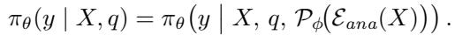
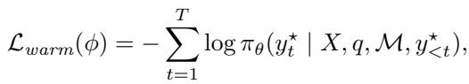
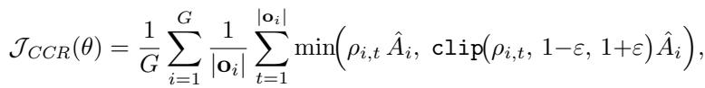
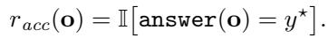
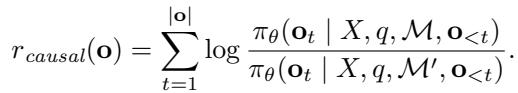
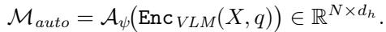
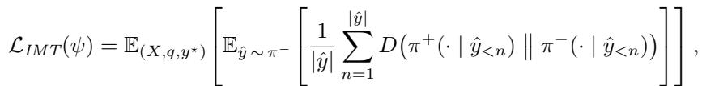
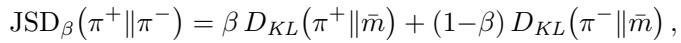

[← 返回 README](../README.md)

# 2. Methodology

## 一、\mathcal{P}review

MedSynapse-V 的方法论围绕一条渐进演化链展开：$\mathbf{F}_{ana} \xrightarrow{\text{Meta Query}} M \xrightarrow{\text{CCR}} M^{\star} \xrightarrow{\text{IMT}} M_{auto}$。核心思想是：将外部解剖编码器的结构化先验逐步转化为模型内生可自主生成的隐空间诊断记忆。三阶段相互依赖——MQ\mathcal{P}M 提供语义初始化，CCR 通过因果精炼筛选有效成分，IMT 将精炼后的记忆蒸馏为自主能力。

---

## 二、原始文本

### 2.1 \mathcal{P}roblem Formulation and Architecture Overview

\mathcal{P}roblem Formulation. Given an image $X \in \mathbb{R}^{H \times W \times 3}$ and a clinical query $q$, the objective is to generate an output sequence $y$ containing diagnostic analysis and final conclusions. Let $\pi_{\theta}$ denote the VLM policy, $\mathcal{E}_{ana}$ the frozen pretrained anatomical encoder, and $\mathcal{\mathcal{P}}_{\phi}$ the parameterized memory synthesis module. MedSynapse-V dynamically generates a set of diagnostic implicit memory $M = \{m_1, ..., m_N\} \in \mathbb{R}^{N \times d_h}$ for injection into the VLM hidden stream, where $d_h$ is the hidden state dimensionality. The overall policy is formalized as:

Unlike explicit CoT, which concatenates reasoning tokens to the input sequence, MedSynapse-V constructs a diagnostic experience invocation mechanism based on implicit memory within the representation space.

Architecture Overview. As illustrated in Figure 2, MedSynapse-V follows a three-stage progressive memory evolution training paradigm. Stage I: Meta Query for \mathcal{P}rior Memorization (§2.2) extracts priors from the frozen anatomical encoder, condenses them into diagnostic implicit memory M through a learnable memory synthesis module and injects them into the VLM hidden stream, while simultaneously completing semantic alignment warmup. Stage II: Causal Counterfactual Refinement (CCR; §2.3) freezes the synthesis module and performs policy optimization within the M-conditioned latent space based on GR\mathcal{P}O, incorporating causal counterfactual rewards for memory refinement. Stage III: Intrinsic Memory Transition (IMT; §2.4) writes the refined diagnostic memory into the model's autonomous pathway through privileged-autonomous dual branch full vocabulary divergence distillation, completely removing the anatomical encoder at inference. The entire process is represented as a progressive evolution chain of diagnostic memory: $\mathbf{F}_{ana} \xrightarrow{\text{Meta Query}} M \xrightarrow{\text{CCR}} M^{\star} \xrightarrow{\text{IMT}} M_{auto}$, where $\mathbf{F}_{ana}$ denotes the anatomical encoder output features, M is the initial memory after semantic alignment, $M^{\star}$ is the causally refined memory, and $M_{auto}$ is the intrinsic memory generated by the autonomous module.

> **核心定义**: 与显式 CoT 的关键区别——CoT 将推理 token 拼接到输入序列（表面文本空间），MedSynapse-V 在**表示空间**中构建基于隐式记忆的诊断经验调用机制。

*Fig. 2: Stages I and II of MedSynapse-V. The hook features from an encoder are condensed into diagnostic implicit memory via learnable meta-query probes and injected into the VLM hidden stream. The memory is then refined through RL with composite rewards, ensuring causal alignment between memory and clinical decision logic.*

> **Figure 2 批读**: 图 2 展示了 Stage I 和 Stage II 的完整流程。(a) Stage I: image X 经过 frozen 解剖编码器提取 spatial features，通过 learnable meta-query probes 压缩为 N 个 memory tokens，注入 VLM hidden stream 中 question encoding 之后。(b) Stage II: 在 M-conditioned 空间中，通过 GR\mathcal{P}O 用 composite reward (accuracy + causal counterfactual) 精炼 memory，确保 memory 与临床决策逻辑之间的因果对齐。

---

### 2.2 Meta Query for \mathcal{P}rior Memorization

Clinical cognition research has shown that experienced physicians rapidly activate long-accumulated anatomical knowledge during image interpretation, forming compressed contextualized expert memory to guide diagnosis [106]. Inspired by this finding, this stage models this process as a structured prior retrieval and memorization mechanism: the anatomical encoder extracts spatially aware features, which are then condensed into diagnostic implicit memory through a learnable synthesis module and injected into the VLM hidden states.

**Structured \mathcal{P}rior Elicitation.** Given an input image X, the frozen anatomical encoder $\mathcal{E}_{ana}$ outputs spatial features from the final layer: $\mathbf{F} = \mathcal{E}_{ana}(X) \in \mathbb{R}^{H_f \times W_f \times d_f}$, where $H_f \times W_f$ is the spatial resolution and $d_f$ is the feature dimensionality. This feature map encodes structured spatial priors learned by the anatomical encoder from large-scale medical image segmentation tasks, encompassing multi-granularity information such as lesion boundaries, organ topology, and tissue textures. It is flattened into a sequence $\mathbf{S} = \mathbf{flat}(\mathbf{F}) \in \mathbb{R}^{M \times d_f}$, $M = H_f \times W_f$, forming the feature pool for candidate memory.

**Diagnostic Memory Synthesis.** To condense the high-dimensional feature pool into compact memory compatible with the VLM hidden state space, we design a lightweight Diagnostic Memory Sampler $\mathcal{\mathcal{P}}_{\phi}$ that maintains N learnable meta-query probes $\mathbf{Q}_0 \in \mathbb{R}^{N \times d_f}$, each of which learns to attend to specific pathological semantic patterns (e.g., boundary irregularity, density heterogeneity, or vascular-tissue spatial relationships). Using $\mathbf{Q}_0$ as queries and $\mathbf{S}$ as key-value pairs, $\mathcal{\mathcal{P}}_{\phi}$ performs selective aggregation and dimensional alignment: $M = \mathcal{\mathcal{P}}_{\phi}(\mathbf{Q}_0, \mathbf{S}) \in \mathbb{R}^{N \times d_h}$, where $d_h$ is the VLM hidden state dimensionality. The resulting N diagnostic implicit memory elements $M = \{m_1, ..., m_N\}$ collectively span the feature subspace required for diagnosis. $\mathcal{\mathcal{P}}_{\phi}$ extracts the most diagnostically relevant compact representations from the encoder's high-dimensional feature pool according to the task context, bridging them from the anatomical encoder's representation space to the VLM's hidden state space.

**Diagnostic Memory Injection.** The diagnostic implicit memory $M$ is injected into the VLM generation sequence as continuous vectors, positioned after the question encoding and before the answer generation: $\mathbf{x}_{full} = [\mathbf{Enc}(X); \mathbf{Enc}(q); m_1; \ldots; m_N; y_1; \ldots; y_T]$, where $\mathbf{Enc}(\cdot)$ denotes the encoding operation and $\{y_t\}_{t=1}^{T}$ are the answer tokens to be generated. Since $M$ shares the $d_h$-dimensional space with VLM hidden states, the self-attention mechanism enables the generation sequence to dynamically aggregate diagnostic evidence from $M$, allowing the VLM to modulate its predictive distribution based on latent priors without additional adaptation layers or architectural modifications.

> **机制拆解 — Memory Injection 的关键设计**:
> - **位置**: $M$ 放在 question encoding 之后、answer 之前，使 answer token 可以同时 attend 到 visual features 和 memory
> - **维度假定**: $M$ 与 VLM hidden states 共享 $d_h$ 维空间 (4096 for Qwen3-VL-8B)，无需额外的 adaptation layer
> - **自注意力机制**: 生成序列通过 self-attention 动态聚合来自 $M$ 的诊断证据，无需架构修改

**Semantic Alignment Warmup.** Directly injecting outputs from a randomly initialized synthesis module into the VLM would cause semantic mismatch. To address this, a warmup stage is established before formal refinement: the VLM backbone $\theta$ and the anatomical encoder $\mathcal{E}_{ana}$ are frozen, and only $\phi$ is optimized with the standard next token prediction loss:

where $y^{\star}$ denotes the reference answer sequence. This stage establishes a well-conditioned initial semantic mapping between the anatomical encoder feature space and the VLM hidden state space, providing a semantically coherent and stable initialization upon which the subsequent RL stage can reliably build.

> **关键判断 — 为什么需要 Warmup**:
> 随机初始化的 $\mathcal{\mathcal{P}}_{\phi}$ 直接注入 VLM 会造成语义不匹配。Warmup 阶段冻结 VLM 和编码器，仅训练 $\mathcal{\mathcal{P}}_{\phi}$，建立解剖编码器特征空间与 VLM 隐空间之间的初始语义映射。这为后续 RL 提供了一个"语义连贯、稳定"的初始化——消融实验证明跳过 Warmup 导致性能崩溃 (52.9% vs. zero-shot 54.2%)。

---

### 2.3 Causal Counterfactual Refinement

After warmup, $M$ possesses basic semantic alignment capability, but directly applying standard SFT has two limitations [129]: binding to fixed reference trajectories restricts out-of-distribution generalization; the model may bypass $M$ and directly map from $(X, q)$ to answers, causing memory to degenerate into redundant placeholders. In this stage, we perform policy optimization within the $M$-conditioned latent space, incorporating causal counterfactual intervention to guide memory refinement toward clinical alignment.

> **核心动机 — 为什么 SFT 不够**: (1) SFT 绑定到固定参考轨迹，限制了分布外泛化；(2) 模型可能 bypass M 直接从 (X,q) 映射到答案，memory 退化为冗余占位符。因此需要 RL + 因果干预来确保 memory 真正被利用。

**Conditioned \mathcal{P}olicy Modeling.** First, we freeze $\mathcal{\mathcal{P}}_{\phi}$ and the VLM backbone, optimizing only lightweight LoRA adapters (collectively denoted $\theta$ below). Based on GR\mathcal{P}O [95], for each sample $(X, q, y^{\star})$, G candidate trajectories $\{\mathbf{o}_1, \ldots, \mathbf{o}_G\}$ are sampled. $M$ is explicitly incorporated into the conditioned context, and the policy gradient indirectly modulates the VLM's utilization pattern of $M$ through the attention pathway. The policy model optimization objective is:

where $\rho_{i,t} = \frac{\pi_{\theta}(\mathbf{o}_{i,t} \mid X, q, M, \mathbf{o}_{i,\lt t})}{\pi_{\theta_{old}}(\mathbf{o}_{i,t} \mid X, q, M, \mathbf{o}_{i,\lt t})}$ and $\hat{A}_i = \frac{R(\mathbf{o}_i) - \mu_G}{\sigma_G + \varepsilon_0}$, with $\mu_G$ and $\sigma_G$ denoting the group reward mean and standard deviation, and $\varepsilon_0$ a stability constant. Note that both $\rho_{i,t}$ and $\hat{A}_i$ are conditioned on $M$, allowing gradients to propagate through the attention pathway linking answer tokens with memory, thereby shaping how the VLM attends to the injected diagnostic cues during generation.

> **机制拆解 — GR\mathcal{P}O 策略梯度**:
> - **GR\mathcal{P}O (Group Relative \mathcal{P}olicy Optimization)** 替代 \mathcal{P}\mathcal{P}O：在 group 内做 reward normalization，无需额外 value network
> - **关键设计**: $\rho_{i,t}$ 和 $\hat{A}_i$ 都显式条件于 $M$，梯度通过 attention pathway 从 answer token 反向传播，间接塑造 VLM 如何利用注入的 memory
> - **G=4**: 每样本采样 4 条候选轨迹，在准确率和训练成本间取得平衡

**Interventional Reward Design.** The composite reward $R(\mathbf{o}) = \lambda_{acc} \cdot r_{acc} + \lambda_{causal} \cdot r_{causal}$ consists of two components. The diagnostic accuracy reward is:

The causal counterfactual reward quantifies the causal contribution of $M$ through intervention. The frozen anatomical encoder $\mathcal{E}_{ana}$ additionally provides highest-confidence region masks for diagnostically relevant areas; zeroing out the corresponding features yields the interventional memory $M': M' = \mathcal{\mathcal{P}}_{\phi}(\mathcal{E}_{ana}(X) \odot \bar{\mathbf{B}})$, where $\bar{\mathbf{B}}$ is the inverted binary mask. The causal reward measures the performance discrepancy between the original and interventional conditions:

$r_{causal} \gt  0$ indicates that the original memory encodes information with causal contribution to diagnosis; $r_{causal} \le 0$ indicates that the corresponding prior is causally irrelevant to the current decision. This design follows the principle of interventional effect estimation in causal inference, ensuring that the memory retained after refinement is causally consistent with clinical decision logic.

> **核心创新 — Causal Counterfactual Reward 的三层理解**:
>
> | 层次 | 机制 | 含义 |
> |------|------|------|
> | 干预构造 | 对 MedSAM3 最高置信度区域的 feature 做 zero-out，构造 de-rived memory $M'$ | 模拟"如果移除了诊断关键区域的信息，模型表现会怎样" |
> | 因果量化 | $r_{causal}$ = log 原始条件概率 / 干预后条件概率 | 正值 -> memory 中该区域信息有因果贡献；负值/零 -> 记忆与该决策因果无关 |
> | 训练效果 | RL 优化后模型倾向利用有正因果贡献的 memory 成分 | 系统性地剪除因果无关的冗余，强化有真实诊断效用的 memory |
>
> **与仅用 accuracy reward 的本质区别**: accuracy-only 无法区分"利用 memory 正确诊断"和"绕过 memory 通过 shortcut 正确回答"。因果反事实 reward 强制模型依赖 memory 中因果相关的成分，避免 bypass。

**梯度流向分析**: LoRA 适配器是唯一的可训练参数；梯度从 answer token 经 attention pathway 反向传播到 memory 位置，间接优化 VLM 对 memory 的 attention pattern。$\mathcal{\mathcal{P}}_{\phi}$ 本身在 Stage II 是冻结的——memory 的"内容"不变，但模型"如何利用" memory 的方式被 RL 重塑。

---

### 2.4 Intrinsic Memory Transition

After the causal RL, the model can generate high-quality diagnostic outputs under the guidance of externally derived $M$, but the persistent dependence on the encoder at inference introduces additional computational overhead. As shown in Fig. 3, IMT reformulates this problem as learning to autonomously generate equivalent latent space embeddings under the condition of removing the auxiliary encoder, employing a privileged-autonomous dual-branch paradigm to accomplish memory transition from extrinsic to intrinsic.

*Fig. 3: Intrinsic Memory Transition (IMT) is achieved via Jensen-Shannon divergence alignment between the teacher ($\pi^{+}$, conditioned on encoder-derived $M_{pri}$) and student ($\pi^{-}$, conditioned on $M_{auto}$) branches. Gradients propagate solely to $\mathcal{A}_{\psi}$, enabling complete removal of the anatomical encoder at inference with negligible overhead.*

> **Figure 3 批读**: Teacher branch (privileged) 保留完整 pipeline (编码器 -> $M_{pri}$)，Student branch (autonomous) 仅用 $\mathcal{A}_{\psi}$ 从 VLM 自身 visual encoding features 生成 $M_{auto}$。两个分支共享 VLM backbone，通过 JSD divergence 对齐 full-vocabulary next-token 分布。梯度仅流向 $\mathcal{A}_{\psi}$——teacher 是固定的分布目标，student 学习生成行为等价于 privileged memory 的隐空间嵌入。

**\mathcal{P}rivileged Branch and Autonomous Branch.** The teacher branch (privileged) retains the complete pipeline with the anatomical encoder, generating reference memory $M_{pri} := \mathcal{\mathcal{P}}_{\phi}(\mathcal{E}_{ana}(X)) \in \mathbb{R}^{N \times d_h}$. The student branch (autonomous) removes the encoder and predicts equivalent memory solely through a lightweight Autonomous Memory Module $\mathcal{A}_{\psi}$ mounted on the VLM, using the VLM's own visual encoding features:

Both branches share the VLM backbone parameters $\theta$, ensuring that alignment is completed within the same function space.

> **关键设计 — 双分支共享 Backbone**: 两个分支共享 VLM backbone 参数 $\theta$，确保对齐在同一个函数空间内完成。这保证了蒸馏后 student 的行为与 teacher 高度一致。

**Training Objective: Unified Full-Vocabulary Divergence.** The core signal of IMT is the full-vocabulary divergence objective covering all generation positions. Given a trajectory $\hat{y} \sim \pi^{-}(\cdot \mid X, q, M_{auto})$ sampled from the student branch, the trajectory-averaged per-position divergence is defined as:

where $\pi^{+}(\cdot \mid \hat{y}_{\lt n}) \triangleq \pi_{\theta}(\cdot \mid X, q, M_{pri}, \hat{y}_{\lt n})$ and $\pi^{-}(\cdot \mid \hat{y}_{\lt n}) \triangleq \pi_{\theta}(\cdot \mid X, q, M_{auto}, \hat{y}_{\lt n})$ are the full-vocabulary next-token distributions conditioned on privileged and autonomous memory, respectively. The divergence D adopts the generalized Jensen-Shannon divergence $\text{JSD}_{\beta}$ [67]:

where $\bar{m} = \beta \pi^{+} + (1-\beta) \pi^{-}$. The teacher branch leverages privileged memory to expose the complete next-token probability landscape to the student, driving $\mathcal{A}_{\psi}$ to learn to generate latent space embeddings behaviorally equivalent to privileged memory. Gradients backpropagate only through the student branch to $\mathcal{A}_{\psi}$, while the teacher branch serves as a fixed distributional target.

> **机制对比 — IMT vs. 常见蒸馏方式的区别**:
>
> | 维度 | IMT (JSD) | Forward KL | Reverse KL | Logit Matching |
> |------|-----------|------------|------------|----------------|
> | 对齐目标 | 全词表 next-token 分布 | 全词表 next-token 分布 | 全词表 next-token 分布 | token-level logits |
> | 行为 | 对称平衡 | mode-covering (稀释诊断特异性) | mode-seeking (模式坍缩) | 粗糙近似 |
> | 效果 (Avg) | 69.3% | 67.2% | 66.8% | 未在论文中报告 |
>
> **为什么是全词表散度而非 token-level alignment?** Teacher 的非零概率分布在哪些 token 上揭示了 teacher 认为哪些答案是"可接受的备选"(即使不是最优)，这种完整分布 landscape 比单点估计包含了更丰富的诊断知识。JSD 的对称性避免了 Forward KL 的 mode-covering 和 Reverse KL 的 mode-seeking 两个极端。

At inference, $\mathcal{A}_{\psi}$ directly generates $M_{auto}$ from VLM visual encoding features and injects them into the hidden stream. The entire Meta Query pipeline and the anatomical encoder are completely removed, rendering the computational overhead of MedSynapse-V nearly identical to that of a standard VLM.

> **推理时发生了什么**: $\mathcal{A}_{\psi}$(2-layer ML\mathcal{P} + LayerNorm, ~33.6M params) 从 VLM visual encoding features 直接生成 16 个 memory vectors (仅需 4ms)，注入 hidden stream。解剖编码器 (93.7M params) 和 Meta Query pipeline 完全移除。总推理参数量 8.41B (仅比 backbone 多 1.4%)。

---

## 三、Summary

- **问题形式化**: $\pi_{\theta}(y|X,q) = \pi_{\theta}(y|X,q,\mathcal{\mathcal{P}}_{\phi}(\mathcal{E}_{ana}(X)))$，与 CoT 的本质区别在于记忆在表示空间而非文本空间
- **Stage I (MQ\mathcal{P}M)**: 16 个 learnable meta-query probes + Cross-Attention + 语义对齐 Warmup
- **Stage II (CCR)**: GR\mathcal{P}O + interventional reward ($r_{acc} + \lambda_{causal} \cdot r_{causal}$)，$r_{causal}$ 通过 region masking 量化 memory 因果贡献
- **Stage III (IMT)**: 特权-自主双分支 + full-vocabulary JSD divergence 蒸馏，梯度仅流向 $\mathcal{A}_{\psi}$
- **推理**: Encoder 完全移除，$\mathcal{A}_{\psi}$ 自主生成 memory，额外开销仅 4ms + 1.4% 参数
