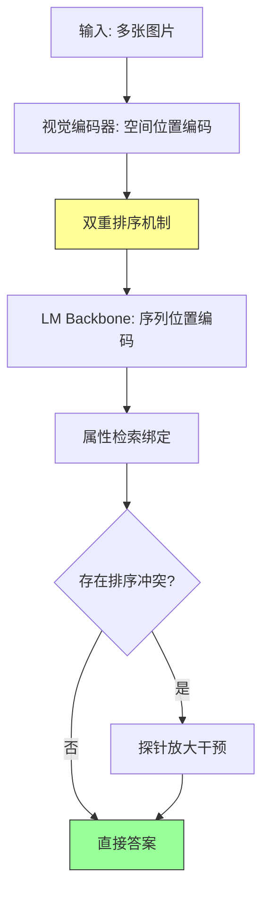

# The Dual Mechanisms of Spatial Variable Binding in Vision-Language Models (VLMs 空间变量绑定的双重机制)

## Paper Metadata

| 项目 | 内容 |
|------|------|
| **Title** | The Dual Mechanisms of Spatial Variable Binding in Vision–Language Models |
| **Authors** | Kelly Cui\*, Nikhil Prakash\*, Shoval Messica, Ayush Raina, David Bau, Antonio Torralba, Tamar Rott Shaham |
| **Affiliations** | MIT CSAIL, Northeastern University, Sony Playstation |
| **Venue** | arXiv 2026 |
| **Project Page** | https://spatial.baulab.info |
| **References** | 38 |

## One-Sentence Summary

本文揭示了 VLMs 中空间变量绑定 (spatial variable binding) 依赖两套并行的排序表征机制：**视觉编码器提供全局分布式的空间排序信号（主导）**，**LM backbone 在中间层形成局部排序表征作为补充（辅助）**；基于该机制理解，通过简单放大视觉嵌入中的排序方向即可在 COCO 自然场景上纠正高达 55% 的错误预测。

## Core Contributions

1. **揭示空间排序信息的双重来源** (Section 5.1-5.3): VLMs 的空间变量绑定同时依赖 (i) 视觉编码器编码的全局空间布局信息（主导、分布于背景区域），(ii) LM backbone 中间层形成的局部排序表征（辅助、仅在视觉信号被削弱时起作用）。

2. **发现排序信息在视觉 token 中的分布式特性** (Section 5.2.1): 线性 probe 实验表明空间排序信息并非局限于物体 token，而是以 **strip（带状）模式** 扩散到周围背景 token，这一发现与纯语言模型中排序信息局部化于单个或少量 token 的现象形成鲜明对比。

3. **因果干预实验验证双重机制** (Section 5.2.2, 5.3): 通过 interchange intervention（互换干预）在三个合成数据集和一个受控自然数据集上严格验证了视觉编码器和 LM backbone 各自的因果贡献。

4. **提出简单高效的纠正干预方法** (Section 5.4): 放大 probe 方向即可增强 vision embeddings 中的排序信号，在 COCO-spatial 自然场景上提升准确率最多 22 个百分点（Qwen2-VL-2B: 60%->82%, Gemma-3-4B: 53%->72%），无需微调、无需真实标签、无需物体布局信息。

## Section Navigation

| 章节 | 文件 | 核心内容 |
|------|------|---------|
| Abstract & Figure 1 | [00-abstract.md](sections/00-abstract.md) | 论文概述、双重机制发现、全局干预纠正错误 |
| 1. Introduction | [01-introduction.md](sections/01-introduction.md) | 问题动机、排序表征的起源问题、三阶段发现路线图 |
| 2. Related Work | [02-related-work.md](sections/02-related-work.md) | 空间推理基准、VLM 内部机制、LMs/VLMs 中的符号表征 |
| 3. Experimental Setup | [03-experimental-setup.md](sections/03-experimental-setup.md) | 四层数据集构建、模型选择、Probing 与 Interchange Intervention 方法 |
| 4. Preliminaries | [04-preliminaries.md](sections/04-preliminaries.md) | LM 中的排序信息机制、VLM 中排序信息的开放问题 |
| 5. Experiments | [05-experiments.md](sections/05-experiments.md) | 五大实验：排序信息存在性 → 视觉编码器来源 → LM backbone 补充 → 纠正干预 |

## Key Numbers

| 指标 | 数值 |
|------|------|
| 合成数据集 | 3 (Squares, Shapes, Objects) |
| 受控自然数据集 | 1 (What'sUp, 1074 images) |
| 自然场景数据集 | 1 (COCO-spatial, 2687 images) |
| 验证模型数 | 3 (Qwen2-VL-7B, Gemma-3-4B, Qwen2-VL-2B) |
| 互换干预样本对数 | 50 clean-counterfactual pairs/dataset |
| 线性 probe 训练样本 | 90 images |
| 线性 probe 准确率 | ~100% |
| 消融后性能下降 | Squares: 1.00→0.60, Objects: 1.00→0.43 (Qwen) |
| Probe 放大后 Gemma 准确率 | 53% → 72% (+19pp) |
| Probe 放大后 Qwen-2B 准确率 | 60% → 82% (+22pp) |
| 纠正失败预测比例 (Qwen-2B) | 54.5% |
| 纠正失败预测比例 (Gemma) | 40.2% |
| 放大系数 α 范围 | [1, 15] |
| 随机基线纠正失败比例 | 9.6% (Gemma), 13.1% (Qwen) |

## Data Flow: Visual Encoding → Dual Ordering → Intervention

## Pros/Cons & Future Work

### Strengths

1. **双重机制的清晰揭示**: 首次系统性回答了 VLM 中排序表征的起源问题，区分了视觉编码器（主导）和 LM backbone（辅助）的各自贡献，为后续研究提供了清晰的机制图景。

2. **严格的因果分析**: 使用 interchange intervention（而不是仅靠 probing correlation）建立因果关系，在多个数据集、多个模型上交叉验证，证据链完整。

3. **分布式表征的关键发现**: 排序信息扩散到背景 token 的发现挑战了单 token 分析范式，对 interpretability 研究有方法论启示。

4. **实用且简单的纠正方法**: 基于机制理解设计的 probe 放大干预极其简洁（单行向量加法），无需训练、无需标签、无需物体定位，具有直接的应用价值。

5. **从受控到自然的泛化验证**: 从合成→受控自然→完全自然场景的渐进验证策略，确保了发现的生态效度。

### Weaknesses / Limitations

1. **空间关系类型有限**: 仅覆盖 left/right 和 above/below 两种二元空间关系，未涉及 "between"、对角线关系、层级关系等更复杂的空间配置。

2. **因果分析限于受控设置**: interchange intervention 要求 paired inputs 只在单一因素上不同，这一条件在未修改的自然图像上无法满足，因此因果分析主要在合成/受控数据上进行。

3. **仅覆盖开源模型**: 验证限于 Qwen2-VL 和 Gemma-3 系列，未在闭源模型（如 GPT-4o, Gemini）或不同视觉编码器架构的模型上验证。

4. **Probe 放大方法需要基准正确答案**: 训练 probe 需要 baseline-correct 样本，这意味着方法在模型本身就表现很差的场景下可能失效。

5. **Strip 模式的成因不明**: 虽然发现了排序信息在视觉 token 中的 strip 式分布，但没有深入解释这种模式是如何在视觉编码器训练中形成的。

### Future Work

1. 扩展到更复杂的空间关系（between、diagonal、hierarchical）
2. 探索在视觉编码器训练阶段直接增强排序表征
3. 将 probe 放大方法扩展到更多视觉推理任务（counting、relative size comparison 等）
4. 研究 strip 模式的成因及其与视觉编码器训练目标（如 CLIP 对比学习）的关联
5. 在闭源模型上通过 logit-level 干预间接验证双重机制

## Reading Q&A Record

| # | 问题 | 答案位置 | 解答 |
|---|------|---------|------|
| 1 | 为什么排序信息会扩散到背景 token 中？ | Section 5.2.1, Fig 4 | 视觉编码器（如 ViT）的 patch 化处理 + self-attention 使得空间位置信息在相邻 patch 间传播。patch 是连续的网格划分，物体的边界不严格对应 patch 边界，相邻的背景 patch 自然获得了"附近有物体"的位置信号。 |
| 2 | LM backbone 的排序信息是独立生成的还是从视觉信号中提取的？ | Section 5.3.2 | 两者兼有。正常情况下 LM backbone 消费并增强视觉编码器提供的排序信号；当视觉排序信息被消融后，LM backbone 可以独立地从物体 token 中重新生成排序表征（但效果弱于视觉原始信号，准确率从 1.00 降至 0.60）。 |
| 3 | 为什么 layer 20-22 传输排序信息，layer 23-27 传输属性信息？ | Section 5.1, Fig 3 | 这与 NLP 中 LM 的变量绑定机制一致：中间层形成内容无关的排序标识符（"第 N 个物体"），后续层使用该排序标识符检索对应属性（"第 N 个物体的颜色"）。这是一个先绑定顺序、再检索属性的两阶段计算。 |
| 4 | 为什么 patching 单独的物体 token 不够，必须 patch strip？ | Section 5.2.2, Fig 6-7 | 排序信息不是集中编码在物体 token 中，而是分布式编码在包含物体及其周围背景的 strip 中。单 patch 物体 token 只传递了局部信息，不足以说服模型改变排序判断。 |
| 5 | Probe 放大的工作原理是什么？ | Section 5.4, Appendix A.4 | 线性 probe 的权重方向编码了排序信息（左/中/右或上/下）。在 token embedding 上沿 probe 方向加一个缩放向量，相当于人为增强了该 token 在该空间维度上的排序信号。全局施加使得所有 token 的排序表征都被增强，从而纠正模型的排序判断。 |
| 6 | 为什么随机方向放大也有微弱效果？ | Section 5.4, Table 2 | 在高维空间中随机方向的扰动可能偶然与排序子空间有微弱对齐，产生微弱但有统计意义的效果。但随机放大的效果（~9-13% 纠正率）远低于 probe 放大（40-55%），差距约 4 倍，验证了排序方向的特殊性。 |
| 7 | 什么情况下 LM backbone 的排序机制会失效？ | Section 5.3.1, Table 5 | 当视觉编码器的排序信息被移除后，模型准确率从 1.00 降至 0.43-0.64（保留颜色、移除位置）。虽然 LM backbone 可以部分补偿，但其补偿能力有限（仍高于随机 33.3%），尤其对复杂物体（Objects 数据集降至 0.43）效果较差。 |

## Citation Landscape

### Core Related Papers

**Variable Binding in LMs**:
- Prakash et al. (2025) - Language models use lookbacks to track beliefs [31]
- Dai et al. (2024) - Representational analysis of binding in LMs [10]
- Feng & Steinhardt (2023) - How do language models bind entities in context? [12]

**Variable Binding in VLMs**:
- Assouel et al. (2025) - Visual symbolic mechanisms [1]
- Kang et al. (2026) - Linear mechanisms for spatiotemporal reasoning [24]

**Spatial Reasoning Benchmarks**:
- Kamath et al. (2023) - What'sUp [23]
- Campbell et al. (2024) - Understanding limits of VLMs through binding problem [3]

**Mechanistic Interpretability Methods**:
- Vig et al. (2020) - Causal mediation analysis [35]
- Meng et al. (2022) - Locating and editing factual associations (ROME) [27]
- Geiger et al. (2022) - Interchange intervention accuracy (IIA) [13]

### Reference Grouping by Topic

**Spatial Reasoning Benchmarks**: [22, 4, 14, 26, 23, 25]
**VLM Internal Mechanisms**: [29, 32, 1, 20, 28, 19, 21, 33, 9]
**Symbolic Representations in LMs**: [16, 31, 10, 30, 12, 11]
**Symbolic Representations in VLMs**: [24, 1, 34, 17]
**Mechanistic Interpretability**: [35, 27, 13, 2, 18]

---

*Batch reading created on 2026-06-24*
