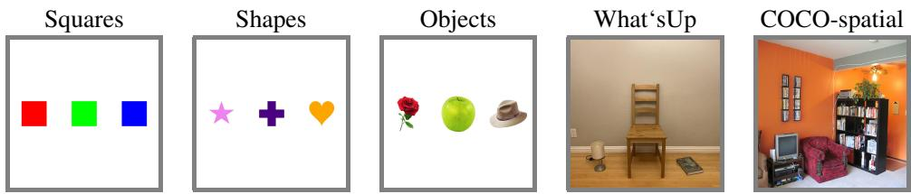

[← 返回 README](../README.md)

# Abstract & Figure 1

## 一、论文信息速览

| 项目 | 内容 |
|------|------|
| **标题** | The Dual Mechanisms of Spatial Variable Binding in Vision–Language Models |
| **作者** | Kelly Cui\*1, Nikhil Prakash\*2, Shoval Messica, Ayush Raina3, David Bau2, Antonio Torralba1, Tamar Rott Shaham1 |
| **单位** | 1 MIT CSAIL, 2 Northeastern University, 3 Sony Playstation |
| **发表** | arXiv 2026 |
| **项目页** | https://spatial.baulab.info |

---

## 二、原始文本

Many multimodal tasks, such as image captioning and visual question answering, require vision–language models (VLMs) to bind objects with their properties and spatial relations. Yet it remains unclear where and how such associations are computed within VLMs. In this work, we show that VLMs rely on two concurrent mechanisms to represent spatial variable binding. In the language model backbone, intermediate layers represent content-independent spatial relations on top of visual tokens corresponding to objects. However, this mechanism plays only a secondary role in shaping model predictions. Instead, the dominant source of spatial information originates in the vision encoder, whose representations encode the layout of objects and are directly exploited by the language model backbone. Notably, this spatial signal is distributed globally across visual tokens, extending beyond object regions into surrounding background areas. We show that enhancing these vision-derived spatial representations globally across all image tokens improves spatial variable binding performance across models of various sizes on complex natural images from the COCO datasets. Together, our results clarify how spatial variable binding is computed within VLMs and highlight the central role of vision encoders in enabling it.

> **一句话概括**: VLMs 的空间变量绑定依赖两套并行机制——**视觉编码器提供全局分布式的空间排序信号（主导来源）**，LM backbone 中间层在物体 token 上形成局部排序表征（辅助角色）。基于此机制理解，放大视觉嵌入中的排序方向即可在 COCO 自然场景上显著提升空间推理准确率。

---

*Figure 1: Experimental Settings. We study the internal mechanism responsible for spatial variable binding across three synthetic settings (Squares, Shapes, Objects) and one naturalistic controlled settings (What'sUp). We further show that our findings generalize to complex natural scenes from the COCO dataset, where a simple intervention corrects spatial binding failures.*

> **Figure 1 批读**: 实验设计总览，展示了从受控到自然的四层数据集递进：Squares（彩色方块）→ Shapes（几何图形）→ Objects（真实物体图）→ What'sUp（受控自然场景），最后在 COCO-spatial（完全自然图像）上验证纠正干预。这种递进设计的核心逻辑是：**受控设置支持严格因果分析（需配对 counterfactual），自然场景验证生态效度**。

> **问题动机**: (1) 空间变量绑定（如"绿色方块左边的方块是什么颜色"）是 VLMs 的基本能力，但现有 VLM 在该能力上表现不佳；(2) LM 领域已发现变量绑定依赖内容无关的排序表征，但 VLM 中这些表征的**来源是哪里**（视觉编码器？LM backbone？两者的交互？）完全未知；(3) 只有搞清楚来源，才能针对性地诊断和纠正 VLM 的空间推理失败。

> **机制拆解 — 双重机制的发现路线图**:
>
> | 步骤 | 方法 | 发现 |
> |------|------|------|
> | Step 1 (Sec 5.1) | 在 final token 做 interchange intervention | 确认 VLM 确实使用排序信息进行空间推理 |
> | Step 2 (Sec 5.2) | linear probe + causal intervention on vision tokens | 视觉编码器是排序信息的主要来源，信息以 strip 模式分布在物体+背景 token |
> | Step 3 (Sec 5.3) | 消融视觉排序信息 + 在 LM backbone 做 patching | LM backbone 可独立生成排序信息（辅助机制） |
> | Step 4 (Sec 5.4) | 放大 visual embeddings 中的 probe 方向 | 在 COCO 自然图像上纠正 55% 的错误预测 |

---

## 三、Summary

- **核心问题**: VLM 中空间变量绑定的排序表征从何而来？（视觉编码器 / LM backbone / 交互？）
- **核心发现**: 双重机制 —— 视觉编码器提供全局分布式的排序信号（主导），LM backbone 提供局部排序信号（辅助）
- **关键surprise**: 排序信息在视觉 token 中不是局部于物体区域，而是以 strip 模式扩散到背景 token
- **实用价值**: 简单放大视觉 embedding 中的排序方向即可显著改善 COCO 自然场景上的空间推理性能
