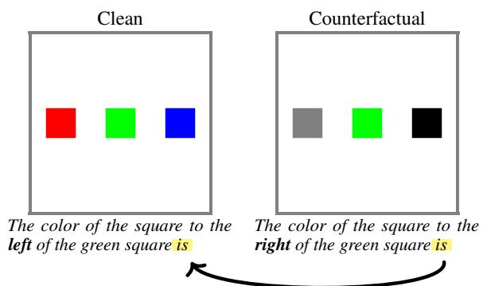
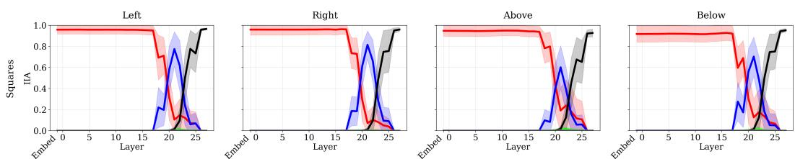
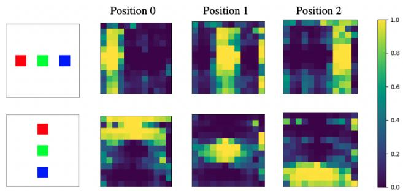
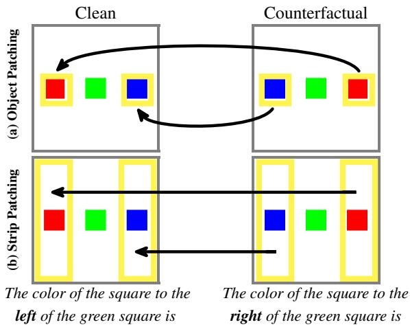
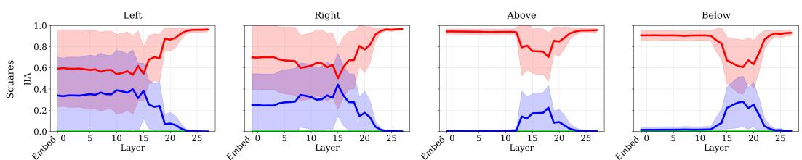
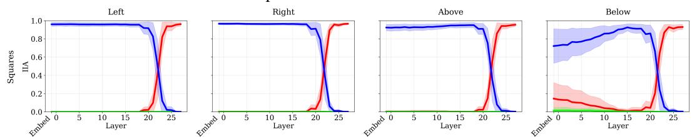
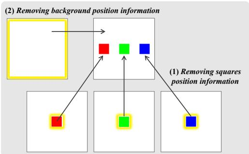
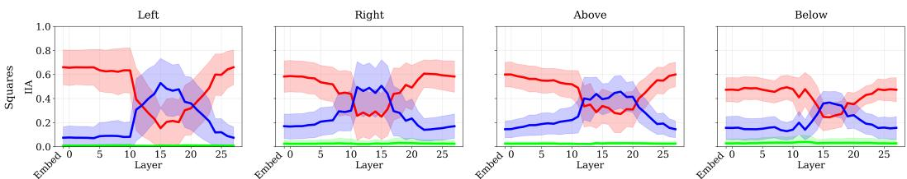

[← 返回 README](../README.md)

# 5. Experiments

## 一、Preview

本章是论文的核心实验部分，按逻辑递进分为四个阶段：
- **5.1** 确认 VLMs 使用排序信息做空间变量绑定（存在性验证）
- **5.2** 证明视觉编码器是排序信息的**主导来源**，且排序信息以 strip 模式分布式编码
- **5.3** 证明 LM backbone 可以**独立生成**排序信息，但仅为辅助角色
- **5.4** 基于机制理解设计纠正干预，在 COCO 自然图像上显著改善性能

---

## 二、原始文本

### 5.1 VLMs Use Ordering Information for Spatial Variable Binding

We begin by establishing the presence of ordering representations that the model uses at the final token position, across a range of tasks, as described in Sec. 3.1, by conducting interchange intervention experiments at the final token position. Specifically, we separately patch the residual stream vector of each layer at the last token position with that from a counterfactual sample (see Fig. 2) featuring different square colors in the image and a different directional query.



If the model uses the ordinal position of the queried square to retrieve its color, we expect this ordering information to be transferred from the counterfactual run to the clean run. Concretely, in the counterfactual run corresponding to Fig. 2, if the model encodes a representation indicating that the third object is the correct one, patching this representation into the clean run should cause the model to select the object with the same ordinal position in the clean image. As a result, the output should change from the color of the originally selected object (the leftmost square; Red) to the color of the square in the clean image corresponding to the third position (Blue), which matches the correct position in the counterfactual run.

> **Fig 2 实验逻辑拆解**:
>
> ```
> Clean Run:    [R G B] + "square to LEFT of green"  → 输出 "Red" (第1个)
> Counterfactual Run: [Gy G Bk] + "square to RIGHT of green" → 输出 "Black" (第3个)
>
> Patching: 将 Counterfactual 的 final token residual stream 注入 Clean 对应位置
>
> 如果输出变为:
>   - "Blue" (Clean 的第3个) → 说明**排序信息**被转移 (3rd position)
>   - "Black" (Counterfactual 的颜色) → 说明**属性信息**被直接转移
>   - "Red" (不变) → 说明该层对输出无因果作用
> ```

In contrast, if the model directly transfers attribute information rather than ordering information, patching the final-token representation from the counterfactual run should cause the output to reflect the color of the queried square in the counterfactual image itself (e.g., Black in Fig. 2), independent of the object selected in the clean image. Observing this behavior would indicate that color information (rather than ordinal position) is being transferred by the intervention. We quantify the effect of this intervention using interchange intervention accuracy (IIA; Section 3.3).

Figure 3 shows that the final output initially corresponds to the color of the correct square of the clean input between layers 0-19, indicating that the intervention on these layers has no effect. It then switches to selecting the color of the square in the clean image corresponding to the ordinal position of the correct square in the counterfactual image at layers 20-22, indicating that ordering information is being transferred. At layers 23-27, the model switches to the color of the counterfactual correct square, indicating that correct color attribute information is being transferred directly.



> **Fig 3 分析 — 三层阶段切换揭示了 VLM 的两阶段计算**:
>
> ```
> Layer 0-19:   输出 = Clean 正确答案
>               干预无效果 → 这些层不编码 final token 的排序/属性信息
>
> Layer 20-22:  输出 = Clean 中对应 Counterfactual 序号的物体颜色
>               排序信息被传输 → 这些层编码"第几个物体"的排序标识符
>
> Layer 23-27:  输出 = Counterfactual 中正确物体的颜色
>               属性信息被直接传输 → 这些层编码"该物体的颜色"
> ```
>
> **关键推论**: 模型先计算"哪个位置"（排序），再检索"该位置是什么颜色"（属性）。这与 LM 中变量绑定的两阶段机制完全一致（Section 4.1），验证了空间变量绑定和语言变量绑定共享相同的底层计算模式。

This pattern suggests that the model first computes an ordering representation of the correct square and then, in later layers, retrieves its corresponding color information. For clarity, we present results for the Squares setting for the Qwen model. Consistent behavior is observed across all settings and models (App. C.1). Results are averaged over 50 clean-counterfactual pairs per setting. For convenience, the plots use the color scheme from the example in Fig. 2; however, the specific colors, shapes, and object categories vary across data points, as well as the queried directions.

### 5.2 Is Vision Encoder the Source of Ordering Representations?

While the previous subsection established the presence of ordering representations, it did not fully characterize them. In particular, a key open question concerns where these ordering representations are generated within VLMs: are they produced in the LM backbone, the vision encoder, or through interactions between the two components? Identifying the source of ordering representations is important not only for understanding how they arise, but also for enabling targeted mechanistic interventions to improve the reasoning capabilities of VLMs.

#### 5.2.1 Probing Visual Embeddings

We begin by asking whether ordering representations originate in the vision encoder. To address this question, we train linear probes on visual token embeddings, extracted immediately after projection from the vision encoder, to predict the ordinal position of each object in the image. Successful probe performance indicates that ordering information is linearly decodable from the visual embedding.



For each image setting described in Section 3.1, we train two linear probes, one for horizontal and one for vertical configurations, to classify embeddings as one of three spatial positions. Training data is constructed using token embeddings extracted from 90 images; the embeddings that correspond to the three objects in an image serve as positive examples for their respective positions. In the Squares, Shapes, and Objects datasets, identifying the visual tokens associated with each object is straightforward due to their fixed spatial layouts. In contrast, objects in the What'sUp dataset vary in size and are not aligned to fixed positions. To handle this, we preprocess What'sUp images by extracting bounding boxes for each object and use their spatial coordinates to identify the corresponding visual tokens (see Fig. 35).

The resulting classifiers achieve nearly perfect accuracy on a test set of 30 images. In addition to classifying object-token representations, we also apply the probes to all other tokens in the image to assess whether ordering information representations are present in them. Surprisingly, we find that the information about the object ordering is not confined to tokens corresponding to the objects themselves, but is instead distributed across multiple background tokens, as shown in Fig. 4. Notably, probe predictions exhibit a strip-like spatial pattern aligned with object position, indicating that positional information is distributed coherently across background tokens rather than localized to object regions. This behavior contrasts with prior work on LMs [30, 31, 10], which shows that such representations are typically localized to a single token or a small set of adjacent tokens. In the following subsections, we demonstrate that the information contained in these strips is causally relevant for producing the correct final output. In Sec. 5.4, we further leverage this observation by intervening along probe directions to improve model performance.

> **核心发现: Strip 模式 — 本文最 surprising 的实证结果**:
>
> ```
> 纯 LM 世界: 排序信息局部于单个/少量 token
>     "Box B contains..."  → 只有 "B" token 编码排序
>
> VLM 世界 (本文发现): 排序信息全局分布，带状扩散
>     [左物体][背景][中物体][背景][右物体]
>     ←─ strip ─→←─ strip ─→←─ strip ─→
>     排序 = "左"  排序 = "中"  排序 = "右"
> ```
>
> **为什么叫 strip？** 因为 probe 在水平排列的物体上预测时，预测结果呈现垂直条带：位于左物体及其周围区域的 token 都被 probe 归类为"左"，而不是只有左物体本身的 token。这与视觉编码器的 patch 划分方式密切相关 —— 连续位置的 patch 共享相邻的空间信息。
>
> **对 interpretability 的启示**: 标准的单 token 分析方法（如 attention map 分析、单个 token 的 probe）可能会**完全漏掉**这类分布式表征。

#### 5.2.2 Causal Intervention on Vision Tokens

Although the probing results demonstrate the presence of ordering information in visual representations, they do not by themselves establish a causal relationship with the model's final output. We therefore perform interchange intervention experiments to test whether systematically manipulating these representations leads to corresponding changes in the model's predictions.



As illustrated in Fig. 5, we intervene on visual token embeddings by swapping the left and right strips of the clean image with those from a counterfactual image. Specifically, we replace the embeddings of the left strip in the clean image with the right-strip embeddings from the counterfactual image, and vice versa. The intervention is designed such that both patched regions contain squares of the same color, ensuring that color values are preserved and that only ordering information is altered. In addition to intervening on the visual token embeddings, we also separately patch the residual stream vectors of each layer of the LM backbone.

If ordering information encoded by the vision encoder is causally relevant, this intervention should cause the model's final output on the clean image to switch from the left square (red) to the right square (blue), reflecting the swapped ordering information. As shown in Fig. 7, we observe the expected change in the final output when either the visual token embeddings or the residual stream vectors up to layer 24 are patched. In contrast, patching only the square-localized visual tokens, without the surrounding strip, does not reliably induce this change (Fig. 6). These indicate that ordering information encoded by the vision encoder is not localized to object tokens, but is distributed across background visual tokens.




> **Fig 6 vs Fig 7 的核心对比 — 因果证据链**:
>
> | 干预方式 | 结果 | 因果推断 |
> |---------|------|---------|
> | **仅 patch 物体 token** (Fig 6) | 输出基本不变 → | 物体 token 单独不携带足够的排序信息 |
> | **Patch 物体 + strip** (Fig 7) | 输出按预期翻转 → | 背景 strip 中的排序信息对输出有因果作用 |
>
> **实验设计的精妙之处**:
> - Left↔Right 对称交换 + 同色匹配：确保只改变排序信息，不改变颜色信息
> - Visual embedding 层和 residual stream 各层都测试：定位信息传输的层级
> - Layer 23 后 patching 失效：因为此时排序信息已经从视觉 token 传递到了 final token（与 5.1 的发现一致）

We observe similar behavior in other settings, including Shapes, Objects, and What'sUp, which also generalizes to all models, as described in App. C.3. All results are averaged over 50 samples. Moreover, the fact that the original correct square logit overtakes the intervened one around layer 23 indicates that by that layer, all the required information, including both ordering and color value information, is transferred to the last token, as discussed in Sec. 4.2.

### 5.3 LM Backbone Enhances Ordering Information

In the previous sections, we showed that visual token embeddings produced by the vision encoder and projector module already encode object ordering information. We now ask what role, if any, the LM backbone plays in spatial variable binding. Namely, does the LM backbone merely consume ordering information from the vision components, or can it generate such information when needed?

#### 5.3.1 Removing Ordering Information from Vision Embeddings

To isolate the contribution of the LM backbone, we first ablate ordering information from the visual token embeddings using the interventions illustrated in Fig. 8. Specifically, we apply two modifications: (1) we replace the embedding of each square with an embedding of the same-colored square taken from an image in which that square appears alone in the middle of the image, thereby preserving color information while removing relative ordering; and (2) we replace all background-token embeddings with those from an empty image, eliminating ordering information encoded in background regions. Together, these interventions effectively remove ordering information originating from the vision encoder, while preserving object colors. We do not apply this intervention to the What'sUp dataset, as constructing a precise intervention is challenging for natural images.



As shown in Table 5, removing ordering information from the vision embeddings leads to a substantial drop in performance across datasets, confirming the central role of vision-derived ordering information. However, performance remains above chance (33.3%), suggesting that the LM backbone can compensate for the missing ordering signals.

Table 5: Behavioral performance after removing spatial information from vision embeddings.

| | Squares | Shapes | Objects |
|---|---------|--------|---------|
| Qwen2-VL-7B-Instruct | 0.60 | 0.62 | 0.43 |
| Gemma-3-4b-it | 0.57 | 0.64 | 0.54 |

> **消融实验的三层解读**:
>
> ```
> 原始准确率:    1.00 → 消融后: 0.43-0.64  (下降 36-57pp)
>                                    ↓
> 结论 1: 视觉编码器的排序信息确实起主导作用（大幅下降证明因果重要性）
>
> 消融后准确率:  0.43-0.64 > 0.33 (random chance)
>                                    ↓
> 结论 2: LM backbone 可以部分补偿缺失的排序信号
>
> Objects (0.43) < Shapes (0.62) < Squares (0.60)
>                                    ↓
> 结论 3: 物体越复杂，LM backbone 的补偿能力越弱
>    → 可能是视觉编码器对复杂物体的空间编码更丰富，一旦移除损失更大
> ```

#### 5.3.2 Do LMs Backup Ordering Information?

To test whether the LM backbone generates its own ordering information, we perform an interchange intervention experiment analogous to that described in Section 5.2.2, but under the ablated-vision setting described above (e.g., the LM gets images with no ordering information from the vision encoder). In contrast to earlier experiments, here we patch only the square-associated visual tokens, rather than the entire strips.

If the LM backbone generates ordering information independently, then patching square tokens from a counterfactual run should transfer this order information and induce a change in the final output. If not, the model's prediction should remain unchanged. The results in Fig. 9 show a flip in model prediction according to order information at middle layers. This indicates that, when vision-derived ordering information is removed, the LM backbone forms its own ordering representations in middle layers, and that patching these representations switches the prediction according to the patched order. See App. C.3 for other settings and models.



> **Fig 9 的关键对比: 有无视觉排序信息时的 LM backbone 行为**:
>
> | 条件 | 现象 | 说明 |
> |------|------|------|
> | 有视觉排序信息 (Fig 7) | Embedding 层 patching 就翻转输出，贯穿 layer 0-24 | 视觉排序信息从头开始就可用，LM backbone 直接消费 |
> | 无视觉排序信息 (Fig 9) | Embedding 层 patching 不翻转，仅在 layer 11-20 翻转 | 视觉排序被移除后，LM backbone 在中间层**重新生成**排序信息 |
>
> **核心 insight**: LM backbone 不是一个被动的排序信息消费者，它具备在中间层独立构建排序表征的能力。但这种能力是"backup"角色 —— 正常情况不主导，视觉信号缺失时才激活。

Together, these results indicate that VLMs rely on two sources of ordering information: a primary signal originating from the vision encoder and projector module, and a secondary signal generated within the LM backbone. While the vision-derived signal dominates when present, the LM backbone can partially reconstruct ordering information and act as a backup mechanism. Supporting evidence for this interpretation is provided in Figs. 7, 20, 19, where we show that vertically arranged objects strengthen ordering signals in the same intermediate LM layers, indicating the LM backbone enhances the ordering information provided by the vision embedding in these cases.

> **双重机制的形式化总结**:
>
> ```
>                 正常情况                    视觉排序被消融时
>                 ────────                    ──────────────
> Vision Encoder  ████████████ (主导)         ░░░░░░░░░░░░ (移除)
> LM Backbone     ████ (增强/补充)             ████████ (独立生成, 辅助)
> 
> Final Accuracy  1.00                        0.43-0.64
> ```

### 5.4 Correcting Incorrect Predictions

Our mechanistic analysis shows that ordering information is essential for spatial variable binding. We therefore hypothesize that amplifying vision-derived ordering representations can correct spatial binding failures. To test this, we enhance the ordering information in the vision embeddings by amplifying probe directions identified with the procedure of Sec. 5.2.1. These probe directions are trained to capture ordering information; amplifying them should therefore enhance ordering signals of the vision encoder.

We evaluate this on the COCO-spatial dataset using a spatial relation task: given a query object and a reference object, the model must determine the spatial relation of the query object relative to the reference (left/right or above/below). Formally, for each visual token t, we modify its embedding: $emb_t$ = $emb_t$ + $α_i$ · $probe_i$, where $α_i$ ∈ [1, 15] is an amplification coefficient and $probe_i$ is the probe for queried direction i trained with the setting mentioned in Sec. 5.2.1. We apply this intervention globally to all visual token embeddings (without the need to know which correspond to the queried objects), across all possible probe directions (without the need to know which direction is queried). As a baseline, we perform the same intervention using randomly sampled directions, allowing us to isolate the effect of amplifying ordering-specific representations. Refer to App. A.4 for more details.

> **Probe 放大干预的优雅之处**:
>
> ```
> $emb_t$ = $emb_t$ + $α_i$ · $probe_i$
> 
> 三个"不需要":
>   1. 不需要知道哪些 token 对应 query/reference 物体 → 全局应用
>   2. 不需要知道 query 问的是哪个方向 → 所有 probe 方向都放大
>   3. 不需要微调/训练 → test-time 干预
> 
> 仅有的要求: 需要线性 probe 的权重方向（来自正确样本训练的 probe）
> ```

Table 2 shows results across three models (for Qwen, we report the 2B variant as the 7B model achieves near-perfect baseline accuracy on this dataset, leaving insufficient failures for intervention.). The ordering amplification consistently corrects a substantial fraction of previously incorrect predictions, improving accuracy by approximately 20% and 30% for Gemma and Qwen, respectively. These results demonstrate that directly strengthening vision-derived ordering representations improves spatial variable binding on complex natural images, without any fine-tuning or access to ground-truth labels or object layout. In addition, the results demonstrate that the insights from our controlled causal analysis generalize to real-world conditions.

Table 2: Amplifying ordering representation corrects failures.

| | Gemma | Gemma | Qwen | Qwen |
|---|-------|-------|------|------|
| Intervention | Acc. | % Corr. Fail. | Acc. | % Corr. Fail. |
| None | 0.53 | | 0.60 | |
| Random amp. | 0.57 | 9.6% | 0.65 | 13.1% |
| Ordering amp. | 0.72 | 40.2% | 0.82 | 54.5% |

> **Table 2 深度解读**:
>
> ```
>                      Gemma-3-4B          Qwen2-VL-2B
> 基线准确率:           0.53 (≈随机)        0.60
> 随机放大:             0.57 (+9.6%)        0.65 (+13.1%)
> 排序放大:             0.72 (+40.2%)       0.82 (+54.5%)
> 
> 排序放大 vs 随机放大:  3-4 倍纠正率差距
>   → 证明效果来自排序方向的特殊性，而非简单的高维扰动
>
> Qwen-2B > Gemma-3-4B 的纠正率:
>   → Qwen 的视觉编码器可能编码了更强的排序信号，放大后效果更显著
>   → 或者 Qwen 的 LM backbone 对视觉排序信号更敏感
> ```

### 6 Conclusions

We show that spatial variable binding in VLMs relies on ordering representations arising from two complementary sources: a primary signal encoded by the vision encoder and a secondary mechanism formed within the LM backbone. By isolating, intervening on, and amplifying these representations, we demonstrate a simple intervention that corrects spatial variable binding failures. Our result highlight that mechanistic understanding can lead to improved model performance.

---

## 三、Summary

- **5.1 排序信息存在性**: Final token patching 实验确认 VLMs 使用排序信息，且分为排序编码 (layer 20-22) 和属性检索 (layer 23-27) 两个阶段
- **5.2 视觉编码器是主导来源**: (i) Linear probe 在 visual embedding 上 ~100% 预测位置；(ii) 排序信息以 strip 模式扩散到背景 token；(iii) Patch strip 才能翻转输出，patch 物体 token 不够
- **5.3 LM backbone 是辅助机制**: (i) 消融视觉排序信息后准确率从 1.00 降至 0.43-0.64；(ii) 消融后 LM backbone 可在中间层独立生成排序信息 (layer 11-20)
- **5.4 机制理解指导纠正**: 放大 vision embedding 中 probe 方向 → 纠正 COCO 自然图像上 40-55% 的错误预测 → 准确率提升 19-22 pp
- **核心 takeaway**: 视觉编码器在 VLM 的空间推理中扮演比之前认知更核心的角色，未来改进 VLM 应更多关注视觉编码器的空间编码质量
