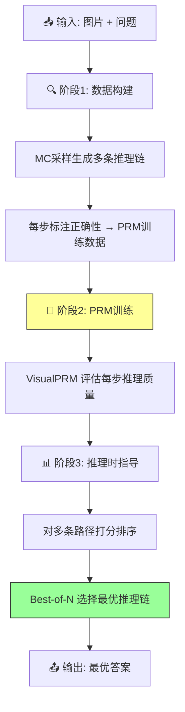

# VisualPRM: An Effective Process Reward Model for Multimodal Reasoning

## Paper Metadata

| 项目 | 内容 |
|------|------|
| **Title** | VisualPRM: An Effective Process Reward Model for Multimodal Reasoning |
| **Authors** | Weiyun Wang, Zhangwei Gao, Lianjie Chen, Zhe Chen, Jinguo Zhu, Xiangyu Zhao, Yangzhou Liu, Yue Cao, Shenglong Ye, Xizhou Zhu, Lewei Lu, Haodong Duan, Yu Qiao, Jifeng Dai, Wenhai Wang |
| **Affiliations** | Fudan University, Shanghai AI Laboratory, Shanghai Jiaotong University, Tsinghua University, Nanjing University, The Chinese University of Hong Kong, SenseTime Research |
| **Venue** | arXiv 2025 |
| **Paper Link** | https://arxiv.org/abs/2504.99999 |
| **Model Params** | 8B |
| **Dataset Size** | VisualPRM400K (~400K multimodal process supervision samples), VisualProcessBench (2,866 samples, 26,950 human-annotated steps) |

## One-Sentence Summary

VisualPRM 提出首个多模态过程奖励模型 (PRM, 8B)，构建了约 400K 的自动过程监督数据集 VisualPRM400K 和人工标注的步骤级评测基准 VisualProcessBench，通过 Best-of-N (BoN) 评估策略显著提升跨模型家族和规模的 MLLM 推理能力，在 7 个多模态推理 benchmark 上最高提升 8.4 点 (InternVL2.5-8B)，并一致优于 Outcome Reward Model 和 Self-Consistency。

## Core Contributions

1. **构建 VisualPRM400K 数据集** (Section 3.1): 首个大规模多模态过程监督数据集（约 400K 样本, 2M 步骤），基于 Monte Carlo 采样的自动数据管线生成步骤级正确性标注，每个样本包含图像、问题、逐步解答和每步的 expected accuracy。

2. **提出 VisualPRM 模型** (Section 3.2): 8B 参数的多模态 PRM，将过程监督建模为多轮对话任务，预测每个推理步骤的正确性。支持 value-based 和 advantage-based 两种建模方式，在 BoN 评估中作为 critic model 筛选最优回复。

3. **构建 VisualProcessBench 评测基准** (Section 3.3): 包含 2,866 个样本和 26,950 条人工标注的步骤级正确性标签，要求模型识别解答中的**所有**错误步骤（而非仅首个错误步骤），覆盖 5 个多模态推理 benchmark 和多种主流 MLLM 生成的解答。

4. **全面的实验验证** (Section 4): 在 4 种模型家族（MiniCPM, QwenVL, InternVL2.5）及 4 个规模（7B/8B/26B/38B/78B）上验证 BoN 有效性；PRM 在 BoN 评估中一致优于 ORM 和 Self-Consistency，性能差距随 N 增大而扩大；VisualPRM 在 VisualProcessBench 上达到开源 SOTA（F1=62.0），媲美 Gemini-2.0-Flash。

## Section Navigation

| 章节 | 文件 | 核心内容 |
|------|------|---------|
| Abstract & Figure 1 | [00-abstract.md](sections/00-abstract.md) | 论文概述、BoN 评估对比 |
| 1. Introduction | [01-introduction.md](sections/01-introduction.md) | TTS 适配 MLLM 的挑战、三大贡献 |
| 2. Related Work | [02-related-work.md](sections/02-related-work.md) | MLLM 发展、PRM 研究、Reward Model 评测基准 |
| 3. Method | [03-method.md](sections/03-method.md) | VisualPRM400K 数据构建、VisualPRM 建模、VisualProcessBench |
| 4. Experiments | [04-experiments.md](sections/04-experiments.md) | BoN 结果、VisualProcessBench 评测、消融实验 |
| 5. Conclusion | [05-conclusion.md](sections/05-conclusion.md) | 总结与展望 |

## Key Numbers

| 指标 | 数值 |
|------|------|
| PRM 参数量 | 8B |
| VisualPRM400K 样本数 | ~400K |
| VisualPRM400K 步骤数 | ~2M |
| 每个 response 平均步数 | 5.6 |
| 错误步骤比例 | ~10% |
| VisualProcessBench 样本数 | 2,866 |
| VisualProcessBench 总步骤数 | 26,950 |
| 人工标注工作量 | 13 人 x 3 天 = 39 人天 |
| 标注成本 | ~37 美元/人天 |
| BoN 评测 Benchmark 数 | 7 |
| 策略模型数量 | 4 families (MiniCPM, QwenVL, InternVL2.5) |
| BoN 默认 N | 8 |
| InternVL2.5-8B 提升 | +8.4 points (Overall) |
| MiniCPM-V2.6 提升 | +8.0 points (Overall) |
| InternVL2.5-78B 提升 | +5.9 points (Overall) |
| VisualPRM on VisualProcessBench | F1=62.0 (开源 SOTA) |
| Pass@1 (InternVL2.5-8B) baseline | 32.8 |

## Data Flow: VisualPRM400K Construction + VisualPRM Training + BoN Evaluation

## Pros/Cons & Future Work

### Strengths

1. **首个多模态 PRM**: 填补了多模态过程奖励模型的空白，将 PRM 从纯文本数学推理迁移到多模态场景
2. **自动数据管线**: 基于 Monte Carlo 采样的自动标注 pipeline 大幅降低了过程监督数据的构建成本（无需人工标注 VisualPRM400K）
3. **跨模型跨规模泛化**: 在 4 个模型家族、4 个规模上一致有效，包括 78B 大模型
4. **基准构建严谨**: VisualProcessBench 经过 13 人 3 天人工标注，包含质量审核机制（作者抽检 10%），标注质量有保障
5. **全面超越 ORM 和 SC**: PRM 不仅优于随机选择，还一致优于结果奖励模型和 Self-Consistency，且优势随 N 增大而扩大
6. **推理效率高**: VisualPRM 在单次前向传播中计算所有步骤分数（使用 "+" 作为占位符 token），避免 autoregressive 生成
7. **文本场景同样有效**: 在 GSM8K、MATH-500、GPQA-Diamond 等纯文本推理 benchmark 上也表现良好

### Weaknesses / Limitations

1. **数据 pipeline 依赖策略模型质量**: VisualPRM400K 的解答和 Monte Carlo 续写均由 InternVL2.5 生成，如果策略模型本身解题能力不足，生成的过程监督质量会受影响
2. **步骤数受限**: 数据构建时 max steps=12，对于需要更多推理步骤的复杂问题可能不够
3. **错误步骤分布不均**: 仅约 10% 的步骤为错误步骤，正负样本的类别不均衡可能影响 PRM 对错误步骤的判断精度
4. **BoN 计算开销**: 虽然 PRM 推理效率高，但 BoN 需要策略模型生成 N 个候选回复（主要开销在策略模型）
5. **未探索 RL 场景**: 工作聚焦于 Test-Time Scaling (BoN)，未探索 PRM 在 RLHF/RL 训练阶段的应用
6. **图像理解局限**: PRM 的步骤判断能力受限于底层 MLLM 的视觉理解上限

### Future Work

1. 探索 PRM 在 RL（如 PPO/GRPO）训练阶段的潜力
2. 扩展到更长推理链（>12 步）和更复杂的多模态推理任务
3. 提升错误步骤检测的细粒度（如区分逻辑错误 vs. 视觉感知错误）
4. 探索 PRM 与其他 TTS 策略（如 beam search, tree search）的结合
5. 探索将 VisualProcessBench 扩展到视频等多模态场景

## Reading Q&A Record

| # | 问题 | 答案位置 | 解答 |
|---|------|---------|------|
| 1 | 为什么 BoN 中 PRM 优于 ORM？ | Section 4.3, Figure 4 | PRM 提供了步骤级细粒度信号，能更精确地评估推理链质量。ORM 只看最终结果，容易将"步骤有错但答案碰巧对"的回复评为高分。此外随着 N 增大，ORM 性能甚至出现下降（Best-of-128 < Best-of-64），而 PRM 持续提升。 |
| 2 | 为什么 value-based PRM 优于 advantage-based PRM？ | Section 4.3, Table 4 | 自动数据管线生成的训练数据存在固有噪声，导致很难准确判断某一步是提升了还是降低了 expected accuracy。Value-based 只需判断"是否有正确可能"（mc_i > 0），比 advantage-based 的"变好/不变/变差"三分类更鲁棒。 |
| 3 | 为什么用平均聚合步骤分数而不是取最大值？ | Section 4.3 | 大部分回复在解答开头有接近 1 的高分步骤，但错误步骤通常出现在中间。取最大值会因开头的高分而过早选择一个推理过程中段有错误的回复。平均聚合可视为 ensemble 方法，综合多步信号，效果更好。 |
| 4 | 为什么 expected accuracy threshold=0 效果最好，提高 threshold 反而下降？ | Section 7.1, Table 8 | 提高 threshold（如 >0.625 才算正确）会减少正样本数量，消融掉了边界样本（低确定性但仍有一定正确概率的步骤）。这与 Qwen2.5-Math-PRM 的发现一致。 |
| 5 | VisualProcessBench 为什么要求识别所有错误步骤而不是仅首个？ | Section 3.3 | 近期模型开始具备 reflection 能力，能在推理过程中自我纠正。仅寻找第一个错误步骤会造成 false negative（模型后面可能发现并纠正了错误）。要求识别所有错误步骤更能反映模型实际的步骤判断能力。 |
| 6 | MLLM 作为 critic 为什么效果差？ | Section 4.2-4.3, Table 3-4 | 开源 MLLM 倾向于对大多数步骤给出正面评价（InternVL2.5-8B 对正步 F1=76.8，对负步 F1=19.2），难以识别错误。且 MLLM 需要 autoregressive 生成判断文本，推理效率低。VisualPRM 用 probability-based scoring 避免了这个问题。 |
| 7 | VisualPRM 在纯文本任务上有效吗？ | Section 4.3, Table 5 | 是的。在 GSM8K、MATH-500、GPQA-Diamond 上，VisualPRM 能提升 Qwen2.5 和 InternVL2.5 系列的表现。虽然训练数据是多模态的，但 PRM 学到的步骤评估能力可迁移到纯文本场景。 |

## Citation Landscape

### Semantic Scholar TLDR
> "VisualPRM is an 8B multimodal Process Reward Model that improves MLLM reasoning via Best-of-N evaluation, built on the VisualPRM400K dataset and evaluated on the human-annotated VisualProcessBench."

### Reference Grouping by Topic

**MLLM Backbones & Architectures**:
- InternVL series [14, 15, 16], Qwen-VL/Qwen2.5-VL [5, 6, 7], LLaVA [41, 42], MiniCPM-V [89], Flamingo [3], CogVLM [81], BLIP-2 [36], VisionLLM [80]

**Process Reward Models (PRM)**:
- PRM800K [39] (首个开源过程监督数据集), Math-Shepherd [79] (Monte Carlo 自动标注), OmegaPRM [51] (自动数据管线), Qwen2.5-Math-PRM [94] (PRM 经验教训)

**Reward Model Benchmarks**:
- RewardBench [33], VL-RewardBench [37], RM-Bench [44], RMB [97], PRMBench [69], ProcessBench [96]

**Test-Time Scaling**:
- Self-Consistency [86], RLHF Workflow [20], Scaling Test-Time Compute [68], s1 [57]

**Reinforcement Learning for MLLMs**:
- REINFORCE [2, 26], PPO [64], DeepSeek-R1 [24], DeepSeekMath [66], MMPR/Mix Preference Optimization [82]

**Multimodal Reasoning Benchmarks**:
- MMMU [90], MathVista [50], MathVision [78], MathVerse [93], DynaMath [99], WeMath [60], LogicVista [87]

---

*Batch reading created on 2026-06-24*
