# VisualPRM: An Effective Process Reward Model for Multimodal Reasoing

Weiyun Wang1,2, Zhangwei Gao3,2, Lianjie Chen4,2, Zhe Chen5,2, Jinguo Zhu2, Xiangyu Zhao3,2, Yangzhou Liu5,2, Yue Cao5,2, Shenglong Ye2, Xizhou Zhu4,2, Lewei Lu7, Haodong Duan2, Yu Qiao2, Jifeng Dai4,2, Wenhai Wang6,2 B

1Fudan University, 2Shanghai AI Laboratory,

3Shanghai Jiaotong University, 4Tsinghua University,

5Nanjing University, 6The Chinese University of Hong Kong, 7SenseTime Research

## Abstract

We introduce VisualPRM, an advanced multimodal Process Reward Model (PRM) with 8B parameters, which improves the reasoing abilities of existing Multimodal Large Language Models (MLLMs) across different model scales and families with Best-of-N (BoN) evaluation strategies. Specifically, our model improves the reasoing performance of three types of MLLMs and four different model scales. Even when applied to the highly capable InternVL2.5-78B, it achieves a 5.9-point improvement across seven multimodal reasoing benchmarks. Experimental results show that our model exhibits superior performance compared to Outcome Reward Models and Self-Consistency during BoN evaluation. To facilitate the training of multimodal PRMs, we construct a multimodal process supervision dataset VisualPRM400K using an automated data pipeline. For the evaluation of multimodal PRMs, we propose VisualProcess-Bench, a benchmark with human-annotated step-wise correctness labels, to measure the abilities of PRMs to detect erroneous steps in multimodal reasoing tasks. We hope that our work can inspire more future research and contribute to the development of MLLMs. Our model, data, and benchmark are released in this page.

## 1. Introduction

With the remarkable success of Large Language Models (LLMs) [1, 4, 5, 9, 10, 21, 71, 75, 76] in natural language processing, Multimodal Large Language Models (MLLMs) [6, 14–16, 36, 41, 42, 58, 61, 80, 83, 84, 89] have also achieved significant advancements across various visionlanguage tasks. Despite their strong performance in perception and recognition, a large gap remains in reasoing capabilities between open-source and proprietary models.

  
Figure 1. The overall Best-of-8 evaluation results across seven multimodal reasoing benchmarks with different critic models. Our VisualPRM greatly enhances the overall performance, while InternVL2.5-8B struggles to be an effective critic model.

A series of studies have explored methods to enhance reasoing abilities, focusing on the perspectives of data collection and construction [38, 43, 57, 74], offline preference optimization [32, 59, 82], and online reinforcement learning [2, 24, 26, 66]. Additionally, another line of research [20, 68, 79, 94] investigates utilizing Test-Time Scaling (TTS) to enhance the reasoing abilities of LLMs. This approach requires the policy model to generate multiple response candidates and select the best one, based on the quality estimation of a critic model, thereby improving the response quality at the cost of higher inference time. However, TTS for MLLMs remains largely unexplored.

This work investigates the application of TTS for MLLMs, focusing on the Best-of-N (BoN) evaluation strategies. The challenges of adapting TTS for MLLMs involves: (1) Lack of effective critic models. In BoN evaluation, a critic model is required to estimate the quality of each response candidate. However, as shown in Figure 1, existing open-source MLLMs struggle to serve as critic models, leading to marginal improvements compared to models without TTS. This limitation stems from the lack of sufficient critic data in their training corpus. (2) Lack of evaluation benchmarks for multimodal critic models. The effectiveness of TTS heavily depends on the performance of the critic model. However, directly evaluating critics under BoN settings poses two key issues. First, the evaluation cost of BoN is expensive. Although the focus is on the performance of critic models, the policy model is required to generate N reasoing processes, with the majority of computational costs arising from the policy model. Second, BoN performance is also affected by the policy model, making it difficult to compare different critic models when paired with varying policy models.

To solve these challenges, we first introduce Visual-PRM400K, a dataset comprising approximately 400K multimodal process supervision data. Each sample includes an image, a question, a step-by-step solution, and correctness annotations for each step. Specifically, we collect question prompts from MMPR v1.1 [82] and then generate process correctness using an automatic data pipeline [79]. This pipeline samples multiple continuations starting from a certain step and computes the expected accuracy of that step as the average accuracy of its continuations.

To facilitate the evaluation of multimodal critic models, we introduce VisualProcessBench, a benchmark for evaluating PRMs and MLLMs in detecting erroneous steps in multimodal reasoing tasks. This benchmark includes 2,866 samples with 26,950 human-annotated step-wise correctness labels. Each sample includes a multimodal reasoing question, a step-by-step solution, and correctness labels for each step. To ensure annotation accuracy, we employ human experts with at least a university degree to manually assess the correctness of each step. Unlike prior benchmarks [39, 96], which require identifying only the first erroneous step, VisualProcessBench challenges models to detect all errors within a given solution. This adjustment aligns with recent advancements in model reflection abilities, helping to reduce false negatives in evaluations. Evaluation results reveal that existing open-source MLLMs struggle to accurately assess step-wise correctness, highlighting the need for improved multimodal critic models.

Building upon the dataset and benchmark, we develop VisualPRM, an advanced multimodal Process Reward Model (PRM) with 8B parameters, to serve as the critic model in BoN evaluation. Each training sample is formulated as a multi-turn chat. The first turn includes the image, the question, and the first solution step, while each subsequent turn presents a new step. The model is trained to predict the correctness of the given step at each turn. Experimental results demonstrate that VisualPRM enhances MLLM reasoing across different model families and scales. Specifically, VisualPRM improves the overall reasoing performance of MiniCPM-V2.6, QwenVL2.5- 7B, InternVL2.5-8B, and InternVL2.5-78B by 8.0, 3.7, 8.4, and 5.9 points, respectively, across seven multimodal rea soning benchmarks [50, 60, 78, 87, 90, 93, 99]. Additionally, we compare PRMs with Outcome Reward Models and Self-Consistency in BoN evaluation, finding that PRMs consistently outperform both approaches.

In summary, our main contributions are as follows:

(1) We introduce VisualPRM400K, a dataset comprising approximately 400K multimodal process supervision data. Building upon this dataset, we develop VisualPRM, an advanced multimodal PRM to serve as the critic model in the BoN evaluation.

(2) We construct VisualProcessBench, a benchmark designed to measure the abilities of PRMs and MLLMs to identify erroneous steps in multimodal reasoing tasks. This benchmark comprises 2,866 samples with a total of 26,950 human-annotated step-wise correctness labels.

(3) Through extensive experiments, we demonstrate that PRMs can serve as effective critic models for test-time scaling of MLLMs. Specifically, VisualPRM enhances the overall multimodal reasoing performance of MiniCPM-V2.6, QwenVL2.5-7B, InternVL2.5-8B, and InternVL2.5-78B by 8.0, 3.7, 8.4, and 5.9 points, respectively, across seven multimodal reasoing benchmarks. Furthermore, our results show that PRMs consistently outperform both ORMs and SC in BoN evaluation. Additionally, experiments on VisualProcessBench reveal that existing open-source MLLMs struggle to accurately assess the correctness of each step.

## 2. Related Work

Multimodal Large Language Models. A wide range of efforts has been made to advance the development of MLLMs, including improvements in model architecture, data construction, and training algorithms. From an architectural perspective, several studies [7, 15, 16, 41, 42, 45, 83–85, 89, 89] employ connectors to align visual embeddings from Vision Foundation Models (VFMs) [14, 91] with the latent space of LLMs [5, 71, 75, 76], achieving promising performance. Another series of works [3, 21, 73, 81] extends pre-trained LLMs with additional layers to fuse visual features, reducing the number of required visual tokens while introducing extra training cost. In terms of data construction, recent studies have made significant progress [34, 38, 43, 63, 82, 95, 98]. For example, Omni-Corpus [38] offers a noisy but large-scale multimodal corpus for pre-training, while MMInstruct [43] provides an open-source, high-quality instruction-tuning dataset. Additionally, MMPR [82] constructs a preference dataset focusing on multimodal reasoing abilities. Regarding training algorithms, the InternVL2.5 series [15, 82] proposes square loss and Mix Preference Optimization to enhance MLLM capabilities. Despite these advancements, existing works primarily focus on the training process of MLLMs, leaving Test-Time Scaling (TTS) for MLLMs largely underexplored. In this work, we investigate TTS applications for

  
Figure 2. Data examples in VisualPRM400K and VisualProcessBench. For VisualPRM400K, we generate the data using an automatic data pipeline. The key idea is to estimate the expected accuracy mci of the given step $s _ { \leq i }$ based on Monte Carlo sampling and consider the step correct if $m c _ { i } > 0 .$ . During the training process of VisualPRM, the data is formulated as multi-turn conversations and the model is required to predict the correctness of each step conditioned on the image, question, and previous steps. For VisualProcessBench, we collect questions from existing multimodal reasoing benchmarks [60, 78, 90, 93, 99] and generate the solutions using leading MLLMs [4 15, 58, 72, 82]. Based on these questions and solutions, we employ a team of human experts with at least a university degree to manually annotate the correctness of each step in the solutions.

MLLMs, specifically focusing on the Best-of-N evaluation to improve multimodal reasoing performance.

Process Reward Models. Reward models play a crucial role in Reinforcement Learning (RL) [2, 26, 64, 66] and TTS [20, 51, 68, 79]. Outcome Reward Models (ORMs) [55, 77, 92] directly assign an overall score to the given response. In contrast, Process Reward Models (PRMs) first estimate the quality of each step in the given response and then aggregate them into a final score. PRM800K [39] is the first open-source process supervision dataset, entirely annotated by human experts. To reduce annotation costs, MathShepherd [79] and OmegaPRM [51] introduce a Monte Carlo sampling-based data pipeline to automatically estimate the quality of each step. Despite these advancements in natural language processing, multimodal PRMs remain largely underexplored. In this work, we introduce VisualPRM400K, the first multimodal process supervision dataset, and develop VisualPRM, a multimodal PRM trained on this dataset.

Benchmarks for Reward Models. The evaluation of reward models (RMs) is a crucial research topic. A series of benchmarks [33, 37, 44] have been proposed to assess the effectiveness of RMs, typically formulated as a binary preference judgment task. Building on this, subsequent work [97] extends the evaluation settings and includes both pairwise and Best-of-N evaluations, providing a more comprehensive evaluation of RM performance. With the rapid advancement of PRMs, a series of benchmarks [69, 96] have been introduced to evaluate their step-wise judgment capabilities. Despite these developments, there remains a lack of a multimodal process benchmark. To bridge this gap and support the development of multimodal PRMs, we introduce VisualProcessBench, a benchmark designed to evaluate the ability of PRMs and MLLMs to detect erroneous steps in multimodal reasoing tasks.

## 3. Method

During Best-of-N (BoN) evaluation, a critic model is required to estimate the quality of each response candidate. In this work, we formulate the critic model as a Process Reward Model (PRM). To develop a multimodal PRM, we first construct VisualPRM400K, a dataset comprising about 400K multimodal process supervision data, as detailed in

  
Figure 3. Different modeling methods for PRMs. PRMs are developed to estimate the quality of each step in a given solution. For value-based PRMs, the quality of a certain step is determined by its expected accuracy $m c _ { i } ,$ , where a step is considered correct if $m c _ { i } > 0 .$ For advantage-based PRMs, the quality of a certain step is determined by the improvement of mci over $m c _ { i - 1 }$ , where a step is considered good if $m c _ { i } - m c _ { i - 1 } > 0 .$ . During the training stage, the output space of PRMs is discretized into specific tokens, while during the inference stage, we compute the step score as the weighted sum of the generation probability for these discretized tokens.

Section 3.1. We then describe our PRM’s modeling approach in Section 3.2. Furthermore, to support the evaluation of critic models, we establish VisualProcessBench to measure the abilities of critic models to detect erroneous steps in multimodal reasoing, as introduced in Section 3.3.

## 3.1. VisualPRM400K

Definition. As shown in Figure 2, each data sample in our VisualPRM400K consists of an image $I \in { \bf \Xi }$ $\mathcal { T } ,$ a question $q \in \mathsf { \Omega } \mathcal { Q }$ , a step-by-step solution $s =$ $\{ s _ { 0 } , s _ { 1 } , \cdot \cdot \cdot , s _ { n } \} \in \mathcal { S } .$ and the expected accuracy annotation $m c = \{ m c _ { 0 } , m c _ { 1 } , \cdot \cdot \cdot , m c _ { n } \} , m c _ { i } \in \mathbb { R } _ { \ge 0 }$ for each step, where n is the number of steps of a certain solution and mci denotes the expected accuracy of step $s _ { i } .$ The image sets I and question sets Q are collected from MMPR v1.1 [82], while the step-by-step solutions $s$ are sampled using InternVL2.5 series models [15, 82].

Process Supervision Generation. Given an image I, a question q, and a solution $s = \{ s _ { 0 } , s _ { 1 } , \cdot \cdot \cdot , s _ { n } \}$ , we annotate the correctness of each step $s _ { i }$ using an automatic data pipeline. The key idea is to estimate the expected accuracy of given steps $s _ { \leq i }$ based on Monte Carlo sampling. Specifically, the model is required to complete the solution as follows:

$$
\tilde { s } _ { > i } \sim M ( \tilde { s } _ { > i } \mid I , q , s _ { \leq i } ) ,\tag{1}
$$

where $\tilde { s } _ { > i }$ is the completion of $s _ { \leq i }$ . Besides, the expected accuracy of $s _ { i }$ is defined as:

$$
m c _ { i } = \frac { \mathrm { n u m } ( \mathrm { c o r r e c t } \mathrm { c o m p l e t i o n s } ) } { \mathrm { n u m } ( \mathrm { s a m p l e d } \mathrm { c o m p l e t i o n s } ) } .\tag{2}
$$

Notably, to reduce the data construction costs, we set the max number of steps to 12 and evenly merge the steps if the number of current steps exceeds the threshold.

Statistics. During the construction process, we sample 4 solutions for each image-question pair and split each of them into at most 12 steps. For each step, we sample 16 continuations and compute $m _ { i }$ according to these continuations. The resulting dataset comprises approximately 400K samples and 2 million steps with process supervision. Each response averages 126.9 words and 5.6 steps, while each step averages 22.6 words. Among these steps, about 10% are incorrect steps. Despite the imbalanced distribution of correct and incorrect steps, our PRM demonstrates promising performance, as shown in Section 4.

## 3.2. VisualPRM

Overview. During the training process, we formulate the process supervision problem as a multi-turn chat task so that we can effectively leverage the generation ability of MLLMs. The image I, question $q ,$ and the first step $s _ { 0 }$ of the solution to this question are included in the first turn and a new step is presented in each subsequent turn. The model is required to predict the quality of the given step in each turn as follows:

$$
y _ { i } \sim M ( y _ { i } \mid I , q , s _ { \leq i } ) ,\tag{3}
$$

where $y _ { i }$ denotes the quality of i-th step.

For value-based PRMs, the quality of a certain step is determined by its expected accuracy $m c _ { i } ,$ which is similar to the definition of the value function in reinforcement learning. Following Math-Shepherd [20, 79], we require the model to predict the correctness $c _ { i } \in \{ + , - \}$ of the given step, rather than the exact score of mci. The i-th step is considered correct if $m c _ { i } > 0$ . We also try to set a threshold to reduce false positive steps, but find that such a threshold negatively impacts the PRM performance, as shown in Section 7. Notably, unlike previous works [20, 39, 79], which choose to supervise only up to the first incorrect step, we always supervise all steps.

For advantage-based PRMs, the quality of a certain step is determined by the improvement of $m c _ { i }$ over $m c _ { i - 1 }$ , which is analogous to the definition of the advantage function in reinforcement learning. Similar to value-based PRMs, the quality space is discretized into predefined values $\{ + , =$ $, - \}$ , meaning that the i-th step si results in a superior, comparable, or inferior situation.

During inference stage, we first compute the scores of each step and then merge them to obtain the response score. Specifically, the score for each step is defined as the weighted sum of the generation probability for the discretized scores. For value-based PRMs, the weights for {+, −} are {1, 0}. For advantage-based PRMs, the weights for {+, =, −} are {1, 0, −1}. Without further explanation, we average the scores of each step as the response score.

<table><tr><td>Statistics</td><td>Number</td></tr><tr><td>Total Samples - MMMU [90]</td><td>2866 267</td></tr><tr><td>- MathVision [78] - MathVerse [93]</td><td>712 1026</td></tr><tr><td>- DynaMath [99]</td><td>570</td></tr><tr><td>- WeMath [60]</td><td>291</td></tr><tr><td>Source Solutions - GPT-4o [58]</td><td>2866 870</td></tr><tr><td>- Claude-3.5-Sonnet [4] - QvQ-72B-Preview [72]</td><td>865 825</td></tr><tr><td>- InternVL2.5-78B [15]</td><td>306</td></tr><tr><td></td><td></td></tr><tr><td>Total Steps</td><td>26950</td></tr><tr><td>- Corrêct Steps</td><td>16585</td></tr><tr><td>- Incorrect Steps - Neural Steps</td><td>7691</td></tr><tr><td>Query Word Length Quartile</td><td>2674</td></tr><tr><td>Response Word Length Quartile</td><td>(22, 24, 50) (137, 193, 552)</td></tr><tr><td>Step Word Length Quartile Number of Steps per Solution</td><td>(13, 31, 67) 9.4</td></tr></table>

Table 1. Statistics of VisualProcessBench.

## 3.3. VisualProcessBench

Definition. Each sample in our benchmark consists of a multimodal reasoing question, a step-by-step solution, and correctness annotations for each step. Considering that recent models begin to demonstrate reflection abilities to rectify their own reasoing process, the evaluation setting used in previous works [39, 96], which only requires the model to find the first erroneous step, may lead to a false negative estimation. Therefore, our benchmark requires the model to identify all erroneous steps in the given solution instead of only the first erroneous step.

Data Source. Our benchmark focuses on multimodal reasoing tasks, collecting images and questions from existing representative multimodal reasoing benchmarks, including MMMU [90], MathVision [78], MathVerse [93], DynaMath [99], and WeMath [60]. Given these questions, we generate step-by-step solutions using leading MLLMs, including GPT-4o [58], Claude-3.5-Sonnet [4], Gemini-2.0-Flash [70], QvQ-72B-Preview [72], and InternVL2.5- 78B [15]. The solutions are sampled from different MLLMs to ensure their diversity.

Step Correctness Annotation. We employ a team of human experts with at least a university degree to manually annotate the correctness of each step in the solutions. Specifically, 13 people worked for 3 days, resulting in a workload of 39 person-days. The cost per person-day is approximately 37 dollars. During the annotation process, annotators are provided with the image, question, ground truth answer, and each step of the solution. Their task is to assign each step in the solution a label of positive, negative, or neutral, as illustrated in Figure 2. A positive label indicates that the step is correct, while a negative label signifies an incorrect step. The neural label is assigned to steps that do not involve any reasoing process or provide no additional information. To ensure the annotation quality, annotators are permitted to skip questions they do not understand. During the annotation process, our dataset is divided into 10 splits, each containing approximately 300 samples. For each split, the authors of this paper manually review about 10% of the samples. Splits with erroneous annotations are sent back for re-annotation. See Section 10 for more data examples.

Statistics. As shown in Table 1, our benchmark comprises 2866 samples. To enhance the diversity of our evaluation samples, we gather questions and solutions from a wide range of benchmarks and models while carefully regulating their distribution. The statistics of step distribution are presented in Section 8.

Metrics. In this work, we use macro F1 scores to compare model performance, aiming to mitigate the impact of the imbalanced distribution between correct and incorrect steps. Specifically, we first compute the F1 scores separately for correct and incorrect steps and then take their average to obtain the overall score.

## 4. Experiments

In this section, we first employ VisualPRM to evaluate various MLLMs using BoN evaluation strategies in Section 4.1, demonstrating that PRMs can significantly enhance the reasoing abilities of MLLMs. Next, we evaluate our Visual-PRM and other leading MLLMs on VisualProcessBench in Section 4.2. Finally, the ablation studies are presented in Section 4.3 and Section 7.

## 4.1. Results with Best-of-N evaluation

Benchmarks. We evaluate the reasoing abilities of MLLMs across seven benchmarks, including MMMU [90], MathVista [50], MathVision [78], MathVerse [93], Dyna-Math [99], WeMath [60], and LogicVista [87]. The evaluation samples include subject-based, mathematical, and logical reasoing problems. We report the worst-case accuracy for DynaMath and the overall accuracy for the remaining benchmarks. For MathVerse, we report the performance on the Vision-Only split.

Settings. Without further explanation, we use VisualPRM as the critic model for BoN evaluation and set N to 8 by default. The policy model is required to generate N distinct step-by-step Chain-of-Thought (CoT) reasoing processes with a temperature of 0.7. The response with the highest score is then selected to determine the correctness.

Results. As shown in Table 2, VisualPRM greatly enhances the reasoing abilities of MLLMs across different model scales and families. Specifically, for models with fewer than 10 billion parameters, the overall performance of InternVL2.5-8B, MiniCPM-V-8B, and Qwen2.5-VL-7B improves by 8.4, 8.0, and 3.7 points, respectively, demonstrating the effectiveness of test-time scaling across different model families. For larger models, InternVL2.5-26B, InternVL2.5-38B, and InternVL2.5-78B also achieve substantial performance gains over their counterparts without TTS, further validating the scalability and effectiveness of TTS across different model sizes.

<table><tr><td>Model</td><td>MMMU</td><td>MathVista</td><td>MathVision</td><td>MathVerse-VO</td><td>DynaMath</td><td>WeMath</td><td>LogicVista</td><td>Overall</td></tr><tr><td colspan="9">Proprietary Models</td></tr><tr><td>GPT-4o [58]</td><td>70.7</td><td>60.0</td><td>31.2</td><td>40.6</td><td>34.5</td><td>45.8</td><td>52.8</td><td>47.9</td></tr><tr><td>Gemini-2.0-Flash [61]</td><td>69.9</td><td>70.4</td><td>43.6</td><td>47.8</td><td>42.1</td><td>47.4</td><td>52.3</td><td>53.4</td></tr><tr><td>Claude-3.5-Sonnet [4]</td><td>66.4</td><td>65.3</td><td>35.6</td><td>46.3</td><td>35.7</td><td>44.0</td><td>60.4</td><td>50.5</td></tr><tr><td colspan="9">Open-source Models</td></tr><tr><td>MiniCPM-V2.6-8B [89] +VisualPRM</td><td>49.8</td><td>60.8</td><td>23.4</td><td>18.9</td><td>9.8</td><td>16.4</td><td>27.5</td><td>29.5</td></tr><tr><td></td><td>56.8 +7.0</td><td>65.7</td><td>24.7</td><td>35.8</td><td>11.2 +1.4</td><td>31.0</td><td>37.4</td><td>37.5</td></tr><tr><td>Qwen2.5-VL-7B [7]</td><td></td><td>+4.9</td><td>+1.3</td><td>+16.9</td><td></td><td>+14.6</td><td>+9.8</td><td>+8.0</td></tr><tr><td>+VisualPRM</td><td>55.0</td><td>67.8</td><td>25.4</td><td>41.1</td><td>21.0</td><td>35.2</td><td>44.1</td><td>41.4</td></tr><tr><td></td><td>58.6</td><td>70.3 +2.5</td><td>31.3</td><td>44.3 +3.2</td><td>23.0</td><td>39.8</td><td>48.3</td><td>45.1</td></tr><tr><td>InternVL2.5-8B [15]</td><td>+3.6</td><td></td><td>+5.9</td><td></td><td>+2.0</td><td>+4.6</td><td>+4.2</td><td>+3.7</td></tr><tr><td>+VisualPRM</td><td>56.2</td><td>64.5</td><td>17.0</td><td>22.8</td><td>9.4</td><td>23.5</td><td>36.0</td><td>32.8</td></tr><tr><td></td><td>60.2 +4.0</td><td>68.5 +4.0</td><td>25.7 +8.7</td><td>35.8 +13.0</td><td>18.0 +8.6</td><td>36.5</td><td>43.8</td><td>41.2</td></tr><tr><td>InternVL2.5-26B [15]</td><td></td><td></td><td></td><td></td><td></td><td>+13.0</td><td>+7.8</td><td>+8.4</td></tr><tr><td>+VisualPRM</td><td>60.7</td><td>68.2</td><td>23.4</td><td>24.0</td><td>11.4</td><td>30.9</td><td>39.6</td><td>36.9</td></tr><tr><td></td><td>63.9 +3.2</td><td>73.1 +4.9</td><td>29.6 +6.2</td><td>39.1 +15.1</td><td>23.2 +11.8</td><td>40.8 +9.9</td><td>51.0</td><td>45.8 +8.9</td></tr><tr><td>InternVL2.5-38B [15]</td><td></td><td></td><td></td><td></td><td>20.0</td><td></td><td>+11.4</td><td></td></tr><tr><td>+VisualPRM</td><td>63.9 69.0</td><td>71.9 73.9</td><td>32.2 35.2</td><td>36.9 46.7</td><td>30.5</td><td>38.3 46.2</td><td>47.9</td><td>44.4</td></tr><tr><td></td><td>+5.1</td><td>+2.0</td><td>+3.0</td><td>+9.8</td><td>+10.5</td><td>+7.9</td><td>53.7 +5.8</td><td>50.7 +6.3</td></tr><tr><td>InternVL2.5-78B [15]</td><td>70.0</td><td>72.3</td><td>32.2</td><td></td><td>19.2</td><td></td><td></td><td></td></tr><tr><td>+VisualPRM</td><td>70.7</td><td>75.1</td><td>35.9</td><td>39.2 47.1</td><td>31.3</td><td>39.8 49.1</td><td>49.0 53.9</td><td>46.0 51.9</td></tr><tr><td></td><td>+0.7</td><td>+2.8</td><td>+3.7</td><td>+7.9</td><td>+12.1</td><td>+9.3</td><td>+4.9</td><td>+5.9</td></tr></table>

Table 2. Results on seven multimodal reasoing benchmarks. MMMU [90] is a multidisciplinary reasoing benchmark. MathVista [50], MathVision [78], MathVerse [93], DynaMath [99], and WeMath [60] are mathematics benchmarks. For MathVerse, we report the perfor mance on Vision-Only (VO) split. LogicVista [87] is a logical reasoing benchmark. Part of the results are collected from the OpenCompass leaderboard [19]. The overall score is the average score of the above benchmarks. By using VisualPRM as the critic model, existing opensource MLLMs achieve significant improvements in reasoing ability under the Best-of-8 evaluation strategy.

## 4.2. Results on VisualProcessBench

Settings. For the evaluation of PRMs, a step is considered correct if the probability of outputting “+” exceeds that of outputting “−” by a certain threshold. For the evaluation of MLLMs, the model is prompted to analyze each step and determine its correctness, classifying it as either correct or incorrect. When computing the F1 score, we exclude steps labeled as neural by human annotators in Section 3.3.

Results. As shown in Table 3, most existing MLLMs struggle to accurately assess the correctness of each step. Specifically, the overall F1 score for random guessing is 50.0, while most open-source MLLMs achieve scores close to this baseline, highlighting their limitations as critic models. We manually check the judgments of these open-source MLLMs and observe that these models tend to provide positive analysis and label most steps as correct. For example, InternVL2.5-8B achieves an F1 score of 76.8 for positive steps, while its F1 score for negative steps is only 19.2, indicating that InternVL2.5-8B rarely identifies steps as incorrect. Furthermore, compared to proprietary models, our VisualPRM demonstrates competitive performance, achieving an overall F1 score of 62.0—outperforming GPT-4o and GPT-4o-Mini, and performing on par with Gemini-2.0- Flash. Notably, our model, with only 8 billion parameters, is more efficient than these proprietary counterparts.

## 4.3. Ablation Studies

Effects of BoN. Here, we increase the number of response candidates sampled from InternVL2.5-8B and select the final response using Self-Consistency (SC) [86], Outcome Reward Model (ORM), and PRM. The training data for ORM are nearly identical to those used for PRM, except that all steps are concatenated into a single step and step-wise correctness annotations are converted into a single correctness label for the outcome. As shown in Figure 4, increasing the number of response candidates N improves the reasoing performance of InternVL2.5-8B and MiniCPM-V2.6- 8B when using SC, ORM, or PRM, with PRM yielding the most significant improvements. Specifically, when using InternVL2.5-8B as the policy model, PRM outperforms SC and ORM by 2.4 and 1.5 points, respectively, under the Best-of-8 evaluation setting. Moreover, this performance gap widens as N increases, reaching 3.1 and 4.3 points when N is set to 128. Notably, when using ORM as the critic model, although performance improves during Bestof-8 evaluation, further increasing N does not lead to consistent gains for InternVL2.5-8B. For example, the Best-of-128 performance is inferior to the Best-of-64 performance. These results highlight the effectiveness of PRM in TTS.

<table><tr><td>Model</td><td>MMMU</td><td>MathVision</td><td>MathVerse-VO</td><td>DynaMath</td><td>WeMath</td><td>Overall</td></tr><tr><td>Random Guessing</td><td>50.0</td><td>50.0</td><td>50.0</td><td>50.0</td><td>50.0</td><td>50.0</td></tr><tr><td colspan="7">Proprietary Models</td></tr><tr><td>GPT-4o-Mini [58]</td><td>53.6</td><td>58.9</td><td>57.1</td><td>56.7</td><td>58.5</td><td>57.9</td></tr><tr><td>GPT-4o [58]</td><td>56.3</td><td>60.2</td><td>59.7</td><td>59.0</td><td>63.3</td><td>60.3</td></tr><tr><td>Gemini-2.0-Flash [61]</td><td>58.5</td><td>60.1</td><td>62.8</td><td>66.7</td><td>58.7</td><td>62.3</td></tr><tr><td colspan="7">Open-source Models</td></tr><tr><td>MiniCPM-V2.6-8B [89]</td><td>44.9</td><td>50.9</td><td>58.9</td><td>46.7</td><td>57.4</td><td>50.4</td></tr><tr><td>LLaVA-OV-7B [35]</td><td>45.7</td><td>43.0</td><td>42.2</td><td>44.7</td><td>52.5</td><td>44.4</td></tr><tr><td>LLaVA-OV-72B [35]</td><td>46.1</td><td>48.4</td><td>53.0</td><td>57.0</td><td>57.3</td><td>52.3</td></tr><tr><td>Qwen2.5-VL-7B [7]</td><td>53.1</td><td>51.8</td><td>47.8</td><td>51.3</td><td>54.2</td><td>51.0</td></tr><tr><td>Qwen2.5-VL-72B [7]</td><td>59.2</td><td>59.0</td><td>59.7</td><td>62.9</td><td>62.3</td><td>60.5</td></tr><tr><td>InternVL2.5-8B [15]</td><td>47.1</td><td>45.5</td><td>47.8</td><td>50.3</td><td>50.8</td><td>48.0</td></tr><tr><td>InternVL2.5-26B [15]</td><td>48.8</td><td>47.4</td><td>49.2</td><td>50.4</td><td>51.4</td><td>49.2</td></tr><tr><td>InternVL2.5-38B [15]</td><td>51.5</td><td>48.4</td><td>50.9</td><td>51.8</td><td>52.5</td><td>50.8</td></tr><tr><td>InternVL2.5-78B [15]</td><td>52.0</td><td>51.7</td><td>53.7</td><td>50.8</td><td>52.5</td><td>52.6</td></tr><tr><td>VisualPRM (ours)</td><td>58.5</td><td>62.1</td><td>61.0</td><td>62.7</td><td>61.8</td><td>62.0</td></tr></table>

Table 3. Results on VisualProcessBench. We report the macro F1 of the correct and incorrect steps. The overall score is the micro average of the score from different data sources. Our VisualPRM exhibits state-of-the-art performance among open-source models.

Effects of PRM modeling methods. Here, we compare the value-based PRM and the advantage-based PRM introduced in Section 3.2, along with different methods for aggregating step scores into a final score, including averaging, as well as selecting the maximum or minimum value. The results are presented in Table 4. We find that value-based PRMs outperform advantage-based PRMs in both BoN evaluation settings and VL-ProcessBench. We attribute this to the inherent noise in our training data, which is generated through an automatic data pipeline, making it challenging to accurately determine whether a given step contributes to higher or lower expected accuracy. We also compare two training strategies: supervising all steps (i.e., w/o early stop) versus supervising only up to the first incorrect step (i.e., w. early stop) during training. Experimental results show that the former yields better performance. Regarding different score aggregation methods, we find that selecting the maximum value results in poorer performance compared to averaging or taking the minimum value. Analyzing the generated scores reveals that most responses contain a high-scored step, close to 1, at the beginning of the solution. This phenomenon likely arises because most erroneous steps appear in the middle of the solution. Our statistics of VisualProcessBench presented in Section 8 further demonstrate this conclusion. Furthermore, averaging performs better than selecting the maximum value, likely because the latter relies on a single step’s score, while averaging accounts for multiple steps and can be considered as an ensemble approach, which benefits the step quality estimation.

  
(a)

  
(b)  
Figure 4. Overall Best-of-N results across seven multimodal reasoing benchmarks with different policy and critic models. VisualPRM consistently enhances reasoing performance of both InternVL2.5-8B and MiniCPM-V as N increases and outperforms the improvement introduced by Self-Consistency and ORM, highlighting the effectiveness of PRM in Test-Time Scaling.

MLLM-as-a-Judger. Existing MLLMs can be prompted to serve as a critic model. However, as shown in Table 4, the InternVL2.5 series struggle to improve BoN performance, resulting in only marginal improvements. Upon analyzing the generated scores, we find that these models assign similar scores to most solutions. Consistent with our observations in Section 4.2, the InternVL2.5 series tend to generate positive judgments for most steps, which hinders their ability to effectively distinguish and select the truly superior response. In addition to their effectiveness as critic models for MLLMs, their inference latency also limits efficiency. Specifically, MLLMs generate judgments for each step in an autoregressive manner, which is time-consuming. In contrast, our VisualPRM computes scores for all steps in a single forward pass by using a “+” as a placeholder for model responses and interpreting its generation probability as the step score.

<table><tr><td>Critic Model</td><td>BoN</td><td>VL-ProcessBench</td></tr><tr><td>Pass@1</td><td>32.8</td><td></td></tr><tr><td>Random Guessing</td><td>33.0</td><td>50.0</td></tr><tr><td>InternVL2.5-8B</td><td>33.2</td><td>48.0</td></tr><tr><td>InternVL2.5-78B</td><td>34.2</td><td>52.6</td></tr><tr><td>Advantage-based PRM</td><td></td><td></td></tr><tr><td>+Min</td><td>36.8</td><td>55.0</td></tr><tr><td>+Max</td><td>36.9</td><td>55.0</td></tr><tr><td>+Average</td><td>37.4</td><td>55.0</td></tr><tr><td>Value (w. early stop)</td><td></td><td></td></tr><tr><td>+Min</td><td>40.3</td><td>61.6</td></tr><tr><td>+Max</td><td>37.0</td><td>61.6</td></tr><tr><td>+Average</td><td>40.6</td><td>61.6</td></tr><tr><td>Value (w/o early stop)</td><td></td><td></td></tr><tr><td>+Min</td><td>40.4</td><td>62.0</td></tr><tr><td>+Max</td><td>35.9</td><td>62.0</td></tr><tr><td>+Average</td><td>41.1</td><td>62.0</td></tr></table>

Table 4. Comparison of different critic models and score aggregation methods. Note that score aggregation methods do not affect performance on VisualProcessBench, which focuses on step correctness judgement. We find that supervising all steps (w/o early stop) during training perform slightly better than supervising only up to the first incorrect step (w. early steop).

Results on text-only performance. To assess the effectiveness of VisualPRM on text-only inputs, we evaluate the Qwen2.5 series [88] and InternVL2.5 series [15] on three text reasoing benchmarks under BoN evaluation settings: GSM8K [18], MATH-500 [25], and GPQA-Diamond [62]. We report accuracy as the evaluation metric for these benchmarks. As shown in Table 5, our model enhances the text reasoing abilities of both the Qwen2.5 series and the InternVL2.5 series. Specifically, Qwen2.5-7B achieves improvements of 6.1 and 5.0 points on MATH-500 and GPQA-Diamond, respectively. Similarly, Qwen2.5- 72B demonstrates gains of 2.1 and 6.6 points on these benchmarks. For the InternVL2.5 series, InternVL2.5-8B, InternVL2.5-38B, and InternVL2.5-78B achieve improvements of 9.4 and 5.0, 4.6 and 8.1, and 7.4 and 3.5 points, respectively, on MATH-500 and GPQA-Diamond. These results demonstrate the effectiveness of our VisualPRM in text-only scenarios.

<table><tr><td>Model</td><td>GSM8K</td><td>MATH-500</td><td>GPQA</td></tr><tr><td colspan="4">Large Language Models</td></tr><tr><td rowspan="3">Qwen2.5-7B [88] +VisualPRM</td><td>91.6</td><td>75.5</td><td>36.4</td></tr><tr><td>94.5</td><td>81.6</td><td>41.4</td></tr><tr><td>+2.9</td><td>+6.1 83.1</td><td>+5.0 49.5</td></tr><tr><td rowspan="2">Qwen2.5-32B [88] +VisualPRM</td><td>95.9 96.1</td><td>85.4</td><td>53.5</td></tr><tr><td>+0.2</td><td>+2.3</td><td>+4.0</td></tr><tr><td rowspan="3">Qwen2.5-72B [88] +VisualPRM</td><td>95.8</td><td>83.1</td><td>49.0</td></tr><tr><td>96.5</td><td>85.2</td><td>55.6 +6.6</td></tr><tr><td>+0.7</td><td>+2.1</td><td></td></tr><tr><td colspan="4">Multimodal Large Language Models</td></tr><tr><td rowspan="3">InternVL2.5-8B [15] +VisualPRM</td><td>81.9</td><td>56.8</td><td>29.3</td></tr><tr><td>82.9</td><td>66.2</td><td>34.3</td></tr><tr><td>+1.1</td><td>+9.4</td><td>+5.0</td></tr><tr><td rowspan="3">InternVL2.5-38B [15] +VisualPRM</td><td>94.6</td><td>75.4</td><td>44.4</td></tr><tr><td>95.6</td><td>80.0</td><td>52.5 +8.1</td></tr><tr><td>+1.0</td><td>+4.6</td><td></td></tr><tr><td rowspan="3">InternVL2.5-78B [15] +VisualPRM</td><td>93.6</td><td>70.4</td><td>47.5</td></tr><tr><td>94.5</td><td>77.8</td><td>51.0</td></tr><tr><td>+0.9</td><td>+7.4</td><td>+3.5</td></tr></table>

Table 5. Results on text reasoing benchmarks. GSM8K and MATH500 are mathematics benchmarks, while GPQA is a multidisciplinary reasoing benchmark. For GPQA, we report the performance on the Diamond split. Our VisualPRM enhances the text reasoing abilities of both LLMs and MLLMs under the Best-of-8 evaluation settings.

## 5. Conclusion

In this work, we construct VisualPRM400K, a dataset comprising about 400K multimodal process supervision data. Building upon this dataset, we develop VisualPRM, an advanced multimodal Process Reward Model (PRM) capable of estimating the value score of each step during the reasoing process. With the Best-of-N (BoN) evaluation strategies, our model improves the reasoing abilities of existing Multimodal Large Language Models (MLLMs) across different model scales and families. Experimental results show that our model exhibits superior performance compared to Outcome Reward Models and Self-Consistency during BoN evaluation, highlighting the effectiveness of PRMs in Test-Time Scaling. To further facilitate the development of multimodal critic models, we construct VisualProcessBench, a benchmark designed to measure the abilities of PRMs and MLLMs to detect incorrect steps in multimodal reasoing tasks. Evaluation results show that existing opensource MLLMs struggle to effectively judge the correctness of each step. We hope that our work can inspire more future research and contribute to the development of MLLMs.

## References

[1] Josh Achiam, Steven Adler, Sandhini Agarwal, Lama Ahmad, Ilge Akkaya, Florencia Leoni Aleman, Diogo Almeida, Janko Altenschmidt, Sam Altman, Shyamal Anadkat, et al. Gpt-4 technical report. arXiv preprint arXiv:2303.08774, 2023. 1

[2] Arash Ahmadian, Chris Cremer, Matthias Galle, Marzieh´ Fadaee, Julia Kreutzer, Olivier Pietquin, Ahmet Ust¨ un, and¨ Sara Hooker. Back to basics: Revisiting reinforce style optimization for learning from human feedback in llms. arXiv preprint arXiv:2402.14740, 2024. 1, 3

[3] Jean-Baptiste Alayrac, Jeff Donahue, Pauline Luc, Antoine Miech, Iain Barr, Yana Hasson, Karel Lenc, Arthur Mensch, Katherine Millican, Malcolm Reynolds, et al. Flamingo: a visual language model for few-shot learning. NIPS, 35: 23716–23736, 2022. 2

[4] Anthropic. The claude 3 model family: Opus, sonnet, haiku. https://www.anthropic.com, 2024. 1, 3, 5, 6

[5] Jinze Bai, Shuai Bai, Yunfei Chu, Zeyu Cui, Kai Dang, Xiaodong Deng, Yang Fan, Wenbin Ge, Yu Han, Fei Huang, et al. Qwen technical report. arXiv preprint arXiv:2309.16609, 2023. 1, 2

[6] Jinze Bai, Shuai Bai, Shusheng Yang, Shijie Wang, Sinan Tan, Peng Wang, Junyang Lin, Chang Zhou, and Jingren Zhou. Qwen-vl: A frontier large vision-language model with versatile abilities. arXiv preprint arXiv:2308.12966, 2023. 1

[7] Shuai Bai, Keqin Chen, Xuejing Liu, Jialin Wang, Wenbin Ge, Sibo Song, Kai Dang, Peng Wang, Shijie Wang, Jun Tang, et al. Qwen2. 5-vl technical report. arXiv preprint arXiv:2502.13923, 2025. 2, 6, 7

[8] Ali Furkan Biten, Ruben Tito, Andres Mafla, Lluis Gomez, Marc¸al Rusinol, Ernest Valveny, CV Jawahar, and Dimosthenis Karatzas. Scene text visual question answering. In ICCV, pages 4291–4301, 2019. 1

[9] Tom Brown, Benjamin Mann, Nick Ryder, Melanie Subbiah, Jared D Kaplan, Prafulla Dhariwal, Arvind Neelakantan, Pranav Shyam, Girish Sastry, Amanda Askell, et al. Language models are few-shot learners. NIPS, 2020. 1

[10] Zheng Cai, Maosong Cao, Haojiong Chen, Kai Chen, Keyu Chen, Xin Chen, Xun Chen, Zehui Chen, Zhi Chen, Pei Chu, et al. Internlm2 technical report. arXiv preprint arXiv:2403.17297, 2024. 1

[11] Jie Cao and Jing Xiao. An augmented benchmark dataset for geometric question answering through dual parallel text encoding. In COLING, pages 1511–1520, 2022. 1

[12] Shuaichen Chang, David Palzer, Jialin Li, Eric Fosler-Lussier, and Ningchuan Xiao. Mapqa: A dataset for question answering on choropleth maps. arXiv preprint arXiv:2211.08545, 2022. 1

[13] Qiguang Chen, Libo Qin, Jin Zhang, Zhi Chen, Xiao Xu, and Wanxiang Che. M3cot: A novel benchmark for multidomain multi-step multi-modal chain-of-thought. arXiv preprint arXiv:2405.16473, 2024. 1

[14] Zhe Chen, Jiannan Wu, Wenhai Wang, Weijie Su, Guo Chen, Sen Xing, Zhong Muyan, Qinglong Zhang, Xizhou Zhu, Lewei Lu, et al. Internvl: Scaling up vision foundation mod-

els and aligning for generic visual-linguistic tasks. arXiv preprint arXiv:2312.14238, 2023. 1, 2

[15] Zhe Chen, Weiyun Wang, Yue Cao, Yangzhou Liu, Zhang wei Gao, Erfei Cui, Jinguo Zhu, Shenglong Ye, Hao Tian, Zhaoyang Liu, et al. Expanding performance boundaries of open-source multimodal models with model, data, and testtime scaling. arXiv preprint arXiv:2412.05271, 2024. 2, 3, 4, 5, 6, 7, 8, 1

[16] Zhe Chen, Weiyun Wang, Hao Tian, Shenglong Ye, Zhangwei Gao, Erfei Cui, Wenwen Tong, Kongzhi Hu, Jiapeng Luo, Zheng Ma, et al. How far are we to gpt-4v? closing the gap to commercial multimodal models with open-source suites. arXiv preprint arXiv:2404.16821, 2024. 1, 2

[17] Christopher Clark and Matt Gardner. Simple and effective multi-paragraph reading comprehension. In ACL, pages 845–855, 2018. 1

[18] Karl Cobbe, Vineet Kosaraju, Mohammad Bavarian, Mark Chen, Heewoo Jun, Lukasz Kaiser, Matthias Plappert, Jerry Tworek, Jacob Hilton, Reiichiro Nakano, et al. Training verifiers to solve math word problems. arXiv preprint arXiv:2110.14168, 2021. 8

[19] OpenCompass Contributors. Opencompass: A universal evaluation platform for foundation models. https:// github.com/open-compass/opencompass, 2023. 6

[20] Hanze Dong, Wei Xiong, Bo Pang, Haoxiang Wang, Han Zhao, Yingbo Zhou, Nan Jiang, Doyen Sahoo, Caiming Xiong, and Tong Zhang. Rlhf workflow: From reward mod eling to online rlhf. arXiv preprint arXiv:2405.07863, 2024. 1, 3, 4

[21] Abhimanyu Dubey, Abhinav Jauhri, Abhinav Pandey, Abhishek Kadian, Ahmad Al-Dahle, Aiesha Letman, Akhil Mathur, Alan Schelten, Amy Yang, Angela Fan, et al. The llama 3 herd of models. arXiv preprint arXiv:2407.21783, 2024. 1, 2

[22] Jiahui Gao, Renjie Pi, Jipeng Zhang, Jiacheng Ye, Wanjun Zhong, Yufei Wang, Lanqing Hong, Jianhua Han, Hang Xu, Zhenguo Li, et al. G-llava: Solving geometric prob lem with multi-modal large language model. arXiv preprint arXiv:2312.11370, 2023. 1

[23] Yash Goyal, Tejas Khot, Douglas Summers-Stay, Dhruv Batra, and Devi Parikh. Making the v in vqa matter: Elevating the role of image understanding in visual question answering. In CVPR, pages 6904–6913, 2017. 1

[24] Daya Guo, Dejian Yang, Haowei Zhang, Junxiao Song, Ruoyu Zhang, Runxin Xu, Qihao Zhu, Shirong Ma, Peiyi Wang, Xiao Bi, et al. Deepseek-r1: Incentivizing reasoing capability in llms via reinforcement learning. arXiv preprint arXiv:2501.12948, 2025. 1

[25] Dan Hendrycks, Collin Burns, Saurav Kadavath, Akul Arora, Steven Basart, Eric Tang, Dawn Song, and Jacob Steinhardt. Measuring mathematical problem solving with the math dataset. arXiv preprint arXiv:2103.03874, 2021. 8

[26] Jian Hu. Reinforce++: A simple and efficient approach for aligning large language models. arXiv preprint arXiv:2501.03262, 2025. 1, 3

[27] Zheng Huang, Kai Chen, Jianhua He, Xiang Bai, Dimosthenis Karatzas, Shijian Lu, and CV Jawahar. Icdar2019 competition on scanned receipt ocr and information extraction. In 2019 International Conference on Document Analysis and Recognition (ICDAR), pages 1516–1520. IEEE, 2019. 1

[28] Drew A Hudson and Christopher D Manning. Gqa: A new dataset for real-world visual reasoing and compositional question answering. In CVPR, pages 6700–6709, 2019. 1

[29] Kushal Kafle, Brian Price, Scott Cohen, and Christopher Kanan. Dvqa: Understanding data visualizations via question answering. In CVPR, pages 5648–5656, 2018. 1

[30] Mehran Kazemi, Hamidreza Alvari, Ankit Anand, Jialin Wu, Xi Chen, and Radu Soricut. Geomverse: A systematic evaluation of large models for geometric reasoing. arXiv preprint arXiv:2312.12241, 2023. 1

[31] Aniruddha Kembhavi, Mike Salvato, Eric Kolve, Minjoon Seo, Hannaneh Hajishirzi, and Ali Farhadi. A diagram is worth a dozen images. In ECCV, pages 235–251, 2016. 1

[32] Xin Lai, Zhuotao Tian, Yukang Chen, Senqiao Yang, Xiangru Peng, and Jiaya Jia. Step-dpo: Step-wise preference optimization for long-chain reasoing of llms. arXiv preprint arXiv:2406.18629, 2024. 1

[33] Nathan Lambert, Valentina Pyatkin, Jacob Morrison, LJ Miranda, Bill Yuchen Lin, Khyathi Chandu, Nouha Dziri, Sachin Kumar, Tom Zick, Yejin Choi, et al. Rewardbench: Evaluating reward models for language modeling. arXiv preprint arXiv:2403.13787, 2024. 3

[34] Hugo Laurenc¸on, Lucile Saulnier, Leo Tronchon, Stas Bek-´ man, Amanpreet Singh, Anton Lozhkov, Thomas Wang, Siddharth Karamcheti, Alexander Rush, Douwe Kiela, et al. Obelics: An open web-scale filtered dataset of interleaved image-text documents. NIPS, 36, 2024. 2

[35] Bo Li, Yuanhan Zhang, Dong Guo, Renrui Zhang, Feng Li, Hao Zhang, Kaichen Zhang, Yanwei Li, Ziwei Liu, and Chunyuan Li. Llava-onevision: Easy visual task transfer. arXiv preprint arXiv:2408.03326, 2024. 7

[36] Junnan Li, Dongxu Li, Silvio Savarese, and Steven Hoi. Blip-2: Bootstrapping language-image pre-training with frozen image encoders and large language models. In ICML, pages 19730–19742. PMLR, 2023. 1

[37] Lei Li, Yuancheng Wei, Zhihui Xie, Xuqing Yang, Yifan Song, Peiyi Wang, Chenxin An, Tianyu Liu, Sujian Li, Bill Yuchen Lin, et al. Vlrewardbench: A challenging benchmark for vision-language generative reward models. arXiv preprint arXiv:2411.17451, 2024. 3

[38] Qingyun Li, Zhe Chen, Weiyun Wang, Wenhai Wang, Shenglong Ye, Zhenjiang Jin, Guanzhou Chen, Yinan He, Zhangwei Gao, Erfei Cui, et al. Omnicorpus: An unified multimodal corpus of 10 billion-level images interleaved with text. arXiv preprint arXiv:2406.08418, 2024. 1, 2

[39] Hunter Lightman, Vineet Kosaraju, Yuri Burda, Harrison Edwards, Bowen Baker, Teddy Lee, Jan Leike, John Schulman, Ilya Sutskever, and Karl Cobbe. Let’s verify step by step. In The Twelfth International Conference on Learning Representations, 2023. 2, 3, 4, 5

[40] Adam Dahlgren Lindstrom and Savitha Sam Abra-¨ ham. Clevr-math: A dataset for compositional lan-

guage, visual and mathematical reasoing. arXiv preprint arXiv:2208.05358, 2022. 1

[41] Haotian Liu, Chunyuan Li, Qingyang Wu, and Yong Jae Lee. Visual instruction tuning. NIPS, 36, 2023. 1, 2

[42] Haotian Liu, Chunyuan Li, Yuheng Li, Bo Li, Yuanhan Zhang, Sheng Shen, and Yong Jae Lee. Llava-next: Im proved reasoing, ocr, and world knowledge, 2024. 1, 2

[43] Yangzhou Liu, Yue Cao, Zhangwei Gao, Weiyun Wang, Zhe Chen, Wenhai Wang, Hao Tian, Lewei Lu, Xizhou Zhu, Tong Lu, et al. Mminstruct: A high-quality multi-modal instruction tuning dataset with extensive diversity. arXiv preprint arXiv:2407.15838, 2024. 1, 2

[44] Yantao Liu, Zijun Yao, Rui Min, Yixin Cao, Lei Hou, and Juanzi Li. Rm-bench: Benchmarking reward models of language models with subtlety and style. arXiv preprint arXiv:2410.16184, 2024. 3

[45] Zhaoyang Liu, Yinan He, Wenhai Wang, Weiyun Wang, Yi Wang, Shoufa Chen, Qinglong Zhang, Zeqiang Lai, Yang Yang, Qingyun Li, Jiashuo Yu, et al. Interngpt: Solving vision-centric tasks by interacting with chatgpt beyond lan guage. arXiv preprint arXiv:2305.05662, 2023. 2

[46] Ilya Loshchilov and Frank Hutter. Decoupled weight decay regularization. arXiv preprint arXiv:1711.05101, 2017. 1

[47] Pan Lu, Ran Gong, Shibiao Jiang, Liang Qiu, Siyuan Huang, Xiaodan Liang, and Song-Chun Zhu. Inter-gps: Interpretable geometry problem solving with formal language and sym bolic reasoing. arXiv preprint arXiv:2105.04165, 2021. 1

[48] Pan Lu, Liang Qiu, Jiaqi Chen, Tony Xia, Yizhou Zhao, Wei Zhang, Zhou Yu, Xiaodan Liang, and Song-Chun Zhu. Iconqa: A new benchmark for abstract diagram understanding and visual language reasoing. arXiv preprint arXiv:2110.13214, 2021. 1

[49] Pan Lu, Swaroop Mishra, Tanglin Xia, Liang Qiu, Kai-Wei Chang, Song-Chun Zhu, Oyvind Tafjord, Peter Clark, and Ashwin Kalyan. Learn to explain: Multimodal reasoing via thought chains for science question answering. NIPS, 35: 2507–2521, 2022. 1

[50] Pan Lu, Hritik Bansal, Tony Xia, Jiacheng Liu, Chunyuan Li, Hannaneh Hajishirzi, Hao Cheng, Kai-Wei Chang, Michel Galley, and Jianfeng Gao. Mathvista: Evaluating mathemat ical reasoing of foundation models in visual contexts. arXiv preprint arXiv:2310.02255, 2023. 2, 5, 6

[51] Liangchen Luo, Yinxiao Liu, Rosanne Liu, Samrat Phatale, Harsh Lara, Yunxuan Li, Lei Shu, Yun Zhu, Lei Meng, Jiao Sun, et al. Improve mathematical reasoing in language models by automated process supervision. arXiv preprint arXiv:2406.06592, 2, 2024. 3

[52] Kenneth Marino, Mohammad Rastegari, Ali Farhadi, and Roozbeh Mottaghi. Ok-vqa: A visual question answering benchmark requiring external knowledge. In CVPR, pages 3195–3204, 2019. 1

[53] Ahmed Masry, Xuan Long Do, Jia Qing Tan, Shafiq Joty, and Enamul Hoque. Chartqa: A benchmark for question answering about charts with visual and logical reasoing. In ACL, pages 2263–2279, 2022. 1

[54] Minesh Mathew, Viraj Bagal, Ruben Tito, Dimosthenis\` Karatzas, Ernest Valveny, and CV Jawahar. Infographicvqa. In WACV, pages 1697–1706, 2022. 1

[55] Nat McAleese, Rai Michael Pokorny, Juan Felipe Ceron Uribe, Evgenia Nitishinskaya, Maja Trebacz, and Jan Leike. Llm critics help catch llm bugs. arXiv preprint arXiv:2407.00215, 2024. 3

[56] Anand Mishra, Shashank Shekhar, Ajeet Kumar Singh, and Anirban Chakraborty. Ocr-vqa: Visual question answering by reading text in images. In ICDAR, pages 947–952, 2019. 1

[57] Niklas Muennighoff, Zitong Yang, Weijia Shi, Xiang Lisa Li, Li Fei-Fei, Hannaneh Hajishirzi, Luke Zettlemoyer, Percy Liang, Emmanuel Candes, and Tatsunori Hashimoto. s1:\` Simple test-time scaling. arXiv preprint arXiv:2501.19393, 2025. 1

[58] OpenAI. Gpt-4o system card. https://openai.com/ index/gpt-4o-system-card/, 2024. 1, 3, 5, 6, 7

[59] Richard Yuanzhe Pang, Weizhe Yuan, Kyunghyun Cho, He He, Sainbayar Sukhbaatar, and Jason Weston. Iterative reasoing preference optimization. arXiv preprint arXiv:2404.19733, 2024. 1

[60] Runqi Qiao, Qiuna Tan, Guanting Dong, Minhui Wu, Chong Sun, Xiaoshuai Song, Zhuoma GongQue, Shanglin Lei, Zhe Wei, Miaoxuan Zhang, et al. We-math: Does your large multimodal model achieve human-like mathematical reasoing? arXiv preprint arXiv:2407.01284, 2024. 2, 3, 5, 6

[61] Machel Reid, Nikolay Savinov, Denis Teplyashin, Dmitry Lepikhin, Timothy Lillicrap, Jean-baptiste Alayrac, Radu Soricut, Angeliki Lazaridou, Orhan Firat, Julian Schrittwieser, et al. Gemini 1.5: Unlocking multimodal understanding across millions of tokens of context. arXiv preprint arXiv:2403.05530, 2024. 1, 6, 7

[62] David Rein, Betty Li Hou, Asa Cooper Stickland, Jackson Petty, Richard Yuanzhe Pang, Julien Dirani, Julian Michael, and Samuel R Bowman. Gpqa: A graduate-level googleproof q&a benchmark. In First Conference on Language Modeling, 2024. 8

[63] Christoph Schuhmann, Romain Beaumont, Richard Vencu, Cade Gordon, Ross Wightman, Mehdi Cherti, Theo Coombes, Aarush Katta, Clayton Mullis, Mitchell Wortsman, et al. Laion-5b: An open large-scale dataset for training next generation image-text models. NIPS, 35:25278–25294, 2022. 2

[64] John Schulman, Filip Wolski, Prafulla Dhariwal, Alec Radford, and Oleg Klimov. Proximal policy optimization algorithms. arXiv preprint arXiv:1707.06347, 2017. 3

[65] Minjoon Seo, Hannaneh Hajishirzi, Ali Farhadi, Oren Etzioni, and Clint Malcolm. Solving geometry problems: Combining text and diagram interpretation. In Proceedings of the 2015 conference on empirical methods in natural language processing, pages 1466–1476, 2015. 1

[66] Zhihong Shao, Peiyi Wang, Qihao Zhu, Runxin Xu, Junxiao Song, Xiao Bi, Haowei Zhang, Mingchuan Zhang, YK Li, Y Wu, et al. Deepseekmath: Pushing the limits of mathematical reasoing in open language models. arXiv preprint arXiv:2402.03300, 2024. 1, 3

[67] Amanpreet Singh, Vivek Natarajan, Meet Shah, Yu Jiang, Xinlei Chen, Dhruv Batra, Devi Parikh, and Marcus Rohrbach. Towards vqa models that can read. In CVPR, pages 8317–8326, 2019. 1

[68] Charlie Snell, Jaehoon Lee, Kelvin Xu, and Aviral Kumar. Scaling llm test-time compute optimally can be more effective than scaling model parameters. arXiv preprint arXiv:2408.03314, 2024. 1, 3

[69] Mingyang Song, Zhaochen Su, Xiaoye Qu, Jiawei Zhou, and Yu Cheng. Prmbench: A fine-grained and challenging benchmark for process-level reward models. arXiv preprint arXiv:2501.03124, 2025. 3

[70] Gemini Team, Rohan Anil, Sebastian Borgeaud, Yonghu Wu, Jean-Baptiste Alayrac, Jiahui Yu, Radu Soricut, Johan Schalkwyk, Andrew M Dai, Anja Hauth, et al. Gemini: a family of highly capable multimodal models. arXiv preprint arXiv:2312.11805, 2023. 5

[71] InternLM Team. Internlm: A multilingual language model with progressively enhanced capabilities. https : / / github.com/InternLM/InternLM, 2023. 1, 2

[72] Qwen Team. Qvq: To see the world with wisdom, 2024. 3, 5

[73] Changyao Tian, Xizhou Zhu, Yuwen Xiong, Weiyun Wang, Zhe Chen, Wenhai Wang, Yuntao Chen, Lewei Lu, Tong Lu, Jie Zhou, et al. Mm-interleaved: Interleaved image-text generative modeling via multi-modal feature synchronizer. arXiv preprint arXiv:2401.10208, 2024. 2

[74] Shubham Toshniwal, Ivan Moshkov, Sean Narenthiran, Daria Gitman, Fei Jia, and Igor Gitman. Openmathinstruct-1: A 1.8 million math instruction tuning dataset. Advances in Neural Information Processing Systems, 37:34737–34774, 2025. 1

[75] Hugo Touvron, Thibaut Lavril, Gautier Izacard, Xavier Martinet, Marie-Anne Lachaux, Timothee Lacroix, Baptiste´ Roziere, Naman Goyal, Eric Hambro, Faisal Azhar, et al.\` Llama: Open and efficient foundation language models. arXiv preprint arXiv:2302.13971, 2023. 1, 2

[76] Hugo Touvron, Louis Martin, Kevin Stone, Peter Albert, Amjad Almahairi, Yasmine Babaei, Nikolay Bashlykov, Soumya Batra, Prajjwal Bhargava, Shruti Bhosale, et al. Llama 2: Open foundation and fine-tuned chat models. arXiv preprint arXiv:2307.09288, 2023. 1, 2

[77] Haoxiang Wang, Wei Xiong, Tengyang Xie, Han Zhao, and Tong Zhang. Interpretable preferences via multi-objective reward modeling and mixture-of-experts. In EMNLP, 2024. 3

[78] Ke Wang, Junting Pan, Weikang Shi, Zimu Lu, Mingjie Zhan, and Hongsheng Li. Measuring multimodal mathe matical reasoing with math-vision dataset. arXiv preprint arXiv:2402.14804, 2024. 2, 3, 5, 6

[79] Peiyi Wang, Lei Li, Zhihong Shao, RX Xu, Damai Dai, Yifei Li, Deli Chen, Yu Wu, and Zhifang Sui. Math-shepherd: Verify and reinforce llms step-by-step without human annotations. arXiv preprint arXiv:2312.08935, 2023. 1, 2, 3, 4

[80] Wenhai Wang, Zhe Chen, Xiaokang Chen, Jiannan Wu, Xizhou Zhu, Gang Zeng, Ping Luo, Tong Lu, Jie Zhou, Yu Qiao, et al. Visionllm: Large language model is also an open ended decoder for vision-centric tasks. NIPS, 36, 2023. 1

[81] Weihan Wang, Qingsong Lv, Wenmeng Yu, Wenyi Hong, Ji Qi, Yan Wang, Junhui Ji, Zhuoyi Yang, Lei Zhao, Xixuan Song, et al. Cogvlm: Visual expert for pretrained language models. arXiv preprint arXiv:2311.03079, 2023. 2

[82] Weiyun Wang, Zhe Chen, Wenhai Wang, Yue Cao, Yangzhou Liu, Zhangwei Gao, Jinguo Zhu, Xizhou Zhu, Lewei Lu, Yu Qiao, et al. Enhancing the reasoing ability of multimodal large language models via mixed preference optimization. arXiv preprint arXiv:2411.10442, 2024. 1, 2, 3, 4

[83] Weiyun Wang, Yiming Ren, Haowen Luo, Tiantong Li, Chenxiang Yan, Zhe Chen, Wenhai Wang, Qingyun Li, Lewei Lu, Xizhou Zhu, et al. The all-seeing project v2: Towards general relation comprehension of the open world. arXiv preprint arXiv:2402.19474, 2024. 1, 2

[84] Weiyun Wang, Min Shi, Qingyun Li, Wenhai Wang, Zhenhang Huang, Linjie Xing, Zhe Chen, Hao Li, Xizhou Zhu, Zhiguo Cao, et al. The all-seeing project: Towards panoptic visual recognition and understanding of the open world. In ICLR, 2024. 1

[85] Weiyun Wang, Shuibo Zhang, Yiming Ren, Yuchen Duan, Tiantong Li, Shuo Liu, Mengkang Hu, Zhe Chen, Kaipeng Zhang, Lewei Lu, et al. Needle in a multimodal haystack. arXiv preprint arXiv:2406.07230, 2024. 2

[86] Xuezhi Wang, Jason Wei, Dale Schuurmans, Quoc Le, Ed Chi, Sharan Narang, Aakanksha Chowdhery, and Denny Zhou. Self-consistency improves chain of thought reasoing in language models. arXiv preprint arXiv:2203.11171, 2022. 6

[87] Yijia Xiao, Edward Sun, Tianyu Liu, and Wei Wang. Logicvista: Multimodal llm logical reasoing benchmark in visual contexts. arXiv preprint arXiv:2407.04973, 2024. 2, 5, 6

[88] An Yang, Baosong Yang, Beichen Zhang, Binyuan Hui, Bo Zheng, Bowen Yu, Chengyuan Li, Dayiheng Liu, Fei Huang, Haoran Wei, et al. Qwen2. 5 technical report. arXiv preprint arXiv:2412.15115, 2024. 8

[89] Yuan Yao, Tianyu Yu, Ao Zhang, Chongyi Wang, Junbo Cui, Hongji Zhu, Tianchi Cai, Haoyu Li, Weilin Zhao, Zhihui He, et al. Minicpm-v: A gpt-4v level mllm on your phone. arXiv preprint arXiv:2408.01800, 2024. 1, 2, 6, 7

[90] Xiang Yue, Yuansheng Ni, Kai Zhang, Tianyu Zheng, Ruoqi Liu, Ge Zhang, Samuel Stevens, Dongfu Jiang, Weiming Ren, Yuxuan Sun, Cong Wei, Botao Yu, Ruibin Yuan, Renliang Sun, Ming Yin, Boyuan Zheng, Zhenzhu Yang, Yibo Liu, Wenhao Huang, Huan Sun, Yu Su, and Wenhu Chen. Mmmu: A massive multi-discipline multimodal understanding and reasoing benchmark for expert agi. In CVPR, 2024. 2, 3, 5, 6

[91] Xiaohua Zhai, Basil Mustafa, Alexander Kolesnikov, and Lucas Beyer. Sigmoid loss for language image pre-training. In ICCV, pages 11975–11986, 2023. 2

[92] Lunjun Zhang, Arian Hosseini, Hritik Bansal, Mehran Kazemi, Aviral Kumar, and Rishabh Agarwal. Generative verifiers: Reward modeling as next-token prediction. arXiv preprint arXiv:2408.15240, 2024. 3

[93] Renrui Zhang, Dongzhi Jiang, Yichi Zhang, Haokun Lin, Ziyu Guo, Pengshuo Qiu, Aojun Zhou, Pan Lu, Kai-Wei Chang, Peng Gao, et al. Mathverse: Does your multi-modal llm truly see the diagrams in visual math problems? arXiv preprint arXiv:2403.14624, 2024. 2, 3, 5, 6

[94] Zhenru Zhang, Chujie Zheng, Yangzhen Wu, Beichen Zhang, Runji Lin, Bowen Yu, Dayiheng Liu, Jingren Zhou, and Junyang Lin. The lessons of developing process reward models in mathematical reasoing. arXiv preprint arXiv:2501.07301, 2025. 1

[95] Xiangyu Zhao, Shengyuan Ding, Zicheng Zhang, Haian Huang, Maosong Cao, Weiyun Wang, Jiaqi Wang, Xinyu Fang, Wenhai Wang, Guangtao Zhai, et al. Omnialign-v: Towards enhanced alignment of mllms with human preference. arXiv preprint arXiv:2502.18411, 2025. 2

[96] Chujie Zheng, Zhenru Zhang, Beichen Zhang, Runji Lin, Keming Lu, Bowen Yu, Dayiheng Liu, Jingren Zhou, and Junyang Lin. Processbench: Identifying process errors in mathematical reasoing. arXiv preprint arXiv:2412.06559, 2024. 2, 3, 5

[97] Enyu Zhou, Guodong Zheng, Binghai Wang, Zhiheng Xi, Shihan Dou, Rong Bao, Wei Shen, Limao Xiong, Jessica Fan, Yurong Mou, et al. Rmb: Comprehensively bench marking reward models in llm alignment. arXiv preprint arXiv:2410.09893, 2024. 3

[98] Wanrong Zhu, Jack Hessel, Anas Awadalla, Samir Yitzhak Gadre, Jesse Dodge, Alex Fang, Youngjae Yu, Ludwig Schmidt, William Yang Wang, and Yejin Choi. Multimodal c4: An open, billion-scale corpus of images interleaved with text. NIPS, 36, 2024. 2

[99] Chengke Zou, Xingang Guo, Rui Yang, Junyu Zhang, Bin Hu, and Huan Zhang. Dynamath: A dynamic visual benchmark for evaluating mathematical reasoing robustness of vision language models. arXiv preprint arXiv:2411.00836, 2024. 2, 3, 5, 6

# VisualPRM: An Effective Process Reward Model for Multimodal Reasoing

Supplementary Material

## 6. Training Hyper-parameters

During the training process of VisualPRM, the data-packing strategy [15] is enabled during training. We employ the AdamW optimizer [46] with the $\beta _ { 1 }$ of 0.9, the $\beta _ { 2 }$ of 0.999, and the weight decay of 0.05. The learning rate is initialized as 1e-5. The training phases include a linear warmup that lasts until the first 5% of training steps. The warmup is followed by a cosine decay strategy with a minimum learning rate of 0. We set the training epoch to 1.

## 7. More Ablation Studies

## 7.1. Effects of Training Hyper-parameters

When training our value-based Process Reward Model (PRM) using VisualPRM400K, we define a step as correct if its expected accuracy exceeds 0. In this section, we analyze the impact of varying expected accuracy thresholds for determining step correctness. As shown in Table 8, increasing the threshold results in a decline in both Best-of-8 evaluation performance and VisualProcessBench scores. These results are consistent with the observation in Qwen2.5-Math-PRM [94]. Therefore, we suggest setting the threshold to 0 during training.

## 7.2. Effects of Generation Hyper-parameters

In this section, we analyze the impact of generation temperature on the Best-of-8 evaluation. As shown in Table 8, as the temperature increases from 0.3 to 1.3, the overall performance of InternVL2.5-8B first improves and then declines. We attribute this phenomenon to the trade-off between response diversity and accuracy. When the temperature is low (e.g., set to 0.3), the generated responses lack diversity, limiting the model’s performance upper bound. Conversely, when the temperature is high (e.g., set to 1.3), the responses become more random, reducing the accuracy of individual responses and lowering the model’s overall performance ceiling.

## 7.3. Effects of Best-of-N evaluation

In this section, we present the Best-of-N evaluation results as N increases, as shown in Table 6 and Table 7. Our results indicate that as N increases, VisualPRM consistently enhances the reasoing abilities of InternVL2.5-8B [15] and MiniCPM-V2.6 [89]. Specifically, as N increases from 8 to 128, the overall performance of InternVL2.5-8B improves from 41.2 to 44.0, while MiniCPM-V2.6 improves from 37.5 to 40.4, demonstrating the scalability of Test-Time Scaling for MLLMs.

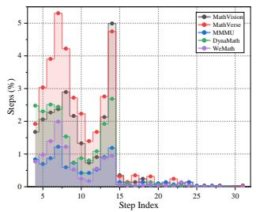  
(a)

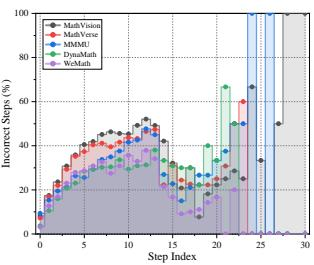  
(b)  
Figure 5. Step Distribution of VisualProcessBench. The X-axis represents the step index. (a) The Y-axis indicates the proportion of steps at each index relative to the total number of steps, reflecting the distribution of step positions in solutions. (b) The Y-axis represents the error rate of steps at each index, showing the likelihood of errors occurring at different step positions.

## 8. More Statistics for VisualProcessBench

The statistics for step distribution of VisualProcessBench is presented in Figure 5. We observe that most solutions consist of fewer than 15 steps. Among these solutions with fewer than 15 steps, most solutions contain about 7 or 13 steps. For the correctness of each step, we observe that the error rate is lower in the first three steps and then increases as the step index grows. We attribute this to the fact that problems requiring more reasoing steps tend to be more challenging, leading to a gradual rise in step error rates. Notably, starting from step 15, the error rate drops sharply. This is because the number of steps in this range is relatively small, resulting in significant statistical fluctuations.

## 9. More Data Examples in VisualPRM400K

In this section, we provide more data examples of Visual-PRM400K in Figure 6 from different domains, including general visual question answering (VQA) [23, 28, 48, 52], science [13, 31, 49], chart [12, 29, 53], mathematics [11, 22, 30, 40, 47, 65], OCR [8, 27, 54, 56, 67], and document [17].

## 10. More Data Examples in VisualProcess-Bench

In this section, we provide more data examples in Visual-ProcessBench from different data sources. Specifically, we randomly choose three examples from our benchmark and visualize them in Figure 7. Additionally, in Figure 8, we provide an example where the model initially generates an incorrect answer and then autonomously corrects it.

<table><tr><td>Model</td><td></td><td>BoN | MMMU MathVista MathVision MathVerse-VO DynaMath WeMath LogicVista |</td><td></td><td></td><td></td><td></td><td></td><td></td><td>|Overall</td></tr><tr><td rowspan="6">Self Consistency</td><td>1</td><td>56.2</td><td>64.5</td><td>17.0</td><td>22.8</td><td>9.4</td><td>23.5</td><td>36.0</td><td>32.8</td></tr><tr><td>8</td><td>58.0</td><td>65.9</td><td>23.4</td><td>30.5</td><td>18.4</td><td>32.7</td><td>43.0</td><td>38.8</td></tr><tr><td>16</td><td>58.6</td><td>65.8</td><td>26.3</td><td>32.1</td><td>19.4</td><td>33.0</td><td>43.4</td><td>39.8</td></tr><tr><td>32</td><td>60.4</td><td>66.7</td><td>28.0</td><td>32.6</td><td>20.8</td><td>34.1</td><td>44.7</td><td>41.0</td></tr><tr><td>64</td><td>59.7</td><td>66.7</td><td>26.6</td><td>33.2</td><td>20.6</td><td>35.8</td><td>43.4</td><td>40.9</td></tr><tr><td>128</td><td>60.6</td><td>67.4</td><td>25.7</td><td>32.0</td><td>22.6</td><td>34.7</td><td>43.2</td><td>40.9</td></tr><tr><td rowspan="6">VisualORM</td><td>1</td><td>56.2</td><td>64.5</td><td>17.0</td><td>22.8</td><td>9.4</td><td>23.5</td><td>36.0</td><td>32.8</td></tr><tr><td>8</td><td>60.2</td><td>67.0</td><td>25.3</td><td>32.5</td><td>16.4</td><td>35.0</td><td>41.8</td><td>39.7</td></tr><tr><td>16</td><td>58.3</td><td>67.7</td><td>27.0</td><td>33.6</td><td>16.6</td><td>33.1</td><td>39.1</td><td>39.3</td></tr><tr><td>32</td><td>58.6</td><td>67.9</td><td>26.3</td><td>33.6</td><td>17.4</td><td>34.4</td><td>42.1</td><td>40.0</td></tr><tr><td>64</td><td>59.4</td><td>66.8</td><td>28.6</td><td>33.9</td><td>17.8</td><td>34.1</td><td>42.3</td><td>40.4</td></tr><tr><td>128</td><td>59.4</td><td>66.6</td><td>28.3</td><td>33.5</td><td>16.8</td><td>32.3</td><td>40.9</td><td>39.7</td></tr><tr><td rowspan="6">VisualPRM</td><td>1</td><td>56.2</td><td>64.5</td><td>17.0</td><td>22.8</td><td>9.4</td><td>23.5</td><td>36.0</td><td>32.8</td></tr><tr><td>8</td><td>60.2</td><td>68.5</td><td>25.7</td><td>35.8</td><td>18.0</td><td>36.5</td><td>43.8</td><td>41.2</td></tr><tr><td>16</td><td>60.2</td><td>69.9</td><td>27.3</td><td>36.4</td><td>19.0</td><td>38.8</td><td>42.5</td><td>42.0</td></tr><tr><td>32</td><td>60.3</td><td>70.4</td><td>29.6</td><td>37.8</td><td>17.2</td><td>40.3</td><td>43.4</td><td>42.7</td></tr><tr><td>64</td><td>61.4</td><td>69.6</td><td>30.6</td><td>38.2</td><td>18.8</td><td>40.2</td><td>45.4</td><td>43.5</td></tr><tr><td>128</td><td>61.7</td><td>70.8</td><td>30.3</td><td>39.3</td><td>19.4</td><td>40.9</td><td>45.4</td><td>44.0</td></tr></table>

Table 6. Overall Best-of-N results of InternVL2.5-8B across seven multimodal reasoing benchmarks with different critic models.

<table><tr><td>Model</td><td></td><td>BoN|MMMU MathVista MathVision MathVerse-VO DynaMath WeMath LogicVista|</td><td></td><td></td><td></td><td></td><td></td><td></td><td>|Overall</td></tr><tr><td rowspan="6">Self Consistency</td><td>1</td><td>49.8</td><td>60.8</td><td>23.4</td><td>18.9</td><td>9.8</td><td>16.4</td><td>27.5</td><td>29.5</td></tr><tr><td>8</td><td>51.8</td><td>58.9</td><td>21.7</td><td>31.5</td><td>10.0</td><td>22.6</td><td>35.6</td><td>33.2</td></tr><tr><td>16</td><td>51.7</td><td>60.2</td><td>21.7</td><td>31.5</td><td>11.6</td><td>25.7</td><td>35.3</td><td>34.0</td></tr><tr><td>32</td><td>52.2</td><td>60.1</td><td>24.3</td><td>33.1</td><td>11.4</td><td>24.3</td><td>36.0</td><td>34.5</td></tr><tr><td>64</td><td>51.7</td><td>61.0</td><td>23.4</td><td>34.8</td><td>12.8</td><td>25.8</td><td>35.3</td><td>35.0</td></tr><tr><td>128</td><td>53.2</td><td>61.7</td><td>25.7</td><td>33.5</td><td>13.0</td><td>25.6</td><td>35.6</td><td>35.5</td></tr><tr><td rowspan="6">VisualORM</td><td>1</td><td>49.8</td><td>60.8</td><td>23.4</td><td>18.9</td><td>9.8</td><td>16.4</td><td>27.5</td><td>29.5</td></tr><tr><td>8</td><td>55.7</td><td>66.0</td><td>22.0</td><td>33.5</td><td>10.2</td><td>24.1</td><td>38.9</td><td>35.8</td></tr><tr><td>16</td><td>56.4</td><td>65.3</td><td>24.0</td><td>32.1</td><td>10.4</td><td>27.3</td><td>36.5</td><td>36.0</td></tr><tr><td>32</td><td>58.8</td><td>64.8</td><td>19.7</td><td>35.7</td><td>12.0</td><td>29.4</td><td>38.5</td><td>37.0</td></tr><tr><td>64</td><td>58.2</td><td>67.3</td><td>22.7</td><td>35.5</td><td>11.0</td><td>30.1</td><td>37.6</td><td>37.5</td></tr><tr><td>128</td><td>58.2</td><td>66.5</td><td>25.3</td><td>35.4</td><td>11.6</td><td>30.0</td><td>40.7</td><td>38.2</td></tr><tr><td rowspan="6">VisualPRM</td><td>1</td><td>49.8</td><td>60.8</td><td>23.4</td><td>18.9</td><td>9.8</td><td>16.4</td><td>27.5</td><td>29.5</td></tr><tr><td>8</td><td>56.8</td><td>65.7</td><td>24.7</td><td>35.8</td><td>11.2</td><td>31.0</td><td>37.4</td><td>37.5</td></tr><tr><td>16</td><td>58.8</td><td>68.6</td><td>24.0</td><td>37.3</td><td>12.4</td><td>32.7</td><td>39.8</td><td>39.1</td></tr><tr><td>32</td><td>57.8</td><td>68.4</td><td>26.6</td><td>38.5</td><td>13.4</td><td>35.3</td><td>39.1</td><td>39.9</td></tr><tr><td>64</td><td>58.6</td><td>69.4</td><td>25.3</td><td>39.7</td><td>12.2</td><td>38.2</td><td>36.9</td><td>40.0</td></tr><tr><td>128</td><td>59.3</td><td>69.4</td><td>25.3</td><td>39.1</td><td>14.4</td><td>37.0</td><td>38.3</td><td>40.4</td></tr><tr><td>Model</td><td>MMMU MathVista MathVision MathVerse-VO DynaMath WeMath LogicVista Overall VL-ProcessBench</td><td></td><td></td><td></td><td></td><td></td><td></td><td></td><td></td></tr><tr><td colspan="10">Threshold</td></tr><tr><td>Threshold=0.00</td><td>59.3</td><td>68.5</td><td>25.7</td><td>35.8</td><td>18.0</td><td>36.5</td><td>43.8</td><td>41.1</td><td>62.0</td></tr><tr><td>Threshold=0.625</td><td>59.7</td><td>66.8</td><td>24.7</td><td>36.7</td><td>18.4</td><td>35.0</td><td>41.8</td><td>40.4</td><td>61.0</td></tr><tr><td>Threshold=0.125</td><td>58.0</td><td>67.9</td><td>27.6</td><td>35.4</td><td>17.4</td><td>35.3</td><td>41.6</td><td>40.5</td><td>60.7</td></tr><tr><td>Threshold=0.25</td><td>58.6</td><td>67.6</td><td>25.7</td><td>33.6</td><td>16.8</td><td>36.0</td><td>41.4</td><td>40.0</td><td>60.2</td></tr><tr><td colspan="10">Temperature</td></tr><tr><td>Temperature=0.3</td><td>59.7</td><td>69.4</td><td>26.0</td><td>32.6</td><td>17.6</td><td>35.5</td><td>42.7</td><td>40.5</td><td></td></tr><tr><td>Temperature=0.7</td><td>59.3</td><td>68.5</td><td>25.7</td><td>35.8</td><td>18.0</td><td>36.5</td><td>43.8</td><td>41.1</td><td></td></tr><tr><td>Temperature=1.0</td><td>61.7</td><td>67.2</td><td>27.3</td><td>35.8</td><td>16.6</td><td>34.2</td><td>43.2</td><td>40.9</td><td></td></tr><tr><td>Temperature=1.3</td><td>57.9</td><td>66.1</td><td>25.0</td><td>32.1</td><td>16.8</td><td>31.9</td><td>40.5</td><td>38.6</td><td></td></tr></table>

Table 7. Overall Best-of-N results of MiniCPM-V2.6 across seven multimodal reasoing benchmarks with different critic models.

Table 8. Ablation studies about the effects of expected accuracy threshold and generationo temperaure.

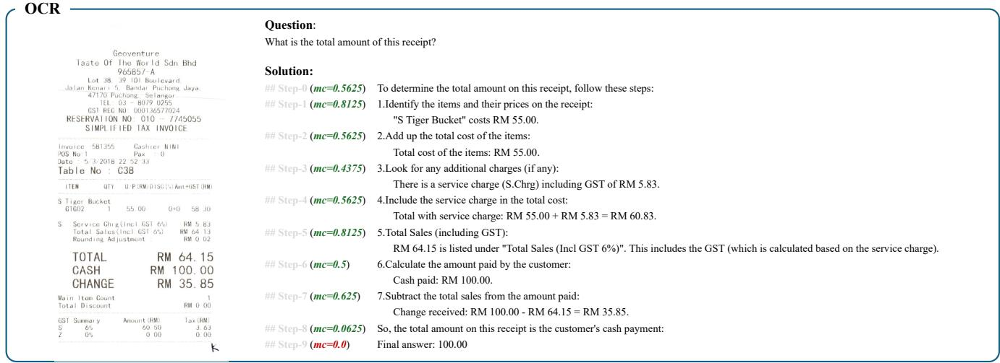

(a)  
  
(b)

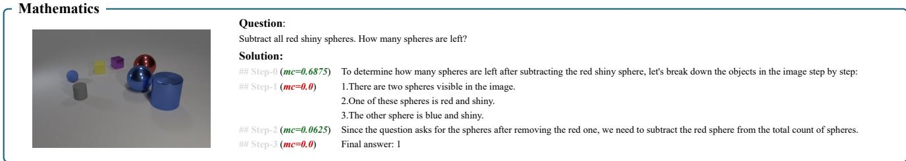  
(c)

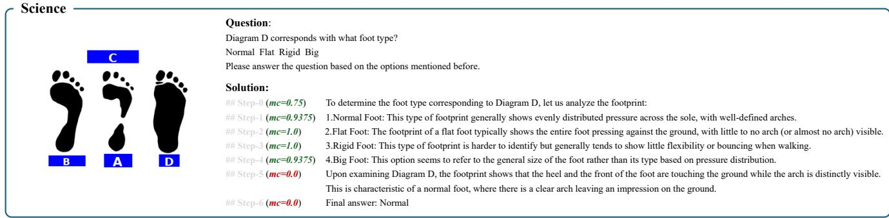

(d)  
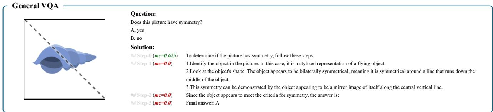  
(e)

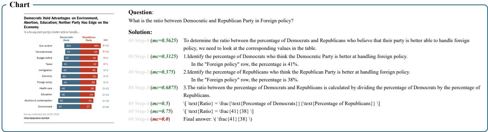  
(f)  
Figure 6. More data examples from VisualPRM400K.

## Data Example from MMMU

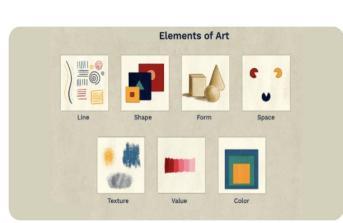

## Question:

Based on <image 1>. When lines meet to form an enclosed area, this is formed.

A. Space B. Shape C. Form D. Line

## Solution:

\## Step-0 (Neural) To determine the correct answer, let's analyze the terms and their definitions:

\## Step-1 (Correct) 1. \*\*Space\*\*: This refers to the area between or around elements of art. It can be positive (occupied by objects) or negative (empty).

\## Step-3 (Correct) 3. \*\*Form\*\*: This refers to the three-dimensional aspect of an object, giving it volume and depth.

\## Step-4 (Correct) 4. \*\*Line\*\*: This is a mark made by a moving point.

## (a)

## Data Example from MMMU

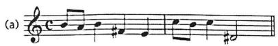

## Question:

Choose the correct key of each of the melody. <image 1>

A. B major B. E major C. A minor D. E minor

## Solution:

To determine the key of the melody, we analyze the key signature, accidentals, and the tonal center. Here's the breakdown:

1. \*\*Key Signature\*\*: The melody has a key signature with one sharp (F#), which corresponds to either \*\*G major\*\* or \*\*E minor\*\*.

2. \*\*Accidentals\*\*: The melody contains a D# accidental, which is the leading tone in the key of E minor. This suggests the melody is in \*\*E minor\*\*.

\## Step-2 (Correct) 3. \*\*Tonal Center\*\*: The melody revolves around E as the tonic, further confirming \*\*E minor\*\* as the key. ## Step-3 (Correct) ### Correct Answer: \*\*D. E minor\*\*

## (b)

## Data Example from MMMU

## Question:

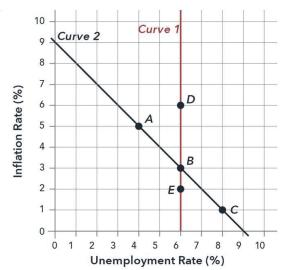

<image 1> If the economy starts at B and the money supply growth rate increases, in the long run the economy A. moves to C. B. moves to D. C. stays at B.

## Solution:

\## Step-0 (Correct) To understand the movement of the economy, we need to consider the Phillips Curve, which typically represents the inverse relationship between inflation and unemployment in the short run. In the long run, when the money supply growth rate increases, leading to higher inflation, the economy usually moves along the Phillips Curve to a new point where unemployment returns to its natural rate (also known as the Non-Accelerating Inflation Rate of Unemployment or NAIRU).

\## Step-1 (Correct) 1. \*\*Identify the initial point (B)\*\*: The economy starts at point B on the curve, where the unemployment rate is approximately 6% and the inflation rate is approximately 3%.

\## Step-2 (Correct) 2. \*\*Impact of increased money supply growth rate\*\*: An increase in the money supply growth rate typically leads to higher inflation in the short run. This moves the economy along the Phillips Curve to a point with higher inflation but does not change the natural rate of unemployment.

\## Step-3 (Correct) 3. \*\*Phillips Curve movement\*\*: In the long run, the higher inflation does not affect the natural rate of unemployment, which remains at the same level. So, the economy moves along the curve to maintain the same unemployment rate but with higher inflation.

\## Step-4 (Incorrect) 4. \*\*Identify the new point\*\*: The new point where the economy settles in the long run will have the same unemployment rate as the initial point (6%) but a higher inflation rate. This is indicated by point C on the curve.

\## Step-5 (Neural) Given these steps:

\## Step-6 (Incorrect) - The economy moves from B to C in the long run due to the increased money supply growth rate. ## Step-7 (Incorrect) Final answer: A

## (c)

## Data Example from MathVision

## Question:

Hint: Please answer the question and provide the final answer at the end. Question: Each of the digits 2, 3, 4 and 5 will be placed in a square. Then there will be two numbers, which will be added together. What is the biggest number that they could make?

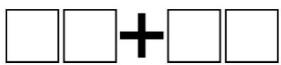

## Solution:

\## Step-0 (Correct) To maximize the sum of the two numbers, we should form the largest possible numbers by arranging the digits in descending order. Here's how: ## Step-1 (Incorrect) 1. Arrange the digits \\( 2, 3, 4, 5 \\) in descending order: \\( 5, 4, 3, 2 \\).

\## Step-2 (Incorrect) - First number: \\( 54 \\) - Second number: \\( 32 \\)

\## Step-3 (Correct) 3. Add the two numbers: \n \\[\n 54 + 32 = 86\n \\]

\## Step-4 (Incorrect) ### Final Answer: \*\*86\*\*

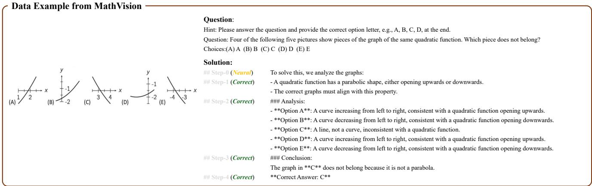  
(e)

## Data Example from MathVision

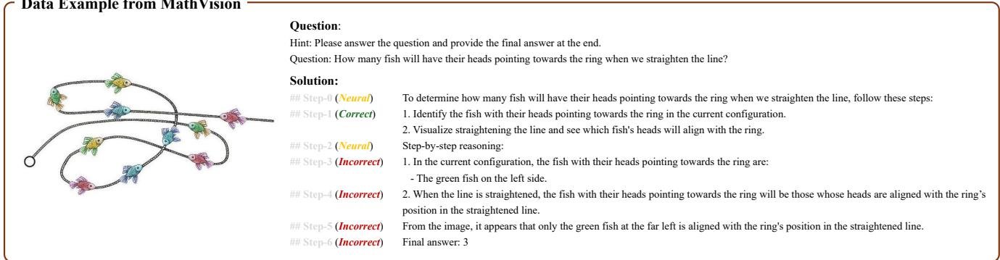  
(f)

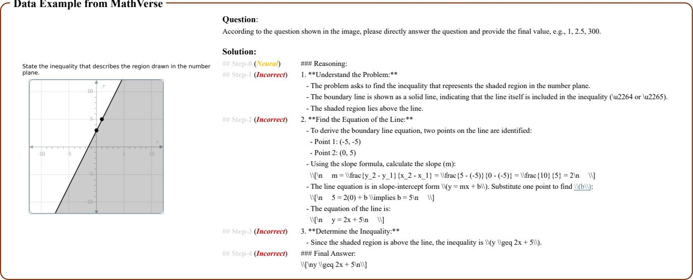  
(g)

<table><tr><td colspan="3">Question:</td></tr><tr><td colspan="3">According to the question shown in the image, please directly answer the question and provide the correct option letter, e.g., A, B, C, D</td></tr><tr><td>As shown in the figure, passing point C to Solution:</td><td colspan="2"></td></tr><tr><td>draw the tangent of circle O. then the degree of angle A is () Choices: A:20° B:25° C:40° D:50°</td><td>##Step-0(Correct)</td><td>To find the degree of angle A, we can use the property that the angle subtended by an arc at the center of the circle is twice the angle subtended at any point on</td></tr><tr><td></td><td></td><td>the circle.</td></tr><tr><td></td><td>## Step-1 (Correct)</td><td>1. **Identify the key points:** - The arcs are AC and BC.</td></tr><tr><td></td><td></td><td>- Angle A is subtended by these arcs at point O (the center of the circle).</td></tr><tr><td>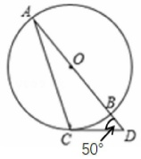</td><td>##Step-2(Correct)</td><td>2. **Understand the given information:**</td></tr><tr><td></td><td></td><td>- CD is a tangent at point C.</td></tr><tr><td></td><td></td><td>- The angle between the tangent and the chord is equal to the angle subtended by the chord at the circumference. Therefore, angle CDB = 50\u00b0.</td></tr><tr><td></td><td>## Step-3(Incorrect)</td><td>3. **Angle properties:**</td></tr><tr><td></td><td></td><td>- The angle A is subtended by arc BC at the center.</td></tr><tr><td></td><td>## Step-4(Correct)</td><td>- Since CD is a tangent, angle A = 50\u00b0 (as the inscribed angle is half the central angle).</td></tr><tr><td></td><td>## Step-5(Correct)</td><td>Thus, the degree of angle A is 20\u00b0.</td></tr><tr><td></td><td></td><td>Final answer: A</td></tr></table>

(h)

## Data Example from MathVerse

f(x)=x²+x-6. How many roots do the functions have in common, f(x) and g(x)? Choices: A:f and g share the same root(s) B:f and g share one root in common but each have another root that is not shared C:f and g share no roots in common.

## Question:

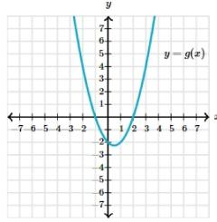  
(i)

According to the question shown in the image, please directly answer the question and provide the correct option letter, e.g., A, B, C, D.

\## Step-0 (Neural) ### Reasoing:

## Data Example from DynaMath

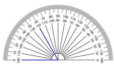

## Question:

Based on the measurement results shown in the diagram, this blue angle is ( )\u00b0.

\## Step-0 (Neural) To determine the measure of the blue angle in the diagram, follow these steps:

\## Step-1 (Incorrect) 1. Observe the protractor: The protractor measures angles from 0\u00b0 to 180\u00b0.

\## Step-2 (Incorrect) Thus, the measure of the blue angle is 40\u00b0

\## Step-3 (Incorrect) Final answer: 40

(j)

## Data Example from DynaMath

<table><tr><td colspan="2">Data Example Irom DynaMath</td><td colspan="2"></td></tr><tr><td>Sales number</td><td>Question:</td><td colspan="2"></td></tr><tr><td>city Briggs Corner</td><td>83</td><td colspan="2">A real estate agent looked into how many houses were sold in different cities. What is the range of the numbers?</td></tr><tr><td>New Humburg</td><td>83 Solution:</td><td></td><td></td></tr><tr><td>Melville</td><td>86</td><td></td><td></td></tr><tr><td>Fremont</td><td>81</td><td>## Step-0 (Neural)</td><td>Let me help you find the range of the sales numbers.</td></tr><tr><td>liberty City</td><td>92</td><td>## Step-1 (Incorrect)</td><td>The range is calculated by subtracting the minimum value from the maximum value.</td></tr><tr><td>Charles Falls</td><td>84</td><td>## Step-2(Incorrect)</td><td>Minimum sales number: 81 (Fremont)\nMaximum sales number: 97 (Penny Town)</td></tr><tr><td>Pleasent Town</td><td>93</td><td>## Step-3 (Incorrect)</td><td>Range = Maximum - Minimum\nRange = 97 - 81 = 16</td></tr><tr><td>Penny Town</td><td>97</td><td>## Step-4(Incorrect)</td><td>Therefore, the range of house sales numbers across these cities is 16</td></tr></table>

(k)

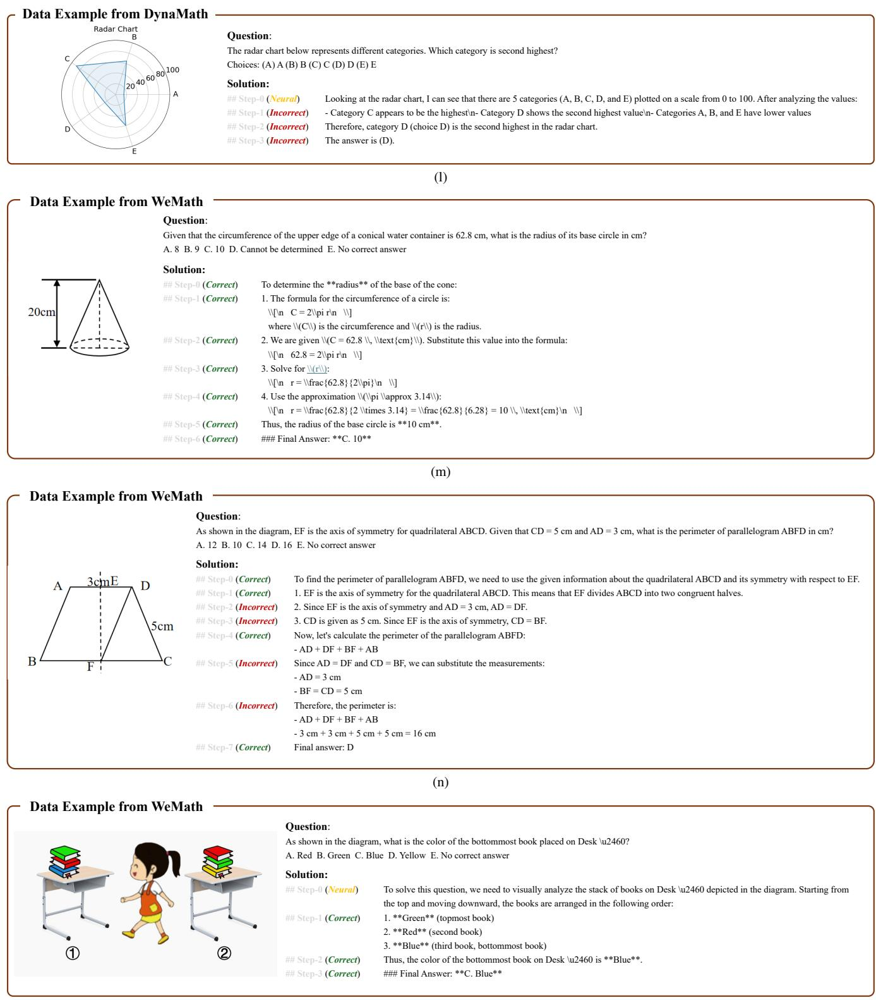  
(o)  
Figure 7. More data examples from VisualProcessBench.

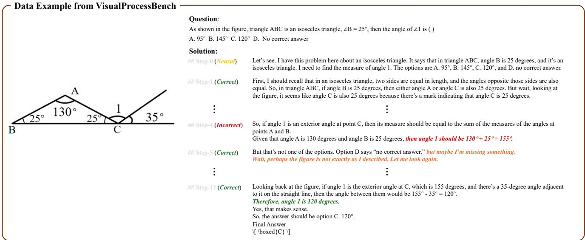  
Figure 8. Data example with model reflection from VisualProcessBench. Red highlights the incorrect answer, orange highlights the reflection words, and green highlights the correct answer.