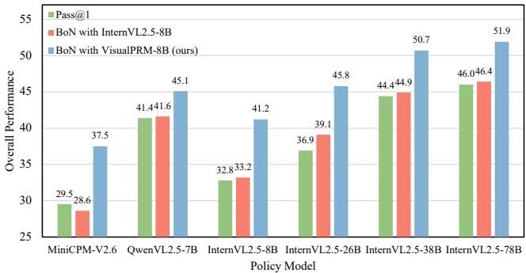

[← 返回 README](../README.md)

# Abstract & Figure 1

## 一、论文信息速览

| 项目 | 内容 |
|------|------|
| **标题** | VisualPRM: An Effective Process Reward Model for Multimodal Reasoing |
| **作者** | Weiyun Wang et al. |
| **单位** | Fudan Univ., Shanghai AI Lab., SJTU, Tsinghua, NJU, CUHK, SenseTime |
| **发表** | arXiv 2025 |
| **模型** | VisualPRM-8B |
| **数据** | VisualPRM400K (~400K), VisualProcessBench (2,866 样本, 26,950 步骤) |

---

## 二、原始文本

### Abstract

We introduce VisualPRM, an advanced multimodal Process Reward Model (PRM) with 8B parameters, which improves the reasoing abilities of existing Multimodal Large Language Models (MLLMs) across different model scales and families with Best-of-N (BoN) evaluation strategies. Specifically, our model improves the reasoing performance of three types of MLLMs and four different model scales. Even when applied to the highly capable InternVL2.5-78B, it achieves a 5.9-point improvement across seven multimodal reasoing benchmarks. Experimental results show that our model exhibits superior performance compared to Outcome Reward Models and Self-Consistency during BoN evaluation. To facilitate the training of multimodal PRMs, we construct a multimodal process supervision dataset VisualPRM400K using an automated data pipeline. For the evaluation of multimodal PRMs, we propose VisualProcessBench, a benchmark with human-annotated step-wise correctness labels, to measure the abilities of PRMs to detect erroneous steps in multimodal reasoing tasks. We hope that our work can inspire more future research and contribute to the development of MLLMs. Our model, data, and benchmark are released in this page.

> **一句话概括**: VisualPRM 提出了首个 8B 多模态过程奖励模型，配套自动构建的约 400K 过程监督数据集 VisualPRM400K 和人工标注的步骤评测基准 VisualProcessBench，通过 Best-of-N 评估策略跨模型家族和规模显著提升 MLLM 推理能力。

---

*Figure 1. The overall Best-of-8 evaluation results across seven multimodal reasoing benchmarks with different critic models. Our VisualPRM greatly enhances the overall performance, while InternVL2.5-8B struggles to be an effective critic model.*

> **Figure 1 批读**: 这张图展示了使用不同 critic model 进行 Best-of-8 评测的总体结果对比（7 个 benchmark 的平均分）。核心信息有三层：
>
> (1) **VisualPRM 的显著提升**: 使用 VisualPRM 作为 critic model 后，MiniCPM-V2.6、Qwen2.5-VL-7B、InternVL2.5-8B 和 InternVL2.5-78B 都获得了大幅度提升。橙色柱（+VisualPRM）全面高于蓝色柱（baseline）。
>
> (2) **InternVL2.5-8B 作为 critic 效果差**: 用 InternVL2.5-8B 直接做 critic（绿色柱）仅带来微弱提升甚至下降，说明现有的通用 MLLM **不能直接充当 critic model**——它们缺乏足够的 critic 相关训练数据。
>
> (3) **跨模型泛化能力**: VisualPRM 不仅在自家 InternVL 系列上有效，在 MiniCPM 和 QwenVL 上也同样有效，验证了 PRM 作为 critic 的**通用性**。

> **问题动机**: 多模态大模型在推理能力上仍与闭源模型存在较大差距。Test-Time Scaling (TTS) 是提升推理能力的有效手段，但适配到 MLLM 面临两大挑战：(1) 缺乏有效的 critic model——现有开源 MLLM 不擅长评估回复质量；(2) 缺乏 critic model 的多模态评测基准——BoN 评测成本高昂且结果受策略模型影响。本文分别通过构建数据集、训练 PRM 和建立 benchmark 来系统性地解决这两个挑战。

---

## 三、Summary

- **核心问题**: 缺乏有效的多模态 critic model 和对应的评测基准，限制了 Test-Time Scaling 在 MLLM 上的应用
- **核心方案**: VisualPRM = VisualPRM400K (自动过程监督数据) + VisualPRM-8B (多模态 PRM 模型) + VisualProcessBench (人工标注步骤评测基准)
- **核心结果**: 跨 3 个模型家族、4 个规模一致有效，最高提升 8.4 点；PRM > ORM > SC
- **关键洞察**: 通用 MLLM 不能直接做 critic——它们倾向于给大多数步骤正面评价，缺乏区分能力
