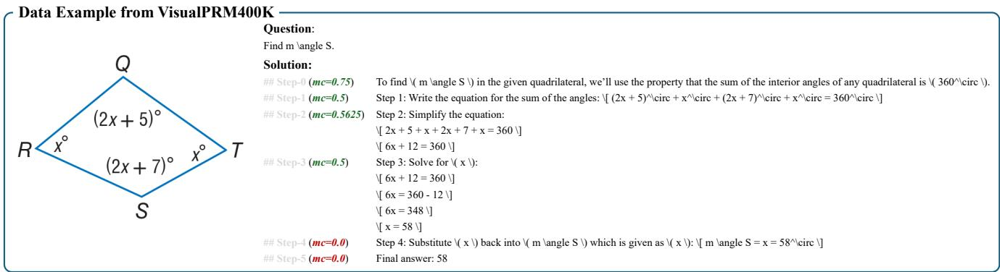
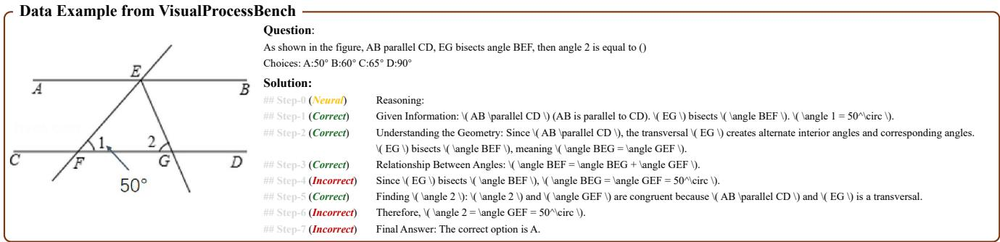
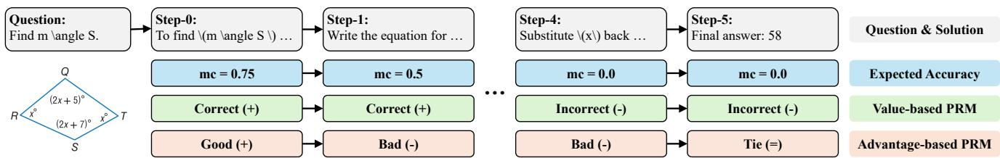

[← 返回 README](../README.md)

# 3. Method

## 一、Preview

本节是论文的核心方法部分，分三个子模块：(3.1) VisualPRM400K 数据集的自动构建——基于 Monte Carlo 采样的过程监督数据生成管线；(3.2) VisualPRM 模型的训练与推理——多轮对话格式、value-based vs advantage-based 建模、分数聚合策略；(3.3) VisualProcessBench 评测基准的构建——数据来源、人工标注流程、评测指标。

---

## 二、原始文本

### Method Overview

During Best-of-N (BoN) evaluation, a critic model is required to estimate the quality of each response candidate. In this work, we formulate the critic model as a Process Reward Model (PRM). To develop a multimodal PRM, we first construct VisualPRM400K, a dataset comprising about 400K multimodal process supervision data, as detailed in Section 3.1. We then describe our PRM's modeling approach in Section 3.2. Furthermore, to support the evaluation of critic models, we establish VisualProcessBench to measure the abilities of critic models to detect erroneous steps in multimodal reasoning, as introduced in Section 3.3.

> **整体逻辑链**: VisualPRM400K (数据) → VisualPRM (模型) → VisualProcessBench (评测)，三个模块形成严格的前后依赖：数据集用于训练 PRM，benchmark 用于评估 PRM。

### 3.1. VisualPRM400K

**Definition.** As shown in Figure 2, each data sample in our VisualPRM400K consists of an image I, a question q, a step-by-step solution s = {s_0, s_1, ..., s_n}, and the expected accuracy annotation mc = {mc_0, mc_1, ..., mc_n}, mc_i ∈ ℝ_{≥0} for each step, where n is the number of steps of a certain solution and mc_i denotes the expected accuracy of step s_i. The image sets I and question sets Q are collected from MMPR v1.1 [82], while the step-by-step solutions s are sampled using InternVL2.5 series models [15, 82].

> **数据定义**: 每个样本 = (图像 I, 问题 q, 逐步解答 s, expected accuracy mc)。mc_i ∈ [0, 1] 衡量从第 i 步前缀出发采样的续写中正确回答的比例。注意 mc 是**连续值**（Monte Carlo 估计），但训练时会被离散化为二分类标签（正确/错误）。

**Process Supervision Generation.** Given an image I, a question q, and a solution s = {s_0, s_1, ..., s_n}, we annotate the correctness of each step s_i using an automatic data pipeline. The key idea is to estimate the expected accuracy of given steps s_{≤i} based on Monte Carlo sampling. Specifically, the model is required to complete the solution as follows:

$\tilde{s}_{>i} \sim M(\tilde{s}_{>i} \mid I, q, s_{\leq i})$,

where s̃_{>i} is the completion of s_{≤i}. Besides, the expected accuracy of s_i is defined as:

$mc_i = \frac{\text{num}(\text{correct completions})}{\text{num}(\text{sampled completions})}.$

Notably, to reduce the data construction costs, we set the max number of steps to 12 and evenly merge the steps if the number of current steps exceeds the threshold.

> **公式批读 — Monte Carlo 过程监督**:
>
> Eq.(1): 给定前缀 s_{≤i}（前 i 步），让策略模型从该前缀出发**采样续写** s̃_{>i}。这个过程被称为 "rollout"——模拟在前 i 步正确的前提下，后续推理能到达正确答案的概率。
>
> Eq.(2): mc_i = 正确续写数 / 总续写数（每次都采样 16 条）。直观理解：如果从前 i 步出发，16 次续写中有 12 次得到正确答案，则 mc_i = 0.75。
>
> **关键设计决策 — threshold=0**: mc_i > 0 即标记为正确步骤。这意味着即使只有 1/16 的续写正确，该步骤也被认为是"correct"（有正确的可能）。实验表明提升 threshold 反而降低 PRM 性能（可能因为噪声标签下，宽松的 threshold 提供了更强的鲁棒性）。
>
> **步骤合并策略**: 原始解答可能步骤很多（如 30+ 步），但大多数推理步骤不需要精细到那个粒度。限制 max steps=12 并通过均匀合并来减少步骤数——本质上是在过程监督的**粒度**和**数据构建成本**之间的权衡。

**Statistics.** During the construction process, we sample 4 solutions for each image-question pair and split each of them into at most 12 steps. For each step, we sample 16 continuations and compute mc_i according to these continuations. The resulting dataset comprises approximately 400K samples and 2 million steps with process supervision. Each response averages 126.9 words and 5.6 steps, while each step averages 22.6 words. Among these steps, about 10% are incorrect steps. Despite the imbalanced distribution of correct and incorrect steps, our PRM demonstrates promising performance, as shown in Section 4.

> **数据统计解读**:
> - 4 solutions per question × 100K questions ≈ 400K 样本
> - 每样本平均 5.6 steps × 400K ≈ 2.24M 步骤（文中称 ~2M）
> - 每个步骤 22.6 词 → 步骤粒度适中（非句级别，也非词级别）
> - **仅 10% 错误步骤 → 严重类别不均衡**，但 PRM 依然有效——这可能是因为正确步骤和错误步骤的区分难度不同，PRM 不需要等量的负样本来学习"什么是错误"
>
> **数据质量潜在问题**: 自动管线生成的数据存在三个噪声来源：(1) 策略模型生成的解答可能本身有错误；(2) Monte Carlo 续写的质量取决于策略模型能力和采样温度；(3) threshold=0 可能引入 false positive（碰巧有 1/16 续写正确的步骤）。这些问题在 Section 4 ablation 中有所体现。

---

*Figure 2. Data examples in VisualPRM400K and VisualProcessBench. For VisualPRM400K, we generate the data using an automatic data pipeline. The key idea is to estimate the expected accuracy mc_i of the given step s_{≤i} based on Monte Carlo sampling and consider the step correct if mc_i > 0. During the training process of VisualPRM, the data is formulated as multi-turn conversations and the model is required to predict the correctness of each step conditioned on the image, question, and previous steps. For VisualProcessBench, we collect questions from existing multimodal reasoning benchmarks and generate the solutions using leading MLLMs. Based on these questions and solutions, we employ a team of human experts with at least a university degree to manually annotate the correctness of each step in the solutions.*

> **Figure 2 批读**: 上图展示了 VisualPRM400K 和 VisualProcessBench 的数据样例和构建流程的对比：
>
> **(上) VisualPRM400K (自动标注)**:
> - 左：图像 + 问题
> - 中：逐步解答 + Monte Carlo estimation (mc_i)
> - 右：训练格式——多轮对话，模型预测每步正确性
>
> **(下) VisualProcessBench (人工标注)**:
> - 左：图像 + 问题（来自 5 个 benchmark）
> - 中：MLLM 生成的解答 + 人工标注（Positive/Negative/Neural）
> - 右：Final 标注结果
>
> 两条管线的核心区别：VisualPRM400K 是**自动 + 大规模**（用于训练），VisualProcessBench 是**人工 + 高质量**（用于评测）。

### 3.2. VisualPRM

**Overview.** During the training process, we formulate the process supervision problem as a multi-turn chat task so that we can effectively leverage the generation ability of MLLMs. The image I, question q, and the first step s_0 of the solution to this question are included in the first turn and a new step is presented in each subsequent turn. The model is required to predict the quality of the given step in each turn as follows:

$y_i \sim M(y_i \mid I, q, s_{\leq i}),$

where y_i denotes the quality of i-th step.

> **训练格式设计**: 多轮对话格式是一个精妙的工程选择——它利用了 MLLM 原生的多轮交互能力，无需修改模型架构。每一轮输入是"图像 + 问题 + 历史步骤 + 当前步骤"，输出是当前步骤的正确性标签。这与标准的 MLLM chat template 完全兼容。

*Figure 3. Different modeling methods for PRMs. For value-based PRMs, the quality is determined by expected accuracy mc_i, where a step is correct if mc_i > 0. For advantage-based PRMs, the quality is determined by the improvement of mc_i over mc_{i-1}, where a step is good if mc_i - mc_{i-1} > 0. During training, the output space is discretized into specific tokens; during inference, we compute the step score as the weighted sum of the generation probability for these discretized tokens.*

> **Figure 3 批读 — 两种 PRM 建模方式对比**:
>
> **Value-based PRM**:
> - 定义：步骤 s_i 的质量 = expected accuracy mc_i
> - 输出空间：{+, -}（二分类，mc_i > 0 为 +）
> - 推理分数：P(+) × 1 + P(-) × 0 = P(+)
> - 类比：强化学习中的**价值函数** V(s)
> - 直观：这个步骤"好不好"
>
> **Advantage-based PRM**:
> - 定义：步骤 s_i 的质量 = mc_i - mc_{i-1}（accuracy 增量）
> - 输出空间：{+, =, -}（三分类，提升/不变/下降）
> - 推理分数：P(+) × 1 + P(=) × 0 + P(-) × (-1)
> - 类比：强化学习中的**优势函数** A(s, a)
> - 直观：这个步骤做了多少"贡献"
>
> 实验结论：**value-based 优于 advantage-based**（Table 4）。原因：自动管线数据有噪声，精确判断"变好还是变差"比判断"是否有正确可能"更难。

**For value-based PRMs**, the quality of a certain step is determined by its expected accuracy mc_i, which is similar to the definition of the value function in reinforcement learning. Following Math-Shepherd, we require the model to predict the correctness c_i ∈ {+, -} of the given step, rather than the exact score of mc_i. The i-th step is considered correct if mc_i > 0. We also try to set a threshold to reduce false positive steps, but find that such a threshold negatively impacts the PRM performance, as shown in Section 7. Notably, unlike previous works, which choose to supervise only up to the first incorrect step, we always supervise all steps.

> **训练策略 — w/o early stop**:
> - **传统做法** (PRM800K, Math-Shepherd): 只监督到第一个错误步骤为止（"early stop"），认为后续步骤都基于错误前提
> - **本文做法** (w/o early stop): 监督**所有**步骤
> - **实验结论** (Table 4): w/o early stop 略优于 w. early stop（value-based: 41.1 vs 40.6 on BoN）
> - **原因分析**: 在多模态场景中，错误步骤之后可能还有正确步骤（模型可能在某步犯错后又回到正轨，尤其是在有 reflection 能力的情况下），early stop 会丢失这些信号

**For advantage-based PRMs**, the quality of a certain step is determined by the improvement of mc_i over mc_{i-1}, which is analogous to the definition of the advantage function in reinforcement learning. Similar to value-based PRMs, the quality space is discretized into predefined values {+, =, -}, meaning that the i-th step s_i results in a superior, comparable, or inferior situation.

**During inference stage**, we first compute the scores of each step and then merge them to obtain the response score. Specifically, the score for each step is defined as the weighted sum of the generation probability for the discretized scores. For value-based PRMs, the weights for {+, -} are {1, 0}. For advantage-based PRMs, the weights for {+, =, -} are {1, 0, -1}. Without further explanation, we average the scores of each step as the response score.

> **推理效率关键**: VisualPRM 不生成文本，而是直接使用 "+" token 的生成概率作为步骤分数。一次前向传播即可得到所有步骤的分数（因为每个步骤的输入是独立的 chat turn）。相比之下，让 MLLM 直接做 critic 需要 autoregressive 生成判断文本，效率低得多。
>
> **分数聚合策略** (Section 4.3 消融):
> | 聚合方法 | 机制 | 效果 |
> |---------|------|------|
> | Average | 所有步骤分数的平均值 | **最佳** (BoN=41.1) |
> | Min | 取最小值 | 次优 (BoN=40.4) |
> | Max | 取最大值 | 最差 (BoN=35.9) |
>
> Max 最差的原因：多数解答开头有接近 1 的高分步骤，但这些高分步骤之后可能存在错误。取最大值相当于只看最好的那一步，忽略了后续的错误。

### 3.3. VisualProcessBench

**Definition.** Each sample in our benchmark consists of a multimodal reasoning question, a step-by-step solution, and correctness annotations for each step. Considering that recent models begin to demonstrate reflection abilities to rectify their own reasoning process, the evaluation setting used in previous works, which only requires the model to find the first erroneous step, may lead to a false negative estimation. Therefore, our benchmark requires the model to identify all erroneous steps in the given solution instead of only the first erroneous step.

> **设计决策 — 识别所有错误 vs. 仅第一个错误**:
> - 传统设置（ProcessBench, PRMBench）：仅需找出第一个错误步骤
> - VisualProcessBench：需找出**所有**错误步骤
> - 理由：现代 MLLM 具备 reflection 能力，可能在后面步骤发现并纠正前面的错误。如果只测第一个错误：
>   - 步骤 1 错 → 步骤 3 自我纠正 → 传统评测认为"模型在第 1 步犯错"（true）但忽视了步骤 3 的纠正能力
>   - 这种设置会导致 false negative：模型实际的步骤判断能力被低估

**Data Source.** Our benchmark focuses on multimodal reasoning tasks, collecting images and questions from existing representative multimodal reasoning benchmarks, including MMMU [90], MathVision [78], MathVerse [93], DynaMath [99], and WeMath [60]. Given these questions, we generate step-by-step solutions using leading MLLMs, including GPT-4o [58], Claude-3.5-Sonnet [4], Gemini-2.0-Flash [70], QvQ-72B-Preview [72], and InternVL2.5-78B [15]. The solutions are sampled from different MLLMs to ensure their diversity.

> **数据来源多样性**:
> - Questions: 5 个多模态推理 benchmark → 覆盖数学、科学、逻辑等多学科
> - Solutions: 5 种 MLLM → 涵盖闭源和开源、不同解题风格
> - 这种多样性确保 benchmark 不会过拟合单一模型或单一领域的解题模式

**Step Correctness Annotation.** We employ a team of human experts with at least a university degree to manually annotate the correctness of each step in the solutions. Specifically, 13 people worked for 3 days, resulting in a workload of 39 person-days. The cost per person-day is approximately 37 dollars. During the annotation process, annotators are provided with the image, question, ground truth answer, and each step of the solution. Their task is to assign each step in the solution a label of positive, negative, or neutral, as illustrated in Figure 2. A positive label indicates that the step is correct, while a negative label signifies an incorrect step. The neural label is assigned to steps that do not involve any reasoning process or provide no additional information. To ensure the annotation quality, annotators are permitted to skip questions they do not understand. During the annotation process, our dataset is divided into 10 splits, each containing approximately 300 samples. For each split, the authors of this paper manually review about 10% of the samples. Splits with erroneous annotations are sent back for re-annotation.

> **标注质量保障机制**:
> 1. **人员素质**: 至少大学学历的标注员（总成本约 $37×39 ≈ $1,443）
> 2. **三标签体系**: Positive / Negative / Neural（排除无推理内容的步骤）
> 3. **质量审核**: 10 个 split × 10% 抽检 = 作者审核约 286 样本，不合格 split 返工
> 4. **跳过机制**: 允许标注员跳不了解的题目（避免低质量标注）
>
> 整体标注流程的严谨程度较高，值得后续工作参考。

**Statistics.** As shown in Table 1, our benchmark comprises 2,866 samples. To enhance the diversity of our evaluation samples, we gather questions and solutions from a wide range of benchmarks and models while carefully regulating their distribution.

| Statistics | Number |
|-----------|--------|
| Total Samples | 2,866 |
| - MMMU | 267 |
| - MathVision | 712 |
| - MathVerse | 1,026 |
| - DynaMath | 570 |
| - WeMath | 291 |
| Source Solutions | 2,866 |
| - GPT-4o | 870 |
| - Claude-3.5-Sonnet | 865 |
| - QvQ-72B-Preview | 825 |
| - InternVL2.5-78B | 306 |
| Total Steps | 26,950 |
| - Correct Steps | 16,585 |
| - Incorrect Steps | 7,691 |
| - Neural Steps | 2,674 |

> **数据分布解读**:
> - MathVerse 样本最多 (1,026)，MMMU 最少 (267) —— 数学推理是主要的评测场景
> - GPT-4o/Claude/QvQ 生成的解答数量基本均衡（~850 each），InternVL2.5-78B 较少
> - 正确步骤 (16,585) vs 错误步骤 (7,691) vs Neural (2,674): 虽然正确步骤多于错误步骤，但比例 (2.2:1) 比 VisualPRM400K 的 (9:1) 要均衡得多
> - 步骤级平均: 26,950 / 2,866 ≈ 9.4 步/solution

**Metrics.** In this work, we use macro F1 scores to compare model performance, aiming to mitigate the impact of the imbalanced distribution between correct and incorrect steps. Specifically, we first compute the F1 scores separately for correct and incorrect steps and then take their average to obtain the overall score.

> **指标选择 — Macro F1**:
> - 先分别计算正步和负步的 F1，再取平均
> - 优点：不受正负样本比例影响（如果只用 accuracy，模型全预测"正确"也能拿很高分）
> - 注意：Neural 步骤在计算 F1 时被排除（因为没有"正确性"可言）

---

## 三、Summary

- **VisualPRM400K**: 基于 Monte Carlo 采样的自动标注管线，400K 样本/2M 步骤，threshold=0 标记正确性，无 early stop
- **VisualPRM (Model)**: 多轮对话格式 + value-based 二分类 + probability-based scoring + 平均聚合，8B 参数
- **VisualProcessBench**: 2,866 样本/26,950 人工标注步骤，识别所有错误，macro F1 评测
- **核心设计权衡**: 自动标注（低成本/含噪声）vs 人工标注（高成本/高质量），分别用于训练和评测
