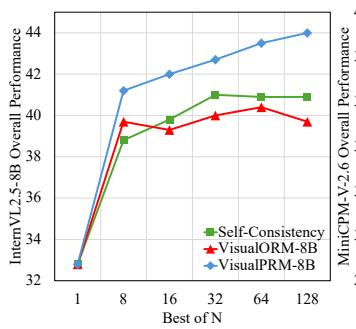
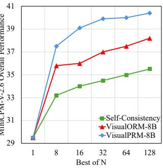

[← 返回 README](../README.md)

# 4. Experiments

## 一、Preview

本节从三个维度进行实验验证：(4.1) BoN 评测——VisualPRM 作为 critic 在不同策略模型上的表现；(4.2) VisualProcessBench 评测——各模型在步骤级错误检测任务上的能力对比；(4.3) 消融实验——BoN 的 N 值影响、PRM 建模方式对比（value vs advantage）、score 聚合方法、MLLM-as-judger、纯文本场景迁移。

---

## 二、原始文本

### 4.1. Results with Best-of-N evaluation

**Benchmarks.** We evaluate the reasoing abilities of MLLMs across seven benchmarks, including MMMU, MathVista, MathVision, MathVerse, DynaMath, WeMath, and LogicVista. The evaluation samples include subject-based, mathematical, and logical reasoing problems. We report the worst-case accuracy for DynaMath and the overall accuracy for the remaining benchmarks. For MathVerse, we report the performance on the Vision-Only split.

> **Benchmark 分类**:
> | 类别 | Benchmark | 任务类型 |
> |------|----------|---------|
> | 学科推理 | MMMU | 多学科多模态理解与推理 |
> | 数学推理 | MathVista, MathVision, MathVerse, DynaMath, WeMath | 不同难度/风格的数学题 |
> | 逻辑推理 | LogicVista | 视觉场景中的逻辑推理 |

**Settings.** Without further explanation, we use VisualPRM as the critic model for BoN evaluation and set N to 8 by default. The policy model is required to generate N distinct step-by-step Chain-of-Thought (CoT) reasoing processes with a temperature of 0.7. The response with the highest score is then selected to determine the correctness.

> **实验设置**: N=8, temperature=0.7 是 BoN 评测的标准设置。Temperature 消融见 Section 7——0.7 是 diversity-accuracy trade-off 的最优点。

**Results.** As shown in Table 2, VisualPRM greatly enhances the reasoing abilities of MLLMs across different model scales and families. Specifically, for models with fewer than 10 billion parameters, the overall performance of InternVL2.5-8B, MiniCPM-V-8B, and Qwen2.5-VL-7B improves by 8.4, 8.0, and 3.7 points, respectively, demonstrating the effectiveness of test-time scaling across different model families. For larger models, InternVL2.5-26B, InternVL2.5-38B, and InternVL2.5-78B also achieve substantial performance gains over their counterparts without TTS, further validating the scalability and effectiveness of TTS across different model sizes.

> **Table 2 核心结果解读**:
>
> | 策略模型 | Pass@1 | +VisualPRM (BoN=8) | 提升 |
> |---------|--------|---------------------|------|
> | MiniCPM-V2.6-8B | 29.5 | 37.5 | **+8.0** |
> | Qwen2.5-VL-7B | 41.4 | 45.1 | +3.7 |
> | InternVL2.5-8B | 32.8 | 41.2 | **+8.4** |
> | InternVL2.5-26B | 36.9 | 45.8 | +8.9 |
> | InternVL2.5-38B | 44.4 | 50.7 | +6.3 |
> | InternVL2.5-78B | 46.0 | 51.9 | **+5.9** |
>
> **关键观察**:
> 1. 小模型（<10B）受益更明显：InternVL2.5-8B (+8.4) > InternVL2.5-78B (+5.9) —— TTS 对小模型性价比更高
> 2. 跨模型家族泛化：MiniCPM(+8.0), QwenVL(+3.7), InternVL(+8.4) —— QwenVL 的 baseline 本身就高（41.4），提升空间有限，但 +3.7 仍显著
> 3. 绝对分数：InternVL2.5-78B+VisualPRM (51.9) 超越了 GPT-4o baseline (47.9)，与 Claude-3.5-Sonnet (50.5) 持平
> 4. MathVerse-VO 提升最大：如 InternVL2.5-8B 从 22.8→35.8 (+13.0) —— 视觉密集的数学题是 PRM 最擅长的场景

### 4.2. Results on VisualProcessBench

**Settings.** For the evaluation of PRMs, a step is considered correct if the probability of outputting "+" exceeds that of outputting "-" by a certain threshold. For the evaluation of MLLMs, the model is prompted to analyze each step and determine its correctness, classifying it as either correct or incorrect. When computing the F1 score, we exclude steps labeled as neural by human annotators.

**Results.** As shown in Table 3, most existing MLLMs struggle to accurately assess the correctness of each step. Specifically, the overall F1 score for random guessing is 50.0, while most open-source MLLMs achieve scores close to this baseline, highlighting their limitations as critic models. We manually check the judgments of these open-source MLLMs and observe that these models tend to provide positive analysis and label most steps as correct. For example, InternVL2.5-8B achieves an F1 score of 76.8 for positive steps, while its F1 score for negative steps is only 19.2, indicating that InternVL2.5-8B rarely identifies steps as incorrect. Furthermore, compared to proprietary models, our VisualPRM demonstrates competitive performance, achieving an overall F1 score of 62.0—outperforming GPT-4o and GPT-4o-Mini, and performing on par with Gemini-2.0-Flash. Notably, our model, with only 8 billion parameters, is more efficient than these proprietary counterparts.

> **Table 3 核心结果解读**:
>
> | 模型 | Overall F1 | 正步 F1 | 负步 F1 | 关键特征 |
> |------|-----------|---------|---------|---------|
> | Random Guessing | 50.0 | 50.0 | 50.0 | 基准线 |
> | InternVL2.5-8B | 48.0 | 76.8 | 19.2 | **严重 positive bias** |
> | InternVL2.5-78B | 52.6 | 77.7 | 27.5 | 大模型也偏 positive |
> | Qwen2.5-VL-72B | 60.5 | 72.0 | 49.0 | 开源最佳（7B 仅 51.0） |
> | GPT-4o-Mini | 57.9 | - | - | 小闭源模型 |
> | GPT-4o | 60.3 | - | - | 大闭源模型 |
> | Gemini-2.0-Flash | 62.3 | - | - | 闭源最强 |
> | **VisualPRM (8B)** | **62.0** | - | - | **开源 SOTA，媲美 Gemini** |
>
> **关键洞察**:
> 1. **Positive bias 现象**: 开源 MLLM 对评估任务存在系统性偏见——倾向于把所有步骤判为正确。这解释了为什么直接用 MLLM 做 critic 效果差（它们无法区分好回复和差回复）。
> 2. **规模效应有限**: InternVL2.5-78B (52.6) 只比 8B (48.0) 略好，说明 scale 本身不能解决 critic 能力不足的问题——需要专门的训练。
> 3. **VisualPRM 的高效性**: 8B 参数达到与 Gemini-2.0-Flash 媲美的步骤判断能力，证明专门的 PRM 训练比 scale 更有效。

### 4.3. Ablation Studies

**Effects of BoN.** Here, we increase the number of response candidates sampled from InternVL2.5-8B and select the final response using Self-Consistency (SC), Outcome Reward Model (ORM), and PRM. The training data for ORM are nearly identical to those used for PRM, except that all steps are concatenated into a single step and step-wise correctness annotations are converted into a single correctness label for the outcome. As shown in Figure 4, increasing the number of response candidates N improves the reasoing performance of InternVL2.5-8B and MiniCPM-V2.6-8B when using SC, ORM, or PRM, with PRM yielding the most significant improvements. Specifically, when using InternVL2.5-8B as the policy model, PRM outperforms SC and ORM by 2.4 and 1.5 points, respectively, under the Best-of-8 evaluation setting. Moreover, this performance gap widens as N increases, reaching 3.1 and 4.3 points when N is set to 128. Notably, when using ORM as the critic model, although performance improves during Best-of-8 evaluation, further increasing N does not lead to consistent gains for InternVL2.5-8B. For example, the Best-of-128 performance is inferior to the Best-of-64 performance. These results highlight the effectiveness of PRM in TTS.

> **机制拆解 — BoN 对比: SC vs. ORM vs. PRM**:
>
> 
> 
>
> *Figure 4. Overall Best-of-N results across seven multimodal reasoing benchmarks with different policy and critic models.*
>
> **InternVL2.5-8B (policy) + 不同 critic 的对比**:
>
> | N | SC | ORM | PRM | PRM-SC gap | PRM-ORM gap |
> |---|----|-----|-----|-----------|------------|
> | 1 | 32.8 | 32.8 | 32.8 | 0 | 0 |
> | 8 | 38.8 | 39.7 | 41.2 | +2.4 | +1.5 |
> | 16 | 39.8 | 39.3 | 42.0 | +2.2 | +2.7 |
> | 32 | 41.0 | 40.0 | 42.7 | +1.7 | +2.7 |
> | 64 | 40.9 | 40.4 | 43.5 | +2.6 | +3.1 |
> | 128 | 40.9 | 39.7 | 44.0 | **+3.1** | **+4.3** |
>
> **关键发现**:
> 1. **PRM 的优势随 N 增大而扩大**: gap 从 N=8 的 +1.5/+2.4 扩大到 N=128 的 +4.3/+3.1——这是因为更大的 N 意味着更多样化的候选回复，步骤级信号（PRM）比结果级信号（ORM）提供更多分辨力
> 2. **ORM 的收益递减甚至反转**: ORM Best-of-128 (39.7) < Best-of-64 (40.4)——ORM 无法有效利用更大的候选池，可能是因为结果正确的回复中存在大量推理过程有缺陷的样本，而 ORM 无法区分
> 3. **SC 的稳定性**: SC (majority voting) 不依赖 critic，但上限有限（N=128 时 40.9 vs PRM 44.0）

**Effects of PRM modeling methods.** Here, we compare the value-based PRM and the advantage-based PRM, along with different methods for aggregating step scores into a final score, including averaging, as well as selecting the maximum or minimum value. The results are presented in Table 4. We find that value-based PRMs outperform advantage-based PRMs in both BoN evaluation settings and VisualProcessBench. We attribute this to the inherent noise in our training data, which is generated through an automatic data pipeline, making it challenging to accurately determine whether a given step contributes to higher or lower expected accuracy.

> **机制拆解 — Value vs. Advantage-based PRM (Table 4)**:
>
> | 方法 | BoN (Overall) | VisualProcessBench |
> |------|--------------|-------------------|
> | Advantage + Average | 37.4 | 55.0 |
> | Value (w. early stop) + Average | 40.6 | 61.6 |
> | **Value (w/o early stop) + Average** | **41.1** | **62.0** |
>
> **Value 优于 Advantage 的原因**: 自动数据管线的噪声使得精确估计 mc_i - mc_{i-1}（advantage）比判断 mc_i > 0（value）更困难。想象一个场景：某步骤 mc_i=0.3，上一步 mc_{i-1}=0.4，虽然下降了 0.1，但这可能只是 Monte Carlo 采样的随机波动，而非真正的"退步"。Value-based 只看"是否有正确可能"（>0），对这种噪声更鲁棒。

We also compare two training strategies: supervising all steps (i.e., w/o early stop) versus supervising only up to the first incorrect step (i.e., w. early stop) during training. Experimental results show that the former yields better performance. Regarding different score aggregation methods, we find that selecting the maximum value results in poorer performance compared to averaging or taking the minimum value. Analyzing the generated scores reveals that most responses contain a high-scored step, close to 1, at the beginning of the solution. This phenomenon likely arises because most erroneous steps appear in the middle of the solution. Our statistics of VisualProcessBench presented in Section 8 further demonstrate this conclusion. Furthermore, averaging performs better than selecting the maximum value, likely because the latter relies on a single step's score, while averaging accounts for multiple steps and can be considered as an ensemble approach, which benefits the step quality estimation.

> **三个消融的解读**:
>
> **1. Early Stop (w/ vs w/o)**:
> - w/o early stop (+0.5 BoN, +0.4 VL-ProcessBench) 略优
> - 原因：多模态场景中，错误步骤后可能有正确步骤（self-correction/reflection），early stop 会丢失这些信号
>
> **2. 步骤聚合 (Average > Min > Max)**:
> - Average 是 ensemble，综合多步信号，最鲁棒
> - Min 过于保守（一个低分拖累整体）
> - Max 过于乐观（开头高分掩盖中间错误）——解释了为什么 Max 的 BoN 仅 35.9 vs Average 的 41.1
>
> **3. 聚合方法不影响 VisualProcessBench**: 因为 VL-ProcessBench 评测的是**单个步骤**的判断准确性，与如何聚合步骤分数无关

**MLLM-as-a-Judger.** Existing MLLMs can be prompted to serve as a critic model. However, as shown in Table 4, the InternVL2.5 series struggle to improve BoN performance, resulting in only marginal improvements. Upon analyzing the generated scores, we find that these models assign similar scores to most solutions. Consistent with our observations in Section 4.2, the InternVL2.5 series tend to generate positive judgments for most steps, which hinders their ability to effectively distinguish and select the truly superior response. In addition to their effectiveness as critic models for MLLMs, their inference latency also limits efficiency. Specifically, MLLMs generate judgments for each step in an autoregressive manner, which is time-consuming. In contrast, our VisualPRM computes scores for all steps in a single forward pass by using a "+" as a placeholder for model responses and interpreting its generation probability as the step score.

> **MLLM-as-judger vs. VisualPRM**:
>
> | 维度 | MLLM-as-judger | VisualPRM |
> |------|---------------|-----------|
> | 评分方式 | Autoregressive 生成判断文本 | Probability-based scoring (单次前向) |
> | 推理延迟 | 高（需逐 token 生成） | 低（一次 forward pass） |
> | 区分能力 | 差（positive bias，各回复分数相近） | 好（continuous probability scores） |
> | BoN 效果 | InternVL2.5-8B: 33.2 (vs Pass@1 32.8) | 41.1 (+8.3) |
>
> 这进一步说明：通用 MLLM 的"语言生成"路径不适用于 critic 任务——需要独立的概率建模。

**Results on text-only performance.** To assess the effectiveness of VisualPRM on text-only inputs, we evaluate the Qwen2.5 series and InternVL2.5 series on three text reasoing benchmarks under BoN evaluation settings: GSM8K, MATH-500, and GPQA-Diamond. As shown in Table 5, our model enhances the text reasoing abilities of both the Qwen2.5 series and the InternVL2.5 series. Specifically, Qwen2.5-7B achieves improvements of 6.1 and 5.0 points on MATH-500 and GPQA-Diamond, respectively. Similarly, Qwen2.5-72B demonstrates gains of 2.1 and 6.6 points on these benchmarks. For the InternVL2.5 series, InternVL2.5-8B achieves improvements of 9.4 and 5.0 points, respectively, on MATH-500 and GPQA-Diamond.

> **纯文本迁移能力 (Table 5)**:
>
> | 策略模型 | MATH-500 | GPQA-Diamond |
> |---------|----------|--------------|
> | Qwen2.5-7B | +6.1 | +5.0 |
> | Qwen2.5-72B | +2.1 | +6.6 |
> | InternVL2.5-8B | **+9.4** | +5.0 |
> | InternVL2.5-78B | +7.4 | +3.5 |
>
> **关键洞察**: VisualPRM 虽然用多模态数据训练，但其学到的**步骤评估能力可迁移到纯文本**。这是因为 PRM 的核心能力是判断推理步骤的逻辑正确性，这种能力与视觉输入有一定解耦。+9.4 on MATH-500 for InternVL2.5-8B 是全部结果中最高的单项提升。

---

## 三、Summary

- **BoN 效果**: 跨 4 个模型家族/规模，BoN=8 下最高 +8.9 点 (InternVL2.5-26B)，大模型也有显著提升 (+5.9 on 78B)
- **Critic 对比**: PRM > ORM > SC，且 PRM 的优势随 N 增大而扩大 (N=128: gap 达 +4.3 vs ORM)
- **步骤评测**: VisualPRM (F1=62.0) 开源 SOTA，超越 GPT-4o (60.3)，媲美 Gemini-2.0-Flash (62.3)
- **消融关键结论**: (1) Value > Advantage-based；(2) w/o early stop > w/ early stop；(3) Average > Min > Max 聚合；(4) MLLM directly as judge 效果很差；(5) PRM 步骤评估能力迁移至纯文本
- **开源 MLLM 的通病**: 对步骤判断存在系统性 positive bias，需要专门的 PRM 训练来克服
